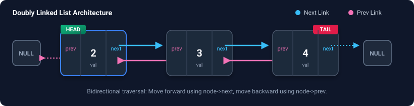

# Doubly Linked List (DLL) — Notes, Diagrams & Code Explanations

A **Doubly Linked List (DLL)** is a bidirectional linked data structure where each node holds:
- **`val`**: The data value.
- **`prev`**: A pointer to the previous node (`nullptr` if the node is `head`).
- **`next`**: A pointer to the next node (`nullptr` if the node is `tail`).

---

## 1. DLL Anatomy & Node Structure



---

# DLL basic operations 1

### Detailed Operation Explanations & Visualizations

#### 1. `deleteHead(head)`
* **Concept:** Deletes the first node and shifts the head pointer to the second node.
* **Key Pointers:**
  1. `newHead = head->next`
  2. `newHead->prev = nullptr`
  3. Disconnect and `delete head`


---

#### 2. `insertBeforeHead1` / `insertBeforeHead2`
* **Concept:** Inserts a new node before `head`, updating `head->prev` and setting `node->next = head`.
* **Complexity:** $O(1)$ Time, $O(1)$ Space.


---

#### 3. `deleteGivenNode(node)` & `deleteKthElement(head, k)`
* **Concept:** Bypasses `node` by connecting `node->prev` directly to `node->next`, then frees memory.
* **Pointers updated:**
  1. `node->prev->next = node->next`
  2. `node->next->prev = node->prev`
  3. `delete node`


---

#### 4. `insertBeforeGivenNode(node, X)` & `insertBeforeTail(head, X)`
* **Concept:** Inserting a new node before an existing given node requires rewiring 4 pointers:
  1. `prevNode->next = newNode`
  2. `newNode->prev = prevNode`
  3. `newNode->next = node`
  4. `node->prev = newNode`

---

```cpp
struct ListNode {
    int val;
    ListNode *next;
    ListNode *prev;
    ListNode()
    {
        val = 0;
        next = NULL;
        prev = NULL;
    }
    ListNode(int data1)
    {
        val = data1;
        next = NULL;
        prev = NULL;
    }
    ListNode(int data1, ListNode *next1, ListNode *prev1)
    {
        val = data1;
        next = next1;
        prev = prev1;
    }
};

// Solution class
class Solution {

    ListNode * deleteHead(ListNode* head) {
        if(head==nullptr || head->next==nullptr) return nullptr;
        ListNode* newHead=head->next;
        newHead->prev=nullptr;
        delete head;
        return newHead;
    }

     ListNode* insertBeforeHead(ListNode* head, int X) {
         ListNode * node=new ListNode(X);
        if(head==nullptr ) return node;

        node->next=head;
        head->prev=node;
        head=node;
        return head;

    }

public:

    ListNode* deleteKthElement(ListNode* head, int k) {
        if(k==1) return deleteHead(head);
        ListNode * curr=head;
        for(int i=1;i<k;i++){
            curr=curr->next;
        }
        ListNode * previous=curr->prev;
        ListNode * after=curr->next;

        previous->next=after;
        if(after!=nullptr) after->prev=previous;

        curr->prev=nullptr;
        curr->next=nullptr;

        delete curr;
        return head;
    }

    /*
    Given a node's reference within a doubly linked list, 
    remove that node from the linked list while preserving the list's integrity.


    You will only be given the node's reference, not the head of the list.
   It is guaranteed that the given node will not be the head of the list. For the custom testcase, give the index(0-indexed) of the node to be removed.

   in case of CLL Update the previous node’s next and next node’s prev, ensuring circularity is maintained
    */
    void deleteGivenNode(ListNode* node) {
        ListNode * previous =node->prev;
        ListNode * after=node->next;

        if(previous!=nullptr) previous->next=after;
        if(after!=nullptr) after->prev=previous;

        node->next = nullptr;
        node->prev = nullptr;

        delete node;

    }
    ListNode* insertBeforeHead1(ListNode* head, int X) {
        ListNode* newHead = new ListNode(X, head, nullptr);
        
        head->prev = newHead;

        return newHead;
    }

    ListNode* insertBeforeHead2(ListNode* head, int X) {
         ListNode * node=new ListNode(X);
        if(head==nullptr ) return node;

        node->next=head;
        head->prev=node;
        head=node;
        return head;

    }

    ListNode* insertBeforeTail(ListNode* head, int X) {
        ListNode * node=new ListNode(X);
        if(head==nullptr) return node;
        if(head->next==nullptr){
            node->next=head;
            head->prev=node;
            head=node;
            return head;
        }
        ListNode * curr=head;
         while (curr->next !=nullptr){
            curr=curr->next;
         }
         ListNode * prevNode=curr->prev;
         prevNode->next=node;
         node->prev=prevNode;
         node->next=curr;
         curr->prev=node;
         return head;
    }
    //O(1) remember to chnage pointers of next and prev node 
    // also prev and next can be accessed by staying on curr node 
    void insertBeforeGivenNode(ListNode* node, int X) {
        ListNode * prevNode=node->prev;
        ListNode * newNode=new ListNode(X);
        if(prevNode!=nullptr) prevNode->next=newNode;
        newNode->next=node;
        newNode->prev=prevNode;
        node->prev=newNode;

    }
    ListNode* insertBeforeKthPosition(ListNode* head, int X, int K) {
        if(K==1) return insertBeforeHead(head,X);
        ListNode * node=new ListNode(X);
        ListNode * curr=head;
        for(int i=1;i<K;i++){
            curr=curr->next;
        }
        ListNode * prevNode=curr->prev;
        prevNode->next=node;
        node->prev=prevNode;
        node->next=curr;
        curr->prev=node;
        return head;
    }
};


ListNode* arrayToLinkedList(vector<int> &nums) {
    if (nums.empty()) return nullptr; 

    ListNode* head = new ListNode(nums[0]); 

    ListNode* prev = head;             

    for (int i=1; i < nums.size(); i++) {

        ListNode* temp = new ListNode(nums[i], nullptr, prev);
        prev->next = temp;    
        prev = temp;         
    }
    return head;  
}

// Helper Function to print the linked list
void printLL(ListNode* head) {
    while (head != NULL) {
        cout << head->val << " ";
        head = head->next;
    }
    cout << endl;
}

int main() {
    vector<int> nums = {2, 3, 4, 5};
    
    ListNode* head = arrayToLinkedList(nums);
    

    cout << "Original List: ";
    printLL(head);

    Solution sol;
    
    head = sol.insertBeforeHead1(head, 1);
    
    // Print the Modified list
    cout << "Modified list: ";
    printLL(head);

    return 0;
}
```

---

# DLL basic operations 2

### Comparative Approach Analysis

#### 1. `arrayToLinkedList1` vs `arrayToLinkedList2`
* **Approach 1 (`arrayToLinkedList1`):** Direct iterative approach. Initializes `head` at `nums[0]`, then iterates $1 \dots N-1$ linking `prev->next = temp` and `temp->prev = prev`.
* **Approach 2 (`arrayToLinkedList2`):** Dummy Node approach (`ListNode(-1)`). Eliminates special head-initialization logic in the loop, then removes and deletes the dummy node before returning.


---

#### 2. `deleteTail1` vs `deleteTail2`
* **Approach 1 (`deleteTail1`):** Traverses all the way to `tail` (`while (tail->next != nullptr)`). Accesses `tail->prev`, disconnects `newTail->next = nullptr`, and deletes `tail`.
* **Approach 2 (`deleteTail2`):** Stops at the second-to-last node (`while (tmp->next->next != nullptr)`). Accesses `node = tmp->next`, disconnects `tmp->next = nullptr`, and deletes `node`.


---

```cpp
#include <bits/stdc++.h>
using namespace std;

struct ListNode
{
    int val;
    ListNode *next;
    ListNode *prev;
    ListNode()
    {
        val = 0;
        next = NULL;
        prev = NULL;
    }
    ListNode(int data1)
    {
        val = data1;
        next = NULL;
        prev = NULL;
    }
    ListNode(int data1, ListNode *next1, ListNode *prev1)
    {
        val = data1;
        next = next1;
        prev = prev1;
    }
};


class Solution {
public:

    ListNode* arrayToLinkedList1(vector<int> &nums) {

        if (nums.empty()) return nullptr; 
        ListNode* head = new ListNode(nums[0]); 
        ListNode* prev = head;             

        for (int i=1; i < nums.size(); i++) {
            ListNode* temp = new ListNode(nums[i], nullptr, prev);
            prev->next = temp;    
            prev = temp;         
        }
        
        return head;  
    }
    //My solution
    ListNode* arrayToLinkedList2(vector<int> &nums) {
        ListNode * tmpHead=new ListNode(-1);
        ListNode * curr=tmpHead;
        for(int n:nums){
            ListNode * tmp=new ListNode(n);
            curr->next=tmp;
            tmp->prev=curr;
            curr=curr->next;
        }

        curr=tmpHead->next;
        curr->prev=nullptr;
        tmpHead->next=nullptr;
        delete tmpHead;
        return curr;
    }

       ListNode* deleteHead1(ListNode* head) {
        if (head == nullptr || head->next == nullptr) 
            return nullptr;

        ListNode* prev = head;      
        head = head->next;    
        head->prev = nullptr;   
        prev->next = nullptr;  
        return head;          
    }

    //My sol
    ListNode * deleteHead2(ListNode* head) {
        if(head==nullptr || head->next==nullptr) return nullptr;
        ListNode* newHead=head->next;
        newHead->prev=nullptr;
        delete head;
        return newHead;
    }

    ListNode* deleteTail1(ListNode* head) {
        if (head == nullptr || head->next == nullptr) {
            return nullptr;  
        }
        
        ListNode* tail = head;
        while (tail->next != nullptr) 
            tail = tail->next; 
        
        ListNode* newTail = tail->prev;
        newTail->next = nullptr;
        tail->prev = nullptr;
        delete tail;  
        
        return head; 
    }

    //My sol
    ListNode* deleteTail2(ListNode* head) {
        if(head==nullptr||head->next==nullptr) return nullptr;
        ListNode * tmp=head;
        while(tmp->next->next!=nullptr){
            tmp=tmp->next;
        }
        ListNode* node =tmp->next;
        node->prev=nullptr;
        tmp->next=nullptr;
        delete node;
        return head;

    }

};

// Helper Function to print the linked list
void printLL(ListNode* head) {
    while (head != NULL) {
        cout << head->val << " ";
        head = head->next;
    }
    cout << endl;
}

int main() {
    vector<int> nums = {1, 2, 3, 4, 5};
    Solution sol;
    ListNode* head = sol.arrayToLinkedList1(nums);

    cout << "The doubly linked list is: ";
    printLL(head);

    return 0;
}
```

---

## 3. Complexity & Operations Quick Reference

| Operation | Time Complexity | Space Complexity | Critical Pointer Handling |
| :--- | :---: | :---: | :--- |
| **`arrayToLinkedList`** | $O(N)$ | $O(1)$ auxiliary | Link `prev->next = temp` & `temp->prev = prev` |
| **`insertBeforeHead`** | $O(1)$ | $O(1)$ | `node->next = head`, `head->prev = node`, return `node` |
| **`insertBeforeTail`** | $O(N)$ | $O(1)$ | Stop before tail, wire 4 pointers |
| **`insertBeforeGivenNode`** | $O(1)$ | $O(1)$ | Access `node->prev` directly, rewire 4 pointers |
| **`insertBeforeKthPosition`** | $O(K)$ | $O(1)$ | Loop $K-1$ steps, rewire 4 pointers |
| **`deleteHead`** | $O(1)$ | $O(1)$ | `newHead = head->next`, `newHead->prev = nullptr`, `delete head` |
| **`deleteTail`** | $O(N)$ | $O(1)$ | `newTail = tail->prev`, `newTail->next = nullptr`, `delete tail` |
| **`deleteGivenNode`** | $O(1)$ | $O(1)$ | `prev->next = after`, `after->prev = prev`, `delete node` |
| **`deleteKthElement`** | $O(K)$ | $O(1)$ | Traverse to $K$, bypass pointers and delete |