# Question 1: Middle of the Linked List (LeetCode 876) `[Easy]`

> **Companies:** Amazon (5), Apple (4), Adobe (4), Google (3), Microsoft (2), Facebook (2)  
> 📌 **Key Rule:** *Here we need the **2nd middle** for Even-length Linked Lists.*

#### Problem Statement
Given the `head` of a singly linked list, return the **middle node** of the linked list.

If the linked list has an **even number of nodes**, return the **second middle node**.

---

#### Examples

**Example 1 (Odd Length):**
```text
Input:  head = [1, 2, 3, 4, 5]
Output: [3, 4, 5]
Explanation: The list has 5 nodes (odd), so the single middle node is node 3 with value 3.
```

**Example 2 (Even Length — 2nd Middle):**
```text
Input:  head = [1, 2, 3, 4, 5, 6]
Output: [4, 5, 6]
Explanation: Since the list has 6 nodes (even), there are two middle nodes (3 and 4). We return the 2nd middle node (node 4).
```

---

#### Constraints:
* The number of nodes in the list is in the range `[1, 100]`.
* `1 <= Node.val <= 100`


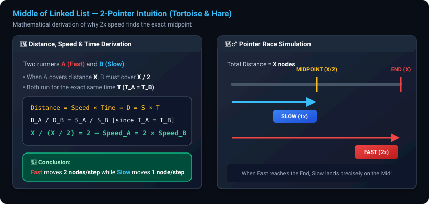

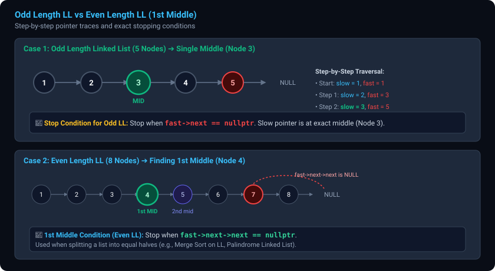

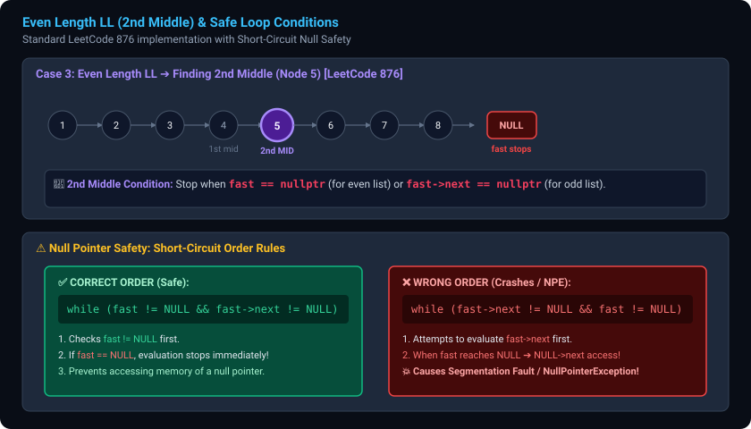

---


```cpp
class Solution {
public:
    ListNode* middleOfLinkedList(ListNode* head) {
        if(head==nullptr || head->next==nullptr) return head;
        ListNode * fast=head;
        ListNode * slow=head;
        while(fast!=nullptr && fast->next!=nullptr){
            slow=slow->next;
            fast=fast->next->next;
        }
        return slow;

    }
};
```

```java
class Solution {
    public ListNode middleNode(ListNode head) {
        if (head == null || head.next == null) return head;
        ListNode slow = head;
        ListNode fast = head;
        while (fast != null && fast.next != null) {
            slow = slow.next;
            fast = fast.next.next;
        }
        return slow;
    }
}
```


# Question 2: Delete the Middle Node of a Linked List (LeetCode 2095) `[Medium]`

> 📌 **Core Pattern:** **Two-Pointer (Slow & Fast)** + **Tracking `prev` / Dummy Node**

#### Problem Statement
You are given the `head` of a linked list. Delete the **middle node**, and return the `head` of the modified linked list.

The **middle node** of a linked list of size $n$ is the $\lfloor n / 2 \rfloor$-th node from the start using **0-based indexing**, where $\lfloor x \rfloor$ denotes the largest integer less than or equal to $x$.
- For $n = 1, 2, 3, 4, 5$, the middle nodes are index $0, 1, 1, 2, 2$ respectively.

---

#### 💡 Core Intuition & Edge Cases
1. **Edge Case:** If the list has only 1 node ($n = 1$), deleting the middle node results in an empty list (`return nullptr` / `return null`).
2. **2nd Middle Target:** For even lengths (e.g., $n = 4$), we delete index $\lfloor 4/2 \rfloor = 2$ (the 3rd node). This matches the **2nd Middle** fast-slow condition:
   ```cpp
   while (fast != nullptr && fast->next != nullptr)
   ```
3. **Pointer Relinking:** We keep a `temp` (or `prev`) pointer one step behind `slow`. When `fast` reaches the end, `temp->next = slow->next;` and we delete `slow`.

---

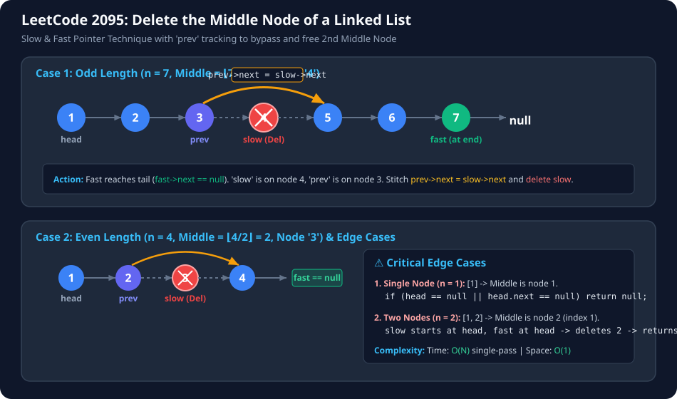

---

#### C++ Implementation:
```cpp
class Solution {
public:
    ListNode* deleteMiddle(ListNode* head) {
        if(head == nullptr || head->next == nullptr) return nullptr;
        ListNode *fast = head;
        ListNode *slow = head;
        ListNode *temp = nullptr;
        while(fast != nullptr && fast->next != nullptr){
            temp = (temp == nullptr) ? slow : (temp->next);
            slow = slow->next;
            fast = fast->next->next;
        }
        temp->next = slow->next;
        delete(slow);
        return head;
    }
};
```

#### Java Implementation:
```java
class Solution {
    public ListNode deleteMiddle(ListNode head) {
        if (head == null || head.next == null) return null;
        
        ListNode slow = head;
        ListNode fast = head;
        ListNode prev = null;
        
        while (fast != null && fast.next != null) {
            prev = slow;
            slow = slow.next;
            fast = fast.next.next;
        }
        
        // Unlink the middle node
        prev.next = slow.next;
        return head;
    }
}
```

> **Complexity:**
> - **Time Complexity:** $O(N)$ single pass
> - **Space Complexity:** $O(1)$ in-place deletion

---

### 📌 Key Recap: Default Middle Condition for Multi-Step LL Problems
> In most multi-step problems (e.g., **Palindrome Linked List**, **Sort List / Merge Sort**, **Reorder List**), we need the **1st Middle** of Even-length lists:
> ```cpp
> if (fast->next != nullptr && fast->next->next != nullptr)
> ```

---

# Question 3: Reverse Linked List (LeetCode 206) `[Easy]`

### 💡 Core Intuition & Why 3 Pointers Are Required
To reverse a singly linked list in-place ($O(N)$ time, $O(1)$ auxiliary space), we must reorient every `curr->next` pointer backwards.

#### The 3-Pointer Roles:
1. `prev` (`nullptr` initially): Points to the previous node (becomes the target for `curr->next`).
2. `curr` (`head` initially): The node currently having its link inverted.
3. `storage` / `next`: **Temporary anchor** to hold the remaining list so it isn't lost when `curr->next` is severed.

#### The 4-Step Loop Mechanics:
```cpp
while (curr != nullptr) {
    ListNode* storage = curr->next; // 1. Save next node (prevent losing rest of LL)
    curr->next = prev;              // 2. Reverse current pointer backwards
    prev = curr;                    // 3. Move prev forward to curr
    curr = storage;                 // 4. Move curr forward to saved next node
}
return prev;                        // prev is the new head!
```

---

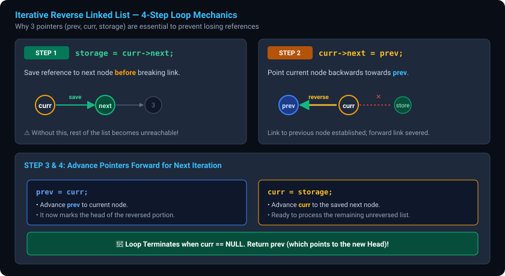

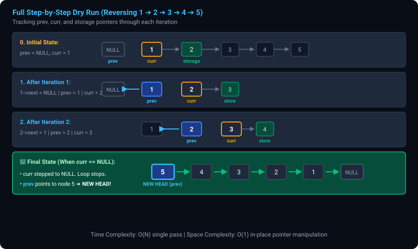

---

#### C++ Implementation:
```cpp
class Solution {
   ListNode* reverse(ListNode* head){
       ListNode *curr = head;
       ListNode *prev = nullptr;

       while(curr != nullptr){
           ListNode *storage = curr->next;
           curr->next = prev;
           prev = curr;
           curr = storage;
       }

       return prev;
   }
public:
    ListNode* reverseList(ListNode* head) {
        if(head == nullptr || head->next == nullptr) return head;
        return reverse(head);
    }
};
```

#### Java Implementation:
```java
class Solution {
    public ListNode reverseList(ListNode head) {
        ListNode prev = null;
        ListNode curr = head;
        
        while (curr != null) {
            ListNode storage = curr.next; // backup
            curr.next = prev;             // reverse link
            prev = curr;                  // move prev
            curr = storage;               // move curr
        }
        
        return prev;
    }
}
```

> **Complexity:**
> - **Time Complexity:** $O(N)$ single pass
> - **Space Complexity:** $O(1)$ in-place reversal

---

# Question 4: Merge Two Sorted Lists (LeetCode 21) `[Easy]`

> 📌 **Core Pattern:** **Dummy Node Pattern** + **In-Place Two-Pointer Splicing**

#### Problem Statement
You are given the heads of two sorted linked lists `list1` and `list2`. Merge the two lists into one **sorted** list by splicing together the nodes of the first two lists. Return the *head of the merged linked list*.

---

#### 💡 Core Intuitions:
1. **The Dummy Node Pattern (`ListNode* dummy = new ListNode(-1)`):**
   - In problems where we don't know beforehand which list will provide the **first node (Head)**, we create a temporary `dummy` node.
   - We maintain a moving pointer `prev = dummy` to stitch the nodes in sorted order.
   - At the end, `dummy->next` points directly to the real merged head!
2. **$O(1)$ Remainder Splicing:**
   - When one list runs out (`c1 == nullptr` or `c2 == nullptr`), we do not need a loop to copy the rest.
   - Since both lists are already sorted, we simply attach the entire remaining non-null list in $O(1)$:
     ```cpp
     prev->next = (c1 != nullptr) ? c1 : c2;
     ```

---

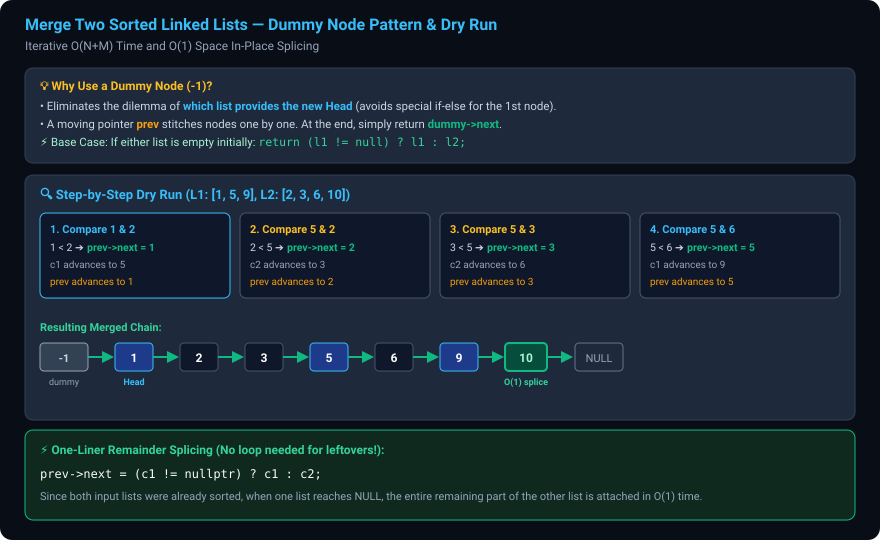

---

#### C++ Implementation:
```cpp
ListNode *mergeTwoLists(ListNode *l1, ListNode *l2)
{
    if (l1 == nullptr || l2 == nullptr)
        return l1 != nullptr ? l1 : l2;

    ListNode *dummy = new ListNode(-1);
    ListNode *prev = dummy;

    ListNode *c1 = l1;
    ListNode *c2 = l2;

    while (c1 != nullptr && c2 != nullptr)
    {
        if (c1->val <= c2->val)
        {
            prev->next = c1;
            c1 = c1->next;
        }
        else
        {
            prev->next = c2;
            c2 = c2->next;
        }

        prev = prev->next;
    }

    prev->next = c1 != nullptr ? c1 : c2;

    ListNode *h = dummy->next;
    dummy->next = nullptr;
    delete dummy;
    return h;
}
```

#### Java Implementation:
```java
class Solution {
    public ListNode mergeTwoLists(ListNode list1, ListNode list2) {
        if (list1 == null || list2 == null) {
            return (list1 != null) ? list1 : list2;
        }

        ListNode dummy = new ListNode(-1);
        ListNode prev = dummy;

        ListNode c1 = list1;
        ListNode c2 = list2;

        while (c1 != null && c2 != null) {
            if (c1.val <= c2.val) {
                prev.next = c1;
                c1 = c1.next;
            } else {
                prev.next = c2;
                c2 = c2.next;
            }
            prev = prev.next;
        }

        prev.next = (c1 != null) ? c1 : c2;

        return dummy.next;
    }
}
```

> **Complexity:**
> - **Time Complexity:** $O(N + M)$ single pass over both lists
> - **Space Complexity:** $O(1)$ in-place node relinking (optimal)

---

# Question 5: Palindrome Linked List (LeetCode 234) `[Easy / Medium Pattern]`

> 📌 **Core Pattern:** **1st Mid** ➔ **Reverse 2nd Half** ➔ **Simultaneous Compare** ➔ **Restore Original List**

#### Problem Statement
Given the `head` of a singly linked list, return `true` if it is a palindrome or `false` otherwise.

**Examples:**
- Input: `head = [1, 2, 2, 1]` $\to$ Output: `true`
- Input: `head = [1, 2, 3, 2, 1]` $\to$ Output: `true`
- Input: `head = [1, 2]` $\to$ Output: `false`

---

#### 💡 Why Do We Reverse the 2nd Half?
In arrays or strings, we can check for a palindrome using two pointers starting from `start = 0` and `end = n - 1` moving inward (`start++`, `end--`). 
However, in a singly linked list, **we cannot traverse backwards from the end**. 

To overcome this limitation in $O(1)$ space:
1. Find the **1st Middle** node using `while(fast->next != nullptr && fast->next->next != nullptr)`.
2. Disconnect and **reverse the 2nd half** starting at `mid->next`.
3. Compare the 1st half (`head`) and the reversed 2nd half (`nhead`) node-by-node.
4. **Restore the original list** before returning to maintain good engineering practice (zero side-effects).

---

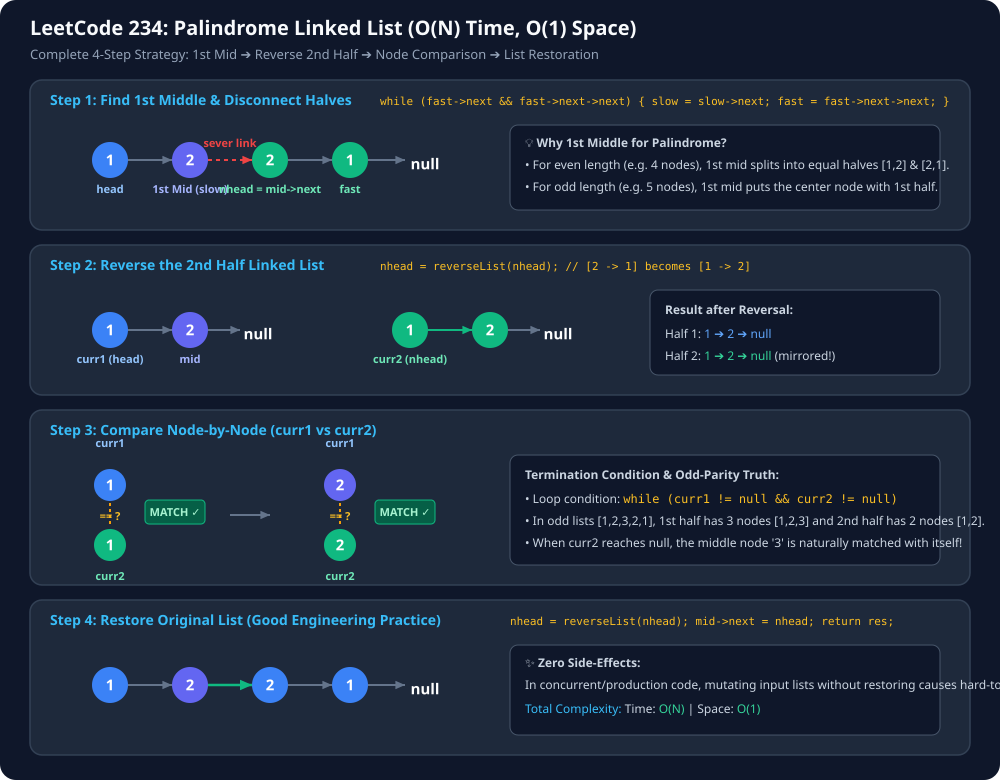

---

#### C++ Implementation:
```cpp
class Solution {
private:
    ListNode* midNode(ListNode* head) {
        if (head == nullptr || head->next == nullptr) return head;
        ListNode* slow = head;
        ListNode* fast = head;
        while (fast->next != nullptr && fast->next->next != nullptr) {
            slow = slow->next;
            fast = fast->next->next;
        }
        return slow;
    }

    ListNode* reverseList(ListNode* head) {
        if (head == nullptr || head->next == nullptr) return head;
        ListNode* prev = nullptr;
        ListNode* curr = head;
        while (curr != nullptr) {
            ListNode* forw = curr->next;
            curr->next = prev;
            prev = curr;
            curr = forw;
        }
        return prev;
    }

public:
    bool isPalindrome(ListNode* head) {
        if (head == nullptr || head->next == nullptr) return true;

        // 1. Find 1st middle and disconnect
        ListNode* mid = midNode(head);
        ListNode* nhead = mid->next;
        mid->next = nullptr;

        // 2. Reverse 2nd half
        nhead = reverseList(nhead);

        // 3. Compare both halves
        ListNode* curr1 = head;
        ListNode* curr2 = nhead;
        bool res = true;

        while (curr1 != nullptr && curr2 != nullptr) {
            if (curr1->val != curr2->val) {
                res = false;
                break;
            }
            curr1 = curr1->next;
            curr2 = curr2->next;
        }

        // 4. Restore original list structure
        nhead = reverseList(nhead);
        mid->next = nhead;

        return res;
    }
};
```

#### Java Implementation:
```java
class Solution {
    private ListNode midNode(ListNode head) {
        if (head == null || head.next == null) return head;
        ListNode slow = head;
        ListNode fast = head;
        while (fast.next != null && fast.next.next != null) {
            slow = slow.next;
            fast = fast.next.next;
        }
        return slow;
    }

    private ListNode reverseList(ListNode head) {
        ListNode prev = null;
        ListNode curr = head;
        while (curr != null) {
            ListNode forw = curr.next;
            curr.next = prev;
            prev = curr;
            curr = forw;
        }
        return prev;
    }

    public boolean isPalindrome(ListNode head) {
        if (head == null || head.next == null) return true;

        // 1. Find 1st middle and isolate 2nd half
        ListNode mid = midNode(head);
        ListNode nhead = mid.next;
        mid.next = null;

        // 2. Reverse 2nd half
        nhead = reverseList(nhead);

        // 3. Compare values
        ListNode curr1 = head;
        ListNode curr2 = nhead;
        boolean res = true;

        while (curr1 != null && curr2 != null) {
            if (curr1.val != curr2.val) {
                res = false;
                break;
            }
            curr1 = curr1.next;
            curr2 = curr2.next;
        }

        // 4. Restore the original list
        nhead = reverseList(nhead);
        mid.next = nhead;

        return res;
    }
}
```

> **Complexity:**
> - **Time Complexity:** $O(N)$ (Find Mid $\approx N/2$ + Reverse $\approx N/2$ + Compare $\approx N/2$ + Restore $\approx N/2 = O(N)$)
> - **Space Complexity:** $O(1)$ in-place pointer modifications

---

# Question 6: Reorder List (LeetCode 143) `[Medium]`

> 📌 **Core Pattern:** **1st Mid** ➔ **Reverse 2nd Half** ➔ **Alternating Dummy Merge**

#### Problem Statement
You are given the head of a singly linked-list. The list can be represented as:
$$L_0 \to L_1 \to \dots \to L_{n - 1} \to L_n$$

Reorder the list to be in the following form:
$$L_0 \to L_n \to L_1 \to L_{n - 1} \to L_2 \to L_{n - 2} \to \dots$$

You may not modify the values in the list's nodes. Only nodes themselves may be changed.

**Examples:**
- Input: `head = [1, 2, 3, 4]` $\to$ Output: `[1, 4, 2, 3]`
- Input: `head = [1, 2, 3, 4, 5]` $\to$ Output: `[1, 5, 2, 4, 3]`

---

#### 💡 Algorithm & Intuition:
1. **Find 1st Middle:** Split list into two halves `h1` and `h2`:
   - E.g., `[1, 2, 3, 4, 5]` $\to$ `h1 = [1, 2, 3]` and `mid->next = null`.
2. **Reverse 2nd Half:**
   - `h2 = reverse([4, 5]) = [5, 4]`.
3. **Alternating Merge:**
   - We need to attach 1st node from `h1`, then 1st from `h2`, 2nd from `h1`, 2nd from `h2`...
   - Using a `dummy` node:
     - `dummy->next = h1; h1 = h1->next; dummy = dummy->next;`
     - `dummy->next = h2; h2 = h2->next; dummy = dummy->next;`
   - Since `h1` is always equal to or 1 node longer than `h2`, the loop condition is simply `while (h2 != null)`.
   - After the loop, attach the remaining `h1` node: `dummy->next = h1;`.

---

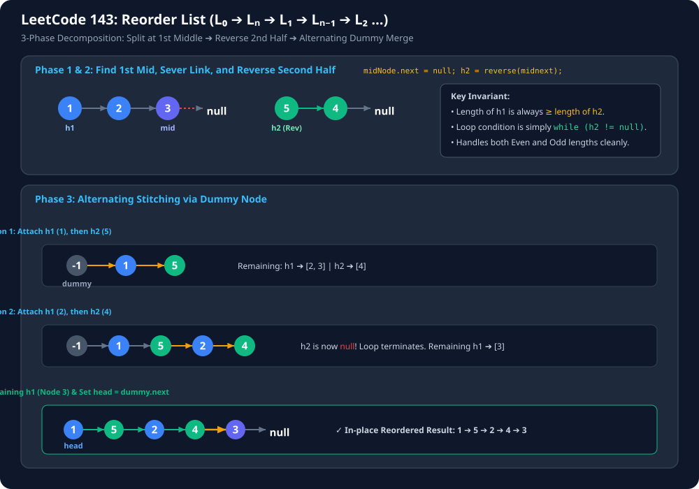

---

#### C++ Implementation:
```cpp
class Solution {
private:
    ListNode* midNode(ListNode* head) {
        if (head == nullptr || head->next == nullptr) return head;
        ListNode* slow = head;
        ListNode* fast = head;
        while (fast->next != nullptr && fast->next->next != nullptr) {
            slow = slow->next;
            fast = fast->next->next;
        }
        return slow;
    }

    ListNode* reverseList(ListNode* head) {
        ListNode* prev = nullptr;
        ListNode* curr = head;
        while (curr != nullptr) {
            ListNode* forw = curr->next;
            curr->next = prev;
            prev = curr;
            curr = forw;
        }
        return prev;
    }

public:
    void reorderList(ListNode* head) {
        if (head == nullptr || head->next == nullptr) return;

        // 1. Find 1st middle and split
        ListNode* mid = midNode(head);
        ListNode* midNext = mid->next;
        mid->next = nullptr;

        // 2. Reverse 2nd half
        ListNode* h2 = reverseList(midNext);
        ListNode* h1 = head;

        // 3. Alternating merge using dummy node
        ListNode* dummy = new ListNode(-1);
        ListNode* tmp = dummy;

        while (h2 != nullptr) {
            tmp->next = h1;
            h1 = h1->next;
            tmp = tmp->next;

            tmp->next = h2;
            h2 = h2->next;
            tmp = tmp->next;
        }

        // Attach last odd node if present
        tmp->next = h1;
        head = dummy->next;
        delete dummy;
    }
};
```

#### Java Implementation:
```java
class Solution {
    private ListNode mid(ListNode head) {
        if (head == null || head.next == null) return head;
        ListNode slow = head;
        ListNode fast = head;
        while (fast.next != null && fast.next.next != null) {
            slow = slow.next;
            fast = fast.next.next;
        }
        return slow;
    }

    private ListNode reverse(ListNode head) {
        ListNode prev = null;
        ListNode curr = head;
        while (curr != null) {
            ListNode forward = curr.next;
            curr.next = prev;
            prev = curr;
            curr = forward;
        }
        return prev;
    }

    public void reorderList(ListNode head) {
        if (head == null || head.next == null) return;

        ListNode midnode = mid(head);
        ListNode midnext = midnode.next;
        midnode.next = null;

        ListNode h2 = reverse(midnext);
        ListNode h1 = head;
        ListNode dummy = new ListNode(-1);
        ListNode tmp = dummy;

        while (h2 != null) {
            tmp.next = h1;
            h1 = h1.next;
            tmp = tmp.next;

            tmp.next = h2;
            h2 = h2.next;
            tmp = tmp.next;
        }

        tmp.next = h1;
        head = dummy.next;
    }
}
```

> **Complexity:**
> - **Time Complexity:** $O(N)$
> - **Space Complexity:** $O(1)$ in-place

---

# Question 7: Sort List / Merge Sort on Linked List (LeetCode 148) `[Medium]`

> 📌 **Core Pattern:** **Divide & Conquer (Merge Sort)** + **1st Mid Split** + **Merge Two Sorted Lists**

#### Problem Statement
Given the `head` of a linked list, return the list after sorting it in **ascending order**.
Solve it in $O(N \log N)$ time complexity and $O(\log N)$ or $O(1)$ memory.

**Examples:**
- Input: `head = [4, 2, 1, 3]` $\to$ Output: `[1, 2, 3, 4]`
- Input: `head = [-1, 5, 3, 4, 0]` $\to$ Output: `[-1, 0, 3, 4, 5]`

---

#### 💡 Intuition & Why Merge Sort is King for Linked Lists:
- Arrays require $O(N)$ extra space for merging because elements must be copied into a temporary buffer.
- Linked Lists, however, can be merged **in-place in $O(1)$ auxiliary space** simply by rearranging pointers!
- **Crucial Invariant:** We **MUST** find the **1st Middle** (`fast->next != nullptr && fast->next->next != nullptr`). If you use 2nd middle on a 2-node list `[1, 2]`, `mid` is `2`, leaving `l1 = [1, 2]` and `l2 = []`, causing an **infinite recursion stack overflow**.

---

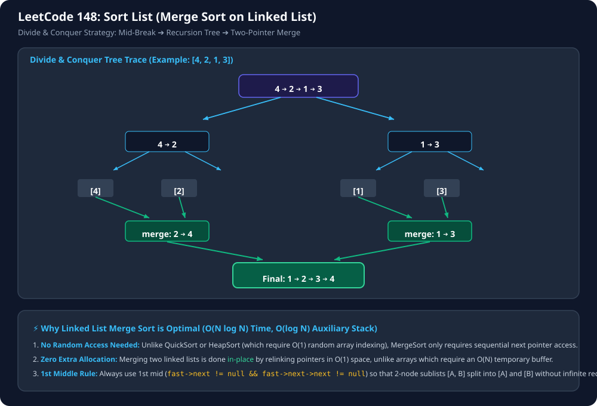

---

#### C++ Implementation:
```cpp
class Solution {
private:
    ListNode* midNode(ListNode* head) {
        if (head == nullptr || head->next == nullptr) return head;
        ListNode* slow = head;
        ListNode* fast = head;
        while (fast->next != nullptr && fast->next->next != nullptr) {
            slow = slow->next;
            fast = fast->next->next;
        }
        return slow;
    }

    ListNode* merge(ListNode* l1, ListNode* l2) {
        if (l1 == nullptr || l2 == nullptr) return l1 != nullptr ? l1 : l2;
        ListNode dummy(-1);
        ListNode* prev = &dummy;

        while (l1 != nullptr && l2 != nullptr) {
            if (l1->val <= l2->val) {
                prev->next = l1;
                l1 = l1->next;
            } else {
                prev->next = l2;
                l2 = l2->next;
            }
            prev = prev->next;
        }
        prev->next = (l1 != nullptr) ? l1 : l2;
        return dummy.next;
    }

public:
    ListNode* sortList(ListNode* head) {
        if (head == nullptr || head->next == nullptr) return head;

        // 1. Divide: Find 1st middle and disconnect
        ListNode* mid = midNode(head);
        ListNode* head2 = mid->next;
        mid->next = nullptr;

        // 2. Conquer: Recursively sort halves
        ListNode* res1 = sortList(head);
        ListNode* res2 = sortList(head2);

        // 3. Combine: Merge sorted halves
        return merge(res1, res2);
    }
};
```

#### Java Implementation:
```java
class Solution {
    private ListNode mid(ListNode head) {
        if (head == null || head.next == null) return head;
        ListNode slow = head;
        ListNode fast = head;
        while (fast.next != null && fast.next.next != null) {
            slow = slow.next;
            fast = fast.next.next;
        }
        return slow;
    }

    private ListNode merge(ListNode l1, ListNode l2) {
        if (l1 == null || l2 == null) return (l1 != null) ? l1 : l2;
        ListNode dummy = new ListNode(-1);
        ListNode prev = dummy;

        while (l1 != null && l2 != null) {
            if (l1.val <= l2.val) {
                prev.next = l1;
                l1 = l1.next;
            } else {
                prev.next = l2;
                l2 = l2.next;
            }
            prev = prev.next;
        }
        prev.next = (l1 != null) ? l1 : l2;
        return dummy.next;
    }

    public ListNode sortList(ListNode head) {
        if (head == null || head.next == null) return head;

        ListNode midnode = mid(head);
        ListNode mnext = midnode.next;
        midnode.next = null;

        ListNode l1 = sortList(head);
        ListNode l2 = sortList(mnext);

        return merge(l1, l2);
    }
}
```

> **Complexity:**
> - **Time Complexity:** $O(N \log N)$
> - **Space Complexity:** $O(\log N)$ recursive call stack

---

# Question 8: Partition List (LeetCode 86) `[Medium]`

> 📌 **Core Pattern:** **Two-Dummy Sentinels** (`< x` and `≥ x`) + **Tail Nullification**

#### Problem Statement
Given the `head` of a linked list and a value `x`, partition it such that all nodes **less than** `x` come before nodes **greater than or equal to** `x`.
You should **preserve the original relative order** of the nodes in each of the two partitions.

**Examples:**
- Input: `head = [1, 4, 3, 2, 5, 2], x = 3` $\to$ Output: `[1, 2, 2, 4, 3, 5]`
- Input: `head = [2, 1], x = 2` $\to$ Output: `[1, 2]`

---

#### 💡 Intuition & Pitfall:
1. Maintain two dummy chains:
   - `dummy1` tracks all nodes with `val < x`.
   - `dummy2` tracks all nodes with `val >= x`.
2. As we iterate through `curr`, link node to `dummy1` or `dummy2` and advance `curr`.
3. ⚠️ **The Cycle Trap:** Always set `dummy2->next = nullptr` at the end! If the last node in the original list went to `dummy1`, `dummy2`'s tail still holds a reference pointing back to it, causing an **infinite loop**.
4. Bridge the chains: `dummy1->next = h2->next;` and return `h1->next`.

---

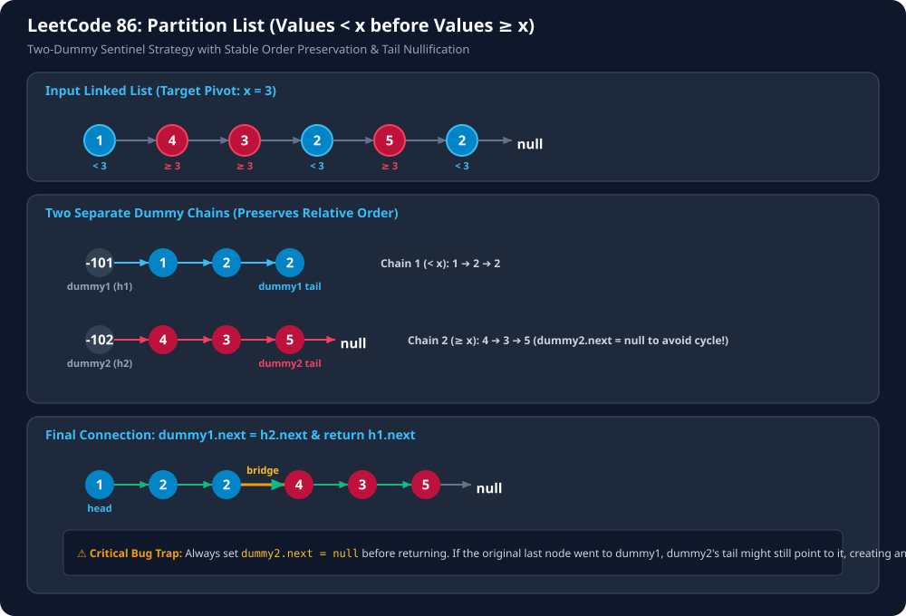

---

#### C++ Implementation:
```cpp
class Solution {
public:
    ListNode* partition(ListNode* head, int x) {
        if (head == nullptr || head->next == nullptr) return head;

        ListNode* dummy1 = new ListNode(-101); // < x
        ListNode* dummy2 = new ListNode(-102); // >= x
        ListNode* h1 = dummy1;
        ListNode* h2 = dummy2;
        ListNode* curr = head;

        while (curr != nullptr) {
            if (curr->val < x) {
                dummy1->next = curr;
                curr = curr->next;
                dummy1 = dummy1->next;
                dummy1->next = nullptr;
            } else {
                dummy2->next = curr;
                curr = curr->next;
                dummy2 = dummy2->next;
                dummy2->next = nullptr;
            }
        }

        // Connect the two partitions
        dummy1->next = h2->next;
        ListNode* res = h1->next;

        delete dummy1;
        delete dummy2;
        return res;
    }
};
```

#### Java Implementation:
```java
class Solution {
    public ListNode partition(ListNode head, int x) {
        if (head == null || head.next == null) return head;

        ListNode dummy1 = new ListNode(-101); // < x
        ListNode dummy2 = new ListNode(-102); // >= x
        ListNode h1 = dummy1;
        ListNode h2 = dummy2;
        ListNode curr = head;

        while (curr != null) {
            if (curr.val < x) {
                dummy1.next = curr;
                curr = curr.next;
                dummy1 = dummy1.next;
                dummy1.next = null;
            } else {
                dummy2.next = curr;
                curr = curr.next;
                dummy2 = dummy2.next;
                dummy2.next = null;
            }
        }

        dummy1.next = h2.next;
        return h1.next;
    }
}
```

> **Complexity:**
> - **Time Complexity:** $O(N)$ single pass
> - **Space Complexity:** $O(1)$ in-place relinking

---

# Question 9: Segregate Odd and Even Nodes in Linked List / Odd Even Linked List (LeetCode 328) `[Medium]`

> 📌 **Core Pattern:** **Index Parity Partitioning** (`Odd Indices` then `Even Indices`)

#### Problem Statement
Given the `head` of a singly linked list, group all the nodes with **odd indices** together followed by the nodes with **even indices**, and return the reordered list.

The **first** node is considered odd (index 1), the **second** node is even (index 2), and so on.
Note that the relative order inside both the odd and even groups must remain as it was in the input.

Solve it in $O(1)$ extra space complexity and $O(N)$ time complexity.

**Examples:**
- Input: `head = [1, 2, 3, 4, 5]` $\to$ Output: `[1, 3, 5, 2, 4]`
- Input: `head = [2, 1, 3, 5, 6, 4, 7]` $\to$ Output: `[2, 3, 6, 7, 1, 5, 4]`

---

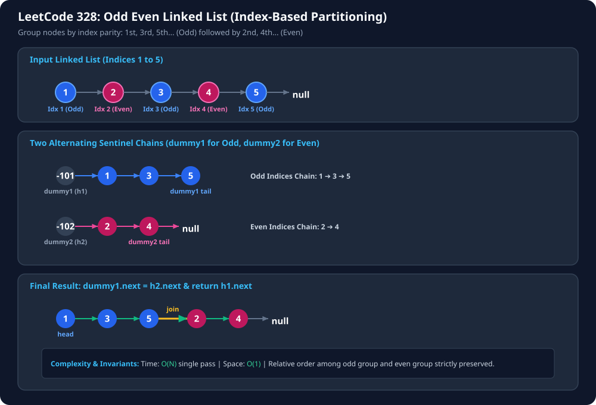

---

#### C++ Implementation:
```cpp
class Solution {
public:
    ListNode* oddEvenList(ListNode* head) {
        if (head == nullptr || head->next == nullptr) return head;

        ListNode* odd = new ListNode(-1);
        ListNode* even = new ListNode(-1);
        ListNode* h1 = odd;
        ListNode* h2 = even;
        ListNode* curr = head;
        int index = 1;

        while (curr != nullptr) {
            if (index % 2 != 0) {
                h1->next = curr;
                h1 = h1->next;
            } else {
                h2->next = curr;
                h2 = h2->next;
            }
            curr = curr->next;
            index++;
        }

        h1->next = even->next;
        h2->next = nullptr;

        ListNode* res = odd->next;
        delete odd;
        delete even;
        return res;
    }
};
```

#### Java Implementation:
```java
class Solution {
    public ListNode oddEvenList(ListNode head) {
        if (head == null || head.next == null) return head;

        ListNode dummy1 = new ListNode(-101); // Odd index chain
        ListNode dummy2 = new ListNode(-102); // Even index chain
        ListNode h1 = dummy1;
        ListNode h2 = dummy2;
        ListNode curr = head;

        while (curr != null) {
            dummy1.next = curr;
            curr = curr.next;
            dummy1 = dummy1.next;
            dummy1.next = null;

            if (curr != null) {
                dummy2.next = curr;
                curr = curr.next;
                dummy2 = dummy2.next;
                dummy2.next = null;
            }
        }

        dummy1.next = h2.next;
        return h1.next;
    }
}
```

> **Complexity:**
> - **Time Complexity:** $O(N)$
> - **Space Complexity:** $O(1)$

---

# Question 10: Unfold of Reorder Linked List (Inverse of Reorder List) `[Important Interview Question]`

> 📌 **Core Pattern:** **Parity Partition** ➔ **Reverse 2nd List** ➔ **Stitch**

#### Problem Statement
Given a linked list that was produced by **Reorder List** ($L_0 \to L_n \to L_1 \to L_{n-1} \to \dots$), restore and unfold it back into its original sequential order ($L_0 \to L_1 \to L_2 \to \dots \to L_n$).

**Examples:**
- Input: `1 -> 7 -> 2 -> 6 -> 3 -> 5 -> 4 -> null`
- Output: `1 -> 2 -> 3 -> 4 -> 5 -> 6 -> 7 -> null`

---

#### 💡 Algorithm & Intuition:
1. **Odd/Even Index Extraction:**
   - List 1 (Odd positions): `1 -> 2 -> 3 -> 4` (collected in `dummy1`).
   - List 2 (Even positions): `7 -> 6 -> 5` (collected in `dummy2`).
2. **Reverse List 2:**
   - `reverseList(7 -> 6 -> 5)` yields `5 -> 6 -> 7`.
3. **Stitch List 1 and Reversed List 2:**
   - Connect the tail of List 1 to the head of the reversed List 2:
     ```cpp
     dummy1->next = reverseList(h2->next);
     ```
   - Result: `1 -> 2 -> 3 -> 4 -> 5 -> 6 -> 7 -> null`!

---

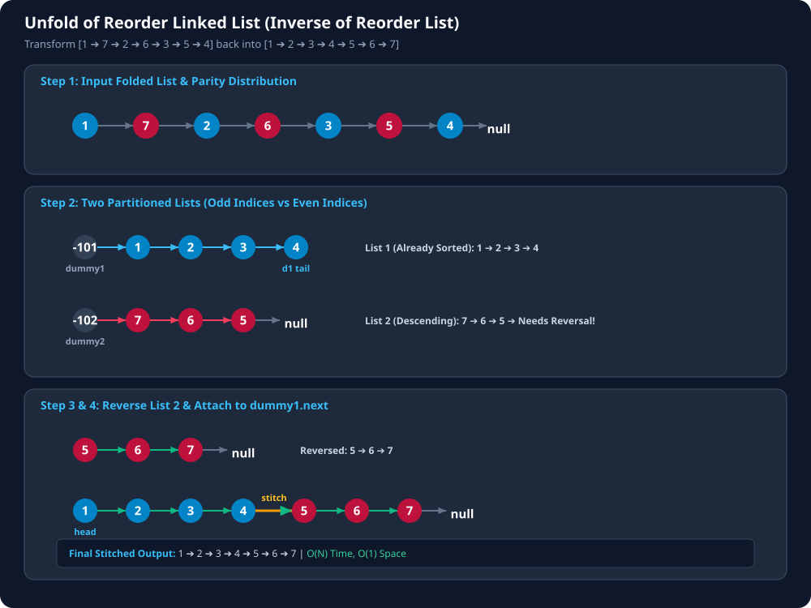

---

#### C++ Implementation:
```cpp
class Solution {
private:
    ListNode* reverseList(ListNode* head) {
        ListNode* prev = nullptr;
        ListNode* curr = head;
        while (curr != nullptr) {
            ListNode* storage = curr->next;
            curr->next = prev;
            prev = curr;
            curr = storage;
        }
        return prev;
    }

public:
    void unfold(ListNode* head) {
        if (head == nullptr || head->next == nullptr) return;

        ListNode* dummy1 = new ListNode(-101);
        ListNode* dummy2 = new ListNode(-102);
        ListNode* h1 = dummy1;
        ListNode* h2 = dummy2;
        ListNode* curr = head;

        while (curr != nullptr) {
            dummy1->next = curr;
            curr = curr->next;
            dummy1 = dummy1->next;
            dummy1->next = nullptr;

            if (curr != nullptr) {
                dummy2->next = curr;
                curr = curr->next;
                dummy2 = dummy2->next;
                dummy2->next = nullptr;
            }
        }

        dummy1->next = reverseList(h2->next);
        head = h1->next;

        delete dummy1;
        delete dummy2;
    }
};
```

#### Java Implementation:
```java
public class Solution {
    public static ListNode reverseList(ListNode head) {
        if (head == null || head.next == null) return head;
        ListNode curr = head;
        ListNode prev = null;
        ListNode storage = null;
        while (curr != null) {
            storage = curr.next;
            curr.next = prev;
            prev = curr;
            curr = storage;
        }
        return prev;
    }

    public static void unfold(ListNode head) {
        if (head == null || head.next == null) return;
        ListNode dummy1 = new ListNode(-101);
        ListNode dummy2 = new ListNode(-102);
        ListNode h1 = dummy1;
        ListNode h2 = dummy2;
        ListNode curr = head;

        while (curr != null) {
            dummy1.next = curr;
            curr = curr.next;
            dummy1 = dummy1.next;
            dummy1.next = null;

            if (curr != null) {
                dummy2.next = curr;
                curr = curr.next;
                dummy2 = dummy2.next;
                dummy2.next = null;
            }
        }

        dummy1.next = reverseList(h2.next);
        head = h1.next;
    }
}
```

> **Complexity:**
> - **Time Complexity:** $O(N)$
> - **Space Complexity:** $O(1)$ in-place modification
