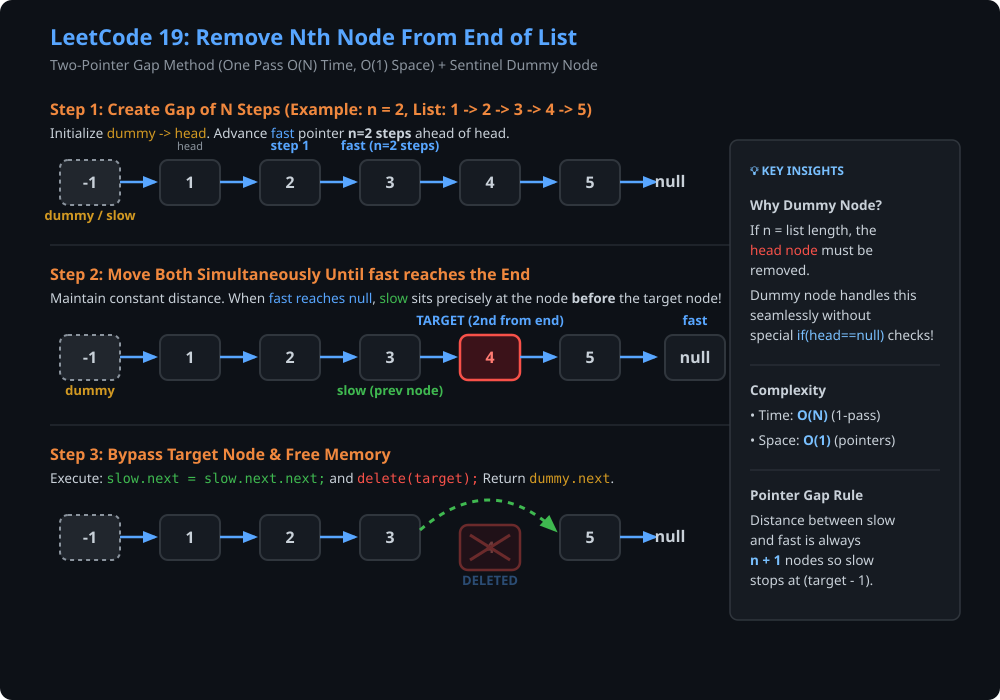
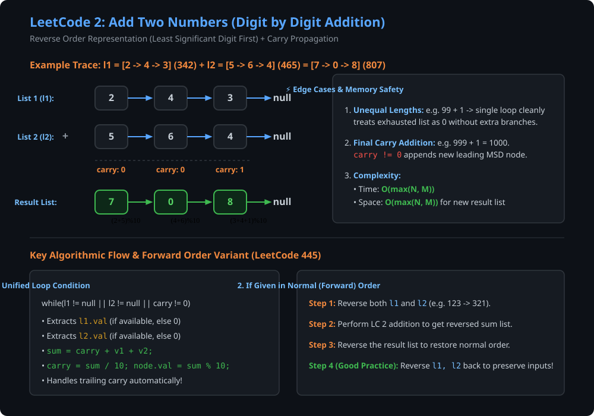
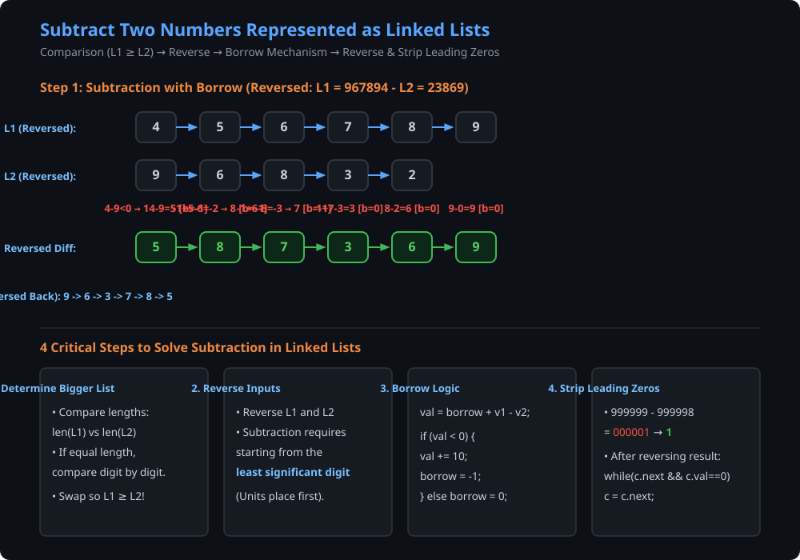
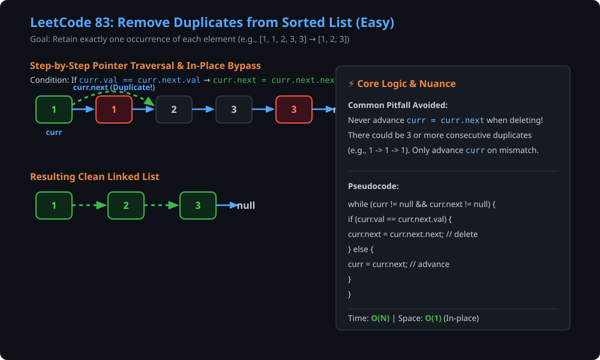
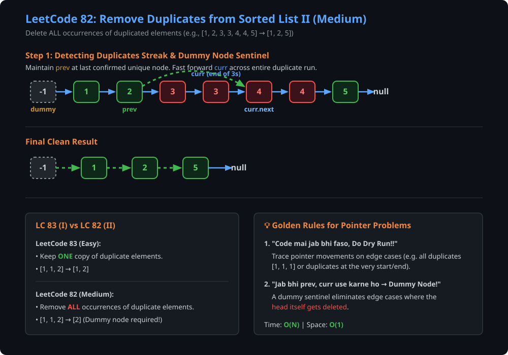

# Question 1: Remove Nth Node From End of List (LeetCode 19) [Medium]

### Problem Statement
Given the `head` of a linked list, remove the $n^{\text{th}}$ node from the end of the list and return its head.

#### Example 1:
- **Input:** `head = [1, 2, 3, 4, 5]`, `n = 2`
- **Output:** `[1, 2, 3, 5]`

#### Example 2:
- **Input:** `head = [1]`, `n = 1`
- **Output:** `[]`

#### Example 3:
- **Input:** `head = [1, 2]`, `n = 1`
- **Output:** `[1]`

---

### Visual Dry Run & Intuition



---

### Approaches

#### 1. Brute Force (Two Pass: $O(2N)$ Time, $O(1)$ Space)
1. Traverse the linked list once to count total length $L$.
2. The $n^{\text{th}}$ node from the end corresponds to the $(L - n + 1)^{\text{th}}$ node from the front (1-indexed).
3. Traverse again to $(L - n)^{\text{th}}$ node, adjust pointers (`prev->next = prev->next->next`), and delete the target.

#### 2. Optimal Two-Pointer Gap Technique (One Pass: $O(N)$ Time, $O(1)$ Space)
1. Maintain a fixed gap of $n$ nodes between two pointers (`fast` and `slow`).
2. Move `fast` forward by $n$ steps first.
3. If `fast == nullptr`, the node to remove is the **head node** itself $\to$ simply return `head->next`.
4. Otherwise, advance both `fast` and `slow` simultaneously one step at a time until `fast->next == nullptr`.
5. At this moment, `slow` sits exactly one node **before** the target node.
6. Re-link: `slow->next = slow->next->next`, delete the target node, and return `head`.

---

### C++ Implementations

#### Approach A: Two-Pointer with Dummy Sentinel Node
```cpp
#include <iostream>

struct ListNode {
    int val;
    ListNode *next;
    ListNode() : val(0), next(nullptr) {}
    ListNode(int x) : val(x), next(nullptr) {}
    ListNode(int x, ListNode *next) : val(x), next(next) {}
};

class Solution {
public:
    ListNode* removeNthFromEnd(ListNode* head, int n) {
        ListNode *temp = new ListNode(-1);
        temp->next = head;
        ListNode *first = head;
        
        // Move 'first' pointer n steps ahead
        while (n--) {
            first = first->next;
        }
        
        ListNode *sec = head;
        ListNode *tsec = temp;
        
        // Move both pointers until 'first' reaches the end
        while (first) {
            first = first->next;
            sec = sec->next;
            tsec = tsec->next;
        }
        
        // Unlink target node
        tsec->next = sec->next;
        sec->next = nullptr;
        delete sec;
        
        head = temp->next;
        temp->next = nullptr;
        delete temp;
        
        return head;
    }
};
```

#### Approach B: Efficient without Dummy Node (Direct Pointer Manipulation)
```cpp
class Solution {
public:
    ListNode* removeNthFromEnd(ListNode* head, int n) {
        // 1. Initialize two pointers
        ListNode *fast = head;
        ListNode *slow = head;

        // 2. Move 'fast' n steps ahead
        for (int i = 0; i < n; ++i) {
            fast = fast->next;
        }

        // 3. Edge Case: If fast is null after n steps, the head must be removed
        if (fast == nullptr) {
            ListNode* new_head = head->next;
            delete head; 
            return new_head;
        }

        // 4. Move both pointers until 'fast' reaches the last node
        while (fast->next != nullptr) {
            fast = fast->next;
            slow = slow->next;
        }

        // 5. Bypass target node (slow->next)
        ListNode* node_to_delete = slow->next;
        slow->next = node_to_delete->next;

        // 6. Free memory
        delete node_to_delete; 
        
        return head;
    }
};
```

---

### Java Implementation

```java
class ListNode {
    int val;
    ListNode next;
    ListNode() {}
    ListNode(int val) { this.val = val; }
    ListNode(int val, ListNode next) { this.val = val; this.next = next; }
}

class Solution {
    public ListNode removeNthFromEnd(ListNode head, int n) {
        // Dummy sentinel node makes edge case handling (deleting head) uniform
        ListNode dummy = new ListNode(0);
        dummy.next = head;
        ListNode fast = dummy;
        ListNode slow = dummy;

        // Advance fast so that there are n nodes between fast and slow
        for (int i = 0; i <= n; i++) {
            fast = fast.next;
        }

        // Move fast to the end, maintaining the gap
        while (fast != null) {
            fast = fast.next;
            slow = slow.next;
        }

        // Skip the desired target node
        slow.next = slow.next.next;

        return dummy.next;
    }
}
```

- **Time Complexity:** $\mathcal{O}(N)$ — single pass traversal through the list.
- **Space Complexity:** $\mathcal{O}(1)$ — constant auxiliary pointers.

---

# Question 2: Add Two Numbers (LeetCode 2 & LeetCode 445) [Medium]

### Problem Statement (LeetCode 2)
You are given two non-empty linked lists representing two non-negative integers. The digits are stored in **reverse order**, and each of their nodes contains a single digit. Add the two numbers and return the sum as a linked list in reverse order.

#### Example 1:
- **Input:** `l1 = [2, 4, 3]`, `l2 = [5, 6, 4]` (Represents $342 + 465 = 807$)
- **Output:** `[7, 0, 8]`

#### Example 2:
- **Input:** `l1 = [9, 9, 9, 9, 9, 9, 9]`, `l2 = [9, 9, 9, 9]`
- **Output:** `[8, 9, 9, 9, 0, 0, 0, 1]`

---

### Visual Dry Run & Intuition



---

### Key Intuition & Step-by-Step Logic
1. **Reverse Order (LeetCode 2):**
   - The least significant digit (LSD) comes first. This allows direct addition from left to right just like elementary column addition.
   - Maintain a `carry` variable (initialized to `0`).
   - Run a single loop: `while (c1 != null || c2 != null || carry != 0)`.
   - At each step:
     $$\text{sum} = \text{carry} + (c1 \neq \text{null} \,?\, c1.\text{val} : 0) + (c2 \neq \text{null} \,?\, c2.\text{val} : 0)$$
     $$\text{digit} = \text{sum} \pmod{10}, \quad \text{carry} = \lfloor \text{sum} / 10 \rfloor$$
2. **Forward Order (LeetCode 445):**
   - If numbers are provided in regular (forward) order, first reverse both input linked lists `l1` and `l2`.
   - Perform the standard addition algorithm.
   - Reverse the result list before returning.
   - *Good Engineering Practice:* Reverse `l1` and `l2` once more to restore the original input lists!

---

### C++ Implementation

```cpp
#include <iostream>

struct ListNode {
    int val;
    ListNode *next;
    ListNode() : val(0), next(nullptr) {}
    ListNode(int x) : val(x), next(nullptr) {}
    ListNode(int x, ListNode *next) : val(x), next(next) {}
};

class Solution {
public:
    ListNode* addTwoNumbers(ListNode* l1, ListNode* l2) {
        ListNode *dummy = new ListNode(-1);
        ListNode *temp = dummy;
        int carry = 0;

        // Unified loop handling unequal lengths and trailing carry
        while (l1 != nullptr || l2 != nullptr || carry != 0) {
            int sum = carry;
            if (l1 != nullptr) {
                sum += l1->val;
                l1 = l1->next;
            }
            if (l2 != nullptr) {
                sum += l2->val;
                l2 = l2->next;
            }

            carry = sum / 10;
            temp->next = new ListNode(sum % 10);
            temp = temp->next;
        }

        ListNode *result = dummy->next;
        delete dummy;
        return result;
    }
};
```

---

### Java Implementation (LeetCode 2 & Forward Order LeetCode 445)

```java
class ListNode {
    int val;
    ListNode next;
    ListNode() {}
    ListNode(int val) { this.val = val; }
    ListNode(int val, ListNode next) { this.val = val; this.next = next; }
}

class Solution {
    // LeetCode 2: Reverse order input
    public ListNode addTwoNumbers(ListNode l1, ListNode l2) {
        ListNode dummy = new ListNode(-1);
        ListNode prev = dummy;
        ListNode c1 = l1, c2 = l2;
        int carry = 0;

        while (c1 != null || c2 != null || carry != 0) {
            int sum = carry + (c1 != null ? c1.val : 0) + (c2 != null ? c2.val : 0);
            carry = sum / 10;
            prev.next = new ListNode(sum % 10);
            prev = prev.next;

            if (c1 != null) c1 = c1.next;
            if (c2 != null) c2 = c2.next;
        }

        return dummy.next;
    }

    // LeetCode 445 variant: Forward order numbers
    public ListNode addTwoNumbersForward(ListNode l1, ListNode l2) {
        l1 = reverseList(l1);
        l2 = reverseList(l2);

        ListNode head = addTwoNumbers(l1, l2);

        // Reverse back to restore original inputs & get forward result
        head = reverseList(head);
        l1 = reverseList(l1);
        l2 = reverseList(l2);

        return head;
    }

    private ListNode reverseList(ListNode head) {
        ListNode prev = null, curr = head;
        while (curr != null) {
            ListNode forward = curr.next;
            curr.next = prev;
            prev = curr;
            curr = forward;
        }
        return prev;
    }
}
```

- **Time Complexity:** $\mathcal{O}(\max(N, M))$ where $N, M$ are the lengths of `l1` and `l2`.
- **Space Complexity:** $\mathcal{O}(\max(N, M))$ to construct the result list.

---

# Question 3: Subtract Two Numbers Represented as Linked Lists [Medium]

### Problem Statement
Given two linked lists representing non-negative integers $L_1$ and $L_2$ (digits in forward order), subtract the smaller number from the larger number ($|L_1 - L_2|$) and return the resulting linked list without any leading zeros (e.g., return `[1]` instead of `[0, 0, 0, 1]`).

#### Example 1:
- **Input:** `l1 = [1, 0, 0]`, `l2 = [1]` ($100 - 1 = 99$)
- **Output:** `[9, 9]`

#### Example 2:
- **Input:** `l1 = [9, 9, 9, 9, 9, 9]`, `l2 = [9, 9, 9, 9, 9, 8]` ($999999 - 999998 = 1$)
- **Output:** `[1]`

---

### Visual Dry Run & Intuition



---

### Step-by-Step Algorithm Breakdown

1. **Find the Larger List (`isBiggerList`):**
   - Calculate lengths of $L_1$ and $L_2$.
   - If lengths differ, the longer list is larger.
   - If lengths are equal, compare values node by node from MSD to LSD.
   - If $L_2 > L_1$, swap pointers so that $L_1$ is guaranteed to be $\ge L_2$.
2. **Reverse Both Lists:**
   - Subtraction must begin from the units place (LSD).
3. **Digit-by-Digit Subtraction with Borrow:**
   - Maintain `borrow = 0`.
   - At each node:
     $$\text{val} = \text{borrow} + (c1 \neq \text{null} \,?\, c1.\text{val} : 0) - (c2 \neq \text{null} \,?\, c2.\text{val} : 0)$$
     $$\text{if } \text{val} < 0 \implies \text{val} = \text{val} + 10, \quad \text{borrow} = -1$$
     $$\text{else } \implies \text{borrow} = 0$$
   - Append `new ListNode(val)` to the result list.
4. **Reverse Result and Strip Leading Zeros:**
   - Reverse the resulting list.
   - Advance pointer past any leading zeros (`while (c1.next != null && c1.val == 0) c1 = c1.next;`).
   - If the list consists solely of zeros, return a single node `[0]`.

---

### C++ Implementation

```cpp
#include <iostream>
#include <algorithm>

struct ListNode {
    int val;
    ListNode *next;
    ListNode(int x) : val(x), next(nullptr) {}
};

class Solution {
private:
    int getLength(ListNode* head) {
        int len = 0;
        while (head) {
            len++;
            head = head->next;
        }
        return len;
    }

    int isBiggerList(ListNode* l1, ListNode* l2) {
        int len1 = getLength(l1);
        int len2 = getLength(l2);
        if (len1 != len2) return len1 - len2;

        ListNode *c1 = l1, *c2 = l2;
        while (c1 != nullptr) {
            if (c1->val != c2->val) return c1->val - c2->val;
            c1 = c1->next;
            c2 = c2->next;
        }
        return 0; // Equal
    }

    ListNode* reverseList(ListNode* head) {
        ListNode *prev = nullptr, *curr = head;
        while (curr) {
            ListNode *nxt = curr->next;
            curr->next = prev;
            prev = curr;
            curr = nxt;
        }
        return prev;
    }

public:
    ListNode* subtractTwoNumbers(ListNode* l1, ListNode* l2) {
        if (!l1 && !l2) return nullptr;
        if (!l1) return l2;
        if (!l2) return l1;

        // Ensure l1 >= l2
        if (isBiggerList(l1, l2) < 0) {
            std::swap(l1, l2);
        }

        l1 = reverseList(l1);
        l2 = reverseList(l2);

        ListNode *dummy = new ListNode(-1);
        ListNode *prev = dummy;
        ListNode *c1 = l1, *c2 = l2;
        int borrow = 0;

        while (c1 != nullptr || c2 != nullptr) {
            int val = borrow + (c1 ? c1->val : 0) - (c2 ? c2->val : 0);
            if (val < 0) {
                val += 10;
                borrow = -1;
            } else {
                borrow = 0;
            }

            prev->next = new ListNode(val);
            prev = prev->next;

            if (c1) c1 = c1->next;
            if (c2) c2 = c2->next;
        }

        // Restore input lists
        l1 = reverseList(l1);
        l2 = reverseList(l2);

        // Reverse result list
        ListNode *head = reverseList(dummy->next);
        delete dummy;

        // Remove leading zeros
        ListNode *curr = head;
        while (curr->next != nullptr && curr->val == 0) {
            ListNode *zeroNode = curr;
            curr = curr->next;
            delete zeroNode;
        }

        return curr;
    }
};
```

---

### Java Implementation

```java
class ListNode {
    int val;
    ListNode next;
    ListNode(int val) { this.val = val; }
}

public class Solution {
    private static int len(ListNode head) {
        int count = 0;
        while (head != null) {
            count++;
            head = head.next;
        }
        return count;
    }

    public static int isBiggerList(ListNode l1, ListNode l2) {
        int len1 = len(l1), len2 = len(l2);
        if (len1 == len2) {
            ListNode c1 = l1, c2 = l2;
            while (c1 != null) {
                if (c1.val != c2.val)
                    return c1.val - c2.val;
                c1 = c1.next;
                c2 = c2.next;
            }
            return 0;
        }
        return len1 - len2;
    }

    private static ListNode reverseList(ListNode head) {
        ListNode prev = null, curr = head;
        while (curr != null) {
            ListNode forward = curr.next;
            curr.next = prev;
            prev = curr;
            curr = forward;
        }
        return prev;
    }

    public static ListNode subtractTwoNumbers(ListNode l1, ListNode l2) {
        if (l1 == null && l2 == null) return null;
        if (l1 == null) return l2;
        if (l2 == null) return l1;

        // Swap if l2 is strictly bigger than l1
        if (isBiggerList(l1, l2) < 0) {
            ListNode temp = l1;
            l1 = l2;
            l2 = temp;
        }

        l1 = reverseList(l1);
        l2 = reverseList(l2);

        ListNode dummy = new ListNode(-1);
        ListNode prev = dummy;
        ListNode c1 = l1, c2 = l2;

        int borrow = 0;
        while (c1 != null || c2 != null) {
            int val = borrow + (c1 != null ? c1.val : 0) - (c2 != null ? c2.val : 0);
            if (val < 0) {
                val += 10;
                borrow = -1;
            } else {
                borrow = 0;
            }

            prev.next = new ListNode(val);
            prev = prev.next;

            if (c1 != null) c1 = c1.next;
            if (c2 != null) c2 = c2.next;
        }

        // Restore original lists
        l1 = reverseList(l1);
        l2 = reverseList(l2);

        ListNode head = reverseList(dummy.next);
        ListNode res = head;

        // Remove all leading zeros (except single 0)
        while (res.next != null && res.val == 0) {
            res = res.next;
        }

        return res;
    }
}
```

- **Time Complexity:** $\mathcal{O}(\max(N, M))$ — 4 linear passes for length, reverse, subtract, and strip zeros.
- **Space Complexity:** $\mathcal{O}(\max(N, M))$ to construct the result list.

---

# Question 4: Remove Duplicates from Sorted List (LeetCode 83) [Easy]

### Problem Statement
Given the `head` of a sorted linked list, delete all duplicates such that each element appears only **once**. Return the linked list sorted as well.

#### Example 1:
- **Input:** `head = [1, 1, 2]`
- **Output:** `[1, 2]`

#### Example 2:
- **Input:** `head = [1, 1, 2, 3, 3]`
- **Output:** `[1, 2, 3]`

---

### Visual Dry Run & Intuition



---

### Key Intuition & Common Gotcha
- Since the list is already **sorted**, duplicate nodes are guaranteed to appear consecutively.
- Traverse using pointer `curr`. If `curr.val == curr.next.val`, bypass the duplicate node (`curr.next = curr.next.next`).
- ⚠️ **Crucial Detail:** When a duplicate is deleted, **do NOT advance `curr` immediately**, because there may be 3 or more consecutive identical values (e.g. `1 -> 1 -> 1`). Only advance `curr = curr.next` when `curr.val != curr.next.val`.

---

### C++ Implementation

```cpp
struct ListNode {
    int val;
    ListNode *next;
    ListNode(int x) : val(x), next(nullptr) {}
};

class Solution {
public:
    ListNode* deleteDuplicates(ListNode* head) {
        if (!head || !head->next) return head;

        ListNode* curr = head;
        while (curr != nullptr && curr->next != nullptr) {
            if (curr->val == curr->next->val) {
                ListNode* duplicateNode = curr->next;
                curr->next = curr->next->next;
                delete duplicateNode; // Free memory
            } else {
                curr = curr->next;
            }
        }
        return head;
    }
};
```

---

### Java Implementation

```java
class ListNode {
    int val;
    ListNode next;
    ListNode(int val) { this.val = val; }
}

class Solution {
    public ListNode deleteDuplicates(ListNode head) {
        if (head == null || head.next == null) return head;

        ListNode curr = head;
        while (curr != null && curr.next != null) {
            if (curr.val == curr.next.val) {
                // Bypass duplicate; stay at curr to check for further duplicates
                curr.next = curr.next.next;
            } else {
                curr = curr.next;
            }
        }
        return head;
    }
}
```

- **Time Complexity:** $\mathcal{O}(N)$ — visits each node at most once.
- **Space Complexity:** $\mathcal{O}(1)$ — modified directly in-place.

---

# Question 5: Remove Duplicates from Sorted List II (LeetCode 82) [Medium]

### Problem Statement
Given the `head` of a sorted linked list, delete **all** nodes that have duplicate numbers, leaving only **distinct** numbers from the original list. Return the linked list sorted as well.

#### Example 1:
- **Input:** `head = [1, 2, 3, 3, 4, 4, 5]`
- **Output:** `[1, 2, 5]`

#### Example 2:
- **Input:** `head = [1, 1, 1, 2, 3]`
- **Output:** `[2, 3]`

---

### Visual Dry Run & Intuition



---

### Golden Rules & Notes from Discussion

> [!TIP]
> **1. "Code mai jab bhi faso, Do Dry Run!!"**
> Whenever you encounter edge cases (e.g., duplicates at the very start `[1, 1, 1, 2]`, duplicates at the very end `[1, 2, 2]`, or list with all duplicates `[1, 1]`), dry run pointer positions step by step.
>
> **2. "Jab bhi prev, curr use karne ho → Dummy Node can be possible!!"**
> When the head node itself might be deleted (e.g. `[1, 1, 2]` $\to$ `[2]`), a `dummy` node (`dummy.next = head`) keeps the head reference safe and prevents null pointer exceptions.

---

### C++ Implementation

```cpp
struct ListNode {
    int val;
    ListNode *next;
    ListNode(int x) : val(x), next(nullptr) {}
};

class Solution {
public:
    ListNode* deleteDuplicates(ListNode* head) {
        if (!head || !head->next) return head;

        ListNode* dummy = new ListNode(0);
        dummy->next = head;
        ListNode* prev = dummy;
        ListNode* curr = head;

        while (curr != nullptr) {
            // Detect streak of duplicate values
            bool isDuplicate = false;
            while (curr->next != nullptr && curr->val == curr->next->val) {
                isDuplicate = true;
                ListNode* temp = curr;
                curr = curr->next;
                delete temp;
            }

            if (isDuplicate) {
                // Delete the last duplicate in the streak
                ListNode* temp = curr;
                curr = curr->next;
                delete temp;
                prev->next = curr;
            } else {
                prev = prev->next;
                curr = curr->next;
            }
        }

        ListNode* newHead = dummy->next;
        delete dummy;
        return newHead;
    }
};
```

---

### Java Implementation

```java
class ListNode {
    int val;
    ListNode next;
    ListNode(int val) { this.val = val; }
}

class Solution {
    // Approach 1: Boolean sequence flag (Clean & Explicit)
    public ListNode deleteDuplicates(ListNode head) {
        if (head == null || head.next == null) return head;

        ListNode dummy = new ListNode(-1);
        dummy.next = head;
        ListNode prev = dummy;
        ListNode curr = head;

        while (curr != null) {
            boolean isSequence = false;
            // Traverse through all duplicate nodes with the same value
            while (curr.next != null && curr.val == curr.next.val) {
                isSequence = true;
                curr = curr.next;
            }

            if (isSequence) {
                // Skip the whole duplicate streak
                prev.next = curr.next;
            } else {
                // No duplicate found for curr; advance prev
                prev = prev.next;
            }
            curr = curr.next;
        }

        return dummy.next;
    }

    // Approach 2: Pointer distance comparison
    public ListNode deleteDuplicates_02(ListNode head) {
        if (head == null || head.next == null) return head;

        ListNode dummy = new ListNode(0);
        dummy.next = head;
        ListNode prev = dummy;

        while (head != null) {
            // If it's a beginning of duplicates sublist, skip all duplicates
            if (head.next != null && head.val == head.next.val) {
                while (head.next != null && head.val == head.next.val) {
                    head = head.next;
                }
                prev.next = head.next;
            } else {
                prev = prev.next;
            }
            head = head.next;
        }

        return dummy.next;
    }
}
```

- **Time Complexity:** $\mathcal{O}(N)$ — each node is visited at most twice (by `curr` and `prev`).
- **Space Complexity:** $\mathcal{O}(1)$ — in-place pointer adjustment.

---
