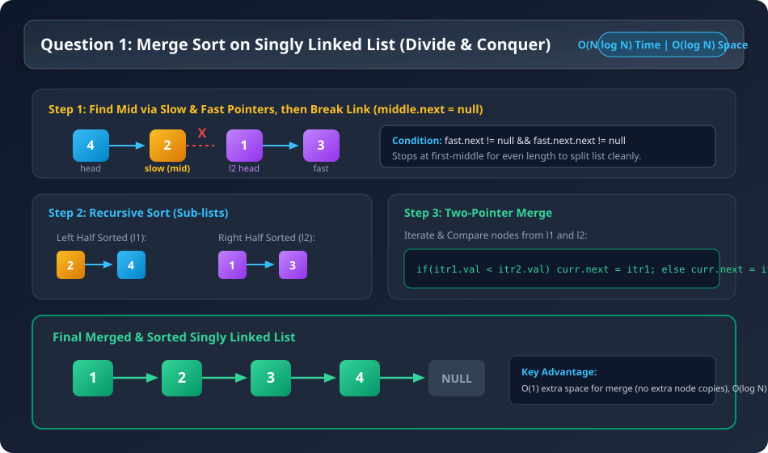
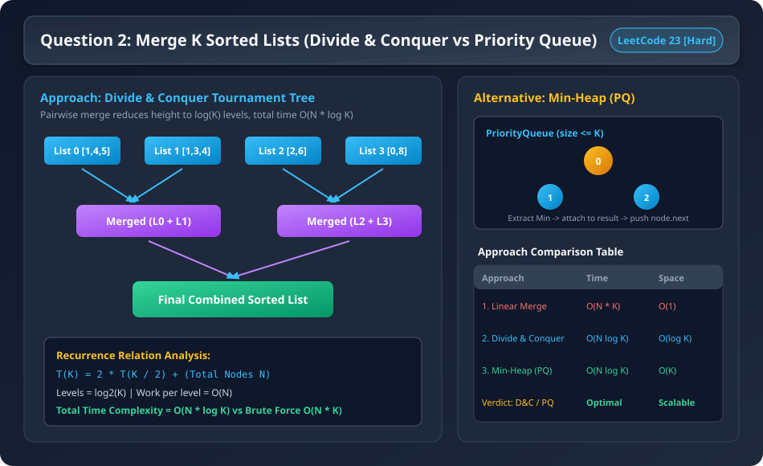
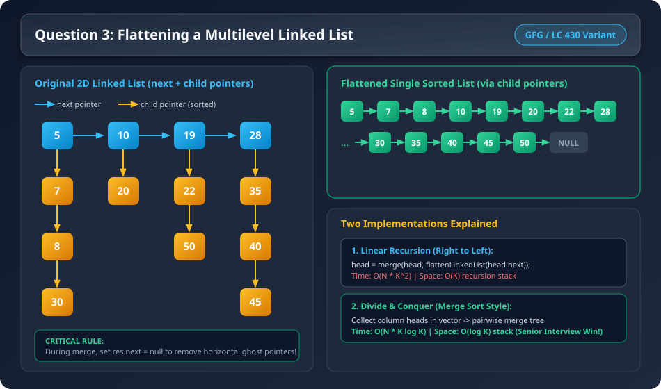
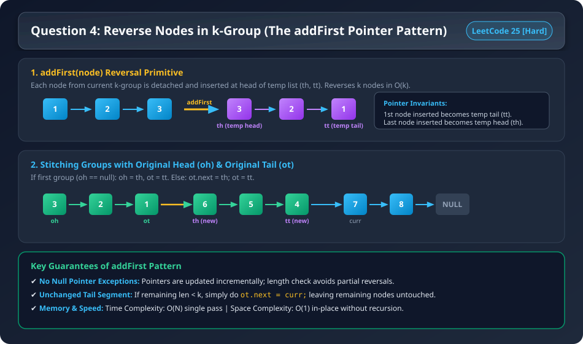
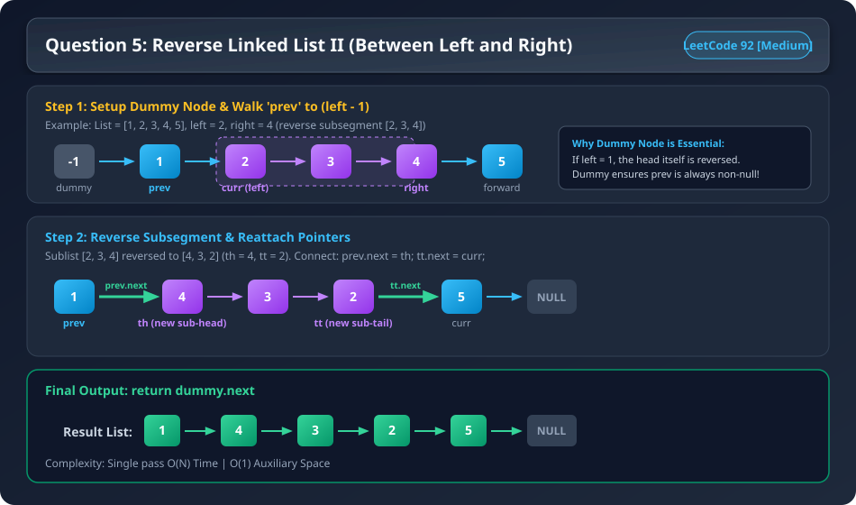
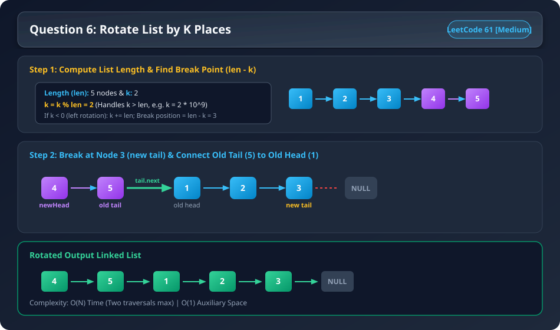
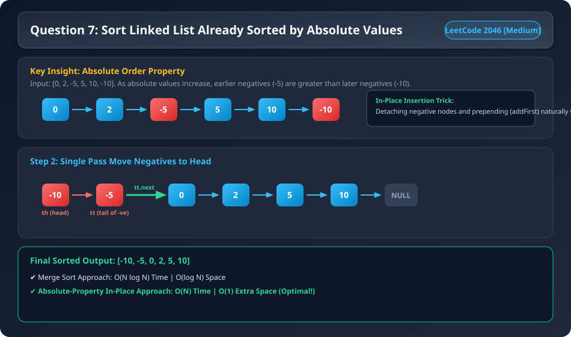
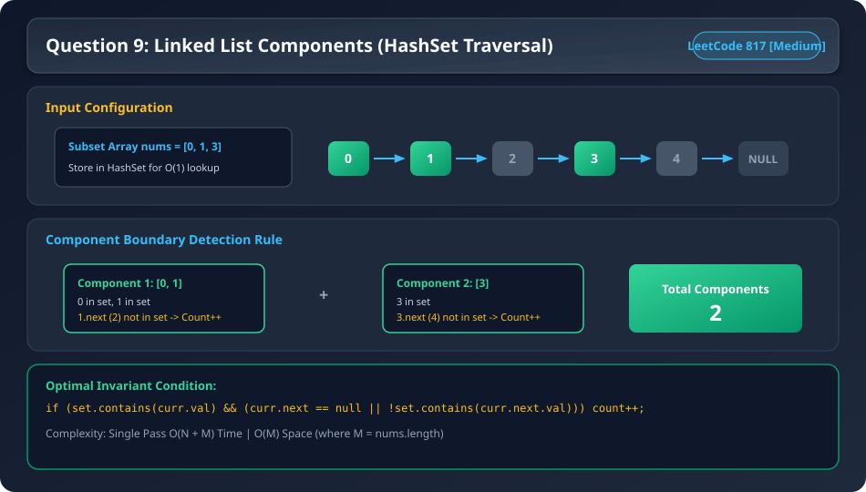
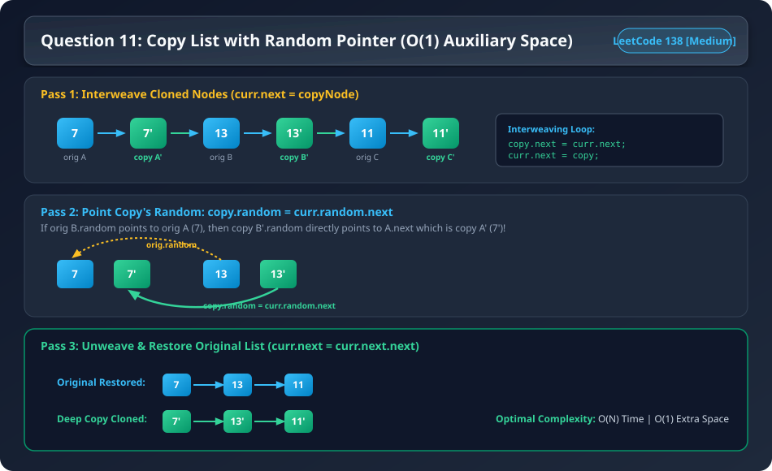

# Question 1: Sort List (Merge Sort on Linked List) (LeetCode 148) [Medium]

### Problem Statement
Given the `head` of a linked list, return the list after sorting it in **ascending order**.
Follow up: Can you sort the linked list in $O(N \log N)$ time and $O(1)$ memory (i.e. constant space)?

### Visual Dry Run & Intuition


see in while loop we tell till when loop should run but not when it should stop

if we put `while(l1!=null || l2!=null)` instead of `while(l1!=nullptr && l2!=nullptr)` the code will run infinitely as it means loop till you have any left ,but with `&&` it means loop till both of condition is satisfied or loop till we have node in both the list

### Mergesort lists (C++ Implementation)

```cpp

class Solution {
    private :
        ListNode* mid (ListNode * node){
            if(node==nullptr || node->next==nullptr) return node;
            ListNode* slow=node;
            ListNode* fast=node;
            while( fast->next!=nullptr && fast->next->next!=nullptr){
                slow=slow->next;
                fast=fast->next->next;
            }
            return slow;
        }  
    
        ListNode* merge(ListNode *l1,ListNode *l2){
            if(l1==nullptr && l2==nullptr) return l1;
            if(l1==nullptr) return l2;
            if(l2==nullptr) return l1;
             ListNode* tmp=new ListNode(-1);
            ListNode *itr1=l1;
            ListNode * itr2=l2;
            ListNode *curr=tmp;
            while(itr1!=nullptr && itr2!=nullptr){
                if(itr1->val < itr2->val){
                    curr->next=itr1;
                    curr=curr->next;
                    itr1=itr1->next;
                    curr->next=nullptr;
                }else{
                    curr->next=itr2;
                    curr=curr->next;
                    itr2=itr2->next;
                    curr->next=nullptr;
                }
            }
            if(itr1!=nullptr) curr->next=itr1;
            if(itr2!=nullptr) curr->next=itr2;
            ListNode * head=tmp->next;
            tmp->next=nullptr;
            delete(tmp);
            return head;
    
        }  
    public:
        ListNode* sortList(ListNode* head) {
            if(head==nullptr || head->next==nullptr) return head;
            ListNode* middle=mid(head);
            ListNode *l1=head;
            ListNode *l2=middle->next;
            middle->next=nullptr;
            l1=sortList(l1);
            l2=sortList(l2);
           return merge(l1,l2);
        }
};

int main(){
    
    return 0;
}

```

### Mergesort lists (Java Implementation)

```java
/**
 * Definition for singly-linked list.
 * public class ListNode {
 *     int val;
 *     ListNode next;
 *     ListNode() {}
 *     ListNode(int val) { this.val = val; }
 *     ListNode(int val, ListNode next) { this.val = val; this.next = next; }
 * }
 */
class Solution {
    private ListNode getMid(ListNode head) {
        if (head == null || head.next == null) return head;
        ListNode slow = head;
        ListNode fast = head;
        while (fast.next != null && fast.next.next != null) {
            slow = slow.next;
            fast = fast.next.next;
        }
        return slow;
    }

    private ListNode merge(ListNode l1, ListNode l2) {
        if (l1 == null) return l2;
        if (l2 == null) return l1;
        ListNode dummy = new ListNode(-1);
        ListNode curr = dummy;
        while (l1 != null && l2 != null) {
            if (l1.val <= l2.val) {
                curr.next = l1;
                l1 = l1.next;
            } else {
                curr.next = l2;
                l2 = l2.next;
            }
            curr = curr.next;
        }
        if (l1 != null) curr.next = l1;
        if (l2 != null) curr.next = l2;
        return dummy.next;
    }

    public ListNode sortList(ListNode head) {
        if (head == null || head.next == null) return head;
        ListNode mid = getMid(head);
        ListNode l1 = head;
        ListNode l2 = mid.next;
        mid.next = null; // Split the list

        l1 = sortList(l1);
        l2 = sortList(l2);
        return merge(l1, l2);
    }
}
```

---

# Question 2: Merge K Sorted Lists (LeetCode 23) [Hard]

### Problem Statement
You are given an array of `k` linked-lists `lists`, each linked-list is sorted in ascending order.
Merge all the linked-lists into one sorted linked-list and return it.

### Visual Dry Run & Complexity Tree


---

## Approach 1: Linear Merge / Sequential Accumulation (Brute Force)

### 1. Intuition & How It Works
We maintain an accumulator list `ans = null`. We iterate through each of the $K$ linked lists and merge them one by one into `ans`.

### 2. Time Complexity Myth vs Reality (The Mathematical Proof)

> **Common Misconception:** "We merge $K$ lists of length $L$, so time complexity is $O(K \cdot L)$."
> 
> **Why this is WRONG:** The accumulator list `ans` **grows longer** after each merge step!

Let:
- $K$ = Number of linked lists.
- $L$ = Average number of nodes in each linked list.
- $N = K \times L$ = Total number of nodes across all lists.

Let's calculate the work done at each merge step:

| Step | First List Size | Second List Size | Work Done (Comparisons) | Resulting `ans` Length |
| :--- | :--- | :--- | :--- | :--- |
| **Merge 1** | $0$ (`null`) | $L$ (`lists[0]`) | $0 + L = \mathbf{L}$ | $L$ |
| **Merge 2** | $L$ (`ans`) | $L$ (`lists[1]`) | $L + L = \mathbf{2L}$ | $2L$ |
| **Merge 3** | $2L$ (`ans`) | $L$ (`lists[2]`) | $2L + L = \mathbf{3L}$ | $3L$ |
| **Merge 4** | $3L$ (`ans`) | $L$ (`lists[3]`) | $3L + L = \mathbf{4L}$ | $4L$ |
| ... | ... | ... | ... | ... |
| **Merge $K$** | $(K-1)L$ (`ans`) | $L$ (`lists[K-1]`) | $(K-1)L + L = \mathbf{KL}$ | $K \cdot L$ |

#### Total Work Done:
$$\text{Total Work} = L + 2L + 3L + 4L + \dots + KL$$
$$\text{Total Work} = L \cdot (1 + 2 + 3 + 4 + \dots + K)$$

Using the Arithmetic Progression sum formula $\frac{K(K+1)}{2}$:
$$\text{Total Work} = L \cdot \frac{K(K+1)}{2} = \frac{L \cdot K^2 + L \cdot K}{2} = \mathbf{O(L \cdot K^2)}$$

Since $N = K \cdot L$ (total nodes):
$$\mathbf{O(L \cdot K^2) = O((K \cdot L) \cdot K) = O(N \cdot K)}$$

- **LeetCode Runtime:** **~99 ms** (Extremely slow because earlier nodes are traversed repeatedly $K$ times).
- **Space Complexity:** $O(1)$ auxiliary space.

### 3. Code (Linear Merge)

#### Java
```java
class Solution {
    public ListNode mergeTwoLists(ListNode l1, ListNode l2) {
        if (l1 == null) return l2;
        if (l2 == null) return l1;
        ListNode dummy = new ListNode(-1);
        ListNode curr = dummy;
        while (l1 != null && l2 != null) {
            if (l1.val <= l2.val) {
                curr.next = l1;
                l1 = l1.next;
            } else {
                curr.next = l2;
                l2 = l2.next;
            }
            curr = curr.next;
        }
        curr.next = (l1 != null) ? l1 : l2;
        return dummy.next;
    }

    public ListNode mergeKLists(ListNode[] lists) {
        if (lists == null || lists.length == 0) return null;
        ListNode ans = null;
        for (ListNode list : lists) {
            ans = mergeTwoLists(ans, list);
        }
        return ans;
    }
}
```

#### C++
```cpp
class Solution {
    ListNode* mergeTwo(ListNode* l1, ListNode* l2) {
        if (!l1) return l2;
        if (!l2) return l1;
        ListNode dummy(-1);
        ListNode* curr = &dummy;
        while (l1 && l2) {
            if (l1->val <= l2->val) {
                curr->next = l1;
                l1 = l1->next;
            } else {
                curr->next = l2;
                l2 = l2->next;
            }
            curr = curr->next;
        }
        curr->next = l1 ? l1 : l2;
        return dummy.next;
    }
public:
    ListNode* mergeKLists(vector<ListNode*>& lists) {
        if (lists.empty()) return nullptr;
        ListNode* ans = nullptr;
        for (auto list : lists) {
            ans = mergeTwo(ans, list);
        }
        return ans;
    }
};
```

---

## Approach 2: Divide and Conquer (Tournament Tree / Merge Sort Style)

### 1. Intuition & Tree Structure
Instead of merging sequentially, we divide the $K$ lists into pairs and merge them like a **tournament tree**:
- **Level 0 ($K$ lists):** $K$ lists of size $L$.
- **Level 1 ($K/2$ lists):** Merge pairs of lists $\implies K/2$ lists of size $2L$.
- **Level 2 ($K/4$ lists):** Merge pairs of lists $\implies K/4$ lists of size $4L$.
- ...
- **Level $\log_2 K$ ($1$ list):** $1$ final merged list of size $K \cdot L = N$.

### 2. Recurrence Relation & Complexity Breakdown
At each level of the recursion tree:
- **Number of lists to merge:** Halves at each level ($K \rightarrow K/2 \rightarrow K/4 \dots \rightarrow 1$).
- **Height of recursion tree:** $\log_2(K)$ levels.
- **Work done per level:** Every node ($N = K \cdot L$) is touched exactly once per level $\implies O(N)$ work per level.

#### The Recurrence Relation:
$$T(K) = 2 \cdot T\left(\frac{K}{2}\right) + \text{MergeWork}$$
$$\text{MergeWork} = \left(\frac{K \cdot L}{2}\right) + \left(\frac{K \cdot L}{2}\right) = K \cdot L = N$$

$$T(K) = 2 \cdot T\left(\frac{K}{2}\right) + N$$

Solving using Master Theorem / Tree Method:
$$\mathbf{\text{Total Time Complexity} = O(N \log K) = O(K \cdot L \cdot \log K)}$$
$$\mathbf{\text{Space Complexity} = O(\log K)} \text{ (Recursion Call Stack)}$$

- **LeetCode Runtime:** **~1 ms** (Optimal & blazing fast!).

### 3. Step-by-Step Code Walkthrough

1. **`merge(ListNode h1, ListNode h2)`**: Standard 2-pointer merge of two sorted linked lists using a `dummy` node.
2. **`mergelist(ListNode[] lists, int si, int li)`**:
   - **Base Case:** `if (si == li) return lists[si];` (Single list in range, already sorted).
   - **Divide:** `int mid = (si + li) / 2;`
   - **Conquer:**
     - `ListNode l1 = mergelist(lists, si, mid);` (merges first half $K/2$ lists)
     - `ListNode l2 = mergelist(lists, mid + 1, li);` (merges second half $K/2$ lists)
   - **Combine:** `return merge(l1, l2);`
3. **`mergeKLists(ListNode[] lists)`**: Initiates divide & conquer from index `0` to `lists.length - 1`.

### 4. Code (Divide and Conquer)

#### Java Implementation
```java
/**
 * Definition for singly-linked list.
 * public class ListNode {
 *     int val;
 *     ListNode next;
 *     ListNode() {}
 *     ListNode(int val) { this.val = val; }
 *     ListNode(int val, ListNode next) { this.val = val; this.next = next; }
 * }
 */
class Solution {
    public ListNode merge(ListNode h1, ListNode h2) {
        if (h1 == null) return h2;
        if (h2 == null) return h1;
        ListNode dummy = new ListNode(-1);
        ListNode curr = dummy;
        while (h1 != null && h2 != null) {
            if (h1.val < h2.val) {
                ListNode node = new ListNode(h1.val);
                curr.next = node;
                h1 = h1.next;
            } else {
                ListNode node = new ListNode(h2.val);
                curr.next = node;
                h2 = h2.next;
            }
            curr = curr.next;
        }
        while (h1 != null) {
            ListNode node = new ListNode(h1.val);
            curr.next = node;
            h1 = h1.next;
            curr = curr.next;
        }
        while (h2 != null) {
            ListNode node = new ListNode(h2.val);
            curr.next = node;
            h2 = h2.next;
            curr = curr.next;
        }
        return dummy.next;
    }
    
    public ListNode mergelist(ListNode[] lists, int si, int li) {
        if (si == li) return lists[si];
        int mid = (si + li) / 2;
        ListNode l1 = mergelist(lists, si, mid);
        ListNode l2 = mergelist(lists, mid + 1, li);
        return merge(l1, l2);
    }

    public ListNode mergeKLists(ListNode[] lists) {
        if (lists == null || lists.length == 0) return null;
        return mergelist(lists, 0, lists.length - 1);
    }
}
```

#### C++ Implementation
```cpp
class Solution {
private:
    ListNode* mergeTwoLists(ListNode* l1, ListNode* l2) {
        if (!l1) return l2;
        if (!l2) return l1;
        ListNode dummy(-1);
        ListNode* curr = &dummy;
        while (l1 && l2) {
            if (l1->val <= l2->val) {
                curr->next = l1;
                l1 = l1->next;
            } else {
                curr->next = l2;
                l2 = l2->next;
            }
            curr = curr->next;
        }
        curr->next = l1 ? l1 : l2;
        return dummy.next;
    }

    ListNode* mergeKListsHelper(vector<ListNode*>& lists, int start, int end) {
        if (start == end) return lists[start];
        int mid = start + (end - start) / 2;
        ListNode* l1 = mergeKListsHelper(lists, start, mid);
        ListNode* l2 = mergeKListsHelper(lists, mid + 1, end);
        return mergeTwoLists(l1, l2);
    }

public:
    ListNode* mergeKLists(vector<ListNode*>& lists) {
        if (lists.empty()) return nullptr;
        return mergeKListsHelper(lists, 0, lists.size() - 1);
    }
};
```

---

## Approach 3: Priority Queue / Min-Heap

### 1. Intuition & Logic
- Push the `head` of all $K$ lists into a Min-Heap of size $K$.
- Pop the smallest element, append it to `tail.next`, and push `minNode.next` into the heap (if not null).
- Repeat until the heap is empty.
- **Time Complexity:** $O(N \log K)$ (each of the $N$ nodes is pushed and popped once from a heap of size $K$).
- **Space Complexity:** $O(K)$ (heap holds at most $K$ elements at any time).

### 2. Code (Min-Heap)

#### C++ Min-Heap
```cpp
class Solution {
    struct compare {
        bool operator()(const ListNode* a, const ListNode* b) {
            return a->val > b->val; // Min-heap based on value
        }
    };
public:
    ListNode* mergeKLists(vector<ListNode*>& lists) {
        priority_queue<ListNode*, vector<ListNode*>, compare> pq;
        for (auto head : lists) {
            if (head) pq.push(head);
        }
        ListNode dummy(-1);
        ListNode* tail = &dummy;
        while (!pq.empty()) {
            ListNode* minNode = pq.top();
            pq.pop();
            tail->next = minNode;
            tail = tail->next;
            if (minNode->next) pq.push(minNode->next);
        }
        return dummy.next;
    }
};
```

#### Java Min-Heap
```java
class Solution {
    public ListNode mergeKLists(ListNode[] lists) {
        if (lists == null || lists.length == 0) return null;
        PriorityQueue<ListNode> pq = new PriorityQueue<>((a, b) -> a.val - b.val);
        for (ListNode node : lists) {
            if (node != null) pq.add(node);
        }
        ListNode dummy = new ListNode(-1);
        ListNode tail = dummy;
        while (!pq.isEmpty()) {
            ListNode minNode = pq.poll();
            tail.next = minNode;
            tail = tail.next;
            if (minNode.next != null) {
                pq.add(minNode.next);
            }
        }
        return dummy.next;
    }
}
```

---

# Question 3: Flattening a Multilevel Linked List (GFG / LeetCode 430 Variant) [Medium / Hard]

### Problem Statement
Given a special linked list containing `n` head nodes where every node in the linked list contains two pointers:
* 'Next' points to the next node in the list
* 'Child' pointer to a linked list where the current node is the head

Each of these child linked lists is in sorted order and connected by a 'child' pointer.

Flatten this linked list such that all nodes appear in a single sorted layer connected by the 'child' pointer and return the head of the modified list.

### Visual Dry Run


### Examples

**Example 1**
```text
Input:
head -> 1 -> 4 -> 7 -> 9 -> 12
        |    |    |    |     |
        2    5    8    10    11
        |    |
        3    6

Output: head -> 1 -> 2 -> 3 -> 4 -> 5 -> 6 -> 7 -> 8 -> 9 -> 10 -> 11 -> 12

Explanation: All the linked lists are joined together and sorted in a single level through the child pointer.
```
### Constraints
- $n == \text{Number of head nodes}$
- $1 \leq n \leq 100$
- $1 \leq \text{Number of nodes in each child linked list} \leq 100$
- $0 \leq \text{ListNode.val} \leq 1000$
- All child linked lists are sorted in non-decreasing order.

## Striver sol

```cpp
class Solution {
private:
    /* Merge the two linked lists in a particular
     order based on the data value */
    ListNode* merge(ListNode* list1, ListNode* list2){
        /* Create a dummy node as a 
        placeholder for the result */
        ListNode* dummyNode = new ListNode(-1);
        ListNode* res = dummyNode;
    
        // Merge the lists based on data values
        while(list1 != NULL && list2 != NULL){
            if(list1->val < list2->val){
                res->child = list1;
                res = list1;
                list1 = list1->child;
            }
            else{
                res->child = list2;
                res = list2;
                list2 = list2->child;
            }
            res->next = NULL;
        }
    
        // Connect the remaining elements if any
        if(list1){
            res->child = list1;
        } else {
            res->child = list2;
        }
    
        // Break the last node's link to prevent cycles
        if(dummyNode->child){
            dummyNode->child->next = NULL;
        }
        
        return dummyNode->child;
    }

public:
    // Function to flatten a linked list with child pointers 
    ListNode* flattenLinkedList(ListNode* head) {
        // If head is null or there is no next node
        if(head == NULL || head->next == NULL){
            return head; // Return head
        }
    
        // Recursively flatten the rest of the linked list
        ListNode* mergedHead = flattenLinkedList(head->next);
        
        // Merge the lists
        head = merge(head, mergedHead);
        return head;
    }
};


```

## My sol
```Cpp
class Solution {
    ListNode* merge(ListNode* h1, ListNode* h2) {
        if (h1 == nullptr) return h2;
        if (h2 == nullptr) return h1;
        ListNode* dummy = new ListNode(-1);
        ListNode* curr = dummy;
        while (h1 != nullptr && h2 != nullptr) {
            if (h1->val < h2->val) {
                curr->child = h1;
                h1 = h1->child;
            } else {
                curr->child = h2;
                h2 = h2->child;
            }
            curr = curr->child;
        }
        while (h1 != nullptr) {
            curr->child = h1;
            h1 = h1->child;
            curr = curr->child;
        }
        while (h2 != nullptr) {
            // ListNode node=new ListNode(h2.val);
            curr->child = h2;
            h2 = h2->child;
            curr = curr->child;
        }
        return dummy->child;
    }

    ListNode* mergelist(vector<ListNode*> lists, int si, int li) {
        if (si == li) return lists[si];
        int mid = (si + li) / 2;
        ListNode* l1 = mergelist(lists, si, mid);
        ListNode* l2 = mergelist(lists, mid + 1, li);
        return merge(l1, l2);
    }

    ListNode* mergeKLists(vector<ListNode*> & lists) {
        if (lists.size() == 0) return nullptr;
        return mergelist(lists, 0, lists.size() - 1);
    }

   public:
    ListNode* flattenLinkedList(ListNode*& head) {
        if (head == nullptr || head->next == nullptr) return head;
        vector<ListNode*> temp;
        ListNode* curr = head;
        while (curr != nullptr) {
            temp.push_back(curr);
            curr = curr->next;
        }
        return mergeKLists(temp);
    }
};
```
This comparison is a battle between **Recursion** (Solution 1) and **Divide and Conquer / Merge K-Sorted Lists** (Solution 2).

While both are logically sound, **Solution 2 is the more advanced, "Senior-level" approach.** Here is the breakdown of why.

### 1. Complexity Analysis: The "Skew" Problem
* **Solution 1 (Recursion from Right to Left):**
    * This works like `Merge(List1, Merge(List2, Merge(List3, List4)))`.
    * **Time Complexity:** $O(N \cdot K^2)$ in the worst case, where $K$ is the number of main nodes (columns) and $N$ is the average nodes in a child list. If the list is long, you are merging the same elements over and over again.
* **Solution 2 (Divide and Conquer):**
    * This works exactly like **Merge Sort**. It merges pairs of lists, then pairs of the resulting lists.
    * **Time Complexity:** $O(N \cdot K \log K)$.
    * **Why it wins:** Because of the $\log K$ factor. In a large system with 1,000 columns, Solution 1 does 1,000 merge operations. Solution 2 only does about 10 "levels" of merging.

### 2. Space & Memory (Stack vs. Heap)
* **Solution 1:** Uses the **Recursion Stack**. If you have 10,000 columns, you will hit a **Stack Overflow**.
* **Solution 2:** Uses a Vector to store pointers and an explicit **Merge-Sort-style recursion**. While it also uses recursion, the depth is only $\log K$. For 1,000,000 nodes, the depth is only 20. It is virtually "overflow-proof."

### 3. Engineering Precision (The `next` pointer)
There is a subtle but vital bug-fix in Solution 1 that Solution 2 missed:

In Solution 1, you see:
```cpp
res->next = NULL; // Crucial!
```

When flattening, the problem usually requires the result to be a single vertical list (using `child`). If you don't explicitly null out the `next` pointers during the merge, your final "flattened" list will still have "ghost" pointers pointing to the side, which can cause infinite loops or memory leaks in some test environments.

* Solution 2 should ideally set `curr->next = nullptr` inside its merge loop to be truly "clean."

### 4. Code Readability & Style
* **Solution 1:** Is **"Competitive Programming"** style. It's short and recursive.
* **Solution 2:** Is **"System Design"** style. It treats the problem as a "Merge K Sorted Lists" problem.

### Interview Tip
If the interviewer says **"How would you optimize this if there are millions of columns?"**, Solution 2 is the only correct answer. You can even mention that using a **Priority Queue (Min-Heap)** instead of Divide & Conquer would also achieve $O(N \cdot K \log K)$ and is very common in production.

### Summary Table

| Feature | Solution 1 (Linear Recursion) | Solution 2 (Divide & Conquer) |
| :--- | :--- | :--- |
| **Complexity** | $O(N \cdot K^2)$ | $O(N \cdot K \log K)$ |
| **Scalability** | **Low** (Stack Overflow risk) | **High** |
| **Pattern** | Simple Recursion | Merge Sort / K-Way Merge |
| **Verdict** | Good for Beginners. | **Winner for Senior Interviews.** |

Let:
* $K$ = Number of main nodes (the "columns" or the length of the top-level list).
* $N$ = Average number of nodes in each vertical child list.
* Total nodes in the entire structure $\approx N \times K$.

### 1. The "Levels" of Merging
In Divide and Conquer, we don't merge List 1 into List 2, then into List 3. Instead, we merge them in pairs:
* **Level 1:** We merge $K$ lists into $K/2$ lists.
* **Level 2:** We merge $K/2$ lists into $K/4$ lists.
* ...and so on until only 1 list remains.

The number of levels in this "Tournament" is always $\log K$.

### 2. The Work Done at Each Level
At every single level, we are essentially touching every node in the entire structure **once** to perform the comparisons:
* In **Level 1**, we process $N \times K$ nodes.
* In **Level 2**, we still process the same $N \times K$ nodes (just combined into longer lists).
* The work done per level is $O(N \times K)$.

### 3. The Total Calculation
$$Total\ TC = (\text{Work per Level}) \times (\text{Number of Levels})$$
$$Total\ TC = O(N \cdot K) \times \log K$$
$$Total\ TC = O(N \cdot K \log K)$$

### Comparison: Why is this better than Solution 1?

**Solution 1 (Linear Merge):**
* You merge List 1 (size $N$) with List 2 (size $N$). Work = $2N$.
* Then you merge the result (size $2N$) with List 3 (size $N$). Work = $3N$.
* Then with List 4. Work = $4N$.
* **Total Work:** $2N + 3N + 4N \dots + KN$

This is an **Arithmetic Progression**: $N \times (2+3+4 \dots + K) \approx \mathbf{O(N \cdot K^2)}$

**The Difference:**
If $K = 1000$:
* **Solution 1:** $1000^2 = 1,000,000$ operations per node.
* **Solution 2:** $1000 \times \log(1000) \approx 1000 \times 10 = 10,000$ operations per node.
* **Solution 2 is 100 times faster for 1,000 lists.**

### Space Complexity (SC)
* $O(\log K)$: This is the height of the recursion tree. Even though we are merging $K$ lists, the computer only needs to remember $\log K$ function calls at any one time.
* This is why Solution 2 is much safer against **Stack Overflow** than the linear $O(K)$ recursion of Solution 1.

### Java Implementation of Flattening
```java
class Solution {
    ListNode mergeTwoLists(ListNode a, ListNode b) {
        ListNode temp = new ListNode(0);
        ListNode res = temp;
        while (a != null && b != null) {
            if (a.data < b.data) {
                res.bottom = a;
                res = a;
                a = a.bottom;
            } else {
                res.bottom = b;
                res = b;
                b = b.bottom;
            }
        }
        if (a != null) res.bottom = a;
        else res.bottom = b;
        return temp.bottom;
    }

    ListNode flatten(ListNode root) {
        if (root == null || root.next == null) return root;
        // Recur for list on right
        root.next = flatten(root.next);
        // Merge current list with flattened right list
        root = mergeTwoLists(root, root.next);
        return root;
    }
}
```

---

# Question 4: Reverse Nodes in k-Group (LeetCode 25) [Hard]

### Problem Statement
Given the `head` of a linked list, reverse the nodes of the list `k` at a time, and return the modified list.
`k` is a positive integer and is less than or equal to the length of the linked list. If the number of nodes is not a multiple of `k` then left-out nodes, in the end, should remain as it is.

### Visual Dry Run & addFirst Pattern


### C++ Implementation (Global `th, tt` Pattern)

```cpp
// temporary head, temporary tail
ListNode *th = nullptr;
ListNode *tt = nullptr;

void addFirstNode(ListNode *node)
{
    if (th == nullptr)
    {
        th = node;
        tt = node;
    }
    else
    {
        node->next = th;
        th = node;
    }
}
int lengthOfLL(ListNode *node)
{
    if (node == nullptr)
        return 0;

    int len = 0;
    while (node != nullptr)
    {
        node = node->next;
        len++;
    }

    return len;
}

ListNode *reverseKGroup(ListNode *head, int k)
{
    if (head == nullptr || head->next == nullptr || k == 1)
        return head;

    // original head, original tail
    ListNode *oh = nullptr;
    ListNode *ot = nullptr;

    int len = lengthOfLL(head);
    ListNode *curr = head;

    while (len >= k)
    {
        int tempK = k;
        while (tempK-- > 0)
        {
            ListNode *forw = curr->next;
            curr->next = nullptr;
            addFirstNode(curr);
            curr = forw;
        }

        if (oh == nullptr)
        {
            oh = th;
            ot = tt;
        }
        else
        {
            ot->next = th;
            ot = tt;
        }

        th = nullptr;
        tt = nullptr;
        len -= k;
    }

    ot->next = curr;
    return oh;
}
```

### Java Implementation (Array `temp[2]` for `th, tt`)

```java

/**
 * Definition for singly-linked list.
 * public class ListNode {
 *     int val;
 *     ListNode next;
 *     ListNode() {}
 *     ListNode(int val) { this.val = val; }
 *     ListNode(int val, ListNode next) { this.val = val; this.next = next; }
 * }
 */
class Solution {
    public int length(ListNode head){
        if(head==null) return 0;
        ListNode curr=head;
        int length=0;
        while(curr!=null){
            curr=curr.next;
            length++;
        }
        return length;
    }
    public void addfirst(ListNode[]temp,ListNode node){
        if(temp[0]==null){
            temp[0]=temp[1]=node;
        }
        else{
            node.next=temp[0];
            temp[0]=node;
        }
    }
    
    public ListNode reverseKGroup(ListNode head, int k) {
        if(head==null||head.next==null||k==1) return head;
        ListNode[] temp=new ListNode[2];
        int len=length(head);
        ListNode ah=null;
        ListNode at=null;
        ListNode curr=head;
        while(len>=k){
            int tempVar=k;
            while(tempVar-->0){
                ListNode forward=curr.next;
                curr.next=null;
                addfirst(temp,curr);
                curr=forward;
            }
            if(ah==null){
                ah=temp[0];
                at=temp[1];
            }
            else{
                at.next=temp[0];
                at=temp[1];
            }
            temp[0]=temp[1]=null;
            len-=k;
            
        }
        at.next=curr;
        return ah;
        
    }
}

```

---

# Question 5: Reverse Linked List II (Between Left and Right) (LeetCode 92) [Medium]

### Problem Statement
Given the `head` of a singly linked list and two integers `left` and `right` where `left <= right`, reverse the nodes of the list from position `left` to position `right`, and return the reversed list.

### Visual Dry Run


### Intuition & Logic
1. **Dummy Node**: Create a sentinel `dummy` node (`dummy.next = head`) to handle edge cases gracefully when `left = 1`.
2. **Walk `prev`**: Advance a pointer `prev` for `left - 1` steps so that `prev` stops right before the subsegment to reverse.
3. **Subsegment Reversal**:
   - Extract nodes from `left` to `right` using `addFirst` into a temporary list `(th, tt)`.
   - Alternatively, use the 3-pointer in-place swap.
4. **Re-stitch**: Connect `prev.next = th` and `tt.next = curr`.
5. Return `dummy.next`.

### C++ Solution

```cpp
class Solution {
    ListNode* th = nullptr;
    ListNode* tt = nullptr;

    void addFirst(ListNode* node) {
        if (!th) {
            th = tt = node;
        } else {
            node->next = th;
            th = node;
        }
    }

public:
    ListNode* reverseBetween(ListNode* head, int left, int right) {
        if (!head || left == right) return head;

        ListNode* dummy = new ListNode(-1);
        dummy->next = head;
        ListNode* prev = dummy;

        for (int i = 1; i < left; ++i) {
            prev = prev->next;
        }

        ListNode* curr = prev->next;
        int count = right - left + 1;
        while (count-- > 0) {
            ListNode* forw = curr->next;
            curr->next = nullptr;
            addFirst(curr);
            curr = forw;
        }

        prev->next = th;
        tt->next = curr;

        ListNode* newHead = dummy->next;
        delete dummy;
        return newHead;
    }
};
```

### Java Solution (Using `ListNode[] temp` for `th, tt`)

```java
class Solution {
    private void addFirst(ListNode[] temp, ListNode node) {
        if (temp[0] == null) {
            temp[0] = temp[1] = node;
        } else {
            node.next = temp[0];
            temp[0] = node;
        }
    }

    public ListNode reverseBetween(ListNode head, int left, int right) {
        if (head == null || left == right) return head;

        ListNode dummy = new ListNode(-1);
        dummy.next = head;
        ListNode prev = dummy;

        for (int i = 1; i < left; i++) {
            prev = prev.next;
        }

        ListNode curr = prev.next;
        ListNode[] temp = new ListNode[2]; // temp[0] = th, temp[1] = tt
        int count = right - left + 1;

        while (count-- > 0) {
            ListNode forward = curr.next;
            curr.next = null;
            addFirst(temp, curr);
            curr = forward;
        }

        prev.next = temp[0];
        temp[1].next = curr;

        return dummy.next;
    }
}
```

---

# Question 6: Rotate List (LeetCode 61) [Medium]

### Problem Statement
Given the `head` of a linked list, rotate the list to the right by `k` places.

### Visual Dry Run


### Intuition & Logic
1. **Find Length & Tail**: Traverse to calculate list length `len` and keep track of the `tail` node.
2. **Modulo Optimization**:
   - `k = k % len`.
   - If `k < 0` (left rotation): `k = k + len`.
   - If `k == 0`: No rotation needed, return `head`.
3. **Break & Link**:
   - Connect `tail.next = head` to temporarily form a circle.
   - Walk `len - k` steps from `head` to find the new tail.
   - `newHead = newTail.next`, and break `newTail.next = null`.
4. Return `newHead`.

### C++ Solution

```cpp
class Solution {
public:
    ListNode* rotateRight(ListNode* head, int k) {
        if (!head || !head->next || k == 0) return head;

        int len = 1;
        ListNode* tail = head;
        while (tail->next) {
            tail = tail->next;
            len++;
        }

        k = k % len;
        if (k < 0) k += len;
        if (k == 0) return head;

        tail->next = head; // Form a circle

        int stepsToNewTail = len - k;
        ListNode* newTail = head;
        for (int i = 1; i < stepsToNewTail; ++i) {
            newTail = newTail->next;
        }

        ListNode* newHead = newTail->next;
        newTail->next = nullptr; // Break circle

        return newHead;
    }
};
```

### Java Solution

```java
class Solution {
    public ListNode rotateRight(ListNode head, int k) {
        if (head == null || head.next == null || k == 0) return head;

        int len = 1;
        ListNode tail = head;
        while (tail.next != null) {
            tail = tail.next;
            len++;
        }

        k = k % len;
        if (k < 0) k += len;
        if (k == 0) return head;

        tail.next = head; // Make circular

        int steps = len - k;
        ListNode newTail = head;
        for (int i = 1; i < steps; i++) {
            newTail = newTail.next;
        }

        ListNode newHead = newTail.next;
        newTail.next = null; // Break circular link

        return newHead;
    }
}
```

---

# Question 7: Sort Linked List Already Sorted Using Absolute Values (LeetCode 2046) [Medium]

### Problem Statement
Given the `head` of a singly linked list that is sorted in **non-decreasing order using absolute values**, sort the list in **non-decreasing order using actual values**.

### Visual Dry Run & $O(N)$ In-Place Magic


### Intuition & Logic
- Because the input is already sorted by absolute values:
  - All non-negative numbers are already in proper relative sorted order: $0 \le 2 \le 5 \le 10$.
  - For negative numbers, their absolute values increase as we traverse: $|-5| \le |-10|$.
  - In actual value terms, $-10 < -5$. Therefore, moving each encountered negative node to the very front via `addFirst` automatically places larger negative numbers at the front!
- **Time Complexity:** $O(N)$ single pass.
- **Space Complexity:** $O(1)$ in-place rewiring.

### C++ Solution

```cpp
class Solution {
public:
    ListNode* sortLinkedList(ListNode* head) {
        if (!head || !head->next) return head;

        ListNode* prev = head;
        ListNode* curr = head->next;

        while (curr) {
            if (curr->val < 0) {
                // Detach curr
                prev->next = curr->next;
                // Prepend to head
                curr->next = head;
                head = curr;
                // Move curr to next node
                curr = prev->next;
            } else {
                prev = curr;
                curr = curr->next;
            }
        }
        return head;
    }
};
```

### Java Solution

```java
class Solution {
    public ListNode sortLinkedList(ListNode head) {
        if (head == null || head.next == null) return head;

        ListNode prev = head;
        ListNode curr = head.next;

        while (curr != null) {
            if (curr.val < 0) {
                // Detach curr from its current place
                prev.next = curr.next;
                // Move curr to front (addFirst)
                curr.next = head;
                head = curr;
                // Next candidate
                curr = prev.next;
            } else {
                prev = curr;
                curr = curr.next;
            }
        }
        return head;
    }
}
```

---

# Question 8: Remove Linked List Elements (LeetCode 203) [Easy]

### Problem Statement
Given the `head` of a linked list and an integer `val`, remove all the nodes of the linked list that has `Node.val == val`, and return the new head.

### Intuition & Logic
- Use a sentinel `dummy` node (`dummy.next = head`).
- Traverse with pointer `curr = dummy`:
  - If `curr.next.val == val`, bypass it: `curr.next = curr.next.next`.
  - Else advance `curr = curr.next`.
- Return `dummy.next`.

### C++ Solution

```cpp
class Solution {
public:
    ListNode* removeElements(ListNode* head, int val) {
        ListNode dummy(-1);
        dummy.next = head;
        ListNode* curr = &dummy;

        while (curr->next) {
            if (curr->next->val == val) {
                ListNode* temp = curr->next;
                curr->next = curr->next->next;
                delete temp;
            } else {
                curr = curr->next;
            }
        }
        return dummy.next;
    }
};
```

### Java Solution

```java
class Solution {
    public ListNode removeElements(ListNode head, int val) {
        ListNode dummy = new ListNode(-1);
        dummy.next = head;
        ListNode curr = dummy;

        while (curr.next != null) {
            if (curr.next.val == val) {
                curr.next = curr.next.next;
            } else {
                curr = curr.next;
            }
        }
        return dummy.next;
    }
}
```

---

# Question 9: Linked List Components (LeetCode 817) [Medium]

### Problem Statement
You are given the `head` of a linked list containing unique integer values and an integer array `nums` that is a subset of the linked list values.
Return the number of connected components in `nums`, where two values are connected if they appear consecutively in the linked list.

### Visual Dry Run


### Intuition & Invariant
1. Insert all elements of `nums` into a `HashSet` for $O(1)$ lookups.
2. Traverse the list with `curr`:
   - A component segment terminates whenever `curr.val` is in `set` AND (`curr.next == null` OR `curr.next.val` is NOT in `set`).
   - When this boundary condition is met, increment `count++`.
3. Total Time: $O(N + M)$ | Extra Space: $O(M)$ where $M = \text{nums.length}$.

### C++ Solution

```cpp
class Solution {
public:
    int numComponents(ListNode* head, vector<int>& nums) {
        unordered_set<int> set(nums.begin(), nums.end());
        int count = 0;
        ListNode* curr = head;

        while (curr) {
            if (set.count(curr->val) && (!curr->next || !set.count(curr->next->val))) {
                count++;
            }
            curr = curr->next;
        }
        return count;
    }
};
```

### Java Solution

```java
class Solution {
    public int numComponents(ListNode head, int[] nums) {
        Set<Integer> set = new HashSet<>();
        for (int x : nums) set.add(x);

        int count = 0;
        ListNode curr = head;
        while (curr != null) {
            if (set.contains(curr.val) && (curr.next == null || !set.contains(curr.next.val))) {
                count++;
            }
            curr = curr.next;
        }
        return count;
    }
}
```

---

# Question 10: Remove Zero Sum Consecutive Nodes from Linked List (LeetCode 1171) [Medium]

### Problem Statement
Given the `head` of a linked list, we repeatedly delete consecutive sequences of nodes that sum to `0` until there are no such sequences.
After doing so, return the head of the final linked list.

### Intuition & Logic
1. If prefix sum at node $A$ equals prefix sum at node $B$, then the sum of all elements strictly between $A$ and $B$ is **zero**.
2. **Two-Pass Algorithm**:
   - **Pass 1**: Populate `map[prefixSum] = node` (storing the latest occurrence of each prefix sum).
   - **Pass 2**: Reset prefix sum and traverse again: `curr.next = map[prefixSum].next` (skipping any zero-sum sequence).
3. Return `dummy.next`.

### C++ Solution

```cpp
class Solution {
public:
    ListNode* removeZeroSumSublists(ListNode* head) {
        ListNode* dummy = new ListNode(0);
        dummy->next = head;

        unordered_map<int, ListNode*> prefixMap;
        int prefixSum = 0;
        ListNode* curr = dummy;

        // Pass 1: Record latest node for each prefix sum
        while (curr) {
            prefixSum += curr->val;
            prefixMap[prefixSum] = curr;
            curr = curr->next;
        }

        // Pass 2: Connect curr to the node after the zero-sum segment
        prefixSum = 0;
        curr = dummy;
        while (curr) {
            prefixSum += curr->val;
            curr->next = prefixMap[prefixSum]->next;
            curr = curr->next;
        }

        ListNode* res = dummy->next;
        delete dummy;
        return res;
    }
};
```

### Java Solution

```java
class Solution {
    public ListNode removeZeroSumSublists(ListNode head) {
        ListNode dummy = new ListNode(0);
        dummy.next = head;

        Map<Integer, ListNode> prefixMap = new HashMap<>();
        int prefixSum = 0;
        ListNode curr = dummy;

        // Pass 1: Map prefix sums to latest node
        while (curr != null) {
            prefixSum += curr.val;
            prefixMap.put(prefixSum, curr);
            curr = curr.next;
        }

        // Pass 2: Bypass zero-sum sublists
        prefixSum = 0;
        curr = dummy;
        while (curr != null) {
            prefixSum += curr.val;
            curr.next = prefixMap.get(prefixSum).next;
            curr = curr.next;
        }

        return dummy.next;
    }
}
```

---

# Question 11: Copy List with Random Pointer (LeetCode 138) [Medium]

### Problem Statement
A linked list of length `n` is given such that each node contains an additional random pointer, which could point to any node in the list, or `null`.
Construct a **deep copy** of the list and return the head of the copied list.

### Visual Dry Run & 3-Pass $O(1)$ In-Place Algorithm


### Intuition & 3-Pass Method
1. **Pass 1 (Interweave)**: Clone each node and insert it immediately after the original node: `A -> A' -> B -> B' -> C -> C'`.
2. **Pass 2 (Random Links)**: Copy the random pointers: `curr.next.random = (curr.random != null) ? curr.random.next : null`.
3. **Pass 3 (Separate Lists)**: Separate the cloned list from original list, restoring the original list pointers.

### C++ Solution

```cpp
/*
// Definition for a Node.
class Node {
public:
    int val;
    Node* next;
    Node* random;
    
    Node(int _val) {
        val = _val;
        next = NULL;
        random = NULL;
    }
};
*/

class Solution {
public:
    Node* copyRandomList(Node* head) {
        if (!head) return nullptr;

        // Pass 1: Interleave cloned nodes
        Node* curr = head;
        while (curr) {
            Node* copy = new Node(curr->val);
            copy->next = curr->next;
            curr->next = copy;
            curr = copy->next;
        }

        // Pass 2: Set random pointers
        curr = head;
        while (curr) {
            if (curr->random) {
                curr->next->random = curr->random->next;
            }
            curr = curr->next->next;
        }

        // Pass 3: Separate cloned list and restore original list
        curr = head;
        Node* dummy = new Node(0);
        Node* copyTail = dummy;

        while (curr) {
            Node* copy = curr->next;
            curr->next = copy->next;

            copyTail->next = copy;
            copyTail = copy;

            curr = curr->next;
        }

        Node* newHead = dummy->next;
        delete dummy;
        return newHead;
    }
};
```

### Java Solution

```java
/*
// Definition for a Node.
class Node {
    int val;
    Node next;
    Node random;

    public Node(int val) {
        this.val = val;
        this.next = null;
        this.random = null;
    }
}
*/

class Solution {
    public Node copyRandomList(Node head) {
        if (head == null) return null;

        // Pass 1: Interweave cloned nodes
        Node curr = head;
        while (curr != null) {
            Node copy = new Node(curr.val);
            copy.next = curr.next;
            curr.next = copy;
            curr = copy.next;
        }

        // Pass 2: Set random pointers
        curr = head;
        while (curr != null) {
            if (curr.random != null) {
                curr.next.random = curr.random.next;
            }
            curr = curr.next.next;
        }

        // Pass 3: Separate lists
        curr = head;
        Node dummy = new Node(0);
        Node copyTail = dummy;

        while (curr != null) {
            Node copy = curr.next;
            curr.next = copy.next;

            copyTail.next = copy;
            copyTail = copy;

            curr = curr.next;
        }

        return dummy.next;
    }
}
```