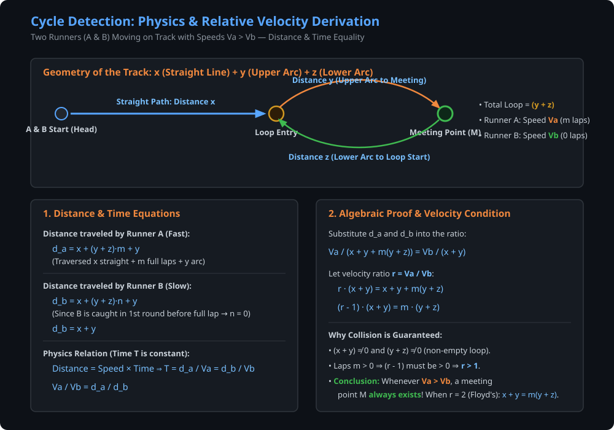
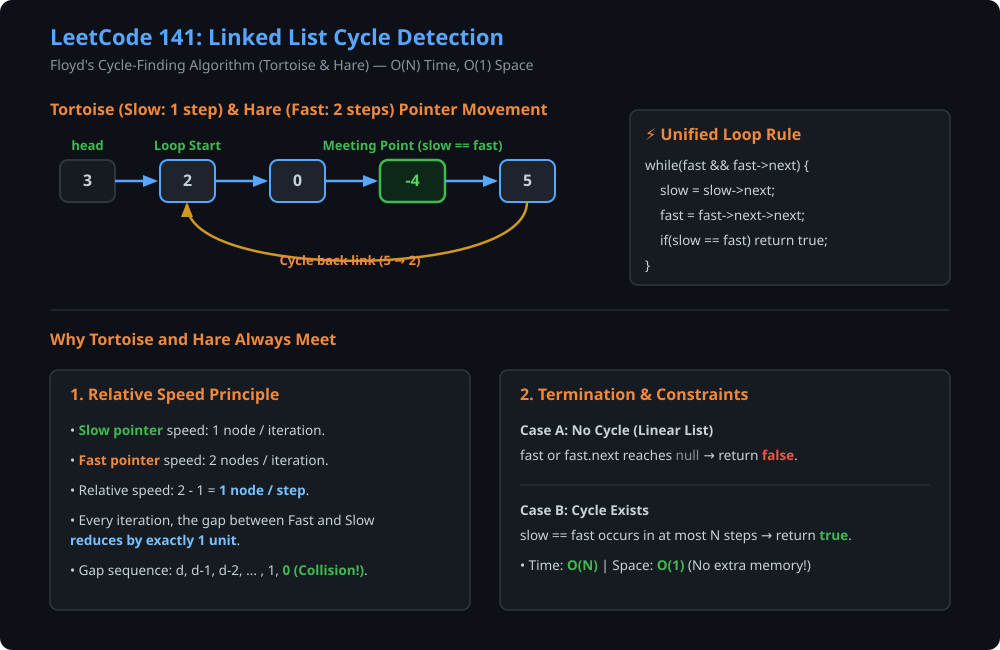
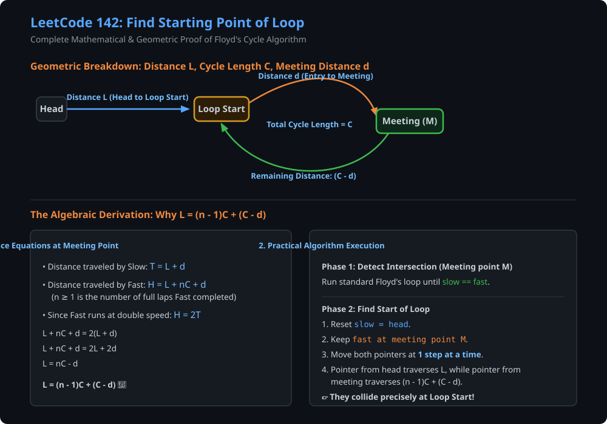
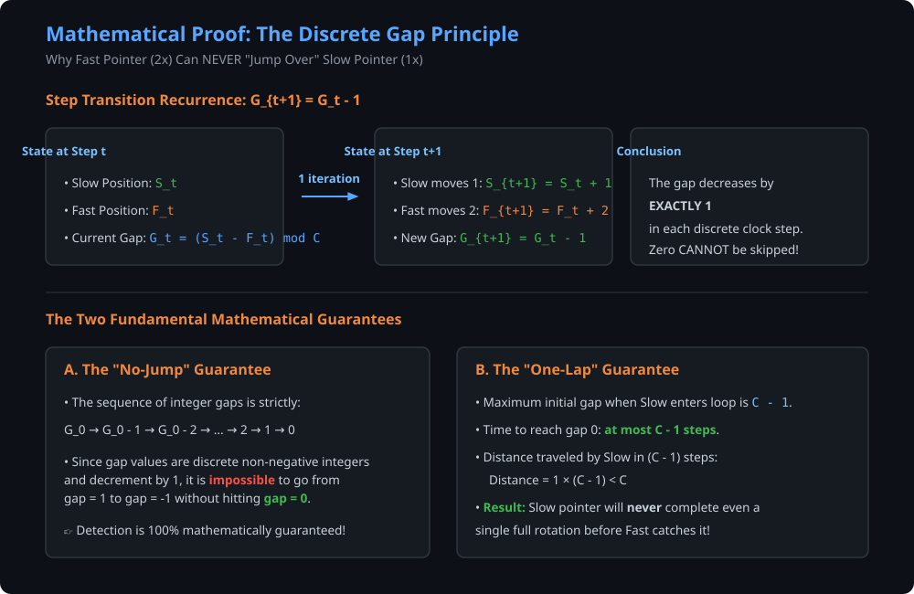
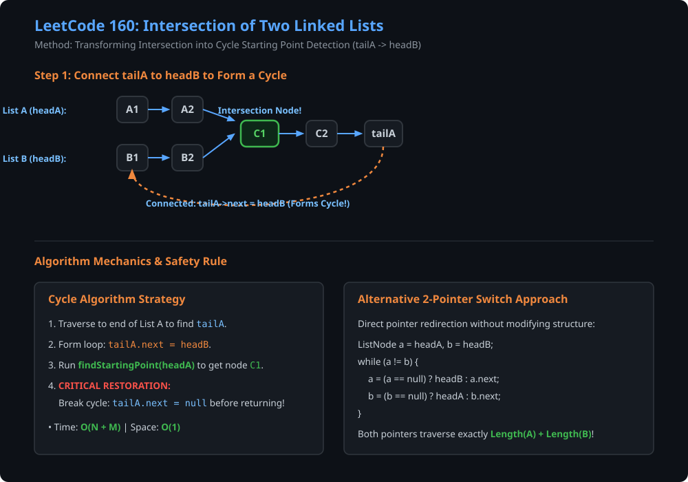
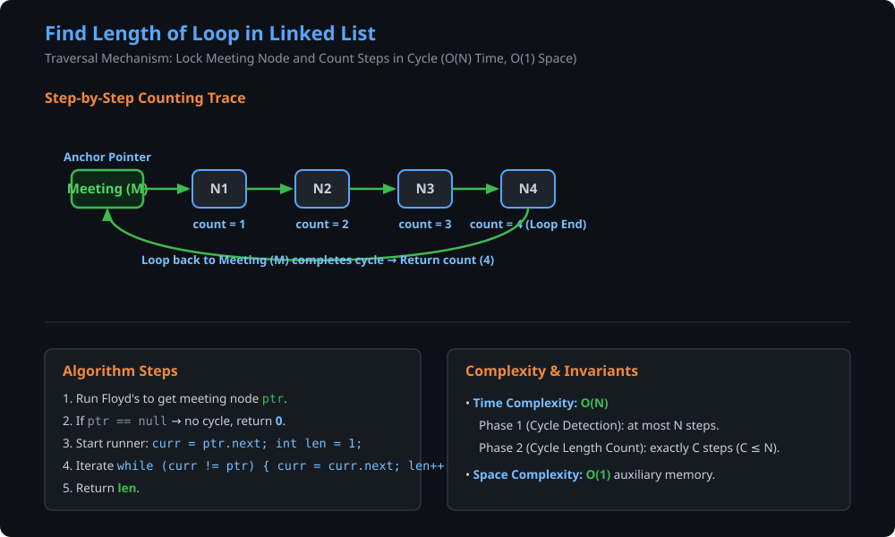

# Question 1: Linked List Cycle Detection (LeetCode 141) [Easy]

### Problem Statement
Given `head`, the head of a linked list, determine if the linked list has a cycle in it. There is a cycle in a linked list if there is some node in the list that can be reached again by continuously following the `next` pointer. Return `true` if there is a cycle in the linked list. Otherwise, return `false`.

#### Example 1:
- **Input:** `head = [3, 2, 0, -4]`, `pos = 1` (tail connects to node index 1)
- **Output:** `true`
- **Explanation:** There is a cycle in the linked list, where the tail connects to the 1st node (0-indexed).

#### Example 2:
- **Input:** `head = [1, 2]`, `pos = 0`
- **Output:** `true`

#### Example 3:
- **Input:** `head = [1]`, `pos = -1`
- **Output:** `false`

---

### Approaches & Intuition

#### 1. Brute Force: Storing Node Addresses in Hash Table
- **Concept:** As we traverse the linked list, store the memory address of each visited node in a `HashSet` / `unordered_set`.
- **Check:** Before advancing to the next node, check if the current node's address is already present in the set.
  - If it is already in the set $\implies$ we have visited this node before $\implies$ **Cycle exists (`return true`)**.
  - If we reach `null` $\implies$ **No cycle exists (`return false`)**.
- **Complexity:**
  - **Time Complexity:** $\mathcal{O}(N)$
  - **Space Complexity:** $\mathcal{O}(N)$ (stores up to $N$ node references in memory).

---

#### 2. Optimal Approach: Two Runners & Relative Velocity (Physics Derivation)

If two runners **A** and **B** start running from the same point at different constant speeds ($V_a > V_b$) on a track that eventually turns into a loop, **they are mathematically guaranteed to collide inside the loop!**



---

### Mathematical Proof of Collision (Physics-Based Derivation)

Let:
- **$x$**: Linear distance traveled from the start (`head`) to the loop entrance.
- **$y$**: Distance along the upper arc of the cycle from the entrance to the meeting point $M$.
- **$z$**: Remaining distance along the lower arc from meeting point $M$ back to the loop entrance.
- **$(y + z)$**: Total circumference (length) of the cycle.
- **$m$**: Number of full laps completed by runner $A$ (Fast) inside the cycle before the collision.
- **$n$**: Number of full laps completed by runner $B$ (Slow). Since runner $B$ is slower and gets caught before finishing its first loop, $n = 0$.

#### 1. Distances Traveled at Meeting Time $T$:
$$\text{Distance by Runner } A \quad (d_a) = x + m(y + z) + y$$
$$\text{Distance by Runner } B \quad (d_b) = x + n(y + z) + y = x + y \quad (\text{since } n = 0)$$

#### 2. Relation Between Speeds and Distances:
Since both runners travel for the exact same duration of time $T$ ($T = \frac{\text{Distance}}{\text{Speed}}$):
$$T = \frac{d_a}{V_a} = \frac{d_b}{V_b} \implies \frac{V_a}{V_b} = \frac{d_a}{d_b}$$

Substitute $d_a$ and $d_b$:
$$\frac{V_a}{V_b} = \frac{x + y + m(y + z)}{x + y}$$

#### 3. Solving for the Velocity Ratio $r = \frac{V_a}{V_b}$:
$$r \cdot (x + y) = (x + y) + m(y + z)$$
$$(r - 1)(x + y) = m(y + z)$$

#### 4. Physical Conclusion:
- Since distance $(x + y) \neq 0$, loop length $(y + z) \neq 0$, and number of rotations $m > 0$:
$$(r - 1) > 0 \implies r > 1 \implies \frac{V_a}{V_b} > 1 \implies \mathbf{V_a > V_b}$$
- **Floyd's Choice ($V_a = 2, V_b = 1 \implies r = 2$):**
  $$(2 - 1)(x + y) = m(y + z) \implies \mathbf{x + y = m(y + z)}$$
  This proves that with $V_{\text{fast}} = 2$ and $V_{\text{slow}} = 1$, the Fast pointer catches the Slow pointer inside the cycle with $100\%$ mathematical certainty!

---

### Visual Dry Run & Pointer Simulation



---

### C++ Implementations

#### Approach A: Optimal Floyd's Tortoise and Hare (Two Pointers)
```cpp
/*
Definition of singly linked list:
struct ListNode
{
    int val;
    ListNode *next;
    ListNode() : val(0), next(NULL) {}
    ListNode(int data1) : val(data1), next(NULL) {}
    ListNode(int data1, ListNode *next1) : val(data1), next(next1) {}
};
*/

class Solution {
public:
    bool hasCycle(ListNode *head) {
        ListNode * slow = head;
        ListNode * fast = head;
        while (fast != nullptr && fast->next != nullptr) {
            slow = slow->next;
            fast = fast->next->next;
            if (slow == fast) return true;
        }
        return false;
    }
};
```

#### Approach B: Brute Force (Hashing Node Addresses)
```cpp
#include <unordered_set>

class SolutionBruteForce {
public:
    bool hasCycle(ListNode *head) {
        std::unordered_set<ListNode*> visitedNodes;
        ListNode* curr = head;
        while (curr != nullptr) {
            // If address is already present in hash set -> cycle found
            if (visitedNodes.find(curr) != visitedNodes.end()) {
                return true;
            }
            visitedNodes.insert(curr);
            curr = curr->next;
        }
        return false;
    }
};
```

---

### Java Implementations

#### Approach A: Optimal Floyd's Tortoise and Hare
```java
/**
 * Definition for singly-linked list.
 * class ListNode {
 *     int val;
 *     ListNode next;
 *     ListNode(int x) {
 *         val = x;
 *         next = null;
 *     }
 * }
 */
public class Solution {
    public boolean hasCycle(ListNode head) {
        if (head == null || head.next == null) return false;
        
        ListNode slow = head;
        ListNode fast = head;
        
        while (fast != null && fast.next != null) {
            slow = slow.next;
            fast = fast.next.next;
            if (slow == fast) {
                return true;
            }
        }
        return false;
    }
}
```

#### Approach B: Brute Force (HashSet Node Addresses)
```java
import java.util.HashSet;
import java.util.Set;

public class SolutionBruteForce {
    public boolean hasCycle(ListNode head) {
        Set<ListNode> visitedNodes = new HashSet<>();
        ListNode curr = head;
        
        while (curr != null) {
            if (visitedNodes.contains(curr)) {
                return true; // Node visited before -> cycle detected
            }
            visitedNodes.add(curr);
            curr = curr.next;
        }
        
        return false;
    }
}
```

- **Time Complexity:** $\mathcal{O}(N)$ — where $N$ is the number of nodes in the linked list.
- **Space Complexity:** $\mathcal{O}(1)$ — only two auxiliary pointers used.

---

# Question 2: Linked List Cycle II - Find Starting Point of Loop (LeetCode 142) [Medium]

### Problem Statement
Given the `head` of a linked list, return the node where the cycle begins. If there is no cycle, return `null`.

#### Example 1:
- **Input:** `head = [3, 2, 0, -4]`, `pos = 1`
- **Output:** `tail connects to node index 1` (Node with value 2)

#### Example 2:
- **Input:** `head = [1, 2]`, `pos = 0`
- **Output:** `tail connects to node index 0` (Node with value 1)

#### Example 3:
- **Input:** `head = [1]`, `pos = -1`
- **Output:** `no cycle`

---

### Visual Dry Run & Mathematical Geometry



---

### Mathematical Proof: Floyd’s Cycle-Finding Algorithm

To find the starting point of a loop, we use the algebraic relationship between the **Tortoise** (slow) and the **Hare** (fast).

## 1. Defining the Variables
Let:
* **$L$**: Distance from the Head to the Loop Start.
* **$C$**: Total length of the Cycle.
* **$d$**: Distance from the Loop Start to the Meeting Point.
* **$n$**: Number of full laps the Hare ran inside the loop before the meeting.

---

## 2. Why the Slow Pointer Meets in One Rotation
A common question is: *How do we know the slow pointer hasn't done multiple laps?*

1. **Entry Point:** When the slow pointer reaches the Loop Start, the fast pointer is already inside the loop at some position $k$.
2. **Relative Distance:** The fast pointer is $C - k$ steps "behind" the slow pointer.
3. **Relative Speed:** Every step, the fast pointer closes the gap by $1$ unit (since $2 - 1 = 1$).
4. **The Catch:** It will take $C - k$ steps for them to meet. Since $C - k < C$, the slow pointer will always be caught **before** it completes one full rotation ($C$ steps).

Therefore, the distance the slow pointer travels ($T$) is strictly:
$$T = L + d$$

---

## 3. The Algebraic Proof
At the meeting point, the fast pointer has traveled exactly twice the distance of the slow pointer ($H = 2T$).

1. **Distance of Slow:** $T = L + d$
2. **Distance of Fast:** $H = L + nC + d$
3. **The Equation:**
   Since $H = 2T$:
   $$L + nC + d = 2(L + d)$$
4. **Simplify:**
   $$L + nC + d = 2L + 2d$$
5. **Isolate $L$:**
   $$nC = L + d$$
   $$L = nC - d$$

### The "Aha!" Moment
We can rewrite $L = nC - d$ as:
$$L = (n - 1)C + (C - d)$$

This tells us that the distance from the **Head to the Loop Start** ($L$) is mathematically equal to:
* $(n - 1)$ full laps around the cycle...
* plus the **remaining distance** from the meeting point to the loop start ($C - d$).

---

## 4. Implementation Logic
Because $L = (n - 1)C + (C - d)$:
1. Move one pointer back to the **Head** (`slow = head`).
2. Keep the other pointer at the **Meeting Point** (`fast` remains at $M$).
3. Move both at the **same speed** ($1$ step at a time: `slow = slow->next; fast = fast->next;`).
4. They will meet at the **Loop Start**.

---

### Can Fast Overtake Slow without Meeting? (The Discrete Gap Principle)



## Proof: The Discrete Gap Principle
**Goal:** To prove that the Fast pointer ($2\times$) cannot "jump over" the Slow pointer ($1\times$) in a linked list cycle.

---

### 1. Defining the State
Let's analyze the system at any time $t$ after the slow pointer has entered the loop:
* $S_t$: Position of the **Slow** pointer.
* $F_t$: Position of the **Fast** pointer.
* $C$: The total number of nodes in the cycle.
* $G_t$: The **Gap** (the number of steps the Fast pointer is "behind" the Slow pointer).

Mathematically, the gap is:
$$G_t = (S_t - F_t) \pmod C$$

---

### 2. The Transition (Step $t$ to $t+1$)
In a linked list, movement happens in discrete integer steps. When we move to the next iteration:
1. **Slow moves 1 step:** $S_{t+1} = S_t + 1$
2. **Fast moves 2 steps:** $F_{t+1} = F_t + 2$

Now, let's calculate the new gap $G_{t+1}$:
$$G_{t+1} = (S_{t+1} - F_{t+1}) \pmod C$$
$$G_{t+1} = ((S_t + 1) - (F_t + 2)) \pmod C$$
$$G_{t+1} = (S_t - F_t - 1) \pmod C$$

Substituting $G_t$ back into the equation:
$$G_{t+1} = (G_t - 1) \pmod C$$

---

### 3. The Logical Conclusion
This recurrence relation ($G_{t+1} = G_t - 1$) proves two critical things:

#### A. The "No-Jump" Guarantee
Because the gap decreases by **exactly 1** every step, the sequence of gaps must be:
$$G_0, G_0-1, G_0-2, \dots, 2, 1, 0$$
Since the sequence involves integers and decreases by only 1 unit per step, it is **impossible** to move from a positive gap (behind) to a negative/overflow gap (ahead) without hitting **exactly 0**.

#### B. The "One-Lap" Guarantee
The maximum initial gap $G_0$ when the Slow pointer enters the loop is $C-1$. 
* It takes exactly $G_0$ steps to reach a gap of 0.
* Since $G_0 < C$, the Slow pointer will have traveled fewer than $C$ nodes.
* **Result:** They meet before the Slow pointer completes its first revolution.

---

### What if we use $(F_t - S_t)$?

If we define the gap as the distance the Fast pointer is **ahead** of the Slow pointer:

1. **The Change:** Instead of the gap shrinking, the gap **grows** by 1 step every iteration: $G_{t+1} = G_t + 1$.
2. **The Wrap-Around:** In a cycle of length $C$, "gaining" a distance of $C$ is the same as returning to the same spot.
3. **The Conclusion:** The meeting occurs when the Fast pointer has gained exactly one full lap (or multiple laps) on the Slow pointer. Mathematically, $t \equiv 0 \pmod C$, which leads to the same meeting condition.

**Analogy:** If you are running 1 mph faster than me on a circular track, you are moving "away" from me, but eventually, you will come around and hit me from behind!

---

### Origin of $2t$ and $t$ in the Equation

The terms are based on the **Speed** of the pointers:
- **Slow Pointer ($S_t$):** Moves at 1 step/time → Distance = $1 \times t =$ **$t$**
- **Fast Pointer ($F_t$):** Moves at 2 steps/time → Distance = $2 \times t =$ **$2t$**

**The Equation Breakdown:**
- $G_t = (F_t - S_t) \pmod C$
- $G_t = (2t - t) \pmod C = t \pmod C$

---

### C++ Implementation

```cpp
/*
Definition of singly linked list:
struct ListNode
{
    int val;
    ListNode *next;
    ListNode() : val(0), next(NULL) {}
    ListNode(int data1) : val(data1), next(NULL) {}
    ListNode(int data1, ListNode *next1) : val(data1), next(next1) {}
};
*/

class Solution {
private:
    ListNode * hasCycle(ListNode *head) {
        ListNode * slow = head;
        ListNode * fast = head;
        while (fast != nullptr && fast->next != nullptr) {
            slow = slow->next;
            fast = fast->next->next;
            if (slow == fast) return fast;
        }
        return nullptr;
    }
    
public:
    ListNode *findStartingPoint(ListNode *head) {
        ListNode* fast = hasCycle(head);
        if (fast == nullptr) return nullptr;
        
        ListNode * slow = head;
        while (slow != fast) {
            slow = slow->next;
            fast = fast->next;
        }
        return slow;
    }
};
```

---

### Java Implementation

```java
/**
 * Definition for singly-linked list.
 * class ListNode {
 *     int val;
 *     ListNode next;
 *     ListNode(int x) {
 *         val = x;
 *         next = null;
 *     }
 * }
 */
public class Solution {
    public ListNode detectCycle(ListNode head) {
        if (head == null || head.next == null) return null;
        
        ListNode slow = head;
        ListNode fast = head;
        
        // Phase 1: Detect if a cycle exists
        while (fast != null && fast.next != null) {
            slow = slow.next;
            fast = fast.next.next;
            if (slow == fast) {
                break;
            }
        }
        
        // Phase 2: If cycle detected, find entry point
        if (slow == fast) {
            slow = head;
            while (slow != fast) {
                slow = slow.next;
                fast = fast.next;
            }
            return slow;
        }
        
        return null;
    }
}
```

- **Time Complexity:** $\mathcal{O}(N)$ — linear traversal.
- **Space Complexity:** $\mathcal{O}(1)$ — in-place pointer manipulation.

---

# Question 3: Intersection of Two Linked Lists (LeetCode 160) [Easy / Medium]

### Problem Statement
Given the heads of two singly linked-lists `headA` and `headB`, return the node at which the two lists intersect. If the two linked lists have no intersection at all, return `null`.

#### Example 1:
- **Input:** `intersectVal = 8`, `listA = [4, 1, 8, 4, 5]`, `listB = [5, 6, 1, 8, 4, 5]`, `skipA = 2`, `skipB = 3`
- **Output:** `Intersected at '8'`

---

### Visual Dry Run & Cycle Transformation



---

### Key Intuition: Transforming into Cycle Starting Point Detection
1. **Find Tail of List A (`tailA`):**
   - Traverse `headA` to its last node `tailA`.
2. **Create Loop:**
   - Link `tailA->next = headB`.
   - Now, the intersection node becomes the **starting point of the cycle** in the combined linked list starting from `headA`!
3. **Find Intersection:**
   - Call `findStartingPoint(headA)` (Floyd's algorithm).
4. **Restore Original List Structure (CRITICAL!):**
   - Disconnect `tailA->next = nullptr` before returning to prevent memory/structural mutation of the inputs.

---

### C++ Implementation (Cycle Detection Transformation)

```cpp
/**
 * Definition for singly-linked list.
 * struct ListNode {
 *     int val;
 *     ListNode *next;
 *     ListNode(int x) : val(x), next(NULL) {}
 * };
 */
class Solution {
private:
    ListNode * getTail(ListNode * head) {
        if (head == nullptr || head->next == nullptr) return head;
        ListNode * curr = head;
        while (curr->next != nullptr) {
            curr = curr->next;
        }
        return curr;
    }

    ListNode * hasCycle(ListNode *head) {
        ListNode * slow = head;
        ListNode * fast = head;
        while (fast != nullptr && fast->next != nullptr) {
            slow = slow->next;
            fast = fast->next->next;
            if (slow == fast) return fast;
        }
        return nullptr;
    }

    ListNode *findStartingPoint(ListNode *head) {
        ListNode* fast = hasCycle(head);
        if (fast == nullptr) return nullptr;
        ListNode * slow = head;
        while (slow != fast) {
            slow = slow->next;
            fast = fast->next;
        }
        return slow;
    }

public:
    ListNode *getIntersectionNode(ListNode *headA, ListNode *headB) {
        if (headA == nullptr || headB == nullptr) return nullptr;
        
        ListNode * tail = getTail(headA);      
        tail->next = headB; // Form cycle
        
        ListNode* intPoint = findStartingPoint(headA);
        
        tail->next = nullptr; // Restore original structure
        return intPoint;
    }
};
```

---

### Java Implementation (Cycle Approach & Classic 2-Pointer)

```java
public class Solution {
    // Approach 1: Transforming into Cycle Detection
    public ListNode getIntersectionNode(ListNode headA, ListNode headB) {
        if (headA == null || headB == null) return null;

        // 1. Find tail of list A
        ListNode tailA = headA;
        while (tailA.next != null) {
            tailA = tailA.next;
        }

        // 2. Connect tailA to headB
        tailA.next = headB;

        // 3. Find starting point of loop
        ListNode slow = headA, fast = headA;
        ListNode intersection = null;

        while (fast != null && fast.next != null) {
            slow = slow.next;
            fast = fast.next.next;
            if (slow == fast) {
                slow = headA;
                while (slow != fast) {
                    slow = slow.next;
                    fast = fast.next;
                }
                intersection = slow;
                break;
            }
        }

        // 4. Disconnect to restore input structure
        tailA.next = null;

        return intersection;
    }

    // Approach 2: Classic 2-Pointer Switch (Simultaneous Traversal)
    public ListNode getIntersectionNode_TwoPointer(ListNode headA, ListNode headB) {
        if (headA == null || headB == null) return null;

        ListNode a = headA;
        ListNode b = headB;

        while (a != b) {
            a = (a == null) ? headB : a.next;
            b = (b == null) ? headA : b.next;
        }

        return a;
    }
}
```

- **Time Complexity:** $\mathcal{O}(N + M)$ — linear time where $N, M$ are list lengths.
- **Space Complexity:** $\mathcal{O}(1)$ — constant space.

---

# Question 4: Find Length of Loop in Linked List [Easy]

### Problem Statement
Given the `head` of a linked list, find the length of the cycle present in it. If there is no cycle, return `0`.

#### Example 1:
- **Input:** `1 -> 2 -> 3 -> 4 -> 5 -> 3` (Cycle: 3 -> 4 -> 5 -> 3)
- **Output:** `3`

#### Example 2:
- **Input:** `1 -> 2 -> 3 -> null`
- **Output:** `0`

---

### Visual Dry Run & Intuition



---

### Key Intuition & Algorithm
1. **Detect Loop:** Use Floyd's cycle-finding algorithm to get meeting pointer `ptr` where `slow == fast`.
2. **If no loop:** Return `0`.
3. **Count Nodes:**
   - Keep `ptr` stationary at the meeting node.
   - Start a runner pointer `curr = ptr->next` with `len = 1`.
   - Traverse until `curr` returns back to `ptr` (`while (curr != ptr) { curr = curr->next; len++; }`).
4. **Return `len`**.

---

### C++ Implementation

```cpp
class Solution {
private:
    ListNode * hasCycle(ListNode *head) {
        ListNode * slow = head;
        ListNode * fast = head;
        while (fast != nullptr && fast->next != nullptr) {
            slow = slow->next;
            fast = fast->next->next;
            if (slow == fast) return fast;
        }
        return nullptr;
    }

public:
    int findLengthOfLoop(ListNode *head) {
        ListNode * ptr = hasCycle(head);
        if (ptr == nullptr) return 0;
        
        ListNode * curr = ptr->next;
        int len = 1;
        while (curr != ptr) {
            curr = curr->next;
            len++;
        }
        return len;
    }
};
```

---

### Java Implementation

```java
class Solution {
    public int countNodesinLoop(ListNode head) {
        if (head == null || head.next == null) return 0;

        ListNode slow = head;
        ListNode fast = head;

        // Step 1: Detect cycle
        while (fast != null && fast.next != null) {
            slow = slow.next;
            fast = fast.next.next;
            if (slow == fast) {
                // Step 2: Count cycle length from meeting node
                return countLength(slow);
            }
        }
        return 0;
    }

    private int countLength(ListNode meetingNode) {
        int length = 1;
        ListNode curr = meetingNode.next;
        while (curr != meetingNode) {
            curr = curr.next;
            length++;
        }
        return length;
    }
}
```

- **Time Complexity:** $\mathcal{O}(N)$ — at most $N$ steps to detect cycle and $C \le N$ steps to count cycle length.
- **Space Complexity:** $\mathcal{O}(1)$ — constant auxiliary memory.

---
