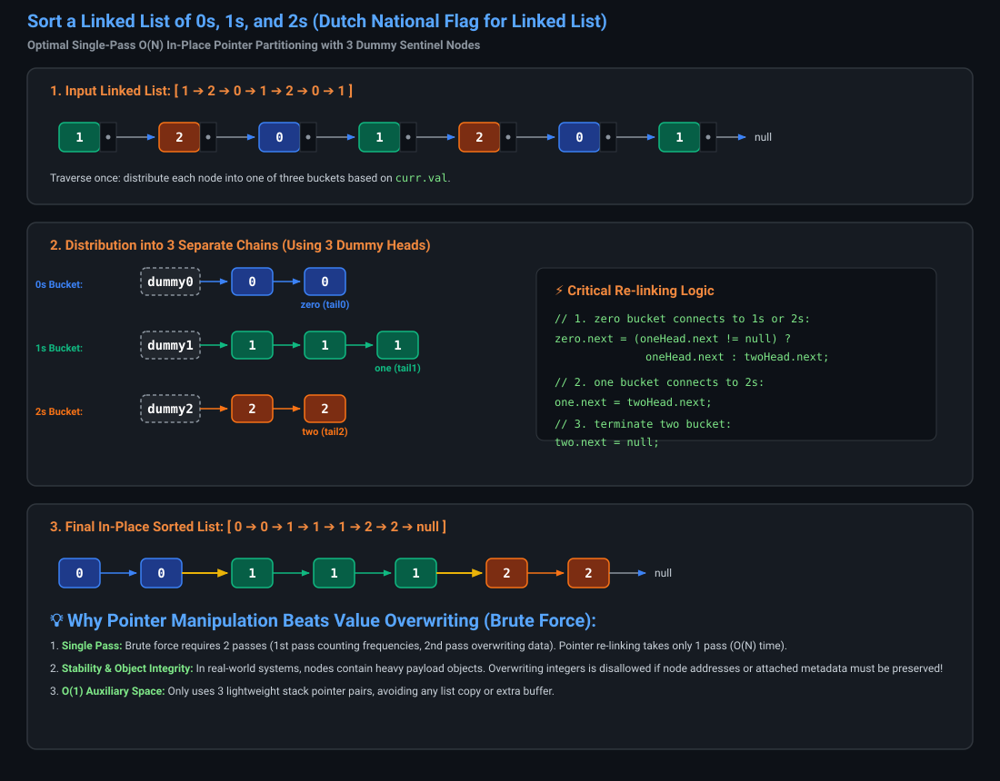
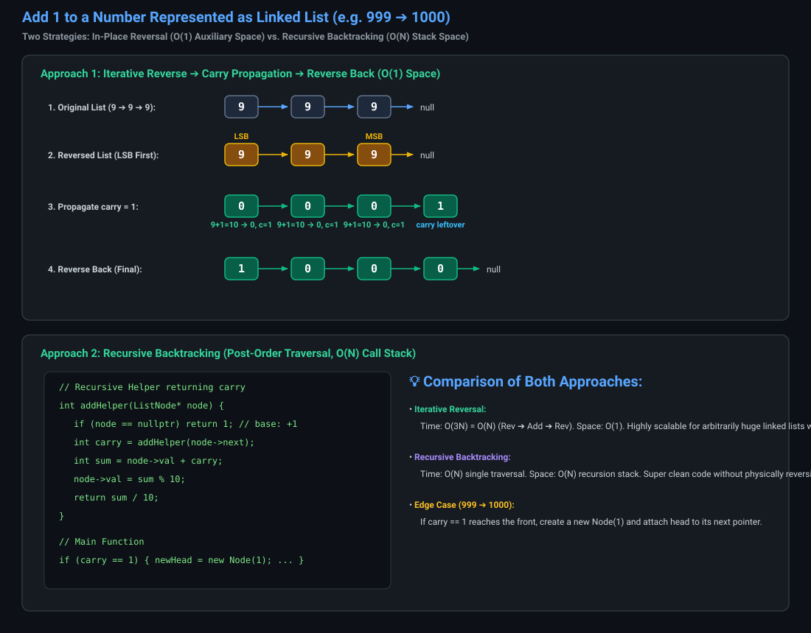
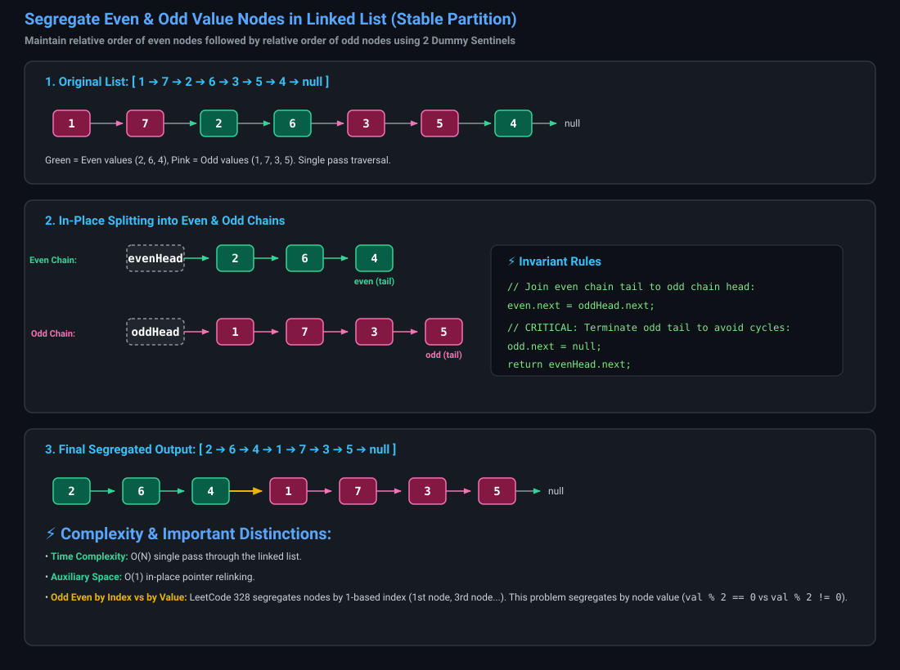
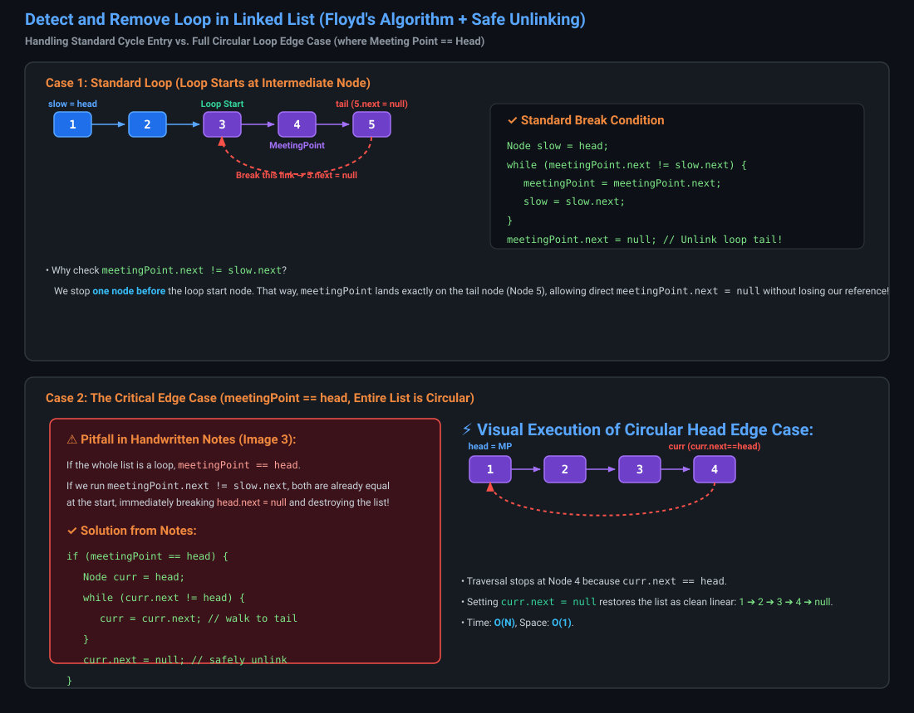
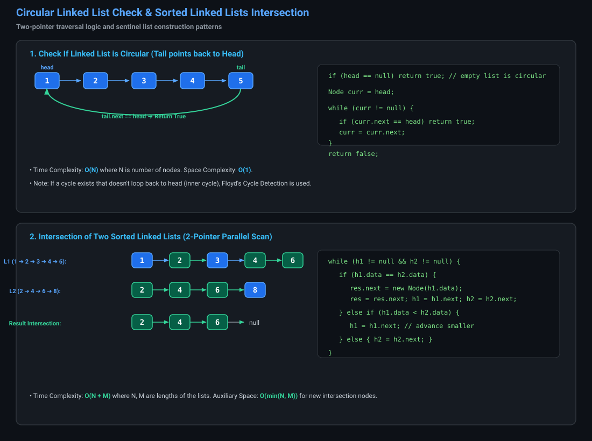

# Linked List Extra Practice & Core Interview Questions

---

# Question 1: Sort a Linked List of 0s, 1s, and 2s (LeetCode / GFG) [Medium]

### Problem Statement
Given a linked list of $N$ nodes where each node contains only integers `0`, `1`, or `2`. Sort the linked list in-place so that all 0s appear first, followed by all 1s, and then all 2s.

---

### Visual Dry Run & 3-Bucket Partitioning



---

### Approach 1: Brute Force (Count Frequencies & Overwrite)

#### C++ Implementation
```cpp

class Solution {
public:
    ListNode* sortList(ListNode* head) {
        int c0 = 0, c1 = 0, c2 = 0;
        ListNode* temp = head;

        // Pass 1: Count occurrences of 0, 1, and 2
        while (temp != nullptr) {
            if (temp->val == 0) c0++;
            else if (temp->val == 1) c1++;
            else if (temp->val == 2) c2++;
            temp = temp->next;
        }

        temp = head;

        // Pass 2: Overwrite values based on counts
        while (temp != nullptr) {
            if (c0 > 0) {
                temp->val = 0;
                c0--;
            } else if (c1 > 0) {
                temp->val = 1;
                c1--;
            } else if (c2 > 0) {
                temp->val = 2;
                c2--;
            }
            temp = temp->next;
        }

        return head;
    }
};

void printList(ListNode* head) {
    while (head != nullptr) {
        cout << head->val << " ";
        head = head->next;
    }
    cout << endl;
}

ListNode* newNode(int data) {
    return new ListNode(data);
}


```

#### Java Implementation (Brute Force)
```java
class Solution {
    public ListNode sortList(ListNode head) {
        int c0 = 0, c1 = 0, c2 = 0;
        ListNode temp = head;

        while (temp != null) {
            if (temp.val == 0) c0++;
            else if (temp.val == 1) c1++;
            else if (temp.val == 2) c2++;
            temp = temp.next;
        }

        temp = head;
        while (temp != null) {
            if (c0 > 0) {
                temp.val = 0;
                c0--;
            } else if (c1 > 0) {
                temp.val = 1;
                c1--;
            } else if (c2 > 0) {
                temp.val = 2;
                c2--;
            }
            temp = temp.next;
        }

        return head;
    }
}
```

---

### Approach 2: Optimal (Single-Pass In-Place Pointer Manipulation with 3 Dummy Nodes)

Instead of overwriting values, we partition the nodes into 3 distinct lists using 3 dummy heads (`zeroHead`, `oneHead`, `twoHead`), and splice them together at the end in $O(1)$ extra space and $O(N)$ single pass time.

#### C++ Implementation (Optimal)
```cpp
#include <bits/stdc++.h>
using namespace std;

class Solution {
public:
    ListNode* sortList(ListNode* head) {
        if (head == nullptr || head->next == nullptr)
            return head;

        // Dummy nodes for 3 buckets
        ListNode* zeroHead = new ListNode(-1);
        ListNode* oneHead = new ListNode(-1);
        ListNode* twoHead = new ListNode(-1);

        ListNode* zero = zeroHead;
        ListNode* one = oneHead;
        ListNode* two = twoHead;
        ListNode* temp = head;

        // Distribute nodes into 3 separate chains
        while (temp != nullptr) {
            if (temp->val == 0) {
                zero->next = temp;
                zero = temp;
            } else if (temp->val == 1) {
                one->next = temp;
                one = temp;
            } else if (temp->val == 2) {
                two->next = temp;
                two = temp;
            }
            temp = temp->next;
        }

        // Connect the 3 chains together handling empty bucket edge cases
        zero->next = (oneHead->next) ? oneHead->next : twoHead->next;
        one->next = twoHead->next;
        two->next = nullptr;

        ListNode* newHead = zeroHead->next;

        // Clean up dummy nodes
        delete zeroHead;
        delete oneHead;
        delete twoHead;

        return newHead;
    }
};
```

#### Java Implementation (Optimal)
```java
class Solution {
    public ListNode sortList(ListNode head) {
        if (head == null || head.next == null) return head;

        ListNode zeroHead = new ListNode(-1);
        ListNode oneHead = new ListNode(-1);
        ListNode twoHead = new ListNode(-1);

        ListNode zero = zeroHead;
        ListNode one = oneHead;
        ListNode two = twoHead;

        ListNode curr = head;
        while (curr != null) {
            ListNode nextNode = curr.next;
            if (curr.val == 0) {
                zero.next = curr;
                zero = zero.next;
            } else if (curr.val == 1) {
                one.next = curr;
                one = one.next;
            } else if (curr.val == 2) {
                two.next = curr;
                two = two.next;
            }
            curr.next = null;
            curr = nextNode;
        }

        // Reconnect chains
        zero.next = (oneHead.next != null) ? oneHead.next : twoHead.next;
        one.next = twoHead.next;
        two.next = null;

        return zeroHead.next;
    }
}
```

---

### Complexity Analysis
- **Time Complexity:** $O(N)$ — exactly one single pass through the linked list.
- **Space Complexity:** $O(1)$ — in-place pointer relinking with zero dynamically allocated extra nodes.

---

# Question 2: Add 1 to a Number Represented as Linked List (LeetCode 369 / GFG) [Medium]

### Problem Statement
A number $N$ is represented in a linked list such that each node contains a single digit. The most significant digit (MSB) is at the head of the list, and the least significant digit (LSB) is at the tail. Add 1 to the number and return the head of the modified linked list.

---

### Visual Dry Run & Propagation



---

### Approach 1: Iterative (Reverse $\rightarrow$ Add 1 with Carry $\rightarrow$ Reverse Back)

#### C++ Implementation
```cpp
class Solution {
private:
    ListNode* reverse(ListNode* head) {
        ListNode* curr = head;
        ListNode* prev = nullptr;
        while (curr != nullptr) {
            ListNode* nextTemp = curr->next;
            curr->next = prev;
            prev = curr;
            curr = nextTemp;
        }
        return prev;
    }

public:
    ListNode* addOne(ListNode* head) {
        if (!head) return new ListNode(1);

        // 1. Reverse to reach LSB first
        ListNode* h = reverse(head);

        // 2. Add 1 using carry-first approach
        ListNode* curr = h;
        ListNode* prev = nullptr;
        int carry = 1; // Initial +1

        while (curr != nullptr && carry > 0) {
            int sum = curr->val + carry;
            curr->val = sum % 10;
            carry = sum / 10;
            prev = curr;
            curr = curr->next;
        }

        // 3. Handle overflow carry (e.g. 999 -> 1000)
        if (carry > 0) {
            prev->next = new ListNode(carry);
        }

        // 4. Reverse back to restore MSB at head
        return reverse(h);
    }
};
```

#### Java Implementation (Iterative)
```java
class Solution {
    private ListNode reverse(ListNode head) {
        ListNode curr = head, prev = null;
        while (curr != null) {
            ListNode nextTemp = curr.next;
            curr.next = prev;
            prev = curr;
            curr = nextTemp;
        }
        return prev;
    }

    public ListNode addOne(ListNode head) {
        if (head == null) return new ListNode(1);

        ListNode h = reverse(head);
        ListNode curr = h, prev = null;
        int carry = 1;

        while (curr != null && carry > 0) {
            int sum = curr.val + carry;
            curr.val = sum % 10;
            carry = sum / 10;
            prev = curr;
            curr = curr.next;
        }

        if (carry > 0) {
            prev.next = new ListNode(carry);
        }

        return reverse(h);
    }
}
```

---

### Approach 2: Recursive Backtracking (Post-Order Traversal)

#### C++ Implementation (Recursive)
```cpp
class Solution {
private:
    int addHelper(ListNode* node) {
        if (node == nullptr) return 1; // Base case: return +1 for LSB

        int carry = addHelper(node->next);
        int sum = node->val + carry;
        node->val = sum % 10;
        return sum / 10;
    }

public:
    ListNode* addOne(ListNode* head) {
        int carry = addHelper(head);
        if (carry > 0) {
            ListNode* newHead = new ListNode(carry);
            newHead->next = head;
            return newHead;
        }
        return head;
    }
};
```

#### Java Implementation (Recursive)
```java
class Solution {
    private int addHelper(ListNode node) {
        if (node == null) return 1; // Base case: carry 1

        int carry = addHelper(node.next);
        int sum = node.val + carry;
        node.val = sum % 10;
        return sum / 10;
    }

    public ListNode addOne(ListNode head) {
        int carry = addHelper(head);
        if (carry > 0) {
            ListNode newHead = new ListNode(carry);
            newHead.next = head;
            return newHead;
        }
        return head;
    }
}
```

---

### Complexity Analysis
- **Iterative Approach:**
  - **Time:** $O(N)$ (3 passes: reverse, add, reverse).
  - **Space:** $O(1)$ auxiliary memory.
- **Recursive Approach:**
  - **Time:** $O(N)$ (1 pass traversal).
  - **Space:** $O(N)$ recursion call stack.

---

# Question 3: Segregate Even and Odd Nodes in a Linked List (by Value) (GFG) [Medium]

### Problem Statement
Given a singly linked list, modify the list such that all the even numbers appear before all the odd numbers in the modified list. The relative order of appearance of numbers within each segregation must remain identical to the original list.

**Constraints:**
- $0 \le N \le 10^6$
- $0 \le \text{Node.data} \le 10^6$

**Example 1:**
- **Input:** `1 -> 7 -> 2 -> 6 -> 3 -> 5 -> 4 -> null`
- **Output:** `2 -> 6 -> 4 -> 1 -> 7 -> 3 -> 5 -> null`
- **Explanation:** Even values `(2, 6, 4)` appear first in their original order, followed by odd values `(1, 7, 3, 5)`.

---

### Visual Dry Run & Two-Chain Partitioning



---

### C++ Implementation
```cpp
class Solution {
public:
    ListNode* segregateEvenOdd(ListNode* head) {
        if (head == nullptr || head->next == nullptr) return head;

        ListNode* evenHead = new ListNode(-1);
        ListNode* oddHead = new ListNode(-1);
        ListNode* even = evenHead;
        ListNode* odd = oddHead;

        ListNode* curr = head;
        while (curr != nullptr) {
            if (curr->val % 2 == 0) {
                even->next = curr;
                even = even->next;
            } else {
                odd->next = curr;
                odd = odd->next;
            }
            curr = curr->next;
        }

        // Join even list to odd list
        even->next = oddHead->next;
        // Terminate odd list to prevent cycles
        odd->next = nullptr;

        ListNode* result = evenHead->next;
        delete evenHead;
        delete oddHead;

        return result;
    }
};
```

---

### Java Implementation (From Notes)
```java
class Solution {
    public static ListNode segregateEvenOdd(ListNode head) {
        ListNode even = new ListNode(-1);
        ListNode h1 = even;
        ListNode odd = new ListNode(-1);
        ListNode h2 = odd;
        ListNode curr = head;

        while (curr != null) {
            if (curr.val % 2 == 0) {
                even.next = curr;
                curr = curr.next;
                even = even.next;
            } else {
                odd.next = curr;
                curr = curr.next;
                odd = odd.next;
            }
        }

        even.next = h2.next;
        odd.next = null;
        return h1.next;
    }
}
```

---

### Complexity Analysis
- **Time Complexity:** $O(N)$ — single pass partition.
- **Space Complexity:** $O(1)$ — in-place pointer relinking.

---

# Question 4: Detect and Remove Loop / Cycle in Linked List (GFG) [Hard]

### Problem Statement
You are given a singly linked list of integers. Determine if it contains a cycle or not. If there is a cycle, remove the cycle (break the loop) and return the modified list.

---

### Visual Analysis & Unlinking Conditions



---

### Handwritten Intuition & Derivation from Notes

1. **Phase 1: Floyd's Detection**:
   - `slow` moves 1 step, `fast` moves 2 steps. If they meet at `meetingPoint`, a cycle exists.
2. **Phase 2: The Critical Edge Case (`meetingPoint == head`)**:
   - If the loop starts at `head` (the whole list is circular), `slow` at `head` and `meetingPoint` at `head` are already equal!
   - Checking `meetingPoint.next != slow.next` would break `head.next = null`, destroying the list.
   - **Fix:** If `meetingPoint == head`, walk a pointer `curr` from `head` until `curr.next == head` (reaching the list's last node), and set `curr.next = null`.
3. **Phase 3: Standard Intermediate Loop Entry**:
   - Start `slow = head` and keep `meetingPoint` at intersection.
   - Advance both simultaneously while `meetingPoint.next != slow.next`.
   - When they stop, `meetingPoint` points precisely to the **tail node** whose `.next` points to loop start.
   - Set `meetingPoint.next = null` to safely remove the cycle.

---

### C++ Implementation
```cpp
class Solution {
private:
    ListNode* detectCycle(ListNode* head) {
        if (!head || !head->next) return nullptr;
        ListNode* slow = head;
        ListNode* fast = head;

        while (fast != nullptr && fast->next != nullptr) {
            slow = slow->next;
            fast = fast->next->next;
            if (slow == fast) return slow;
        }
        return nullptr;
    }

public:
    bool detectAndRemoveCycle(ListNode* head) {
        if (!head || !head->next) return false;

        ListNode* meetingPoint = detectCycle(head);
        if (meetingPoint == nullptr) return false;

        // Edge Case: Entire list is circular (loop starts at head)
        if (meetingPoint == head) {
            ListNode* curr = head;
            while (curr->next != head) {
                curr = curr->next;
            }
            curr->next = nullptr;
            return true;
        }

        // Standard Case: Loop starts at an intermediate node
        ListNode* slow = head;
        while (meetingPoint->next != slow->next) {
            meetingPoint = meetingPoint->next;
            slow = slow->next;
        }
        meetingPoint->next = nullptr;
        return true;
    }
};
```

---

### Java Implementation
```java
class Solution {
    private static Node detectCycle(Node head) {
        if (head == null || head.next == null) return null;
        Node slow = head;
        Node fast = head;

        while (fast != null && fast.next != null) {
            slow = slow.next;
            fast = fast.next.next;
            if (slow == fast) return slow;
        }
        return null;
    }

    public static boolean detectAndRemoveCycle(Node head) {
        if (head == null || head.next == null) return false;

        Node meetingPoint = detectCycle(head);
        if (meetingPoint == null) return false;

        // Edge Case: Whole linked list is circular (meetingPoint == head)
        if (meetingPoint == head) {
            Node curr = head;
            while (curr.next != head) {
                curr = curr.next;
            }
            curr.next = null;
            return true;
        }

        // Standard Case: Stop ONE step before cycle entry
        Node slow = head;
        while (meetingPoint.next != slow.next) {
            meetingPoint = meetingPoint.next;
            slow = slow.next;
        }
        meetingPoint.next = null;
        return true;
    }
}
```

---

### Complexity Analysis
- **Time Complexity:** $O(N)$ — Floyd's cycle detection $O(N)$ + tail discovery $O(N)$.
- **Space Complexity:** $O(1)$ — constant extra space.

---

# Question 5: Check If Linked List is Circular (GFG) [Basic / Easy]

### Problem Statement
Given `head`, the head of a singly linked list, determine if the linked list is circular or not. A linked list is called circular if it is not NULL terminated and its last node points back to `head`. An empty linked list is considered circular.

---

### Visual & Algorithm Flow



---

### C++ Implementation
```cpp
class Solution {
public:
    bool isCircular(ListNode* head) {
        if (head == nullptr) return true; // Empty list is circular by definition

        ListNode* curr = head;
        while (curr != nullptr) {
            if (curr->next == head) return true;
            curr = curr->next;
        }
        return false;
    }
};
```

---

### Java Implementation
```java
class Solution {
    public boolean isCircular(Node head) {
        if (head == null) return true; // An empty linked list is considered circular

        Node curr = head;
        while (curr != null) {
            if (curr.next == head) return true;
            curr = curr.next;
        }
        return false;
    }
}
```

---

### Complexity Analysis
- **Time Complexity:** $O(N)$ — traverses nodes until reaching `null` or `head`.
- **Space Complexity:** $O(1)$ — uses only a single pointer.

---

# Question 6: Intersection of Two Sorted Linked Lists (GFG) [Easy]

Merge two sorted List

### Problem Statement
Given two linked lists sorted in increasing order, create a new list representing the intersection of the two lists. The new list should be constructed with its own memory — the original lists must not be modified.

**Constraints:**
- $1 \le \text{size of lists} \le 5000$
- $1 \le \text{Node.data} \le 1000$

**Example 1:**
- **Input:**
  - $L_1 = 1 \rightarrow 2 \rightarrow 3 \rightarrow 4 \rightarrow 6$
  - $L_2 = 2 \rightarrow 4 \rightarrow 6 \rightarrow 8$
- **Output:** $2 \rightarrow 4 \rightarrow 6$
- **Explanation:** $2, 4,$ and $6$ are the common elements in both lists.

---

### C++ Implementation
```cpp
class Solution {
public:
    ListNode* findIntersection(ListNode* head1, ListNode* head2) {
        ListNode* h1 = head1;
        ListNode* h2 = head2;

        ListNode* dummy = new ListNode(-1);
        ListNode* res = dummy;

        while (h1 != nullptr && h2 != nullptr) {
            if (h1->val == h2->val) {
                res->next = new ListNode(h1->val);
                res = res->next;
                h1 = h1->next;
                h2 = h2->next;
            } else if (h1->val < h2->val) {
                h1 = h1->next; // Advance smaller pointer
            } else {
                h2 = h2->next;
            }
        }

        ListNode* result = dummy->next;
        delete dummy;
        return result;
    }
};
```

---

### Java Implementation
```java
class Solution {
    public static Node findIntersection(Node head1, Node head2) {
        Node h1 = head1;
        Node h2 = head2;

        Node dummy = new Node(-1);
        Node res = dummy;

        while (h1 != null && h2 != null) {
            if (h1.data == h2.data) {
                res.next = new Node(h1.data);
                res = res.next;
                h1 = h1.next;
                h2 = h2.next;
            } else if (h1.data < h2.data) {
                h1 = h1.next;
            } else {
                h2 = h2.next;
            }
        }

        return dummy.next;
    }
}
```

---

### Complexity Analysis
- **Time Complexity:** $O(N + M)$ where $N$ and $M$ are lengths of list 1 and list 2.
- **Space Complexity:** $O(\min(N, M))$ to construct the new intersection linked list.