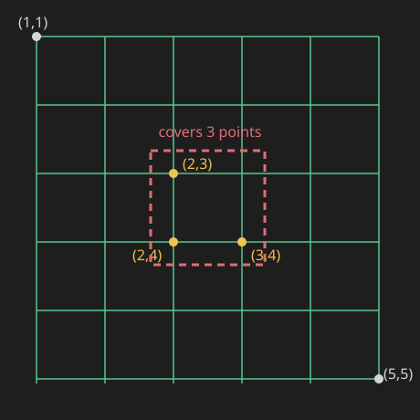
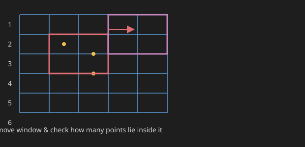
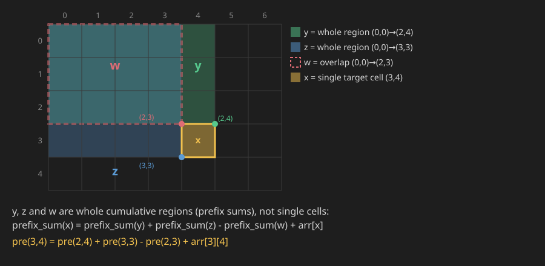
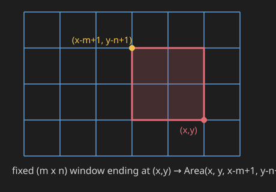
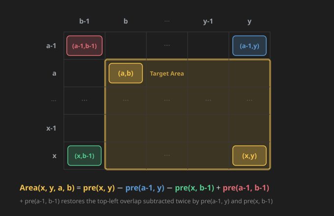

## Q1. Maximum Points Covered


Given **N** points on a 2D plane. Find the maximum number of points which can be covered by a rectangle with length x and breadth y.

A point is said to be covered by a rectangle if it lies on the sides or inside the rectangle.

**Example 1:**

```
Input:
N = 5
Points = {(1,1), (2,3), (3,4), (2,4), (5,5)}
x = 2, y = 2

Output:
3
```

**Explanation:**



Here we can see that this rectangle covers 3 points.

**Your Task:** You don't need to read input or print anything. Your task is to complete the function `maximumpoints()` which takes N, arr (2D list of points), x and y as input parameters and returns an integer denoting maximum number of points that can be covered by rectangle of size x*y.

**Constraints:**

```
1 <= N <= 10^5
1 <= arr[i][0], arr[i][1] <= 1000
1 <= x, y <= 1000
```

We need to find maximum no. of points covered by Rectangle.

### Bruteforce

Move window & check how many points are there inside window!!



So we try to check for every window.

`TC -> (N*M) * x * y`

For every window we are checking points x,y lie inside window or not.

Here we are checking every submatrix of a window.

### New Better

New: How do [we] get 2D Prefix Sum??

**Example:**

```
1  2  3
5  4  2
2  1  4
```

(with indices `a[0][0]=1, a[0][1]=2, a[0][2]=3, a[1][0]=5, a[1][1]=4, a[1][2]=2, a[2][0]=2, a[2][1]=1, a[2][2]=4`)

To get prefix sum of Element at `[1][1]` we see sum on left & up of it.

![Prefix sum concept — sum of the top-left block up to a[1][1]](img-prefix-sum-concept.svg)

So Prefix sum of `a[1][1] = 5+2+4+1 = 12`

We cover all Element in that Area.

Suppose prefix sum of `a[2][2]` — so here prefixSum is sum of **All** Elements!!

Suppose we need Prefix Sum of Element `x` that lies in the Area Red Marked.



```
prefix_sum(x) = prefix_sum(y) + prefix_sum(z) - prefix_sum(w) + arr[x]
```

Or in 2D — here `y` is the **up** neighbor `(row-1, col)` and `z` is the **left** neighbor `(row, col-1)`:

```
pre(x,y) = pre(x-1,y) + pre(x,y-1) - pre(x-1,y-1) + arr(x,y)
```

**Concrete example** (target cell `x` at `row=3, col=4` on the 5x7 grid above):

```
pre(3,4) = pre(2,4) + pre(3,3) - pre(2,3) + arr[3][4]
```

`Arr[x][y]` add karna mat bhulna, woh important hai!! (Don't forget to add `arr[x][y]` — that's important!!)

### Applying prefix sum to this problem

Suppose we need a `(2,2)` Submatrix from `(x,y)` — so this is `[x-2, y-2]` to `(x,y)`.

Suppose we need all submatrices of size `(m,n)`:

`a = x-1, b = y-1` (according to the previous [rectangle-sum] question)

So for every point we get `Area(x, y, x-m+1, y-n+1)` & we can find Maximum of All.



### C++ Solution

```cpp
int maximumpoints(vector<vector<int>> arr, int n, int x, int y) {
    // code here
    int row = 0, col = 0;

    /*
    The row/col loop just finds the largest y-coordinate (row) and x-coordinate (col) actually present among the given points. That sizes the frequency/prefix-sum matrix mat to exactly (row+1) x (col+1) — big enough to hold every point, without wastefully allocating the full 1000 x 1000 grid when the points are clustered in a small region.
    */
    for (int i = 0; i < n; i++) {
        if (arr[i][1] > row) row = arr[i][1];
        if (arr[i][0] > col) col = arr[i][0];
    }
    // Setting row & col size of Matrix as per the array elements
    vector<vector<int>> mat(row + 1, vector<int>(col + 1, 0));
    for (int i = 0; i < n; i++) {
        mat[arr[i][1]][arr[i][0]] += 1;
    }
    for (int i = 1; i <= row; i++) {
        for (int j = 1; j <= col; j++)
            mat[i][j] += mat[i][j-1] + mat[i-1][j] - mat[i-1][j-1];
    }
   
    int windowLength = min(col, x + 1), windowWidth = min(row, y + 1), res = 0;
    for (int i = windowWidth; i <= row; i++) {
        for (int j = windowLength; j <= col; j++) {
            int subMatSum = mat[i][j] - mat[i - windowWidth][j] - mat[i][j - windowLength] + mat[i - windowWidth][j - windowLength];
            res = max(res, subMatSum);
        }
    }
    return res;
}

int main() {
    // your code goes here
    int n; cin >> n;
    vector<vector<int>> arr(n, vector<int>(2, 0));   // (n)(2) ke Array banaye
    for (int i = 0; i < n; i++) cin >> arr[i][0] >> arr[i][1];
    int x, y; cin >> x >> y;                          // (x,y) window size
    cout << maximumpoints(arr, n, x, y);
    return 0;
}
```

### Why `windowLength = x+1` and `windowWidth = y+1` (not just `x` and `y`)?

A rectangle of **length x** covers a continuous span `[c, c+x]` along that axis, if its left edge sits at coordinate `c`. A point is "covered" if it lies on the rectangle's sides *or* inside it — so **both endpoints `c` and `c+x` count as covered**, plus every integer coordinate in between. That's `x+1` distinct integer coordinates, not `x`:

```
x = 2, window placed at c = 3  ->  covers columns 3, 4, 5  ->  3 = x+1 columns
```

Since every point sits at an integer coordinate (constraint: `1 <= arr[i][0] <= 1000`), aligning the window's edge exactly on an existing point coordinate is always at least as good as any other placement — you never lose coverage and often gain it. So `windowLength = x+1` is the number of grid-columns the prefix-sum window needs to span (same reasoning gives `windowWidth = y+1` for breadth `y`).

### Why the `min(col, ...)` / `min(row, ...)` cap matters — worked example

If `x+1` (or `y+1`) is larger than the number of distinct columns/rows that actually contain points, the window can't meaningfully be made any wider than the data itself. Skipping the cap doesn't crash anything (the loop's own bound `i <= row` just makes it run zero times) — but it silently gives the **wrong answer**.

**Example:** points `(1,1), (2,2), (3,3)` — only 3 points, all coordinates within `1..3`. So `row = 3, col = 3`. Say `x = 10, y = 10` (a rectangle far bigger than the point spread — legal, since `x,y <= 1000`).

**Without the cap** (pretend `windowWidth = y+1 = 11` directly):

```cpp
for (int i = windowWidth; i <= row; i++)   // for (i = 11; i <= 3; i++)
```

`11 <= 3` is false immediately, so the loop body never runs even once — `res` stays `0`. That's wrong: a `10x10` rectangle trivially covers all 3 points in a single placement, so the correct answer is `3`.

**With the cap** — `windowWidth = min(row=3, y+1=11) = 3`, and likewise `windowLength = 3`:

```cpp
for (int i = 3; i <= 3; i++)      // runs exactly once, i = 3
    for (int j = 3; j <= 3; j++)  // runs exactly once, j = 3
```

Building the prefix-sum matrix `mat` for these 3 points and evaluating `subMatSum(3,3)`:

```
subMatSum = mat[3][3] - mat[0][3] - mat[3][0] + mat[0][0]
          = 3 - 0 - 0 + 0
          = 3
```

`res = 3` — correct. The cap clamps the window down to exactly the `1..3` range that actually contains data, so that single window position correctly captures everything. (This cap being exactly `row`/`col`, rather than `row+1`/`col+1`, works out precisely because points are 1-indexed per the constraints — index `0` of `mat` is always empty padding, so `1..row` and `1..col` are exactly the populated positions.)

**Complexity:**
- **Time:** `O(N + R*C)`, where `R` and `C` are the max row/col coordinates seen among the points (bounded by `1000` per the constraints). Finding `row`/`col` and populating point counts is `O(N)`; building the 2D prefix sum matrix and then sliding the fixed-size window over it are both `O(R*C)`. Compare this to the brute force's `O(N*M*x*y)` — using the prefix sum turns each window-sum check from `O(x*y)` into `O(1)`.
- **Space:** `O(R*C)` for the `mat` prefix-sum matrix (up to `1000 x 1000`), dominating the `O(N)` used by the input array.

---

## Q2. 304. Range Sum Query 2D - Immutable

Given a 2D matrix `matrix`, handle multiple queries of the following type:

- Calculate the **sum** of the elements of `matrix` inside the rectangle defined by its **upper left corner** `(row1, col1)` and **lower right corner** `(row2, col2)`.

Implement the `NumMatrix` class:

- `NumMatrix(int[][] matrix)` Initializes the object with the integer matrix `matrix`.
- `int sumRegion(int row1, int col1, int row2, int col2)` Returns the sum of the elements of `matrix` inside the rectangle defined by its **upper left corner** `(row1, col1)` and **lower right corner** `(row2, col2)`.

You must design an algorithm where `sumRegion` works on `O(1)` time complexity.

**Example (matrix used throughout):**


```
Input
["NumMatrix", "sumRegion", "sumRegion", "sumRegion"]
[[[3,0,1,4,2],[5,6,3,2,1],[1,2,0,1,5],[4,1,0,1,7],[1,0,3,0,5]], [2,1,4,3], [1,1,2,2], [1,2,2,4]]
Output
[null, 8, 11, 12]

Explanation
NumMatrix numMatrix = new NumMatrix([[3,0,1,4,2],[5,6,3,2,1],[1,2,0,1,5],[4,1,0,1,7],[1,0,3,0,5]]);
numMatrix.sumRegion(2, 1, 4, 3); // return 8  (i.e sum of the red rectangle)
numMatrix.sumRegion(1, 1, 2, 2); // return 11 (i.e sum of the green rectangle)
numMatrix.sumRegion(1, 2, 2, 4); // return 12 (i.e sum of the blue rectangle)
```

**Constraints:**

```
m == matrix.length
n == matrix[i].length
1 <= m, n <= 200
-10^4 <= matrix[i][j] <= 10^4
0 <= row1 <= row2 < m
0 <= col1 <= col2 < n
At most 10^4 calls will be made to sumRegion.
```

### Derivation — arbitrary rectangle sum, (a,b) → (x,y)

We want the Red Marked Area — so what we do:



```
Area(x, y, a, b) = pre(x, y) - pre(a-1, y) - pre(x, b-1) + pre(a-1, b-1)
```

(as `pre(a-1,b-1)` gets subtracted twice — once via `pre(a-1,y)` and once via `pre(x,b-1)` — we add it back once.)

### Java Solution

```java
class NumMatrix {
    private int[][] presum;
    public NumMatrix(int[][] mat) {
        presum = new int[mat.length][mat[0].length];
        for (int i = 0; i < mat.length; i++) {
            for (int j = 0; j < mat[0].length; j++) {
                int pre = mat[i][j];
                if (i - 1 >= 0) pre += presum[i-1][j];
                if (j - 1 >= 0) pre += presum[i][j-1];
                if (i - 1 >= 0 && j - 1 >= 0) pre -= presum[i-1][j-1];
                presum[i][j] = pre;
            }
        }
    }

    public int sumRegion(int row1, int col1, int row2, int col2) {
        int res = presum[row2][col2];
        if (row1 - 1 >= 0) res -= presum[row1-1][col2];
        if (col1 - 1 >= 0) res -= presum[row2][col1-1];
        if (row1 - 1 >= 0 && col1 - 1 >= 0) res += presum[row1-1][col1-1];
        return res;
    }
}
```

> C++ mein `int[][]` ki jagah `vector<vector<int>>` aa jaega (in C++, `vector<vector<int>>` takes the place of `int[][]`).

**Complexity:**
- **Time:** Constructor (building `presum`) is `O(M*N)` — one pass over every cell of the matrix, doing O(1) work per cell. `sumRegion` is `O(1)` — exactly the requirement stated in the problem, since it's just 4 array lookups and additions/subtractions using the derived formula, regardless of the rectangle's size.
- **Space:** `O(M*N)` for the `presum` matrix, which is the same size as the input matrix; `sumRegion` itself uses `O(1)` extra space.

---

## Q3. 3212. Count Submatrices With Equal Frequency of X and Y

Link--> https://leetcode.com/problems/count-submatrices-with-equal-frequency-of-x-and-y/description/

**Difficulty:** Medium
**Topics:** Array, Matrix, Prefix Sum

---

### Problem Description

You are given a 2D character matrix `grid` where each cell `grid[i][j]` contains one of three possible values: `'X'`, `'Y'`, or `'.'`.

Your task is to count how many submatrices satisfy **ALL** of the following conditions:

1. The submatrix must include the top-left corner of the grid (position `grid[0][0]`).
2. The submatrix must contain an equal number of `'X'` and `'Y'` characters.
3. The submatrix must contain at least one `'X'` character.

---

### Examples

**Example 1:**

**Input:** `grid = [["X","Y","."],["Y",".","."]]`
**Output:** `3`
**Explanation:**
- The submatrix ending at `(0, 1)` contains one 'X' and one 'Y'.
- The submatrix ending at `(1, 0)` contains one 'X' and one 'Y'.
- The submatrix ending at `(1, 1)` contains one 'X' and one 'Y'.
All these submatrices include `grid[0][0]`, have equal 'X' and 'Y' counts, and at least one 'X'.

**Example 2:**

**Input:** `grid = [["X","X"],["X","Y"]]`
**Output:** `0`
**Explanation:** No submatrix starting at `(0, 0)` has the same number of 'X' and 'Y' characters.

**Example 3:**

**Input:** `grid = [[".","."],[".","."]]`
**Output:** `0`
**Explanation:** No submatrix starting at `(0, 0)` has at least one 'X' character.

---

### Constraints

- `1 <= grid.length, grid[i].length <= 1000`
- `grid[i][j]` is `'X'`, `'Y'`, or `'.'`.


### Solution

1. Use 2d prefix to get number of x and y in vectorof vector of pair
 as it is prefix sum so it always has a[0][0] so no need to worry for that 

2. now check for  equal x and y and freq(x)>0


```cpp
class Solution {
public:
    int numberOfSubmatrices(vector<vector<char>>& grid) {
        int n=grid.size();
        int m=grid[0].size();
        vector<vector<pair<int,int>>> freqcnt(n,vector<pair<int,int>>(m,{0,0}));
        int ans=0;
        for(int i=0;i<n;i++){
            for(int j=0;j<m;j++){
                if(i-1>=0){
                    freqcnt[i][j].first+=freqcnt[i-1][j].first;
                    freqcnt[i][j].second+=freqcnt[i-1][j].second;
                }
                if(j-1>=0){
                    freqcnt[i][j].first+=freqcnt[i][j-1].first;
                    freqcnt[i][j].second+=freqcnt[i][j-1].second;
                }
                 if(i-1>=0 && j-1>=0){
                    freqcnt[i][j].first-=freqcnt[i-1][j-1].first;
                    freqcnt[i][j].second-=freqcnt[i-1][j-1].second;
                }
                if(grid[i][j]=='X'){
                    freqcnt[i][j].first++;
                }else if(grid[i][j]=='Y'){
                    freqcnt[i][j].second++;
                }

                if(freqcnt[i][j].first>0 && freqcnt[i][j].first==freqcnt[i][j].second) ans++;
            }
        }
        return ans;
    }
};

```

**Complexity:**
- **Time:** `O(N*M)` — a single pass over the grid, and each cell does `O(1)` work to update its running (X-count, Y-count) prefix sum using the same inclusion-exclusion formula from Q1/Q2, then an `O(1)` check for the equal-and-positive condition.
- **Space:** `O(N*M)` for the `freqcnt` 2D array of `(X count, Y count)` pairs, one entry per cell of the grid.

---

## Q4--> 3070. Count Submatrices with Top-Left Element and Sum Less Than k

You are given a **0-indexed** integer matrix `grid` and an integer `k`.

Return the number of submatrices that contain the top-left element of the grid, and have a sum less than or equal to `k`.

### Example 1:

**Input:** `grid = [[7,6,3],[6,6,1]], k = 18`
**Output:** `4`
**Explanation:** There are only 4 submatrices, shown in the image above, that contain the top-left element of grid, and have a sum less than or equal to 18.

### Example 2:

**Input:** `grid = [[7,2,9],[1,5,0],[2,6,6]], k = 20`
**Output:** `6`
**Explanation:** There are only 6 submatrices, shown in the image above, that contain the top-left element of grid, and have a sum less than or equal to 20.

### Constraints:

* `m == grid.length`
* `n == grid[i].length`
* `1 <= n, m <= 1000`
* `0 <= grid[i][j] <= 1000`
* `1 <= k <= 10^9`

As it needs top-left element so it is hint to use 2d prefix sum 

```java
class Solution {
     private int[][] presum;
      public int cntNumMatrix(int[][] mat,int k) {
        int cnt=0;
        presum=new int[mat.length][mat[0].length];
        for(int i=0;i<mat.length;i++){
            for(int j=0;j<mat[0].length;j++){
                int pre=mat[i][j];
                if(i-1>=0) pre+=presum[i-1][j];
                if(j-1>=0) pre+=presum[i][j-1];
                if(i-1>=0 && j-1>=0) pre-=presum[i-1][j-1];
                presum[i][j]=pre;
                if(presum[i][j]<=k) cnt++;
            }
        }
        return cnt;
    }
    
    public int countSubmatrices(int[][] grid, int k) {
        return cntNumMatrix(grid,k);
    }
}
```

**Complexity (first version above):**
- **Time:** `O(M*N)` — one pass over the grid, `O(1)` work per cell to extend the prefix sum and check `<= k`.
- **Space:** `O(M*N)` for the separate `presum` array, the same size as `grid`.

Your logic here is flawless. You correctly identified that a submatrix starting at `(0,0)` and ending at `(i,j)` can be calculated using the classic Inclusion-Exclusion Principle formula: 
`Current Cell + Top Area + Left Area - Top-Left Overlap`

Your solution runs in **$O(M \times N)$ Time** and **$O(M \times N)$ Space**, which is an accepted, optimal approach. 

However, here is the "Senior Engineer" code review. We can optimize this even further to make it run in **$O(1)$ Space** and save thousands of unnecessary CPU cycles by looking closely at the problem constraints.

### 1. The Space Optimization ($O(1)$ Memory)
You are currently allocating a brand new `presum` matrix that is the exact same size as the input `grid`. If the matrix is massive, this doubles our memory footprint.

Because your algorithm processes strictly top-to-bottom, left-to-right, we never need the original value of a cell once we've calculated its prefix sum. This means we can just **overwrite the input `grid` directly**. We turn `grid` into our `presum` array, dropping our extra space down to absolutely zero ($O(1)$).

### 2. The Early Exit (The CPU Saver)
Look closely at the problem constraints: `0 <= grid[i][j] <= 1000`. 
**There are no negative numbers.**

Because there are no negative numbers, the prefix sum is **strictly non-decreasing**. As you move right across a row, the sum can only get bigger or stay the same. It can never shrink.

What happens if `k = 18`, and at `grid[2][2]` the prefix sum reaches `20`? 
In your current code, the inner loop keeps going to `j = 3, 4, 5...`, doing math and checking `if (pre <= k)`. But we *know* mathematically that every cell to the right will also be `> 18`. We can just `break` the inner loop completely and immediately jump to the next row!

### The Refactored Code (In-Place & Early Exit)

Here is how a Senior Engineer writes this to be as lean and fast as mathematically possible:

```java
class Solution {
    public int countSubmatrices(int[][] grid, int k) {
        int cnt = 0;
        int m = grid.length;
        int n = grid[0].length;
        
        for (int i = 0; i < m; i++) {
            for (int j = 0; j < n; j++) {
                
                // Calculate 2D Prefix Sum IN-PLACE
                if (i > 0) grid[i][j] += grid[i - 1][j];
                if (j > 0) grid[i][j] += grid[i][j - 1];
                if (i > 0 && j > 0) grid[i][j] -= grid[i - 1][j - 1];
                
                // Check condition
                if (grid[i][j] <= k) {
                    cnt++;
                } else {
                    // The sum exceeded k. 
                    // Since there are no negative numbers, moving right will only increase the sum.
                    // Stop checking the rest of this row immediately!
                    break;
                }
            }
        }
        return cnt;
    }
}
```

### The Verdict
By combining In-Place modification and the `break` statement, you transform a standard $O(M \times N)$ solution into one that uses zero extra memory and actively short-circuits to avoid dead computations. 

**Complexity (refactored, final solution):**
- **Time:** `O(M*N)` in the worst case (e.g. if `k` is large enough that the `break` never triggers, such as when all sums stay `<= k`) — the early `break` doesn't change the asymptotic worst case, but it does prune a lot of real work in practice whenever a row's prefix sum exceeds `k` partway through, since every non-negative grid means the rest of that row is guaranteed to also exceed `k`.
- **Space:** `O(1)` extra space — the prefix sum is computed in-place by overwriting `grid` itself, instead of allocating a separate `presum` matrix.
