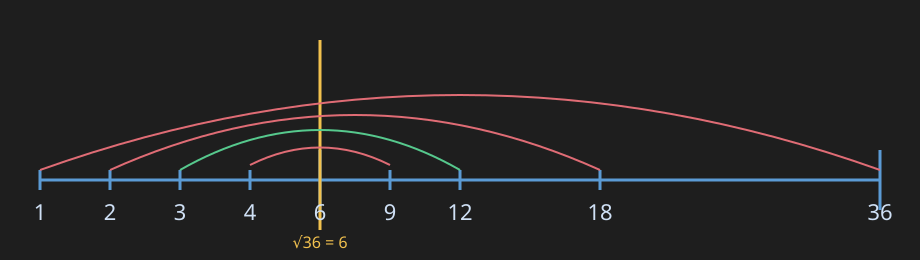
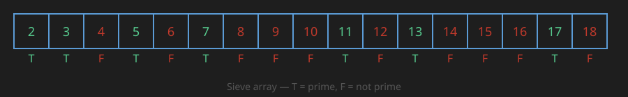
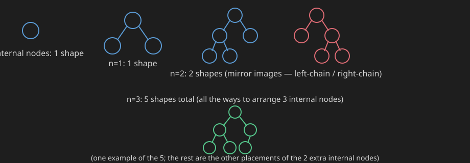
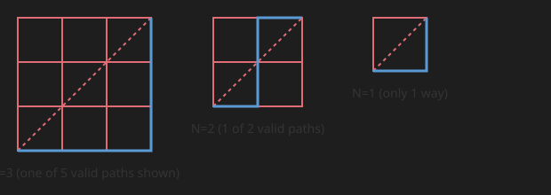

## 1. Base Conversion

Converting a number from one base to another is a very important type of question.

**Explanation:**
- **Decimal → Base B:** repeatedly divide the number by `B`, collecting remainders. The remainders, read in *reverse* order (last remainder first), give the digits of the number in base `B`.
- **Base B → Decimal:** read the number digit by digit from left to right, and at each step do `result = result * B + digit`. This is Horner's method — equivalent to `Σ digit[i] * B^i`.

**Practice Questions:**
- LeetCode 504 — Base 7
- LeetCode 405 — Convert a Number to Hexadecimal
- LeetCode 1017 — Convert to Base -2 (a trickier negative-base variant)

**C++ Code:**

```cpp
#include <string>
#include <algorithm>
#include <cctype>
using namespace std;


string decimalToBase(long long n, int base) {
    if (n == 0) return "0";
    bool neg = n < 0;
    if (neg) n = -n;
    string digits = "0123456789ABCDEF";
    string res;
    while (n > 0) {
        res += digits[n % base];
        n /= base;
    }
    reverse(res.begin(), res.end());
    return neg ? "-" + res : res;
}

// Any base string to decimal
long long baseToDecimal(string s, int base) {
    long long result = 0;
    for (char c : s) {
        int digit = isdigit(c) ? c - '0' : (toupper(c) - 'A' + 10);
        result = result * base + digit;
    }
    return result;
}
```

**Java Code:**

```java
public class BaseConversion {
    // Decimal to any base (2 to 16)
    static String decimalToBase(long n, int base) {
        if (n == 0) return "0";
        boolean neg = n < 0;
        if (neg) n = -n;
        String digits = "0123456789ABCDEF";
        StringBuilder res = new StringBuilder();
        while (n > 0) {
            res.append(digits.charAt((int) (n % base)));
            n /= base;
        }
        res.reverse();
        return neg ? "-" + res : res.toString();
    }

    // Any base string to decimal
    static long baseToDecimal(String s, int base) {
        long result = 0;
        for (char c : s.toCharArray()) {
            int digit = Character.isDigit(c) ? c - '0' : (Character.toUpperCase(c) - 'A' + 10);
            result = result * base + digit;
        }
        return result;
    }
}
```

**Complexity:**
- **Time:** `O(log_B(N))` for `decimalToBase` — this means "log of N, base B" (NOT "log of B"). Each iteration divides `n` by `B`, so after `k` iterations `n ≈ N / B^k`; the loop stops once that reaches `0`, i.e. when `B^k ≈ N`, which gives `k = log(N) / log(B) = log_B(N)`. This is exactly the number of digits `N` has when written in base `B` — it still grows with `N` (a bigger number needs more digit-divisions), while a bigger `B` just means each digit "holds more", so fewer digits/iterations are needed for the same `N`. `baseToDecimal` is `O(L)`, where `L` is the length of the input string (one pass over the digits).
- **Space:** `O(log_B(N))` for the result string built by `decimalToBase` (that's how many digits it holds, same reasoning as above); `O(1)` extra space for `baseToDecimal` besides the output.

## 2. Is a Number Prime?

**Example:** `N = 36`

Factor pairs of 36 (each pair multiplies to 36):

```
1  x 36       36  x 1
2  x 18       18  x 2
3  x 12       12  x 3
4  x 9         9  x 4
        6  x 6
```

Plotting these factors on a number line and drawing arcs between each pair that multiplies to 36 shows something important: every factor is either **≤ √36 (=6)** or **≥ √36**, and they pair up symmetrically around √N.



**Observation:** all factors are either to the left of √N or to the right of √N — the factors split into two symmetric halves around √N.

**Key logic for `isPrime()`:** if there are no factors in the range `1 to √n`, then there will be no factors from `√n to N` either. So we only need to check divisibility from `1` up to `√N`.

> Since `√N` may not be an integer, in code we check up to `floor(√N)` (or loop `i*i <= N`, equivalently `i <= ceil(√N)`).

**Why checking up to √N is enough:** if a number `a` divides `N` in the range `1` to `√N`, then `N/a` is the paired factor lying in the range `√N` to `N`. So you only need to check up to `√N` — the factors beyond that are automatically covered as `N/a`.

```
Naive way to find all primes upto N:
for (i = 1 to N) loop
    check if i is prime or not   // O(√i) check each time
```

**TC (naive `isPrime` check):** `O(√N)`

**Practice Questions:**
- GFG — Check for Prime
- LeetCode 204 — Count Primes (uses the sieve, see section 3)
- LeetCode 762 — Prime Number of Set Bits in Binary Representation

**C++ Code:**

```cpp
bool isPrime(int n) {
    if (n < 2) return false;
    if (n == 2) return true;
    if (n % 2 == 0) return false;
    for (long long i = 3; i * i <= n; i += 2) {
        if (n % i == 0) return false;
    }
    return true;
}
```

**Java Code:**

```java
static boolean isPrime(int n) {
    if (n < 2) return false;
    if (n == 2) return true;
    if (n % 2 == 0) return false;
    for (long i = 3; i * i <= n; i += 2) {
        if (n % i == 0) return false;
    }
    return true;
}
```

**Complexity:**
- **Time:** `O(√N)` — the loop only needs to test divisors up to `√N` (see the factor-pairing explanation above: any factor pair has one member `≤ √N`), and skipping even numbers just halves the constant, not the asymptotic bound.
- **Space:** `O(1)` — only a few scalar variables are used, no extra data structure grows with `N`.

## 3. Sieve of Eratosthenes

Checking primality of every number individually (`O(N√N)` for a range) is wasteful. A better approach is the **Sieve of Eratosthenes**.

**Idea:** Once you find that a number is prime, mark all of its multiples as **not prime** (`False`), since a multiple of a prime can never itself be prime.

**Example:** `N = 18`. Start with every index from `2` to `18` marked `True` (assumed prime), then:

- Mark multiples of `2` as `False`: 4, 6, 8, 10, 12, 14, 16, 18
- `4` is already marked `False`, so skip it (don't re-process its multiples)
- `5` is still `True` (prime) → mark multiples of `5`: 10, 15
- Mark multiples of `3` as `False`: 6, 9, 12, 15, 18

Final sieve for N = 18 (✓ = prime, ✗ = composite):



**Do we need to check the whole array to find the next prime to sieve?**

The outer loop only needs to run `i` from `2` up to `√n` — not the whole array. **Why?** Because if a number `≤ n` had a factor, that factor would have to lie in the range `2` to `√n` (same symmetric-factor logic as the prime-check above). So for `N=18` the outer loop only needs `i` up to `4` (since `√18 ≈ 4.2`):

- For `5` to `√18`, the loop needs to go up to `2`
- For `6,7,8` etc. it's already covered
- For `9,…,15`, up to `3`
- For `16,17,18`, up to `4`

**Pseudocode:**

```
for (int i = 2; i <= √n; i++)
    if (sieve[i] == True)               // i itself is prime
        for (int j = i; i*j <= n; j++)  // start marking from i*i, not 2*i
            sieve[i*j] = False;
```

> `i` here is the prime number whose multiples we are currently marking as `False`. We don't start marking from `2*i` because those smaller multiples of `i` were already marked `False` by a smaller prime earlier.

**TC of Sieve of Eratosthenes:** `O(N log log N)`

**Practice Questions:**
- LeetCode 204 — Count Primes
- GFG — Sieve of Eratosthenes
- LeetCode 2761 — Prime Pairs With Target Sum (uses a precomputed sieve)

**C++ Code:**

```cpp
#include <vector>
using namespace std;

vector<bool> sieveOfEratosthenes(int n) {
    vector<bool> isPrime(n + 1, true);
    isPrime[0] = false;
    if (n >= 1) isPrime[1] = false;
    for (int i = 2; (long long) i * i <= n; i++) {
        if (isPrime[i]) {
            for (int j = i * i; j <= n; j += i) {   // start marking from i*i
                isPrime[j] = false;
            }
        }
    }
    return isPrime;
}
```

**Java Code:**

```java
static boolean[] sieveOfEratosthenes(int n) {
    boolean[] isPrime = new boolean[n + 1];
    Arrays.fill(isPrime, true);
    isPrime[0] = false;
    if (n >= 1) isPrime[1] = false;
    for (int i = 2; (long) i * i <= n; i++) {
        if (isPrime[i]) {
            for (int j = i * i; j <= n; j += i) {   // start marking from i*i
                isPrime[j] = false;
            }
        }
    }
    return isPrime;
}
```

**Complexity:**
- **Time:** `O(N log log N)` — the outer loop runs to `√N`, and for each prime `i` the inner loop marks its multiples, which happens `N/i` times. Summing `N/p` over all primes `p ≤ N` converges to `N log log N` by a known result about the sum of reciprocals of primes.
- **Space:** `O(N)` — the boolean array of size `N+1` that stores the primality of every number up to `N` dominates the memory usage.

## 4. Prime Factorization of N

**Q: Print all prime factors of N.**

**Example:** `N = 18`. `√18 ≈ 4.24`, so candidate factors to check are `2, 3, 4` — but `4` is not prime, so it's not a valid prime factor.

> A common mistake: thinking only prime numbers `≤ √N` need to be checked. That's true for *finding* factors, but the division method below handles this automatically without needing to test primality separately.

**Division method** (repeatedly divide by the smallest factor found):

```
18 / 2 = 9
 9 / 3 = 3
 3 / 3 = 1
```

So `18 = 2 x 3²`

Another example, `N = 36`:

```
36 / 2 = 18   (divide by 2)
18 / 2 = 9    (until not divisible by 2)
 9 / 3 = 3
 3 / 3 = 1
```

**Why this works:** if `N` is divisible by a prime `p`, it may also be divisible by higher powers of `p` (i.e. `p^i`). Instead of separately checking divisibility by `p, p², p³, …`, we simply divide by `p` repeatedly (`i` times) until it no longer divides evenly.

**Example:** `24` is divisible by `8` (`=2³`), but instead of testing `8` directly, we just divide `24` by `2`, three times in a row:

```
24 / 2 = 12
12 / 2 = 6
 6 / 2 = 3   -> 3 is no longer divisible by 2, move to next factor
```

This way, only prime divisors ever come up in this method (composite candidates like `4`, `6`, `8` never get a chance to divide evenly, since their prime components were already fully divided out).

**Pseudocode:**

```
for (i = 2; i <= √N; i++)
    while (N % i == 0) {
        N = N / i;
        print(i);
    }
if (N > 1) print(N);   // whatever remains is itself a prime factor
```

Loop bound is `2` to `√N` because all prime factors of the *reduced* N will show up in that range — composite candidates like `4` never trigger the `while`, since by the time `i` reaches `4`, all factors of `2` have already been divided out (e.g. for `18`: `2` and `3` fully divide out `N` before `i` even reaches `4`).

**TC:** `O(√N)` in the worst case (when N itself is prime, so no division ever happens and the loop runs fully).

**But overall, average TC is `O(log_k N)`**, where `k` is whatever number ends up dividing N. For example, suppose `N = 2^9`. Then `k = 2`: the outer loop effectively only does real work for `i = 2`, and `2` divides `N` a total of `9` times. So the total work is `TC = log₂(N)`, since N is halved (divided by 2) each time. But the *worst-case* bound is still `O(√N)` (e.g. when N is a large prime).

**Practice Questions:**
- GFG — Prime Factors of a number
- LeetCode 2521 — Distinct Prime Factors of Product of Array
- LeetCode 1492 — The kth Factor of n

**C++ Code:**

```cpp
#include <vector>
using namespace std;

vector<int> primeFactors(int n) {
    vector<int> factors;
    for (int i = 2; (long long) i * i <= n; i++) {
        while (n % i == 0) {
            factors.push_back(i);
            n /= i;
        }
    }
    if (n > 1) factors.push_back(n);   // remaining n itself is prime
    return factors;
}
```

**Java Code:**

```java
static List<Integer> primeFactors(int n) {
    List<Integer> factors = new ArrayList<>();
    for (int i = 2; (long) i * i <= n; i++) {
        while (n % i == 0) {
            factors.add(i);
            n /= i;
        }
    }
    if (n > 1) factors.add(n);   // remaining n itself is prime
    return factors;
}
```

**Complexity:**
- **Time:** `O(√N)` in the worst case (N is prime, so the loop runs fully with no divisions happening) — same reasoning as section 2's factor-pairing argument. On average it's much faster (`O(log_k N)`, as explained above), since each division shrinks N.
- **Space:** `O(log N)` — the output list holds at most `log2 N` prime factors (since the smallest possible prime factor is `2`, and each division at least halves `N`).

## 5. nCr and Pascal's Triangle

```
        N!
nCr = --------
      (N-R)! R!
```

`nC0 = 1`

**Easiest way to compute nCr: Pascal's Triangle.** It's very useful — go learn/practice Pascal's Triangle.

**Explanation:** Pascal's Triangle is built using the identity `nCr = (n-1)C(r-1) + (n-1)Cr`. Each entry is the sum of the two entries diagonally above it, and each row `n` starts and ends with `1` (since `nC0 = nCn = 1`). This avoids computing large factorials directly and lets you read off any `nCr` value from the table.

**Practice Questions:**
- LeetCode 118 — Pascal's Triangle
- LeetCode 119 — Pascal's Triangle II (only the `n`th row, O(n) space)
- GFG — nCr (multiple approaches, including Pascal's Triangle and modular inverse)

**C++ Code:**

```cpp
#include <vector>
using namespace std;

// Build the full Pascal's Triangle up to numRows
vector<vector<int>> generatePascal(int numRows) {
    vector<vector<int>> triangle(numRows);
    for (int i = 0; i < numRows; i++) {
        triangle[i].resize(i + 1);
        triangle[i][0] = triangle[i][i] = 1;
        for (int j = 1; j < i; j++) {
            triangle[i][j] = triangle[i - 1][j - 1] + triangle[i - 1][j];
        }
    }
    return triangle;
}

// Direct nCr using the multiplicative formula (avoids factorial overflow)
long long nCr(int n, int r) {
    if (r < 0 || r > n) return 0;
    if (r > n - r) r = n - r;      // nCr == nC(n-r), pick smaller side
    long long res = 1;
    for (int i = 0; i < r; i++) {
        res = res * (n - i) / (i + 1);
    }
    return res;
}
```

**Java Code:**

```java
// Build the full Pascal's Triangle up to numRows
static List<List<Integer>> generatePascal(int numRows) {
    List<List<Integer>> triangle = new ArrayList<>();
    for (int i = 0; i < numRows; i++) {
        List<Integer> row = new ArrayList<>(Collections.nCopies(i + 1, 1));
        for (int j = 1; j < i; j++) {
            row.set(j, triangle.get(i - 1).get(j - 1) + triangle.get(i - 1).get(j));
        }
        triangle.add(row);
    }
    return triangle;
}

// Direct nCr using the multiplicative formula (avoids factorial overflow)
static long nCr(int n, int r) {
    if (r < 0 || r > n) return 0;
    if (r > n - r) r = n - r;      // nCr == nC(n-r), pick smaller side
    long res = 1;
    for (int i = 0; i < r; i++) {
        res = res * (n - i) / (i + 1);
    }
    return res;
}
```

**Complexity:**
- **Time:** `generatePascal` is `O(numRows²)` — row `i` has `i+1` entries, and summing `1+2+...+numRows` gives `O(numRows²)` total cells filled. `nCr` is `O(r)` — the loop runs `r` times (after picking the smaller of `r` and `n-r`).
- **Space:** `generatePascal` is `O(numRows²)` — that's exactly how many integers the returned triangle stores. `nCr` is `O(1)` extra space — just an accumulator.

## 6. Euclid's Algorithm (GCD of two numbers)

```
a = 8, b = 12

while (a % b != 0) {
    rem = a % b;
    a = b;
    b = rem;
}
return b;
```

**Trace:** `a=8, b=12` → `rem = 8 % 12 = 8` → `a=12, b=8` → `rem = 12 % 8 = 4` → `a=8, b=4` → `8 % 4 == 0` → return `b = 4`.

So `gcd(8, 12) = 4`.

**TC:** `O(log(min(a, b)))`

**Why:** whichever of `a, b` is the smaller number is what we're driving towards zero — the smaller number is always reduced on each iteration (roughly halved), so the number of iterations is logarithmic in the smaller value.

**Practice Questions:**
- LeetCode 1979 — Find Greatest Common Divisor of an Array
- LeetCode 914 — X of a Kind in a Deck of Cards (uses GCD across counts)
- GFG — LCM and GCD of two numbers (`lcm(a,b) = (a*b) / gcd(a,b)`)

**C++ Code:**

```cpp
// Iterative
int gcdIterative(int a, int b) {
    while (b != 0) {
        int rem = a % b;
        a = b;
        b = rem;
    }
    return a;
}

// Recursive
int gcdRecursive(int a, int b) {
    if (b == 0) return a;
    return gcdRecursive(b, a % b);
}

// LCM built on top of GCD
long long lcm(int a, int b) {
    return (long long) a / gcdIterative(a, b) * b;
}
```

**Java Code:**

```java
// Iterative
static int gcdIterative(int a, int b) {
    while (b != 0) {
        int rem = a % b;
        a = b;
        b = rem;
    }
    return a;
}

// Recursive
static int gcdRecursive(int a, int b) {
    if (b == 0) return a;
    return gcdRecursive(b, a % b);
}

// LCM built on top of GCD
static long lcm(int a, int b) {
    return (long) a / gcdIterative(a, b) * b;
}
```

**Complexity:**
- **Time:** `O(log(min(a, b)))` for both the iterative and recursive versions — as explained above, the smaller of the two numbers shrinks roughly geometrically (by at least half every two steps, in the worst Fibonacci-like case) with each `%` operation.
- **Space:** `gcdIterative` is `O(1)` — only a few variables. `gcdRecursive` is `O(log(min(a, b)))` — that's how deep the call stack goes, since each call reduces the problem size the same way the iterative loop does.

## 7. Binary Exponentiation

**Goal: find `a^b` efficiently.**

Naively, `2^16 = 2×2×2×... (16 times)` → `O(b)` TC.

Better: `2^16 = 4×4×4×4×4×4×4×4` (8 times, since `4 = 2²`) — the base is multiplied by itself (squared) and the power is halved: `7^8 = 49×49×49×49` (4 times, since `49 = 7²`).

So: we divide the power by 2 and multiply the base by itself (square it) each step. Eventually the power gets reduced to `1`, at which point we multiply base into the running result once and stop. Since the power keeps halving, **TC = O(log b)**.

**If the power is odd:**

```
7^9 = 7^8 . 7^1   (7^8 times an extra 7^1)
```

At the last step, power reduces to `1` and we return `res` (the accumulated result — the "1 extra factor" is folded in whenever the power is odd, given as extra input).

**Pseudocode:**

```
long res = 1;
while (b > 0) {
    if (b % 2 == 1)
        res = res * a;
    a = a * a;
    b = b / 2;
}
return res;
```

**Example:** `2^7` → `a=2, b=7`. Since `b` is odd, we store one factor of `a` into `res`, and handle the remaining even power the usual way (square `a`, halve `b`) each time an odd power is seen.

**Practice Questions:**
- LeetCode 50 — Pow(x, n)
- LeetCode 372 — Super Pow (exponent given as an array of digits, combined with modular exponentiation)
- GFG — Modular Exponentiation (same idea, with `% MOD` after every multiplication)

**C++ Code:**

```cpp
// Iterative
long long binPow(long long a, long long b) {
    long long res = 1;
    while (b > 0) {
        if (b & 1) res = res * a;
        a = a * a;
        b >>= 1;
    }
    return res;
}

// Recursive
long long binPowRecursive(long long a, long long b) {
    if (b == 0) return 1;
    long long half = binPowRecursive(a, b / 2);
    long long result = half * half;
    if (b % 2 == 1) result *= a;
    return result;
}

// Modular version (common in competitive programming)
long long binPowMod(long long a, long long b, long long mod) {
    a %= mod;
    long long res = 1;
    while (b > 0) {
        if (b & 1) res = (res * a) % mod;
        a = (a * a) % mod;
        b >>= 1;
    }
    return res;
}
```

**Java Code:**

```java
// Iterative
static long binPow(long a, long b) {
    long res = 1;
    while (b > 0) {
        if ((b & 1) == 1) res = res * a;
        a = a * a;
        b >>= 1;
    }
    return res;
}

// Recursive
static long binPowRecursive(long a, long b) {
    if (b == 0) return 1;
    long half = binPowRecursive(a, b / 2);
    long result = half * half;
    if (b % 2 == 1) result *= a;
    return result;
}

// Modular version (common in competitive programming)
static long binPowMod(long a, long b, long mod) {
    a %= mod;
    long res = 1;
    while (b > 0) {
        if ((b & 1) == 1) res = (res * a) % mod;
        a = (a * a) % mod;
        b >>= 1;
    }
    return res;
}
```

**Complexity:**
- **Time:** `O(log b)` for all three versions (iterative, recursive, modular) — the exponent `b` is halved on every step/call, so the number of steps is logarithmic, as explained in the walkthrough above.
- **Space:** `binPow` and `binPowMod` are `O(1)` (iterative, just a few variables). `binPowRecursive` is `O(log b)` — that's the recursion depth, since each call halves `b` before recursing.

## 8. Catalan Numbers

```
       (2n)Cn
Cn = ----------
       (n + 1)
```

**Series** (n = 0,1,2,3,4,5,6 …): `1, 1, 2, 5, 14, 42, 132, ...`

> Note: sometimes the series is indexed starting at `n=0` and sometimes at `n=1` — check which convention the problem expects.

**Recurrence** (solved via DP):

```
        n
C(n+1) = Σ  C(i) . C(n-i)
       i=0
```

**DP table example** — computing `dp[11]` using indices `dp[0..10]` (labeled a,b,c,d,e,f,g,h,i,j,k):

```
DP:  [ a | b | c | d | e | f | g | h | i | j | k ]
idx:   0   1   2   3   4   5   6   7   8   9   10
```

For `dp[11]`, put `i = 0` and `j = 11 - 1 = 10`, then:

```
dp[11] += dp[0] * dp[10];   i++, j--
dp[11] += dp[1] * dp[9];    i++, j--
dp[11] += dp[2] * dp[8];    i++, j--
dp[11] += dp[3] * dp[7];    i++, j--
... and so on
```

Note that `dp[i]*dp[j]` and `dp[j]*dp[i]` are actually two separate additions in the sum (e.g. `dp[0]*dp[10]` AND `dp[10]*dp[0]` both get added).

**Complexity:** for 1 DP cell, we do a full traversal → `O(n)`. For `n` cells, total is `O(n²)`.

**Remember the base series:** `1, 1, 2, 5, ...` — generally, whenever a series like this shows up, suspect it's the **Catalan number series**.

**Practice Question (core formula):** GFG — Catalan Numbers

**C++ Code (DP, generic `catalan(n)`):**

```cpp
#include <vector>
using namespace std;

long long catalan(int n) {
    vector<long long> dp(n + 1, 0);
    dp[0] = dp[1] = 1;
    for (int i = 2; i <= n; i++) {
        for (int j = 0; j < i; j++) {
            dp[i] += dp[j] * dp[i - 1 - j];
        }
    }
    return dp[n];
}
```

**Java Code (DP, generic `catalan(n)`):**

```java
static long catalan(int n) {
    long[] dp = new long[n + 1];
    dp[0] = dp[1] = 1;
    for (int i = 2; i <= n; i++) {
        for (int j = 0; j < i; j++) {
            dp[i] += dp[j] * dp[i - 1 - j];
        }
    }
    return dp[n];
}
```

**Complexity:**
- **Time:** `O(n²)` — filling `dp[i]` requires an inner loop of `i` multiplications summed over the sum, exactly as described in the "Complexity" note above (`O(n)` per cell, `n` cells).
- **Space:** `O(n)` — the `dp` array holds `n+1` values; no other data structure grows with `n`.

### Applications of Catalan Numbers

**1) Number of valid parenthesizations** with `N` left parentheses and `N` right parentheses = `N`th Catalan number.

```
n=1:  ()                                    -> 1 way
n=2:  (()), ()()                            -> 2 ways
n=3:  ((())), (()()), (())(), ()(()), ()()()  -> 5 ways
```

Printing/listing all balanced parenthesis combinations is done via **backtracking**, which is an `O(2^N)` approach. But if you only need to **count** the number of balanced parenthesizations (not list them), use the Catalan number formula directly — don't use the backtracking approach just to count.

**Practice Question:** LeetCode 22 — Generate Parentheses

**C++ Code (backtracking — to actually list them):**

```cpp
#include <vector>
#include <string>
using namespace std;

void backtrack(vector<string>& result, string& current, int open, int close, int n) {
    if ((int) current.size() == 2 * n) {
        result.push_back(current);
        return;
    }
    if (open < n) {
        current.push_back('(');
        backtrack(result, current, open + 1, close, n);
        current.pop_back();
    }
    if (close < open) {
        current.push_back(')');
        backtrack(result, current, open, close + 1, n);
        current.pop_back();
    }
}

vector<string> generateParenthesis(int n) {
    vector<string> result;
    string current;
    backtrack(result, current, 0, 0, n);
    return result;
}
```

**Java Code (backtracking — to actually list them):**

```java
static void backtrack(List<String> result, StringBuilder current, int open, int close, int n) {
    if (current.length() == 2 * n) {
        result.add(current.toString());
        return;
    }
    if (open < n) {
        current.append('(');
        backtrack(result, current, open + 1, close, n);
        current.deleteCharAt(current.length() - 1);
    }
    if (close < open) {
        current.append(')');
        backtrack(result, current, open, close + 1, n);
        current.deleteCharAt(current.length() - 1);
    }
}

static List<String> generateParenthesis(int n) {
    List<String> result = new ArrayList<>();
    backtrack(result, new StringBuilder(), 0, 0, n);
    return result;
}
```

**Complexity:**
- **Time:** `O(4^n / √n)` — this is the `n`th Catalan number's own growth rate; since there are exactly `Cn` valid sequences and the backtracking only ever recurses down valid (or about-to-become-invalid) paths, the total work is proportional to `Cn`, which grows as `4^n / √n`. This is the formal version of the "`O(2^N)`" mentioned earlier — `O(2^N)` is a looser upper bound; `O(4^n/√n)` is the tight one.
- **Space:** `O(n)` for the recursion depth/`current` buffer (at most `2n` characters), plus `O(Cn · n)` to store all the output strings (each of length `2n`).

**2) `Cn` = number of different ways `(n+1)` factors can be parenthesized/multiplied together** (like matrix chain multiplication — where you put one bracket vs. another changes the grouping):

```
n=1 (2 factors):  (ab)                                          -> 1 way
n=2 (3 factors):  (ab)c ,  a(bc)                                 -> 2 ways
n=3 (4 factors):  ((ab)(cd)), (a((bc)d)), (a(b(cd))),
                  (((ab)c)d), ((a(bc))d)                         -> 5 ways
```

This follows the Catalan number series — must remember. This is essentially the classic **Matrix Chain Multiplication** counting variant.

**Practice Question:** GFG — Matrix Chain Multiplication (finding the *minimum-cost* parenthesization uses the same recursive structure as counting *how many* parenthesizations exist).

**3) Count of structurally unique BSTs with `n` keys** = `n`th Catalan number, `Cn`.

> Solve all these Catalan-style questions using the **DP approach**. Only if `N <= 20` (small constraint) can you afford to use backtracking or the `O(2^N)` brute-force approach instead.

**Practice Question:** LeetCode 96 — Unique Binary Search Trees (full solution in section 10)

**4) A rooted binary tree with 1 root node, where each node has either 0 or 2 children** — how many distinct rooted binary trees exist with `n` internal nodes?



**Counts:** `n=0 → 1`, `n=1 → 1`, `n=2 → 2`, `n=3 → 5` — this is exactly the Catalan number sequence, `Cn`. Since the count only depends on `n`, you can just call `catalan(n)` from the DP code above.

**5) Count the number of ways to divide a circle using `N` non-intersecting chords** = `Cn`.

**6) Number of ways to reach from bottom-left to top-right of an `N x N` matrix without crossing the main diagonal**, always moving toward the top/right = `Cn`.



The path must always stay on or below the diagonal (never cross above it): `N=1 → 1` way, `N=2 → 2` ways, `N=3 → 5` ways — again the Catalan sequence, `Cn`. (This is the classic "monotonic lattice paths that don't cross the diagonal" problem, equivalent to `Cn`.)

**7) The series can also appear as `2, 4, 10, ...`**, which is just `2 x C1, 2 x C2, 2 x C5` — i.e. a **multiple of the Catalan number series**. Always check if a given series is a scaled version of the Catalan sequence.

## 9. Bit Manipulation

An `int` is `32` bits (remember this), and a `long` is `64` bits.

### Q: Check if a number is a power of 2

**Explanation:** a power of 2 has exactly **one** bit set (e.g. `8 = 1000`). `n & (n-1)` clears the lowest set bit — if `n` was a power of 2, this leaves `0`.

**Practice Question:** LeetCode 231 — Power of Two

**C++ Code:**

```cpp
bool isPowerOfTwo(int n) {
    return n > 0 && (n & (n - 1)) == 0;
}
```

**Java Code:**

```java
static boolean isPowerOfTwo(int n) {
    return n > 0 && (n & (n - 1)) == 0;
}
```

**Complexity:**
- **Time:** `O(1)` — a fixed, constant number of bitwise operations regardless of the value of `n`.
- **Space:** `O(1)` — no extra memory used beyond the input.

### Q: Count number of set bits (1's)

**Explanation:** repeatedly clear the lowest set bit with `n & (n-1)` and count how many times you can do that before `n` becomes `0` — this is **Brian Kernighan's algorithm**, and it only loops once per set bit (not once per total bit), so it's faster than checking every bit position individually.

**Practice Question:** LeetCode 191 — Number of 1 Bits / LeetCode 338 — Counting Bits

**C++ Code:**

```cpp
int countSetBits(int n) {
    int count = 0;
    while (n != 0) {
        n &= (n - 1);   // clears the lowest set bit
        count++;
    }
    return count;
}
```

**Java Code:**

```java
static int countSetBits(int n) {
    int count = 0;
    while (n != 0) {
        n &= (n - 1);   // clears the lowest set bit
        count++;
    }
    return count;
}
// Java also has a built-in: Integer.bitCount(n)
```

**Complexity:**
- **Time:** `O(k)`, where `k` is the number of set bits in `n` (bounded above by `O(32)` = `O(1)` for a 32-bit int) — Brian Kernighan's trick does one iteration per `1` bit, not per total bit, so it's faster than the naive "check every bit position" approach which is always `O(32)`.
- **Space:** `O(1)` — just a counter variable.

### Q: Check if the `i`th bit is set or not

**Explanation:** shift `1` left by `i` positions to build a mask with only bit `i` set, then `&` it with `n`. If the result is non-zero, bit `i` was set.

**C++ Code:**

```cpp
bool isBitSet(int n, int i) {
    return (n & (1 << i)) != 0;
}
```

**Java Code:**

```java
static boolean isBitSet(int n, int i) {
    return (n & (1 << i)) != 0;
}
```

**Complexity:**
- **Time:** `O(1)` — a single shift and a single AND operation.
- **Space:** `O(1)` — no extra memory used.

### Q: Generate all subsets using bit masking

**Explanation:** a set of `N` elements has `2^N` subsets. Each subset can be represented by an `N`-bit number (a "mask") from `0` to `2^N - 1`, where bit `i` being `1` means "include element `i`" and `0` means "exclude it". Looping over all masks and, for each, checking every bit takes `O(N x 2^N)`.

**Practice Question:** LeetCode 78 — Subsets

**C++ Code (bitmask, `O(N x 2^N)`):**

```cpp
#include <vector>
using namespace std;

vector<vector<int>> subsetsBitmask(vector<int>& nums) {
    int n = nums.size();
    vector<vector<int>> result;
    for (int mask = 0; mask < (1 << n); mask++) {
        vector<int> subset;
        for (int i = 0; i < n; i++) {
            if (mask & (1 << i)) subset.push_back(nums[i]);
        }
        result.push_back(subset);
    }
    return result;
}
```

**Java Code (bitmask, `O(N x 2^N)`):**

```java
static List<List<Integer>> subsetsBitmask(int[] nums) {
    int n = nums.length;
    List<List<Integer>> result = new ArrayList<>();
    for (int mask = 0; mask < (1 << n); mask++) {
        List<Integer> subset = new ArrayList<>();
        for (int i = 0; i < n; i++) {
            if ((mask & (1 << i)) != 0) subset.add(nums[i]);
        }
        result.add(subset);
    }
    return result;
}
```

**Complexity:**
- **Time:** `O(N x 2^N)` — there are `2^N` masks, and for each mask we scan all `N` bits to decide inclusion/exclusion.
- **Space:** `O(N x 2^N)` — the output holds `2^N` subsets, each up to size `N` in the worst case (not counting the final output, extra working space is `O(N)` per subset being built).

**Recursive code for generating subsets → `O(2^N)`** (each element is either included or excluded, so the recursion tree has `2^N` leaves):

**C++ Code:**

```cpp
void generateSubsets(vector<int>& nums, int idx, vector<int>& current, vector<vector<int>>& result) {
    if (idx == (int) nums.size()) {
        result.push_back(current);
        return;
    }
    // exclude nums[idx]
    generateSubsets(nums, idx + 1, current, result);
    // include nums[idx]
    current.push_back(nums[idx]);
    generateSubsets(nums, idx + 1, current, result);
    current.pop_back();
}
```

**Java Code:**

```java
static void generateSubsets(int[] nums, int idx, List<Integer> current, List<List<Integer>> result) {
    if (idx == nums.length) {
        result.add(new ArrayList<>(current));
        return;
    }
    // exclude nums[idx]
    generateSubsets(nums, idx + 1, current, result);
    // include nums[idx]
    current.add(nums[idx]);
    generateSubsets(nums, idx + 1, current, result);
    current.remove(current.size() - 1);
}
```

**Complexity:**
- **Time:** `O(2^N)` — the recursion tree has exactly `2^N` leaves (one per subset), since each of the `N` elements independently doubles the number of branches (include / exclude).
- **Space:** `O(N)` for the recursion depth and the `current` buffer, plus `O(2^N x N)` to store the full output (`2^N` subsets, each up to `N` elements).

### Q: Largest power of 2 ≤ N?

```
1010     -> 1000
10000101 -> 10000000
```

We create a mask that lets only the MSB (most significant set bit) pass through — everything else gets cleared. The mask itself ends up being a power of 2.

**So:** number of bits needed = `log2(N) + 1`.

Let `n = log2(N) + 1`, then `2^(n-1)` is our answer (the largest power of 2 ≤ N). Also, `2^(n-1) = N` when N is itself an exact power of 2.

**Example:** `N = 9` → `n = 4` → `2^(n-1) = 2^3 = 8` (largest power of 2 ≤ 9).

**Practice Question:** LeetCode 191 (related bit tricks) / GFG — Highest power of 2 less than or equal to given number

**C++ Code:**

```cpp
// O(log N) by trying successive powers
int largestPowerOf2(int n) {
    int power = 0;
    while ((1 << (power + 1)) <= n) power++;
    return 1 << power;
}

// O(1)-ish using a built-in bit-scan (isolates the MSB directly)
int largestPowerOf2Fast(int n) {
    return 1 << (31 - __builtin_clz(n));
}
```

**Java Code:**

```java
// O(log N) by trying successive powers
static int largestPowerOf2(int n) {
    int power = 0;
    while ((1 << (power + 1)) <= n) power++;
    return 1 << power;
}

// O(1)-ish using a built-in (isolates the MSB directly)
static int largestPowerOf2Fast(int n) {
    return Integer.highestOneBit(n);
}
```

**Complexity:**
- **Time:** `largestPowerOf2` is `O(log N)` — the loop tries each successive power of 2 up to `N`, and there are `log2 N` of them. `largestPowerOf2Fast` is `O(1)` — the bit-scan/`highestOneBit` intrinsic finds the most significant set bit directly in hardware, in constant time.
- **Space:** `O(1)` for both — only scalar variables used.

### Q: XOR of numbers 1 to N

```
1 ^ 2 ^ 3 ^ ... ^ N = ans   -> naive: O(N)
```

**Pattern to remember**, based on `N % 4`:

| `N % 4` | XOR(1..N) |
|---|---|
| `1` | `1` |
| `2` | `N + 1` |
| `3` | `0` |
| `0` | `N` |

**Verifying with binary examples (1 to 8):**

```
1 -> 0001                          -> 1
2 -> 0011                          -> 1^2
3 -> 0000                          -> 1^2^3
4 -> 0100                          -> 1^2^3^4
5 -> 0001                          -> 1^2^3^4^5
6 -> 0111                          -> 1^2^3^4^5^6
7 -> 0000                          -> 1^2^3^4^5^6^7
8 -> 1000                          -> 1^2^3^4^5^6^7^8
```

**How to remember the table (1, 2, 3, 4 pattern):**

- `1 → 1` — just remember this directly.
- `2 → 3` — remember it as `N+1`: if `N % 4 == 2`, the answer is `N + 1`.
- `3 → 0` — once you know the `N%4==2` case gives `N+1`, XOR-ing that with the next number (`N+1` itself) cancels it out to `0`.
- `4 (i.e. N%4==0) → N` — since `0 ^ N = N`, XOR-ing zero with N just gives back N.

**Practice Question:** GFG — XOR from 1 to N / LeetCode 1486 — XOR Operation in an Array (related XOR-range reasoning)

**C++ Code:**

```cpp
int xorUpToN(int n) {
    switch (n % 4) {
        case 0: return n;
        case 1: return 1;
        case 2: return n + 1;
        default: return 0;   // case 3
    }
}
```

**Java Code:**

```java
static int xorUpToN(int n) {
    switch (n % 4) {
        case 0: return n;
        case 1: return 1;
        case 2: return n + 1;
        default: return 0;   // case 3
    }
}
```

**Complexity:**
- **Time:** `O(1)` — the `N % 4` pattern replaces the naive `O(N)` loop with a single modulo and a lookup, since the answer only depends on `N mod 4`.
- **Space:** `O(1)` — no extra memory used.

## 10. Reference: LeetCode 96 — Unique Binary Search Trees

> Given an integer `n`, return the number of structurally unique BSTs with exactly `n` nodes of unique values from `1` to `n`. Example: `n=3 → 5` (this is `C3`, the Catalan number — see section 8, application 3).

**Explanation:** for each value `k` from `1` to `n` chosen as the root, everything smaller than `k` forms the left subtree and everything larger forms the right subtree. The number of unique BSTs with `k` as root = `(number of unique left subtrees) x (number of unique right subtrees)` = `dp[k-1] * dp[n-k]`. Summing this over every possible root `k` gives the Catalan recurrence from section 8.

**C++ Code:**

```cpp
class Solution {
public:
    int numTrees(int n) {
        vector<int> dp(n + 1, 0);
        dp[0] = dp[1] = 1;
        for (int idx = 2; idx <= n; idx++) {
            int i = 0, j = idx - 1;
            while (i < idx) {
                dp[idx] += dp[i] * dp[j];
                i++;
                j--;
            }
        }
        return dp[n];
    }
};
```

**Java Code:**

```java
class Solution {
    public int numTrees(int n) {
        int[] dp = new int[n + 1];
        dp[0] = dp[1] = 1;
        for (int idx = 2; idx <= n; idx++) {
            int i = 0, j = idx - 1;
            while (i < idx) {
                dp[idx] += (dp[i] * dp[j]);
                i++;
                j--;
            }
        }
        return dp[n];
    }
}
```

**Complexity:**
- **Time:** `O(n²)` — for each `idx` from `2` to `n`, the inner `while` loop runs `idx` times, giving the same `O(1+2+...+n) = O(n²)` total as the generic Catalan DP in section 8.
- **Space:** `O(n)` — the `dp` array of size `n+1` is the only memory that scales with `n`.

This is exactly the Catalan number DP recurrence from section 8.
