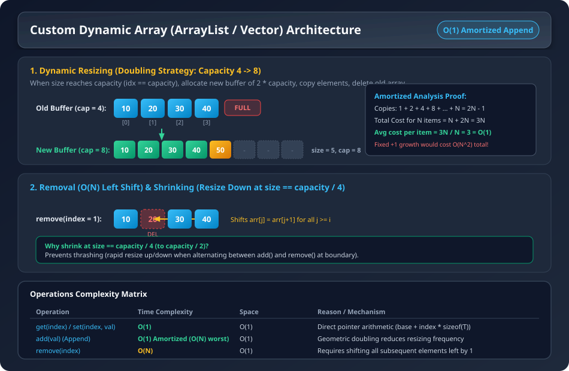

# Question 1: Custom Dynamic Array (ArrayList / Vector) Implementation from Scratch

### Problem Overview & Intuition
A fixed-size array in C++/Java cannot grow dynamically when it runs out of memory. An `ArrayList` (Java) or `std::vector` (C++) overcomes this limitation by managing a dynamically allocated contiguous memory block in the heap.

When the internal array fills up to its capacity, it dynamically:
1. Allocates a new array with **double the capacity** ($2 \times \text{capacity}$).
2. Copies all existing elements into the new array.
3. Deallocates the old memory buffer.
4. Updates the internal pointer to the new memory block.

### Visual Architecture & Dry Run


---

## 1. Deep Time & Space Complexity Analysis

### Operations Complexity Summary

| Operation | Best / Average Time | Worst Time | Space | Reason / Mechanism |
| :--- | :--- | :--- | :--- | :--- |
| **`get(index)`** | $\mathbf{O(1)}$ | $\mathbf{O(1)}$ | $O(1)$ | Direct pointer arithmetic `base + index * sizeof(T)` |
| **`set(index, val)`** | $\mathbf{O(1)}$ | $\mathbf{O(1)}$ | $O(1)$ | Direct memory overwrite at `arr[index]` |
| **`add(val)` (Append)** | $\mathbf{O(1)}$ (Amortized) | $\mathbf{O(N)}$ (Resize step) | $O(1)$ | Geometric capacity doubling minimizes copy frequency |
| **`remove(index)`** | $\mathbf{O(N)}$ | $\mathbf{O(N)}$ | $O(1)$ | Requires shifting all subsequent elements left by 1 position |
| **`resize()` (Up / Down)**| $\mathbf{O(N)}$ | $\mathbf{O(N)}$ | $O(N)$ temp | Allocating new buffer and copying $N$ elements |

---

### 2. Mathematical Proof of Amortized $O(1)$ for Doubling Strategy

> **Question:** When resizing takes $O(N)$ time, why is the `add()` operation considered $O(1)$ on average?

#### A. Doubling Strategy ($2 \times$ Growth Factor):
Assume an initial capacity of $1$. As we insert $N$ elements (where $N = 2^k$):
- Element 1: Insert (cost 1), resize to 2 (copy 1 element)
- Element 2: Insert (cost 1), resize to 4 (copy 2 elements)
- Element 3: Insert (cost 1)
- Element 4: Insert (cost 1), resize to 8 (copy 4 elements)
- Element 5..8: Insert (cost 1 each), resize to 16 (copy 8 elements)
- ...
- Element $N$: Insert (cost 1), resize to $2N$ (copy $N$ elements)

**Total Work Done for $N$ Insertions:**
$$\text{Total Cost} = \underbrace{(1 + 1 + 1 + \dots + 1)}_{N \text{ insertions}} + \underbrace{(1 + 2 + 4 + 8 + \dots + N)}_{\text{total copies during resizing}}$$

The summation of powers of 2 is a geometric progression:
$$\sum_{i=0}^{\log_2 N} 2^i = 2N - 1 < 2N$$

$$\text{Total Cost} = N + 2N - 1 = 3N - 1 \approx \mathbf{3N}$$

$$\text{Amortized Cost per Insertion} = \frac{\text{Total Cost}}{N} = \frac{3N}{N} = \mathbf{3 \text{ operations}} = \mathbf{O(1)}$$

---

#### B. Why NOT Incremental Growth (e.g. $+1$ or $+C$ fixed capacity)?
If we increase capacity by a fixed constant $+1$ instead of doubling:
- 1st resize copies 1 element
- 2nd resize copies 2 elements
- 3rd resize copies 3 elements
- ...
- $N$-th resize copies $N$ elements

$$\text{Total Copies} = 1 + 2 + 3 + \dots + N = \frac{N(N+1)}{2} = \mathbf{O(N^2)}$$
$$\text{Cost per Insertion} = \frac{O(N^2)}{N} = \mathbf{O(N)} \text{ (Extremely Inefficient!)}$$

---

### 3. Dynamic Downsizing & Thrashing Prevention (Sumeet Sir's Lecture Insight)

- **The Problem (Thrashing):**
  - If we shrink the array immediately when `size == capacity / 2` to half size:
  - An alternating sequence of `add()` $\rightarrow$ `remove()` $\rightarrow$ `add()` $\rightarrow$ `remove()` at the boundary would trigger a full $O(N)$ resize on **every single operation**!
- **The Solution ($\frac{1}{4}$ Rule):**
  - When `size == capacity / 4`, only then downsize the capacity to `capacity / 2`.
  - This leaves a generous buffer (hysteresis) so subsequent insertions or removals remain $O(1)$ amortized without triggering consecutive resizes.

---

## 2. Complete Java Implementation (with Dynamic Shrinking & Exception Handling)

```java
public class MyArrayList {
    private int size;    // Current maximum allocated capacity
    private int[] arr;   // Contiguous heap buffer
    private int idx;     // Current count of stored elements (length)

    // Helper to initialize internal buffer
    private void initialise(int sz) {
        this.size = sz;
        this.arr = new int[sz];
        this.idx = 0;
    }

    // Default Constructor: initial capacity of 4
    public MyArrayList() {
        initialise(4);
    }

    // Custom Capacity Constructor
    public MyArrayList(int capacity) {
        initialise(capacity);
    }

    // Index validation helper
    private void outOfBoundException(int i) throws Exception {
        if (i < 0 || i >= this.idx) {
            throw new Exception("IndexOutOfBoundsException: Index " + i + " is out of bounds for length " + this.idx);
        }
    }

    // Add / Append element at the end
    public void add(int val) {
        addValue(val);
    }

    private void addValue(int val) {
        // If buffer is full, double the capacity (Resize Up)
        if (this.idx == this.size) {
            System.out.println("Resize up");
            int[] temp = new int[this.size];
            for (int i = 0; i < this.size; i++) {
                temp[i] = arr[i];
            }

            int prevIdx = this.idx;
            initialise(2 * this.size); // Double capacity
            for (int i = 0; i < temp.length; i++) {
                arr[i] = temp[i];
            }
            this.idx = prevIdx;
        }
        arr[idx] = val;
        idx++;
    }

    // Get element at index O(1)
    public int get(int i) throws Exception {
        outOfBoundException(i);
        return arr[i];
    }

    // Set / Update element at index O(1)
    public void set(int i, int val) throws Exception {
        outOfBoundException(i);
        arr[i] = val;
    }

    // Remove element at index with left shifting O(N)
    public int remove(int i) throws Exception {
        outOfBoundException(i);
        int val = arr[i];

        // Shift elements to the left
        for (int j = i; j < this.idx - 1; j++) {
            arr[j] = arr[j + 1];
        }
        arr[this.idx - 1] = 0;
        idx--;

        // Resize down when element count reaches capacity / 4 (Prevent Thrashing)
        if (idx > 0 && idx == size / 4) {
            System.out.println("Resize down");
            int[] temp = new int[this.idx];
            for (int j = 0; j < this.idx; j++) {
                temp[j] = arr[j];
            }

            int prevIdx = this.idx;
            initialise(this.size / 2); // Halve capacity
            for (int j = 0; j < temp.length; j++) {
                arr[j] = temp[j];
            }
            this.idx = prevIdx;
        }

        return val;
    }

    // Number of elements currently stored
    public int length() {
        return this.idx;
    }

    // Current buffer capacity
    public int size() {
        return this.size;
    }

    @Override
    public String toString() {
        StringBuilder sb = new StringBuilder();
        sb.append("[");
        for (int i = 0; i < idx; i++) {
            sb.append(arr[i]);
            if (i != idx - 1) {
                sb.append(",");
            }
        }
        sb.append("]");
        return sb.toString();
    }
}
```

### Java Main Driver Test Program

```java
public class Main {
    public static void main(String[] args) throws Exception {
        MyArrayList al = new MyArrayList();
        System.out.println(al + " size is " + al.size());

        al.add(1);
        al.add(2);
        System.out.println(al + " size is " + al.size());

        al.add(3);
        al.add(4);
        System.out.println(al + " size is " + al.size());

        al.add(5);
        al.add(6);
        al.add(7);
        System.out.println(al + " size is " + al.size());

        al.remove(3);
        System.out.println(al + " size is " + al.size());

        al.remove(0);
        System.out.println(al + " element at index 2 is " + al.get(2));

        al.set(3, 42);
        System.out.println(al + " size is " + al.size());

        al.remove(1);
        al.remove(1);
        al.remove(1);
        System.out.println(al + " size is " + al.size());
    }
}
```

#### Output:
```text
[] size is 4
[1,2] size is 4
[1,2,3,4] size is 4
Resize up
[1,2,3,4,5,6,7] size is 8
[1,2,3,5,6,7] size is 8
[2,3,5,6,7] element at index 2 is 5
[2,3,5,42,7] size is 8
Resize down
[2,7] size is 4
```

---

## 3. Existing C++ Implementation

```cpp

#include <iostream>
using namespace std;


class ArrayList {
    int *arr;
    int num_elements;
    int capacity;

public:
    ArrayList(){
        capacity=2;
        arr=new int[capacity];
        num_elements=0;
    }
    ArrayList(int size) {
        arr = new int[size];
        num_elements = 0;
        capacity = size;
    }
    void insert(int val) {
        if(num_elements < capacity) {
            arr[num_elements]=val;
            num_elements++;
        } else {
            resize();
            arr[num_elements]=val;
            num_elements++;
        }
    }
    
    int getAt(int index){
       return arr[index];
    }

    void resize() {
        int* tempArr=new int[capacity*2];
        capacity*=2;

        for(int i=0; i<num_elements; i++) {
            tempArr[i]=arr[i];
        }

        delete [] arr;
        arr=tempArr;
    }
    int size(){
        return capacity;
    }
    int length() {

        return num_elements;
    }

    void print() {
        for(int i=0; i<num_elements; i++)
            cout << arr[i] << " ";
        cout << endl;
    }

};

int main() {
    ArrayList arr;
    cout << "Arr length : " << arr.length() << endl;
    arr.insert(1);
    arr.insert(2);
    cout<<" Arr size: "<< arr.size()<<" no of elements: "<< arr.length()<<endl; 
    arr.insert(3);
    cout<<" Arr size: "<< arr.size()<<" no of elements: "<< arr.length()<<endl; 
    arr.insert(4);
    cout<<" Arr size: "<< arr.size()<<" no of elements: "<< arr.length()<<endl;
    arr.insert(5);
    cout<<" Arr size: "<< arr.size()<<" no of elements: "<< arr.length()<<endl; 
    arr.insert(6);
    arr.insert(7); 
    arr.insert(8);
    cout <<  "Arr length : " << arr.length() << endl;
    cout << "Array : ";
    arr.print();  
    cout << "Element at index 5 is " << arr.getAt(4) << endl;  
}

/*
rr length : 0
 Arr size: 2 no of elements: 2
 Arr size: 4 no of elements: 3
 Arr size: 4 no of elements: 4
 Arr size: 8 no of elements: 5
Arr length : 8
Array : 1 2 3 4 5 6 7 8 
Element at index 5 is 5
*/
```
