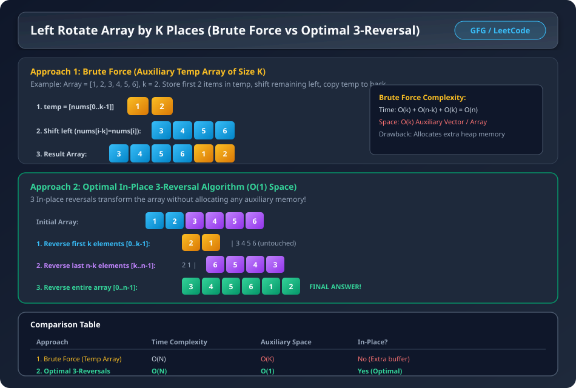

# Question 1: Rotate Array by K Places (Left Rotation)

### Problem Statement
Given an array `nums` of size $N$ and an integer $k$, rotate the array to the **left** by $k$ positions.

**Example 1:**
- **Input:** `nums = [1, 2, 3, 4, 5, 6]`, `k = 2`
- **Output:** `[3, 4, 5, 6, 1, 2]`
- **Explanation:** 
  - 1st left rotation: `[2, 3, 4, 5, 6, 1]`
  - 2nd left rotation: `[3, 4, 5, 6, 1, 2]`

**Example 2:**
- **Input:** `nums = [1, 2, 3, 4, 5]`, `k = 7`
- **Output:** `[3, 4, 5, 1, 2]`
- **Explanation:** `k = 7 % 5 = 2`. Rotating by 7 is identical to rotating by 2.

---

### Visual Architecture & Dry Run


---

## Approach 1: Brute Force (Using Auxiliary Array)

### Intuition & Steps:
1. Handle large $k$: `k = k % n` (since rotating $n$ times yields the original array).
2. Store the first $k$ elements into a temporary vector `temp`: `temp = [nums[0], ..., nums[k-1]]`.
3. Shift the remaining $n - k$ elements to the left by $k$ places: `nums[i - k] = nums[i]` for $i \in [k, n-1]$.
4. Copy the $k$ elements from `temp` into the back of the array: `nums[n - k + i] = temp[i]` for $i \in [0, k-1]$.

### Complexity Analysis:
- **Time Complexity:** $O(N)$
  - Copying $k$ elements: $O(k)$
  - Shifting $n-k$ elements: $O(n-k)$
  - Copying back $k$ elements: $O(k)$
  - Total Time $= O(k) + O(n-k) + O(k) = \mathbf{O(N)}$
- **Space Complexity:** $\mathbf{O(k)}$ auxiliary space for `temp` array.

---

### C++ Code (Brute Force )
```cpp
#include <bits/stdc++.h>
using namespace std;

class Solution {
public:
    // Function to rotate the array to the left by k positions
    void rotateArray(vector<int>& nums, int k) {
        int n = nums.size(); // Size of array
        k = k % n; 
        
        vector<int> temp;
        

        for(int i=0; i < k; i++) {
            temp.push_back(nums[i]);
        }
        
        // Shift n-k elements of given array to the front
        for(int i=k; i < n; i++) {
            nums[i-k] = nums[i];
        }
        
        // Copy back the k elemnents at the end
        for(int i=0; i < k; i++) {
            nums[n-k+i] = temp[i];
        }
    }
};


void printArray(vector<int> nums) {
    for(int val : nums) {
        cout << val << " ";
    }
    cout << endl;
}

int main() {
    vector nums = {1, 2, 3, 4, 5, 6};
    int k = 2;

    cout << "Initial array: ";
    printArray(nums);

    // Create an instance of the Solution class
    Solution sol;
    
    /* Function call to rotate the 
    array to the left by k places */
    sol.rotateArray(nums, k);
    
    cout << "Array after rotating elements by " << k << " places: ";
    printArray(nums);

    return 0;
}
```

---

## Approach 2: Optimal In-Place 3-Reversal Algorithm

### Intuition & Mathematical Observation:
Instead of allocating auxiliary memory, we can achieve left rotation using **3 in-place reversals**:

For `nums = [1, 2, 3, 4, 5, 6]` and `k = 2`:
1. **Reverse the first $k$ elements (`0` to `k - 1`):**
   - `[1, 2]` $\rightarrow$ `[2, 1]`
   - Array becomes: `[2, 1, 3, 4, 5, 6]`
2. **Reverse the remaining $n - k$ elements (`k` to `n - 1`):**
   - `[3, 4, 5, 6]` $\rightarrow$ `[6, 5, 4, 3]`
   - Array becomes: `[2, 1, 6, 5, 4, 3]`
3. **Reverse the entire array (`0` to `n - 1`):**
   - Reverse `[2, 1, 6, 5, 4, 3]`
   - Array becomes: `[3, 4, 5, 6, 1, 2]` $\rightarrow$ **Correct Rotated Array!**

### Complexity Analysis:
- **Time Complexity:** $\mathbf{O(N)}$
  - 1st Reversal: $O(k)$
  - 2nd Reversal: $O(n - k)$
  - 3rd Reversal: $O(n)$
  - Total operations $= \frac{k}{2} + \frac{n-k}{2} + \frac{n}{2} = n \text{ swaps} = \mathbf{O(N)}$
- **Space Complexity:** $\mathbf{O(1)}$ Auxiliary Space (in-place modification).

---

### C++ Code (Optimal )
```cpp
#include <bits/stdc++.h>
using namespace std;

class Solution {
private:
    // Function to reverse the array between start and end
    void reverseArray(vector<int>& nums, int start, int end) {

        while (start < end) {
            int temp = nums[start];
            nums[start] = nums[end];
            nums[end] = temp;
            start++, end--;
        }
    }
    
public:
    // Function to rotate the array to the left by k positions
    void rotateArray(vector<int>& nums, int k) {
        int n = nums.size(); // Size of array
        k = k % n; // To avoid unnecessary rotations
        
        // Reverse the first k elements
        reverseArray(nums, 0, k - 1);

        // Reverse the last n-k elements
        reverseArray(nums, k, n - 1);

        // Reverse the entire vector
        reverseArray(nums, 0, n - 1);
    }
};

// Helper function to print the array
void printArray(vector<int> nums) {
    for(int val : nums) {
        cout << val << " ";
    }
    cout << endl;
}

int main() {
    vector nums = {1, 2, 3, 4, 5, 6};
    int k = 2;

    cout << "Initial array: ";
    printArray(nums);

    // Create an instance of the Solution class
    Solution sol;
    
    /* Function call to rotate the 
    array to the left by k places */
    sol.rotateArray(nums, k);
    
    cout << "Array after rotating elements by " << k << " places: ";
    printArray(nums);

    return 0;
}
```

---

### Java Code (Optimal )
```java
class Solution {
    private void reverseArray(int[] nums, int start, int end) {

        while (start < end) {
            int temp = nums[start];
            nums[start] = nums[end];
            nums[end] = temp;
            start++;
            end--;
        }
    }
    public void rotateArray(int[] nums, int k) {
        
        if(k>=nums.length) k=k%nums.length;
        if(nums.length<=1 || k==0) return;
        reverseArray(nums,0,k-1);
        reverseArray(nums,k,nums.length-1);
        reverseArray(nums,0,nums.length-1);
    }
}

/*
Complexity Analysis: 
Time Complexity: O(N), where N is the size of the array
As three reversals are performed taking O(k), O(N-k) and O(N) time respectively.

Space Complexity: O(1), as no extra space is used .
*/
```
