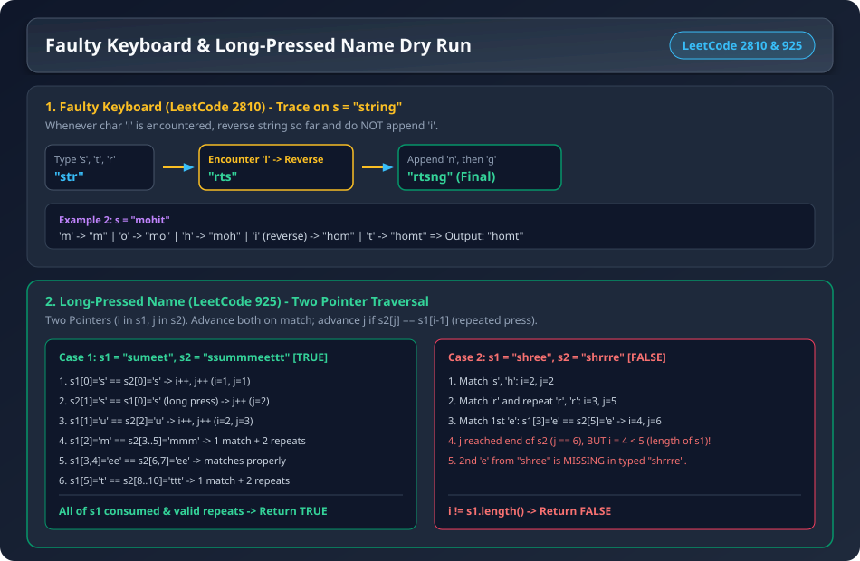
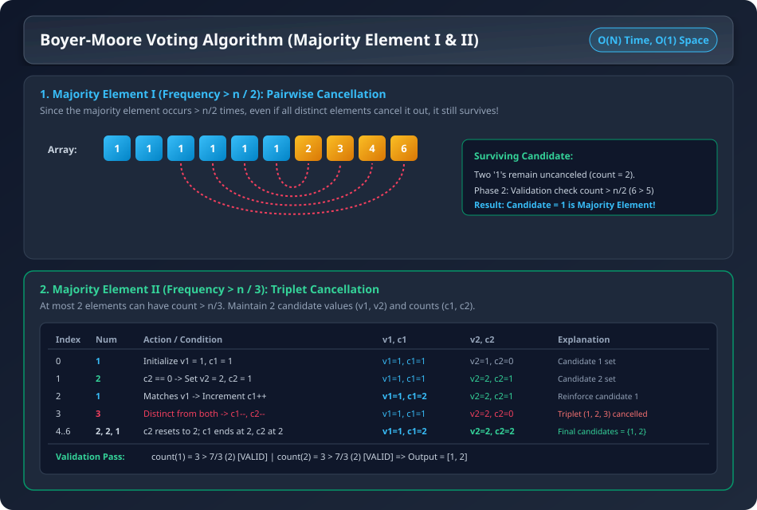
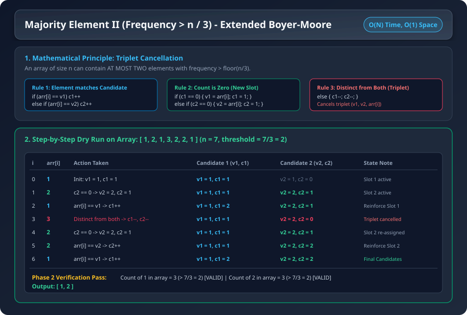
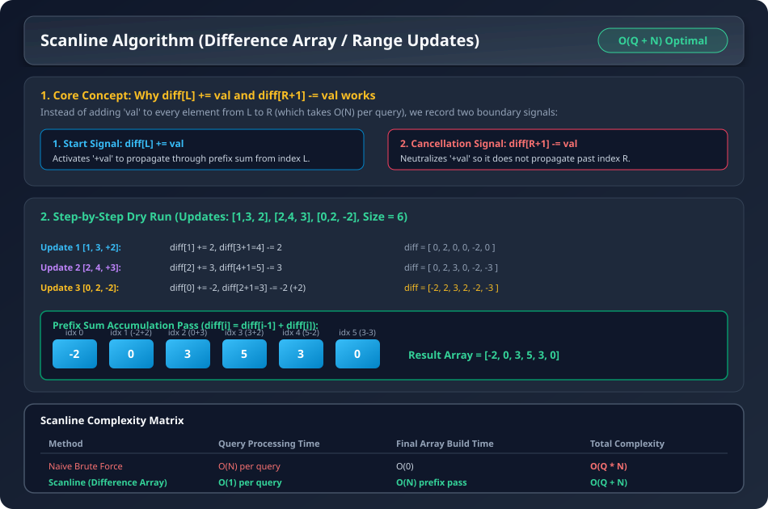

# Question 1: Faulty Keyboard (LeetCode 2810)

### Problem Statement
Your laptop keyboard is faulty, and whenever you type a character `'i'`, it instead reverses the string that you have written so far. It does not write the character `'i'`.

You are given a 0-indexed string `s`. Return the final string that will be present on your laptop screen.

- **Example 1:** `s = "string"` $\implies$ Output: `"rtsng"`
  - `'s'` $\rightarrow$ `"s"`
  - `'t'` $\rightarrow$ `"st"`
  - `'r'` $\rightarrow$ `"str"`
  - `'i'` $\rightarrow$ reverse $\implies$ `"rts"`
  - `'n'` $\rightarrow$ `"rtsn"`
  - `'g'` $\rightarrow$ `"rtsng"`
- **Example 2:** `s = "mohit"` $\implies$ Output: `"homt"`

---

### Visual Architecture & Dry Run


---

### Step-by-Step Dry Run (Example: `s = "mohit"`)

| Step | Current Char $s[i]$ | Is `'i'`? | Action Taken | Resulting String `res` |
| :--- | :--- | :--- | :--- | :--- |
| 1 | `'m'` | No | Append `'m'` | `"m"` |
| 2 | `'o'` | No | Append `'o'` | `"mo"` |
| 3 | `'h'` | No | Append `'h'` | `"moh"` |
| 4 | `'i'` | **Yes** | In-place reverse `res` from index $0$ to $|res|-1$ | `"hom"` |
| 5 | `'t'` | No | Append `'t'` | `"homt"` |

**Final Answer:** `"homt"`

---

### Complexity Analysis
- **Time Complexity:** $O(N^2)$ in worst case when many `'i'` characters trigger string reversals.
- **Space Complexity:** $O(1)$ auxiliary (excluding output string).

---

### C++ Code
```cpp
//https://leetcode.com/problems/faulty-keyboard/
#include<bits/stdc++.h>
using namespace std;

class Solution {
    private:
        void reverse(string &s ,int si,int ei){
            if(si==ei) return;
            while(si<ei){
                char ch=s[si];
                s[si]=s[ei];
                s[ei]=ch;
                si++;
                ei--;
            }
        }
    public:
        string finalString(string s) {
            string res;
            int j=0;
            for(int i=0;i<s.size();i++){
                if(s[i]=='i'){
                    reverse(res,0,res.size()-1);
                }else res.push_back(s[i]);
            }
            return res;
        }
    };

    int main (){
        Solution s;
        cout<<s.finalString("mohit")<<endl;
        return 0;
    }
```

### Java Code
```java
class Solution {
    private void reverse(StringBuilder s, int si, int ei) {
        while (si < ei) {
            char temp = s.charAt(si);
            s.setCharAt(si, s.charAt(ei));
            s.setCharAt(ei, temp);
            si++;
            ei--;
        }
    }

    public String finalString(String s) {
        StringBuilder res = new StringBuilder();
        for (int i = 0; i < s.length(); i++) {
            char ch = s.charAt(i);
            if (ch == 'i') {
                reverse(res, 0, res.length() - 1);
            } else {
                res.append(ch);
            }
        }
        return res.toString();
    }
}
```

---

# Question 2: Long Pressed Name / Faulty Keyboard II (LeetCode 925)

### Problem Statement
Your friend is typing his `name` into a keyboard. Sometimes, when typing a character `c`, the key might get long pressed, and the character will be typed 1 or more times.

Given strings `name` ($s_1$) and `typed` ($s_2$), return `true` if it is possible that it was your friends name, with some characters (possibly none) being long pressed.

- **Example 1:** `name = "sumeet", typed = "ssummmeettt"` $\implies$ Output: `true`
- **Example 2:** `name = "shree", typed = "shrrre"` $\implies$ Output: `false` (only 1 `'e'` in typed, but 2 needed)

---

### Step-by-Step Two-Pointer Dry Run

#### Case 1: `s1 = "sumeet"`, `s2 = "ssummmeettt"` $\implies$ `true`
1. $s_1[0]='s' == s_2[0]='s' \implies i=1, j=1$
2. $s_2[1]='s' == s_1[0]='s'$ (long pressed `'s'`) $\implies j=2$
3. $s_1[1]='u' == s_2[2]='u' \implies i=2, j=3$
4. $s_1[2]='m' == s_2[3]='m' \implies i=3, j=4$
5. $s_2[4]='m', s_2[5]='m' == s_1[2]='m'$ (long pressed `'m'`s) $\implies j=6$
6. $s_1[3]='e' == s_2[6]='e' \implies i=4, j=7$
7. $s_1[4]='e' == s_2[7]='e' \implies i=5, j=8$
8. $s_1[5]='t' == s_2[8]='t' \implies i=6, j=9$
9. $s_2[9]='t', s_2[10]='t' == s_1[5]='t'$ (long pressed `'t'`s) $\implies j=11$
- Both strings completely matched $\implies$ **`true`**.

---

#### Case 2: `s1 = "shree"`, `s2 = "shrrre"` $\implies$ `false`
1. Matches `'s'`, `'h'`: $i=2, j=2$.
2. Matches first `'r'` ($i=3, j=3$) and repeats `'r'`, `'r'` ($j=4, 5$).
3. Matches first `'e'`: $s_1[3]='e' == s_2[5]='e' \implies i=4, j=6$.
4. Now pointer $j$ reached end of $s_2$ ($j=6$), but $i=4 < 5$ ($s_1$ has one more unconsumed `'e'`).
- Since $i \neq s_1.\text{length}()$, the typed name did not include the second `'e'` $\implies$ **`false`**.

---

### Complexity Analysis
- **Time Complexity:** $O(N + M)$ where $N = |s_1|$ and $M = |s_2|$.
- **Space Complexity:** $O(1)$.

---

### C++ Code
```cpp
#include<bits/stdc++.h>
using namespace std;

class Solution {
    public:
        bool finalString(string s1,string s2) {
            if(s1.size()>s2.size()) return false;
            int i=0;
            int j=0;
            while(i<s1.size() && j<s2.size()){
                if(s1[i]==s2[j]){
                    i++;
                    j++;
                }else if(i>0 && s2[j]==s1[i-1]) j++;
                else return false;
            }
            if(i!=s1.size() && j==s2.size()) return false; // some character not in s1
            while(j!=s2.size()){
                if(s2[j]!=s1[i-1]) return false;
                j++;
            }
            return true;
        }
    };

 int main() {
    Solution s;
    cout<<s.finalString("sumeet","ssummmeettt")<<endl;
    cout<<s.finalString("shree","shrrre")<<endl;
    return 0;
 }   
```

### Java Code
```java
class Solution {
    public boolean isLongPressedName(String s1, String s2) {
        if (s1.length() > s2.length()) return false;
        int i = 0;
        int j = 0;
        while (i < s1.length() && j < s2.length()) {
            if (s1.charAt(i) == s2.charAt(j)) {
                i++;
                j++;
            } else if (i > 0 && s2.charAt(j) == s1.charAt(i - 1)) {
                j++;
            } else {
                return false;
            }
        }
        if (i != s1.length()) return false;
        while (j < s2.length()) {
            if (s2.charAt(j) != s1.charAt(i - 1)) return false;
            j++;
        }
        return true;
    }
}
```

---

# Question 3: Squares of a Sorted Array (LeetCode 977)

### Problem Statement
Given an integer array `nums` sorted in **non-decreasing** order, return an array of the squares of each number sorted in **non-decreasing** order.

- **Example 1:** `nums = [-4, -1, 0, 3, 10]` $\implies$ Output: `[0, 1, 9, 16, 100]`
- **Example 2:** `nums = [-7, -3, 2, 3, 11]` $\implies$ Output: `[4, 9, 9, 49, 121]`

### Intuition (Two Pointers from Ends)
Because the array is already sorted, the largest squares will either be at the extreme left (negative numbers with large absolute magnitude) or at the extreme right (large positive numbers).
- Use two pointers: `i = 0` and `j = n - 1`.
- Compare `nums[i]^2` vs `nums[j]^2`.
- Place the larger square at `res[resptr]` and decrement `resptr--`.

### Complexity Analysis
- **Time Complexity:** $O(N)$ single pass (avoiding $O(N \log N)$ sorting).
- **Space Complexity:** $O(1)$ auxiliary space (excluding result array).

---

### Java Code
```java
class Solution {
    public int[] sortedSquares(int[] nums) {
        int [] res=new int[nums.length];
        int i=0;
        int j=nums.length-1;
        int resptr=j;
        while(i<=j){
            int sqi=nums[i]*nums[i];
            int sqj=nums[j]*nums[j];
            if(sqi>sqj){
                res[resptr]=sqi;
                i++;
            }
            else{
                res[resptr]=sqj;
                j--;
                
            }
            resptr--;
        }
        return res;
    }
}
```

### C++ Code
```cpp
#include <bits/stdc++.h>
using namespace std;

class Solution {
public:
    vector<int> sortedSquares(vector<int>& nums) {
        int n = nums.size();
        vector<int> res(n);
        int i = 0, j = n - 1;
        int resptr = n - 1;
        while (i <= j) {
            int sqi = nums[i] * nums[i];
            int sqj = nums[j] * nums[j];
            if (sqi > sqj) {
                res[resptr] = sqi;
                i++;
            } else {
                res[resptr] = sqj;
                j--;
            }
            resptr--;
        }
        return res;
    }
};
```

---

# Question 4: Majority Element I (Frequency $> \lfloor n/2 \rfloor$) - Boyer-Moore Voting (LeetCode 169)

### Problem Statement
Given an array `nums` of size $n$, return the majority element.
The majority element is the element that appears more than $\lfloor n / 2 \rfloor$ times.

- **Example 1:** `nums = [3, 2, 3]` $\implies$ Output: `3`
- **Example 2:** `nums = [2, 2, 1, 1, 1, 2, 2]` $\implies$ Output: `2`

### Visual Dry Run & Intuition


### Deep Algorithm Breakdown (Boyer-Moore Voting)
1. **Phase 1 (Pairwise Cancellation):**
   - Maintain `v = nums[0]` and `count = 1`.
   - Iterate through array:
     - If `nums[i] == v` $\implies$ `count++`
     - Else $\implies$ `count--`. If `count == 0`, re-assign candidate: `v = nums[i], count = 1`.
   - **Why it works:** Every distinct element pairs up and cancels out a majority candidate instance. Since the true majority appears $> n/2$ times, it is mathematically guaranteed to survive.
2. **Phase 2 (Verification Pass):**
   - Count actual frequency of candidate `v`. If `count > n/2`, return `v`, else `-1`.

### Complexity Analysis
- **Time Complexity:** $O(N)$
- **Space Complexity:** $O(1)$

---

### C++ Code
```cpp
class Solution {
    public:
        int majorityElement(vector<int>& nums) {
            int n=nums.size();
            int count=1;
            int v=nums[0];
            for(int i=1;i<n;i++){
                if(nums[i]==v) count++;
                else{
                    count--;
                    if(count==0){
                        count=1;
                        v=nums[i];
                    }
                }
            }
        int cnt1 = 0;
        for (int i = 0; i < n; i++) {
            if (nums[i] ==v) {
                cnt1++;
            }
        }
        
        return (cnt1>(n/2))?v:-1;    
        }
    };
```

### Java Code
```java
class Solution {
    public int majorityElement(int[] nums) {
        int n = nums.length;
        int count = 1;
        int v = nums[0];

        // Phase 1: Find candidate
        for (int i = 1; i < n; i++) {
            if (nums[i] == v) {
                count++;
            } else {
                count--;
                if (count == 0) {
                    count = 1;
                    v = nums[i];
                }
            }
        }

        // Phase 2: Verification
        int cnt1 = 0;
        for (int i = 0; i < n; i++) {
            if (nums[i] == v) {
                cnt1++;
            }
        }

        return (cnt1 > (n / 2)) ? v : -1;
    }
}
```

---

# Question 5: Majority Element II (Frequency $> \lfloor n/3 \rfloor$) (LeetCode 229)

### Problem Statement
Given an integer array `nums` of size $n$, find all elements that appear more than $\lfloor n / 3 \rfloor$ times.

- **Example 1:** `nums = [3, 2, 3]` $\implies$ Output: `[3]`
- **Example 2:** `nums = [1]` $\implies$ Output: `[1]`
- **Example 3:** `nums = [1, 2]` $\implies$ Output: `[1, 2]`

---

### Visual Architecture & Dry Run


---

### Deep Algorithm Logic & Triplet Cancellation
- **Why at most 2 majority elements?**
  If there were 3 elements each appearing $> \lfloor n/3 \rfloor$ times, their combined count would be at least $3 \times (\lfloor n/3 \rfloor + 1) > n$, which is impossible.
- **The 3 Core Action Rules:**
  1. **Matches $v_1$:** If `arr[i] == v1`, increment `c1++`.
  2. **Matches $v_2$:** Else if `arr[i] == v2`, increment `c2++`.
  3. **Empty Slot $1$:** Else if `c1 == 0`, re-assign `v1 = arr[i], c1 = 1`.
  4. **Empty Slot $2$:** Else if `c2 == 0`, re-assign `v2 = arr[i], c2 = 1`.
  5. **Distinct Triplet:** Else (element matches neither $v_1$ nor $v_2$, and both counts $> 0$), cancel out the triplet by decrementing `c1--` and `c2--`.

---

### Step-by-Step Dry Run (Example: `arr = [1, 2, 1, 3, 2, 2, 1]`, $n = 7$, threshold $= \lfloor 7/3 \rfloor = 2$)

| Index $i$ | Element `arr[i]` | Condition Met | Candidate 1 ($v_1, c_1$) | Candidate 2 ($v_2, c_2$) | State Explanation |
| :--- | :--- | :--- | :--- | :--- | :--- |
| **0** | `1` | Initialize $v_1$ | $(v_1=1, c_1=1)$ | $(v_2=1, c_2=0)$ | Slot 1 initialized |
| **1** | `2` | $c_2 == 0$ | $(v_1=1, c_1=1)$ | $(v_2=2, c_2=1)$ | Slot 2 assigned to `2` |
| **2** | `1` | `arr[i] == v1` | $(v_1=1, c_1=2)$ | $(v_2=2, c_2=1)$ | Incremented $c_1$ |
| **3** | `3` | Distinct from both | $(v_1=1, c_1=1)$ | $(v_2=2, c_2=0)$ | Triplet $(1, 2, 3)$ cancelled ($c_1--, c_2--$) |
| **4** | `2` | $c_2 == 0$ | $(v_1=1, c_1=1)$ | $(v_2=2, c_2=1)$ | Slot 2 re-assigned to `2` |
| **5** | `2` | `arr[i] == v2` | $(v_1=1, c_1=1)$ | $(v_2=2, c_2=2)$ | Incremented $c_2$ |
| **6** | `1` | `arr[i] == v1` | $(v_1=1, c_1=2)$ | $(v_2=2, c_2=2)$ | Incremented $c_1$ |

#### Phase 2 Verification:
- Count of `1` in array $= 3 > \lfloor 7/3 \rfloor = 2 \implies$ **Valid**
- Count of `2` in array $= 3 > \lfloor 7/3 \rfloor = 2 \implies$ **Valid**
- **Output:** `[1, 2]`

---

### Complexity Analysis
- **Time Complexity:** $O(N)$ (Phase 1 candidate pass + Phase 2 verification pass).
- **Space Complexity:** $O(1)$ auxiliary space.

---

### C++ Code
```cpp
//https://leetcode.com/problems/majority-element-ii/
class Solution {
    public:
        vector<int> majorityElement(vector<int>& arr) {
            int v1=arr[0];
            int c1=1;
            int v2=arr[0];
            int c2=0;
            for(int i=1;i<arr.size();i++){
                if(v1==arr[i]) c1++;
                else if(v2==arr[i]) c2++;
                else {
                    if(c1==0){
                        v1=arr[i];
                        c1=1;
                    }else if (c2==0){
                        v2=arr[i];
                        c2=1;
                    }else {
                        c1--;
                        c2--;
                    }
                }
            }
             c1=0,c2=0;
            for(int i=0;i<arr.size();i++){
                if(arr[i]==v1) c1++;
                if(v1!=v2 && arr[i]==v2) c2++;
            }
            vector<int> res;
            if(c1>(arr.size()/3)) res.push_back(v1);
            if(c2>(arr.size()/3)) res.push_back(v2);
            return res;
        }
    };
```

### Java Code
```java
import java.util.ArrayList;
import java.util.List;

class Solution {
    public List<Integer> majorityElement(int[] arr) {
        int v1 = arr[0], c1 = 1;
        int v2 = arr[0], c2 = 0;

        for (int i = 1; i < arr.length; i++) {
            if (arr[i] == v1) {
                c1++;
            } else if (arr[i] == v2) {
                c2++;
            } else {
                if (c1 == 0) {
                    v1 = arr[i];
                    c1 = 1;
                } else if (c2 == 0) {
                    v2 = arr[i];
                    c2 = 1;
                } else {
                    c1--;
                    c2--;
                }
            }
        }

        // Verification phase
        c1 = 0;
        c2 = 0;
        for (int i = 0; i < arr.length; i++) {
            if (arr[i] == v1) c1++;
            else if (arr[i] == v2) c2++;
        }

        List<Integer> res = new ArrayList<>();
        if (c1 > arr.length / 3) res.add(v1);
        if (c2 > arr.length / 3) res.add(v2);
        return res;
    }
}
```

---

# Question 6: Generalized Majority Element (Frequency $> \lfloor n/k \rfloor$)

### Problem Statement
Given an array `arr` of size $n$ and an integer $k$, find all elements whose frequency is strictly greater than $\lfloor n / k \rfloor$.

### Intuition
- There can be **at most $k - 1$ majority elements**.
- **Approach 1 (HashMap):** Count frequencies of all elements using a hash map and collect all keys with `count > n / k`.
- **Approach 2 (Generalized Boyer-Moore):** Maintain $k - 1$ candidate slots. When an element matches none of the $k - 1$ candidates, decrement all active candidate counts.

### Complexity Analysis
- **Time Complexity:** $O(N)$
- **Space Complexity:** $O(k)$ auxiliary space for hash map / candidate table.

---

### C++ Code
```cpp
#include <bits/stdc++.h>
using namespace std;

class Solution {
public:
    vector<int> majorityElementK(vector<int>& arr, int k) {
        int n = arr.size();
        unordered_map<int, int> freq;
        for (int x : arr) {
            freq[x]++;
        }
        vector<int> res;
        for (auto& p : freq) {
            if (p.second > n / k) {
                res.push_back(p.first);
            }
        }
        return res;
    }
};
```

### Java Code
```java
import java.util.*;

class Solution {
    public List<Integer> majorityElementK(int[] arr, int k) {
        int n = arr.length;
        Map<Integer, Integer> freq = new HashMap<>();
        for (int x : arr) {
            freq.put(x, freq.getOrDefault(x, 0) + 1);
        }
        List<Integer> res = new ArrayList<>();
        for (Map.Entry<Integer, Integer> entry : freq.entrySet()) {
            if (entry.getValue() > n / k) {
                res.add(entry.getKey());
            }
        }
        return res;
    }
}
```

---

# Question 7: Scanline Algorithm / Range Addition (Difference Array)

### Problem Statement
Given an array of size $N$ initialized with zeros, and $Q$ range updates in the format $[L, R, \text{val}]$, add `val` to all elements from index $L$ to $R$ inclusive. Return the final array after applying all $Q$ queries.

- **Example:** `N = 6`, `updates = [[1, 3, 2], [2, 4, 3], [0, 2, -2]]`
- **Output:** `[-2, 0, 3, 5, 3, 0]`

### Visual Dry Run & Intuition


### Deep Algorithm Breakdown (Difference Array)
- Instead of looping through $[L \dots R]$ for every update ($O(Q \times N)$ total time):
  1. Record start signal: `diff[L] += val`
  2. Record cancel signal: `if (R + 1 < N) diff[R + 1] -= val`
- After processing all $Q$ updates in $O(Q)$ time, compute the running prefix sum in $O(N)$ time:
  $$\text{diff}[i] = \text{diff}[i-1] + \text{diff}[i]$$
- **Total Time:** $O(Q + N)$ $\implies$ Blazing fast!

### Complexity Analysis
- **Time Complexity:** $O(Q + N)$
- **Space Complexity:** $O(1)$ auxiliary space if done in-place inside output buffer.

---

### C++ Code
```cpp
#include<bits/stdc++.h>
using namespace std;

void getSumInRange(vector<int>& vec, int n, vector<vector<int>> updates){
    for(vector<int> v : updates){
        int s = v[0];
        int e = v[1];
        int val = v[2];
        vec[s] += val;
        if (e + 1 < n) {
            vec[e + 1] -= val;
        }
    }
}

void getPrefixSum(vector<int>& v){
    for(int i = 1; i < v.size(); i++){
        v[i] = v[i-1] + v[i];
    }
}

void print(vector<int>& v){
    for(int val : v){
        cout << val << " ";
    }
    cout << endl;
}

int main(){
    vector<int> v(6, 0); 
    vector<vector<int>> updates = {{1, 3, 2}, {2, 4, 3}, {0, 2, -2}};
    getSumInRange(v, 6, updates);
    getPrefixSum(v);
    print(v);
    return 0;
}
```

### Java Code
```java
import java.util.Arrays;

public class ScanlineAlgorithm {
    public static void getSumInRange(int[] vec, int n, int[][] updates) {
        for (int[] v : updates) {
            int s = v[0];
            int e = v[1];
            int val = v[2];
            vec[s] += val;
            if (e + 1 < n) {
                vec[e + 1] -= val;
            }
        }
    }

    public static void getPrefixSum(int[] v) {
        for (int i = 1; i < v.length; i++) {
            v[i] = v[i - 1] + v[i];
        }
    }

    public static void main(String[] args) {
        int n = 6;
        int[] v = new int[n];
        int[][] updates = {
            {1, 3, 2},
            {2, 4, 3},
            {0, 2, -2}
        };

        getSumInRange(v, n, updates);
        getPrefixSum(v);
        System.out.println("Final Array: " + Arrays.toString(v));
    }
}
```
