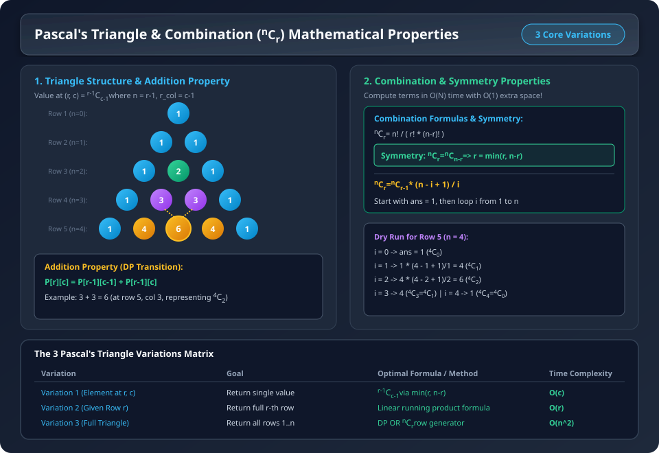

# Pascal's Triangle & Combination (${}^nC_r$) Properties

### Core Mathematical Foundations

#### 1. The Combination Formula
The element at row $r$ and column $c$ (1-indexed) in Pascal's Triangle is given by:
$$\text{Element}(r, c) = {}^{r-1}C_{c-1} = \frac{(r-1)!}{(c-1)! \cdot ((r-1) - (c-1))!}$$

#### 2. Recurrence / Running Product Property (Linear $O(N)$ Generation)
$${}^nC_0 = 1$$
$${}^nC_r = \frac{n - r + 1}{r} \cdot {}^nC_{r-1}$$

**Why?**
$$\frac{{}^nC_r}{{}^nC_{r-1}} = \frac{\frac{n!}{r!(n-r)!}}{\frac{n!}{(r-1)!(n-r+1)!}} = \frac{(r-1)!(n-r+1)!}{r!(n-r)!} = \frac{n-r+1}{r}$$

This enables calculating the next combination term in $O(1)$ time by multiplying by $(n - r + 1)$ and dividing by $r$.

#### 3. Pascal's Identity (Addition Property)
$${}^nC_r = {}^{n-1}C_{r-1} + {}^{n-1}C_r$$
Every interior element is the sum of the two elements directly above it.

#### 4. Symmetry Property (Optimization: $r = \min(r, n - r)$)
$${}^nC_r = {}^nC_{n-r}$$

**Mathematical Proof:**
$${}^nC_{n-r} = \frac{n!}{(n-r)! \cdot (n - (n - r))!} = \frac{n!}{(n-r)! \cdot r!} = \frac{n!}{r! \cdot (n-r)!} = {}^nC_r$$

**Algorithmic Benefit:**
Instead of calculating ${}^{10}C_8$ across 8 iterations, we compute ${}^{10}C_{10-8} = {}^{10}C_2$ in only 2 iterations:
$$r = \min(r, n - r)$$
This cuts the runtime to at most $\frac{n}{2}$ operations.

---

### Visual Architecture & Dry Run


---

# Question 1: Pascal's Triangle I - Find Element at Row $r$ and Column $c$

### Problem Statement
Given two integers $r$ and $c$ (1-indexed), return the value at the $r^{\text{th}}$ row and $c^{\text{th}}$ column in Pascal's Triangle.

- **Example 1:** `r = 4, c = 2` $\implies$ Output: `3` (since ${}^{4-1}C_{2-1} = {}^3C_1 = 3$)
- **Example 2:** `r = 5, c = 3` $\implies$ Output: `6` (since ${}^{5-1}C_{3-1} = {}^4C_2 = 6$)

### Intuition & Symmetry Optimization
- Value $= {}^{r-1}C_{c-1}$.
- By symmetry: ${}^nC_r = {}^nC_{n-r}$, so we can take $r = \min(r, n-r)$ to minimize loop iterations.

### Complexity Analysis
- **Time Complexity:** $O(c)$ (or $O(\min(c, r-c))$)
- **Space Complexity:** $O(1)$

---

### C++ Code
```cpp
class Solution {
  int nCr(int n ,int r){
    int res=1;
    r=min(r,n-r);
    for(int i=1;i<=r;i++){
      res= (res*(n-i+1))/i;
    }
    return res;
  }
public:
    int pascalTriangleI(int r, int c) {
        if(r==c) return 1;
        return nCr(r-1,c-1);
    }
};
```

### Java Code
```java
class Solution {
    private long nCr(int n, int r) {
        long res = 1;
        r = Math.min(r, n - r);
        for (int i = 1; i <= r; i++) {
            res = (res * (n - i + 1)) / i;
        }
        return res;
    }

    public int pascalTriangleI(int r, int c) {
        if (r == c || c == 1) return 1;
        return (int) nCr(r - 1, c - 1);
    }
}
```

---

# Question 2: Pascal's Triangle II - Generate $r^{\text{th}}$ Row (LeetCode 119)

### Problem Statement
Given an integer $r$ (1-indexed), return all the values in the $r^{\text{th}}$ row of Pascal's Triangle in correct order.

- **Example 1:** `r = 4` $\implies$ Output: `[1, 3, 3, 1]`
- **Example 2:** `r = 5` $\implies$ Output: `[1, 4, 6, 4, 1]`

### Intuition ($O(r)$ Single-Pass Trick)
The elements of row $r$ are ${}^nC_0, {}^nC_1, \dots, {}^nC_n$ where $n = r - 1$.
- First element: `res = 1`
- For column $i$ from $1$ to $n$: `res = (res * (n - i + 1)) / i`

### Complexity Analysis
- **Time Complexity:** $O(r)$
- **Space Complexity:** $O(1)$ auxiliary space (excluding output array)

---

### C++ Code
```cpp
class Solution {
 vector<int> nCr(int n ){
    int res=1;
    vector<int>resArr(1,1);
    for(int i=1;i<=n;i++){
      res= (res*(n-i+1))/i;
      resArr.push_back(res);
    }

    return resArr;
  }
public:
    vector<int> pascalTriangleII(int r) {
        return nCr(r-1);
    }
};
```

### Java Code
```java
import java.util.ArrayList;
import java.util.List;

class Solution {
    private List<Integer> nCr(int n) {
        long res = 1;
        List<Integer> resArr = new ArrayList<>();
        resArr.add(1);

        for (int i = 1; i <= n; i++) {
            res = (res * (n - i + 1)) / i;
            resArr.add((int) res);
        }

        return resArr;
    }

    public List<Integer> pascalTriangleII(int r) {
        return nCr(r - 1);
    }
}
```

---

# Question 3: Pascal's Triangle III - Generate Entire Triangle (LeetCode 118)

### Problem Statement
Given an integer $n$, return the first $n$ (1-indexed) rows of Pascal's Triangle.

- **Example 1:** `n = 4` $\implies$ Output: `[[1], [1, 1], [1, 2, 1], [1, 3, 3, 1]]`
- **Example 2:** `n = 5` $\implies$ Output: `[[1], [1, 1], [1, 2, 1], [1, 3, 3, 1], [1, 4, 6, 4, 1]]`

---

### Method 1: Using $O(N)$ Row Generator for Each Row

#### C++ Code
```cpp
class Solution {
   vector<int> nCr(int n ){
    int res=1;
    vector<int>resArr(1,1);
    for(int i=1;i<=n;i++){
      res= (res*(n-i+1))/i;
      resArr.push_back(res);
    }

    return resArr;
  }
public:
    vector<vector<int>> pascalTriangleIII(int n) {
        vector<vector<int>> res;
        for(int i=0;i<n;i++){
          vector<int> tres=nCr(i);
          res.push_back(tres);
        }
        return res;
    }
};
```

#### Java Code
```java
import java.util.ArrayList;
import java.util.List;

class Solution {
    private List<Integer> nCr(int n) {
        long res = 1;
        List<Integer> resArr = new ArrayList<>();
        resArr.add(1);

        for (int i = 1; i <= n; i++) {
            res = (res * (n - i + 1)) / i;
            resArr.add((int) res);
        }

        return resArr;
    }

    public List<List<Integer>> pascalTriangleIII(int n) {
        List<List<Integer>> res = new ArrayList<>();
        for (int i = 0; i < n; i++) {
            res.add(nCr(i));
        }
        return res;
    }
}
```

---

### Method 2: Dynamic Programming (Sum of Previous Row)

#### C++ Code
```cpp
class Solution {

public:
    vector<vector<int>> pascalTriangleIII(int n) {
        vector<vector<int>> res;
        int size=2;
        for(int i=1;i<=n;i++){
          if(i==1) res.push_back({1});
          else {
            vector<int>v(size,0);
            v[0]=1;
            v[size-1]=1;
            int n=res.size();
            for(int j=1;j<size-1;j++){
                v[j]=res[n-1][j]+res[n-1][j-1];
            }
            res.push_back(v);
            size++;
          }
        }
        return res;
    }
};
```

#### Java Code
```java
import java.util.ArrayList;
import java.util.List;

class Solution {
    public List<List<Integer>> pascalTriangleIII(int n) {
        List<List<Integer>> res = new ArrayList<>();
        int size = 2;

        for (int i = 1; i <= n; i++) {
            if (i == 1) {
                List<Integer> firstRow = new ArrayList<>();
                firstRow.add(1);
                res.add(firstRow);
            } else {
                List<Integer> v = new ArrayList<>();
                for (int k = 0; k < size; k++) v.add(0);
                v.set(0, 1);
                v.set(size - 1, 1);

                List<Integer> prevRow = res.get(res.size() - 1);
                for (int j = 1; j < size - 1; j++) {
                    v.set(j, prevRow.get(j) + prevRow.get(j - 1));
                }
                res.add(v);
                size++;
            }
        }
        return res;
    }
}
```

### Complexity Analysis for Method 1 & 2:
- **Time Complexity:** $O(n^2)$ (as we compute $1 + 2 + 3 + \dots + n = \frac{n(n+1)}{2}$ elements)
- **Space Complexity:** $O(1)$ auxiliary space (excluding the output 2D matrix)
