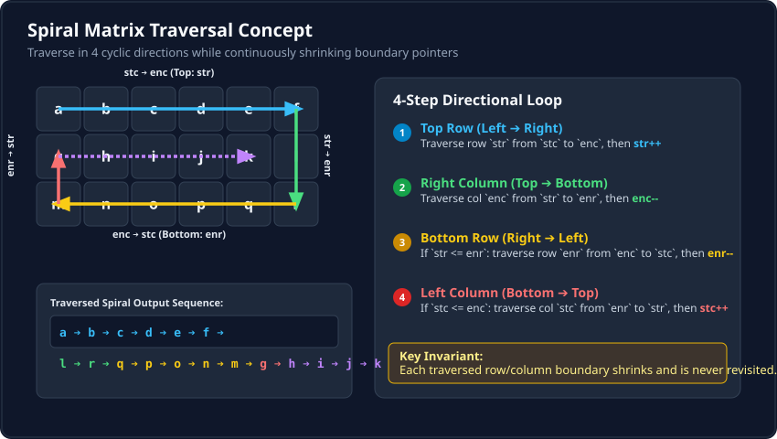
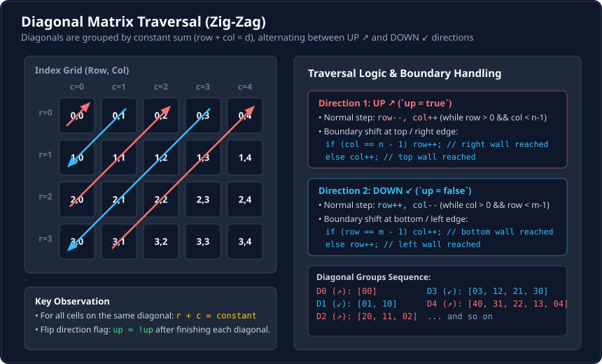
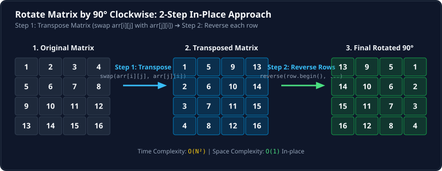

## Q1 Spiral Matrix

Given an `m x n` matrix, return all elements of the matrix in **clockwise spiral order**.

**Examples:**

**Input:** `matrix = [[1, 2, 3], [4, 5, 6], [7, 8, 9]]`  
**Output:** `[1, 2, 3, 6, 9, 8, 7, 4, 5]`  
**Explanation:** The elements in the spiral order are 1, 2, 3 -> 6, 9 -> 8, 7 -> 4, 5

**Input:** `matrix = [[1, 2, 3, 4], [5, 6, 7, 8]]`  
**Output:** `[1, 2, 3, 4, 8, 7, 6, 5]`  
**Explanation:** The elements in the spiral order are 1, 2, 3, 4 -> 8, 7, 6, 5

**Input:** `matrix = [[1, 2], [3, 4], [5, 6], [7, 8]]`  
**Output:** `[1, 2, 4, 6, 8, 7, 5, 3]`  

**Constraints:**
- `m == matrix.length`
- `n == matrix[i].length`
- `1 <= m, n <= 100`
- `-100 <= matrix[i][j] <= 100`



```cpp

class Solution {
public:
    vector<int> spiralOrder(vector<vector<int>>& matrix) {
        int str=0,stc=0;
        int enr=matrix.size()-1;
        int enc=matrix[0].size()-1;
        vector<int> res;

        while(str<= enr && stc<=enc){

            for(int j=stc;j<=enc;j++) res.push_back(matrix[str][j]);

            str++;

            for(int i=str;i<=enr;i++) res.push_back(matrix[i][enc]);

            enc--;

            if(str<=enr){

                for(int j=enc;j>=stc;j--) res.push_back(matrix[enr][j]);

                enr--;
            }

           if(stc<=enc){
                
                for(int i=enr;i>=str;i--) res.push_back(matrix[i][stc]);

                stc++;
           }
        }

        return res;

    }
};

```
## Q2 Diagonal traversal

Given an `m x n` matrix `mat`, return *an array of all the elements of the array in a diagonal order*.

**Examples:**

**Input:** `mat = [[1, 2, 3], [4, 5, 6], [7, 8, 9]]`  
**Output:** `[1, 2, 4, 7, 5, 3, 6, 8, 9]`  

**Input:** `mat = [[1, 2], [3, 4]]`  
**Output:** `[1, 2, 3, 4]`  

**Constraints:**
- `m == mat.length`
- `n == mat[i].length`
- `1 <= m, n <= 10^4`
- `1 <= m * n <= 10^4`
- `-10^5 <= mat[i][j] <= 10^5`



```cpp

class Solution {
public:
    vector<int> findDiagonalOrder(vector<vector<int>>& arr) {
        int m=arr.size();
        int n=arr[0].size();
        vector<int>res(m*n);
        int i=0;
        int row=0;
        int col=0;
        bool up=true;
        while(row<m&&col<n){
            if(up){
                while(row>0&&col<n-1){
                    res[i++]=arr[row][col];
                    row--;
                    col++;
                }
                res[i++]=arr[row][col];
                if(col==n-1) row++;
                else col++;
            }
            else
                {
                while(col>0&&row<m-1){
                    res[i++]=arr[row][col];
                    row++;
                    col--;
                }
                res[i++]=arr[row][col];
                if(row==m-1) col++;
                else row++;
            }
            up=!up;
            
        }
        
        return res;
    }
};

```
## Q3 Rotate matrix by 90 degree

Given an `n x n` 2D matrix representing an image, rotate the image by **90 degrees (clockwise)** in-place.

**Examples:**

**Input:** `matrix = [[1, 2, 3], [4, 5, 6], [7, 8, 9]]`  
**Output:** `[[7, 4, 1], [8, 5, 2], [9, 6, 3]]`  

**Constraints:**
- `n == matrix.length == matrix[i].length`
- `1 <= n <= 20`
- `-1000 <= matrix[i][j] <= 1000`

### Solution:



Reverse each row means if row is `1, 2, 3, 4` we make it `4, 3, 2, 1`.

```cpp

class Solution {
public:
    void rotateMatrix(vector<vector<int>>& matrix) {
        int n = matrix.size();
        
        // Transpose the matrix
        for (int i = 0; i < n; i++) {
            for (int j = 0; j < i; j++) {
                swap(matrix[i][j], matrix[j][i]);
            }
        }
        
        // Reverse each row of the matrix
        for (int i = 0; i < n; i++) {
            reverse(matrix[i].begin(), matrix[i].end());
        }
    }
};

```
