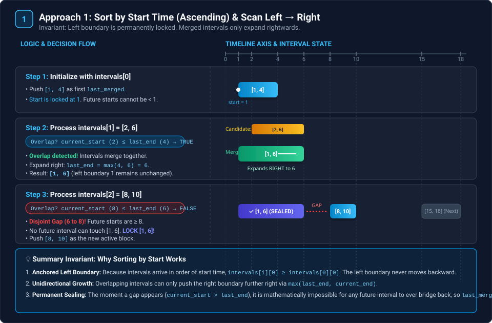
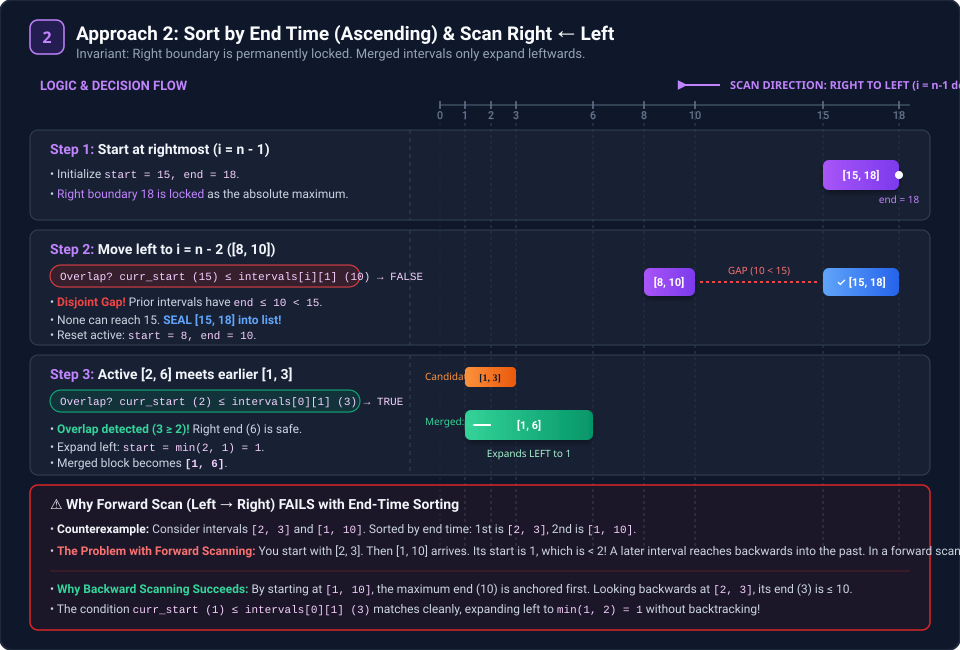

## Q1  Merge Intervals

Link--> https://leetcode.com/problems/merge-intervals/submissions/1852993945/

Given an array of `intervals` where `intervals[i] = [starti, endi]`, merge all overlapping intervals, and return an array of the non-overlapping intervals that cover all the intervals in the input.

**Example 1:**

Input: intervals = [[1,3],[2,6],[8,10],[15,18]]

 Output: [[1,6],[8,10],[15,18]] 
 
 Explanation: Since intervals [1,3] and [2,6] overlap, merge them into [1,6].


**Example 2:**

Input: intervals = [[1,4],[4,5]] 

Output: [[1,5]]

 Explanation: Intervals [1,4] and [4,5] are considered overlapping.


**Example 3:**

Input: intervals = [[4,7],[1,4]] 

Output: [[1,7]] Explanation: 

Intervals [1,4] and [4,7] are considered overlapping.


**Constraints:**

* `1 <= intervals.length <= 10^4`
* `intervals[i].length == 2`
* `0 <= starti <= endi <= 10^4`

#### Sort acc to start time

```cpp
#include <vector>
#include <algorithm>

class Solution_Standard {
public:
    vector<vector<int>> merge(vector<vector<int>>& intervals) {
        if (intervals.empty()) {
            return {};
        }

        sort(intervals.begin(), intervals.end(), [](const vector<int>& a, const vector<int>& b) {
            return a[0] < b[0];
        });

        vector<vector<int>> merged_list;

        merged_list.push_back(intervals[0]);

        for (int i = 1; i < intervals.size(); ++i) {
            vector<int>& last_merged = merged_list.back();

            int current_start = intervals[i][0];
            int current_end = intervals[i][1];

            if (current_start <= last_merged[1]) {
                last_merged[1] = max(last_merged[1], current_end);
            } else {
                merged_list.push_back(intervals[i]);
            }
        }

        return merged_list;
    }
};
```
#### Sort acc to end  time java upper vala easy hai
```java
class Solution {
    public int[][] merge(int[][] intervals) {
        Arrays.sort(intervals,(a,b)->a[1]-b[1]);
        List<int[]>l=new ArrayList<>();
        int n=intervals.length-1;
        int start=intervals[n][0];
        int end=intervals[n][1];
        for(int i=n-1;i>=0;i--){
            if(start<=intervals[i][1]){
                start=Math.min(start,intervals[i][0]);
            }
            else{
                l.add(new int[]{start,end});
                start=intervals[i][0];
                end=intervals[i][1];
            }
        }
         l.add(new int[]{start,end}); 
         return l.toArray(new int[l.size()][2]); 
    }
}
```

---

### 🧠 Deep-Dive: Why Both Approaches Work (The Symmetrical Duality)

At first glance, sorting by **Start Time** and sorting by **End Time** might look like two completely different algorithms. In reality, they are **mathematical duals (exact mirror reflections)** of each other across time!

```
Approach 1:  Sort by START (Ascending)  ──►  Scan LEFT  ──► RIGHT  (Expands Right)
Approach 2:  Sort by END   (Ascending)  ◄──  Scan RIGHT ◄── LEFT   (Expands Left)
```

---

### 1. Approach 1: Sort by Start Time (Ascending) & Scan Left → Right



#### How it works:
1. Sort intervals such that: $start_0 \le start_1 \le start_2 \le \dots \le start_{n-1}$.
2. Initialize `last_merged = intervals[0]`.
3. Traverse forward from $i = 1$ to $n-1$:
   * **Overlap Case:** If `current_start <= last_merged[1]`:
     $$\text{last\_merged}[1] = \max(\text{last\_merged}[1], \text{current\_end})$$
   * **Gap Case:** If `current_start > last_merged[1]`:
     Push `last_merged` into results, and start a new merged block with `intervals[i]`.

#### 💡 Mathematical Invariant (Why it works):
* **Left boundary is permanently anchored:** Because the array is sorted by start time, every incoming interval satisfies $start_i \ge start_{\text{last\_merged}}$. An incoming interval **can never reach to the left** of where `last_merged` started. It can only extend the right boundary.
* **Irreversible Gap:** The instant $start_i > last\_merged[1]$, we know that for **all** subsequent intervals $k > i$:
  $$start_k \ge start_i > last\_merged[1]$$
  No future interval can ever touch or overlap with `last_merged`. Therefore, `last_merged` is **100% complete and safe to lock** forever!

---

### 2. Approach 2: Sort by End Time (Ascending) & Scan Right → Left



#### How it works:
1. Sort intervals by end time ascending: $end_0 \le end_1 \le \dots \le end_{n-1}$.
2. Start from the **rightmost element** (largest end time):
   `start = intervals[n-1][0]`, `end = intervals[n-1][1]`.
3. Traverse **backwards** from $i = n-2$ down to $0$:
   * **Overlap Case:** If `start <= intervals[i][1]`:
     $$\text{start} = \min(\text{start}, intervals[i][0])$$
   * **Gap Case:** If `start > intervals[i][1]`:
     Add `[start, end]` to result list, and reset `start = intervals[i][0]`, `end = intervals[i][1]`.
4. Add the final `[start, end]` to the result list.

#### 💡 Mathematical Invariant (Why it works):
* **Right boundary is permanently anchored:** Because we are traversing backwards through an array sorted by end time, every incoming interval satisfies $intervals[i][1] \le end_{\text{current}}$. It **can never extend past the right boundary**. It can only stretch the block **leftwards**.
* **Irreversible Gap:** The instant $intervals[i][1] < start$, we know that for **all** preceding intervals $k < i$:
  $$intervals[k][1] \le intervals[i][1] < start$$
  None of the remaining intervals can ever reach the current block. Thus, `[start, end]` is **100% complete and safe to lock**!

---

### ⚠️ Crucial Question: Why does "Sort by End Time + Scan Left → Right" FAIL?

Why did the Java solution have to loop backwards (`for (int i = n - 1; i >= 0; i--)`) instead of forward?

#### The Counter-Example:
Consider these two intervals:
* $A = [2, 3]$
* $B = [1, 10]$

1. **Sorted by End Time (Ascending):**
   * Index 0: $[2, 3]$ (end = 3)
   * Index 1: $[1, 10]$ (end = 10)

2. **If you scanned Forward (Left → Right):**
   * You start with $[2, 3]$.
   * Next you see $[1, 10]$. Notice that its start ($1$) is **less than** the previous interval's start ($2$)!
   * An interval that appears *later* in the scan stretches backwards into the *past*. If you had already finalized previous non-overlapping intervals, $[1, 10]$ could swallow them retroactively! A single forward pass cannot handle this without complex backtracking or re-merging past blocks.

3. **Why Backward (Right → Left) avoids this completely:**
   * You start at the end with $[1, 10]$ (`start = 1, end = 10`).
   * You move backward to $[2, 3]$:
     * Check: $start (1) \le intervals[0][1] (3)$? **Yes!**
     * Update: $start = \min(1, 2) = 1$.
     * Result is correctly $[1, 10]$.
   * Because you start with the largest end time, intervals can only grow **leftward**. No backward reaching into already-finalized intervals is ever needed!

---

### 📊 Summary Comparison

| Property | Approach 1 (C++ Standard) | Approach 2 (Java Backward) |
| :--- | :--- | :--- |
| **Sort Key** | `start` time (Ascending) | `end` time (Ascending) |
| **Traversal Direction** | **Left → Right** (`0` to `n-1`) | **Right → Left** (`n-1` down to `0`) |
| **Anchored Boundary** | **Left** ($start$ never decreases) | **Right** ($end$ never increases) |
| **Growing Boundary** | Expands **Rightwards** ($\max$) | Expands **Leftwards** ($\min$) |
| **Overlap Condition** | `current_start <= last_merged[1]` | `curr_start <= intervals[i][1]` |
| **Boundary Update** | `last_merged[1] = max(last_end, current_end)` | `start = min(start, intervals[i][0])` |
| **Gap (Sealing) Proof** | Future intervals start $\ge current\_start > last\_end$ | Past intervals end $\le intervals[i][1] < curr\_start$ |

---

## Q2 Non-overlapping Intervals

Given an array of N intervals in the form of (start[i], end[i]), where start[i] is the starting point of the interval and end[i] is the ending point of the interval, return the minimum number of intervals that need to be removed to make the remaining intervals non-overlapping.


Note:

Intervals which only touch at a point are also considered as non-overlapping. For example, [1, 3] and [3, 4] are non-overlapping.


Examples:
---
Input : Intervals = [ [1, 2] , [2, 3] , [3, 4] ,[1, 3] ]


Output : 1


Explanation : You can remove the interval [1, 3] to make the remaining interval non overlapping.

Input : Intervals = [ [1, 3] , [1, 4] , [3, 5] , [3, 4] , [4, 5] ]


Output : 2


Explanation : You can remove the intervals [1, 4] and [3, 5] and the remaining intervals becomes non overlapping.

### solution

```cpp

class Solution {
    bool static comp(vector<int>& val1, vector<int>& val2) {
        return val1[1] < val2[1];
    }
public:
    int MaximumNonOverlappingIntervals(vector<vector<int>>& intervals) {

        sort(intervals.begin(), intervals.end(),comp);

        int n = intervals.size();
        int cnt = 1;
        int lastEndTime = intervals[0][1];
        for (int i = 1; i < n; i++) {
            if (intervals[i][0] >= lastEndTime) {
                cnt++;
                lastEndTime = intervals[i][1];
            }
        }
        //cnt is number of interval added in result
        return n-cnt;
    }
};
```

#### Java Solution (Same Logic)

```java
import java.util.Arrays;

class Solution {
    public int eraseOverlapIntervals(int[][] intervals) {
        if (intervals == null || intervals.length == 0) {
            return 0;
        }

        // Step 1: Sort intervals by END TIME in ascending order
        // Note: Using Integer.compare prevents potential overflow
        Arrays.sort(intervals, (a, b) -> Integer.compare(a[1], b[1]));

        int n = intervals.length;
        int cnt = 1; // Count of compatible (non-overlapping) intervals kept
        int lastEndTime = intervals[0][1];

        // Step 2: Iterate through remaining intervals
        for (int i = 1; i < n; i++) {
            // Touch at a single point is allowed (non-overlapping)
            if (intervals[i][0] >= lastEndTime) {
                cnt++;                         // Keep this interval
                lastEndTime = intervals[i][1]; // Update the finish time
            }
            // Else: Overlap! Do not pick this interval (it gets removed)
        }

        // Step 3: Minimum intervals removed = Total - Kept
        return n - cnt;
    }
}
```

### 💡 Intuition: Why Greedy on End Time Works

The problem asks: **"What is the minimum number of intervals to remove to make the remaining non-overlapping?"**

This is mathematically equivalent to:
$$\text{Min Removals} = \text{Total Intervals } (n) - \text{Maximum Non-Overlapping Intervals Kept } (cnt)$$

To maximize the number of compatible intervals (**Activity Selection Problem**):
* Always pick the interval that **finishes earliest** (`end[i]` is smallest).
* **Why?** An interval that ends early frees up the timeline as soon as possible, leaving the **maximum available space** for future intervals. Choosing an interval that finishes later only restricts future choices.

---

### 🔍 Line-by-Line Code Explanation

1. **`Arrays.sort(intervals, (a, b) -> Integer.compare(a[1], b[1]));`**
   * Sorts the intervals in ascending order of their **end times** (`index 1`).
   * We use `Integer.compare(a[1], b[1])` instead of `a[1] - b[1]` to safely avoid 32-bit integer subtraction overflow on extreme inputs.

2. **`int cnt = 1; int lastEndTime = intervals[0][1];`**
   * We greedily take the first interval `intervals[0]` because it finishes earliest among all intervals.
   * `cnt = 1`: We have kept 1 interval so far.
   * `lastEndTime = intervals[0][1]`: Keeps track of when the last kept interval finishes.

3. **`for (int i = 1; i < n; i++)`**
   * We examine each remaining candidate interval one by one.

4. **`if (intervals[i][0] >= lastEndTime)`**
   * Checks whether the current interval starts **at or after** the previous one ended.
   * Because intervals that touch at a single point (e.g., `[1, 2]` and `[2, 3]`) are considered **non-overlapping**, we use `>=`.
   * **If True:** No overlap! We keep this interval:
     * `cnt++`: Increment count of kept intervals.
     * `lastEndTime = intervals[i][1]`: Update finish time to this interval's end point.
   * **If False (`intervals[i][0] < lastEndTime`):** Overlap! We **skip (remove)** `intervals[i]`. Because the array is sorted by end time, `intervals[i]` ends $\ge lastEndTime$, so dropping it and keeping `lastEndTime` is always the optimal greedy choice.

5. **`return n - cnt;`**
   * The answer is the total intervals minus the maximum number of intervals we were able to keep.

---

### 🧪 Test Case & Dry Run Traces

#### Example 1:
```
Input: intervals = [[1, 2], [2, 3], [3, 4], [1, 3]]
```

**Step 1: Sort by end time `a[1]`:**
* `[1, 2]` (end = 2)
* `[2, 3]` (end = 3)
* `[1, 3]` (end = 3)
* `[3, 4]` (end = 4)

Sorted array: `[[1, 2], [2, 3], [1, 3], [3, 4]]`, $n = 4$

**Step 2: Step-by-Step Execution Trace:**

| Iteration `i` | Current Interval `intervals[i]` | Condition: `start >= lastEndTime` | Decision | `cnt` (Kept) | `lastEndTime` |
| :---: | :---: | :---: | :---: | :---: | :---: |
| **Initial** | `intervals[0] = [1, 2]` | *(Picked automatically)* | **Keep** `[1, 2]` | `1` | `2` |
| `i = 1` | `[2, 3]` | `2 >= 2` → **TRUE** | **Keep** `[2, 3]` (touching allowed) | `2` | `3` |
| `i = 2` | `[1, 3]` | `1 >= 3` → **FALSE** | **Overlap! Remove** `[1, 3]` | `2` | `3` |
| `i = 3` | `[3, 4]` | `3 >= 3` → **TRUE** | **Keep** `[3, 4]` | `3` | `4` |

* Total intervals kept = `cnt = 3` (`[1, 2]`, `[2, 3]`, `[3, 4]`).
* **Final Output:** $n - cnt = 4 - 3 = \mathbf{1}$ (Remove interval `[1, 3]`).

---

#### Example 2:
```
Input: intervals = [[1, 3], [1, 4], [3, 5], [3, 4], [4, 5]]
```

**Step 1: Sort by end time `a[1]`:**
$$\text{Sorted: } [[1, 3], [1, 4], [3, 4], [3, 5], [4, 5]], \quad n = 5$$

**Step 2: Step-by-Step Execution Trace:**

| Iteration `i` | Current Interval `intervals[i]` | Condition: `start >= lastEndTime` | Decision | `cnt` (Kept) | `lastEndTime` |
| :---: | :---: | :---: | :---: | :---: | :---: |
| **Initial** | `intervals[0] = [1, 3]` | *(Picked automatically)* | **Keep** `[1, 3]` | `1` | `3` |
| `i = 1` | `[1, 4]` | `1 >= 3` → **FALSE** | **Overlap! Remove** `[1, 4]` | `1` | `3` |
| `i = 2` | `[3, 4]` | `3 >= 3` → **TRUE** | **Keep** `[3, 4]` | `2` | `4` |
| `i = 3` | `[3, 5]` | `3 >= 4` → **FALSE** | **Overlap! Remove** `[3, 5]` | `2` | `4` |
| `i = 4` | `[4, 5]` | `4 >= 4` → **TRUE** | **Keep** `[4, 5]` | `3` | `5` |

* Total intervals kept = `cnt = 3` (`[1, 3]`, `[3, 4]`, `[4, 5]`).
* **Final Output:** $n - cnt = 5 - 3 = \mathbf{2}$ (Remove intervals `[1, 4]` and `[3, 5]`).

---

### ⏱️ Complexity
* **Time Complexity:** $O(n \log n)$ for sorting the $n$ intervals. The subsequent linear traversal runs in $O(n)$.
* **Space Complexity:** $O(1)$ auxiliary memory (or $O(\log n)$ internal recursion stack used by Java's `Arrays.sort`).

---

Q-->what if we sort by ascednding order start time and is start time equal then descendning end time?

### This approach will FAIL.

Sorting by **Start Time (Ascending)** is generally the wrong strategy for "Maximum Non-Overlapping Intervals" (or Activity Selection), regardless of how you handle ties.

#### 1. The Counter-Example
Imagine you have these three intervals:
* **A:** `[1, 100]` (Starts early, but lasts forever)
* **B:** `[2, 3]`
* **C:** `[4, 5]`

**Your Sorting Strategy:**
1. Sort by Start Time Ascending.
2. Tie-breaker: End Time Descending.

**The Resulting Order:**
1. `[1, 100]` (Starts at 1)
2. `[2, 3]` (Starts at 2)
3. `[4, 5]` (Starts at 4)

**The Execution:**
* You pick the first one: `[1, 100]`.
* Your `lastEndTime` becomes 100.
* Next is `[2, 3]`. Start (2) is less than 100. **Skip (Overlap)**.
* Next is `[4, 5]`. Start (4) is less than 100. **Skip (Overlap)**.

**Your Answer:** 1 interval.  
**Correct Answer:** 2 intervals (`[2, 3]` and `[4, 5]`).

---

#### 2. Why does it fail?
The goal is to fit as many items as possible. To do that, you need to free up the resource (the timeline) as early as possible.

* **Start Time Sorting:** Prioritizes "starting early." It doesn't care if you occupy the room for 100 hours.
* **End Time Sorting (Correct):** Prioritizes "finishing early." It guarantees that once you pick an item, you are available for the next one as soon as possible.

---

#### 3. Where is your strategy used?
Your specific sorting strategy (Start Ascending, End Descending) is actually the standard solution for a different problem: **"Remove Covered Intervals"** (LeetCode 1288).

* **Problem:** Find intervals that are completely inside another interval.
* **Logic:** If `[1, 100]` comes before `[1, 5]`, you can easily see that `[1, 5]` is inside `[1, 100]` because the start is $\ge$ and the end is $\le$.

But for **Non-Overlapping Intervals**, you must strictly stick to **End Time Ascending**.


## Q3 Insert Interval

Given a 2D array Intervals, where Intervals[i] = [start[i], end[i]] represents the start and end of the ith interval, the array represents non-overlapping intervals sorted in ascending order by start[i]. 


Given another array newInterval, where newInterval = [start, end] represents the start and end of another interval, merge newInterval into Intervals such that Intervals remain non-overlapping and sorted in ascending order by start[i].


Return Intervals after the insertion of newInterval.


Examples:
---
Input : Intervals = [ [1, 3] , [6, 9] ] , newInterval = [2, 5]


Output : [ [1, 5] , [6, 9] ]


Explanation : After inserting the newInterval the Intervals array becomes [ [1, 3] , [2, 5] , [6, 9] ].

So to make them non overlapping we can merge the intervals [1, 3] and [2, 5].

So the Intervals array is [ [1, 5] , [6, 9] ].

---
Input : Intervals = [ [1, 2] , [3, 5] , [6, 7] , [8,10] ] , newInterval = [4, 8]


Output : [ [1, 2] , [3, 10] ]


Explanation : The Intervals array after inserting newInterval is [ [1, 2] , [3, 5] , [4, 8] , [6, 7] , [8, 10] ].

We merge the required intervals to make it non overlapping.

So final array is [ [1, 2] , [3, 10] ].
### Solution

We add interval in 3 parts
 
```cpp
class Solution {
public:
    vector<vector<int>> insertNewInterval(vector<vector<int>>& intervals, vector<int>& newInterval){
        if (intervals.empty()) {
            return {};
        }
        int i=0;    
        int n = intervals.size(); 
        vector<vector<int>> res;
        while(i < n && intervals[i][1] < newInterval[0]){
             res.push_back(intervals[i]);
             i = i + 1; 
        } 

        while(i < n && intervals[i][0] <= newInterval[1]){
            newInterval[0] = min(newInterval[0], intervals[i][0]); 
            newInterval[1] = max(newInterval[1], intervals[i][1]); 
            i = i + 1; 
        }
        res.push_back(newInterval); 
        while(i < n){
            res.push_back(intervals[i]); 
            i = i + 1; 
        }
        return res;
    }
};
```

---

### 🧠 Deep-Dive Explanation: The 3-Phase Linear Scan ($O(N)$)

Unlike Q1 and Q2, the input `intervals` in Q3 is **already sorted** and **non-overlapping**. 
This is a huge advantage: **we do NOT need $O(N \log N)$ sorting!** We can achieve the solution in a single linear pass $O(N)$ with 3 clear phases.


---

### 📌 The 3 Phases Explained:

#### Phase 1: Left Disjoint Intervals (Strictly Before `newInterval`)
* **Condition:** `intervals[i][1] < newInterval[0]`
* **Meaning:** The current interval finishes strictly **before** `newInterval` starts (e.g., `[1, 2]` finishes at 2, while `newInterval = [4, 8]` starts at 4).
* **Action:** It cannot possibly overlap. Add `intervals[i]` directly to `res`, and increment `i`.

#### Phase 2: Overlapping Intervals (Merge & Absorb)
* **Condition:** `intervals[i][0] <= newInterval[1]`
* **Meaning:** The current interval starts **at or before** `newInterval` ends. Since Phase 1 already ensured it didn't end before `newInterval` started, an overlap is guaranteed!
* **Action:** Merge the two intervals by expanding `newInterval`:
  $$\text{newInterval}[0] = \min(\text{newInterval}[0], \text{intervals}[i][0])$$
  $$\text{newInterval}[1] = \max(\text{newInterval}[1], \text{intervals}[i][1])$$
* When this loop finishes, all overlapping segments have been absorbed into `newInterval`.
* **Push the finalized `newInterval` to `res`!**

#### Phase 3: Right Disjoint Intervals (Strictly After `newInterval`)
* **Condition:** `while (i < n)`
* **Meaning:** All remaining intervals start strictly after `newInterval` finishes.
* **Action:** Since they were already sorted and non-overlapping in the input, simply push all remaining intervals to `res`.

---

### ⚠️ Edge Case Note: Empty `intervals` Array
Notice that if `intervals` is empty (e.g., `intervals = []`, `newInterval = [5, 7]`):
* The expected output is `[[5, 7]]`.
* If we simply omit the check `if (intervals.empty()) return {};`, the algorithm naturally handles it:
  * Phase 1: loop doesn't execute (`0 < 0` is false).
  * Phase 2: loop doesn't execute.
  * We push `newInterval` into `res` $\rightarrow$ `res = [[5, 7]]`.
  * Phase 3: loop doesn't execute.
  * Returns `[[5, 7]]` correctly!

---

### ☕ Java Solution (Clean & Optimized)

```java
import java.util.ArrayList;
import java.util.List;

class Solution {
    public int[][] insert(int[][] intervals, int[] newInterval) {
        List<int[]> res = new ArrayList<>();
        int i = 0;
        int n = intervals.length;

        // Phase 1: Add all intervals that come strictly BEFORE newInterval
        while (i < n && intervals[i][1] < newInterval[0]) {
            res.add(intervals[i]);
            i++;
        }

        // Phase 2: Merge all overlapping intervals into newInterval
        while (i < n && intervals[i][0] <= newInterval[1]) {
            newInterval[0] = Math.min(newInterval[0], intervals[i][0]);
            newInterval[1] = Math.max(newInterval[1], intervals[i][1]);
            i++;
        }
        // Add the merged newInterval
        res.add(newInterval);

        // Phase 3: Add all intervals that come strictly AFTER newInterval
        while (i < n) {
            res.add(intervals[i]);
            i++;
        }

        return res.toArray(new int[res.size()][2]);
    }
}
```

---

### 🧪 Detailed Dry Run Trace

$$\text{Input: } \text{intervals} = [[1, 2], [3, 5], [6, 7], [8, 10], [12, 16]], \quad \text{newInterval} = [4, 8]$$

| Phase | `i` | Interval `intervals[i]` | Condition Checked | Action | State of `newInterval` | `res` Content |
| :---: | :---: | :---: | :---: | :---: | :---: | :---: |
| **Phase 1** | `0` | `[1, 2]` | `2 < 4` → **TRUE** | Add `[1, 2]` to `res`, `i=1` | `[4, 8]` | `[[1, 2]]` |
| **Phase 1** | `1` | `[3, 5]` | `5 < 4` → **FALSE** | **Phase 1 Ends** | `[4, 8]` | `[[1, 2]]` |
| **Phase 2** | `1` | `[3, 5]` | `3 <= 8` → **TRUE** | `newInterval = [min(4,3), max(8,5)] = [3, 8]`, `i=2` | `[3, 8]` | `[[1, 2]]` |
| **Phase 2** | `2` | `[6, 7]` | `6 <= 8` → **TRUE** | `newInterval = [min(3,6), max(8,7)] = [3, 8]`, `i=3` | `[3, 8]` | `[[1, 2]]` |
| **Phase 2** | `3` | `[8, 10]` | `8 <= 8` → **TRUE** | `newInterval = [min(3,8), max(8,10)] = [3, 10]`, `i=4` | `[3, 10]` | `[[1, 2]]` |
| **Phase 2** | `4` | `[12, 16]` | `12 <= 10` → **FALSE**| **Phase 2 Ends** → Add `[3, 10]` to `res` | `[3, 10]` | `[[1, 2], [3, 10]]` |
| **Phase 3** | `4` | `[12, 16]` | `i < n` → **TRUE** | Add `[12, 16]` to `res`, `i=5` | `[3, 10]` | `[[1, 2], [3, 10], [12, 16]]` |

**Final Result:** `[[1, 2], [3, 10], [12, 16]]`

---

### ⏱️ Complexity
* **Time Complexity:** $O(N)$ — Single pass through the array. Every interval is visited exactly once.
* **Space Complexity:** $O(1)$ auxiliary space (excluding the output array).

---

## Q4 DE shaw OA question


### Problem Description 

Given is an array consisting of $n$ intervals. The $i^{th}$ interval is of type $(a[i], b[i])$. Also given is an integer $k$. Add exactly one segment $(a, b)$ to the array such that $b - a \le k$ and the modified array can be separated into the minimum number of connected sets.

A set of segments $(a[1], b[1]), (a[2], b[2]), \dots, (a[n], b[n])$ is connected if every point in the segment $(\min(a[1], a[2], \dots, a[n]), \max(b[1], b[2], \dots, b[n]))$ is covered by some segment $(a[i], b[i])$ in the set.

#### Example
The set `[(1, 2), (2, 3), (1, 5)]` is connected while the set `[(1, 2), (3, 4)]` is not because point $2.5$ is not covered by any segment.

Let's consider the array $a = [(1, 5), (2, 4), (6, 6), (7, 14), (16, 19)]$ and given $k = 2$; Add a segment $(5, 7)$ into the array. After adding this segment, separate the array into 2 connected sets:
* `(1, 5), (2, 4), (5, 7), (6, 6), (7, 14)`
* `(16, 19)`

However, if we add a segment $(14, 16)$ into the array, then we have to separate the array using 3 connected sets:
* `(1, 5), (2, 4)`
* `(6, 6)`
* `(7, 14), (14, 16), (16, 19)`

So, **2 connected sets** is the minimum answer that we can achieve.

#### Function Description
Complete the function `minimumDivision` in the editor below.

`minimumDivision` has the following parameter(s):
* `a`: an integer array of first parameters of intervals
* `b`: an integer array of second parameters of intervals
* `k`: an integer denoting the maximum range of the segment that can be added.

#### Returns
* `int`: an integer denoting the minimum number of sets needed to separate the array after adding one segment.

#### Constraints
* $1 \le n \le 2 \times 10^5$
* $1 \le a[i] \le b[i] \le 10^9$
* $1 \le k \le 10^9$

---

These type of questions sometimes they give in 2-d array and sometimes in 2 1-d array so if they give in 2 1-d array you need to put them in 2-d array

### Solution 

1.first merge intervals ,after that no intersection,after merging size is n
2.now we want to join maximum ranges so we put k length interval so step is
 at evry end point we put k-length interval and check how many intervals that k length will cover

 suppose we have (s,e) then we put k length so from e to e+k we get intervals covered 

 so we binary search e+k in the array of e , we either need e+k or element less than e+k so we only need that,then we get index of element e+k or less that e+k than from i to that index count no of elemeents merged and subtract from n


 for each index we do it and get min of that (n-(that elements we merged))

```cpp
#include <vector>
#include <algorithm>
#include <cmath>

using namespace std;

class Solution {
private:
    vector<vector<long long>> getConnectedComponents(vector<vector<long long>>& allIntervals) {
        if (allIntervals.empty()) {
            return {};
        }

        sort(allIntervals.begin(), allIntervals.end(), [](const vector<long long>& a, const vector<long long>& b) {
            return a[0] < b[0];
        });

        vector<vector<long long>> merged_list;
        
        merged_list.push_back(allIntervals[0]);

        for (size_t i = 1; i < allIntervals.size(); ++i) {
            vector<long long>& last_merged = merged_list.back();
            long long current_start = allIntervals[i][0];
            
            if (current_start <= last_merged[1]) {
                last_merged[1] = max(last_merged[1], allIntervals[i][1]);
            } else {
                merged_list.push_back(allIntervals[i]);
            }
        }

        return merged_list;
    }

public:
    int minimumDivision(const vector<int>& a, const vector<int>& b, long long k) {
        int n = a.size();
        if (n == 0) {
            return 0;
        }

        vector<vector<long long>> intervals(n, vector<long long>(2));
        for (int i = 0; i < n; ++i) {
            intervals[i][0] = a[i];
            intervals[i][1] = b[i];
        }

        vector<vector<long long>> components = getConnectedComponents(intervals);
        
        int m = components.size();

        if (m <= 1) {
            return m;
        }

        int max_components_merged = 1; 

        // Create a separate vector of only the starting points of components for binary search
        vector<long long> start_points(m);
        for(int i = 0; i < m; ++i) {
            start_points[i] = components[i][0];
        }

        // Iterate through all possible starting components (C_i). O(M)
        for (int i = 0; i < m; ++i) {
            
            // E_i: End of the starting component (C_i).
            long long E_i = components[i][1];

            // Target search value: The maximum permissible start point for a component C_j to be merged.
            // S_j - E_i <= k  =>  S_j <= E_i + k
            long long target_S_j = E_i + k;

            // Find the first component C_j whose start point S_j is strictly greater than target_S_j.
            // std::upper_bound performs a binary search in O(log M).
            auto it = upper_bound(start_points.begin(), start_points.end(), target_S_j);

            // The component C_j that is the farthest to the right and satisfies S_j <= target_S_j
            // is the element *before* the iterator returned by upper_bound.
            
            // Get the index of the first element GREATER than target_S_j.
            int upper_index = distance(start_points.begin(), it);

            // The index of the farthest mergeable component (C_j) is one less than upper_index.
            // The index must be at least i (since it includes C_i).
            int j = max(i, upper_index - 1);
            
            // Components merged = j - i + 1
            int current_merged_count = j - i + 1;
            
            max_components_merged = max(max_components_merged, current_merged_count);
        }

        return m - max_components_merged + 1;
    }
};
```

The C++ STL function std::distance() is a powerful utility from the <iterator> header (often included via <algorithm> or <numeric>).

Its primary purpose is to calculate the number of steps (or elements) between two iterators in a range.

📝 Key Features and Usage
Header: <iterator> (or often available through <algorithm>)

Syntax:

```C++

distance(InputIterator first, InputIterator last);
```
Return Value: It returns an integer type (std::iterator_traits<InputIterator>::difference_type) representing the number of elements between first and last. The count can be zero or negative.

Calculation: It effectively calculates last - first.

💡 What it Does
std::distance() determines the length of a range defined by two iterators.