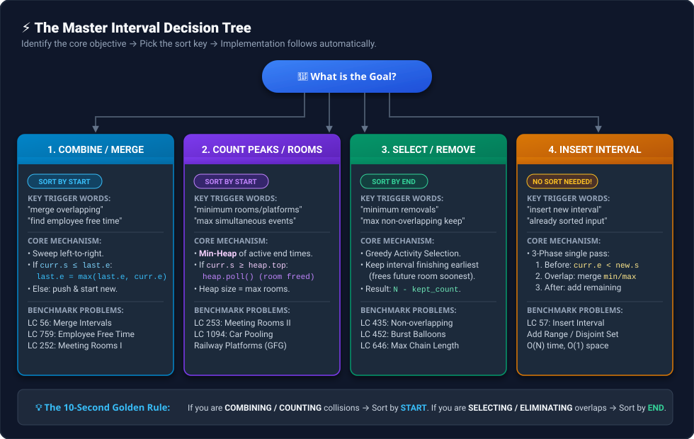
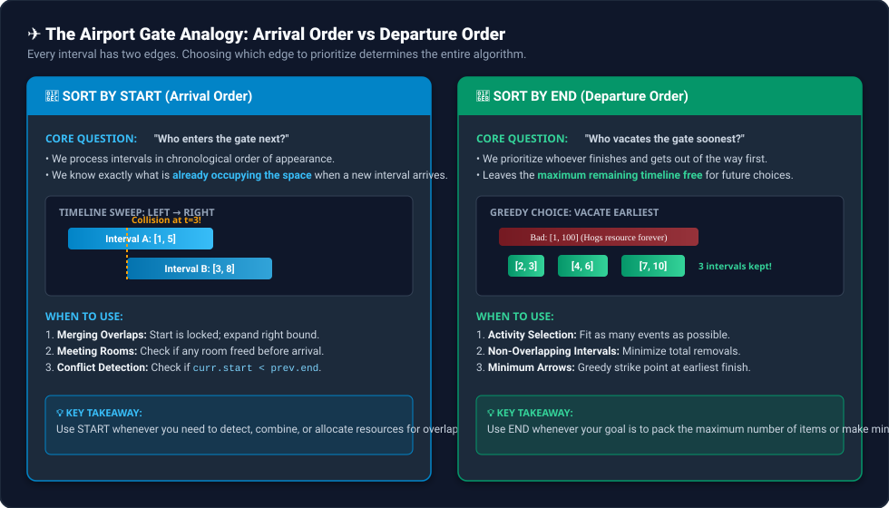

# 🧠 The Master Framework for Interval Problems

> **Core Philosophy:** Interval problems are not about memorizing dozens of distinct solutions. Every interval problem on LeetCode falls into **one of 5 fundamental buckets**. Once you identify the bucket and ask the right 3 diagnostic questions, the sorting key, data structure, and traversal logic follow automatically.

---

## 🗺️ The Universal Decision Tree




---

## ✈️ The Mental Model: The Airport Gate Analogy

Every interval $[start, end]$ has two distinct boundaries. Choosing which boundary to sort by dictates the entire invariant:



### 1. Left Edge ($start$) = Arrival Order 🛬
* **Question asked:** *"Who enters the gate next?"*
* **What it gives you:** You process intervals in chronological order of appearance. When a new interval arrives, you know exactly what is already occupying the timeline.
* **Use when:** You need to **detect collisions**, **merge contiguous blocks**, or **allocate simultaneous rooms/platforms**.

### 2. Right Edge ($end$) = Departure Order 🛫
* **Question asked:** *"Who vacates the gate soonest?"*
* **What it gives you:** You greedily pick the event that finishes earliest, freeing up the **maximum possible future timeline** for subsequent events.
* **Use when:** You need to **select the maximum number of compatible items** or **eliminate the minimum number of overlapping items**.

---

## ⚠️ The Fatal Mistake: Why Sort-by-Start Fails for "Max Non-Overlapping"

Consider three intervals:
* $A = [1, 100]$ (Starts earliest, but occupies the resource forever)
* $B = [2, 3]$
* $C = [4, 5]$

* **If you sorted by START:**
  1. You pick $A = [1, 100]$ first because it starts at 1.
  2. Now your active end time is $100$.
  3. Interval $B = [2, 3]$ arrives: $2 < 100$ $\rightarrow$ Overlap! (Discarded).
  4. Interval $C = [4, 5]$ arrives: $4 < 100$ $\rightarrow$ Overlap! (Discarded).
  * **Result:** You only kept **1 interval** ($[1, 100]$).
* **If you sorted by END:**
  1. Sorted order: $[2, 3]$ (end 3), $[4, 5]$ (end 5), $[1, 100]$ (end 100).
  2. Pick $[2, 3]$ $\rightarrow$ end becomes $3$.
  3. Pick $[4, 5]$ ($4 \ge 3$) $\rightarrow$ end becomes $5$.
  4. Discard $[1, 100]$ ($1 < 5$).
  * **Result:** You kept **2 intervals** ($[2, 3]$ and $[4, 5]$)! Optimal!

> **Rule of Thumb:** If you want to keep as many items as possible, always pick the one that **gets out of the way earliest**.

---

## ❓ The 3 Diagnostic Questions (The 10-Second Filter)

When faced with an interval problem in an interview, ask these three questions in order:

```
Q1: Am I COMBINING intervals OR SELECTING intervals?
    ├── Combining / Merging overlaps      ──► Sort by START
    └── Selecting / Maximizing valid ones ──► Sort by END

Q2: Do I need a GLOBAL PEAK COUNT OR a FILTERED LIST?
    ├── Simultaneous overlap count        ──► Min-Heap of end times OR Line Sweep (+1 / -1)
    └── Filtered non-overlapping list     ──► Greedy single variable (lastEndTime)

Q3: Is the input ALREADY SORTED?
    ├── Yes (e.g., Insert Interval)       ──► O(N) 3-Phase Single Pass (No sorting!)
    └── No                                ──► O(N log N) Sort first
```

---

## 📊 Comprehensive Pattern $\rightarrow$ Strategy Cheatsheet

| Problem Type / Signal Words | Sort Key | Core Data Structure / Technique | Invariant / Greedy Choice | Benchmark Problems |
| :--- | :--- | :--- | :--- | :--- |
| **1. Merge Overlapping**<br>• *"merge intervals"*<br>• *"find gaps / free time"* | **`START`** (Asc) | Dynamic list (`res.back()`) | Left boundary locked. Expand right: `last.end = max(last.end, curr.end)`. Gap when `curr.start > last.end`. | • **LC 56:** Merge Intervals<br>• **LC 759:** Employee Free Time<br>• **LC 252:** Meeting Rooms I |
| **2. Peak Overlap / Rooms**<br>• *"min rooms / platforms"*<br>• *"max simultaneous events"* | **`START`** (Asc) | **Min-Heap** of end times<br>*(or Line Sweep: +1 start, -1 end)* | `heap.top()` represents earliest room to free up. If `curr.start >= heap.top()`, reuse room (`heap.poll()`). Else allocate new. | • **LC 253:** Meeting Rooms II<br>• **LC 1094:** Car Pooling<br>• **LC 218:** The Skyline Problem |
| **3. Minimum Removals**<br>• *"min intervals to remove"*<br>• *"max non-overlapping intervals"* | **`END`** (Asc) | Single variable (`lastEndTime`) | Pick earliest finishing interval to vacate timeline earliest. Skip overlapping candidates. | • **LC 435:** Non-overlapping Intervals<br>• **LC 646:** Max Length of Pair Chain |
| **4. Point Cover / Balloons**<br>• *"min arrows to burst balloons"*<br>• *"cover intervals with points"* | **`END`** (Asc) | Single coordinate (`arrowPos`) | Greedily shoot arrow at current interval's end point to pierce all overlapping upcoming intervals. | • **LC 452:** Min Arrows to Burst Balloons<br>• **LC 757:** Set Intersection Size At Least Two |
| **5. Insert Interval**<br>• *"insert into sorted intervals"*<br>• *"maintain non-overlapping"* | **NO SORT** ($O(N)$) | 3-Phase Pointer Traversal | (1) Add strictly before, (2) Merge all overlapping with `min`/`max`, (3) Add strictly after. | • **LC 57:** Insert Interval<br>• **LC 715:** Range Module |

---

## 💻 Standard Code Skeletons for All 5 Patterns

### Pattern 1: Merge Overlapping (Sort by START)
```cpp
sort(intervals.begin(), intervals.end()); // sorts by start ascending
vector<vector<int>> merged;
merged.push_back(intervals[0]);

for (int i = 1; i < intervals.size(); ++i) {
    if (intervals[i][0] <= merged.back()[1]) {
        merged.back()[1] = max(merged.back()[1], intervals[i][1]); // absorb & expand
    } else {
        merged.push_back(intervals[i]); // disjoint gap: lock previous block
    }
}
return merged;
```

### Pattern 2: Minimum Rooms / Simultaneous Peak (Sort by START + Min-Heap)
```cpp
sort(intervals.begin(), intervals.end()); // sort by start
priority_queue<int, vector<int>, greater<int>> minHeap; // tracks active end times

for (const auto& interval : intervals) {
    if (!minHeap.empty() && interval[0] >= minHeap.top()) {
        minHeap.pop(); // room freed! Reuse it
    }
    minHeap.push(interval[1]); // allocate room until interval ends
}
return minHeap.size(); // peak concurrent rooms
```

### Pattern 3: Maximum Non-Overlapping / Min Removals (Sort by END)
```cpp
sort(intervals.begin(), intervals.end(), [](const auto& a, const auto& b) {
    return a[1] < b[1]; // sort by end ascending
});

int kept = 1;
int lastEndTime = intervals[0][1];

for (int i = 1; i < intervals.size(); ++i) {
    if (intervals[i][0] >= lastEndTime) { // non-overlapping
        kept++;
        lastEndTime = intervals[i][1];
    }
}
return intervals.size() - kept; // removals = total - kept
```

### Pattern 4: Insert Interval (3-Phase Linear Scan, $O(N)$)
```cpp
vector<vector<int>> res;
int i = 0, n = intervals.size();

// Phase 1: Strictly before newInterval
while (i < n && intervals[i][1] < newInterval[0]) {
    res.push_back(intervals[i++]);
}
// Phase 2: Overlap & merge
while (i < n && intervals[i][0] <= newInterval[1]) {
    newInterval[0] = min(newInterval[0], intervals[i][0]);
    newInterval[1] = max(newInterval[1], intervals[i][1]);
    i++;
}
res.push_back(newInterval);

// Phase 3: Strictly after newInterval
while (i < n) {
    res.push_back(intervals[i++]);
}
return res;
```

### Pattern 5: Minimum Arrows to Burst Balloons (Sort by END)
```cpp
sort(points.begin(), points.end(), [](const auto& a, const auto& b) {
    return a[1] < b[1]; // sort by end ascending
});

int arrows = 1;
long long arrowPos = points[0][1];

for (int i = 1; i < points.size(); ++i) {
    if (points[i][0] > arrowPos) { // balloon starts after arrow position
        arrows++;
        arrowPos = points[i][1]; // shoot new arrow at this balloon's end
    }
}
return arrows;
```

---

## ⚡ The 30-Second Interview Pocket Card

```
┌────────────────────────────────────────────────────────────────────────┐
│                      INTERVAL PROBLEMS QUICK RECALL                    │
├────────────────────────────────────────────────────────────────────────┤
│  • COMBINE / MERGE          ──►  Sort by START  (Expand right: max)    │
│  • CONCURRENT PEAKS / ROOMS ──►  Sort by START  (Min-Heap of ends)     │
│  • SELECT MAX / MIN REMOVE  ──►  Sort by END    (Greedy earliest end)  │
│  • BURST BALLOONS           ──►  Sort by END    (Shoot at earliest end)│
│  • INSERT INTO SORTED       ──►  NO SORT        (3-Phase: <, merge, >) │
└────────────────────────────────────────────────────────────────────────┘
```