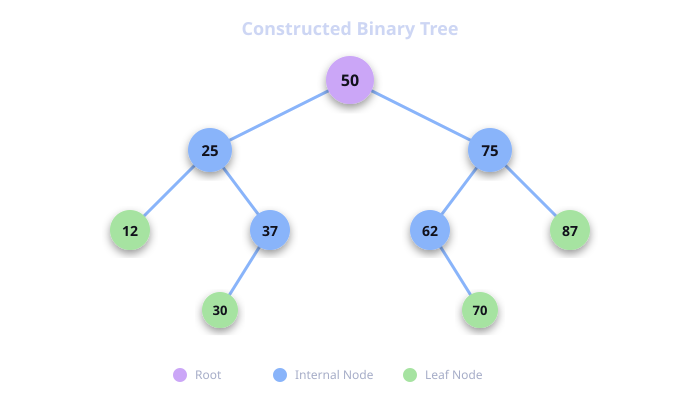
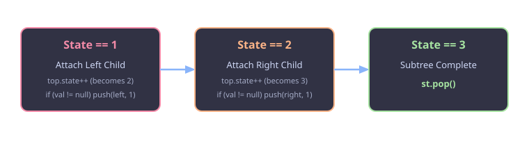
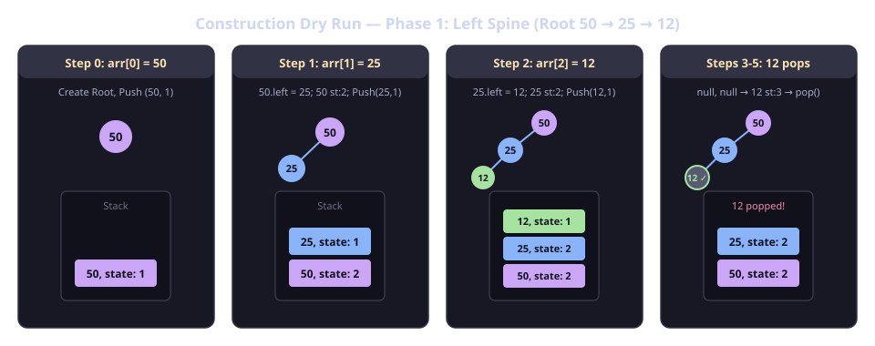
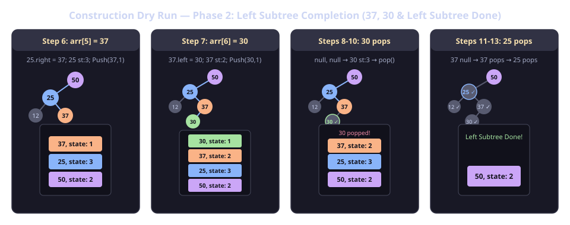
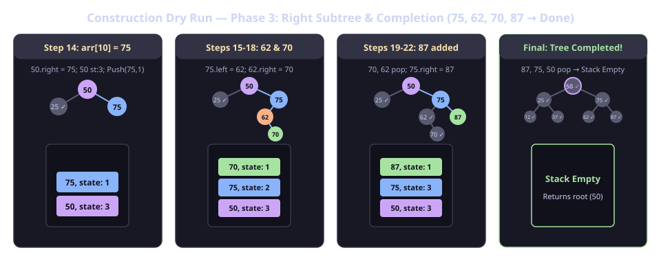
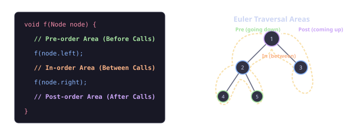

# Binary Tree: Construction and Display


## 1. Introduction to Binary Tree

A **Binary Tree** is a hierarchical data structure in which each node has **at most two children**, referred to as the **left child** and the **right child**.

### Comparison: Generic Tree vs. Binary Tree

| Feature | Generic Tree | Binary Tree |
| :--- | :--- | :--- |
| **Max Children** | Unrestricted ($0, 1, 2, \dots, k$) | At most $2$ ($0, 1,$ or $2$) |
| **Child Storage** | `ArrayList<Node> children` | Explicit pointers: `Node left`, `Node right` |
| **Traversal Areas** | Pre-order & Post-order (loop over children) | Pre-order, In-order, and Post-order |

```java
// Binary Tree Node Class Definition
public static class Node {
    int data;
    Node left;
    Node right;

    Node(int data, Node left, Node right) {
        this.data = data;
        this.left = left;
        this.right = right;
    }
}
```

---

## 2. Problem Statement: Construct & Display Binary Tree

### Goal:
1. **Construct** a Binary Tree from a given preorder traversal array containing `null` values representing absent children.
2. **Display** the constructed binary tree node-by-node in the specified format:
   $$\text{<left\_child>} \leftarrow \text{<node>} \rightarrow \text{<right\_child>}$$
   *(If a child is absent, print `.`)*

### Example Input Array:
```java
Integer[] arr = {
    50, 25, 12, null, null, 37, 30, null, null, null, 
    75, 62, null, 70, null, null, 87, null, null
};
```

### Corresponding Binary Tree:



---

## 3. Tree Construction Algorithm (State-Based Stack Approach)

In Generic Trees, we only needed to track `Node` in the stack because a `null` (or `-1`) directly meant "done with current node's children".
In Binary Trees, each node has two designated slots: **Left** and **Right**. To distinguish whether we are setting the left child or the right child, we associate a **`state`** with each node using a helper `Pair` class.

### The `Pair` Class:
```java
public static class Pair {
    Node node;
    int state;

    Pair(Node node, int state) {
        this.node = node;
        this.state = state;
    }
}
```

### State Lifecycle:



### Algorithm Steps:
1. Create `root = new Node(arr[0], null, null)`.
2. Push `new Pair(root, 1)` onto the stack.
3. Initialize array index `idx = 1`.
4. While `stack.size() > 0`:
   - Inspect `top = stack.peek()`.
   - **Case 1 (`top.state == 1`):**
     - Increment `top.state++` (now it expects right child on next visit).
     - If `arr[idx] != null`:
       - Create `leftNode = new Node(arr[idx], null, null)`.
       - Connect `top.node.left = leftNode`.
       - Push `new Pair(leftNode, 1)` onto the stack.
     - Else (`arr[idx] == null`):
       - `top.node.left = null`.
     - Increment `idx++`.
   - **Case 2 (`top.state == 2`):**
     - Increment `top.state++` (now ready to pop on next visit).
     - If `arr[idx] != null`:
       - Create `rightNode = new Node(arr[idx], null, null)`.
       - Connect `top.node.right = rightNode`.
       - Push `new Pair(rightNode, 1)` onto the stack.
     - Else (`arr[idx] == null`):
       - `top.node.right = null`.
     - Increment `idx++`.
   - **Case 3 (`top.state == 3`):**
     - Both left and right subtrees of `top.node` are completely constructed.
     - Pop `stack.pop()`. *(Notice: `idx` is NOT incremented here because no array element was consumed).*

---

### Step-by-Step Construction Dry Run:

```java
Integer[] arr = {
    50, 25, 12, null, null, 37, 30, null, null, null, 
    75, 62, null, 70, null, null, 87, null, null
};
```

| Step | Current Array Element (`arr[idx]`) | Stack Top Node | Stack Top State | Action Taken | Stack After Action (Top $\rightarrow$ Bottom) |
| :---: | :---: | :---: | :---: | :--- | :--- |
| **0** | `arr[0] = 50` | — | — | Create Root `50`, Push `(50, 1)`, `idx = 1` | `(50, 1)` |
| **1** | `arr[1] = 25` | `50` | `1` | `50.left = 25`, state $\to 2$, Push `(25, 1)`, `idx = 2` | `(25, 1)`, `(50, 2)` |
| **2** | `arr[2] = 12` | `25` | `1` | `25.left = 12`, state $\to 2$, Push `(12, 1)`, `idx = 3` | `(12, 1)`, `(25, 2)`, `(50, 2)` |
| **3** | `arr[3] = null` | `12` | `1` | `12.left = null`, state $\to 2$, `idx = 4` | `(12, 2)`, `(25, 2)`, `(50, 2)` |
| **4** | `arr[4] = null` | `12` | `2` | `12.right = null`, state $\to 3$, `idx = 5` | `(12, 3)`, `(25, 2)`, `(50, 2)` |
| **5** | — | `12` | `3` | `pop()`, stack pops `12` (no index advance) | `(25, 2)`, `(50, 2)` |
| **6** | `arr[5] = 37` | `25` | `2` | `25.right = 37`, state $\to 3$, Push `(37, 1)`, `idx = 6` | `(37, 1)`, `(25, 3)`, `(50, 2)` |
| **7** | `arr[6] = 30` | `37` | `1` | `37.left = 30`, state $\to 2$, Push `(30, 1)`, `idx = 7` | `(30, 1)`, `(37, 2)`, `(25, 3)`, `(50, 2)` |
| **8** | `arr[7] = null` | `30` | `1` | `30.left = null`, state $\to 2$, `idx = 8` | `(30, 2)`, `(37, 2)`, `(25, 3)`, `(50, 2)` |
| **9** | `arr[8] = null` | `30` | `2` | `30.right = null`, state $\to 3$, `idx = 9` | `(30, 3)`, `(37, 2)`, `(25, 3)`, `(50, 2)` |
| **10** | — | `30` | `3` | `pop()`, stack pops `30` | `(37, 2)`, `(25, 3)`, `(50, 2)` |
| **11** | `arr[9] = null` | `37` | `2` | `37.right = null`, state $\to 3$, `idx = 10` | `(37, 3)`, `(25, 3)`, `(50, 2)` |
| **12** | — | `37` | `3` | `pop()`, stack pops `37` | `(25, 3)`, `(50, 2)` |
| **13** | — | `25` | `3` | `pop()`, stack pops `25` | `(50, 2)` |
| **14** | `arr[10] = 75` | `50` | `2` | `50.right = 75`, state $\to 3$, Push `(75, 1)`, `idx = 11` | `(75, 1)`, `(50, 3)` |
| ... | *(Right subtree 75, 62, 70, 87 built identically)* | ... | ... | ... | ... |
| **Final**| — | `50` | `3` | `pop()`, stack empty $\rightarrow$ Construction Complete! | `[Empty]` |

#### Visual Tree & Stack Progression:

```java
Integer[] arr = {
    50, 25, 12, null, null, 37, 30, null, null, null, 
    75, 62, null, 70, null, null, 87, null, null
};
```

**Phase 1: Left Spine (Root 50 $\rightarrow$ 25 $\rightarrow$ 12, popping 12)**


**Phase 2: Left Subtree Completion (Attaching 37, 30 $\rightarrow$ Completing Left Subtree)**


**Phase 3: Right Subtree & Completion (Attaching 75, 62, 70, 87 $\rightarrow$ Full Tree Built)**


---

## 4. Tree Display Algorithm & Traversal Areas

### Traversal Areas in a Binary Tree Function:



### Why Do We Need the Base Case `if (node == null) return;`?
When `display(12)` runs, it tries to call `display(12.left)` where `12.left == null`.
If we invoke `display(null)` without a base case:
- Accessing `node.data` will throw a **`NullPointerException`**.
- Adding `if (node == null) return;` at the beginning gracefully handles calls on `null` children.

### Crucial Java Syntax Tip (Ternary Operator Type Consistency):
```java
// Correct: Both sides of ':' evaluate to String
String lcstr = node.left == null ? "." : node.left.data + "";
String rcstr = node.right == null ? "." : node.right.data + "";
```
> **Note:** If we write `node.left == null ? "." : node.left.data;`, the compiler may complain about type incompatibility (mixing `String` and `int`), so appending `+ ""` converts the integer to `String`.

---

## 5. Complete Java Code

```java
import java.io.*;
import java.util.*;

public class Main {
    // Node class definition
    public static class Node {
        int data;
        Node left;
        Node right;

        Node(int data, Node left, Node right) {
            this.data = data;
            this.left = left;
            this.right = right;
        }
    }

    // Pair helper class for construction state tracking
    public static class Pair {
        Node node;
        int state;

        Pair(Node node, int state) {
            this.node = node;
            this.state = state;
        }
    }

    // Function to construct Binary Tree from array
    public static Node construct(Integer[] arr) {
        if (arr == null || arr.length == 0 || arr[0] == null) {
            return null;
        }

        Node root = new Node(arr[0], null, null);
        Pair rootPair = new Pair(root, 1);

        Stack<Pair> st = new Stack<>();
        st.push(rootPair);

        int idx = 1;
        while (st.size() > 0) {
            Pair top = st.peek();

            if (top.state == 1) {
                // State 1: Attach Left Child
                top.state++;
                if (arr[idx] != null) {
                    Node leftNode = new Node(arr[idx], null, null);
                    top.node.left = leftNode;

                    Pair lp = new Pair(leftNode, 1);
                    st.push(lp);
                } else {
                    top.node.left = null;
                }
                idx++;
            } else if (top.state == 2) {
                // State 2: Attach Right Child
                top.state++;
                if (arr[idx] != null) {
                    Node rightNode = new Node(arr[idx], null, null);
                    top.node.right = rightNode;

                    Pair rp = new Pair(rightNode, 1);
                    st.push(rp);
                } else {
                    top.node.right = null;
                }
                idx++;
            } else {
                // State 3: Both children processed, pop
                st.pop();
            }
        }

        return root;
    }

    // Function to display the Binary Tree
    public static void display(Node node) {
        // Base Case
        if (node == null) {
            return;
        }

        // Node format: <left_child> <- <node> -> <right_child>
        String str = " <- " + node.data + " -> ";
        String lcstr = node.left == null ? "." : node.left.data + "";
        String rcstr = node.right == null ? "." : node.right.data + "";
        System.out.println(lcstr + str + rcstr);

        // Recursive Calls (Pre-order traversal)
        display(node.left);  // will print entire left subtree
        display(node.right); // will print entire right subtree
    }

    public static void main(String[] args) throws Exception {
        // BufferedReader for fast I/O
        BufferedReader br = new BufferedReader(new InputStreamReader(System.in));
        int n = Integer.parseInt(br.readLine());
        Integer[] arr = new Integer[n];
        String[] values = br.readLine().split(" ");

        for (int i = 0; i < n; i++) {
            if (values[i].equals("n") == false) {
                arr[i] = Integer.parseInt(values[i]);
            } else {
                arr[i] = null;
            }
        }

        Node root = construct(arr);
        display(root);
    }
}
```

---

## 6. Expected Output for the Example Tree

For input tree with root `50`:
```text
25 <- 50 -> 75
12 <- 25 -> 37
. <- 12 -> .
30 <- 37 -> .
. <- 30 -> .
62 <- 75 -> 87
. <- 62 -> 70
. <- 70 -> .
. <- 87 -> .
```

### Complexity Analysis:
- **Time Complexity:**
  - **Construction:** $O(N)$ — Each element in the array is processed a constant number of times (at most 3 visits per node corresponding to states 1, 2, and 3).
  - **Display:** $O(N)$ — Each node in the tree is visited once.
- **Space Complexity:**
  - **Stack during Construction:** $O(H)$ where $H$ is the height of the tree ($O(\log N)$ best/average case, $O(N)$ worst case for skewed trees).
  - **Recursion Stack during Display:** $O(H)$.
