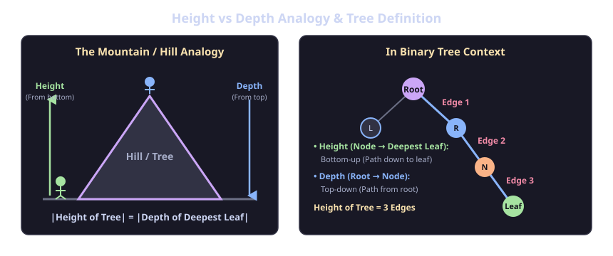
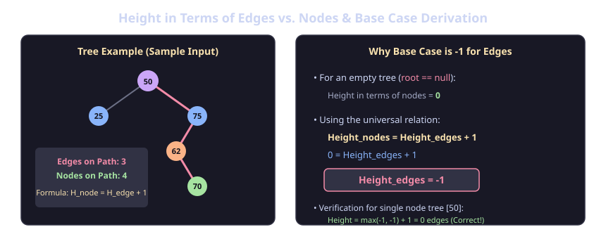

# Binary Tree: Size, Sum, Max, Height & Height Definition

## 1. Core Binary Tree Metrics

Given a Binary Tree, the four fundamental operations are:
1. **Size**: Total number of nodes in the tree.
2. **Sum**: Sum of values of all nodes in the tree.
3. **Max**: Maximum value present in the tree.
4. **Height**: The length of the longest path from root to leaf (commonly measured in edges).

---

## 2. Height vs. Depth

### The Mountain Analogy:
- A person standing at the bottom looking up at a mountain measures its **Height** (bottom-up perspective).
- A person standing at the top looking down into a valley measures its **Depth** (top-down perspective).
- In absolute magnitude:
  $$|\text{Height of Tree}| = |\text{Depth of Deepest Leaf}|$$



### Definitions in Binary Tree:
- **Height of a Node**: The number of edges on the longest path from that node down to a leaf node.
- **Depth of a Node**: The number of edges on the path from the root node to that node.
- **Height of Tree**: Height of the root node (i.e., path from root to deepest leaf).

---

## 3. Height Definition: Edges vs. Nodes & Base Case Derivation



### The Two Conventions:
1. **In terms of Edges (Standard/Default)**:
   - Measures the number of links/edges on the longest path.
   - A single-node tree has **`height = 0`**.
   - An empty tree (`null`) has **`height = -1`**.

2. **In terms of Nodes**:
   - Measures the count of nodes on the longest path.
   - A single-node tree has **`height = 1`**.
   - An empty tree (`null`) has **`height = 0`**.

### Formula:
$$\text{Height}_{\text{nodes}} = \text{Height}_{\text{edges}} + 1$$

### Mathematical Derivation of Base Case:
When `root == null`:
$$\text{Height}_{\text{nodes}}(\text{null}) = 0$$
$$\implies 0 = \text{Height}_{\text{edges}}(\text{null}) + 1$$
$$\implies \mathbf{\text{Height}_{\text{edges}}(\text{null}) = -1}$$

> **Key Rule**:
> - If the question asks for height in terms of **Edges** $\rightarrow$ Base Case returns **`-1`**.
> - If the question asks for height in terms of **Nodes** $\rightarrow$ Base Case returns **`0`**.

---

## 4. Critical Pitfall: Base Case for `max()` and `min()`

> [!WARNING]
> **Never use `0` as the base case for `max()` or `min()`.**
> If a tree contains only negative numbers (e.g., `[-10, -20, -5]`), a base case returning `0` will incorrectly return `0` instead of `-5`.

- **For `max(Node node)`**: Base case must return **`Integer.MIN_VALUE`** (or `-(int)1e9` / `-infinity`).
- **For `min(Node node)`**: Base case must return **`Integer.MAX_VALUE`** (or `(int)1e9` / `+infinity`).

---

## 5. Implementation

### Java Implementation

```java
public class BinaryTreeBasics {
    public static class Node {
        int data;
        Node left;
        Node right;

        Node(int data, Node left, Node right) {
            this.data = data;
            this.left = left;
            this.right = right;
        }
    }

    // 1. Size (Number of nodes)
    public static int size(Node node) {
        if (node == null) return 0;

        int l_size = size(node.left);
        int r_size = size(node.right);
        return l_size + r_size + 1;
    }

    // 2. Sum of all node values
    public static int sum(Node node) {
        if (node == null) return 0;

        int l_sum = sum(node.left);
        int r_sum = sum(node.right);
        return l_sum + r_sum + node.data;
    }

    // 3. Maximum value in tree (handles all-negative values correctly)
    public static int max(Node node) {
        if (node == null) return Integer.MIN_VALUE;

        int l_mx = max(node.left);
        int r_mx = max(node.right);
        return Math.max(node.data, Math.max(l_mx, r_mx));
    }

    // 4. Minimum value in tree
    public static int min(Node node) {
        if (node == null) return Integer.MAX_VALUE;

        int l_mn = min(node.left);
        int r_mn = min(node.right);
        return Math.min(node.data, Math.min(l_mn, r_mn));
    }

    // 5. Height of tree (in terms of edges)
    public static int height(Node node) {
        if (node == null) return -1; // -1 for edges, 0 for nodes

        int l_ht = height(node.left);
        int r_ht = height(node.right);
        return Math.max(l_ht, r_ht) + 1;
    }

    // 6. Find a value in tree
    public static boolean find(Node node, int data) {
        if (node == null) return false;
        if (node.data == data) return true;

        return find(node.left, data) || find(node.right, data);
    }
}
```

### C++ Full Implementation

```cpp
#include <iostream>
#include <algorithm>
#include <climits>
using namespace std;

// TreeNode Definition
struct TreeNode {
    int val;
    TreeNode *left;
    TreeNode *right;
    TreeNode(int x) : val(x), left(nullptr), right(nullptr) {}
    TreeNode(int x, TreeNode *left, TreeNode *right) : val(x), left(left), right(right) {}
};

// 1. Size (Number of nodes)
int size(TreeNode *root) {
    if (root == nullptr) return 0;
    
    int l_size = size(root->left);
    int r_size = size(root->right);
    return l_size + r_size + 1;
}

// 2. Sum of all node values
int sum(TreeNode *root) {
    if (root == nullptr) return 0;
    
    int l_sum = sum(root->left);
    int r_sum = sum(root->right);
    return l_sum + r_sum + root->val;
}

// 3. Maximum value in tree (handles negative numbers)
int maximum(TreeNode *root) {
    if (root == nullptr) return INT_MIN; // or -(int)1e9
    
    int l_max = maximum(root->left);
    int r_max = maximum(root->right);
    return max(root->val, max(l_max, r_max));
}

// 4. Minimum value in tree
int minimum(TreeNode *root) {
    if (root == nullptr) return INT_MAX; // or (int)1e9
    
    int l_min = minimum(root->left);
    int r_min = minimum(root->right);
    return min(root->val, min(l_min, r_min));
}

// 5. Height of tree (in terms of edges: -1 base case; in nodes: 0 base case)
int height(TreeNode *root) {
    if (root == nullptr) return -1; // -1 for edges, 0 for nodes
    
    int l_ht = height(root->left);
    int r_ht = height(root->right);
    return max(l_ht, r_ht) + 1;
}

// 6. Find a value in tree
bool find(TreeNode *root, int data) {
    if (root == nullptr) return false;
    if (root->val == data) return true;
    
    return find(root->left, data) || find(root->right, data);
}
```

### Compact / One-Liner Expressions (C++)

```cpp
// Compact Recursive Forms
int sizeCompact(TreeNode *root) {
    return root == nullptr ? 0 : sizeCompact(root->left) + sizeCompact(root->right) + 1;
}

int sumCompact(TreeNode *root) {
    return root == nullptr ? 0 : sumCompact(root->left) + sumCompact(root->right) + root->val;
}

int heightCompact(TreeNode *root) {
    return root == nullptr ? -1 : max(heightCompact(root->left), heightCompact(root->right)) + 1;
}

int maximumCompact(TreeNode *root) {
    return root == nullptr ? INT_MIN : max(root->val, max(maximumCompact(root->left), maximumCompact(root->right)));
}

int minimumCompact(TreeNode *root) {
    return root == nullptr ? INT_MAX : min(root->val, min(minimumCompact(root->left), minimumCompact(root->right)));
}

bool findCompact(TreeNode *root, int data) {
    return root == nullptr ? false : (root->val == data || findCompact(root->left, data) || findCompact(root->right, data));
}
```

---

## 6. Summary Table & Complexity

| Operation | Base Case (Empty Tree / `null`) | Recursive Step | Time Complexity | Space Complexity |
| :--- | :---: | :--- | :---: | :---: |
| **`size`** | `0` | $L + R + 1$ | $O(N)$ | $O(H)$ |
| **`sum`** | `0` | $L + R + \text{data}$ | $O(N)$ | $O(H)$ |
| **`max`** | `Integer.MIN_VALUE` | $\max(\text{data}, \max(L, R))$ | $O(N)$ | $O(H)$ |
| **`min`** | `Integer.MAX_VALUE` | $\min(\text{data}, \min(L, R))$ | $O(N)$ | $O(H)$ |
| **`height (edges)`** | `-1` | $\max(L, R) + 1$ | $O(N)$ | $O(H)$ |
| **`height (nodes)`** | `0` | $\max(L, R) + 1$ | $O(N)$ | $O(H)$ |
| **`find`** | `false` | $\text{curr} == \text{target} \parallel L \parallel R$ | $O(N)$ | $O(H)$ |

> **Note on Space Complexity**: $O(H)$ is the recursion call stack space, where $H$ is tree height ($O(\log N)$ for balanced trees, $O(N)$ for skewed trees).
