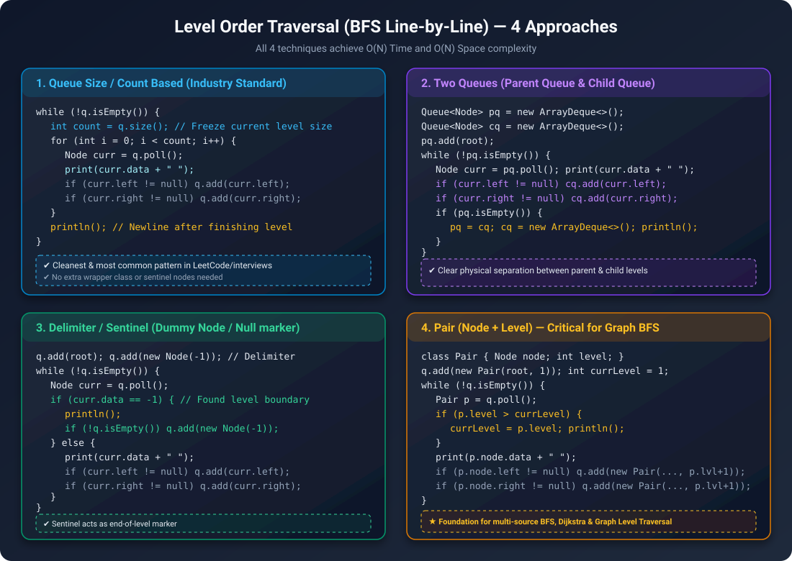
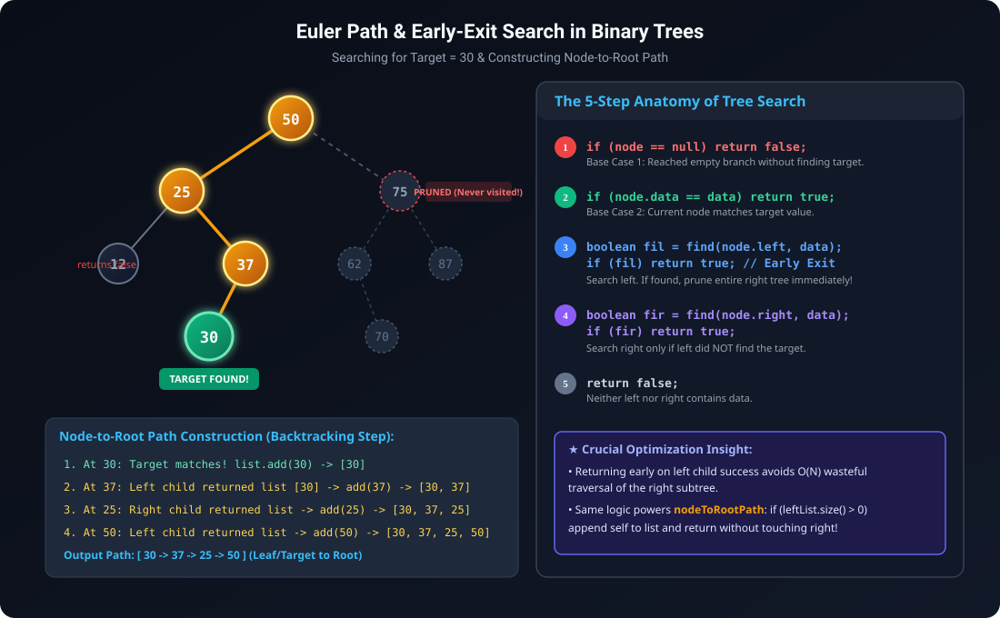
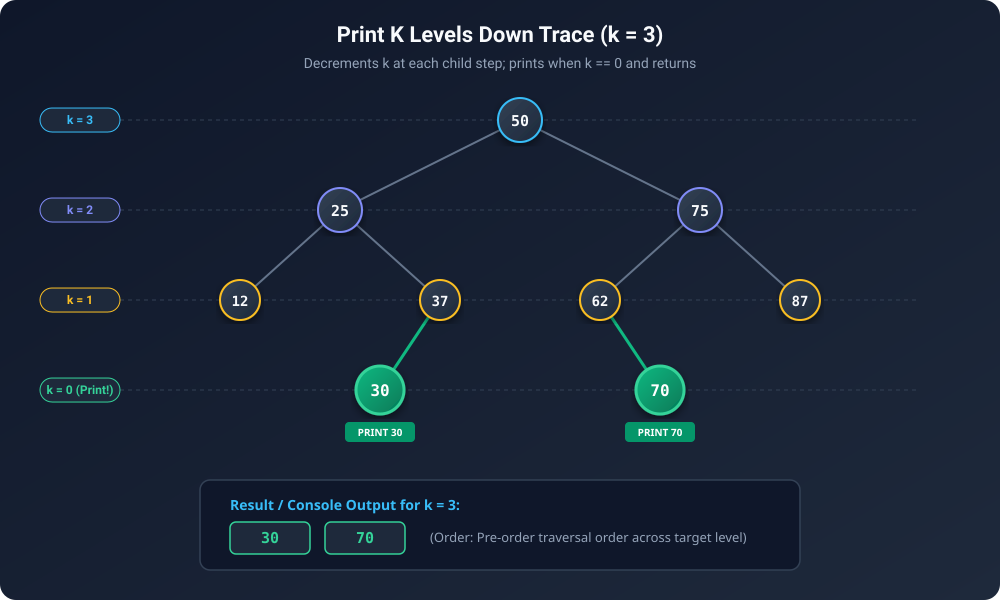
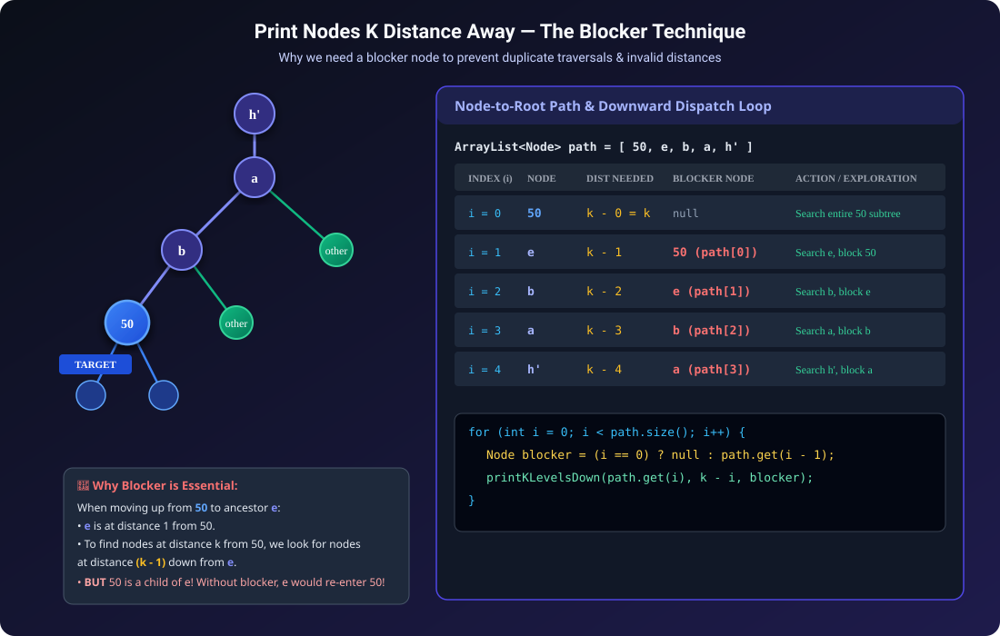
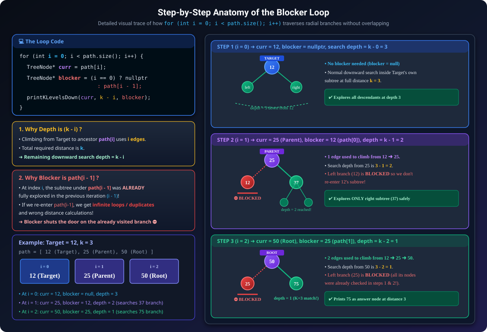
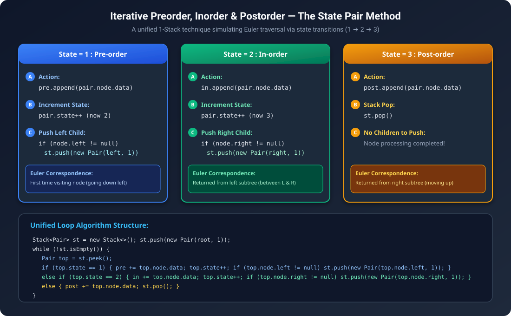

# Binary Tree Traversals & Essential Search Problems


## 1. Core Principles: Generic Trees vs Binary Trees

When transitioning from Generic Trees (n-ary trees) to Binary Trees, fundamental structural differences change how recursion and base cases are structured:

| Dimension | Generic Trees | Binary Trees |
| :--- | :--- | :--- |
| **Child References** | List of children `ArrayList<Node> children` | Exactly two pointers: `left` and `right` |
| **Base Case Strategy** | Implicit via loop (`for (Node child : node.children)`) | **Explicit `null` check** (`if (node == null) return ...`) |
| **Traversals** | Pre-order, Post-order, Level-order | **Pre-order, In-order, Post-order, Level-order** |
| **Base Case for Aggregations** | Often not hit if children loop handles leaves | `max()` returns `-∞` (`Integer.MIN_VALUE`), `size()` returns `0`, `sum()` returns `0` |
| **Height Convention** | Nodes count: BC returns `0`<br>Edges count: BC returns `-1` | Nodes count: BC returns `0`<br>Edges count: BC returns `-1` |

> [!IMPORTANT]
> **Base Case Rule for Max Function**: In binary trees, `max()` of an empty tree (`node == null`) must return `-∞` (`Integer.MIN_VALUE` / `INT_MIN`), **NOT `0`**, to safely support trees with negative node values.

---

## 2. Level Order Traversal (BFS Line-by-Line) — 4 Approaches

Level order traversal processes nodes layer by layer from top to bottom, left to right. To print output with each level on a separate line (or group nodes by level into `vector<vector<int>>`), there are **4 classic design patterns**.



---

### Approach 1: Queue Size / Count Based (Industry Standard)

* **Intuition**: At the start of each level, `q.size()` tells us exactly how many nodes belong to the current level. We loop `count` times, popping elements and pushing their children. All newly pushed children will belong to the *next* level and won't interfere with the current iteration.

```java
// Java: Size-Based Level Order Traversal
public static void levelOrderSize(Node root) {
    if (root == null) return;
    Queue<Node> q = new ArrayDeque<>();
    q.add(root);

    while (!q.isEmpty()) {
        int count = q.size(); // Freeze current level size
        for (int i = 0; i < count; i++) {
            Node curr = q.poll();
            System.out.print(curr.data + " ");
            if (curr.left != null) q.add(curr.left);
            if (curr.right != null) q.add(curr.right);
        }
        System.out.println(); // Finished level
    }
}
```

```cpp
// C++: Size-Based Level Order Traversal
void levelOrderSize(TreeNode* root) {
    if (root == nullptr) return;
    queue<TreeNode*> q;
    q.push(root);

    while (!q.empty()) {
        int sz = q.size();
        for (int i = 0; i < sz; i++) {
            TreeNode* curr = q.front();
            q.pop();
            cout << curr->data << " ";
            if (curr->left != nullptr) q.push(curr->left);
            if (curr->right != nullptr) q.push(curr->right);
        }
        cout << "\n";
    }
}
```

---

### Approach 2: Two Queues (Parent Queue & Child Queue)

* **Intuition**: Maintain two explicit queues: `parentQueue` (`pq`) and `childQueue` (`cq`).
  1. Pop nodes from `pq`, print them, and push their children into `cq`.
  2. When `pq` becomes empty, print newline, swap `pq = cq`, and reset `cq = new Queue()`.

```java
// Java: Two-Queue Level Order Traversal
public static void levelOrderTwoQueues(Node root) {
    if (root == null) return;
    Queue<Node> pq = new ArrayDeque<>();
    Queue<Node> cq = new ArrayDeque<>();
    pq.add(root);

    while (!pq.isEmpty()) {
        Node curr = pq.poll();
        System.out.print(curr.data + " ");

        if (curr.left != null) cq.add(curr.left);
        if (curr.right != null) cq.add(curr.right);

        if (pq.isEmpty()) {
            System.out.println();
            pq = cq;
            cq = new ArrayDeque<>();
        }
    }
}
```

```cpp
// C++: Two-Queue Level Order Traversal
void levelOrderTwoQueues(TreeNode* root) {
    if (root == nullptr) return;
    queue<TreeNode*> pq, cq;
    pq.push(root);

    while (!pq.empty()) {
        TreeNode* curr = pq.front();
        pq.pop();
        cout << curr->data << " ";

        if (curr->left != nullptr) cq.push(curr->left);
        if (curr->right != nullptr) cq.push(curr->right);

        if (pq.empty()) {
            cout << "\n";
            pq = cq;
            while (!cq.empty()) cq.pop();
        }
    }
}
```

---

### Approach 3: Delimiter / Sentinel Node Method

* **Intuition**: Insert a sentinel dummy node (e.g., `Node(-1)` or `null`) into the queue at the end of every level.
  1. When a normal node is popped: print it and enqueue its children.
  2. When the delimiter is popped: print a newline. If the queue is not empty, re-enqueue the delimiter for the next level.

```java
// Java: Delimiter-Based Level Order Traversal
public static void levelOrderDelimiter(Node root) {
    if (root == null) return;
    Queue<Node> q = new ArrayDeque<>();
    q.add(root);
    q.add(new Node(-1)); // Sentinel marker

    while (!q.isEmpty()) {
        Node curr = q.poll();
        if (curr.data == -1) {
            System.out.println();
            if (!q.isEmpty()) {
                q.add(new Node(-1)); // Add delimiter for next level
            }
        } else {
            System.out.print(curr.data + " ");
            if (curr.left != null) q.add(curr.left);
            if (curr.right != null) q.add(curr.right);
        }
    }
}
```

```cpp
// C++: Delimiter-Based Level Order Traversal
void levelOrderDelimiter(TreeNode* root) {
    if (root == nullptr) return;
    queue<TreeNode*> q;
    TreeNode* delimiter = new TreeNode(-1);
    q.push(root);
    q.push(delimiter);

    while (!q.empty()) {
        TreeNode* curr = q.front();
        q.pop();

        if (curr == delimiter) {
            cout << "\n";
            if (!q.empty()) {
                q.push(delimiter);
            }
        } else {
            cout << curr->data << " ";
            if (curr->left != nullptr) q.push(curr->left);
            if (curr->right != nullptr) q.push(curr->right);
        }
    }
    delete delimiter;
}
```

---

### Approach 4: Pair / Level-Tracking Method

* **Intuition**: Wrap each node with its depth/level: `Pair(Node, level)`. Maintain a `currentLevel = 1`. When `pair.level > currentLevel`, print a newline and update `currentLevel = pair.level`.
* **Graph Relevance**: This exact pattern generalizes to **Multi-Source BFS, Shortest Path in Unweighted Graphs, and Word Ladder problems**.

```java
// Java: Pair/Level-Based Level Order Traversal
static class LevelPair {
    Node node;
    int level;
    LevelPair(Node node, int level) {
        this.node = node;
        this.level = level;
    }
}

public static void levelOrderPair(Node root) {
    if (root == null) return;
    Queue<LevelPair> q = new ArrayDeque<>();
    q.add(new LevelPair(root, 1));
    int currentLevel = 1;

    while (!q.isEmpty()) {
        LevelPair curr = q.poll();
        if (curr.level > currentLevel) {
            currentLevel = curr.level;
            System.out.println();
        }
        System.out.print(curr.node.data + " ");
        if (curr.node.left != null) q.add(new LevelPair(curr.node.left, curr.level + 1));
        if (curr.node.right != null) q.add(new LevelPair(curr.node.right, curr.level + 1));
    }
    System.out.println();
}
```

```cpp
// C++: Pair/Level-Based Level Order Traversal
struct LevelPair {
    TreeNode* node;
    int level;
    LevelPair(TreeNode* n, int lvl) : node(n), level(lvl) {}
};

void levelOrderPair(TreeNode* root) {
    if (root == nullptr) return;
    queue<LevelPair> q;
    q.push(LevelPair(root, 1));
    int currentLevel = 1;

    while (!q.empty()) {
        LevelPair curr = q.front();
        q.pop();

        if (curr.level > currentLevel) {
            currentLevel = curr.level;
            cout << "\n";
        }
        cout << curr.node->data << " ";
        if (curr.node->left != nullptr) q.push(LevelPair(curr.node->left, curr.level + 1));
        if (curr.node->right != nullptr) q.push(LevelPair(curr.node->right, curr.level + 1));
    }
    cout << "\n";
}
```

---

### Complexity Comparison

| Approach | Time Complexity | Space Complexity | Best Use Case |
| :--- | :--- | :--- | :--- |
| **1. Size-Based** | $O(N)$ | $O(N)$ (Max Level Width) | Cleanest standard for interview coding & LeetCode format |
| **2. Two Queues** | $O(N)$ | $O(N)$ | Physical level separation; alternating zig-zag traversals |
| **3. Delimiter** | $O(N)$ | $O(N)$ | Streaming scenarios / boundary detection |
| **4. Pair-Based** | $O(N)$ | $O(N)$ | Crucial foundational pattern for Graph BFS & distance tracking |

---

## 3. Searching in Binary Tree: `find(node, data)`

Searching in a general Binary Tree (non-BST) requires traversing nodes. We optimize using **Early Exit Pruning**: if the target is found in the left subtree, immediately return `true` without touching the right subtree!



### The 5-Step Anatomy of Tree Search:
1. **Base Case 1 (`node == null`)**: Return `false` (target not found in this branch).
2. **Base Case 2 (`node.data == data`)**: Return `true` (target node located).
3. **Search Left**: `boolean fil = find(node.left, data);` $\to$ `if (fil) return true;`
4. **Search Right**: `boolean fir = find(node.right, data);` $\to$ `if (fir) return true;`
5. **Fallthrough**: Return `false` (neither subtree contains target).

```java
// Java: Find in Binary Tree
public static boolean find(Node node, int data) {
    if (node == null) return false;
    if (node.data == data) return true;

    boolean findInLeft = find(node.left, data);
    if (findInLeft) return true; // Early exit pruning

    boolean findInRight = find(node.right, data);
    if (findInRight) return true; // Early exit pruning

    return false;
}
```

```cpp
// C++: Find in Binary Tree
bool find(TreeNode* node, int data) {
    if (node == nullptr) return false;
    if (node->data == data) return true;

    if (find(node->left, data)) return true;  // Early exit pruning
    if (find(node->right, data)) return true; // Early exit pruning

    return false;
}
```

---

## 4. Node to Root Path: `nodeToRootPath(node, data)`

Finds the path from a given target node back to the root of the tree (e.g. `[30, 37, 25, 50]`).

### Key Idea:
* Returns an empty list if target is not in the subtree.
* When the target node is found, create a list and add itself: `[target]`.
* On the return journey back up the recursion tree, whichever child returns a non-empty list, append the current node to that list and propagate upward.

```java
// Java: Node to Root Path (returning List of Nodes)
public static ArrayList<Node> nodeToRootPath(Node node, int data) {
    if (node == null) {
        return new ArrayList<>();
    }
    if (node.data == data) {
        ArrayList<Node> path = new ArrayList<>();
        path.add(node);
        return path;
    }

    ArrayList<Node> leftPath = nodeToRootPath(node.left, data);
    if (leftPath.size() > 0) {
        leftPath.add(node);
        return leftPath;
    }

    ArrayList<Node> rightPath = nodeToRootPath(node.right, data);
    if (rightPath.size() > 0) {
        rightPath.add(node);
        return rightPath;
    }

    return new ArrayList<>();
}
```

```cpp
// C++: Node to Root Path (returning vector of TreeNode*)
vector<TreeNode*> nodeToRootPath(TreeNode* node, int data) {
    if (node == nullptr) return {};
    if (node->data == data) {
        return {node};
    }

    vector<TreeNode*> leftPath = nodeToRootPath(node->left, data);
    if (!leftPath.empty()) {
        leftPath.push_back(node);
        return leftPath;
    }

    vector<TreeNode*> rightPath = nodeToRootPath(node->right, data);
    if (!rightPath.empty()) {
        rightPath.push_back(node);
        return rightPath;
    }

    return {};
}
```

---

## 5. Print K Levels Down: `printKLevelsDown(node, k)`

Prints all nodes that are situated exactly `k` levels below the given node.



### Algorithm & Edge Case Handling:
* **Base Cases**:
  - `if (node == null || k < 0) return;` $\to$ Handles empty tree and negative $k$.
  - `if (k == 0) { print(node.data); return; }` $\to$ Print target level node and do not recurse further!
* **Recursive Calls**: Recurse on `node.left` and `node.right` with distance decremented to `k - 1`.

```java
// Java: Print K Levels Down
public static void printKLevelsDown(Node node, int k) {
    if (node == null || k < 0) return;
    if (k == 0) {
        System.out.println(node.data);
        return;
    }
    printKLevelsDown(node.left, k - 1);
    printKLevelsDown(node.right, k - 1);
}
```

```cpp
// C++: Print K Levels Down
void printKLevelsDown(TreeNode* node, int k) {
    if (node == nullptr || k < 0) return;
    if (k == 0) {
        cout << node->data << "\n";
        return;
    }
    printKLevelsDown(node->left, k - 1);
    printKLevelsDown(node->right, k - 1);
}
```

---

## 6. Print Nodes K Distance Away / K Far (Amazon Favorite)

> Given a binary tree, a target node value, and an integer $K$, print all nodes that are at radial distance $K$ from the target node in any direction (ancestors, descendants, or siblings).



### The Two-Phase Technique & The Blocker Concept:

1. **Phase 1: Find Ancestor Path**
   - Call `nodeToRootPath(root, target)` to get the ancestor chain:
     $$\text{path} = [N_0 (\text{target}), N_1, N_2, \dots, N_m (\text{root})]$$
   - Here $N_i$ is at distance $i$ from the target.

2. **Phase 2: Radial Dispatch with Blocker Node**
   - For each ancestor $N_i$ at index $i$:
     - To reach distance $K$ from target, we need nodes at distance $(K - i)$ below $N_i$.
     - **The Blocker**: When searching below $N_i$, its child $N_{i-1}$ has already been explored in the previous iteration! If we traverse into $N_{i-1}$, we would recount nodes and traverse the wrong branch.
     - Therefore, pass `blocker = (i == 0 ? null : path[i - 1])` to `printKLevelsDown` to halt recursion on that branch immediately.

```java
// Java: Print K Nodes Far Away with Blocker
public static void printKLevelsDown(Node node, int k, Node blocker) {
    if (node == null || k < 0 || node == blocker) {
        return; // Halt if blocked, null, or out of depth
    }
    if (k == 0) {
        System.out.println(node.data);
        return;
    }
    printKLevelsDown(node.left, k - 1, blocker);
    printKLevelsDown(node.right, k - 1, blocker);
}

public static void printKNodesFar(Node root, int data, int k) {
    ArrayList<Node> path = nodeToRootPath(root, data);
    for (int i = 0; i < path.size(); i++) {
        Node curr = path.get(i);
        Node blocker = (i == 0) ? null : path.get(i - 1);
        printKLevelsDown(curr, k - i, blocker);
    }
}
```

```cpp
// C++: Print K Nodes Far Away with Blocker
void printKLevelsDown(TreeNode* node, int k, TreeNode* blocker) {
    if (node == nullptr || k < 0 || node == blocker) {
        return; // Halt if blocked, null, or out of depth
    }
    if (k == 0) {
        cout << node->data << "\n";
        return;
    }
    printKLevelsDown(node->left, k - 1, blocker);
    printKLevelsDown(node->right, k - 1, blocker);
}

void printKNodesFar(TreeNode* root, int data, int k) {
    vector<TreeNode*> path = nodeToRootPath(root, data);
    for (int i = 0; i < (int)path.size(); i++) {
        TreeNode* curr = path[i];
        TreeNode* blocker = (i == 0) ? nullptr : path[i - 1];
        printKLevelsDown(curr, k - i, blocker);
    }
}
```

### Deep-Dive: Dissecting the Dispatch Loop Line-by-Line



Let's dissect each component of the loop:

$$\text{path} = [\text{Target} = N_0,\; N_1,\; N_2,\; \dots,\; N_m = \text{Root}]$$

```cpp
for (int i = 0; i < (int)path.size(); i++) {
    TreeNode* curr = path[i];
    TreeNode* blocker = (i == 0) ? nullptr : path[i - 1];
    printKLevelsDown(curr, k - i, blocker);
}
```

1. **`curr = path[i]` (The Current Pivot Ancestor)**:
   - At index $i$, `curr` represents the ancestor that is situated **$i$ edges above the target node**.
   - For example:
     - $i = 0 \implies \text{curr} = \text{Target}$ (0 edges up).
     - $i = 1 \implies \text{curr} = \text{Parent}$ (1 edge up).
     - $i = 2 \implies \text{curr} = \text{Grandparent}$ (2 edges up).

2. **`k - i` (The Remaining Downward Distance Budget)**:
   - To find nodes at total distance $k$ from the target, after climbing $i$ edges up to `curr`, we have exactly **$k - i$ remaining edges** to travel downwards into the other branches.
   - If $k - i < 0$, the base case `if (k < 0) return;` immediately halts execution.
   - If $k - i == 0$, `curr` itself is at distance $k$ and gets printed immediately.

3. **`blocker = (i == 0) ? nullptr : path[i - 1]` (The Visited Barrier)**:
   - **At $i = 0$**: We are at the target node itself. No subtrees have been searched yet, so `blocker = nullptr` (search the entire subtree under target).
   - **At $i \ge 1$**: We are at ancestor `path[i]`. The child `path[i - 1]` is the exact branch where we just came from and **already completely searched in step $i - 1$**!
   - Setting `blocker = path[i - 1]` tells `printKLevelsDown` to stop recursion if `node == blocker`. This guarantees that:
     - We never re-traverse or duplicate nodes in already visited subtrees.
     - We prevent infinite cycles and wrong distance calculations.
     - The total time complexity remains strictly **$O(N)$**.

### Complexity Analysis:
* **Time Complexity**: $O(N)$. Although we loop over the ancestor path, each node in the tree is visited at most once across all `printKLevelsDown` calls because the blocker isolates disjoint subtrees.
* **Space Complexity**: $O(H)$ for recursion stack and ancestor path storage (where $H$ is the height of the tree).

---

## 7. Iterative Preorder, Inorder & Postorder (State-Based Pair Method)

Simulates the runtime call stack iteratively using a single stack of `Pair(Node, state)`.



### State Transitions:
* **`state == 1` (Pre-Order Point)**:
  - Add `node.data` to Pre-order list.
  - Increment state: `state = 2`.
  - If `node.left != null`, push `Pair(node.left, 1)` onto stack.
* **`state == 2` (In-Order Point)**:
  - Add `node.data` to In-order list.
  - Increment state: `state = 3`.
  - If `node.right != null`, push `Pair(node.right, 1)` onto stack.
* **`state == 3` (Post-Order Point)**:
  - Add `node.data` to Post-order list.
  - Pop pair from stack.

```java
// Java: Iterative Preorder, Inorder & Postorder
static class Pair {
    Node node;
    int state;
    Pair(Node node, int state) {
        this.node = node;
        this.state = state;
    }
}

public static void iterativePreInPostTraversal(Node root) {
    if (root == null) return;
    Stack<Pair> st = new Stack<>();
    st.push(new Pair(root, 1));

    StringBuilder pre = new StringBuilder();
    StringBuilder in = new StringBuilder();
    StringBuilder post = new StringBuilder();

    while (!st.isEmpty()) {
        Pair top = st.peek();
        if (top.state == 1) { // Pre-order
            pre.append(top.node.data).append(" ");
            top.state++;
            if (top.node.left != null) {
                st.push(new Pair(top.node.left, 1));
            }
        } else if (top.state == 2) { // In-order
            in.append(top.node.data).append(" ");
            top.state++;
            if (top.node.right != null) {
                st.push(new Pair(top.node.right, 1));
            }
        } else { // Post-order (state == 3)
            post.append(top.node.data).append(" ");
            st.pop();
        }
    }

    System.out.println("Pre-order  : " + pre.toString());
    System.out.println("In-order   : " + in.toString());
    System.out.println("Post-order : " + post.toString());
}
```

```cpp
// C++: Iterative Preorder, Inorder & Postorder
struct Pair {
    TreeNode* node;
    int state;
    Pair(TreeNode* n, int s) : node(n), state(s) {}
};

void iterativePreInPostTraversal(TreeNode* root) {
    if (root == nullptr) return;
    stack<Pair> st;
    st.push(Pair(root, 1));

    string pre = "", in = "", post = "";

    while (!st.empty()) {
        Pair& top = st.top();
        if (top.state == 1) { // Pre-order
            pre += to_string(top.node->data) + " ";
            top.state++;
            if (top.node->left != nullptr) {
                st.push(Pair(top.node->left, 1));
            }
        } else if (top.state == 2) { // In-order
            in += to_string(top.node->data) + " ";
            top.state++;
            if (top.node->right != nullptr) {
                st.push(Pair(top.node->right, 1));
            }
        } else { // Post-order (state == 3)
            post += to_string(top.node->data) + " ";
            st.pop();
        }
    }

    cout << "Pre-order  : " << pre << "\n";
    cout << "In-order   : " << in << "\n";
    cout << "Post-order : " << post << "\n";
}
```

---

## 8. Summary of Patterns & Mental Models

| Problem | Core Pattern / Data Structure | Time | Space | Key Edge Case |
| :--- | :--- | :--- | :--- | :--- |
| **Level Order (BFS)** | `Queue` (Size-based / Two-Queue / Delimiter / Pair) | $O(N)$ | $O(W)$ | Enqueueing `null` children |
| **Find Node** | Recursive Search + Early Exit Pruning | $O(N)$ | $O(H)$ | Unbalanced degenerate trees |
| **Node to Root Path** | Backtracking List Accumulation | $O(N)$ | $O(H)$ | Target not present in tree |
| **Print K Levels Down** | Depth Decrement (`k - 1`) | $O(N)$ | $O(H)$ | $k < 0$ / negative levels |
| **Print K Nodes Far** | `nodeToRootPath` + `blocker` check | $O(N)$ | $O(H)$ | $k - i < 0$ handled by base case |
| **Iterative Pre/In/Post** | 1-Stack with `Pair(node, state)` | $O(N)$ | $O(H)$ | State transitions 1 $\to$ 2 $\to$ 3 $\to$ pop |
