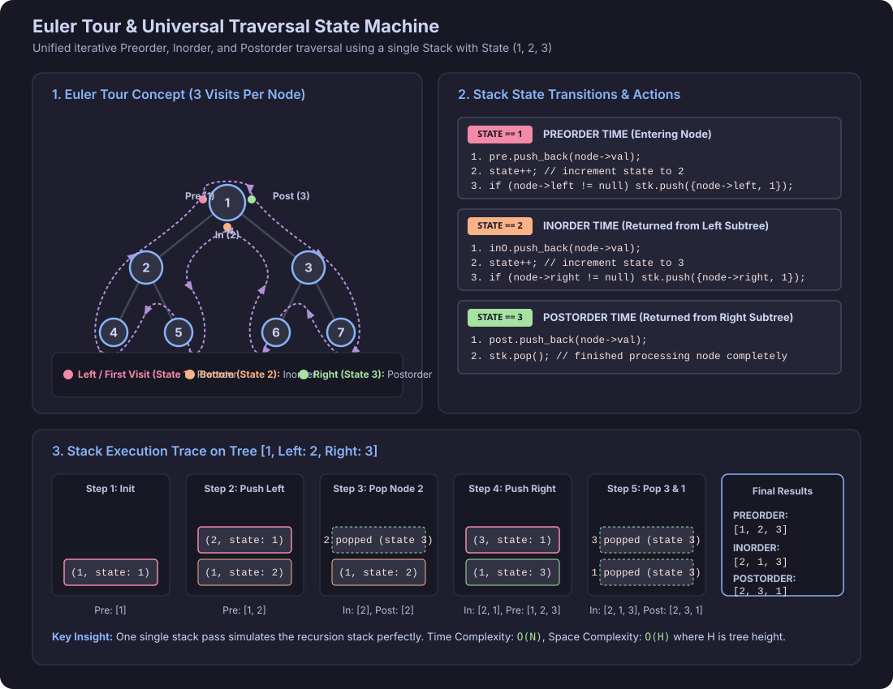
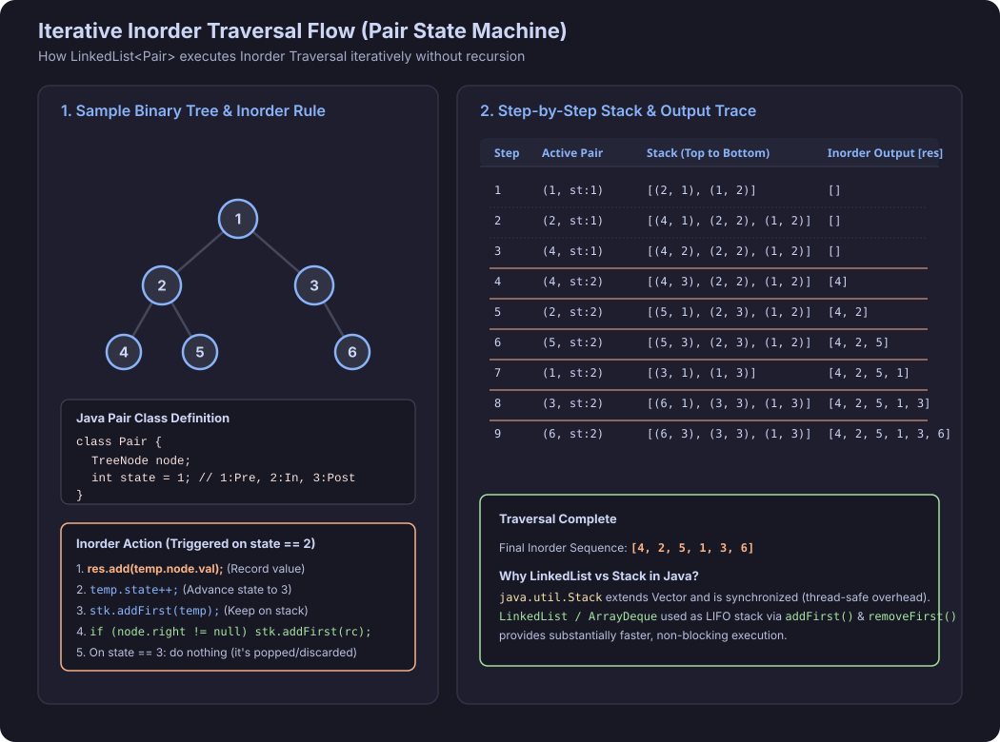
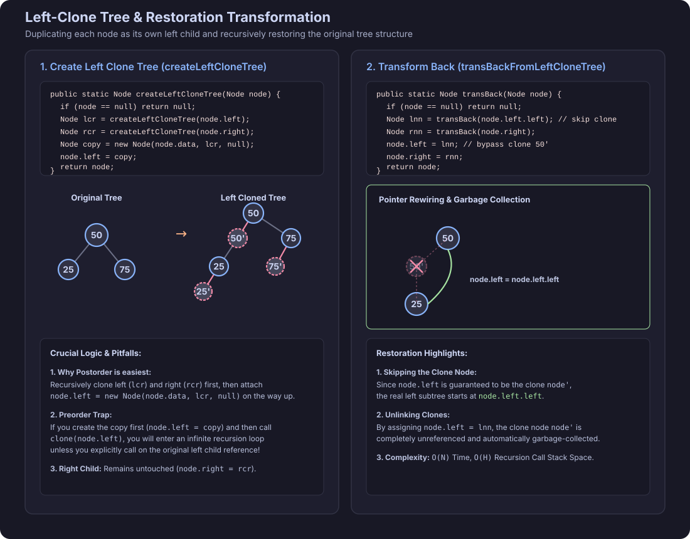
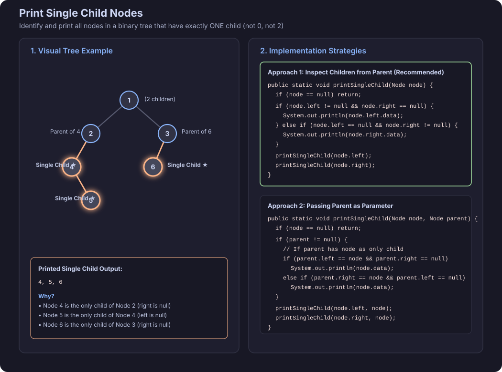
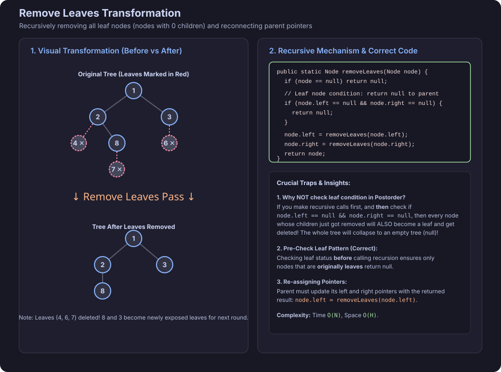
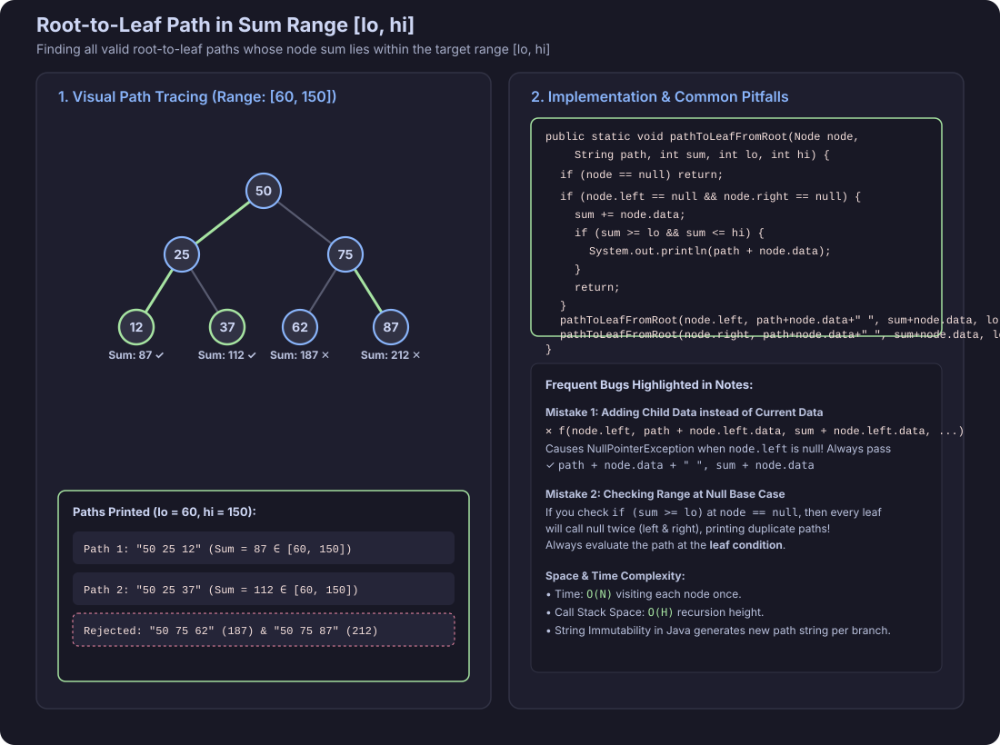

# Traversals Of Binary Tree

## Q1. Binary Tree Preorder Traversal

Given the `root` of a binary tree, return the preorder traversal of its nodes' values (**Root -> Left -> Right**).

### C++ Code
```cpp
class Solution{
	vector<int> res;
	void helper(TreeNode * root){
		if(root==nullptr) return;
		res.push_back(root->data);
		helper(root->left);
		helper(root->right);
	}
	public:
		vector<int> preorder(TreeNode* root){
	        helper(root);
			return res;
		}
};

```

### Java Code
```java
class Solution {
    private List<Integer> res = new ArrayList<>();
    
    private void helper(TreeNode root) {
        if (root == null) return;
        res.add(root.val);
        helper(root.left);
        helper(root.right);
    }
    
    public List<Integer> preorderTraversal(TreeNode root) {
        helper(root);
        return res;
    }
}
```

---

## Q2. Binary Tree Inorder Traversal

Given the `root` of a binary tree, return the inorder traversal of its nodes' values (**Left -> Root -> Right**).

### C++ Code
```cpp


class Solution{
	vector<int> res;
	void helper(TreeNode * root){
		if(root==nullptr) return;
		helper(root->left);
		res.push_back(root->data);
		helper(root->right);
	}
	public:
		vector<int> inorder(TreeNode* root){
	        helper(root);
			return res;
		}
};

```

### Java Code
```java
class Solution {
    private List<Integer> res = new ArrayList<>();
    
    private void helper(TreeNode root) {
        if (root == null) return;
        helper(root.left);
        res.add(root.val);
        helper(root.right);
    }
    
    public List<Integer> inorderTraversal(TreeNode root) {
        helper(root);
        return res;
    }
}
```

---

## Q3. Binary Tree Postorder Traversal

Given the `root` of a binary tree, return the postorder traversal of its nodes' values (**Left -> Right -> Root**).

### C++ Code
```cpp
class Solution{
	vector<int> res;
	void helper(TreeNode * root){
		if(root==nullptr) return;
		helper(root->left);
		helper(root->right);
		res.push_back(root->data);
	}	
	public:
		vector<int> postorder(TreeNode* root){
	        helper(root);
			return res;
		}
};
```

### Java Code
```java
class Solution {
    private List<Integer> res = new ArrayList<>();
    
    private void helper(TreeNode root) {
        if (root == null) return;
        helper(root.left);
        helper(root.right);
        res.add(root.val);
    }
    
    public List<Integer> postorderTraversal(TreeNode root) {
        helper(root);
        return res;
    }
}
```

---

## Q4. Preorder, Inorder, and Postorder Traversal in a Single Iterative Pass (State Machine)

Traverse a binary tree iteratively in a single pass to obtain **Preorder**, **Inorder**, and **Postorder** traversals simultaneously using a stack of pairs `(Node, State)`.



### C++ Code
```cpp
class Solution{
	public:
		vector<vector<int> > treeTraversal(TreeNode* root){
			vector<vector<int> >  res;
			vector<int> pre,inO,post;
        if (root == nullptr) return res;

        stack<pair<TreeNode*, int>> stk;
        stk.push({root, 1});

        while (stk.size()>0) {
            pair<TreeNode*, int> &temp = stk.top();

            if (temp.second == 1) {
				pre.push_back(temp.first->data);
                temp.second++;
                if (temp.first->left != nullptr) {
                    stk.push({temp.first->left, 1});
                }
            } 
            else if (temp.second == 2) {
                temp.second++;
                inO.push_back(temp.first->data);
                
                if (temp.first->right != nullptr) {
                    stk.push({temp.first->right, 1});
                }
            } 
            else {
				post.push_back(temp.first->data);
                stk.pop();
            }
        }
		res.push_back(inO);
		res.push_back(pre);
		res.push_back(post);
        return res;
		}
};

```

### Java Code
```java
public class Solution {
    public static class Pair {
        TreeNode node;
        int state;
        Pair(TreeNode node, int state) {
            this.node = node;
            this.state = state;
        }
    }

    public List<List<Integer>> treeTraversal(TreeNode root) {
        List<List<Integer>> res = new ArrayList<>();
        List<Integer> pre = new ArrayList<>();
        List<Integer> inO = new ArrayList<>();
        List<Integer> post = new ArrayList<>();
        if (root == null) return res;

        LinkedList<Pair> stk = new LinkedList<>();
        stk.addFirst(new Pair(root, 1));

        while (!stk.isEmpty()) {
            Pair top = stk.getFirst();

            if (top.state == 1) {
                pre.add(top.node.val);
                top.state++;
                if (top.node.left != null) {
                    stk.addFirst(new Pair(top.node.left, 1));
                }
            } else if (top.state == 2) {
                inO.add(top.node.val);
                top.state++;
                if (top.node.right != null) {
                    stk.addFirst(new Pair(top.node.right, 1));
                }
            } else {
                post.add(top.node.val);
                stk.removeFirst();
            }
        }

        res.add(inO);
        res.add(pre);
        res.add(post);
        return res;
    }
}
```

---

## Q5. Binary Tree Inorder Traversal (Iterative State Machine)

Given the `root` of a binary tree, return its inorder traversal iteratively using an explicit `Pair(Node, state)` state machine.



### Java Code
```java
public class Pair{
    TreeNode node;
    int state;
    Pair(TreeNode node){
        this.node=node;
        state=1;
    }

}
class Solution {
    public List<Integer> inorderTraversal(TreeNode root) {
        List<Integer>res=new ArrayList<>();
        if(root==null) return res;
        LinkedList<Pair>stk=new LinkedList();
        Pair rp=new Pair(root);
        stk.addFirst(rp);
        while(stk.size()>0){
            Pair temp=stk.removeFirst();
            if(temp.state==1){
                temp.state++;
                stk.addFirst(temp);
                
                if(temp.node.left!=null){
                    Pair lc=new Pair(temp.node.left);
                    stk.addFirst(lc);
                }
                
                
            }
            else if(temp.state==2){
                temp.state++;
                stk.addFirst(temp);
                res.add(temp.node.val);
                if(temp.node.right!=null){
                    Pair rc=new Pair(temp.node.right);
                    stk.addFirst(rc);
                }
                
            }
            else if(temp.state==3){
                continue;
            }
            
        }
        return res;
    }
}

```

### C++ Code
```cpp
class Solution {
public:
    vector<int> inorderTraversal(TreeNode* root) {
        vector<int> res;
        if (root == nullptr) return res;

        stack<pair<TreeNode*, int>> stk;
        stk.push({root, 1});

        while (!stk.empty()) {
            pair<TreeNode*, int>& temp = stk.top();

            if (temp.second == 1) {
                temp.second++;
                if (temp.first->left != nullptr) {
                    stk.push({temp.first->left, 1});
                }
            } else if (temp.second == 2) {
                res.push_back(temp.first->val);
                temp.second++;
                if (temp.first->right != nullptr) {
                    stk.push({temp.first->right, 1});
                }
            } else {
                stk.pop();
            }
        }
        return res;
    }
};
```

---

## Q6. Create Left Clone Tree

Given a binary tree, modify it such that every node is duplicated and inserted as its own left child. The original left child becomes the left child of the newly inserted clone node.

### Problem Explanation & Transformation Rules
For every node $X$ in the binary tree:
1. Create a clone node $X'$ with the identical value ($X'.val = X.val$).
2. Attach $X'$ as the immediate left child of $X$ ($X.left = X'$).
3. The original left child of $X$ becomes the left child of $X'$ ($X'.left = \text{original\_left}$).
4. The right child of $X'$ is always `null` ($X'.right = \text{null}$).
5. The right child of $X$ remains directly attached to $X$ ($X.right = \text{cloned\_right}$).

```
  Before Transformation:                 After Transformation:
          [ X ]                                  [ X ]
         /     \                                /     \
    [Left]     [Right]                      [ X' ]   [Right (cloned)]
                                            /
                                    [Left (cloned)]
```

### Examples

#### Example 1 (3-Node Tree):
- **Input:**
  ```
       50
      /  \
    25    75
  ```
- **Output:**
  ```
            50
           /  \
         50'   75
        /     /
       25    75'
      /
     25'
  ```

#### Example 2 (Left-Skewed Tree):
- **Input:** `10 -> 20 -> null`
  ```
      10
     /
    20
  ```
- **Output:**
  ```
        10
       /
      10'
     /
    20
   /
  20'
  ```

### Constraints & Edge Cases
- **Empty Tree ($N = 0$):** If `root == null`, return `null`.
- **Single Node ($N = 1$):** `[10]` transforms into `10 -> 10' -> null`.
- **Leaf Nodes:** A leaf node $L$ has $L.left = null$. After cloning, $L.left = L'$, with $L'.left = null$ and $L'.right = null$.
- **Node Values:** $-10^9 \le \text{node.val} \le 10^9$.
- **Node Count:** $0 \le N \le 10^5$.

### Key Insight: Why Postorder Traversal?
- **Bottom-Up Construction:** We recursively clone the left subtree (`lcr`) and right subtree (`rcr`) first.
- **Avoiding the Infinite Recursion Trap:** If we clone the current node in *preorder* ($X.left = X'$) and then call `createLeftCloneTree(X.left)`, recursion will visit the newly created clone $X'$, creating $X''$, $X'''$, ..., leading to an infinite loop and **StackOverflowError**. Postorder ensures all descendant clones are completed safely before rewiring parent pointers.

### Complexity
- **Time Complexity:** $\mathcal{O}(N)$ — Each node is visited once and pointer reassignments take $\mathcal{O}(1)$ time.
- **Space Complexity:** $\mathcal{O}(H)$ — Recursion call stack space, where $H$ is the height of the tree.



### C++ Code
```cpp
TreeNode* createLeftCloneTree(TreeNode* node) {
    if (node == nullptr) return nullptr;

    TreeNode* lcr = createLeftCloneTree(node->left);
    TreeNode* rcr = createLeftCloneTree(node->right);

    TreeNode* copyNode = new TreeNode(node->val, lcr, nullptr);
    node->left = copyNode;
    node->right = rcr;

    return node;
}
```

### Java Code
```java
public static Node createLeftCloneTree(Node node) {
    if (node == null) return null;

    Node lcr = createLeftCloneTree(node.left);
    Node rcr = createLeftCloneTree(node.right);

    Node copy = new Node(node.data, lcr, null);
    node.left = copy;
    node.right = rcr;

    return node;
}
```

---

## Q7. Transform Back from Left Cloned Tree

Given a binary tree that has been transformed into a Left-Cloned Tree, restore it to its original normal binary tree structure by removing all cloned left children.

### C++ Code
```cpp
TreeNode* transBackFromLeftCloneTree(TreeNode* node) {
    if (node == nullptr) return nullptr;

    TreeNode* lnn = transBackFromLeftCloneTree(node->left->left);
    TreeNode* rnn = transBackFromLeftCloneTree(node->right);

    node->left = lnn;
    node->right = rnn;

    return node;
}
```

### Java Code
```java
public static Node transBackFromLeftCloneTree(Node node) {
    if (node == null) return null;

    Node lnn = transBackFromLeftCloneTree(node.left.left);
    Node rnn = transBackFromLeftCloneTree(node.right);

    node.left = lnn;
    node.right = rnn;

    return node;
}
```

---

## Q8. Print Single Child Nodes

Given a binary tree, print all the nodes that are the only child of their parent (i.e. the parent node has exactly one child).



### C++ Code
```cpp
void printSingleChildNodes(TreeNode* node, TreeNode* parent) {
    if (node == nullptr) return;

    if (parent != nullptr) {
        if (parent->left == node && parent->right == nullptr) {
            cout << node->val << endl;
        } else if (parent->right == node && parent->left == nullptr) {
            cout << node->val << endl;
        }
    }

    printSingleChildNodes(node->left, node);
    printSingleChildNodes(node->right, node);
}
```

### Java Code
```java
public static void printSingleChildNodes(Node node, Node parent) {
    if (node == null) return;

    if (parent != null) {
        if (parent.left == node && parent.right == null) {
            System.out.println(node.data);
        } else if (parent.right == node && parent.left == null) {
            System.out.println(node.data);
        }
    }

    printSingleChildNodes(node.left, node);
    printSingleChildNodes(node.right, node);
}
```

---

## Q9. Remove Leaves from Binary Tree

Given a binary tree, remove all leaf nodes (nodes with 0 children) from the tree and return the modified tree root.



### C++ Code
```cpp
TreeNode* removeLeaves(TreeNode* node) {
    if (node == nullptr) return nullptr;

    if (node->left == nullptr && node->right == nullptr) {
        return nullptr;
    }

    node->left = removeLeaves(node->left);
    node->right = removeLeaves(node->right);

    return node;
}
```

### Java Code
```java
public static Node removeLeaves(Node node) {
    if (node == null) return null;

    if (node.left == null && node.right == null) {
        return null;
    }

    node.left = removeLeaves(node.left);
    node.right = removeLeaves(node.right);

    return node;
}
```

---

## Q10. Path to Leaf from Root in Sum Range [lo, hi]

Given a binary tree and a range `[lo, hi]`, find and print all root-to-leaf paths whose sum of node values falls in `[lo, hi]`.



### C++ Code
```cpp
void pathToLeafFromRoot(TreeNode* node, string path, int sum, int lo, int hi) {
    if (node == nullptr) return;

    if (node->left == nullptr && node->right == nullptr) {
        sum += node->val;
        if (sum >= lo && sum <= hi) {
            cout << path + to_string(node->val) << endl;
        }
        return;
    }

    pathToLeafFromRoot(node->left, path + to_string(node->val) + " ", sum + node->val, lo, hi);
    pathToLeafFromRoot(node->right, path + to_string(node->val) + " ", sum + node->val, lo, hi);
}
```

### Java Code
```java
public static void pathToLeafFromRoot(Node node, String path, int sum, int lo, int hi) {
    if (node == null) return;

    if (node.left == null && node.right == null) {
        sum += node.data;
        if (sum >= lo && sum <= hi) {
            System.out.println(path + node.data);
        }
        return;
    }

    pathToLeafFromRoot(node.left, path + node.data + " ", sum + node.data, lo, hi);
    pathToLeafFromRoot(node.right, path + node.data + " ", sum + node.data, lo, hi);
}
```

---

## Q11. Node to Root Path

Given a binary tree and a target value `data`, find the node with that value and return the path from that node to the root.

### C++ Code
```cpp
bool nodeToRootPath_(TreeNode *root, int data, vector<TreeNode *> &ans)
{

    if (root == nullptr)
        return false;

    if (root->val == data)
    {
        ans.push_back(root);
        return true;
    }

    bool res = nodeToRootPath_(root->left, data, ans) || nodeToRootPath_(root->right, data, ans);

    if (res)
        ans.push_back(root);
    return res;
}
```

### Java Code
```java
public static boolean nodeToRootPath(Node node, int data, ArrayList<Node> ans) {
    if (node == null) return false;

    if (node.data == data) {
        ans.add(node);
        return true;
    }

    boolean res = nodeToRootPath(node.left, data, ans) || nodeToRootPath(node.right, data, ans);

    if (res) {
        ans.add(node);
    }
    return res;
}
```

---

## Q12. Root to All Leaf Paths

Given a binary tree, return all root-to-leaf paths as a list of lists.

### C++ Code
```cpp

void rootToAllLeafPath(TreeNode *root, vector<vector<int>> &ans, vector<int> &smallAns)
{
    if (root == nullptr)
        return;
    if (root->left == nullptr && root->right == nullptr)
    {
        smallAns.push_back(root->val);
        ans.push_back(smallAns);
        smallAns.pop_back();

        return;
    }

    smallAns.push_back(root->val);
    rootToAllLeafPath(root->left, ans, smallAns);
    rootToAllLeafPath(root->right, ans, smallAns);
    smallAns.pop_back();
}

vector<vector<int>> rootToAllLeafPath(TreeNode *root)
{
    vector<vector<int>> ans;
    vector<int> smallAns;

    rootToAllLeafPath(root, ans, smallAns);
    return ans;
}

```

### Java Code
```java
public class Solution {
    private static void rootToAllLeafPath(TreeNode root, List<List<Integer>> ans, List<Integer> smallAns) {
        if (root == null) return;
        if (root.left == null && root.right == null) {
            smallAns.add(root.val);
            ans.add(new ArrayList<>(smallAns));
            smallAns.remove(smallAns.size() - 1);
            return;
        }

        smallAns.add(root.val);
        rootToAllLeafPath(root.left, ans, smallAns);
        rootToAllLeafPath(root.right, ans, smallAns);
        smallAns.remove(smallAns.size() - 1);
    }

    public static List<List<Integer>> rootToAllLeafPath(TreeNode root) {
        List<List<Integer>> ans = new ArrayList<>();
        List<Integer> smallAns = new ArrayList<>();
        rootToAllLeafPath(root, ans, smallAns);
        return ans;
    }
}
```
