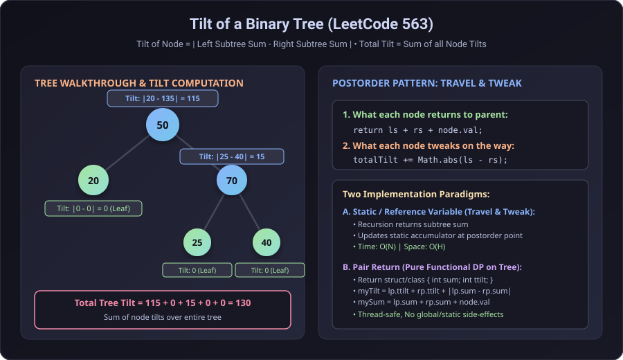
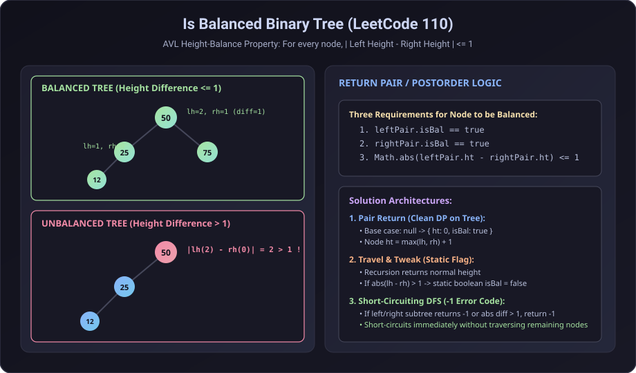
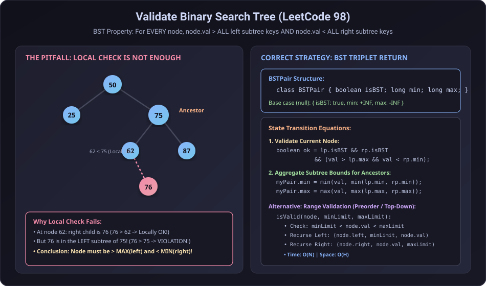

# Tree Properties & DP on Trees (Post-Order Return Pairs)

This section covers fundamental tree property verification and aggregation problems solved using **Post-Order Traversal**, **Travel & Tweak (Static / Reference Accumulator)**, and **Return Pair / Tree DP Patterns**.

---

## Q1. Tilt of a Binary Tree (LeetCode 563)

### Problem Statement
Given the `root` of a binary tree, return the sum of every tree node's **tilt**.

- The **tilt** of a tree node is the **absolute difference** between the sum of all left subtree node values and all right subtree node values:
  $$\text{Tilt}(\text{node}) = |\text{Sum}(\text{left\_subtree}) - \text{Sum}(\text{right\_subtree})|$$
- If a node does not have a left child, the left subtree sum is treated as $0$. The rule is similar if there is no right child.
- The **tilt of the whole tree** is the sum of all nodes' tilts:
  $$\text{Total Tree Tilt} = \sum_{v \in \text{Tree}} \text{Tilt}(v)$$

---

### Examples

#### Example 1:
```
       1                   Tilt(2) = |0 - 0| = 0
     /   \                 Tilt(3) = |0 - 0| = 0
    2     3                Tilt(1) = |2 - 3| = 1
                           Total Tilt = 0 + 0 + 1 = 1
```

#### Example 2:
```
         4                 Tilt(3) = 0, Tilt(5) = 0, Tilt(7) = 0
       /   \               Tilt(9) = |0 - 7| = 7
      2     9              Tilt(2) = |3 - 5| = 2
     / \     \             Tilt(4) = |(3+5+2) - (9+7)| = |10 - 16| = 6
    3   5     7            Total Tilt = 0 + 0 + 0 + 7 + 2 + 6 = 15
```

---

### Constraints
- The number of nodes in the tree is in the range $[0, 10^4]$.
- $-1000 \le \text{Node.val} \le 1000$

---

### Visual Explanation



---

### Approach & Intuition

1. **Brute Force ($O(N^2)$)**:
   - For every node, calculate the sum of its left subtree and right subtree using a helper `sum()` function, compute tilt, and recurse.
   - Re-traversing subtrees causes redundant work.

2. **Optimal: Travel & Tweak / Post-Order Return Sum ($O(N)$)**:
   - A single post-order traversal computes subtree sums from the bottom up.
   - What each node **returns to its parent**:
     $$\text{Subtree Sum} = \text{leftSum} + \text{rightSum} + \text{node.val}$$
   - What each node **tweaks along the way**:
     $$\text{totalTilt} += |\text{leftSum} - \text{rightSum}|$$

3. **Pure Functional: Return Pair (`TiltPair`) ($O(N)$)**:
   - Avoids global/static state (thread-safe).
   - Each recursive call returns a pair:
     $$\text{TiltPair} = \{ \text{sum}, \text{totalTilt} \}$$
   - Combine left and right pairs:
     - $\text{myTilt} = \text{leftPair.totalTilt} + \text{rightPair.totalTilt} + |\text{leftPair.sum} - \text{rightPair.sum}|$
     - $\text{mySum} = \text{leftPair.sum} + \text{rightPair.sum} + \text{node.val}$

---

### Code Implementations

We implemented approach 2 and 3

#### C++

```cpp
#include <iostream>
#include <cmath>
#include <algorithm>

using namespace std;

struct TreeNode {
    int val;
    TreeNode *left;
    TreeNode *right;
    TreeNode(int x) : val(x), left(nullptr), right(nullptr) {}
};

class Solution {
private:
    // Approach 1: Helper function modifying reference accumulator
    int computeSumAndTilt(TreeNode* root, int& totalTilt) {
        if (!root) return 0;

        int leftSum = computeSumAndTilt(root->left, totalTilt);
        int rightSum = computeSumAndTilt(root->right, totalTilt);

        // Update total tilt
        totalTilt += abs(leftSum - rightSum);

        // Return subtree sum to parent
        return leftSum + rightSum + root->val;
    }

    // Approach 2: Pair structure (sum, totalTilt)
    struct TiltPair {
        int sum;
        int tilt;
    };

    TiltPair computePair(TreeNode* root) {
        if (!root) return {0, 0};

        TiltPair lp = computePair(root->left);
        TiltPair rp = computePair(root->right);

        int mySum = lp.sum + rp.sum + root->val;
        int myTilt = lp.tilt + rp.tilt + abs(lp.sum - rp.sum);

        return {mySum, myTilt};
    }

public:
    // Method 1: Using accumulator
    int findTilt(TreeNode* root) {
        int totalTilt = 0;
        computeSumAndTilt(root, totalTilt);
        return totalTilt;
    }

    // Method 2: Pure pair return
    int findTiltPair(TreeNode* root) {
        return computePair(root).tilt;
    }
};
```

#### Java

```java
class TreeNode {
    int val;
    TreeNode left;
    TreeNode right;
    TreeNode(int x) { val = x; }
}

public class Solution {
    // ==========================================
    // Approach 1: Travel & Tweak (Static Variable)
    // ==========================================
    static int totalTilt = 0;

    public static int treeSumAndTilt(TreeNode node) {
        if (node == null) return 0;

        int leftSum = treeSumAndTilt(node.left);
        int rightSum = treeSumAndTilt(node.right);

        // Tweak: accumulate tilt at postorder position
        totalTilt += Math.abs(leftSum - rightSum);

        // Return: subtree sum to parent
        return leftSum + rightSum + node.val;
    }

    public int findTilt(TreeNode root) {
        totalTilt = 0;
        treeSumAndTilt(root);
        return totalTilt;
    }

    // ==========================================
    // Approach 2: DP on Tree using Return Pair
    // ==========================================
    static class TiltPair {
        int sum;
        int tilt;

        TiltPair(int sum, int tilt) {
            this.sum = sum;
            this.tilt = tilt;
        }
    }

    public static TiltPair findTiltPair(TreeNode node) {
        if (node == null) {
            return new TiltPair(0, 0);
        }

        TiltPair lp = findTiltPair(node.left);
        TiltPair rp = findTiltPair(node.right);

        int mySum = lp.sum + rp.sum + node.val;
        int myTilt = lp.tilt + rp.tilt + Math.abs(lp.sum - rp.sum);

        return new TiltPair(mySum, myTilt);
    }

    public int findTiltFunctional(TreeNode root) {
        return findTiltPair(root).tilt;
    }
}
```

### Complexity Analysis
- **Time Complexity**: $\mathcal{O}(N)$ where $N$ is the number of nodes (each node is visited once).
- **Space Complexity**: $\mathcal{O}(H)$ auxiliary call stack space, where $H$ is the tree height ($\mathcal{O}(\log N)$ for balanced, $\mathcal{O}(N)$ worst-case).

---

## Q2. Is Balanced Binary Tree (LeetCode 110)

### Problem Statement
Given a binary tree, determine if it is **height-balanced**.

A **height-balanced** binary tree is defined as:
> A binary tree in which the left and right subtrees of *every* node differ in height by no more than $1$, and both left and right subtrees are also height-balanced.

$$\text{isBalanced}(u) = \text{isBalanced}(u.\text{left}) \land \text{isBalanced}(u.\text{right}) \land (| \text{height}(u.\text{left}) - \text{height}(u.\text{right}) | \le 1)$$

---

### Examples

#### Example 1:
```
        3
       / \
      9  20
        /  \
       15   7

- Node 9: lh = 0, rh = 0 => diff = 0 <= 1 (Balanced)
- Node 20: lh = 1, rh = 1 => diff = 0 <= 1 (Balanced)
- Node 3: lh = 1, rh = 2 => diff = 1 <= 1 (Balanced)
=> Output: true
```

#### Example 2:
```
           1
          / \
         2   2
        / \
       3   3
      / \
     4   4

- Node 2: lh = 2, rh = 0 => diff = 2 > 1 (UNBALANCED!)
- Root 1: lh = 3, rh = 1 => diff = 2 > 1 (UNBALANCED!)
=> Output: false
```

---

### Constraints
- The number of nodes in the tree is in the range $[0, 5000]$.
- $-10^4 \le \text{Node.val} \le 10^4$

---

### Visual Explanation



---

### Approach & Strategies

1. **Approach 1: Travel & Tweak with Static/Reference Flag ($O(N)$)**
   - Recursion computes normal height: $\text{height} = \max(\text{lh}, \text{rh}) + 1$.
   - At each node, if $|\text{lh} - \text{rh}| > 1$, toggle `isBal = false`.
   - *Drawback*: Requires resetting static/global state and is not thread-safe. Also still visits all remaining nodes.

2. **Approach 2: DP Pair Return (`BalPair`) ($O(N)$)**
   - Each recursive step returns:
     $$\text{BalPair} = \{ \text{int } \text{ht}, \text{boolean } \text{isBal} \}$$
   - Base Case: `null` returns $\{ \text{ht} = 0, \text{isBal} = \text{true} \}$.
   - Current node properties:
     - $\text{isBal} = \text{lp.isBal} \land \text{rp.isBal} \land (|\text{lp.ht} - \text{rp.ht}| \le 1)$
     - $\text{ht} = \max(\text{lp.ht}, \text{rp.ht}) + 1$
   - *Drawback*: Allocates $N$ object instances on the heap (in Java) and visits every single node even after determining the tree is unbalanced.

3. **Approach 3: Short-Circuiting DFS (-1 Sentinel / Error Code Return) ($O(N)$ Best: $O(H)$) — (Recommended)**
   - Overloads the return value:
     - Return $\ge 0$: Actual height of a balanced subtree.
     - Return $-1$: Error flag indicating the subtree is **unbalanced**.
   - If `checkHeight(node.left)` returns `-1`, it **immediately short-circuits** (aborts) and returns `-1` without even visiting `node.right`!
   - If $|\text{lh} - \text{rh}| > 1$, return `-1`. Otherwise return $\max(\text{lh}, \text{rh}) + 1$.

---

### Why Short-Circuiting DFS (-1 Return) is Recommended?

| Feature / Metric | Approach 1: Static Flag | Approach 2: Return Pair (`BalPair`) | Approach 3: Short-Circuit DFS (`-1`) |
| :--- | :--- | :--- | :--- |
| **Early Pruning** | ❌ No (Visits all $N$ nodes) | ❌ No (Visits all $N$ nodes) | ✅ **Yes** (Aborts right subtrees immediately if left fails) |
| **Best/Avg Time on Unbalanced** | $\mathcal{O}(N)$ | $\mathcal{O}(N)$ | ✅ **$\mathcal{O}(H)$** |
| **Heap Allocations (Java)** | Zero | $N$ object instances (`new BalPair`) | ✅ **Zero** (returns primitive `int`) |
| **Thread Safety** | ❌ Unsafe (Shared mutable static state) | ✅ Safe (Pure return) | ✅ **Safe** (Pure return) |
| **Code Simplicity** | Requires global reset before call | Needs helper class/struct | ✅ **Cleanest & most concise** |

> [!TIP]
> **Key Reason for Recommendation**:
> 1. **Early Exit / Subtree Pruning**: As soon as `lh == -1`, the entire right branch traversal is skipped, saving substantial CPU time on unbalanced trees.
> 2. **Zero Object Allocation**: Uses a primitive `int` return instead of generating thousands of `Pair` objects on the heap.
> 3. **Thread-Safe & Pure**: No global variables or external state resets needed.


---

### Code Implementations

#### C++

```cpp
#include <iostream>
#include <cmath>
#include <algorithm>

using namespace std;

class Solution {
private:
    // Approach 1: Return Pair
    struct BalPair {
        int ht;
        bool isBal;
    };

    BalPair isBalancedHelper(TreeNode* root) {
        if (!root) {
            return {0, true}; // Base case: null node has height 0 and is balanced
        }

        BalPair lp = isBalancedHelper(root->left);
        BalPair rp = isBalancedHelper(root->right);

        BalPair myPair;
        myPair.isBal = lp.isBal && rp.isBal && (abs(lp.ht - rp.ht) <= 1);
        myPair.ht = max(lp.ht, rp.ht) + 1;

        return myPair;
    }

    // Approach 2: Short-circuit DFS with -1
    int checkHeight(TreeNode* root) {
        if (!root) return 0;

        int lh = checkHeight(root->left);
        if (lh == -1) return -1; // Left subtree unbalanced

        int rh = checkHeight(root->right);
        if (rh == -1) return -1; // Right subtree unbalanced

        if (abs(lh - rh) > 1) return -1; // Current node unbalanced

        return max(lh, rh) + 1;
    }

public:
    // Pair Method
    bool isBalancedPair(TreeNode* root) {
        return isBalancedHelper(root).isBal;
    }

    // Short-Circuit Method (Recommended)
    bool isBalanced(TreeNode* root) {
        return checkHeight(root) != -1;
    }
};
```

#### Java

```java
public class Solution {
    // ==========================================
    // Approach 1: Return Pair Class
    // ==========================================
    static class BalPair {
        int ht;
        boolean isBal;

        BalPair(int ht, boolean isBal) {
            this.ht = ht;
            this.isBal = isBal;
        }
    }

    public static BalPair isBalancedPair(TreeNode node) {
        if (node == null) {
            return new BalPair(0, true);
        }

        BalPair lp = isBalancedPair(node.left);
        BalPair rp = isBalancedPair(node.right);

        boolean myBal = lp.isBal && rp.isBal && Math.abs(lp.ht - rp.ht) <= 1;
        int myHt = Math.max(lp.ht, rp.ht) + 1;

        return new BalPair(myHt, myBal);
    }

    // ==========================================
    // Approach 2: Short-Circuiting DFS (-1 code)
    // ==========================================
    private int checkHeight(TreeNode node) {
        if (node == null) return 0;

        int lh = checkHeight(node.left);
        if (lh == -1) return -1;

        int rh = checkHeight(node.right);
        if (rh == -1) return -1;

        if (Math.abs(lh - rh) > 1) return -1;

        return Math.max(lh, rh) + 1;
    }

    public boolean isBalanced(TreeNode root) {
        return checkHeight(root) != -1;
    }
}
```

### Complexity Analysis
- **Time Complexity**: $\mathcal{O}(N)$ — each node visited once.
- **Space Complexity**: $\mathcal{O}(H)$ stack space ($\mathcal{O}(\log N)$ average, $\mathcal{O}(N)$ worst-case).

---

## Q3. Validate Binary Search Tree / Is BST (LeetCode 98)

### Problem Statement
Given the `root` of a binary tree, determine if it is a valid **Binary Search Tree (BST)**.

A valid **BST** is defined as follows:
1. The **left subtree** of a node contains only nodes with keys **strictly less than** the node's key.
2. The **right subtree** of a node contains only nodes with keys **strictly greater than** the node's key.
3. Both the left and right subtrees must also be binary search trees.

---

### The Classic Pitfall: Local Check Is NOT Enough!

A very common beginner mistake is checking only immediate parent-child relationships:
$$\text{node.left.val} < \text{node.val} < \text{node.right.val} \quad \text{\textbf{(WRONG!)}}$$

#### Counterexample:
```
           50
          /  \
        25    75
             /  \
           62    87
            \
             76   <-- VIOLATION OF BST PROPERTY!
```
- At node `62`: `node.right = 76` ($76 > 62$ $\rightarrow$ Local check passes).
- At node `75`: `node.left = 62` ($62 < 75$ $\rightarrow$ Local check passes).
- **Global Violation**: Node `76` lies inside the **left subtree** of `75`, but $76 > 75$!
- **Conclusion**: A node must be strictly greater than the **maximum** value in its entire left subtree, and strictly less than the **minimum** value in its entire right subtree:
  $$\text{node.val} > \max(\text{left\_subtree}) \quad \text{AND} \quad \text{node.val} < \min(\text{right\_subtree})$$

---

### Constraints
- The number of nodes in the tree is in the range $[1, 10^4]$.
- $-2^{31} \le \text{Node.val} \le 2^{31} - 1$ (Use 64-bit integers / `long` to prevent overflow when setting infinity bounds).

---

### Visual Explanation



---

### Approaches

#### Approach 1: Triplet Return Pair (`BSTPair`) ($O(N)$)
Each node returns 3 pieces of information to its parent:
$$\text{BSTPair} = \{ \text{boolean } \text{isBST}, \text{long } \min, \text{long } \max \}$$

- **Base Case (`null`)**:
  - `min = Long.MAX_VALUE` ($+\infty$)
  - `max = Long.MIN_VALUE` ($-\infty$)
  - `isBST = true`
- **Node Validation**:
  $$\text{isBST} = \text{lp.isBST} \land \text{rp.isBST} \land (\text{node.val} > \text{lp.max}) \land (\text{node.val} < \text{rp.min})$$
- **Subtree Min & Max Propagation**:
  $$\min = \min(\text{node.val}, \text{lp.min}, \text{rp.min})$$
  $$\max = \max(\text{node.val}, \text{lp.max}, \text{rp.max})$$

#### Approach 2: Range / Interval Validation recursion ($O(N)$)
- Pass allowed bounds down the recursion tree: $(\text{minBound}, \text{maxBound})$.
- For `root`: bound is $(-\infty, +\infty)$.
- For `node.left`: bound becomes $(\text{minBound}, \text{node.val})$.
- For `node.right`: bound becomes $(\text{node.val}, \text{maxBound})$.

#### Approach 3: Inorder Traversal Property ($O(N)$)
- Inorder traversal of a valid BST yields a **strictly increasing** sequence.
- Maintain `prev` pointer during inorder traversal and verify $\text{curr.val} > \text{prev.val}$.

---

### Code Implementations

#### C++

```cpp
#include <iostream>
#include <climits>
#include <algorithm>

using namespace std;

class Solution {
private:
    // ==========================================
    // Approach 1: DP Triplet Pair Return
    // ==========================================
    struct BSTPair {
        bool isBST;
        long minVal;
        long maxVal;
    };

    BSTPair validateBSTPair(TreeNode* root) {
        if (!root) {
            return {true, LONG_MAX, LONG_MIN};
        }

        BSTPair lp = validateBSTPair(root->left);
        BSTPair rp = validateBSTPair(root->right);

        BSTPair myPair;
        // Check BST condition: current value must be > left max and < right min
        myPair.isBST = lp.isBST && rp.isBST && 
                       (root->val > lp.maxVal && root->val < rp.minVal);

        // Compute overall subtree min and max
        myPair.minVal = min((long)root->val, min(lp.minVal, rp.minVal));
        myPair.maxVal = max((long)root->val, max(lp.maxVal, rp.maxVal));

        return myPair;
    }

    // ==========================================
    // Approach 2: Top-Down Range Validation
    // ==========================================
    bool isValid(TreeNode* root, long minBound, long maxBound) {
        if (!root) return true;

        if (root->val <= minBound || root->val >= maxBound) {
            return false;
        }

        return isValid(root->left, minBound, root->val) &&
               isValid(root->right, root->val, maxBound);
    }

public:
    // Triplet Return
    bool isValidBSTPair(TreeNode* root) {
        return validateBSTPair(root).isBST;
    }

    // Range Validation (Standard)
    bool isValidBST(TreeNode* root) {
        return isValid(root, LONG_MIN, LONG_MAX);
    }
};
```

#### Java

```java
public class Solution {
    // ==========================================
    // Approach 1: Triplet Return Pair Class
    // ==========================================
    static class BSTPair {
        boolean isBST;
        long min;
        long max;

        BSTPair(boolean isBST, long min, long max) {
            this.isBST = isBST;
            this.min = min;
            this.max = max;
        }
    }

    public static BSTPair isBST(TreeNode node) {
        if (node == null) {
            // Base case: null node
            // min is +INF, max is -INF so any parent value easily satisfies:
            // parent > left.max (-INF) and parent < right.min (+INF)
            return new BSTPair(true, Long.MAX_VALUE, Long.MIN_VALUE);
        }

        BSTPair lp = isBST(node.left);
        BSTPair rp = isBST(node.right);

        BSTPair myPair = new BSTPair(false, 0, 0);

        // Validation condition
        myPair.isBST = lp.isBST && rp.isBST && (node.val > lp.max && node.val < rp.min);

        // Calculate min and max for current subtree
        myPair.min = Math.min(node.val, Math.min(lp.min, rp.min));
        myPair.max = Math.max(node.val, Math.max(lp.max, rp.max));

        return myPair;
    }

    // ==========================================
    // Approach 2: Range / Interval Validation
    // ==========================================
    public boolean validateRange(TreeNode node, long minBound, long maxBound) {
        if (node == null) return true;

        if (node.val <= minBound || node.val >= maxBound) {
            return false;
        }

        return validateRange(node.left, minBound, node.val) &&
               validateRange(node.right, node.val, maxBound);
    }

    public boolean isValidBST(TreeNode root) {
        // Method 1 via Pair:
        // return isBST(root).isBST;

        // Method 2 via Range:
        return validateRange(root, Long.MIN_VALUE, Long.MAX_VALUE);
    }
}
```

### Complexity Analysis
- **Time Complexity**: $\mathcal{O}(N)$ where $N$ is the number of nodes in the binary tree.
- **Space Complexity**: $\mathcal{O}(H)$ call stack space where $H$ is the tree height ($\mathcal{O}(\log N)$ for balanced trees, $\mathcal{O}(N)$ for skewed trees).

---

## Summary of Tree DP / Return Pair Patterns

| Problem | Return Type | Information Propagated Up | Key Transition Formula |
| :--- | :--- | :--- | :--- |
| **Tilt of BT** | `{sum, tilt}` | Subtree Sum, Acc. Tilt | `myTilt = lp.tilt + rp.tilt + abs(lp.sum - rp.sum)` |
| **Is Balanced** | `{ht, isBal}` | Subtree Height, Balance Bool | `isBal = lp.isBal && rp.isBal && abs(lp.ht - rp.ht) <= 1` |
| **Is BST** | `{min, max, isBST}` | Subtree Min & Max, BST Bool | `isBST = lp.isBST && rp.isBST && val > lp.max && val < rp.min` |
