## Level Order Traversal — concept


Level Order Traversal only needs to be revised once — the same "Queue rule" applies everywhere it's used. In short, for every node we do, in Level Order:
- Remove (from the queue)
- Print
- Add children (to the queue)

That's the whole summary of Level Order.

**Dry run** — tree used for the walkthrough:

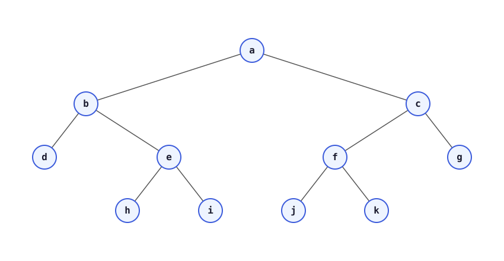


For the very first node, go to Level 1.

Dry Run (without a `null` marker, one queue only):

| Step | Action | Queue after step | Output so far |
|---|---|---|---|
| 1 | Put `a` in the queue | `a` | — |
| 2 | Pop `a`, print it, push its children | `b, c` | `a` |
| 3 | Pop `b`, print it, push `b`'s children | `c, d, e` | `a b` |
| 4 | Pop `c`, print it, push `c`'s children | `d, e, f, g` | `a b c` |
| 5 | Pop `d`, print it (`d` has no children) | `e, f, g` | `a b c d` |
| 6 | Pop `e`, print it, push `e`'s children | `f, g, h, i` | `a b c d e` |
| 7 | Pop `f`, print it, push `f`'s children | `g, h, i, j, k` | `a b c d e f` |
| 8 | Pop `g`, print it (`g` has no children) | `h, i, j, k` | `a b c d e f g` |
| 9 | Pop `h`, `i`, `j`, `k` one by one and print each | *(empty)* | `a b c d e f g h i j k` |

This is the standard single-queue BFS: keep removing the front node, printing it, and pushing its (existing) children back into the queue until the queue is empty.

**Line-wise / level-wise variant:** Now, if we need all the nodes of one level printed on one line, we do Level Order line-wise. Either we put a `null` after every level, or we use the queue's `size()` at the start of each level to know how many nodes belong to that level (i.e. we read the queue's size before draining that level, instead of pushing `null` markers).

Using the `null`-marker idea: `null` is used as a marker to say "one level has finished." So, whenever we pop a node and it is `null`, that tells us the current level is complete — print a newline, and (if the queue is not yet empty) push another `null` marker for the next level.

**Question to try yourself:**
For the tree `a -> (b, c)`, `b -> (d, e)`, print the level-order traversal level by level.
- Level 1: `a`
- Level 2: `b, c`
- Level 3: `d, e`

**Time Complexity:** `O(N)` — every node is pushed and popped from the queue exactly once.
**Space Complexity:** `O(N)` — in the worst case (a fully skewed tree, or the last level of a complete tree) the queue can hold up to `N` nodes.

```cpp
#include <bits/stdc++.h>
using namespace std;

class Node {
public:
    int data;
    Node* left;
    Node* right;
    Node(int val) {
        data = val;
        left = nullptr;
        right = nullptr;
    }
};

// simple, single line level order (all nodes on one line)
void levelOrder(Node* node) {
    queue<Node*> q;
    q.push(node);

    while (!q.empty()) {
        Node* temp = q.front();
        q.pop();
        cout << temp->data << " ";

        if (temp->left != nullptr) {
            q.push(temp->left);
        }
        if (temp->right != nullptr) {
            q.push(temp->right);
        }
    }
}

// level-wise / line-wise level order using a null marker
void levelOrderLineWise(Node* node) {
    queue<Node*> q;
    q.push(node);
    q.push(nullptr); // marker: end of level 1

    while (!q.empty()) {
        Node* temp = q.front();
        q.pop();

        if (temp != nullptr) {
            cout << temp->data << " ";

            if (temp->left != nullptr) {
                q.push(temp->left);
            }
            if (temp->right != nullptr) {
                q.push(temp->right);
            }
        } else {
            // temp is null -> one level has finished
            if (q.size() > 0) { // check queue size > 0, if not then no need to push a new marker
                cout << "\n";
                q.push(nullptr);
            }
            // else nothing to do, we are done
        }
    }
}
```

```java
import java.util.ArrayDeque;
import java.util.LinkedList;
import java.util.Queue;

public class LevelOrder {

    public static void levelOrder(Node node) {
        // ArrayDeque -> internally an array-backed deque, faster than LinkedList
        // NOT to be used for line-wise level order (see below)
        ArrayDeque<Node> queue = new ArrayDeque<>();
        queue.add(node);

        while (queue.size() > 0) {
            Node temp = queue.remove();
            System.out.print(temp.data);

            if (temp.left != null) {
                queue.add(temp.left);
            }

            if (temp.right != null) {
                queue.add(temp.right);
            }
        }
    }

    // Now we want all levels printed on one line each, so we do Level Order
    // line-wise. Either we put null after a level, or we use size() [the null
    // marker version is implemented below]
    public static void levelOrderLW(Node node) {
        Queue<Node> queue = new LinkedList<>();
        queue.add(node);
        queue.add(null);

        while (queue.size() > 0) {
            Node temp = queue.remove();

            if (temp != null) { // if temp is not null, do the usual work
                System.out.print(temp.data + " ");

                if (temp.left != null) {
                    queue.add(temp.left);
                }

                if (temp.right != null) {
                    queue.add(temp.right);
                }
            } else { // if temp is null, one level has finished
                if (queue.size() > 0) { // check queue size > 0
                    System.out.println();
                    queue.add(temp); // if not, then no need to do anything, we are done
                }
            }
        }
    }
}
```


## 1. Reverse Level Order Traversal


Given a binary tree of size N, find its reverse level order traversal. i.e. the traversal must begin from the last level.

**Example 1:**

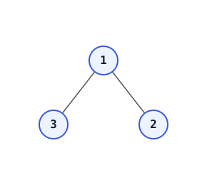

```
Input :
        1
       / \
      3   2
Output: 3 2 1
Explanation:
Traversing level 1 : 3 2
Traversing level 0 : 1
```

**Example 2:**


```
Input :
        10
       /  \
      20   30
     /  \
    40   60
Output: 40 60 20 30 10
Explanation:
Traversing level 2 : 40 60
Traversing level 1 : 20 30
Traversing level 0 : 10
```

**Expected Time Complexity:** O(N)
**Expected Auxiliary Space:** O(N)

**Constraints:** `1 <= N <= 10^4`

**Notes (transcribed & translated to English):**

Sir's hint: since Level Order itself uses a Queue, to print it in reverse a Stack will also have to be used.

**Dry run — approach where a Stack is used only after a level finishes (this turned out unnecessary — see below):**

Tree used: `10 -> (20, 30)`, `20 -> (40, 60)`.

Step 1 — queue: `10`, stack: *(empty)*
Step 2 — queue: `20, 30`, stack: `10`
Step 3 — queue: `40, 60`, stack: `30, 20` *(new nodes pushed on top)*
Step 4 — queue: *(empty)*, stack: `60, 40, 30, 20`

Output needed, to get this output just put the right child first in the queue and then the left child:
`Output: 40 60 20 30 10`

**Dry run — the actual approach used (level order line-wise, so we know exactly where one level ends and the next begins), pushing right child before left child into the queue and immediately transferring each popped node onto a stack:**

Tree used again: `10 -> (20, 30)`, `20 -> (40, 60)`.

1. queue: `10`, stack: *(empty)*
2. pop `10` → queue: `30, 20`, stack: `10`
3. pop `30`, `20` → queue: `60, 40`, stack: `20, 30, 10`
4. pop `60`, `40` → queue: *(empty)*, stack: `40, 60, 20, 30, 10`

`Output: 40 60 20 30 10`

Reversing is why we always use a stack — used together with a Queue because we need Level Order. If the question was "Reverse Level Order line-wise," then level-wise reversing would need a marker in the stack too, and we'd have to print a newline exactly when that marker comes up while popping — that new implementation, use karenge (we'll use), so revise this once more.

2-Stack idea won't work — it will never do Level Order.

Now let's see one more approach — on the right side, because using a stack means the space complexity is less than the previous one? **No** — at any moment in the previous approach, either the Stack or the ArrayList (one of them) held all the nodes, so `SC -> O(n)` there as well, and here only one ArrayList holds all the elements, so `SC` here is also `O(n)`.


```java
class Tree {
    public ArrayList<Integer> reverseLevelOrder(Node node) {
        ArrayList<Integer> res = new ArrayList<>();
        LinkedList<Node> q = new LinkedList<>();
        LinkedList<Node> stk = new LinkedList<>();
        q.addLast(node);
        while (q.size() > 0) {
            int size = q.size();
            while (size-- > 0) {
                Node temp = q.removeFirst();
                stk.addFirst(temp);
                if (temp.right != null) {
                    q.addLast(temp.right);
                }
                if (temp.left != null) {
                    q.addLast(temp.left);
                }
            }
        }

        while (stk.size() > 0) {
            Node res_node = stk.removeFirst();
            res.add(res_node.data);
        }
        return res;
    }
}
```

```cpp
#include <bits/stdc++.h>
using namespace std;

class Solution {
public:
    vector<int> reverseLevelOrder(Node* node) {
        vector<int> ret;
        queue<Node*> queue;
        queue.push(node);

        while (!queue.empty()) {
            Node* temp = queue.front();
            queue.pop();

            ret.push_back(temp->data);
            if (temp->right != nullptr) {
                queue.push(temp->right);
            }
            if (temp->left != nullptr) {
                queue.push(temp->left);
            }
        }

        reverse(ret.begin(), ret.end());
        return ret;
    }
};
```

**Time Complexity:** `O(N)` — each node is pushed/popped from the queue once and pushed/popped from the stack (or reversed) once.
**Space Complexity:** `O(N)` — the queue holds at most one level, and the stack (or result vector being reversed) holds up to `N` nodes.


## 2. LeetCode 1161. Maximum Level Sum of a Binary Tree

Given the `root` of a binary tree, the level of its root is `1`, the level of its children is `2`, and so on.

Return the **smallest** level `x` such that the sum of all the values of nodes at level `x` is **maximal**.

### Example 1:
**Input:** root = [1,7,0,7,-8,null,null]  
**Output:** 2  
**Explanation:** Level 1 sum = 1.  
Level 2 sum = 7 + 0 = 7.  
Level 3 sum = 7 + -8 = -1.  
So we return the level with the maximum sum which is level 2.

### Example 2:
**Input:** root = [989,null,10250,98693,-89388,null,null,null,-32127]  
**Output:** 2  

### Constraints:
* The number of nodes in the tree is in the range `[1, 10^4]`.
* `-10^5 <= Node.val <= 10^5`

Link--> https://leetcode.com/problems/maximum-level-sum-of-a-binary-tree/description/?envType=daily-question&envId=2026-01-06

```cpp
/**
 * Definition for a binary tree node.
 * struct TreeNode {
 *     int val;
 *     TreeNode *left;
 *     TreeNode *right;
 *     TreeNode() : val(0), left(nullptr), right(nullptr) {}
 *     TreeNode(int x) : val(x), left(nullptr), right(nullptr) {}
 *     TreeNode(int x, TreeNode *left, TreeNode *right) : val(x), left(left), right(right) {}
 * };
 */
class Solution {
public:
    int maxLevelSum(TreeNode* root) {
        long long res=-(1e18);
        queue<TreeNode *>q;
        q.push(root);
        int lvl=1;
        int reslvl=-1;
        while(q.size()>0){
            int sz=q.size();
            long long sum=0;
           while(sz-->0){
             TreeNode* node=q.front();
                q.pop();
                sum+=(node->val);
                if(node->left!=nullptr) q.push(node->left);
                if(node->right!=nullptr) q.push(node->right);
           }

           if(sum>res){
            res=sum;
            reslvl=lvl;
           }
           lvl++;
        }
        return reslvl;
    }
};

```

```java
/**
 * Definition for a binary tree node.
 * public class TreeNode {
 *     int val;
 *     TreeNode left;
 *     TreeNode right;
 *     TreeNode() {}
 *     TreeNode(int val) { this.val = val; }
 *     TreeNode(int val, TreeNode left, TreeNode right) {
 *         this.val = val;
 *         this.left = left;
 *         this.right = right;
 *     }
 * }
 */
class Solution {
    public int maxLevelSum(TreeNode root) {
        long res = Long.MIN_VALUE;
        Queue<TreeNode> q = new LinkedList<>();
        q.add(root);
        int lvl = 1;
        int reslvl = -1;
        while (q.size() > 0) {
            int sz = q.size();
            long sum = 0;
            while (sz-- > 0) {
                TreeNode node = q.poll();
                sum += node.val;
                if (node.left != null) q.add(node.left);
                if (node.right != null) q.add(node.right);
            }

            if (sum > res) {
                res = sum;
                reslvl = lvl;
            }
            lvl++;
        }
        return reslvl;
    }
}
```

**Time Complexity:** `O(N)` — level order traversal visits every node exactly once.
**Space Complexity:** `O(N)` — the queue can hold up to the widest level of the tree, which is `O(N)` in the worst case.


## 3. LeetCode 107. Binary Tree Level Order Traversal II


Given the `root` of a binary tree, return *the bottom-up level order traversal of its nodes' values*. (i.e., from left to right, level by level from leaf to root).

**Example 1:**

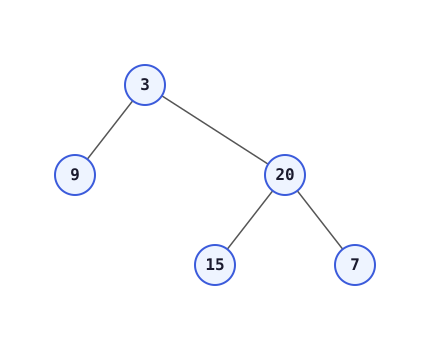

```
Input: root = [3,9,20,null,null,15,7]
Output: [[15,7],[9,20],[3]]
```

**Example 2:**
```
Input: root = [1]
Output: [[1]]
```

**Example 3:**
```
Input: root = []
Output: []
```

**Constraints:**
* The number of nodes in the tree is in the range `[0, 2000]`.
* `-1000 <= Node.val <= 1000`

**Notes (transcribed & translated to English):** Here, instead of using a stack, we simply reverse the list at the end — every time we build the level-order result the normal way, and let the list itself do the reversing that a stack would otherwise have done.

```java
class Solution {
    public List<List<Integer>> levelOrderBottom(TreeNode root) {
        List<List<Integer>> res = new ArrayList<List<Integer>>();
        if (root == null) return res;
        LinkedList<TreeNode> q = new LinkedList<>();
        q.addLast(root);
        while (q.size() > 0) {
            List<Integer> temp = new ArrayList<>();
            int sz = q.size();
            while (sz-- > 0) {
                TreeNode fr = q.removeFirst();
                temp.add(fr.val);
                if (fr.left != null) q.addLast(fr.left);
                if (fr.right != null) q.addLast(fr.right);
            }
            res.add(temp);
        }
        Collections.reverse(res);
        return res;
    }
}
```

```cpp
class Solution {
public:
    vector<vector<int>> levelOrderBottom(TreeNode* root) {
        vector<vector<int>> res;
        if (root == nullptr) return res;
        queue<TreeNode*> q;
        q.push(root);
        while (!q.empty()) {
            vector<int> temp;
            int sz = q.size();
            while (sz-- > 0) {
                TreeNode* fr = q.front();
                q.pop();
                temp.push_back(fr->val);
                if (fr->left != nullptr) q.push(fr->left);
                if (fr->right != nullptr) q.push(fr->right);
            }
            res.push_back(temp);
        }
        reverse(res.begin(), res.end());
        return res;
    }
};
```

**Time Complexity:** `O(N)` — a normal level order traversal visits each node once.
**Space Complexity:** `O(N)` — for the queue and for the result that is later reversed.


## 4. Left View of a Binary Tree

**Difficulty:** Medium

Given a binary tree, print the left view of it. The left view of a binary tree is the set of nodes visible when the tree is viewed from the left side.

**Example (Input):**

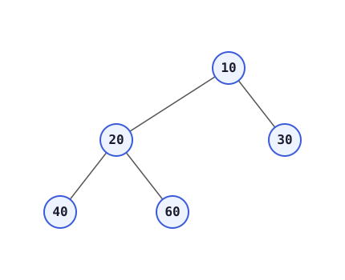

```
Input:
       10
      /  \
    20    30
   /  \
  40   60
Output: 10 20 40
```

**Illustration** — blue nodes are the ones that make up the left view:

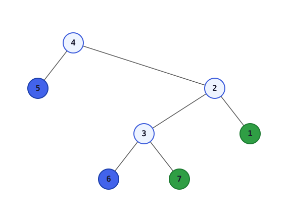

**Expected Time Complexity:** `O(N)`.
**Expected Auxiliary Space:** `O(Height of the Tree)`.

**Constraints:**
* `0 <= Number of nodes <= 100`
* `1 <= Data of a node <= 1000`

**Logic (translated to English):** Print the 1st node of every level — that gives the Left View of the Binary Tree. For the Right View, instead check `i == size - 1` and then add to the result. Left view is the 1st node of a level, right view is the last node of a level.

```java
ArrayList<Integer> leftView(Node root) {
    ArrayList<Integer> res = new ArrayList<>();
    if (root == null) return res;
    LinkedList<Node> q = new LinkedList<>();
    q.addLast(root);
    while (q.size() > 0) {
        int size = q.size();
        for (int i = 0; i < size; i++) {
            Node temp = q.removeFirst();
            if (i == 0) res.add(temp.data);
            if (temp.left != null) {
                q.addLast(temp.left);
            }
            if (temp.right != null) {
                q.addLast(temp.right);
            }
        }
    }
    return res;
}
```

```cpp
vector<int> leftView(Node* root) {
    vector<int> res;
    if (root == nullptr) return res;
    queue<Node*> q;
    q.push(root);
    while (!q.empty()) {
        int size = q.size();
        for (int i = 0; i < size; i++) {
            Node* temp = q.front();
            q.pop();
            if (i == 0) res.push_back(temp->data);
            if (temp->left != nullptr) q.push(temp->left);
            if (temp->right != nullptr) q.push(temp->right);
        }
    }
    return res;
}
```

**Time Complexity:** `O(N)` — every node is visited once.
**Space Complexity:** `O(Height of the Tree)` for the output; the queue itself can hold up to `O(width of the tree)` nodes at once, which is `O(N)` in the worst case.


## 5. Right View of a Binary Tree (LeetCode 199 — Binary Tree Right Side View)

Same idea as the Left View above, but we take the **last** node of every level (`i == size - 1`) instead of the first. `(root == null)` must be handled as a base case up front — otherwise the code below it will throw a `NullPointerException`.

We also submitted this on LeetCode — it's the same question: **LeetCode 199. Right View**.

```java
class Solution {
    public List<Integer> rightSideView(TreeNode root) {
        List<Integer> res = new ArrayList<>();
        if (root == null) return res;
        LinkedList<TreeNode> q = new LinkedList<>();
        q.addLast(root);
        while (q.size() > 0) {
            int size = q.size();
            for (int i = 0; i < size; i++) {
                TreeNode temp = q.removeFirst();
                if (i == size - 1) res.add(temp.val);
                if (temp.left != null) {
                    q.addLast(temp.left);
                }
                if (temp.right != null) {
                    q.addLast(temp.right);
                }
            }
        }
        return res;
    }
}
```


```cpp

class Solution {
public:
    vector<int> rightSideView(TreeNode* root) {
        vector<int > res;
        if(root==nullptr) return res;
        queue<TreeNode *> q;
        q.push(root);
        while(q.size()>0){
            int sz=q.size();
            while(sz-->0){
                TreeNode * node=q.front();
                q.pop();
                if(sz==0)res.push_back(node->data);
                if(node->left!=nullptr) q.push(node->left);
                if(node->right!=nullptr) q.push(node->right);
            }
        }
        return res;
    }
};

```

**Time Complexity:** `O(N)` — every node is visited exactly once.
**Space Complexity:** `O(N)` in the worst case for the queue (the widest level of the tree); the result itself is `O(Height)`.

*Right View of Binary Tree — submitted on GFG. Handling `(root == null)` as a base case is required, otherwise the `else` branch will throw a Null Pointer Exception.*

## 6. LeetCode 513. Find Bottom Left Tree Value


Given the `root` of a binary tree, return the leftmost value in the last row of the tree.

**Example 1:**

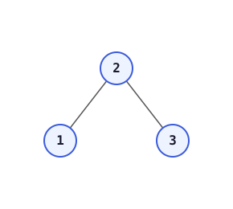

```
Input: root = [2,1,3]
Output: 1
```

**Constraints:**
* The number of nodes in the tree is in the range `[1, 10^4]`.
* `-2^31 <= Node.val <= 2^31 - 1`

**Notes (translated to English):** Bottom Most → 1st node of the last level. So while doing level order, find the height first, and then check `i == 0` — print it only for the level whose level number equals the height.

```java
class Solution {
    private int height(TreeNode node) {
        if (node == null) return 0;
        return Math.max(height(node.left), height(node.right)) + 1;
    }

    public int findBottomLeftValue(TreeNode root) {
        int ht = height(root);
        LinkedList<TreeNode> q = new LinkedList<>();
        q.addLast(root);
        int level = 1;
        while (q.size() > 0) {
            int size = q.size();
            for (int i = 0; i < size; i++) {
                TreeNode temp = q.removeFirst();
                if (level == ht && i == 0) return temp.val;
                if (temp.left != null) {
                    q.addLast(temp.left);
                }
                if (temp.right != null) {
                    q.addLast(temp.right);
                }
            }
            level++;
        }
        return -1;
    }
}
```


**Another approach for LC 513:** store the left view in an `ArrayList` and print the last element of the `ArrayList`. Issue: computing height for every call is not required. In fact, there's no need for an `ArrayList` at all — just replace `res` with the value each time you visit a level's first node, so `res` naturally holds the first node of the last level once the loop finishes.

```java
public int findBottomLeftValue(TreeNode root) {
    LinkedList<TreeNode> q = new LinkedList<>();
    q.addLast(root);
    int res = root.val;
    while (q.size() > 0) {
        int size = q.size();
        for (int i = 0; i < size; i++) {
            TreeNode temp = q.removeFirst();
            if (i == 0) res = temp.val;
            if (temp.left != null) {
                q.addLast(temp.left);
            }
            if (temp.right != null) {
                q.addLast(temp.right);
            }
        }
    }
    return res;
}
```


```cpp
class Solution {
public:
    int height(TreeNode* node) {
        if (node == nullptr) return 0;
        return max(height(node->left), height(node->right)) + 1;
    }

    int findBottomLeftValue(TreeNode* root) {
        queue<TreeNode*> q;
        q.push(root);
        int res = root->val;
        while (!q.empty()) {
            int size = q.size();
            for (int i = 0; i < size; i++) {
                TreeNode* temp = q.front();
                q.pop();
                if (i == 0) res = temp->val;
                if (temp->left != nullptr) q.push(temp->left);
                if (temp->right != nullptr) q.push(temp->right);
            }
        }
        return res;
    }
};
```

**Time Complexity:** `O(N)` — one full level order traversal.
**Space Complexity:** `O(N)` — the queue can hold up to the widest level of the tree.


## 7. Top View of Binary Tree

**Difficulty:** Medium · Accuracy: 32.3% · Submissions: 100k+ · Points: 4

Given below is a binary tree. The task is to print the top view of binary tree. Top view of a binary tree is the set of nodes visible when the tree is viewed from the top. For the given below tree:

```
     1
    / \
   2   3
  / \ / \
 4  5 6  7
```
Top view will be: `4 2 1 3 7`
**Note:** Return nodes from **leftmost** node to **rightmost** node.

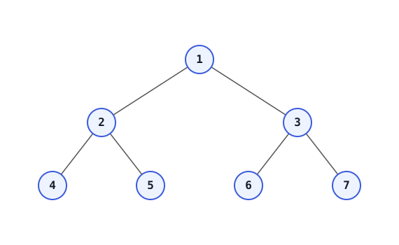

**Example 2:**

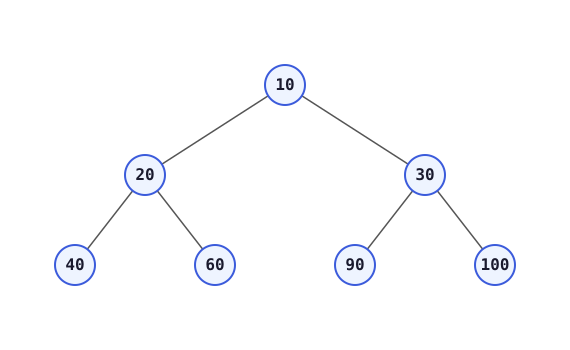

```
Input:
        10
       /  \
     20    30
    /  \  /  \
  40  60 90  100
Output: 40 20 10 30 100
```

**Expected Time Complexity:** `O(N)`
**Expected Auxiliary Space:** `O(N)`

**Constraints:**
* `1 <= N <= 10^5`
* `1 <= Node Data <= 10^5`

**Notes (transcribed & translated to English):**

Top View can't be done with plain Level Order. Dry run showing why:


`Output → 40, 20, 10, 30, 60`

Printing "Left View + Right View" together is the **wrong** approach, because the left view already includes `90`... i.e. the left/right view of individual subtrees does not line up with the actual top view once the tree becomes irregular — a node that is not the true topmost node for its vertical column can still show up in a plain left/right view, which is incorrect for Top View.

We define **vertical levels** — for this, we need to do a **Vertical Order** traversal. We only need to print the 1st element of every vertical level.

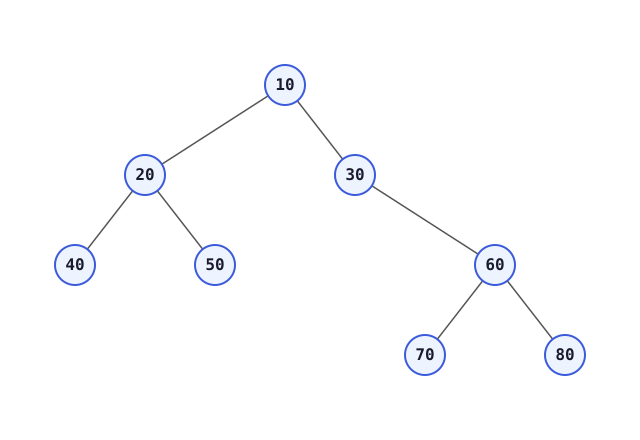

Sir's hint: Level Order chalega (level order works), but we also need to track, for every node, which vertical level it belongs to. So we push `(node, vertical_level)` pairs into the queue instead of just nodes:

```
queue: [(10, 0)]                         -> this number indicates the
queue: [(20, -1), (30, 1)]                  vertical level
queue: [(30, 1), (40, -2), (50, 0)]
```

We only need to print the 1st element of every vertical level.

For every 1st node of every vertical level, we use a HashMap of `<Integer, Node>`. As soon as we get a new vertical level, we put that vertical level and the Node in that HashMap, and for a vertical level we've already seen again in the queue, we will **not** update it in the HashMap.

 .jpg)


```
Node 1 -> vertical level 0        HashMap: { 0: 1 }
Node 2 -> vertical level -1       HashMap: { 0: 1, -1: 2 }
Node 3 -> vertical level 1        HashMap: { 0: 1, -1: 2, 1: 3 }
Node 4 -> vertical level 0        4's level is 0, but 0 is already in the
                                   HashMap, so no update — Top View prints
                                   only the first-seen node per level.
```

Let's first see the basic structure of the code, and then we add all the elements to an ArrayList and submit the code.

1st added vertical levels

```java
private static class pair {
    Node node;
    int vlvl;
    pair(Node node, int vlvl) {
        this.node = node;
        this.vlvl = vlvl;
    }
}

static ArrayList<Integer> topView(Node root) {
    ArrayList<Integer> res = new ArrayList<Integer>();
    LinkedList<pair> q = new LinkedList<>();
    q.addLast(new pair(root, 0));
    while (q.size() > 0) {
        int sz = q.size();
        while (sz-- > 0) {
            pair temp = q.removeFirst();
            if (temp.node.left != null) {
                q.addLast(new pair(temp.node.left, temp.vlvl - 1));
            }
            if (temp.node.right != null) {
                q.addLast(new pair(temp.node.right, temp.vlvl + 1));
            }
        }
    }
}
```

Now we need to add a HashMap to store the result, and not update it every time we visit an old vertical level. 


 
 ```cpp
#include<bits/stdc++.h>
using namespace std;
struct Node
{
    int data;
    Node* left;
    Node* right;
};
class Solution {
    public:
      // Function to return a list of nodes visible from the top view
      // from left to right in Binary Tree.
      vector<int> topView(Node *root) {
          vector<int> res;
          unordered_map<int,Node*>mp;
          queue<pair<Node*,int>>q;
          int left=0,right=0;
          q.push({root,0});
          while(q.size()>0){
              int sz=q.size();
              while(sz-->0){
                  pair<Node*,int> rem=q.front();
                  q.pop();
                  if(mp.find(rem.second)==mp.end()){
                      mp[rem.second]=rem.first;
                  }
                  if(rem.second<left) left=rem.second;
                  if(rem.second>right) right=rem.second;
                  if(rem.first->left!=nullptr){
                      q.push({rem.first->left,rem.second-1});
                  }
                   if(rem.first->right!=nullptr){
                      q.push({rem.first->right,rem.second+1});
                  }
              }
          }
          
          for(int i=left;i<=right;i++){
              res.push_back(mp[i]->data);
          }
          return res;
          
    }
}
```


----

### Gemini top view code


```cpp

class Solution {
public:
    vector<int> topView(TreeNode *root) {
        vector<int> res;
        if (!root) return res; // Handle empty tree

        // map horizontal distance -> first node's data encountered
        unordered_map<int, int> mp; 
        queue<pair<TreeNode*, int>> q;
        
        int left = 0, right = 0;
        q.push({root, 0});

        while (!q.empty()) {
            pair<TreeNode*, int> rem = q.front();
            q.pop();

            TreeNode* node = rem.first;
            int hd = rem.second; // Horizontal Distance

            // CRITICAL: Only store the FIRST node seen at this HD
            if (mp.find(hd) == mp.end()) {
                mp[hd] = node->data;
            }

            // Update range for final result extraction
            left = min(left, hd);
            right = max(right, hd);

            if (node->left) {
                q.push({node->left, hd - 1});
            }
            if (node->right) {
                q.push({node->right, hd + 1});
            }
        }

        // Fill result from leftmost to rightmost distance
        for (int i = left; i <= right; i++) {
            res.push_back(mp[i]);
        }
        
        return res;
    }
};
```

 Now, instead of a `Map<Integer, Node>`, we need the answer in an `ArrayList`. So we need to maintain which key has the max left value and which key has the max right value, and then we put a `for` loop to put everything into the array (from the leftmost vertical level to the rightmost vertical level).


The complete version below tracks `lside`/`rside` (the leftmost and rightmost vertical levels seen so far) while traversing, so the final `for` loop knows exactly which range of vertical levels to read out of the map:

```java
class Solution {
    private static class pair {
        Node node;
        int vlvl;
        pair(Node node, int vlvl) {
            this.node = node;
            this.vlvl = vlvl;
        }
    }

    static ArrayList<Integer> topView(Node root) {
        ArrayList<Integer> res = new ArrayList<Integer>();
        LinkedList<pair> q = new LinkedList<>();
        HashMap<Integer, Node> hm = new HashMap<>();
        q.addLast(new pair(root, 0));
        int lside = 0;
        int rside = 0;
        while (q.size() > 0) {
            int sz = q.size();
            while (sz-- > 0) {
                pair temp = q.removeFirst();
                if (temp.vlvl < lside) lside = temp.vlvl;   // update leftmost
                if (temp.vlvl > rside) rside = temp.vlvl;   // and rightmost
                if (hm.containsKey(temp.vlvl) == false) {
                    hm.put(temp.vlvl, temp.node);
                }
                if (temp.node.left != null) {
                    q.addLast(new pair(temp.node.left, temp.vlvl - 1));
                }
                if (temp.node.right != null) {
                    q.addLast(new pair(temp.node.right, temp.vlvl + 1));
                }
            }
        }
        for (int i = lside; i <= rside; i++) {
            res.add(hm.get(i).data);
        }
        return res;
    }
}
```

**Time Complexity:** `O(N)` — level order traversal visits every node once, and HashMap operations are `O(1)` on average.
**Space Complexity:** `O(N)` — for the queue, the HashMap (one entry per vertical level, at most `N`), and the result list.


 New — for the Bottom View, in the Map we just update it even when that vertical level's key already exists (no `containsKey` check needed) — the later node overwrites the earlier one, so the last node seen at each vertical level (which, in level order, is the bottom-most one) is what stays in the map.

## 8. Bottom View of Binary Tree

Same setup as Top View (vertical levels via level order, tracked with a `(node, vertical_level)` pair and `lside`/`rside` bounds), but the HashMap is **always overwritten**, with no `containsKey` guard — so by the time a level order traversal finishes, each vertical level's map entry holds the deepest (bottom-most) node seen at that level, not the first one.


 
 ```cpp
class Solution {
  public:
    vector <int> bottomView(TreeNode *root){
        vector<int> res;
         unordered_map<int,TreeNode*>mp;
         queue<pair<TreeNode*,int>>q;
         int left=0,right=0;
         q.push({root,0});
         while(q.size()>0){
             int sz=q.size();
             while(sz-->0){
                 pair<TreeNode*,int> rem=q.front();
                 q.pop();
                  mp[rem.second]=rem.first;
                 
                 if(rem.second<left) left=rem.second;
                 if(rem.second>right) right=rem.second;
                 if(rem.first->left!=nullptr){
                     q.push({rem.first->left,rem.second-1});
                 }
                  if(rem.first->right!=nullptr){
                     q.push({rem.first->right,rem.second+1});
                 }
             }
         }
         
         for(int i=left;i<=right;i++){
             res.push_back(mp[i]->data);
         }
         return res;
    }
};

 ```

```java
class Solution {
    private static class pair {
        TreeNode node;
        int vlvl;
        pair(TreeNode node, int vlvl) {
            this.node = node;
            this.vlvl = vlvl;
        }
    }

    public ArrayList<Integer> bottomView(TreeNode root) {
        ArrayList<Integer> res = new ArrayList<Integer>();
        LinkedList<pair> q = new LinkedList<>();
        HashMap<Integer, TreeNode> hm = new HashMap<>();
        q.addLast(new pair(root, 0));
        int lside = 0;
        int rside = 0;
        while (q.size() > 0) {
            int sz = q.size();
            while (sz-- > 0) {
                pair temp = q.removeFirst();
                if (temp.vlvl < lside) lside = temp.vlvl;
                if (temp.vlvl > rside) rside = temp.vlvl;
                hm.put(temp.vlvl, temp.node); // always overwrite -> last node wins

                if (temp.node.left != null) {
                    q.addLast(new pair(temp.node.left, temp.vlvl - 1));
                }
                if (temp.node.right != null) {
                    q.addLast(new pair(temp.node.right, temp.vlvl + 1));
                }
            }
        }

        for (int i = lside; i <= rside; i++) {
            res.add(hm.get(i).data);
        }
        return res;
    }
}
```

**Time Complexity:** `O(N)` — level order traversal visits every node once, and HashMap operations are `O(1)` on average.
**Space Complexity:** `O(N)` — for the queue, the HashMap (one entry per vertical level, at most `N`), and the result list.

## 9. Vertical Sum (GFG)


Given a Binary Tree, find vertical sum of the nodes that are in same vertical line. Print all sums through different vertical lines starting from left-most vertical line to right-most vertical line.

**Expected Time Complexity:** `O(N)`.
**Expected Auxiliary Space:** `O(N)`.

**Constraints:** `1 <= Number of nodes <= 1000`

**Notes (translated to English):** We need the sum at a vertical level, so we just need to sum all values of the Map at a particular index. (Approach 1 — code on next page.)

**Approach 1 — dry run:**

Now, we see, we need the sum, so there's no need for Level Order — we just need Vertical Sum. We can do Vertical Sum in a pre-order walk too — see below. Vertical Order is really just [Pre, Post, In, Level Order] + a HashMap, so we just need to see the basics. Also, this shows an Approach 2 where we see how doing an In-order traversal for the level makes the code easy — we won't get into the timing details here.

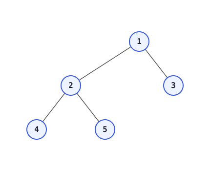

Pre-order walks the Vertical Order — so we go to node `1` first, so `0 -> 1`.
Then go to `2`, so `hm`:

| vlvl | -1 | 0 | 1 |
|---|---|---|---|
| nodes | 2 | 1 | 3 |

Then at `4`:

| vlvl | -2 | -1 | 0 |
|---|---|---|---|
| nodes | 4 | 2 | 1,3 |

Then at `5`:

| vlvl | -2 | -1 | 0 |
|---|---|---|---|
| nodes | 4 | 2 | 1,5 |

Then at `3`:

| vlvl | -2 | -1 | 0 | 1 |
|---|---|---|---|---|
| nodes | 4 | 2 | 1,5 | 3 |

Vertical Order is basically just choosing one way to traverse in terms of `[Pre, Post, In, Level Order]`, and then we also use a HashMap.

```java
static ArrayList<Integer> verticalSum(Node root) {
    ArrayList<Integer> res = new ArrayList<>();
    LinkedList<pair> q = new LinkedList<>();
    HashMap<Integer, Integer> hm = new HashMap<>();
    q.addLast(new pair(root, 0));
    int lside = 0;
    int rside = 0;
    while (q.size() > 0) {
        int sz = q.size();
        while (sz-- > 0) {
            pair temp = q.removeFirst();
            if (temp.vlvl < lside) lside = temp.vlvl;
            if (temp.vlvl > rside) rside = temp.vlvl;
            if (hm.containsKey(temp.vlvl) == true) {
                int val = hm.get(temp.vlvl) + temp.node.data;
                hm.put(temp.vlvl, val);
            } else {
                hm.put(temp.vlvl, temp.node.data);
            }

            if (temp.node.left != null) {
                q.addLast(new pair(temp.node.left, temp.vlvl - 1));
            }
            if (temp.node.right != null) {
                q.addLast(new pair(temp.node.right, temp.vlvl + 1));
            }
        }
    }
    for (int i = lside; i <= rside; i++) {
        res.add(hm.get(i));
    }
    return res;
}
```

```cpp
vector<int> verticalSum(Node* root) {
    vector<int> res;
    queue<pair<Node*, int>> q;
    unordered_map<int, int> hm;
    q.push({root, 0});
    int lside = 0, rside = 0;
    while (!q.empty()) {
        int sz = q.size();
        while (sz-- > 0) {
            pair<Node*, int> temp = q.front();
            q.pop();
            if (temp.second < lside) lside = temp.second;
            if (temp.second > rside) rside = temp.second;
            if (hm.find(temp.second) != hm.end()) {
                hm[temp.second] += temp.first->data;
            } else {
                hm[temp.second] = temp.first->data;
            }
            if (temp.first->left != nullptr) {
                q.push({temp.first->left, temp.second - 1});
            }
            if (temp.first->right != nullptr) {
                q.push({temp.first->right, temp.second + 1});
            }
        }
    }
    for (int i = lside; i <= rside; i++) {
        res.push_back(hm[i]);
    }
    return res;
}
```

**Time Complexity:** `O(N)` — one level-order pass, `O(1)` average HashMap operations per node.
**Space Complexity:** `O(N)` — for the queue, HashMap and result.


**Approach 2 (recursive, pre-order):**

`side` is an array (`int[2]`, holding `lside`/`rside`) because it needs to be updated inside the recursion — a plain `int` variable passed by value won't get updated across recursive calls in Java, so we pass it around in an array.

```java
class Solution {
    private static void vsum(Node root, int lvl, HashMap<Integer, Integer> hm, int[] side) {
        if (root == null) return;
        if (lvl < side[0]) side[0] = lvl;
        if (lvl > side[1]) side[1] = lvl;
        vsum(root.left, lvl - 1, hm, side);
        if (hm.containsKey(lvl) == true) {
            int val = hm.get(lvl);
            hm.put(lvl, val + root.data);
        } else {
            hm.put(lvl, root.data);
        }
        vsum(root.right, lvl + 1, hm, side);
    }

    static ArrayList<Integer> verticalSum(Node root) {
        ArrayList<Integer> res = new ArrayList<>();
        HashMap<Integer, Integer> hm = new HashMap<>();
        int[] side = new int[2];
        vsum(root, 0, hm, side);
        for (int i = side[0]; i <= side[1]; i++) {
            res.add(hm.get(i));
        }
        return res;
    }
}
```

```cpp
class Solution {
public:
    void vsum(Node* root, int lvl, unordered_map<int, int>& hm, int side[2]) {
        if (root == nullptr) return;
        if (lvl < side[0]) side[0] = lvl;
        if (lvl > side[1]) side[1] = lvl;
        vsum(root->left, lvl - 1, hm, side);
        if (hm.find(lvl) != hm.end()) {
            hm[lvl] += root->data;
        } else {
            hm[lvl] = root->data;
        }
        vsum(root->right, lvl + 1, hm, side);
    }

    vector<int> verticalSum(Node* root) {
        vector<int> res;
        unordered_map<int, int> hm;
        int side[2] = {0, 0};
        vsum(root, 0, hm, side);
        for (int i = side[0]; i <= side[1]; i++) {
            res.push_back(hm[i]);
        }
        return res;
    }
};
```

**Time Complexity:** `O(N)` — every node is visited exactly once during the recursive pre-order walk.
**Space Complexity:** `O(N)` — HashMap + `O(Height)` recursion stack (worst case `O(N)` for a skewed tree).


## 10. LeetCode 987. Vertical Order Traversal of a Binary Tree

**Difficulty:** Hard

Given the `root` of a binary tree, calculate the **vertical order traversal** of the binary tree.

For each node at position `(row, col)`, its left and right children will be at positions `(row + 1, col - 1)` and `(row + 1, col + 1)` respectively. The root of the tree is at `(0, 0)`.

The **vertical order traversal** of a binary tree is a list of top-to-bottom orderings for each column index starting from the leftmost column and ending on the rightmost column. There may be multiple nodes in the same row and same column. In such a case, sort these nodes by their values.

Return *the* **vertical order traversal** *of the binary tree.*

**Example 1:**

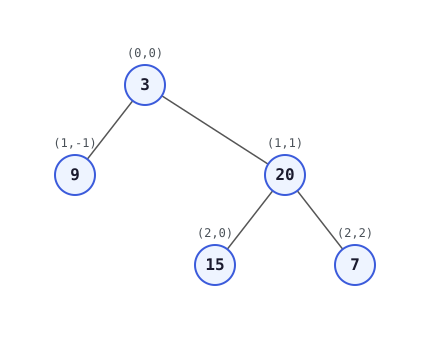

```
Input: root = [3,9,20,null,null,15,7]
Output: [[9],[3,15],[20],[7]]
Explanation:
Column -1: Only node 9 is in this column.
Column 0: Nodes 3 and 15 are in this column in that order from top to bottom.
Column 1: Only node 20 is in this column.
Column 2: Only node 7 is in this column.
```

**Example 2:**

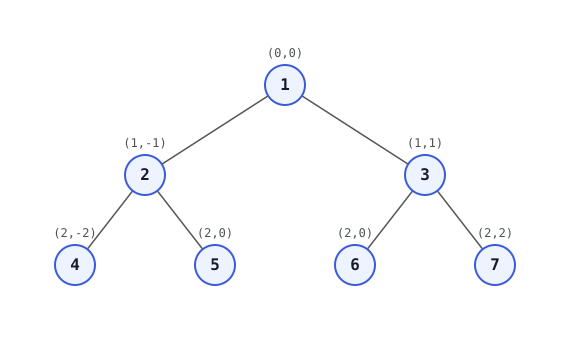

```
Input: root = [1,2,3,4,5,6,7]
Output: [[4],[2],[1,5,6],[3],[7]]
Explanation:
Column -2: Only node 4 is in this column.
Column -1: Only node 2 is in this column.
Column 0: Nodes 1, 5, and 6 are in this column.
        1 is at the top, so it comes first.
        5 and 6 are at the same position (2, 0), so we order them by
        their value, 5 before 6.
Column 1: Only node 3 is in this column.
Column 2: Only node 7 is in this column.
```

**Example 3:**

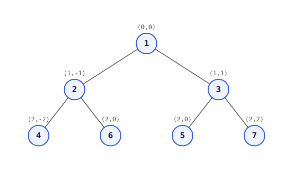

```
Input: root = [1,2,3,4,6,5,7]
Output: [[4],[2],[1,5,6],[3],[7]]
Explanation:
This case is the exact same as example 2, but with nodes 5 and 6 swapped.
Note that the solution remains the same since 5 and 6 are in the same
location and should be ordered by their values.
```

We need sorted order if at same level & column.


**Attempted code (this is the version discussed in the notes — level order with `(node, vertical_level)` pairs and a `HashMap<Integer, List<Integer>>`, appending in the order nodes are popped from the queue):**

```java
public List<List<Integer>> verticalTraversal(TreeNode root) {
    List<List<Integer>> res = new ArrayList<>();
    LinkedList<pair> q = new LinkedList<>();
    HashMap<Integer, List<Integer>> hm = new HashMap<>();
    q.addLast(new pair(root, 0));
    int lside = 0;
    int rside = 0;
    while (q.size() > 0) {
        int sz = q.size();
        while (sz-- > 0) {
            pair temp = q.removeFirst();
            if (temp.vlvl < lside) lside = temp.vlvl;
            if (temp.vlvl > rside) rside = temp.vlvl;
            if (hm.containsKey(temp.vlvl) == true) {
                hm.get(temp.vlvl).add(temp.node.val);
            } else {
                List<Integer> t = new ArrayList<>();
                t.add(temp.node.val);
                hm.put(temp.vlvl, t);
            }

            if (temp.node.right != null) {
                q.addLast(new pair(temp.node.right, temp.vlvl + 1));
            }

            if (temp.node.left != null) {
                q.addLast(new pair(temp.node.left, temp.vlvl - 1));
            }
        }
    }
    for (int i = lside; i <= rside; i++) {
        res.add(hm.get(i));
    }
    return res;
}
```

```cpp
vector<vector<int>> verticalTraversal(TreeNode* root) {
    vector<vector<int>> res;
    queue<pair<TreeNode*, int>> q;
    unordered_map<int, vector<int>> hm;
    q.push({root, 0});
    int lside = 0, rside = 0;
    while (!q.empty()) {
        int sz = q.size();
        while (sz-- > 0) {
            pair<TreeNode*, int> temp = q.front();
            q.pop();
            if (temp.second < lside) lside = temp.second;
            if (temp.second > rside) rside = temp.second;
            if (hm.find(temp.second) != hm.end()) {
                hm[temp.second].push_back(temp.first->val);
            } else {
                hm[temp.second] = {temp.first->val};
            }

            if (temp.first->right != nullptr) {
                q.push({temp.first->right, temp.second + 1});
            }
            if (temp.first->left != nullptr) {
                q.push({temp.first->left, temp.second - 1});
            }
        }
    }
    for (int i = lside; i <= rside; i++) {
        res.push_back(hm[i]);
    }
    return res;
}
```

**Result on submission: Wrong Answer.**

* When the **right** node is pushed 1st to the queue:
  Input `[1,2,3,4,5,6,7]` → Output `[[4],[2],[1,6,5],[3],[7]]`, Expected `[[4],[2],[1,5,6],[3],[7]]` — sorted here, there is same column, same row.
* When the **left** node is pushed 1st to the queue (16/32 test cases passed):
  Input `[1,2,3,4,6,5,7]` → Output `[[4],[2],[1,6,5],[3],[7]]`, Expected `[[4],[2],[1,5,6],[3],[7]]` — sorted here changes because left/right table order needs to be sorted, doesn't happen.

The bug: level order only guarantees *insertion* order for nodes that land on the same `(row, col)`, not *value* order. LeetCode 987 explicitly requires that ties at the same `(row, col)` be broken by node value, so a plain level-order `HashMap<Integer, List<Integer>>` (as coded above) is not enough by itself — the list collected per vertical level still needs to be sorted by value wherever multiple nodes share both the same row and the same column. This is exactly where the notes stop:


  ## 11. LeetCode 103. Binary Tree Zigzag Level Order Traversal

**Difficulty:** Medium

---

#### **Problem Description**
Given the `root` of a binary tree, return the **zigzag level order traversal** of its nodes' values. (i.e., from left to right, then right to left for the next level and alternate between).

---

#### **Examples**

**Example 1:**


* **Input:** `root = [3,9,20,null,null,15,7]`
* **Output:** `[[3],[20,9],[15,7]]`
* **Explanation:** * Level 1 (Left to Right): `[3]`
    * Level 2 (Right to Left): `[20, 9]`
    * Level 3 (Left to Right): `[15, 7]`

**Example 2:**
* **Input:** `root = [1]`
* **Output:** `[[1]]`

**Example 3:**
* **Input:** `root = []`
* **Output:** `[]`

---

#### **Constraints**
* The number of nodes in the tree is in the range `[0, 2000]`.
* `-100 <= Node.val <= 100`

```cpp
/**
 * Definition for a binary tree node.
 * struct TreeNode {
 *     int data;
 *     TreeNode *left;
 *     TreeNode *right;
 *      TreeNode(int val) : data(val) , left(nullptr) , right(nullptr) {}
 * };
 **/

class Solution {
public:
    vector<vector<int> > zigzagLevelOrder(TreeNode* root) {
        vector<vector<int> > res;
        if(root==nullptr) return res;
        queue<TreeNode *> q;
        q.push(root);
        int lvl=1;
        while(q.size()>0){
            int sz=q.size();
            vector<int> tres;
            while(sz-->0){
                TreeNode * node=q.front();
                q.pop();
                tres.push_back(node->data);
                if(node->left!=nullptr) q.push(node->left);
                if(node->right!=nullptr) q.push(node->right);
            }
           if(lvl%2!=1) reverse(tres.begin(),tres.end());
           res.push_back(tres);
           lvl++;
        }
        return res;
    }
};
```

```java
/**
 * Definition for a binary tree node.
 * public class TreeNode {
 *     int data;
 *     TreeNode left;
 *     TreeNode right;
 *      TreeNode(int val) { data = val; left = null; right = null; }
 * }
 **/

class Solution {
    public List<List<Integer>> zigzagLevelOrder(TreeNode root) {
        List<List<Integer>> res = new ArrayList<>();
        if (root == null) return res;
        LinkedList<TreeNode> q = new LinkedList<>();
        q.addLast(root);
        int lvl = 1;
        while (q.size() > 0) {
            int sz = q.size();
            List<Integer> tres = new ArrayList<>();
            while (sz-- > 0) {
                TreeNode node = q.removeFirst();
                tres.add(node.data);
                if (node.left != null) q.addLast(node.left);
                if (node.right != null) q.addLast(node.right);
            }
            if (lvl % 2 != 1) Collections.reverse(tres);
            res.add(tres);
            lvl++;
        }
        return res;
    }
}
```

**Time Complexity:** `O(N)` — a normal level order traversal visits every node once; reversing a level's list costs `O(size of that level)`, and the levels sum to `O(N)` overall.
**Space Complexity:** `O(N)` — the queue holds at most one level, and the result stores every node.