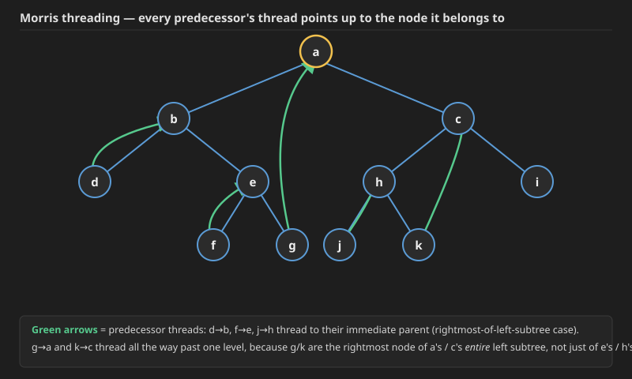
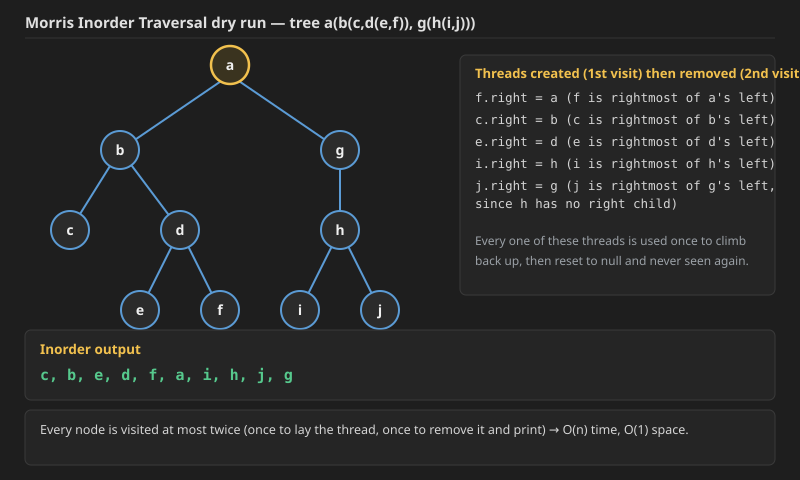
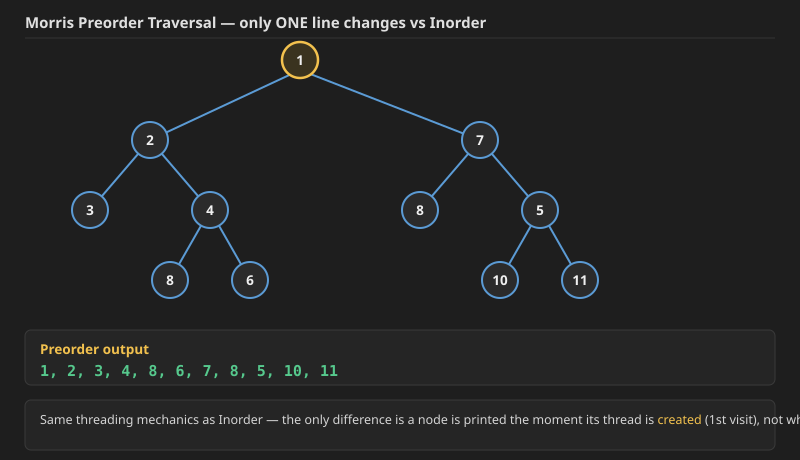

## Q1. Find Bottom Left Tree Value (LeetCode 513)

**Problem:** Given the `root` of a binary tree, return the leftmost value in the last row of the tree.

**Example:**
```
Input: root = [2,1,3]
Output: 1
```
```
Input: root = [1,2,3,4,null,5,6,null,null,7]
Output: 7
```

**Constraints:**
- The number of nodes in the tree is in the range `[1, 10^4]`.
- `-2^31 <= Node.val <= 2^31 - 1`

This is also usable as an alternative approach for the "left view of a binary tree" style question (specifically the leaf-level / last-row case), since the leftmost node of the last level is exactly the leftmost value visible when the tree is viewed from the left.

**Approach — level order (BFS):** Do a normal level-order traversal. At the start of every level, the first node dequeued (`i == 0`) is the leftmost node of that level. Keep overwriting the answer with this "first node of the level" value — whatever it is on the **last** level is the answer. Because the whole tree is scanned level by level, the leaf-level's first entry is captured automatically without needing to know in advance which level is the last one.

## code 1
```java
public int findBottomLeftValue(TreeNode root) {
    LinkedList<TreeNode> q = new LinkedList<>();
    q.addLast(root);
    int res = root.val;
    while (q.size() > 0) {
        int size = q.size();
        for (int i = 0; i < size; i++) {
            TreeNode temp = q.removeFirst();
            if (i == 0) res = temp.val;
            if (temp.left != null) {
                q.addLast(temp.left);
            }
            if (temp.right != null) {
                q.addLast(temp.right);
            }
        }
    }
    return res;
}
```
## Code 2
```cpp
int findBottomLeftValue(TreeNode* root) {
    queue<TreeNode*> q;
    q.push(root);
    int res = root->val;
    while (!q.empty()) {
        int size = q.size();
        for (int i = 0; i < size; i++) {
            TreeNode* temp = q.front();
            q.pop();
            if (i == 0) res = temp->val;
            if (temp->left != nullptr) {
                q.push(temp->left);
            }
            if (temp->right != nullptr) {
                q.push(temp->right);
            }
        }
    }
    return res;
}
```

initially i have put condition ` if (i == 0) res = temp.val;` instead of  `if (i == 0 && temp.right == null && temp.left == null) res = temp.val;` in code1

the condition `if (i == 0 && temp.right == null && temp.left == null) res = temp.val;` (only update on a leaf) is unnecessary — simply overwriting `res` with the first node's value on every level already works, because the last time this happens is on the deepest level, and the first node of the deepest level is always a leaf anyway.


**Time Complexity: `O(n)`** — every node is enqueued and dequeued exactly once, regardless of tree shape.
**Space Complexity: `O(w)`** where `w` is the maximum width of the tree (the queue never holds more nodes than the widest level); in the worst case (a perfectly balanced tree) this is `O(n)`.


**Quick facts:**
- `TreeMap` works like `HashMap`, but internally it is backed by a BST (Red-Black Tree). So where `HashMap` gives `O(1)` average time complexity for operations, `TreeMap` gives `O(log n)` — but it keeps keys sorted. Good to know.
- Boundary Traversal is `O(n)` as a whole (even though it looks like 3 separate passes — left boundary, leaves, right boundary — each node is visited a constant number of times overall).
- Diagonal Traversal is also `O(n)`.

## Q2. Binary Tree Coloring Game (LeetCode 1145)

.jpg)

**Problem:** Two players play a turn based game on a binary tree. We are given the `root` of this binary tree, and the number of nodes `n` in the tree. `n` is odd, and each node has a distinct value from `1` to `n`.

Initially, the first player names a value `x` with `1 <= x <= n`, and the second player names a value `y` with `1 <= y <= n` and `y != x`. The first player colors the node with value `x` red, and the second player colors the node with value `y` blue.

Then, the players take turns starting with the first player. In each turn, that player chooses a node of their color (red if player 1, blue if player 2) and colors an **uncolored** neighbor of the chosen node (either the left child, right child, or parent of the chosen node.)

If (and only if) a player cannot choose such a node in this way, they must pass their turn. If both players pass their turn, the game ends, and the winner is the player that colored more nodes.

You are the second player. If it is possible to choose such a `y` to ensure you win the game, return `true`. If it is not possible, return `false`.

**Example 1:**
```
Input: root = [1,2,3,4,5,6,7,8,9,10,11], n = 11, x = 3
Output: true
Explanation: The second player can choose the node with value 2.
```

**Example 2:**
```
Input: root = [1,2,3], n = 3, x = 1
Output: false
```

**Constraints:**
- The number of nodes in the tree is `n`.
- `1 <= x <= n <= 100`
- `n` is odd.
- `1 <= Node.val <= n`
- All the values of the tree are **unique**.

**Reasoning:** Once player 1 colors node `x` red, that single node splits the rest of the tree into exactly **three disconnected regions** (since every other node can only ever be reached by expanding from a node that's already colored, and every path to a node outside `x` must pass through one of `x`'s three "directions"):
1. `x`'s left subtree (size = number of nodes in it),
2. `x`'s right subtree (size = number of nodes in it),
3. everything above `x` — i.e. the rest of the tree once `x`'s whole subtree is removed (size = `n - leftSize - rightSize - 1`).

Once red spreads from `x`, it can only ever fully claim the region(s) it started expanding into — it can never cross into a region that blue has already started filling, and vice versa. So whichever player's color starts inside the **largest** of these three regions can flood that entire region and is guaranteed to own more than half of the remaining `n - 1` nodes, hence more nodes overall (since `n` is odd, there's no tie).

So the second player wins if and only if they can find a neighbor of `x` — a node that is the root of one of these three regions — belonging to the largest region, i.e. `max(leftSize, rightSize, n - 1 - leftSize - rightSize) > n / 2`.

.jpg)
.jpg) .jpg) .jpg) 

**Java:**
```java
class Solution {
    private int size(TreeNode root, int x, int[] sz) {
        if (root == null) return 0;
        int lres = size(root.left, x, sz);
        int rres = size(root.right, x, sz);
        if (root.val == x) {
            sz[0] = lres;
            sz[1] = rres;
        }
        return lres + rres + 1;
    }

    public boolean btreeGameWinningMove(TreeNode root, int n, int x) {
        int[] sz = new int[3];
        size(root, x, sz);
        sz[2] = n - (sz[0] + sz[1] + 1);
        int mxval = Math.max(sz[0], Math.max(sz[1], sz[2]));
        int restval = n - mxval;
        return mxval > restval ? true : false;
    }
}
```

**C++:**
```cpp
class Solution {
    int size(TreeNode* root, int x, vector<int>& sz) {
        if (root == nullptr) return 0;
        int lres = size(root->left, x, sz);
        int rres = size(root->right, x, sz);
        if (root->val == x) {
            sz[0] = lres;
            sz[1] = rres;
        }
        return lres + rres + 1;
    }

public:
    bool btreeGameWinningMove(TreeNode* root, int n, int x) {
        vector<int> sz(3, 0);
        size(root, x, sz);
        sz[2] = n - (sz[0] + sz[1] + 1);
        int mxval = max({sz[0], sz[1], sz[2]});
        int restval = n - mxval;
        return mxval > restval;
    }
};
```

Here `size()` is one single recursive pass that computes the size of `x`'s left subtree and right subtree (storing them into `sz[0]` and `sz[1]` the moment it happens to visit `x`), while also returning the size of *whatever subtree it's currently called on* so the parent call can keep accumulating the total. `sz[2]` (the "region above x") is then just `n` minus everything inside `x`'s own subtree.

**Dry run** (`root = [1,2,3,4,5,6,7,8,9,10,11]`, `n = 11`, `x = 3`):
```
              1
          /       \
         2         3
        / \       / \
       4   5     6   7
      / \  / \
     8  9 10 11
```
- `x = 3`. Left subtree of 3 = node 6 → size 1. Right subtree of 3 = node 7 → size 1.
- Region above 3 = `11 - (1 + 1 + 1) = 8` (this is the whole rest of the tree: 1, 2, 4, 5, 8, 9, 10, 11).
- `max(1, 1, 8) = 8`, `restval = 11 - 8 = 3`.
- `8 > 3` → **true**. The second player picks node 2 (any node in the 8-node region works) and floods that entire region, winning 8 nodes to 3.

**Time Complexity: `O(n)`** — a single normal recursive traversal of every node (Pre/In/Post order all give `O(n)` here, since it's the standard "visit each node once" recursion).
**Space Complexity: `O(h)`** — the recursion stack depth equals the height of the tree.


 

### Mnemonics for Preorder, Inorder and Postorder

Using this tree as an example:
```
              a
            /   \
           b     c
          / \   / \
         d   e f   ?
                (only f exists under c here for the postorder example below)
```

**Preorder (Node → Left → Right):** think of it as tracing the outline of the tree from the top, going left-to-right, top-to-bottom, writing down a node's label the *first* time your pen visits it (before dipping down into its children).

For a tree `a(b(d, e), c(f, e2))` (using `f`, `e2` as leaf labels for illustration): tracing top-down, left-to-right and recording each node the first time it's touched gives `a, b, d, e2(under b's e branch is e itself if it's a leaf) ...` — the point of the mnemonic is: **you write a node down exactly when you first arrive at it**, before its children.

**Inorder (Left → Node → Right):** put a "mirror" flat on the ground directly below the tree and simply write down, left-to-right, every node as it appears reflected downward into the mirror (i.e. drop every node straight down onto a single line, keeping left-to-right order). For the tree `a(b(d, e), c(f))`, dropping every node straight down gives, left to right: `d, b, e, a, f, c` — that is exactly the Inorder traversal.

**Postorder (Left → Right → Node):** repeatedly **remove the leftmost leaf** of the tree and write down its value — the order in which leaves get removed this way is exactly the Postorder sequence. Walking through `a(b(d, e), c(f))`:
1. Leftmost leaf is `d` → remove it → output so far: `d`
2. Leftmost leaf is now `e` → remove it → output: `d, e`
3. `b` has become a leaf (no children left) and is now the leftmost leaf → remove it → output: `d, e, b`
4. Leftmost leaf is now `f` → remove it → output: `d, e, b, f`
5. `c` is now a leaf → remove it → output: `d, e, b, f, c`
6. Only `a` is left → remove it → output: `d, e, b, f, c, a`

Final Postorder: `d, e, b, f, c, a` — matching the direct recursive definition (Left, Right, Node).

### Why Morris Traversal needs "Inorder Successor" / threading

Without recursion or a stack, once we go **left** from a node, we lose the ability to naturally "come back up" to that node afterwards — there's no call stack remembering the path. Morris Traversal solves this by temporarily **threading** the tree: before moving into a node's left subtree, it finds that node's **Inorder Predecessor** (the rightmost node inside the left subtree — the node that would be visited immediately before the current node in a normal inorder traversal) and makes that predecessor's `right` pointer temporarily point back up to the current node.

This threaded link is exactly what lets the traversal "climb back up" later without any stack — when the traversal reaches the predecessor node (which normally has no right child), it now finds its `right` pointer already pointing at the ancestor it needs to return to. Once that thread has served its purpose, it is removed (set back to `null`), restoring the original tree shape.

- **Inorder Successor** of a node = the **leftmost node of its right subtree** (if it has a right child), or the nearest ancestor for which this node lies in the left subtree (if it doesn't).
- **Inorder Predecessor** of a node = the **rightmost node of its left subtree** (if it has a left child), or the nearest ancestor for which this node lies in the right subtree (if it doesn't).

Morris Traversal only ever needs the first case of each (rightmost-of-left-subtree / leftmost-of-right-subtree) — it never needs to search upward through ancestors, because the thread itself takes care of "returning" to the right ancestor.

Here is a tree with every predecessor-thread drawn in (green arrows point from a node to the ancestor whose predecessor it is):



- `d` is the rightmost (in fact, only) node in `b`'s left subtree → `d`'s thread points up to `b`.
- `g` is the rightmost node in `a`'s **entire** left subtree (`b`'s subtree) → `g`'s thread points all the way up to `a`.
- `f` is the rightmost node in `e`'s left subtree → `f`'s thread points up to `e`.
- `j` is the rightmost node in `h`'s left subtree → `j`'s thread points up to `h`.
- `k` is the rightmost node in `c`'s entire left subtree (`h`'s subtree) → `k`'s thread points all the way up to `c`.

So concretely, tracing a normal Inorder walk over this tree: `a → b → d`, and to get back up to `b` after `d`, the thread `d → b` is used; from `b` we go right to `e`, then left to `f`, and the thread `f → e` brings us back to `e`; and so on, all the way up: the thread `g → a` is what eventually brings the traversal back to `a` itself once the entire left subtree is exhausted.

### How do we know if a node's left subtree is already threaded (already visited) or not?

Look at its Inorder Predecessor's `right` pointer:
- If `predecessor.right == null` → **not threaded yet**. This is our first visit to the current node — create the thread (`predecessor.right = currentNode`) and move into the left subtree.
- If `predecessor.right == currentNode` (i.e. not `null`) → **already threaded**, meaning we already traversed the left subtree once and have now arrived back via the thread. This is our second visit — remove the thread (`predecessor.right = null`, restoring the tree) and move on to the right subtree.


---

## Q3. Find Inorder Predecessor and Successor in a BST

See this code is of Find inorder predecessor and succesor in BST 

```cpp
/**
 * Definition for a binary tree node.
 * struct TreeNode {
 *     int data;
 *     TreeNode *left;
 *     TreeNode *right;
 *      TreeNode(int val) : data(val) , left(nullptr) , right(nullptr) {}
 * };
 **/

class Solution {
    TreeNode* ancpred = nullptr;
    TreeNode* ancsucc = nullptr;
    TreeNode* inorderPred(TreeNode* node) {
        if (node->left == nullptr) return nullptr;
        TreeNode* curr = node->left;
        while (curr->right != nullptr) curr = curr->right;
        return curr;
    }
    TreeNode* inorderSucc(TreeNode* node) {
        if (node->right == nullptr) return nullptr;
        TreeNode* curr = node->right;
        while (curr->left != nullptr) curr = curr->left;
        return curr;
    }
    TreeNode* find(TreeNode* root, int val) {
        if (root == nullptr) return root;
        if (val == root->data) return root;
        if (val > root->data) {
            ancpred = root;
            return find(root->right, val);
        } else {
            ancsucc = root;
            return find(root->left, val);
        }
    }

   public:
    vector<int> succPredBST(TreeNode* root, int key) {
        TreeNode* node = find(root, key);
        vector<int> res(2, -1);
        TreeNode* pred = inorderPred(node);
        TreeNode* succ = inorderSucc(node);
        if (pred != nullptr)
            res[0] = pred->data;
        else if (ancpred != nullptr)
            res[0] = ancpred->data;
        if (succ != nullptr)
            res[1] = succ->data;
        else if (ancsucc != nullptr)
            res[1] = ancsucc->data;
        return res;
    }
};
```
### Scope Difference (The "Ancestor" Problem)

**1. General Predecessor (Global):**
* If a node has no left child, its "Predecessor" is actually one of its **ancestors (parents)** further up the tree.
* **Example:** In a tree `1 -> 2` (2 is the right child), the predecessor of 2 is 1. Standard logic usually requires a stack or parent pointers to find this.

**2. Morris Predecessor (Local):**
* The Morris algorithm only looks for a predecessor **inside the left subtree**.
* If `curr->left` is `NULL`, Morris says "No predecessor logic needed here," and simply moves to the right.
* It does **not** attempt to find the ancestor-predecessor.


### In the context of the Morris Traversal algorithm, the "Predecessor" logic never looks up to ancestors. It is strictly limited to the Left Subtree.

Here is the precise distinction that confirms your statement:

---

### 1. General Inorder Predecessor (The Mathematical Definition)
If you ask for the inorder predecessor of a node `X`:

* **Case A (Has Left Child):** It is the **rightmost** node in `X`'s left subtree.
* **Case B (No Left Child):** It is the **nearest ancestor** where `X` is in the right subtree.

---

### 2. Morris Predecessor (The Algorithmic Step)
The helper function inside Morris Traversal `getPredecessor(curr)` only handles **Case A**.

* **Logic:** It goes to `curr->left`, then keeps going right until the end.

#### Why no Ancestors?
If `curr` has **no left child (Case B)**, the Morris algorithm **doesn't look for a predecessor at all.**
* It simply says: *"No left child? Okay, print curr and move to `curr->right`."*
* It relies on the **thread** created previously (by the ancestor) to have brought us here, but it does not actively search back for that ancestor.


## Q4. Morris Inorder Traversal (LeetCode 94 — Binary Tree Inorder Traversal, `O(1)` space)

**Problem:** Given the `root` of a binary tree, return the inorder traversal of its nodes' values, using `O(1)` extra space (i.e. without recursion or an explicit stack).

**The algorithm, step by step, at any node `curr`:**
1. If `curr.left == null`: there's nothing to thread, so simply visit (print/collect) `curr`, then move to `curr.right`.
2. If `curr.left != null`: find `curr`'s Inorder Predecessor (rightmost node of `curr`'s left subtree).
   - If `predecessor.right == null` (not threaded yet — first visit to `curr`): create the thread `predecessor.right = curr`, then move to `curr.left` **without** visiting `curr` yet (we haven't finished its left subtree).
   - If `predecessor.right == curr` (already threaded — second visit to `curr`, we've come back up via the thread after finishing the left subtree): remove the thread (`predecessor.right = null`), **now** visit `curr`, then move to `curr.right`.

This matches `Inorder -> Left, Node, Right` exactly: the node is only ever printed on the "second" visit — after its left subtree is fully done — never on the first visit (when we're just passing through on the way down).

**Dry run** on `a(b(c, d(e, f)), g(h(i, j)))`:

| Step | At node | Action |
|---|---|---|
| 1 | `a` | `a.left != null`. Predecessor = `f` (rightmost of `a`'s left subtree). `f.right == null` → thread `f.right = a`, move to `b`. |
| 2 | `b` | `b.left != null`. Predecessor = `c`. `c.right == null` → thread `c.right = b`, move to `c`. |
| 3 | `c` | `c.left == null` → **print `c`**, move to `c.right` = `b` (via thread). |
| 4 | `b` (2nd visit) | Predecessor = `c`, `c.right == b` (threaded) → remove thread (`c.right = null`), **print `b`**, move to `b.right` = `d`. |
| 5 | `d` | `d.left != null`. Predecessor = `e`. `e.right == null` → thread `e.right = d`, move to `e`. |
| 6 | `e` | `e.left == null` → **print `e`**, move to `e.right` = `d` (via thread). |
| 7 | `d` (2nd visit) | Predecessor = `e`, `e.right == d` → remove thread, **print `d`**, move to `d.right` = `f`. |
| 8 | `f` | `f.left == null` → **print `f`**, move to `f.right` = `a` (via thread). |
| 9 | `a` (2nd visit) | Predecessor = `f`, `f.right == a` → remove thread, **print `a`**, move to `a.right` = `g`. |
| 10 | `g` | `g.left != null`. Predecessor = `j` (rightmost of `g`'s left subtree, i.e. of `h`'s subtree, since `h` has no right child). `j.right == null` → thread `j.right = g`, move to `h`. |
| 11 | `h` | `h.left != null`. Predecessor = `i`. `i.right == null` → thread `i.right = h`, move to `i`. |
| 12 | `i` | `i.left == null` → **print `i`**, move to `i.right` = `h` (via thread). |
| 13 | `h` (2nd visit) | Predecessor = `i`, `i.right == h` → remove thread, **print `h`**, move to `h.right` = `j`. |
| 14 | `j` | `j.left == null` → **print `j`**, move to `j.right` = `g` (via thread). |
| 15 | `g` (2nd visit) | Predecessor = `j`, `j.right == g` → remove thread, **print `g`**, move to `g.right` = `null`. Loop ends. |

**Final Inorder output: `c, b, e, d, f, a, i, h, j, g`**



**Java:**
```java
class Solution {
    private TreeNode findInorderPred(TreeNode curr) {
        TreeNode inOrderPred = curr.left;
        while (inOrderPred.right != null && inOrderPred.right != curr) {
            inOrderPred = inOrderPred.right;
        }
        return inOrderPred;
    }

    public List<Integer> inorderTraversal(TreeNode root) {
        List<Integer> res = new ArrayList<>();
        TreeNode curr = root;
        while (curr != null) {
            if (curr.left == null) {
                res.add(curr.val);
                curr = curr.right;
            } else {
                TreeNode inOrderPred = findInorderPred(curr);
                if (inOrderPred.right == null) {
                    inOrderPred.right = curr;
                    curr = curr.left;
                } else {
                    inOrderPred.right = null;
                    res.add(curr.val);
                    curr = curr.right;
                }
            }
        }
        return res;
    }
}
```

**Time Complexity: `O(n)`** — every node is visited at most twice: once while the `findInorderPred` walk passes over it on the way to laying a thread, and once when it is directly processed. The `findInorderPred` walk itself looks expensive (it's a `while` loop), but summed across the *whole* traversal, each edge in the tree is only ever walked over a constant number of times, so the total work stays `O(n)`, not `O(n^2)`.
**Space Complexity: `O(1)`** — no recursion, no stack/queue; only pointers, regardless of the tree's height.

For comparison, the recursive version of Inorder Traversal has the same `O(n)` time complexity, but its space complexity is `O(h)` (height of the tree) due to the call stack — Morris Traversal is what gets that down to true `O(1)`.


### Inorder morris
```cpp

class Solution {
private:
TreeNode * getInorderPredecessor(TreeNode * node){
    TreeNode *tnode=node->left;
    while(tnode->right!=nullptr && tnode->right!=node) tnode=tnode->right;
    return tnode;
}
public:
    vector<int> getInorder(TreeNode* root) {
    	vector<int> res;
        TreeNode * curr=root;
        while(curr!=nullptr){
            if(curr->left==nullptr){
                res.push_back(curr->data);
                curr=curr->right;
            }else {
                TreeNode *inorderPredecessor=getInorderPredecessor(curr);
                if(inorderPredecessor->right==nullptr){
                    //need to traverse

                    //res.push_back(curr->data);
                    inorderPredecessor->right=curr;
                    curr=curr->left;
                }else{
                    //already traversed

                    inorderPredecessor->right=nullptr;

                    //as inorder is L N R so to print current node if left tree is there we must
                    //travel left tree so that's why putting the data here

                    //if it was preorder then need to uncomment line 45 as that is N L R 
                    // so node 1st traversed then we go to left subtree so print in untraversed part
                    res.push_back(curr->data);
                    curr=curr->right;
                }
            }
        }
        return res;
    }
};

```

**Java** (same logic as the C++ above, added here since only C++ existed):
```java
class Solution {
    private TreeNode getInorderPredecessor(TreeNode node) {
        TreeNode tnode = node.left;
        while (tnode.right != null && tnode.right != node) tnode = tnode.right;
        return tnode;
    }

    public List<Integer> getInorder(TreeNode root) {
        List<Integer> res = new ArrayList<>();
        TreeNode curr = root;
        while (curr != null) {
            if (curr.left == null) {
                res.add(curr.data);
                curr = curr.right;
            } else {
                TreeNode inorderPredecessor = getInorderPredecessor(curr);
                if (inorderPredecessor.right == null) {
                    // need to traverse
                    inorderPredecessor.right = curr;
                    curr = curr.left;
                } else {
                    // already traversed
                    inorderPredecessor.right = null;
                    res.add(curr.data);
                    curr = curr.right;
                }
            }
        }
        return res;
    }
}
```

**Time Complexity: `O(n)`** (every node visited a constant number of times). **Space Complexity: `O(1)`** (no recursion/stack, just pointers). See the full worked dry run and theory for this exact algorithm in Q4 above.

## Q5. Morris Preorder Traversal (LeetCode 144 — Binary Tree Preorder Traversal, `O(1)` space)

**Problem:** Given the `root` of a binary tree, return the preorder traversal of its nodes' values, using `O(1)` extra space.

There is exactly **one** difference from Morris Inorder Traversal: since Preorder is `Node -> Left -> Right`, the current node must be printed **before** descending into its left subtree, not after coming back up from it. Concretely, that means moving the "visit" line from the *else* branch (second visit / thread removal) to the *if* branch (first visit / thread creation) of the threading step. The "no left child" case is unchanged, since there both traversals print immediately.

**Java:**
```java
class Solution {
    private TreeNode findInorderPred(TreeNode curr) {
        TreeNode inOrderPred = curr.left;
        while (inOrderPred.right != null && inOrderPred.right != curr) {
            inOrderPred = inOrderPred.right;
        }
        return inOrderPred;
    }

    public List<Integer> preorderTraversal(TreeNode root) {
        List<Integer> res = new ArrayList<>();
        TreeNode curr = root;
        while (curr != null) {
            if (curr.left == null) {
                res.add(curr.val);
                curr = curr.right;
            } else {
                TreeNode inOrderPred = findInorderPred(curr);
                if (inOrderPred.right == null) {
                    res.add(curr.val);          // <-- the one line that moved, vs Inorder
                    inOrderPred.right = curr;
                    curr = curr.left;
                } else {
                    inOrderPred.right = null;
                    curr = curr.right;
                }
            }
        }
        return res;
    }
}
```

**C++:**
```cpp
class Solution {
    TreeNode* findInorderPred(TreeNode* curr) {
        TreeNode* inOrderPred = curr->left;
        while (inOrderPred->right != nullptr && inOrderPred->right != curr) {
            inOrderPred = inOrderPred->right;
        }
        return inOrderPred;
    }

public:
    vector<int> preorderTraversal(TreeNode* root) {
        vector<int> res;
        TreeNode* curr = root;
        while (curr != nullptr) {
            if (curr->left == nullptr) {
                res.push_back(curr->val);
                curr = curr->right;
            } else {
                TreeNode* inOrderPred = findInorderPred(curr);
                if (inOrderPred->right == nullptr) {
                    res.push_back(curr->val);
                    inOrderPred->right = curr;
                    curr = curr->left;
                } else {
                    inOrderPred->right = nullptr;
                    curr = curr->right;
                }
            }
        }
        return res;
    }
};
```

**Dry run** on `1(2(3,4(8,6)), 7(8,5(10,11)))`:



Walking through it: at `1`, its predecessor (rightmost of left subtree) is `6` — print `1` immediately, thread `6.right = 1`, go left to `2`. At `2`, predecessor is `3` — print `2`, thread `3.right = 2`, go left to `3`. `3` has no left child → print `3`, go right via thread back to `2`; the thread is removed (no print this time — `2` was already printed on the way down), move to `2.right = 4`. At `4`, predecessor is `8` (the one under `4`) — print `4`, thread `8.right = 4`, go to `8` → print `8` (no left child), thread back to `4`, remove thread, move to `4.right = 6` → print `6`, thread back to `1`, remove thread (no re-print of `1`), move to `1.right = 7`. Continue the same way through `7`'s subtree.

**Final Preorder output: `1, 2, 3, 4, 8, 6, 7, 8, 5, 10, 11`**

**Time Complexity: `O(n)`. Space Complexity: `O(1)`** — identical reasoning to Morris Inorder Traversal (Q4); only the position of one line differs.

## Q6. Recover Binary Search Tree (LeetCode 99)

**Problem:** You are given the `root` of a binary search tree (BST), where the values of **exactly two** nodes of the tree were swapped by mistake. Recover the tree **without changing its structure**.

**Example 1:**
```
Input: root = [1,3,null,null,2]
Output: [3,1,null,null,2]
Explanation: 3 cannot be a left child of 1 because 3 > 1. Swapping 1 and 3 makes the BST valid.
```

**Example 2:**
```
Input: root = [3,1,4,null,null,2]
Output: [2,1,4,null,null,3]
Explanation: 2 cannot be in the right subtree of 3 because 2 < 3. Swapping 2 and 3 makes the BST valid.
```

**Constraints:**
- The number of nodes in the tree is in the range `[2, 1000]`.
- `-2^31 <= Node.val <= 2^31 - 1`

**Follow up:** A solution using `O(n)` space is pretty straight-forward. Could you devise a constant `O(1)` space solution?

**Hint:** A BST's inorder traversal is strictly increasing. So looking at the inorder sequence, wherever two consecutive elements are **not** increasing is exactly where something is wrong. So keep a `prev` pointer while walking the inorder sequence and compare it against `curr` at every step — if `curr.val < prev.val`, that's a violation (`curr` should always be greater than `prev` in a valid BST).

**Example tree used for the dry run** (`root = [50,70,75,12,37,62,87,null,null,30,40,60,25]`):
```
                 50
              /      \
            70        75
           /  \       /  \
         12    37    62   87
              /  \   /  \
            30   40 60   25
```

Its inorder sequence is: `12, 70, 30, 37, 40, 50, 60, 62, 25, 75, 87`.

**Dry run** (comparing every consecutive pair, `prev` then `curr`):

| prev, curr | Comparison | Result |
|---|---|---|
| 12, 70 | `70 > 12` | fine |
| 70, 30 | `30 < 70` | **1st violation** → `n1 = prev = 70`, `n2 = curr = 30` |
| 30, 37 | `37 > 30` | fine |
| 37, 40 | `40 > 37` | fine |
| 40, 50 | `50 > 40` | fine |
| 50, 60 | `60 > 50` | fine |
| 60, 62 | `62 > 60` | fine |
| 62, 25 | `25 < 62` | **2nd violation** → `n2 = curr = 25` (only `n2` is updated this time, `n1` stays `70`) |
| 25, 75 | `75 > 25` | fine |
| 75, 87 | `87 > 75` | fine |

The two wrong nodes are `n1 = 70` and `n2 = 25` — swapping their **values** (not their positions in the tree) gives the corrected inorder sequence `12, 25, 30, 37, 40, 50, 60, 62, 70, 75, 87`, which is strictly increasing.

**Special case — adjacent swap:** If the two swapped nodes happen to be *adjacent* to each other in the inorder sequence, the violation `curr.val < prev.val` only fires **once** (there's no separate "second" violation, because the pair swapped is exactly this one `prev, curr` pair). In that case `n1` and `n2` are simply the `prev` and `curr` of that single violation — which is exactly what the algorithm below already does naturally, since `n1` and `n2` are set together the first time and only `n2` ever gets overwritten afterwards; if there's no "afterwards", they're left correctly pointing at the one bad pair.

**Approach 1 — `O(n)` space** (collect the whole inorder as a list of node references first, then scan it for violations):

```java
class Solution {
    private TreeNode findInorderPred(TreeNode curr) {
        TreeNode inOrderPred = curr.left;
        while (inOrderPred.right != null && inOrderPred.right != curr) {
            inOrderPred = inOrderPred.right;
        }
        return inOrderPred;
    }

    public void inorderTraversal(TreeNode root, List<TreeNode> res) {
        TreeNode curr = root;
        while (curr != null) {
            if (curr.left == null) {
                res.add(curr);
                curr = curr.right;
            } else {
                TreeNode inOrderPred = findInorderPred(curr);
                if (inOrderPred.right == null) {
                    inOrderPred.right = curr;
                    curr = curr.left;
                } else {
                    inOrderPred.right = null;
                    res.add(curr);
                    curr = curr.right;
                }
            }
        }
    }

    public void recoverTree(TreeNode root) {
        List<TreeNode> res = new ArrayList<>();
        inorderTraversal(root, res);
        boolean first = true;
        TreeNode t1 = null, t2 = null;
        for (int i = 1; i < res.size(); i++) {
            if (res.get(i - 1).val > res.get(i).val) {
                if (first == true) {
                    t1 = res.get(i);
                    t2 = res.get(i - 1);
                    first = false;
                } else {
                    t1 = res.get(i);
                }
            }
        }
        int temp = t1.val;
        t1.val = t2.val;
        t2.val = temp;
    }
}
```

```cpp
class Solution {
    TreeNode* findInorderPred(TreeNode* curr) {
        TreeNode* inOrderPred = curr->left;
        while (inOrderPred->right != nullptr && inOrderPred->right != curr) {
            inOrderPred = inOrderPred->right;
        }
        return inOrderPred;
    }

    void inorderTraversal(TreeNode* root, vector<TreeNode*>& res) {
        TreeNode* curr = root;
        while (curr != nullptr) {
            if (curr->left == nullptr) {
                res.push_back(curr);
                curr = curr->right;
            } else {
                TreeNode* inOrderPred = findInorderPred(curr);
                if (inOrderPred->right == nullptr) {
                    inOrderPred->right = curr;
                    curr = curr->left;
                } else {
                    inOrderPred->right = nullptr;
                    res.push_back(curr);
                    curr = curr->right;
                }
            }
        }
    }

public:
    void recoverTree(TreeNode* root) {
        vector<TreeNode*> res;
        inorderTraversal(root, res);
        bool first = true;
        TreeNode *t1 = nullptr, *t2 = nullptr;
        for (int i = 1; i < (int)res.size(); i++) {
            if (res[i - 1]->val > res[i]->val) {
                if (first) {
                    t1 = res[i];
                    t2 = res[i - 1];
                    first = false;
                } else {
                    t1 = res[i];
                }
            }
        }
        int temp = t1->val;
        t1->val = t2->val;
        t2->val = temp;
    }
};
```

Notice this still uses Morris traversal internally (to find the inorder predecessor without recursion), but it stores every node reference in a `List`/`vector` along the way, so the overall space is `O(n)`, not truly constant.

**Approach 2 — true `O(1)` space** (do the violation-check *inline*, during the Morris walk itself, using `n1`/`n2`/`prev` as instance fields instead of building a list at all):

```java
class Solution {
    TreeNode n1 = null, n2 = null, prev = null;

    private TreeNode findInorderPred(TreeNode curr) {
        TreeNode inOrderPred = curr.left;
        while (inOrderPred.right != null && inOrderPred.right != curr) {
            inOrderPred = inOrderPred.right;
        }
        return inOrderPred;
    }

    public void inorderTraversal(TreeNode root) {
        TreeNode curr = root;
        while (curr != null) {
            if (curr.left == null) {
                if (prev != null) {
                    if (curr.val < prev.val) {
                        if (n1 == null) {
                            n1 = prev;
                            n2 = curr;
                        } else n2 = curr;
                    }
                }
                prev = curr;
                curr = curr.right;
            } else {
                TreeNode inOrderPred = findInorderPred(curr);
                if (inOrderPred.right == null) {
                    inOrderPred.right = curr;
                    curr = curr.left;
                } else {
                    inOrderPred.right = null;
                    if (prev != null) {
                        if (curr.val < prev.val) {
                            if (n1 == null) {
                                n1 = prev;
                                n2 = curr;
                            } else n2 = curr;
                        }
                    }
                    prev = curr;
                    curr = curr.right;
                }
            }
        }
    }

    public void recoverTree(TreeNode root) {
        inorderTraversal(root);
        int temp = n1.val;
        n1.val = n2.val;
        n2.val = temp;
    }
}
```

```cpp
class Solution {
    TreeNode *n1 = nullptr, *n2 = nullptr, *prev = nullptr;

    TreeNode* findInorderPred(TreeNode* curr) {
        TreeNode* inOrderPred = curr->left;
        while (inOrderPred->right != nullptr && inOrderPred->right != curr) {
            inOrderPred = inOrderPred->right;
        }
        return inOrderPred;
    }

    void inorderTraversal(TreeNode* root) {
        TreeNode* curr = root;
        while (curr != nullptr) {
            if (curr->left == nullptr) {
                if (prev != nullptr && curr->val < prev->val) {
                    if (n1 == nullptr) { n1 = prev; n2 = curr; }
                    else n2 = curr;
                }
                prev = curr;
                curr = curr->right;
            } else {
                TreeNode* inOrderPred = findInorderPred(curr);
                if (inOrderPred->right == nullptr) {
                    inOrderPred->right = curr;
                    curr = curr->left;
                } else {
                    inOrderPred->right = nullptr;
                    if (prev != nullptr && curr->val < prev->val) {
                        if (n1 == nullptr) { n1 = prev; n2 = curr; }
                        else n2 = curr;
                    }
                    prev = curr;
                    curr = curr->right;
                }
            }
        }
    }

public:
    void recoverTree(TreeNode* root) {
        inorderTraversal(root);
        int temp = n1->val;
        n1->val = n2->val;
        n2->val = temp;
    }
};
```

Important detail: the violation check (`curr.val < prev.val`) must be placed exactly at the point where a node is genuinely being **visited in inorder** — i.e. right where `prev = curr; curr = curr.right;` happens — and *not* at the point where we merely decide to descend into `curr.left`. Checking there instead would compare nodes in the order we *first reach* them (which is Preorder-like), not the order they're actually visited inorder, and would give wrong violations.

**Time Complexity: `O(n)`** for both approaches (Morris traversal underneath is always `O(n)`).
**Space Complexity:** Approach 1 is `O(n)` (the `List`/`vector` of node references). Approach 2 is true `O(1)` — only a few pointers (`n1`, `n2`, `prev`) regardless of tree size, which is what the problem's follow-up asks for.

## Q7. Inorder Successor in BST (GFG)

**Problem:** Given a BST, and a reference to a Node `x` in the BST. Find the Inorder Successor of the given node in the BST.

**Example 1:**
```
Input:
      2
     / \
    1   3
K(data of x) = 2
Output: 3
Explanation:
Inorder traversal : 1 2 3
Hence, inorder successor of 2 is 3.
```

**Example 2:**
```
Input:
           20
          /  \
         8    22
        / \
       4   12
          /  \
         10   14
K(data of x) = 8
Output: 10
Explanation:
Inorder traversal: 4 8 10 12 14 20 22
Hence, successor of 8 is 10.
```

**Expected Time Complexity:** `O(Height of the BST)`.
**Expected Auxiliary Space:** `O(1)`.

**Constraints:** `1 <= N <= 1000`, where `N` is the number of nodes.

**Approach:** Run the exact same Morris Inorder walk as Q4, but instead of collecting every value, just keep a boolean flag `nextitr`. The moment we visit `x` itself (the node we were asked about), set the flag to `true`. The very next node we visit after that (in true inorder order) is, by definition, the Inorder Successor — so as soon as the flag is already `true` when we're about to visit some node, that node **is** the answer; return it immediately, before even checking whether it equals `x`.

**Java:**
```java
class Solution {
    private Node findInorderPred(Node curr) {
        Node inOrderPred = curr.left;
        while (inOrderPred.right != null && inOrderPred.right != curr) {
            inOrderPred = inOrderPred.right;
        }
        return inOrderPred;
    }

    public Node inorderSuccessor(Node root, Node x) {
        boolean nextitr = false;
        Node curr = root;
        while (curr != null) {
            if (curr.left == null) {
                if (nextitr == true) return curr;
                if (curr == x) nextitr = true;
                curr = curr.right;
            } else {
                Node inOrderPred = findInorderPred(curr);
                if (inOrderPred.right == null) {
                    inOrderPred.right = curr;
                    curr = curr.left;
                } else {
                    inOrderPred.right = null;
                    if (nextitr == true) return curr;
                    if (curr == x) nextitr = true;
                    curr = curr.right;
                }
            }
        }
        return null;
    }
}
```

**C++:**
```cpp
class Solution {
    Node* findInorderPred(Node* curr) {
        Node* inOrderPred = curr->left;
        while (inOrderPred->right != nullptr && inOrderPred->right != curr) {
            inOrderPred = inOrderPred->right;
        }
        return inOrderPred;
    }

public:
    Node* inorderSuccessor(Node* root, Node* x) {
        bool nextitr = false;
        Node* curr = root;
        while (curr != nullptr) {
            if (curr->left == nullptr) {
                if (nextitr) return curr;
                if (curr == x) nextitr = true;
                curr = curr->right;
            } else {
                Node* inOrderPred = findInorderPred(curr);
                if (inOrderPred->right == nullptr) {
                    inOrderPred->right = curr;
                    curr = curr->left;
                } else {
                    inOrderPred->right = nullptr;
                    if (nextitr) return curr;
                    if (curr == x) nextitr = true;
                    curr = curr->right;
                }
            }
        }
        return nullptr;
    }
};
```

**Dry run** (Example 2, `x` = the node with data `8`): the Morris walk visits nodes in true inorder order — `4, 8, 10, 12, 14, 20, 22`. When the visit reaches `4`, `nextitr` is still `false` and `4 != x`, so nothing changes. When it reaches `8` (which **is** `x`), `nextitr` is `false` on entry (so it doesn't return yet) but is then set to `true` right after. The next visit is `10`: this time `nextitr` is already `true`, so the function returns `10` immediately — matching the expected output. Morris traversal is a good fit here since it lets us stop the moment we find the answer, without needing extra space to store the whole inorder sequence just to find one neighbour in it.

**Time Complexity: `O(Height of the BST)`** in the sense of extra "productive" work before returning — the walk stops as soon as the successor is found — though in the worst case (when `x` is the very last node in inorder order, e.g. the maximum element with no successor) it still degenerates to a full `O(n)` traversal. **Space Complexity: `O(1)`** — Morris traversal again avoids recursion/stack entirely.


### The "Senior Engineer" Breakdown: Why Morris Traversal is Dangerous
The "issue with threads" in Morris Traversal refers to **Thread Safety (Concurrency)**, not the "threaded pointers" used by the algorithm itself. Here is why Morris Traversal is risky in a multi-threaded environment (like a web server or high-frequency trading system).

### 1. The "Physical Mutation" Risk
Most traversal algorithms (Recursion, Stack, Queue) are **Read-Only**. You can have 1,000 threads reading a tree simultaneously with a Stack approach, and they will never interfere.

**Morris Traversal is a Write operation disguised as a Read operation.**
To save space, it temporarily "rewires" the tree by changing a `null` right child to point back to the current node (creating a temporary cycle).

#### The Disaster Scenario (Race Condition)
Imagine **Thread A** is validating the BST using Morris Traversal, and **Thread B** just wants to search for a value.
1. **Thread A** is at Node 50. It finds the predecessor (Node 40) and links `40.right = 50`.
2. **Thread B** wakes up and searches for Node 45. It reaches Node 40.
3. **Thread B** checks `40.right`. In a normal tree, this is `null`. But right now, it points to 50.
4. **Thread B** follows the link to 50, thinking 50 is the right child of 40.

**Result:** Thread B enters an **Infinite Loop** (50 $\to$ 40 $\to$ 50) or returns incorrect data because the tree topology is physically broken.

### 2. The "Crash & Corrupt" Risk
What happens if a thread crashes halfway through the traversal?
* **Recursion/Stack:** The stack is reclaimed, and the tree remains untouched.
* **Morris:** If the thread dies while "temporary" links are active, those links are **never removed**.

**Result:** Your tree is now **permanently corrupted** with random cycles. The next time any code tries to traverse it, that code will crash the system.

### 3. The Performance Illusion (Cache Coherency)
Even with locks, Morris Traversal "dirties" memory pages.
* Since you are writing to pointers (changing `null` to `curr`), the CPU marks those cache lines as **modified**.
* This forces other CPU cores to invalidate their cache of the tree structure.

**The Irony:** You used Morris to save space ($O(1)$), but by mutating pointers, you triggered **Cache Coherency traffic** that might make it slower than a Stack approach in a multi-core system.

---

### Summary for Interview
> "While Morris Traversal is elegant for $O(1)$ space, it is **not thread-safe** because it mutates the tree structure during traversal. In a concurrent environment, this causes 'dirty reads' where other threads see cycles, and risks permanent corruption if the traversal crashes before restoring pointers. I would only use it in strictly single-threaded, memory-constrained environments, such as embedded systems."


