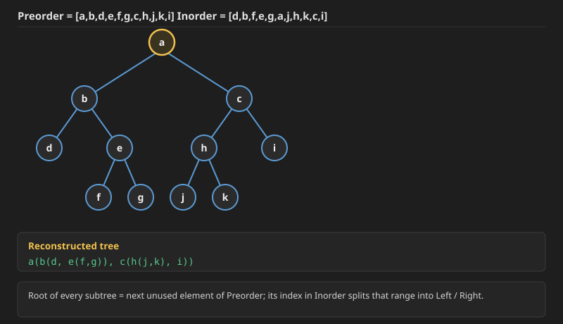
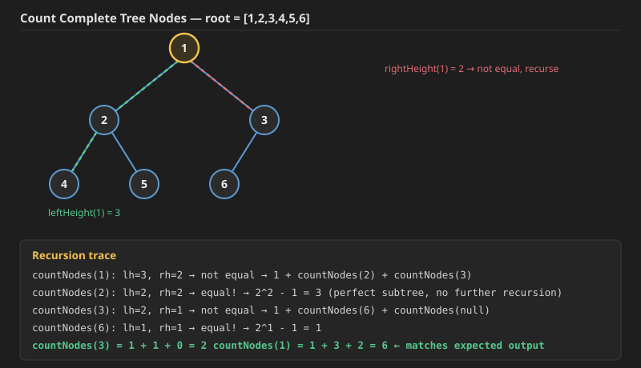

Now we move to a different flavor of tree question: given two of a tree's traversals, reconstruct the tree itself (and, along the way, derive the third traversal). Concretely:
- Given **Preorder** and **Inorder**, build the tree (Q1).
- Given **Inorder** and **Postorder**, build the tree (Q2).


## Q1. Construct Binary Tree from Preorder and Inorder Traversal (LeetCode 105)

**Problem:** Given two integer arrays `preorder` and `inorder` where `preorder` is the preorder traversal of a binary tree and `inorder` is the inorder traversal of the same tree, construct and return *the binary tree*.

**Example 1:**
```
Input: preorder = [3,9,20,15,7], inorder = [9,3,15,20,7]
Output: [3,9,20,null,null,15,7]
```
```
       3
      / \
     9   20
        /  \
       15   7
```

**Example 2:**
```
Input: preorder = [-1], inorder = [-1]
Output: [-1]
```

**Constraints:**
- `1 <= preorder.length <= 3000`
- `inorder.length == preorder.length`
- `-3000 <= preorder[i], inorder[i] <= 3000`
- `preorder` and `inorder` consist of **unique** values.
- Each value of `inorder` also appears in `preorder`.
- `preorder` is **guaranteed** to be the preorder traversal of the tree.
- `inorder` is **guaranteed** to be the inorder traversal of the tree.

**Core idea:** Preorder is `Node -> Left -> Right`, so the very first element of any preorder range is always the **root** of that subtree. Inorder is `Left -> Node -> Right`, so once we know which element is the root, its position (index) inside the corresponding inorder range tells us exactly how many nodes are in the left subtree (everything to its left in that range) and how many are in the right subtree (everything to its right).

Walking through the index math used by the existing `construct` function below:
- `prerootel = pre[preSt]` — the root of the current subtree (first element of the current preorder range).
- `inrootelidx` — where that same value sits in the inorder array (found via a `HashMap<value, index>` built once up front, or via a linear `find()` as a slower fallback).
- `noleftsideel = inrootelidx - inSt` — number of nodes in the left subtree = however many inorder elements sit before the root within the current range.
- `preLeftEd = preSt + noleftsideel` — since the left subtree's preorder elements are the `noleftsideel` elements immediately after the root in the preorder array, this marks where that block ends.
- The right subtree then starts right after that, at `preLeftEd + 1`, and runs to `preEd`; in Inorder its range is `inrootelidx + 1` to `inEd`.

**Why the base case must check `preSt > preEd` (not just `preSt == preEd`):** Consider `preorder = [1,2]`, `inorder = [2,1]` — a valid tree (`1` is root, `2` is its **left** child, so inorder correctly lists `2` before `1`). Tracing through: root `1` is at inorder index `1`, so `noleftsideel = 1 - 0 = 1`, `preLeftEd = 0 + 1 = 1`. The left recursive call is `construct(pre, 1, 1, in, 0, 0)` (fine — single node `2`). But the right recursive call is `construct(pre, preLeftEd+1=2, preEd=1, in, inrootelidx+1=2, inEd=0)` — here `preSt(2) > preEd(1)` and `inSt(2) > inEd(0)`, meaning **this range is empty and should immediately return `null`**. Without an explicit check for that, the code falls through to `int prerootel = pre[preSt]`, i.e. `pre[2]` — which is out of bounds for a 2-element array, crashing with `ArrayIndexOutOfBoundsException`. This is exactly why the very first line of `construct` must be `if (preSt > preEd || inSt > inEd) return null;`, handled *before* the `preSt == preEd` single-node case.

**Dry run** on `preorder = [a,b,d,e,f,g,c,h,j,k,i]`, `inorder = [d,b,f,e,g,a,j,h,k,c,i]` (11 distinct nodes):

1. Root = `pre[0] = a`. `a` is at inorder index `5`. Left range = inorder `[0,4]` = `[d,b,f,e,g]` (5 nodes), right range = inorder `[6,10]` = `[j,h,k,c,i]` (5 nodes). So preorder splits into left = next 5 elements = `[b,d,e,f,g]`, right = remaining 5 = `[c,h,j,k,i]`.
2. **Left subtree** — pre=`[b,d,e,f,g]`, in=`[d,b,f,e,g]`: root = `b`, at inorder index `1` (within this range). Left = `[d]` (1 node), right = `[f,e,g]` (3 nodes). So `b.left = d` (a leaf, since its range is a single element).
   - **Right of b** — pre=`[e,f,g]`, in=`[f,e,g]`: root = `e`, at index `1`. Left = `[f]`, right = `[g]`. So `e.left = f` (leaf), `e.right = g` (leaf).
3. **Right subtree of a** — pre=`[c,h,j,k,i]`, in=`[j,h,k,c,i]`: root = `c`, at inorder index `3` (within this range). Left = `[j,h,k]` (3 nodes), right = `[i]` (1 node). So `c.right = i` (leaf).
   - **Left of c** — pre=`[h,j,k]`, in=`[j,h,k]`: root = `h`, at index `1`. Left = `[j]`, right = `[k]`. So `h.left = j` (leaf), `h.right = k` (leaf).

**Resulting tree:** `a( b( d, e(f, g) ), c( h(j, k), i ) )`



Verify: Preorder of this tree = `a,b,d,e,f,g,c,h,j,k,i` ✓. Inorder = `d,b,f,e,g,a,j,h,k,c,i` ✓ — matches both given arrays exactly.

### Approach 1: Using a HashMap for O(1) lookups


.jpg) .jpg) .jpg) .jpg) .jpg) .jpg) .jpg) 

```java


class Solution {

    private TreeNode construct(int[] pre,int preSt,int preEd,int[] in,int inSt,int inEd,HashMap<Integer,Integer>map){
        if(preSt>preEd|| inSt>inEd) return null;
        if(preSt==preEd){
            return new TreeNode(pre[preSt]);
        }
        int prerootel=pre[preSt];
        TreeNode root=new TreeNode(prerootel);
        int inrootelidx=map.get(prerootel);
        int noleftsideel=inrootelidx-inSt;
        int preLeftEd=preSt+noleftsideel;
        TreeNode leftNode=construct(pre,preSt+1,preLeftEd,in,inSt,inrootelidx-1,map);
        TreeNode rightNode=construct(pre,preLeftEd+1,preEd,in,inrootelidx+1,inEd,map);
        root.left=leftNode;
        root.right=rightNode;
        return root;
    }
    public TreeNode buildTree(int[] preorder, int[] inorder) {
         HashMap<Integer,Integer>map=new HashMap<>();
        for(int i=0;i<inorder.length;i++){
            map.put(inorder[i],i);
        }
        return construct(preorder,0,preorder.length-1,inorder,0,inorder.length-1,map);
    }
}

```

**C++** (same logic, added since only Java existed):
```cpp
class Solution {
    TreeNode* construct(vector<int>& pre, int preSt, int preEd, vector<int>& in, int inSt, int inEd, unordered_map<int,int>& map) {
        if (preSt > preEd || inSt > inEd) return nullptr;
        if (preSt == preEd) {
            return new TreeNode(pre[preSt]);
        }
        int prerootel = pre[preSt];
        TreeNode* root = new TreeNode(prerootel);
        int inrootelidx = map[prerootel];
        int noleftsideel = inrootelidx - inSt;
        int preLeftEd = preSt + noleftsideel;
        TreeNode* leftNode = construct(pre, preSt + 1, preLeftEd, in, inSt, inrootelidx - 1, map);
        TreeNode* rightNode = construct(pre, preLeftEd + 1, preEd, in, inrootelidx + 1, inEd, map);
        root->left = leftNode;
        root->right = rightNode;
        return root;
    }

public:
    TreeNode* buildTree(vector<int>& preorder, vector<int>& inorder) {
        unordered_map<int, int> map;
        for (int i = 0; i < (int)inorder.size(); i++) {
            map[inorder[i]] = i;
        }
        return construct(preorder, 0, preorder.size() - 1, inorder, 0, inorder.size() - 1, map);
    }
};
```

**Time Complexity: `O(n)`** — the `HashMap`/`unordered_map` is built in `O(n)`, and each of the `n` recursive calls does `O(1)` work (a single `O(1)` map lookup plus constant arithmetic) before splitting into two smaller ranges.
**Space Complexity: `O(n)`** — `O(n)` for the map, plus `O(h)` for the recursion stack (worst case `O(n)` for a skewed tree, `O(log n)` for a balanced one).

### Approach 2: Using linear `find()` instead of a HashMap — `O(n^2)`

This version replaces the `O(1)` map lookup with a linear scan (`find()`) to locate the root's index in the inorder array every time. It's otherwise structurally identical, but each of the `n` calls can now cost up to `O(n)` to find the root, making the whole thing `O(n^2)` in the worst case. It's kept here to show *why* the HashMap matters — swapping `find(in, prerootel, inSt, inEd)` for `map.get(prerootel)` is the one-line change that brings it back down to `O(n)` (which is exactly Approach 1 above).

## using find 

```java
/**
 * Definition for a binary tree node.
 * public class TreeNode {
 *     int data;
 *     TreeNode left;
 *     TreeNode right;
 *     TreeNode(int val) { data = val; left = null, right = null }
 * }
 **/

class Solution {
    private int find(int[] arr,int val,int st,int ed){
        for(int i=st;i<=ed;i++){
            if(arr[i]==val) return i;
        }
        return -1;
    }
    private TreeNode construct(int[] pre,int preSt,int preEd,int[] in,int inSt,int inEd,HashMap<Integer,Integer>map){
        if(preSt>preEd|| inSt>inEd) return null;
        if(preSt==preEd){
            return new TreeNode(pre[preSt]);
        }
        int prerootel=pre[preSt];
        TreeNode root=new TreeNode(prerootel);
        int inrootelidx=find(in,prerootel,inSt,inEd);//map.get(prerootel);
        int noleftsideel=inrootelidx-inSt;
        int preLeftEd=preSt+noleftsideel;
        TreeNode leftNode=construct(pre,preSt+1,preLeftEd,in,inSt,inrootelidx-1,map);
        TreeNode rightNode=construct(pre,preLeftEd+1,preEd,in,inrootelidx+1,inEd,map);
        root.left=leftNode;
        root.right=rightNode;
        return root;
    }
    public TreeNode buildTree(int[] preorder, int[] inorder) {
         HashMap<Integer,Integer>map=new HashMap<>();
        for(int i=0;i<inorder.length;i++){
            map.put(inorder[i],i);
        }
        return construct(preorder,0,preorder.length-1,inorder,0,inorder.length-1,map);
    }
}

```

**C++** (same logic, added since only Java existed):
```cpp
class Solution {
    int find(vector<int>& arr, int val, int st, int ed) {
        for (int i = st; i <= ed; i++) {
            if (arr[i] == val) return i;
        }
        return -1;
    }

    TreeNode* construct(vector<int>& pre, int preSt, int preEd, vector<int>& in, int inSt, int inEd, unordered_map<int, int>& map) {
        if (preSt > preEd || inSt > inEd) return nullptr;
        if (preSt == preEd) {
            return new TreeNode(pre[preSt]);
        }
        int prerootel = pre[preSt];
        TreeNode* root = new TreeNode(prerootel);
        int inrootelidx = find(in, prerootel, inSt, inEd); // map[prerootel];
        int noleftsideel = inrootelidx - inSt;
        int preLeftEd = preSt + noleftsideel;
        TreeNode* leftNode = construct(pre, preSt + 1, preLeftEd, in, inSt, inrootelidx - 1, map);
        TreeNode* rightNode = construct(pre, preLeftEd + 1, preEd, in, inrootelidx + 1, inEd, map);
        root->left = leftNode;
        root->right = rightNode;
        return root;
    }

public:
    TreeNode* buildTree(vector<int>& preorder, vector<int>& inorder) {
        unordered_map<int, int> map;
        for (int i = 0; i < (int)inorder.size(); i++) {
            map[inorder[i]] = i;
        }
        return construct(preorder, 0, preorder.size() - 1, inorder, 0, inorder.size() - 1, map);
    }
};
```

See the Complexity Analysis section right below for why this version is `O(N^2)` while Approach 1 is `O(N)` — the only difference between the two approaches is this one line (`find(...)` vs `map.get(...)`/`map[...]`).

# Binary Tree Reconstruction: Preorder & Inorder

This algorithm reconstructs a unique binary tree by using the properties of Preorder (Root-Left-Right) and Inorder (Left-Root-Right) traversals.

### 1. The Core Logic
The strategy relies on two key observations:
1. **Preorder** always gives you the **Root** first.
2. **Inorder** tells you the size of the **Left and Right subtrees** once you know where the Root is.


---

### 2. Variable Breakdown
In your `construct` method, the pointer logic is as follows:

* **`prerootel`**: The first element of the current preorder range (`pre[preSt]`). This is the root of the current subtree.
* **`inrootelidx`**: The index of that root in the inorder array.
* **`noleftsideel`**: Calculated as `inrootelidx - inSt`. This tells us exactly how many nodes belong to the left subtree.
* **`preLeftEd`**: Calculated as `preSt + noleftsideel`. This defines the boundary for the left subtree nodes within the preorder array.

---

### 3. Complexity Analysis

#### Time Complexity: $O(N^2)$ (Current Version)
While you pass a `HashMap` into the function, your code currently uses a helper function `find()` which performs a linear scan:
* For every node ($N$), you call `find()`, which takes $O(N)$ in the worst case.
* **To optimize to $O(N)$**: Replace `find(in, prerootel, inSt, inEd)` with `map.get(prerootel)`. Since lookups in a HashMap are $O(1)$, the total time would drop to linear.

#### Space Complexity: $O(N)$
* **Data Structure**: You store all $N$ nodes in the `HashMap`.
* **Recursion Stack**: In a skewed tree, the stack depth can go up to $O(N)$. In a balanced tree, it is $O(\log N)$.

---


The HashMap-based version above is confirmed as the right one to use here — it runs in `O(n)` time as expected (vs. the `O(n^2)` of the `find()`-based version), since a HashMap does genuinely faster lookups than a linear scan.

## Q2. Construct Binary Tree from Inorder and Postorder Traversal (LeetCode 106)

**Problem:** Given two integer arrays `inorder` and `postorder` where `inorder` is the inorder traversal of a binary tree and `postorder` is the postorder traversal of the same tree, construct and return *the binary tree*.

**Example 1:**
```
Input: inorder = [9,3,15,20,7], postorder = [9,15,7,20,3]
Output: [3,9,20,null,null,15,7]
```
```
       3
      / \
     9   20
        /  \
       15   7
```

**Example 2:**
```
Input: inorder = [-1], postorder = [-1]
Output: [-1]
```

**Constraints:**
- `1 <= inorder.length <= 3000`
- `postorder.length == inorder.length`
- `-3000 <= inorder[i], postorder[i] <= 3000`
- `inorder` and `postorder` consist of **unique** values.
- Each value of `postorder` also appears in `inorder`.
- `inorder` is **guaranteed** to be the inorder traversal of the tree.
- `postorder` is **guaranteed** to be the postorder traversal of the tree.


**Core idea:** Postorder is `Left -> Right -> Node`, so it's the mirror image of Preorder in one specific sense: in Preorder the root comes **first**, while in Postorder the root comes **last** (the last element of the current postorder range). Everything else about the divide-and-conquer is the same shape as Q1 — the only real work is figuring out exactly where the Left range starts/ends and where the Right range starts/ends in the postorder array (mirroring how Q1 figured out the preorder ranges), which is very similar to the previous question overall.


```java

class Solution {
     private TreeNode construct(int[] post,int postSt,int postEd,int[] in,int inSt,int inEd,HashMap<Integer,Integer>map){
        if(postSt>postEd|| inSt>inEd) return null;
        if(postSt==postEd){
            return new TreeNode(post[postSt]);
        }
        int postrootel=post[postEd];
        TreeNode root=new TreeNode(postrootel);
        int inrootelidx=map.get(postrootel);
        int noleftsideel=inrootelidx-inSt;
        int postLeftEd=postSt+noleftsideel-1;
        TreeNode leftNode=construct(post,postSt,postLeftEd,in,inSt,inrootelidx-1,map);
        TreeNode rightNode=construct(post,postLeftEd+1,postEd-1,in,inrootelidx+1,inEd,map);
        root.left=leftNode;
        root.right=rightNode;
        return root;
    }
    public TreeNode buildTree(int[] inorder, int[] postorder) {
        HashMap<Integer,Integer>map=new HashMap<>();
        for(int i=0;i<inorder.length;i++){
            map.put(inorder[i],i);
        }
        return construct(postorder,0,postorder.length-1,inorder,0,inorder.length-1,map);
    }
}

```

**C++** (same logic, added since only Java existed):
```cpp
class Solution {
    TreeNode* construct(vector<int>& post, int postSt, int postEd, vector<int>& in, int inSt, int inEd, unordered_map<int, int>& map) {
        if (postSt > postEd || inSt > inEd) return nullptr;
        if (postSt == postEd) {
            return new TreeNode(post[postSt]);
        }
        int postrootel = post[postEd];
        TreeNode* root = new TreeNode(postrootel);
        int inrootelidx = map[postrootel];
        int noleftsideel = inrootelidx - inSt;
        int postLeftEd = postSt + noleftsideel - 1;
        TreeNode* leftNode = construct(post, postSt, postLeftEd, in, inSt, inrootelidx - 1, map);
        TreeNode* rightNode = construct(post, postLeftEd + 1, postEd - 1, in, inrootelidx + 1, inEd, map);
        root->left = leftNode;
        root->right = rightNode;
        return root;
    }

public:
    TreeNode* buildTree(vector<int>& inorder, vector<int>& postorder) {
        unordered_map<int, int> map;
        for (int i = 0; i < (int)inorder.size(); i++) {
            map[inorder[i]] = i;
        }
        return construct(postorder, 0, postorder.size() - 1, inorder, 0, inorder.size() - 1, map);
    }
};
```

**Dry run** on `inorder = [9,3,15,20,7]`, `postorder = [9,15,7,20,3]`:
- Root = `post[postEd] = post[4] = 3`. Index of `3` in inorder = `1`. `noleftsideel = 1 - 0 = 1`. `postLeftEd = 0 + 1 - 1 = 0`.
- Left: `construct(post, 0, 0, in, 0, 0)` → single element `9` → leaf `9`.
- Right: `construct(post, 1, 3, in, 2, 4)` → post range `[15,7,20]`, in range `[15,20,7]`. Root = `post[3] = 20`. Index of `20` in inorder = `3`. `noleftsideel = 3 - 2 = 1`. `postLeftEd = 1 + 1 - 1 = 1`.
  - Left: `construct(post, 1, 1, in, 2, 2)` → leaf `15`.
  - Right: `construct(post, 2, 2, in, 4, 4)` → leaf `7`.
- Final tree: `3(9, 20(15, 7))` — matches the expected output `[3,9,20,null,null,15,7]` exactly.

# Binary Tree Reconstruction: Inorder & Postorder

Reconstructing a tree from Inorder and Postorder uses the "Bottom-Up" property of Postorder. In Postorder (**Left-Right-Root**), the root of any subtree is always the last element of its range.


---

### 1. The Pointer Logic
The transition from `postorder` to `inorder` requires careful index management to separate the left and right subtrees.

* **`postrootel`**: `post[postEd]` (The last element in the current postorder range).
* **`inrootelidx`**: Found via `map.get(postrootel)`. This splits the inorder array into left and right.
* **`noleftsideel`**: `inrootelidx - inSt`. This tells us how many nodes are in the left subtree.
* **`postLeftEd`**: `postSt + noleftsideel - 1`. 
    * We start at `postSt` and jump forward by the number of left-side elements. 
    * We subtract 1 because the range is 0-indexed relative to the start.

---

### 2. Recursive Calls Breakdown
Unlike Preorder, where the right subtree starts immediately after the left, here we must also account for skipping the root at the very end (`postEd - 1`).

| Subtree | Postorder Range | Inorder Range |
| :--- | :--- | :--- |
| **Left** | `[postSt, postLeftEd]` | `[inSt, inrootelidx - 1]` |
| **Right** | `[postLeftEd + 1, postEd - 1]` | `[inrootelidx + 1, inEd]` |

---

### 3. Complexity Analysis

#### Time Complexity: $O(N)$
* **Mapping**: Building the `HashMap` takes $O(N)$.
* **Construction**: Each node is visited exactly once. Because you are using `map.get()` for $O(1)$ lookups, each recursive step is $O(1)$.
* **Total**: $O(N)$.

#### Space Complexity: $O(N)$
* **HashMap**: Stores $N$ elements, taking $O(N)$ space.
* **Recursion Stack**: 
    * $O(H)$ where $H$ is the height.
    * In the worst case (skewed tree), this is $O(N)$.
    * In a balanced tree, this is $O(\log N)$.

---

### 4. Comparison: Preorder vs. Postorder
The primary difference in your implementation is where you "slice" the array:
* **Preorder:** Root is at `preSt`. Left subtree follows at `preSt + 1`.
* **Postorder:** Root is at `postEd`. Left subtree starts at `postSt`. Right subtree ends at `postEd - 1`.


---

### 5. Summary Checklist for Interviews
* [x] **Root Identification**: Last element of postorder.
* [x] **Subtree Size**: Calculated using the Inorder index.
* [x] **Base Case**: If start index > end index, return null.
* [x] **Optimization**: Used a HashMap to avoid $O(N)$ searches in Inorder array.

## A few more (easy-ish) tree questions

These use the standard n-ary tree node definition:
```java
class Node {
    public int val;
    public List<Node> children;
    public Node() {}
    public Node(int _val) { val = _val; }
    public Node(int _val, List<Node> _children) { val = _val; children = _children; }
}
```
```cpp
class Node {
public:
    int val;
    vector<Node*> children;
    Node() {}
    Node(int _val) { val = _val; }
    Node(int _val, vector<Node*> _children) { val = _val; children = _children; }
};
```

## Q3. N-ary Tree Preorder Traversal (LeetCode 589)

**Problem:** Given the `root` of an n-ary tree, return *the preorder traversal of its nodes' values*.

Nary-Tree input serialization is represented in their level order traversal. Each group of children is separated by the null value (see the LeetCode page for the exact serialization examples).

**Approach:** Same idea as binary tree preorder (visit node, then recurse into children) — just loop over *all* children instead of only `left`/`right`.

**Java:**
```java
class Solution {
    private void pre(Node root, List<Integer> res) {
        if (root == null) return;
        res.add(root.val);
        for (var child : root.children) {
            pre(child, res);
        }
    }

    public List<Integer> preorder(Node root) {
        List<Integer> res = new ArrayList<>();
        pre(root, res);
        return res;
    }
}
```

**C++:**
```cpp
class Solution {
    void pre(Node* root, vector<int>& res) {
        if (root == nullptr) return;
        res.push_back(root->val);
        for (auto child : root->children) {
            pre(child, res);
        }
    }

public:
    vector<int> preorder(Node* root) {
        vector<int> res;
        pre(root, res);
        return res;
    }
};
```

**Time Complexity: `O(n)`** — every node visited exactly once. **Space Complexity: `O(h)`** for the recursion stack (`h` = height of the tree), plus `O(n)` for the output list.

## Q4. N-ary Tree Postorder Traversal (LeetCode 590)

**Problem:** Given the `root` of an n-ary tree, return *the postorder traversal of its nodes' values*.

**Approach:** Recurse into all children first, then visit the node itself last (mirrors binary tree postorder's Left-Right-Node, generalized to all children before the node).

**Java:**
```java
class Solution {
    private void post(Node root, List<Integer> res) {
        if (root == null) return;
        for (var child : root.children) {
            post(child, res);
        }
        res.add(root.val);
    }

    public List<Integer> postorder(Node root) {
        List<Integer> res = new ArrayList<>();
        post(root, res);
        return res;
    }
}
```

**C++:**
```cpp
class Solution {
    void post(Node* root, vector<int>& res) {
        if (root == nullptr) return;
        for (auto child : root->children) {
            post(child, res);
        }
        res.push_back(root->val);
    }

public:
    vector<int> postorder(Node* root) {
        vector<int> res;
        post(root, res);
        return res;
    }
};
```

**Time Complexity: `O(n)`. Space Complexity: `O(h)`** for the recursion stack, plus `O(n)` for the output — same reasoning as Q3.

## Q5. N-ary Tree Level Order Traversal (LeetCode 429)

**Problem:** Given an n-ary tree, return *the level order traversal of its nodes' values* (grouped by level, i.e. `List<List<Integer>>`).

**Key thing to remember:** in an n-ary tree, a node can have any number of children, so the usual binary-tree BFS trick of processing one level at a time still applies, but the inner loop must push *all* of `node.children` (not a fixed `left`/`right`) — the `while (sz-- > 0)` pattern (snapshotting the queue's current size before the inner loop) is exactly what keeps levels separated, same as it does for a plain Binary Tree's level order.

**Java:**
```java
class Solution {
    public List<List<Integer>> levelOrder(Node root) {
        List<List<Integer>> res = new ArrayList<>();
        if (root == null) return res;
        LinkedList<Node> q = new LinkedList<>();
        q.addLast(root);
        while (q.size() > 0) {
            int sz = q.size();
            List<Integer> tres = new ArrayList<>();
            while (sz-- > 0) {
                Node node = q.removeFirst();
                tres.add(node.val);
                for (var child : node.children) {
                    q.addLast(child);
                }
            }
            res.add(tres);
        }
        return res;
    }
}
```

**C++:**
```cpp
class Solution {
public:
    vector<vector<int>> levelOrder(Node* root) {
        vector<vector<int>> res;
        if (root == nullptr) return res;
        queue<Node*> q;
        q.push(root);
        while (!q.empty()) {
            int sz = q.size();
            vector<int> tres;
            while (sz-- > 0) {
                Node* node = q.front();
                q.pop();
                tres.push_back(node->val);
                for (auto child : node->children) {
                    q.push(child);
                }
            }
            res.push_back(tres);
        }
        return res;
    }
};
```

**Time Complexity: `O(n)`** — every node enqueued/dequeued once. **Space Complexity: `O(w)`**, where `w` is the maximum number of nodes at any single level (worst case `O(n)`).

## Q6. Count Complete Tree Nodes (LeetCode 222)

**Problem:** Given the `root` of a **complete** binary tree, return the number of nodes in the tree.

According to Wikipedia, every level, except possibly the last, is completely filled in a complete binary tree, and all nodes in the last level are as far left as possible. It can have between `1` and `2^h` nodes inclusive at the last level `h`.

**Design an algorithm that runs in less than `O(n)` time complexity.**

**Example 1:**
```
Input: root = [1,2,3,4,5,6]
Output: 6
```
```
        1
      /   \
     2     3
    / \   /
   4   5 6
```

**Example 2:**
```
Input: root = []
Output: 0
```

**Example 3:**
```
Input: root = [1]
Output: 1
```

**Constraints:**
- The number of nodes in the tree is in the range `[0, 5 * 10^4]`.
- `0 <= Node.val <= 5 * 10^4`
- The tree is guaranteed to be **complete**.

**Why a plain traversal (Level Order or any other) isn't good enough:** any normal traversal visits every node once, which is `O(n)` — but the problem explicitly asks for something *faster* than `O(n)`, so we need to actually use the fact that the tree is **complete**, not just "some binary tree".

**Key insight:** Only a single root is given, so what do we actually know about it for free? If we walk strictly left from a node all the way down, we get its **left height**; walk strictly right, we get its **right height**. For a node whose subtree happens to be a **perfect** binary tree (every level completely filled), those two heights are equal, and the node count is exactly `2^height - 1` (a closed-form count, `O(1)` once we know the height) — no need to recurse into it at all.

If the left height and right height of the current node **differ**, the subtree is *not* perfect, so we fall back to recursing normally: `1 (for the current node) + countNodes(left) + countNodes(right)`. Because the tree is guaranteed complete, at every node at least one of its two child subtrees *is* perfect (this is a property of complete trees) — so this recursion only ever needs to go "the expensive way" down one side, while the other side gets resolved instantly by the formula. That's what keeps the total work down to `O(log n)` levels of recursion, each doing `O(log n)` work to compute the two heights, for a total of `O(log^2 n)`.

**Dry run** on `root = [1,2,3,4,5,6]`:



- `countNodes(1)`: `leftHeight = 3` (1→2→4), `rightHeight = 2` (1→3). Not equal → `1 + countNodes(2) + countNodes(3)`.
- `countNodes(2)`: `leftHeight = 2` (2→4), `rightHeight = 2` (2→5). **Equal!** → `2^2 - 1 = 3` (no further recursion needed — its subtree, `2(4,5)`, is perfect).
- `countNodes(3)`: `leftHeight = 2` (3→6), `rightHeight = 1` (3 has no right child). Not equal → `1 + countNodes(6) + countNodes(null)`.
- `countNodes(6)`: `leftHeight = 1`, `rightHeight = 1`. Equal! → `2^1 - 1 = 1`.
- `countNodes(3) = 1 + 1 + 0 = 2`.
- `countNodes(1) = 1 + 3 + 2 = 6` — matches the expected output.

**Java:**
```java
class Solution {
    private int leftHeight(TreeNode node) {
        int h = 0;
        while (node != null) {
            h++;
            node = node.left;
        }
        return h;
    }

    private int rightHeight(TreeNode node) {
        int h = 0;
        while (node != null) {
            h++;
            node = node.right;
        }
        return h;
    }

    public int countNodes(TreeNode root) {
        if (root == null) return 0;
        int lh = leftHeight(root);
        int rh = rightHeight(root);
        if (lh == rh) {
            return (1 << lh) - 1;
        }
        return 1 + countNodes(root.left) + countNodes(root.right);
    }
}
```

**C++:**
```cpp
class Solution {
    int leftHeight(TreeNode* node) {
        int h = 0;
        while (node != nullptr) {
            h++;
            node = node->left;
        }
        return h;
    }

    int rightHeight(TreeNode* node) {
        int h = 0;
        while (node != nullptr) {
            h++;
            node = node->right;
        }
        return h;
    }

public:
    int countNodes(TreeNode* root) {
        if (root == nullptr) return 0;
        int lh = leftHeight(root);
        int rh = rightHeight(root);
        if (lh == rh) {
            return (1 << lh) - 1;
        }
        return 1 + countNodes(root->left) + countNodes(root->right);
    }
};
```

**Time Complexity: `O(log^2 n)`** — the recursion only ever descends `O(log n)` levels deep (since the tree is complete, at each node one whole side is resolved instantly by the perfect-subtree formula and only the other side is ever recursed into further), and at each of those `O(log n)` levels, computing `leftHeight`/`rightHeight` costs `O(log n)`. `O(log n) * O(log n) = O(log^2 n)`, which is indeed less than `O(n)` as the problem asks for.
**Space Complexity: `O(log n)`** — only the recursion stack, whose depth is the height of the tree.


