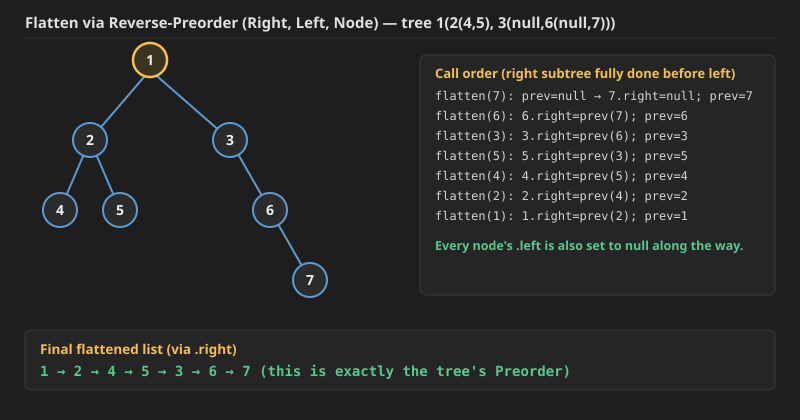
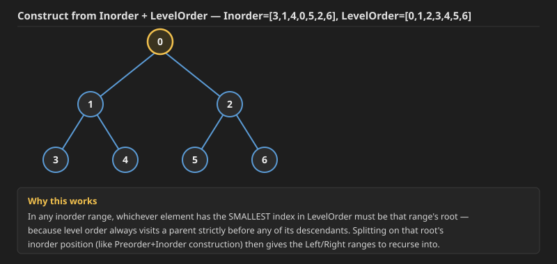

## Q1. Number of Good Pairs (LeetCode 1512)

Not a tree question — this one was solved separately as a LeetCode daily challenge, but kept here in the same notes file.

**Problem:** Given an array of integers `nums`, return *the number of **good pairs***.

A pair `(i, j)` is called *good* if `nums[i] == nums[j]` and `i < j`.

**Example 1:**
```
Input: nums = [1,2,3,1,1,3]
Output: 4
Explanation: There are 4 good pairs (0,3), (0,4), (3,4), (2,5) 0-indexed.
```

**Example 2:**
```
Input: nums = [1,1,1,1]
Output: 6
Explanation: Each pair in the array are good.
```

**Example 3:**
```
Input: nums = [1,2,3]
Output: 0
```

**Constraints:**
- `1 <= nums.length <= 100`
- `1 <= nums[i] <= 100`

Three approaches, from simplest to most efficient:
1. **Brute force** — check every pair `(i, j)` directly for `nums[i] == nums[j]`. `TC -> O(n^2)`, `SC -> O(1)`.
2. **Better** — sort the array, then every run of `k` equal values contributes `nC2 = k*(k-1)/2` good pairs (since sorting groups equal values together, and every pair inside one such run automatically satisfies `i < j` once you count it once). `TC -> O(n log n)` (dominated by the sort), `SC -> O(1)` (extra).
3. **One more approach** — put values into a map counting how many times each value has been seen *so far*; for every new element, add the current count of that value (the number of good pairs it forms with everything identical before it) to the running total, then increment the count. `TC -> O(n)`, `SC -> O(n)`.

**Approach 1 — brute force (added, since only the idea was noted):**

```java
class Solution {
    public int numIdenticalPairs(int[] nums) {
        int res = 0;
        for (int i = 0; i < nums.length; i++) {
            for (int j = i + 1; j < nums.length; j++) {
                if (nums[i] == nums[j]) res++;
            }
        }
        return res;
    }
}
```

```cpp
class Solution {
public:
    int numIdenticalPairs(vector<int>& nums) {
        int res = 0;
        for (int i = 0; i < (int)nums.size(); i++) {
            for (int j = i + 1; j < (int)nums.size(); j++) {
                if (nums[i] == nums[j]) res++;
            }
        }
        return res;
    }
};
```

**Approach 2 — sort + combinatorics (`nC2`):**

```java
class Solution {
    public int numIdenticalPairs(int[] nums) {
        Arrays.sort(nums);
        int res = 0;
        for (int i = 0; i < nums.length; ) {
            int cnt = 1;
            int val = nums[i++];
            while (i < nums.length && nums[i] == val) {
                cnt++;
                i++;
            }
            res += (cnt * (cnt - 1)) / 2;
        }
        return res;
    }
}
```

```cpp
class Solution {
public:
    int numIdenticalPairs(vector<int>& nums) {
        sort(nums.begin(), nums.end());
        int res = 0;
        for (int i = 0; i < (int)nums.size(); ) {
            int cnt = 1;
            int val = nums[i++];
            while (i < (int)nums.size() && nums[i] == val) {
                cnt++;
                i++;
            }
            res += (cnt * (cnt - 1)) / 2;
        }
        return res;
    }
};
```

**Approach 3 — HashMap of counts seen so far (added, since only the idea was noted):**

```java
class Solution {
    public int numIdenticalPairs(int[] nums) {
        HashMap<Integer, Integer> map = new HashMap<>();
        int res = 0;
        for (int num : nums) {
            res += map.getOrDefault(num, 0);
            map.put(num, map.getOrDefault(num, 0) + 1);
        }
        return res;
    }
}
```

```cpp
class Solution {
public:
    int numIdenticalPairs(vector<int>& nums) {
        unordered_map<int, int> map;
        int res = 0;
        for (int num : nums) {
            res += map[num];
            map[num]++;
        }
        return res;
    }
};
```


**Complexities recap:**
- Approach 1: **Time `O(n^2)`, Space `O(1)`** — every pair is checked directly.
- Approach 2: **Time `O(n log n)`, Space `O(1)` extra** — dominated by the sort; the counting pass itself is `O(n)`.
- Approach 3: **Time `O(n)`, Space `O(n)`** — a single pass, trading the map's space for dropping the sort.


## Q2. Flatten Binary Tree to Linked List (LeetCode 114)

**Problem:** Given the `root` of a binary tree, flatten the tree into a "linked list":
- The "linked list" should use the same `TreeNode` class where the `right` child pointer points to the next node in the list and the `left` child pointer is always `null`.
- The "linked list" should be in the same order as a **pre-order traversal** of the binary tree.

**Example 1:**
```
Input: root = [1,2,5,3,4,null,6]
Output: [1,null,2,null,3,null,4,null,5,null,6]
```
```
        1                    1
      /   \                    \
     2     5        ->           2
    / \      \                     \
   3   4      6                     3
                                      \
                                       4
                                        \
                                         5
                                          \
                                           6
```

**Example 2:**
```
Input: root = []
Output: []
```

**Example 3:**
```
Input: root = [0]
Output: [0]
```

**Constraints:**
- The number of nodes in the tree is in the range `[0, 2000]`.
- `-100 <= Node.val <= 100`

**Follow up:** Can you flatten the tree in-place (with `O(1)` extra space)?

**Hint:** Trust the recursion — have faith that flattening the left subtree gives you *its* linked list, and flattening the right subtree gives you *its* linked list; the only remaining work is wiring those two lists together with the current node in front, in preorder order (current node, then the whole left list, then the whole right list).

### Approach 1: Recursion returning (head, tail) of the flattened list

Track, for every subtree, both the **head** and **tail** of its already-flattened list — the tail is needed so the next piece can be attached directly after it in O(1), without walking the whole list to find the end.

 .jpg>)

```java
class Solution {
    class Pair {
        TreeNode head;
        TreeNode tail;
        Pair(TreeNode head, TreeNode tail) {
            this.head = head;
            this.tail = tail;
        }
    }

    private Pair helper(TreeNode root) {
        if (root.left == null && root.right == null) {
            return new Pair(root, root);
        }
        Pair lp = null;
        Pair rp = null;
        if (root.left != null) lp = helper(root.left);
        if (root.right != null) rp = helper(root.right);
        if (root.left != null && root.right != null)
            lp.tail.right = rp.head;
        TreeNode tail = (root.right == null) ? lp.tail : rp.tail;
        Pair res = new Pair(root, tail);
        res.head.right = (root.left != null) ? lp.head : rp.head;
        res.head.left = null;
        return res;
    }

    public void flatten(TreeNode root) {
        if (root == null) return;
        helper(root);
    }
}
```

```cpp
class Solution {
    struct Pair {
        TreeNode* head;
        TreeNode* tail;
        Pair(TreeNode* head, TreeNode* tail) : head(head), tail(tail) {}
    };

    Pair helper(TreeNode* root) {
        if (root->left == nullptr && root->right == nullptr) {
            return Pair(root, root);
        }
        Pair* lp = nullptr;
        Pair* rp = nullptr;
        Pair lpVal(nullptr, nullptr), rpVal(nullptr, nullptr);
        if (root->left != nullptr) { lpVal = helper(root->left); lp = &lpVal; }
        if (root->right != nullptr) { rpVal = helper(root->right); rp = &rpVal; }
        if (root->left != nullptr && root->right != nullptr)
            lp->tail->right = rp->head;
        TreeNode* tail = (root->right == nullptr) ? lp->tail : rp->tail;
        Pair res(root, tail);
        res.head->right = (root->left != nullptr) ? lp->head : rp->head;
        res.head->left = nullptr;
        return res;
    }

public:
    void flatten(TreeNode* root) {
        if (root == nullptr) return;
        helper(root);
    }
};
```

**Time Complexity: `O(n)`** — every node is processed exactly once. **Space Complexity: `O(h)`** — the recursion stack (`h` = height of the tree), plus the `Pair` objects (O(1) extra per call frame).

### Approach 2: Reverse-Postorder single pass (elegant, near `O(1)` extra space)

 .jpg>)

This approach only changes traversal order: recurse into the **right** subtree first, then the **left** subtree, and thread each node's `right` pointer to whatever was processed *just before it* (tracked in one instance field `prev`). Because right-then-left is processed before "visiting" the current node, by the time we reach any node, its entire right and left subtrees have already been flattened and linked, in exactly the reverse order needed to build the final list backwards.

```java
class Solution {
    TreeNode prev = null;

    public void flatten(TreeNode root) {
        if (root == null) return;
        flatten(root.right); // traverse till rightmost.
        flatten(root.left);  // got to left of right most
        root.left = null;    // set left as null
        root.right = prev;   // set right to previously traversed node
        prev = root;          // set prev to current node.
    }
}
```

```cpp
class Solution {
    TreeNode* prev = nullptr;

public:
    void flatten(TreeNode* root) {
        if (root == nullptr) return;
        flatten(root->right); // traverse till rightmost.
        flatten(root->left);  // got to left of right most
        root->left = nullptr; // set left as null
        root->right = prev;   // set right to previously traversed node
        prev = root;          // set prev to current node.
    }
};
```

**Dry run** on `1(2(4,5), 3(null, 6(null, 7)))`:



Since the tree is processed right-subtree-first, node `7` (the deepest rightmost node) is the very first one finalized (`prev` starts at `null`, so `7.right = null`), and node `1` (the root) is the very last one finalized. Each node's `right` ends up pointing at whatever was finalized immediately before it — which, walking backward through the recursion, is exactly that node's Preorder successor. The final list read off via `.right` pointers is `1 → 2 → 4 → 5 → 3 → 6 → 7`, matching the tree's Preorder traversal exactly.

**Time Complexity: `O(n)`** — every node visited once. **Space Complexity: `O(h)`** for the recursion stack — the problem's follow-up asks for `O(1)` *extra* space, which usually refers to not using any extra data structure (no stack/list/map) beyond the recursion itself; a fully iterative `O(1)`-space version exists too (using Morris-Traversal-style threading: repeatedly find the current node's right subtree's... — actually here it's simpler: repeatedly take the current node's left child, attach it as the new right child after finding the rightmost node of that left subtree and attaching the old right subtree there, then move on), but the two recursive approaches above are what were worked through here.


## Q3. Binary Tree to CDLL (GFG)

**Problem:** Given a Binary Tree of `N` edges. The task is to convert this to a Circular Doubly Linked List (**CDLL**) in-place. The `left` and `right` pointers in nodes are to be used as previous and next pointers respectively in the converted CDLL. The order of nodes in the CDLL must be the same as Inorder of the given Binary Tree. The first node of Inorder traversal (leftmost node in BT) must be the head node of the CDLL.

**Example 1:**
```
Input:
      1
    /   \
   3     2
Output:
3 1 2
2 1 3
Explanation: After converting tree to CDLL when CDLL is traversed from head to
tail and then tail to head, elements are displayed as in the output.
```

**Example 2:**
```
Input:
       10
      /   \
    20     30
   /  \
  40    60
Output:
40 20 60 10 30
30 10 60 20 40
Explanation: After converting tree to CDLL, when CDLL is traversed from head to
tail and then tail to head, elements are displayed as in the output.
```

**Constraints:**
- `1 <= N <= 10^3`
- `1 <= Data of a node <= 10^4`

**Expected Time Complexity:** `O(N)`. **Expected Auxiliary Space:** `O(h)`, where `h` = height of tree.

For a "transform the tree into some other linked structure" question like this, the same recursive-faith idea from Q2 applies — trust that converting the left subtree gives its CDLL, and converting the right subtree gives its CDLL, then work out how to stitch them together in the correct order.

**A bug worth knowing about:** a first attempt at reusing the Q2-style `Pair(head, tail)` approach — directly wiring `lp.tail.right = rp.head`, `rp.head.left = lp.tail` inside the recursive helper, and then also writing `res.head.left = root` (or similar) to close the loop — creates a **premature circular link** at *every* level of the recursion, not just at the very top. Dry-running it on a tiny tree (`1` with children `3` and `2`) shows the bug clearly: the `.left` pointers immediately form a 3-way cycle (`1↔2↔3↔1`) after just one recursive call, instead of staying as an open-ended chain until the whole tree is processed. The fix is to only make the *whole* structure circular once, at the very end (after the full recursion returns), connecting the true overall head and tail — never inside the recursive step itself.


 .jpg>) .jpg>) .jpg>) .jpg>) .jpg>) .jpg>) 

### Approach: build small circular lists and repeatedly `concat` them

A cleaner way to avoid that bug entirely: make **every single node its own trivial 1-node circular list** first (`node.left = node.right = node`), then merge two circular lists together with a `concat(h1, h2)` helper that is *always* correct regardless of which level of the recursion it's called at, because it only ever looks at the two lists being merged (never assumes it's the "final" merge). This means recursion never has to special-case "am I the top-level call?" — every merge, at every level, produces a valid circular list on its own.

```java
class Solution {
    Node bTreeToClist(Node root) {
        return helper(root);
    }

    Node helper(Node node) {
        if (node == null) {
            return null;
        }
        Node lhead = helper(node.left);
        Node rhead = helper(node.right);

        Node onl = node;
        onl.left = onl.right = onl;

        Node s1 = concat(lhead, onl);
        Node s2 = concat(s1, rhead);

        return s2;
    }

    Node concat(Node h1, Node h2) {
        if (h1 == null) {
            return h2;
        } else if (h2 == null) {
            return h1;
        }

        Node t1 = h1.left;
        Node t2 = h2.left;

        t1.right = h2;
        h2.left = t1;

        t2.right = h1;
        h1.left = t2;

        return h1;
    }
}
```

```cpp
class Solution {
    Node* concat(Node* h1, Node* h2) {
        if (h1 == nullptr) {
            return h2;
        } else if (h2 == nullptr) {
            return h1;
        }

        Node* t1 = h1->left;
        Node* t2 = h2->left;

        t1->right = h2;
        h2->left = t1;

        t2->right = h1;
        h1->left = t2;

        return h1;
    }

    Node* helper(Node* node) {
        if (node == nullptr) {
            return nullptr;
        }
        Node* lhead = helper(node->left);
        Node* rhead = helper(node->right);

        Node* onl = node;
        onl->left = onl->right = onl;

        Node* s1 = concat(lhead, onl);
        Node* s2 = concat(s1, rhead);

        return s2;
    }

public:
    Node* bTreeToClist(Node* root) {
        return helper(root);
    }
};
```

Note: `right -> next`, `left -> prev`, matching the problem's required convention.

**Why `concat` is always safe:** since every list passed into it is already a valid circular list (i.e. `head.left` really is its tail), `concat` just splices `h1`'s tail to `h2`'s head, and `h2`'s tail back to `h1`'s head, and returns `h1` as the (possibly new, possibly unchanged) head — the result is itself a valid circular list, so it composes correctly no matter how deep in the recursion it happens.

**Dry run** on the first example (`1` with left child `3`, right child `2`):
- `helper(3)`: leaf. `lhead = rhead = null`. `onl = 3` (trivial circular: `3.left = 3.right = 3`). `s1 = concat(null, 3) = 3`. `s2 = concat(3, null) = 3`. Returns `3`.
- `helper(2)`: same — returns `2` (trivial circular: `2.left = 2.right = 2`).
- `helper(1)`: `lhead = 3`, `rhead = 2`. `onl = 1` (trivial circular). `s1 = concat(lhead=3, onl=1)`: merges the 1-node list `{3}` with the 1-node list `{1}` → `3.right = 1`, `1.left = 3`, `1.right = 3`, `3.left = 1` (now `{3,1}` is circular with head `3`, tail `1`). `s2 = concat(s1=3, rhead=2)`: merges `{3,1}` (head `3`, tail `1`) with `{2}` → `1.right = 2`, `2.left = 1`, `2.right = 3`, `3.left = 2`.

**Final links:** `3.right=1, 1.right=2, 2.right=3` (forward cycle `3→1→2→3`) and `3.left=2, 2.left=1, 1.left=3` (backward cycle `3→2→1→3`). Reading head-to-tail from `3`: **`3 1 2`**. Reading tail-to-head from `2`: **`2 1 3`**. Both match the expected output exactly.

**Time Complexity: `O(N)`** — every node is visited once by `helper`, and each `concat` call does `O(1)` work (a fixed number of pointer updates), so the total work across the whole recursion is `O(N)`.
**Space Complexity: `O(h)`** — only the recursion stack; no extra data structure is used.


## Q4. Construct Tree from Inorder and LevelOrder (GFG)

**Problem:** Given inorder and level-order traversals of a Binary Tree, construct the Binary Tree and return the root Node.

**Input:** First line consists of `T` test cases. First line of every test case consists of `N`, denoting number of elements in respective arrays. Second and third line consists of arrays containing Inorder and Level-order traversal respectively.

**Output:** Single line output, print the preOrder traversal of the constructed tree.

**Constraints:** `1 <= T <= 100`, `1 <= N <= 100`.

**Example:**
```
Input:
2
3
1 0 2
0 1 2
7
3 1 4 0 5 2 6
0 1 2 3 4 5 6
Output:
0 1 2
0 1 3 4 2 5 6
```
.jpg>) .jpg>) .jpg>) .jpg>) 
**How does this even work?** Once we forget about Level Order entirely and just focus on Inorder, the one thing Level Order gives us for free is: **whichever node appears earliest in Level Order, out of any group of nodes, must be the highest node among them in the tree** (an ancestor is always visited before any of its descendants in level order). So within any Inorder range currently being processed, the element with the *smallest* position/index in Level Order has to be the root of that subtree. Once that root is picked out, everything to its left in the Inorder range is the left subtree, and everything to its right is the right subtree — exactly like Preorder+Inorder construction, except "the root" is found by a min-index lookup instead of just being `pre[preSt]`.

**Approach:**
1. Store every value's position in Level Order into a `HashMap<value, indexInLevelOrder>`.
2. Recursively, for the current Inorder range `[lo, hi]`: scan the range to find the index `minidx` whose value has the smallest Level-Order-position (initially assume `lo` is it, then linearly compare the rest). That's the root for this range.
3. Recurse on `[lo, minidx - 1]` for the left subtree and `[minidx + 1, hi]` for the right subtree.

**Java:**
```java
class GfG
{
    Node buildTree(int inord[], int level[])
    {
        HashMap<Integer, Integer> map = new HashMap<>();
        for(int i = 0; i < level.length; i++){
            map.put(level[i], i);
        }
        
        Node root = helper(inord, map, 0, inord.length - 1);
        return root;
    }
    
    public Node helper(int[] inord, HashMap<Integer, Integer> map, int lo, int hi){
        if(lo > hi){
            return null;
        }
        
        int minidx = lo; // assuming lo of inorder has least index in levelorder
        for(int i = lo + 1; i <= hi; i++){
            if(map.get(inord[i]) < map.get(inord[minidx])){
                minidx = i;
            }
        }
        
        Node node = new Node(inord[minidx]);
        node.left = helper(inord, map, lo, minidx - 1);
        node.right = helper(inord, map, minidx + 1, hi);
        
        return node;
    }
}
```

**C++:**
```cpp
class GfG
{
public:
    Node* buildTree(int inord[], int level[], int n)
    {
        unordered_map<int, int> map;
        for (int i = 0; i < n; i++) {
            map[level[i]] = i;
        }

        Node* root = helper(inord, map, 0, n - 1);
        return root;
    }

    Node* helper(int inord[], unordered_map<int, int>& map, int lo, int hi) {
        if (lo > hi) {
            return nullptr;
        }

        int minidx = lo; // assuming lo of inorder has least index in levelorder
        for (int i = lo + 1; i <= hi; i++) {
            if (map[inord[i]] < map[inord[minidx]]) {
                minidx = i;
            }
        }

        Node* node = new Node(inord[minidx]);
        node->left = helper(inord, map, lo, minidx - 1);
        node->right = helper(inord, map, minidx + 1, hi);

        return node;
    }
};
```

**Dry run** on `Inorder = [3,1,4,0,5,2,6]`, `LevelOrder = [0,1,2,3,4,5,6]` (map: `0→0, 1→1, 2→2, 3→3, 4→4, 5→5, 6→6`):
- `helper(inorder[0..6])`: scanning `{3,1,4,0,5,2,6}`, the smallest Level-Order-index is `0` (at inorder position `3`). Root = `0`. Left range = `[3,1,4]`, right range = `[5,2,6]`.
- `helper([3,1,4])`: smallest is `1`. Root = `1`. Left = `[3]` (leaf), right = `[4]` (leaf).
- `helper([5,2,6])`: smallest is `2`. Root = `2`. Left = `[5]` (leaf), right = `[6]` (leaf).

**Resulting tree:** `0(1(3,4), 2(5,6))`.



Preorder of this tree = `0, 1, 3, 4, 2, 5, 6` — matches the expected output exactly.

**Time Complexity:**
- **Best/average case — `O(N log N)`:** if the tree stays roughly balanced, the root-finding scan at the top level costs `O(N)`, but it then splits into two halves each costing `O(N/2)` (`O(N/2) * 2 = O(N)` total at that level too), then four quarters (`O(N/4) * 4 = O(N)`), and so on for `O(log N)` levels — `O(N)` work per level × `O(log N)` levels = `O(N log N)`.
- **Worst case — `O(N^2)`:** if the tree is skewed (e.g. root's range is size `N`, next level's range is size `N-1`, then `N-2`, ...), the total work becomes `N + (N-1) + (N-2) + ... + 1 = O(N^2)`. This is exactly the same best/worst-case split that Quick Sort has, for the same underlying reason (a linear scan whose cost depends on how balanced the resulting split is).

**Space Complexity: `O(N)`** — `O(N)` for the HashMap, plus `O(h)` for the recursion stack (`O(N)` worst case for a skewed tree, `O(log N)` for a balanced one).


## Q5. Distribute Coins in Binary Tree (LeetCode 979)

**Problem:** You are given the `root` of a binary tree with `n` nodes where each `node` in the tree has `node.val` coins. There are `n` coins in total throughout the whole tree.

In one move, we may choose two adjacent nodes and move one coin from one node to another. A move may be from parent to child, or from child to parent.

Return *the **minimum** number of moves required to make every node have **exactly** one coin*.

**Example 1:**
```
Input: root = [3,0,0]
Output: 2
Explanation: From the root of the tree, we move one coin to
its left child, and one coin to its right child.
```

**Example 2:**
```
Input: root = [0,3,0]
Output: 3
Explanation: From the left child of the root, we move two coins to the root [taking two moves].
Then, we move one coin from the root of the tree to the right child.
```

**Constraints:**
- The number of nodes in the tree is `n`.
- `1 <= n <= 100`
- `0 <= Node.val <= n`
- The sum of all `Node.val` is `n`.

**Getting oriented:** wherever a value is shown on a node, that's how many coins that node currently has. We need every node to end up with **exactly** 1 coin. Also, since there are exactly `n` nodes and `n` coins total, it's always possible for every node to end up with exactly 1 coin (the numbers necessarily balance out) — the only question is the minimum number of moves to get there.


.jpg>) .jpg>)


**Approach:** Do a post-order DFS. For every subtree, compute two numbers: how many **nodes** it contains, and how many **coins** it contains. If a subtree has more coins than nodes, the extra coins must flow *out* of it (up through the edge connecting it to its parent); if it has fewer coins than nodes, coins must flow *in* through that same edge. Either way, the number of coins that must cross that one edge is `|coins - nodes|` — and crucially, it doesn't matter whether they're flowing up or down, moving a coin across an edge always costs exactly 1 move regardless of direction, so we just take the absolute value and add it to a running total.

.jpg>) .jpg>) .jpg>)

A tempting mistake to avoid: don't try to track *how far* a coin ultimately has to travel and count that as the number of moves — that overcomplicates things and isn't even what "moves" means here. Since every move only shifts a coin by one edge at a time, the total move count is just the sum, over every single edge in the tree, of how many coins must cross that particular edge — regardless of the coin's ultimate destination or how many edges away it started. This is exactly `|coins(subtree) - nodes(subtree)|` summed over every subtree (i.e. over every edge connecting a subtree to its parent).

**Dry run** on a bigger tree (root value `0`; left child value `3` with its own subtree of 5 nodes and 7 coins total; right child value `1` with its own subtree of 3 nodes and 2 coins total; further down, one leaf with value `0` needing 1 coin brought in, etc.):
- At the leaf with value `0`: `nodes = 1`, `coins = 0` → contributes `|0 - 1| = 1` move across the edge to its parent.
- At the subtree rooted at the node with value `3` (containing 5 nodes and 7 coins total): contributes `|7 - 5| = 2` moves across the edge to its parent.
- At the subtree rooted at the node with value `1` (containing 3 nodes and 2 coins total): contributes `|2 - 3| = 1` move across the edge to its parent.
- Similarly, another leaf with value `0` (nodes=1, coins=0) contributes `1` move.
- Adding up every edge's contribution across the whole tree: `2 + 1 + 1 + 1 = 5` total moves for that tree.

Verifying against the two official examples:
- `root = [3,0,0]`: leaf `0` (left) → `|0-1|=1`; leaf `0` (right) → `|0-1|=1`; root subtree (nodes=3, coins=3+0+0=3) → `|3-3|=0`. Total = `1+1+0 = 2` ✓.
- `root = [0,3,0]`: leaf `3` (left) → `|3-1|=2`; leaf `0` (right) → `|0-1|=1`; root subtree (nodes=3, coins=3+0+0=3) → `|3-3|=0`. Total = `2+1+0 = 3` ✓.

**Java:**
```java
class Solution {
    int movements=0;
    private class Pair{
        int node;
        int coins;
        Pair(int node,int coins){
            this.node=node;
            this.coins=coins;
        }
    }
    private Pair movements(TreeNode node){
        if(node==null) return new Pair(0,0);
        Pair lpair=movements(node.left);
        Pair rpair=movements(node.right);
        int nodes=lpair.node+rpair.node+1;
        int coins=lpair.coins+rpair.coins+node.val;
        movements+=Math.abs(nodes-coins);
        return new Pair(nodes,coins);
    }
    public int distributeCoins(TreeNode root) {
        movements(root);
        return movements;
    }
}
```

**C++:**
```cpp
class Solution {
    int movements = 0;
    struct Pair {
        int node;
        int coins;
        Pair(int node, int coins) : node(node), coins(coins) {}
    };

    Pair movements(TreeNode* node) {
        if (node == nullptr) return Pair(0, 0);
        Pair lpair = movements(node->left);
        Pair rpair = movements(node->right);
        int nodes = lpair.node + rpair.node + 1;
        int coins = lpair.coins + rpair.coins + node->val;
        movements += abs(nodes - coins);
        return Pair(nodes, coins);
    }

public:
    int distributeCoins(TreeNode* root) {
        movements(root);
        return movements;
    }
};
```

**Time Complexity: `O(n)`** — a single post-order traversal, `O(1)` work per node. **Space Complexity: `O(h)`** — only the recursion stack (`h` = height of the tree), no extra data structure needed (the running `movements` total and each returned `Pair` are `O(1)`).


