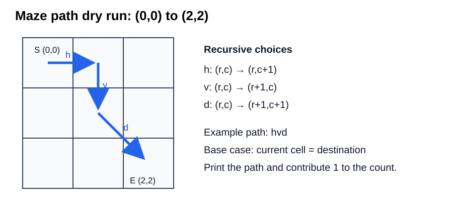
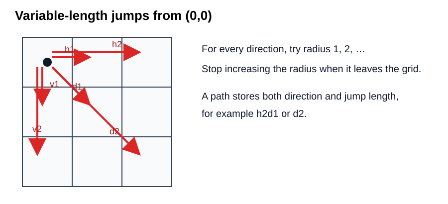
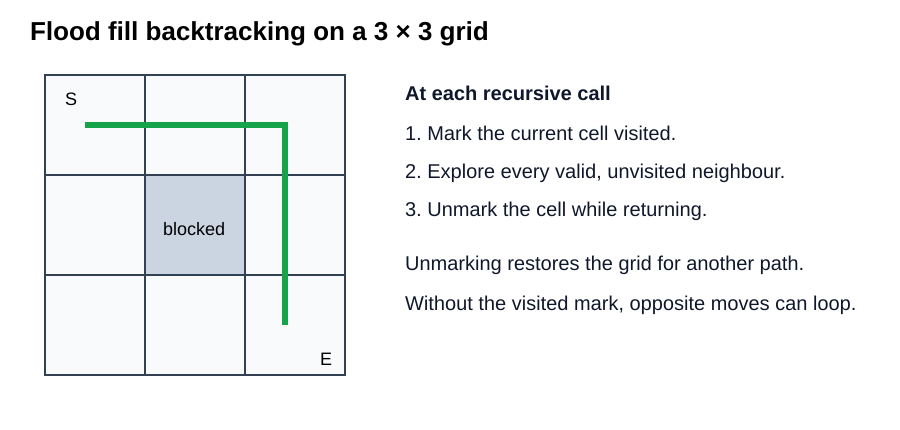
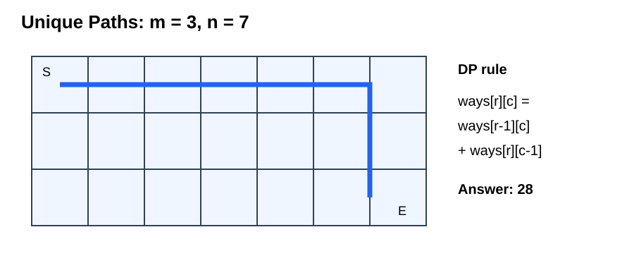
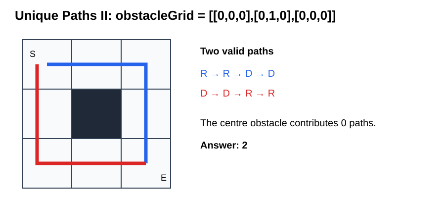
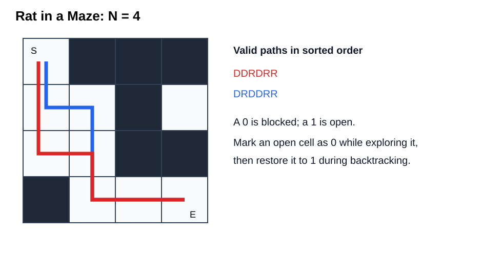
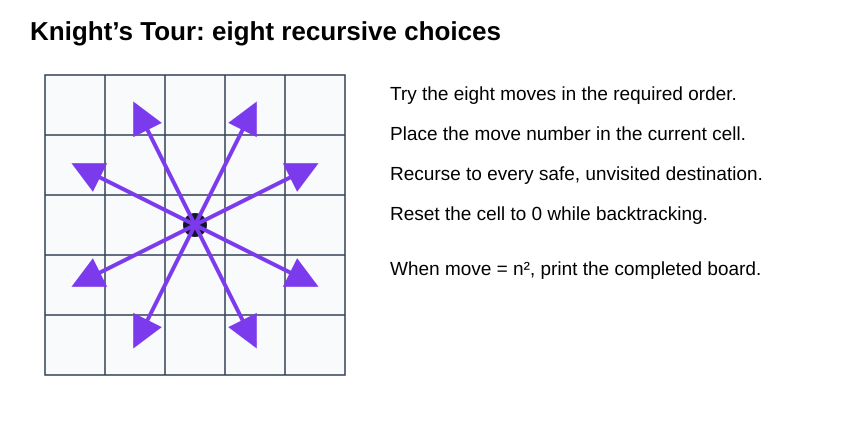
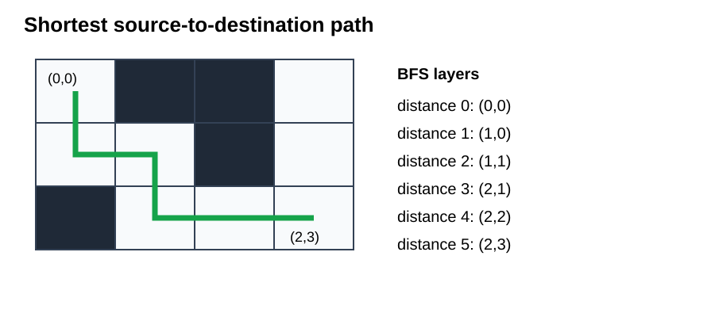

## Question 1: Print and count maze paths using horizontal, vertical, and diagonal moves

Given a rectangular grid, start at `(sr, sc)` and reach `(er, ec)`. A move may be horizontal right (`h`), vertical down (`v`), or diagonal down-right (`d`). Print every valid path and return their count.

The base case must be checked before making another recursive call. Once `(sr, sc) == (er, ec)`, the current path is complete. A direction is explored only if its next cell remains inside the grid.



### C++

```cpp
int mazePath(int sr, int sc, int er, int ec, string psf) {
    if (sr == er && sc == ec) {
        cout << psf << '\n';
        return 1;
    }

    int count = 0;
    if (sc + 1 <= ec)
        count += mazePath(sr, sc + 1, er, ec, psf + "h");
    if (sr + 1 <= er)
        count += mazePath(sr + 1, sc, er, ec, psf + "v");
    if (sc + 1 <= ec && sr + 1 <= er)
        count += mazePath(sr + 1, sc + 1, er, ec, psf + "d");

    return count;
}
```

### Java

```java
    public static int mazePath(int sr, int sc, int er, int ec, String psf) {
        if (sr == er && sc == ec) {
            System.out.println(psf);
            return 1;
        }

        int count = 0;
        if (sc + 1 <= ec)
            count += mazePath(sr, sc + 1, er, ec, psf + "h"); // H
        if (sr + 1 <= er)
            count += mazePath(sr + 1, sc, er, ec, psf + "v"); // V
        if (sc + 1 <= ec && sr + 1 <= er)
            count += mazePath(sr + 1, sc + 1, er, ec, psf + "d"); // D

        return count;
    }

```


**Time complexity:** `O(3^(dr + dc))` as an upper bound, where `dr = er - sr` and `dc = ec - sc`, because a call can create as many as three branches until the destination is reached. The exact work is proportional to the recursion tree and the number of printed paths.

**Space complexity:** `O(dr + dc)` auxiliary stack space. A path using only horizontal and vertical moves has the maximum recursion depth `dr + dc`; the path strings and printed output require additional output space.

## Question 2: Print and count maze paths using direction arrays

Solve the same maze-path problem by storing coordinate changes in a direction matrix and their printable names in a matching string array. For horizontal, vertical, and diagonal movement:

```text
dir  = {{0, 1}, {1, 0}, {1, 1}}
dirS = {"h", "v", "d"}
```

The entry at index `d` in both arrays describes the same move. This makes the recursive loop reusable: changing the allowed directions requires changing the arrays rather than the recursive structure.

Coordinate names can be confusing. In an `(x, y)` plane, horizontal movement changes `x` and vertical movement changes `y`. In a matrix, vertical movement changes the row and horizontal movement changes the column. Thus right is `(row, column + 1)`, left is `(row, column - 1)`, down is `(row + 1, column)`, and up is `(row - 1, column)`.

### C++

```cpp
int mazePath2(int sr, int sc, int er, int ec,
              const vector<vector<int>>& dir,
              const vector<string>& dirS, string psf) {
    if (sr == er && sc == ec) {
        cout << psf << '\n';
        return 1;
    }

    int count = 0;
    for (int d = 0; d < static_cast<int>(dir.size()); d++) {
        int r = sr + dir[d][0];
        int c = sc + dir[d][1];
        if (r >= 0 && c >= 0 && r <= er && c <= ec)
            count += mazePath2(r, c, er, ec, dir, dirS, psf + dirS[d]);
    }
    return count;
}
```

### Java

```java


    public static int mazePath2(int sr, int sc, int er, int ec, int[][] dir, String[] dirS, String psf) {
        if (sr == er && sc == ec) {
            System.out.println(psf);
            return 1;
        }

        int count = 0;
        for (int d = 0; d < dir.length; d++) {
            int r = sr + dir[d][0];
            int c = sc + dir[d][1];

            if (r >= 0 && c >= 0 && r <= er && c <= ec) {
                count += mazePath2(r, c, er, ec, dir, dirS, psf + dirS[d]);
            }

        }

        return count;
    }


```

**Time complexity:** `O(3^(dr + dc))` as an upper bound for the three forward directions, for the same recursion-tree reason as Question 1.

**Space complexity:** `O(dr + dc)` auxiliary stack space, excluding the generated path strings and printed output.

## Question 3: Print and count maze paths with variable-length jumps

From each cell, allow a horizontal, vertical, or diagonal jump of radius `1, 2, ...` while the landing cell remains inside the grid. Store both the direction and radius in the path, such as `h2`, `v1`, or `d3`.



For each direction, the inner loop increases the radius. Once a landing cell goes outside the grid, larger radii in that direction will also be invalid, so the loop can stop.

### Existing code

```java
public static int mazePathJump(int sr, int sc, int er, int ec, int[][] dir, String[] dirS, String psf) {
        if (sr == er && sc == ec) {
            System.out.println(psf);
            return 1;
        }

        int count = 0;
        for (int d = 0; d < dir.length; d++) {
            for (int rad = 1; rad <= Math.max(er, ec); rad++) {
                int r = sr + rad * dir[d][0];
                int c = sc + rad * dir[d][1];

                if (r >= 0 && c >= 0 && r <= er && c <= ec) {
                    count += mazePathJump(r, c, er, ec, dir, dirS, psf + dirS[d] + rad);
                } else
                    break;
            }
        }

        return count;
    }


```

### C++

```cpp
int mazePathJump(int sr, int sc, int er, int ec,
                 const vector<vector<int>>& dir,
                 const vector<string>& dirS, string psf) {
    if (sr == er && sc == ec) {
        cout << psf << '\n';
        return 1;
    }

    int count = 0;
    for (int d = 0; d < static_cast<int>(dir.size()); d++) {
        for (int rad = 1; rad <= max(er, ec); rad++) {
            int r = sr + rad * dir[d][0];
            int c = sc + rad * dir[d][1];
            if (r >= 0 && c >= 0 && r <= er && c <= ec)
                count += mazePathJump(r, c, er, ec, dir, dirS,
                                      psf + dirS[d] + to_string(rad));
            else
                break;
        }
    }
    return count;
}
```

### Java

```java
public static int mazePathJump(int sr, int sc, int er, int ec,
        int[][] dir, String[] dirS, String psf) {
    if (sr == er && sc == ec) {
        System.out.println(psf);
        return 1;
    }

    int count = 0;
    for (int d = 0; d < dir.length; d++) {
        for (int rad = 1; rad <= Math.max(er, ec); rad++) {
            int r = sr + rad * dir[d][0];
            int c = sc + rad * dir[d][1];
            if (r >= 0 && c >= 0 && r <= er && c <= ec)
                count += mazePathJump(r, c, er, ec, dir, dirS,
                                      psf + dirS[d] + rad);
            else
                break;
        }
    }
    return count;
}
```

**Time complexity:** exponential in the number of cells in the worst case. Each call can try several radii in three directions, so the complete recursion tree grows with every legal jump sequence. A loose bound is `O((3R)^L)`, where `R = max(er, ec)` and `L` is the maximum number of moves in a path; the actual work is the number of recursive states generated plus the radius checks.

**Space complexity:** `O(dr + dc)` auxiliary recursion space in the worst case because a path made entirely of radius-1 moves is deepest. Generated strings and printed paths use output space.

## Question 4: Print and count flood-fill paths

Starting from `(sr, sc)`, reach `(er, ec)` while moving through any supplied set of directions. Opposite directions may bring the search back to an earlier cell, so every path needs a visited-state mechanism.



Mark the current cell before exploring its neighbours and unmark it after all neighbours are processed. This backtracking step is essential: the cell must remain unavailable within the current path, but it must be available to a different path explored later. The destination is handled before marking because that call finishes immediately.

For eight-direction movement, a direction table may contain horizontal, vertical, and diagonal entries such as `{{0,1},{0,-1},{1,0},{-1,0},{1,1},{-1,-1},{1,-1},{-1,1}}`. The name array must use the same order.

### C++

```cpp
int floodFill(int sr, int sc, int er, int ec, vector<vector<bool>>& vis,
              const vector<vector<int>>& dir,
              const vector<string>& dirS, string psf) {
    if (sr == er && sc == ec) {
        cout << psf << '\n';
        return 1;
    }

    vis[sr][sc] = true;
    int count = 0;
    for (int d = 0; d < static_cast<int>(dir.size()); d++) {
        int r = sr + dir[d][0];
        int c = sc + dir[d][1];
        if (r >= 0 && c >= 0 && r <= er && c <= ec && !vis[r][c])
            count += floodFill(r, c, er, ec, vis, dir, dirS, psf + dirS[d]);
    }
    vis[sr][sc] = false;
    return count;
}

int floodFillJump(int sr, int sc, int er, int ec,
                  vector<vector<bool>>& vis,
                  const vector<vector<int>>& dir,
                  const vector<string>& dirS, string psf) {
    if (sr == er && sc == ec) {
        cout << psf << '\n';
        return 1;
    }

    vis[sr][sc] = true;
    int count = 0;
    for (int d = 0; d < static_cast<int>(dir.size()); d++) {
        for (int rad = 1; rad <= max(er, ec); rad++) {
            int r = sr + rad * dir[d][0];
            int c = sc + rad * dir[d][1];
            if (r >= 0 && c >= 0 && r <= er && c <= ec) {
                if (!vis[r][c])
                    count += floodFillJump(r, c, er, ec, vis, dir, dirS,
                                           psf + dirS[d] + to_string(rad));
            } else {
                break;
            }
        }
    }
    vis[sr][sc] = false;
    return count;
}
```

### Java

```java

    public static int floodFill(int sr, int sc, int er, int ec, boolean[][] vis, int[][] dir, String[] dirS,
            String psf) {
        if (sr == er && sc == ec) {
            System.out.println(psf);
            return 1;
        }

        vis[sr][sc] = true;
        int count = 0;
        for (int d = 0; d < dir.length; d++) {
            int r = sr + dir[d][0];
            int c = sc + dir[d][1];

            if (r >= 0 && c >= 0 && r <= er && c <= ec && !vis[r][c]) {
                count += floodFill(r, c, er, ec, vis, dir, dirS, psf + dirS[d]);
            }

        }
        vis[sr][sc] = false;
        return count;
    }

    public static int floodFillJump(int sr, int sc, int er, int ec, boolean[][] vis, int[][] dir, String[] dirS,
            String psf) {
        if (sr == er && sc == ec) {
            System.out.println(psf);
            return 1;
        }

        vis[sr][sc] = true;
        int count = 0;
        for (int d = 0; d < dir.length; d++) {
            for (int rad = 1; rad <= Math.max(er, ec); rad++) {
                int r = sr + rad * dir[d][0];
                int c = sc + rad * dir[d][1];

                if (r >= 0 && c >= 0 && r <= er && c <= ec) {
                    if (!vis[r][c])
                        count += floodFillJump(r, c, er, ec, vis, dir, dirS, psf + dirS[d] + rad);
                } else
                    break;
            }
        }

        vis[sr][sc] = false;
        return count;
    }


```


**Time complexity:** `O(4^(R*C))` as a loose worst-case bound for four-direction flood fill on an open `R × C` grid. A simple path can include up to `R*C` cells and each call considers four directions. Printing every path also costs time proportional to the total output. With eight directions or jumps, the branching factor is larger.

**Space complexity:** `O(R*C)` for the visited matrix and up to `O(R*C)` recursion-stack depth because one simple path can visit every cell. The printed paths require additional output space.

## Question 5: Unique Paths

There is a robot on an `m × n` grid. It starts at the top-left corner, `grid[0][0]`, and must reach the bottom-right corner, `grid[m - 1][n - 1]`. At any point, it may move only right or down. Given `m` and `n`, return the number of unique paths to the destination. The test cases are generated so that the answer is at most `2 × 10^9`.

**Example 1**

```text
Input:  m = 3, n = 7
Output: 28
```

**Example 2**

```text
Input:  m = 3, n = 2
Output: 3
Explanation:
1. Right -> Down -> Down
2. Down -> Down -> Right
3. Down -> Right -> Down
```

**Constraints:** `1 <= m, n <= 100`.



A direct recursive solution repeats the same subproblems and can exceed the time limit on inputs such as `m = 23`, `n = 12`. Dynamic programming stores the answer for every cell and avoids that repeated work.

### C++

```cpp
class Solution {
public:
    int uniquePaths(int m, int n) {
        vector<int> dp(n, 1);
        for (int r = 1; r < m; r++)
            for (int c = 1; c < n; c++)
                dp[c] += dp[c - 1];
        return dp[n - 1];
    }
};
```

### Java

```java
class Solution {
    public int uniquePaths(int m, int n) {
        int[] dp = new int[n];
        Arrays.fill(dp, 1);
        for (int r = 1; r < m; r++)
            for (int c = 1; c < n; c++)
                dp[c] += dp[c - 1];
        return dp[n - 1];
    }
}
```

**Time complexity:** `O(m*n)` because every grid position is processed once.

**Space complexity:** `O(n)` because one row of path counts is sufficient.

## Question 6: Unique Paths II

A robot starts at the top-left corner of an `m × n` grid and must reach the bottom-right corner. It may move only right or down. Some cells contain obstacles. In `obstacleGrid`, `1` denotes an obstacle and `0` denotes an open cell. Return the number of unique valid paths.

**Example 1**

```text
Input:  obstacleGrid = [[0,0,0],[0,1,0],[0,0,0]]
Output: 2
Explanation: The middle cell is blocked. The two paths are
Right -> Right -> Down -> Down and Down -> Down -> Right -> Right.
```

**Example 2**

```text
Input:  obstacleGrid = [[0,1],[0,0]]
Output: 1
```

**Constraints:**

- `m == obstacleGrid.length`
- `n == obstacleGrid[i].length`
- `1 <= m, n <= 100`
- `obstacleGrid[i][j]` is `0` or `1`



If the start or destination is blocked, return `0`. Because movement is only right and down, no visited array is required. Marking a cell and later restoring it can model a visited state, but it still repeats subproblems and can time out; dynamic programming is the suitable approach.

### C++

```cpp
class Solution {
public:
    int uniquePathsWithObstacles(vector<vector<int>>& obstacleGrid) {
        int m = obstacleGrid.size(), n = obstacleGrid[0].size();
        vector<long long> dp(n, 0);
        dp[0] = obstacleGrid[0][0] == 0 ? 1 : 0;
        for (int r = 0; r < m; r++) {
            for (int c = 0; c < n; c++) {
                if (obstacleGrid[r][c] == 1)
                    dp[c] = 0;
                else if (c > 0)
                    dp[c] += dp[c - 1];
            }
        }
        return static_cast<int>(dp[n - 1]);
    }
};
```

### Java

```java
class Solution {
    public int uniquePathsWithObstacles(int[][] obstacleGrid) {
        int m = obstacleGrid.length, n = obstacleGrid[0].length;
        int[] dp = new int[n];
        dp[0] = obstacleGrid[0][0] == 0 ? 1 : 0;
        for (int r = 0; r < m; r++) {
            for (int c = 0; c < n; c++) {
                if (obstacleGrid[r][c] == 1)
                    dp[c] = 0;
                else if (c > 0)
                    dp[c] += dp[c - 1];
            }
        }
        return dp[n - 1];
    }
}
```

**Time complexity:** `O(m*n)` because each cell is examined once.

**Space complexity:** `O(n)` for the one-dimensional dynamic-programming array.

## Question 7: Rat in a Maze Problem - I

Consider a rat placed at `(0, 0)` in a square matrix of order `N × N`. It must reach `(N - 1, N - 1)`. Find all possible paths from source to destination. The rat may move `U` (up), `D` (down), `L` (left), or `R` (right). A cell containing `0` is blocked, and a cell containing `1` may be used.

No cell may be visited more than once within one path. If the source cell is `0`, the rat cannot move. Return all paths in lexicographically increasing order; return an empty list when no path exists.

**Example**

```text
Input:
N = 4
m = {{1,0,0,0},
     {1,1,0,1},
     {1,1,0,0},
     {0,1,1,1}}

Output: DDRDRR DRDDRR

Explanation: The rat reaches (3,3) using DDRDRR or DRDDRR.
```

**Constraints:**

- `2 <= N <= 5`
- `0 <= m[i][j] <= 1`



The matrix itself can serve as the visited state. Temporarily change the current open cell from `1` to `0`, explore all moves, and restore it to `1` while backtracking. Trying directions in `D, U, L, R` order produces the required order for this example.

### C++

```cpp
class Solution {
    bool isSafe(int r, int c, int n, const vector<vector<int>>& m) {
        return r >= 0 && r < n && c >= 0 && c < n && m[r][c] == 1;
    }

    void helper(int r, int c, vector<vector<int>>& m, int n,
                vector<string>& result, string path,
                const vector<vector<int>>& dir,
                const vector<char>& dirS) {
        if (r == n - 1 && c == n - 1) {
            result.push_back(path);
            return;
        }
        m[r][c] = 0;
        for (int i = 0; i < 4; i++) {
            int nr = r + dir[i][0], nc = c + dir[i][1];
            if (isSafe(nr, nc, n, m))
                helper(nr, nc, m, n, result, path + dirS[i], dir, dirS);
        }
        m[r][c] = 1;
    }

public:
    vector<string> findPath(vector<vector<int>>& m, int n) {
        vector<string> result;
        if (m[0][0] == 0) return result;
        vector<vector<int>> dir{{1,0},{-1,0},{0,-1},{0,1}};
        vector<char> dirS{'D','U','L','R'};
        helper(0, 0, m, n, result, "", dir, dirS);
        sort(result.begin(), result.end());
        return result;
    }
};
```

### Java

```java


// User function Template for Java

// m is the given matrix and n is the order of matrix
class Solution {
    public static boolean isitsafe(int r,int c,int n,int[][]m){
        if(r>=0&&r<n&&c>=0&&c<n&&m[r][c]==1) return true;
       else return false;
    }
    public static void helper(int r,int c,int[][]m,int n,ArrayList<String>res,String psf,int[][] dir,String[] dirS){
        if(r==n-1&&c==n-1){
            res.add(psf);
            return;
        }
        m[r][c]=0;
        for(int i=0;i<dirS.length;i++){
            int nr=r+dir[i][0];
            int nc=c+dir[i][1];
            if(isitsafe(nr,nc,n,m)==true){
                helper(nr,nc,m,n,res,psf+dirS[i],dir,dirS);
            }
        }
        m[r][c]=1;
        
    }
    public static ArrayList<String> findPath(int[][] m, int n) {
        // Your code here
        
        ArrayList<String>res=new ArrayList<>();
        if(m[0][0]==0) return res;
        int[][] dir={{1,0},{-1,0},{0,-1},{0,1}};
        String[] dirS={"D","U","L","R",};
        helper(0,0,m,n,res,"",dir,dirS);
        return res;
    }
}

```

**Time complexity:** `O(4^(N*N))` as a loose upper bound because a path can visit at most `N*N` cells and each call considers four moves. The actual work depends on blocked cells and includes writing every returned path.

**Space complexity:** `O(N*N)` recursion space for the longest simple path. The matrix is reused for visited marking; storing the answers costs `O(L*X)`, where `L` is a path length and `X` is the number of returned paths.

## Question 8: Knight's Tour

Given `n`, the size of a chessboard, and a starting cell `(row, col)`, generate and print every configuration in which a knight starts at that cell and visits every board cell exactly once. Use recursion. When choosing among the eight moves from `(r, c)`, give first precedence to `(r - 2, c + 1)` and continue clockwise.

**Input:** a number `n`, a starting row, and a starting column.

**Output:** every board configuration representing a complete knight route. Print one configuration at a time.

**Constraints:**

- `n = 5`
- `0 <= row < n`
- `0 <= col < n`



Place the current move number in the cell, recursively try every safe move, and reset the cell to `0` during backtracking. When the upcoming move number equals `n*n`, place it, print the board, and restore the cell before returning.

### C++

```cpp
void displayBoard(const vector<vector<int>>& chess) {
    for (const auto& row : chess) {
        for (int value : row) cout << value << ' ';
        cout << '\n';
    }
    cout << '\n';
}

void printKnightsTour(vector<vector<int>>& chess, int r, int c,
                      int upcomingMove,
                      const vector<vector<int>>& dir) {
    int n = chess.size();
    if (r < 0 || c < 0 || r >= n || c >= n || chess[r][c] != 0)
        return;
    if (upcomingMove == n * n) {
        chess[r][c] = upcomingMove;
        displayBoard(chess);
        chess[r][c] = 0;
        return;
    }

    chess[r][c] = upcomingMove;
    for (const auto& move : dir)
        printKnightsTour(chess, r + move[0], c + move[1],
                         upcomingMove + 1, dir);
    chess[r][c] = 0;
}
```

### Java

```java
public static void printKnightsTour(int[][] chess, int r, int c,
        int upcomingMove, int[][] dir) {
    int n = chess.length;
    if (r < 0 || c < 0 || r >= n || c >= n || chess[r][c] != 0)
        return;
    if (upcomingMove == n * n) {
        chess[r][c] = upcomingMove;
        displayBoard(chess);
        chess[r][c] = 0;
        return;
    }

    chess[r][c] = upcomingMove;
    for (int[] move : dir)
        printKnightsTour(chess, r + move[0], c + move[1],
                         upcomingMove + 1, dir);
    chess[r][c] = 0;
}

public static void displayBoard(int[][] chess) {
    for (int[] row : chess) {
        for (int value : row) System.out.print(value + " ");
        System.out.println();
    }
    System.out.println();
}
```

Use the move order:

```text
{{-2,1},{-1,2},{1,2},{2,1},{2,-1},{1,-2},{-1,-2},{-2,-1}}
```

**Time complexity:** `O(8^(n*n))` as a loose upper bound because each of up to `n*n` placements can consider eight knight moves. Bounds and visited checks prune many branches.

**Space complexity:** `O(n*n)` for the board and recursion stack because a completed tour contains `n*n` placements.


## Question 9: Shortest Source to Destination Path

Given a zero-indexed binary matrix `A` of size `N × M`, find the minimum number of steps needed to travel from `(0, 0)` to `(X, Y)`. Movement is allowed left, right, up, and down, and only cells containing `1` may be used. Return `-1` when the destination is unreachable or `A[0][0]` is `0`.

**Example 1**

```text
Input:
N = 3, M = 4
A = [[1,0,0,0],
     [1,1,0,1],
     [0,1,1,1]]
X = 2, Y = 3
Output: 5
Explanation: (0,0) -> (1,0) -> (1,1) -> (2,1) -> (2,2) -> (2,3)
```

**Example 2**

```text
Input:
N = 3, M = 4
A = [[1,1,1,1],
     [0,0,0,1],
     [0,0,0,1]]
X = 0, Y = 3
Output: 3
Explanation: (0,0) -> (0,1) -> (0,2) -> (0,3)
```

**Constraints:**

- `1 <= N, M <= 250`
- `0 <= X < N`
- `0 <= Y < M`
- `0 <= A[i][j] <= 1`



A recursive flood-fill solution can try every simple route, keep the minimum successful length, and restore each cell after visiting it. That approach repeats many states and can exceed the time limit. Breadth-first search explores cells in increasing distance order, so the first visit to `(X, Y)` gives the minimum number of steps. The same traversal can also store a parent and direction for each cell if the route string is required.

### C++

```cpp
class Solution {
public:
    int shortestDistance(int N, int M, vector<vector<int>> A, int X, int Y) {
        if (A[0][0] == 0 || A[X][Y] == 0) return -1;
        vector<vector<int>> dist(N, vector<int>(M, -1));
        queue<pair<int, int>> q;
        vector<vector<int>> dir{{0,1},{0,-1},{1,0},{-1,0}};
        q.push({0, 0});
        dist[0][0] = 0;

        while (!q.empty()) {
            auto [r, c] = q.front();
            q.pop();
            if (r == X && c == Y) return dist[r][c];
            for (const auto& move : dir) {
                int nr = r + move[0], nc = c + move[1];
                if (nr >= 0 && nr < N && nc >= 0 && nc < M &&
                    A[nr][nc] == 1 && dist[nr][nc] == -1) {
                    dist[nr][nc] = dist[r][c] + 1;
                    q.push({nr, nc});
                }
            }
        }
        return -1;
    }
};
```

### Java

```java
class Solution {
    int shortestDistance(int N, int M, int[][] A, int X, int Y) {
        if (A[0][0] == 0 || A[X][Y] == 0) return -1;
        int[][] dist = new int[N][M];
        for (int[] row : dist) Arrays.fill(row, -1);
        int[][] dir = {{0,1},{0,-1},{1,0},{-1,0}};
        ArrayDeque<int[]> queue = new ArrayDeque<>();
        queue.add(new int[]{0, 0});
        dist[0][0] = 0;

        while (!queue.isEmpty()) {
            int[] cell = queue.remove();
            int r = cell[0], c = cell[1];
            if (r == X && c == Y) return dist[r][c];
            for (int[] move : dir) {
                int nr = r + move[0], nc = c + move[1];
                if (nr >= 0 && nr < N && nc >= 0 && nc < M &&
                    A[nr][nc] == 1 && dist[nr][nc] == -1) {
                    dist[nr][nc] = dist[r][c] + 1;
                    queue.add(new int[]{nr, nc});
                }
            }
        }
        return -1;
    }
}
```

**Time complexity:** `O(N*M)` because BFS enqueues each open cell at most once and checks four neighbours.

**Space complexity:** `O(N*M)` for the distance matrix and queue.
