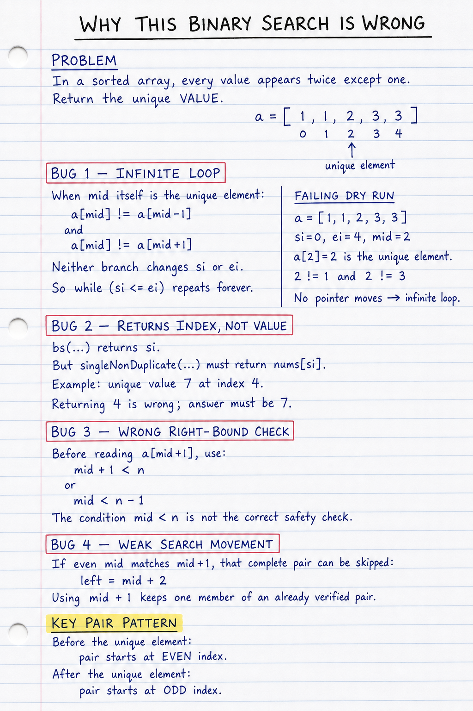
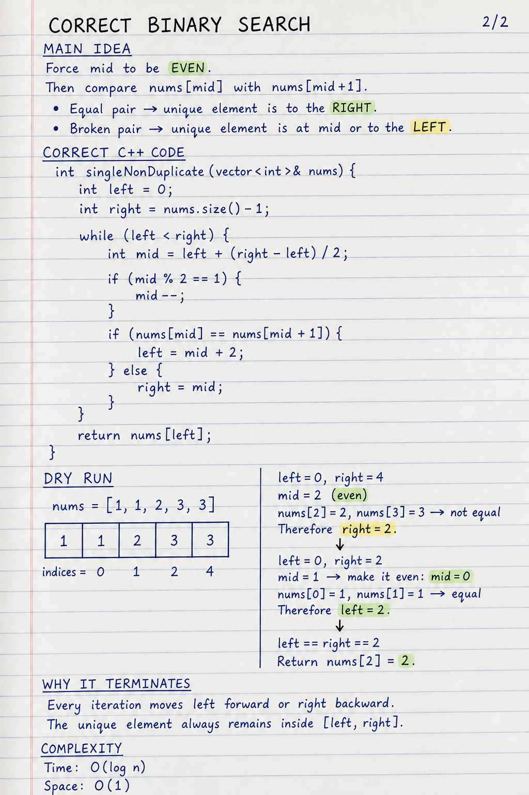
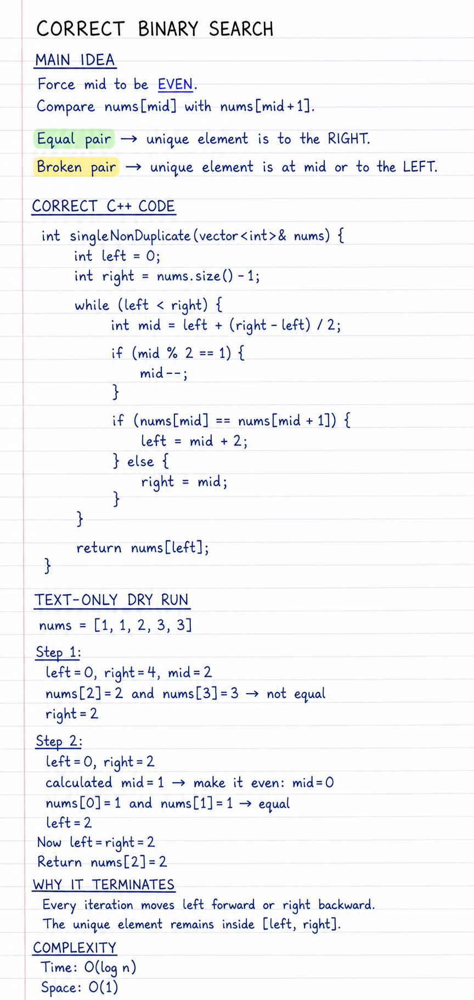
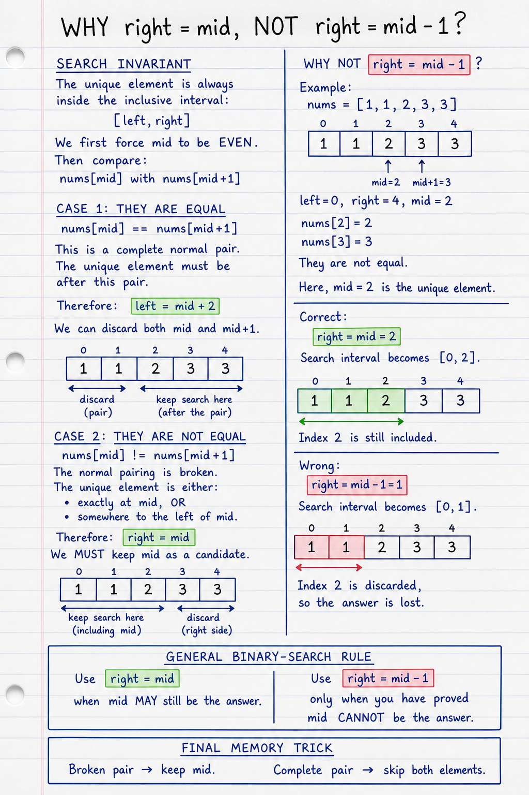

## Q1 Single element in sorted array
Given an array nums sorted in non-decreasing order. Every number in the array except one appears twice. Find the single number in the array.


Examples:
Input :nums = [1, 1, 2, 2, 3, 3, 4, 5, 5, 6, 6]

Output:4

Explanation: Only the number 4 appears once in the array.

Input : nums = [1, 1, 3, 5, 5]

Output:3

Explanation: Only the number 3 appears once in the array.

Brute - Search whole array ->O(n)
Better - Xor solution ->O(n)
Optimal-> as this is sorted so can use BS!! ->O(log n)

### Brute

```cpp
#include <bits/stdc++.h>
using namespace std;

class Solution {
public:
  
    int singleNonDuplicate(vector<int>& nums) {
        int n = nums.size(); 
        
  
        if (n == 1) return nums[0];


        for (int i = 0; i < n; i++) {
          
            if (i == 0) {
                if (nums[i] != nums[i + 1])
                    return nums[i];
            }
    
            else if (i == n - 1) {
                if (nums[i] != nums[i - 1])
                    return nums[i];
            }
      
            else {
                if (nums[i] != nums[i - 1] && nums[i] != nums[i + 1])
                    return nums[i];
            }
        }

     
        return -1;
    }
};

int main() {
    vector<int> nums = {1, 1, 2, 2, 3, 3, 4};
    
    // Create an object of the Solution class.
    Solution sol;
    
    int ans = sol.singleNonDuplicate(nums);
    
    // Print the result.
    cout << "The single element is: " << ans << "\n";
    
    return 0;
}

```
## Optimal

```java


public class Solution {
   private int  findByBs( int[] arr,int si,int ei,int n){
    //why put equal to as need to check the last element present too
    while(si<=ei){
        int mid=(si+ei)/2;
        if((mid%2==0 && mid<n-1 && arr[mid]==arr[mid+1]) || (mid%2!=0 &&mid>0 && arr[mid]==arr[mid-1])) 
            si=mid+1;
        else if((mid%2==0 && mid>0 && arr[mid]==arr[mid-1]) || (mid%2!=0 && mid<n && arr[mid]==arr[mid+1]))
             ei=mid-1;
         else return arr[mid];    
    }
    return -1;
   }
    public int singleNonDuplicate(int[] nums) {
      return findByBs(nums,0,nums.length-1,nums.length);
    }
    public static void main(String[] args) {
        int[] nums = {1, 1, 2, 2, 3, 3, 4};
        
    
        Solution sol = new Solution();
        
        int ans = sol.singleNonDuplicate(nums);
        
        System.out.println("The single element is: " + ans);
    }
}
/*
Output:
The single element is: 4
*/
```

## My wrong solution

```java
class Solution {
    int bs(vector<int> &a, int si, int ei, int n) {
        while (si <= ei) {
            int mid = si + (ei - si) / 2;

            if (mid % 2 == 0) {
                if (mid < n - 1 && a[mid] == a[mid + 1])
                    si = mid + 1;
                else if (mid > 0 && a[mid] == a[mid - 1])
                    ei = mid - 1;
            }

            else {
                if (a[mid] == a[mid - 1])
                    si = mid + 1;
                else if (mid < n && a[mid] == a[mid + 1])
                    ei = mid - 1;
            }
        }

        return si;
    }

   public:
    int singleNonDuplicate(vector<int> &nums) {
        int n = nums.size();
        if (n == 1) return nums[0];
        if (nums[0] != nums[1]) return nums[0];
        if (nums[n - 1] != nums[n - 2]) return nums[n - 1];

        return bs(nums, 0, n - 1, n);
    }
};
```





odd size array always as one element not repeating so always odd sized array.so 2-sized array not in any case



## Why not right=mid-1?


