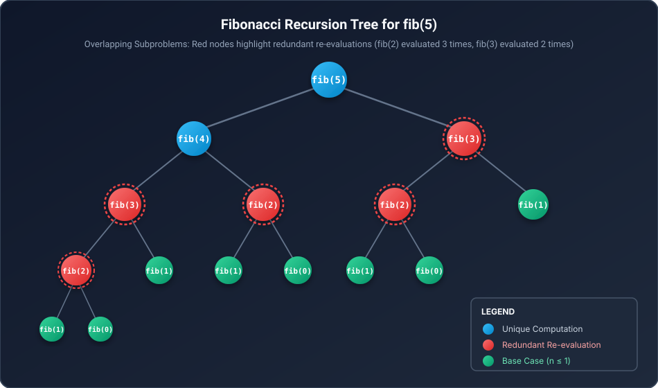
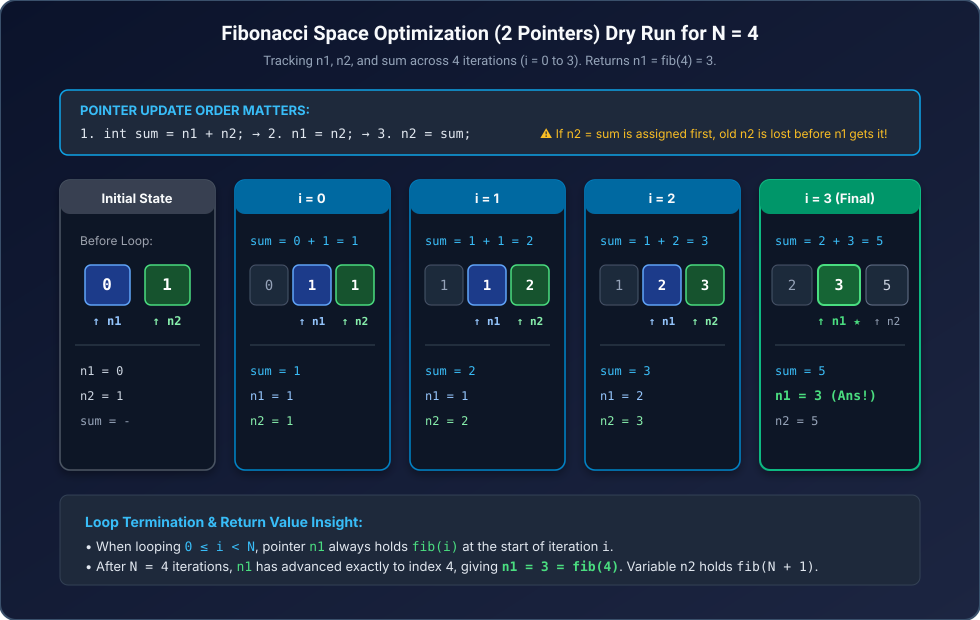
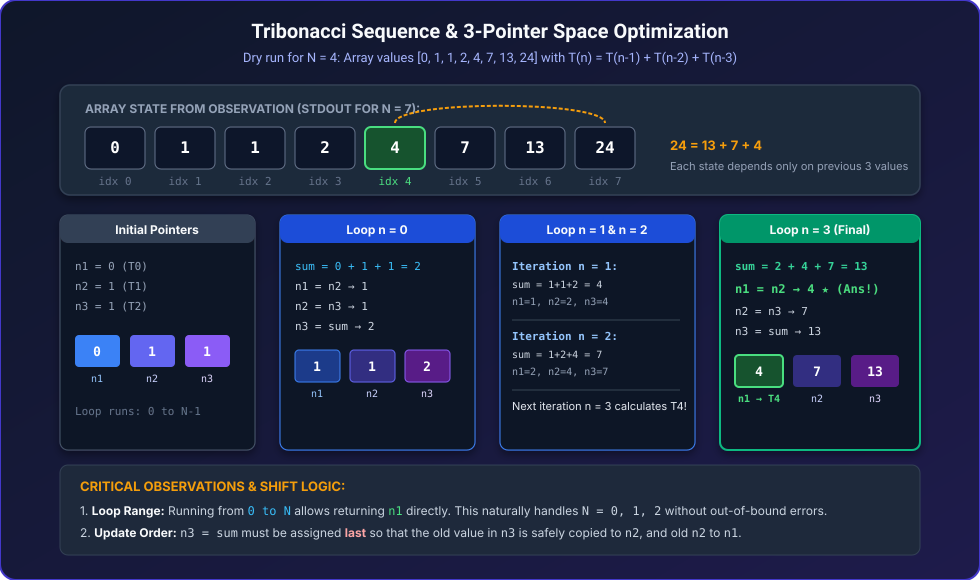
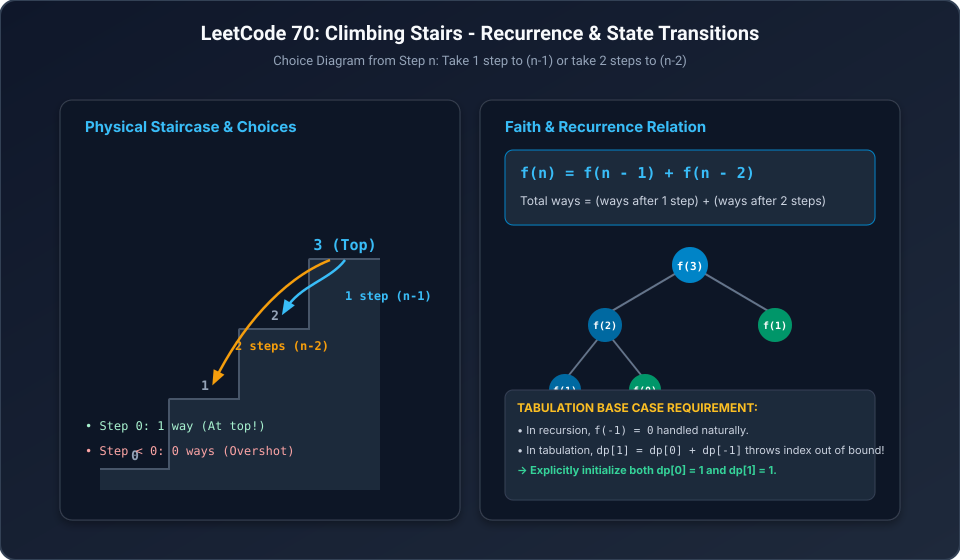
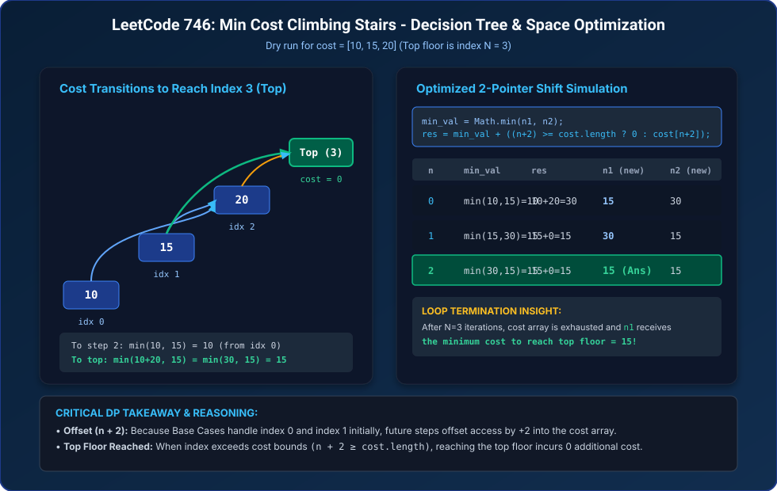

## 1. Universal DP Framework & Display Helpers

### Importance of Display Functions
Display functions are essential when learning and developing Dynamic Programming algorithms. Printing the DP array or matrix provides immediate visual feedback on state transitions, dependencies, base cases, and helps formulate the correct loop traversal order during Tabulation.

#### Display Functions Implementation

**C++:**
```cpp
#include <iostream>
#include <vector>
using namespace std;

// 1D DP Array Display
void display(const vector<int>& dp) {
    for (int ele : dp) {
        cout << ele << " ";
    }
    cout << "\n";
}

// 2D DP Matrix Display
void display2D(const vector<vector<int>>& dp) {
    for (const auto& row : dp) {
        display(row);
    }
}
```

**Java:**
```java
public class DPUtils {
    // 1D DP Array Display
    public static void display(int[] dp) {
        for (int ele : dp) {
            System.out.print(ele + " ");
        }
        System.out.println();
    }

    // 2D DP Matrix Display
    public static void display2D(int[][] dp) {
        for (int[] d : dp) {
            display(d);
        }
    }
}
```

---

### The 7-Step DP Problem-Solving Strategy
Dynamic Programming problems must be systematically approached using the following mandatory order:


1. **Think Faith**: Formulate faith about what the function calculates for a subproblem of size $(n-1), (n-2)$, etc.
2. **Draw Tree Diagram**: Formulate the recursion call tree to identify branching factors and expose identical repeating subproblems.
3. **Do Recursion**: Write the basic recursive solution with appropriate base cases. *Direction Insight:* In recursion, formulating the calls from $N$ down to $0$ is generally better and naturally aligns with state dependencies.
4. **Do Memoization (Top-Down)**: Store subproblem answers in an array or hash map before returning. Before making recursive calls, check whether the result is already computed.
5. **Do Observation**: Print or trace the DP array/matrix to understand which smaller subproblems must be computed first.
6. **Tabulation (Bottom-Up)**: Convert recursive calls into iterative loops matching the observed dependencies. Replace base case returns with array assignments / `continue`, and replace function calls with direct array lookups.
7. **Space Optimization**: If each current state depends only on a fixed window of previous states (e.g., previous 2 or 3 states), replace the entire DP array with pointers/variables.

---

## Question 1: LeetCode 509 - Fibonacci Number

### Problem Statement
The **Fibonacci numbers**, commonly denoted $F(n)$, form a sequence called the **Fibonacci sequence**, such that each number is the sum of the two preceding ones, starting from $0$ and $1$. That is:
- $F(0) = 0$
- $F(1) = 1$
- $F(n) = F(n - 1) + F(n - 2)$, for $n > 1$.

Given $n$, calculate $F(n)$.

#### Examples
- **Example 1:**
  - **Input:** `n = 2`
  - **Output:** `1`
  - **Explanation:** $F(2) = F(1) + F(0) = 1 + 0 = 1$.

- **Example 2:**
  - **Input:** `n = 3`
  - **Output:** `2`
  - **Explanation:** $F(3) = F(2) + F(1) = 1 + 1 = 2$.

- **Example 3:**
  - **Input:** `n = 4`
  - **Output:** `3`
  - **Explanation:** $F(4) = F(3) + F(2) = 2 + 1 = 3$.

#### Constraints
- $0 \le n \le 30$

---

### Step 1 & 2: Recurrence Relation & Recursion Tree
$$F(n) = F(n - 1) + F(n - 2) \quad \text{for } n \ge 2$$
$$\text{Base Cases: } \text{if } (n \le 1) \text{ return } n$$



#### Redundant Computation Insight
As shown in the recursion tree for $F(5)$, identical subproblems such as `fib(2)` are evaluated multiple times from distinct branches.
- To eliminate re-evaluation, results are stored in an array (`dp[]`) upon first calculation.
- Since indices range from $0$ to $N$, an array of size $N + 1$ is allocated (indices $0$ to $N$).
- **Universal Memoization Rule:** Wherever a return statement exists, store the value into `dp[n]` first, including the Base Case (e.g., `return dp[n] = n;`).

---

### Step 3: Pure Recursion (Brute Force)

**C++:**
```cpp
class Solution {
public:
    int fib(int n) {
        if (n <= 1) return n;
        return fib(n - 1) + fib(n - 2);
    }
};
```

**Java:**
```java
class Solution {
    public int fib(int n) {
        if (n <= 1) return n;
        return fib(n - 1) + fib(n - 2);
    }
}
```

#### Complexity Analysis
- **Time Complexity:** $O(2^n)$
  - *Reason:* Each call branches into two sub-calls, leading to an exponential binary recursion tree of depth $n$ with up to $2^n$ nodes.
- **Space Complexity:** $O(n)$
  - *Reason:* Auxiliary recursion call stack depth equals the maximum height of the tree, which is $n$.

---

### Step 4: Memoization (Top-Down DP)

**C++:**
```cpp
#include <vector>
using namespace std;

class Solution {
private:
    int fibo_memo(int n, vector<int>& dp) {
        if (n <= 1) return dp[n] = n;
        if (dp[n] != -1) return dp[n]; // Answer already computed

        return dp[n] = fibo_memo(n - 1, dp) + fibo_memo(n - 2, dp);
    }

public:
    int fib(int n) {
        vector<int> dp(n + 1, -1);
        return fibo_memo(n, dp);
    }
};
```

**Java:**
```java
class Solution {
    public static int fibo_memo(int n, int[] dp) {
        if (n <= 1) return dp[n] = n;
        if (dp[n] != 0) return dp[n]; // Check if already present in array

        return dp[n] = fibo_memo(n - 1, dp) + fibo_memo(n - 2, dp);
    }

    public int fib(int n) {
        int[] dp = new int[n + 1];
        return fibo_memo(n, dp);
    }
}
```

#### Complexity Analysis
- **Time Complexity:** $O(n)$
  - *Reason:* Each state from $0$ to $n$ is evaluated exactly once. Subsequent lookups take $O(1)$ time.
- **Space Complexity:** $O(n)$
  - *Reason:* Requires $O(n)$ space for the `dp` array plus $O(n)$ space for the auxiliary recursion call stack.

---

### Step 5: Observation & State Dependency
Tracing the memoization array for $N = 10$:

$$\begin{array}{|c|c|c|c|c|c|c|c|c|c|c|c|}
\hline
\textbf{Index } n & 0 & 1 & 2 & 3 & 4 & 5 & 6 & 7 & 8 & 9 & 10 \\
\hline
\textbf{dp}[n] & 0 & 1 & 1 & 2 & 3 & 5 & 8 & 13 & 21 & 34 & 55 \\
\hline
\end{array}$$

- Notice that $21 = 13 + 8$ and $5 = 3 + 2$.
- Every state $dp[n]$ depends directly on the two immediately preceding states: $dp[n - 1]$ and $dp[n - 2]$.
- To compute $dp[10] = 55$, we must already have $dp[9] = 34$ and $dp[8] = 21$.
- **Conclusion:** Tabulation loop must progress strictly from **left to right** ($0 \to N$).

---

### Step 6: Tabulation (Bottom-Up DP)

#### Conversion Strategy from Memoization:
1. Retain the same loop variable name used in memoization (`n`) to prevent index mismatch bugs.
2. Replace base case `return` statements with `dp[n] = ...; continue;`.
3. Replace recursive function calls `fibo_memo(n - 1, dp)` with direct array lookups `dp[n - 1]`.

**C++:**
```cpp
#include <vector>
using namespace std;

class Solution {
public:
    int fib(int N) {
        vector<int> dp(N + 1, 0);
        for (int n = 0; n <= N; n++) {
            if (n <= 1) {
                dp[n] = n;
                continue;
            }
            dp[n] = dp[n - 1] + dp[n - 2];
        }
        return dp[N];
    }
};
```

**Java:**
```java
class Solution {
    public static int fibo_tabu(int N, int[] dp) {
        for (int n = 0; n <= N; n++) {
            if (n <= 1) {
                dp[n] = n;
                continue;
            }
            dp[n] = dp[n - 1] + dp[n - 2];
        }
        return dp[N];
    }

    public int fib(int N) {
        int[] dp = new int[N + 1];
        return fibo_tabu(N, dp);
    }
}
```

#### Complexity Analysis
- **Time Complexity:** $O(n)$
  - *Reason:* A single linear loop runs from $0$ to $N$, with $O(1)$ operations per iteration.
- **Space Complexity:** $O(n)$
  - *Reason:* $O(n)$ space allocated for the 1D DP table. Auxiliary recursion stack space is completely eliminated ($0$).

---

### Step 7: Space Optimization (2 Pointers)

#### Pointer Shift Logic & Dry Run for $N = 4$
Since calculating the current Fibonacci number requires only the previous two numbers, storing the entire array of size $N + 1$ is redundant. We maintain two pointers/variables: $n_1$ and $n_2$.



#### Critical Update Order:
```
int sum = n1 + n2;
n1 = n2;
n2 = sum;
```
*Note:* `n2 = sum` must be updated **after** `n1 = n2`. If `n2 = sum` is assigned first, the previous value of `n2` required by `n1` is overwritten and lost.

#### Loop Boundaries:
Loop runs $N$ times ($0 \le i < N$). At loop completion, $n_1$ holds $F(N)$, while $n_2$ holds $F(N + 1)$.

**C++:**
```cpp
class Solution {
public:
    int fib(int N) {
        int n1 = 0;
        int n2 = 1;
        for (int i = 0; i < N; i++) {
            int sum = n1 + n2;
            n1 = n2;
            n2 = sum;
        }
        return n1;
    }
};
```

**Java:**
```java
import java.util.Scanner;

class Solution {
    public int fib(int N) {
        int n1 = 0;
        int n2 = 1;
        for (int i = 0; i < N; i++) {
            int sum = n1 + n2;
            n1 = n2;
            n2 = sum;
        }
        return n1;
    }

    public static void main(String[] args) {
        Scanner scn = new Scanner(System.in);
        int N = scn.nextInt();
        int n1 = 0;
        int n2 = 1;
        for (int i = 0; i < N; i++) {
            int sum = n1 + n2;
            n1 = n2;
            n2 = sum;
        }
        System.out.println(n1);
    }
}
```

#### Complexity Analysis
- **Time Complexity:** $O(n)$
  - *Reason:* Loop executes exactly $N$ iterations doing constant $O(1)$ arithmetic operations.
- **Space Complexity:** $O(1)$
  - *Reason:* Only three scalar variables (`n1`, `n2`, `sum`) are maintained in memory.

---

## Question 2: LeetCode 1137 - N-th Tribonacci Number

### Problem Statement
The **Tribonacci sequence** $T_n$ is defined as follows:
- $T_0 = 0$
- $T_1 = 1$
- $T_2 = 1$
- $T_{n+3} = T_n + T_{n+1} + T_{n+2}$ for $n \ge 0$.

Given `n`, return the value of $T_n$.

#### Examples
- **Example 1:**
  - **Input:** `n = 4`
  - **Output:** `4`
  - **Explanation:**
    - $T_3 = 0 + 1 + 1 = 2$
    - $T_4 = 1 + 1 + 2 = 4$

- **Example 2:**
  - **Input:** `n = 25`
  - **Output:** `1389537`

#### Constraints
- $0 \le n \le 37$
- The answer is guaranteed to fit within a 32-bit integer, i.e., $T_n \le 2^{31} - 1$.

---

### Step 1 & 2: Recurrence Relation
$$T(n) = T(n - 1) + T(n - 2) + T(n - 3) \quad \text{for } n \ge 3$$
$$\text{Base Cases: } \text{if } (n == 0 \parallel n == 1) \text{ return } n; \quad \text{if } (n == 2) \text{ return } 1;$$

---

### Step 3: Pure Recursion (TLE)

**C++:**
```cpp
class Solution {
public:
    int tribonacci(int n) {
        if (n == 0 || n == 1) return n;
        if (n == 2) return 1;
        return tribonacci(n - 1) + tribonacci(n - 2) + tribonacci(n - 3);
    }
};
```

**Java:**
```java
class Solution {
    public int tribonacci(int n) {
        if (n == 0 || n == 1) return n;
        if (n == 2) return 1;
        return tribonacci(n - 1) + tribonacci(n - 2) + tribonacci(n - 3);
    }
}
```

#### Complexity Analysis
- **Time Complexity:** $O(3^n)$
  - *Reason:* The recursion tree splits into 3 recursive calls at each level, leading to exponential time and Time Limit Exceeded (TLE).
- **Space Complexity:** $O(n)$
  - *Reason:* Maximum depth of the recursive call stack is $n$.

---

### Step 4: Memoization (Top-Down DP)

**C++:**
```cpp
#include <vector>
using namespace std;

class Solution {
private:
    int tribonacci_memo(int n, vector<int>& dp) {
        if (n == 0 || n == 1) return dp[n] = n;
        if (n == 2) return dp[n] = 1;
        if (dp[n] != -1) return dp[n];

        return dp[n] = tribonacci_memo(n - 1, dp) +
                       tribonacci_memo(n - 2, dp) +
                       tribonacci_memo(n - 3, dp);
    }

public:
    int tribonacci(int n) {
        vector<int> dp(n + 1, -1);
        return tribonacci_memo(n, dp);
    }
};
```

**Java:**
```java
class Solution {
    public int tribonacci_memo(int n, int[] dp) {
        if (n == 0 || n == 1) return dp[n] = n;
        if (n == 2) return dp[n] = 1;
        if (dp[n] != 0) return dp[n];

        return dp[n] = tribonacci_memo(n - 1, dp) +
                       tribonacci_memo(n - 2, dp) +
                       tribonacci_memo(n - 3, dp);
    }

    public int tribonacci(int n) {
        int[] dp = new int[n + 1];
        int res = tribonacci_memo(n, dp);
        return res;
    }
}
```

#### Complexity Analysis
- **Time Complexity:** $O(n)$
  - *Reason:* Each subproblem $T(0)$ through $T(n)$ is computed once and stored in $O(1)$ amortized time.
- **Space Complexity:** $O(n)$
  - *Reason:* $O(n)$ space for the memoization table + $O(n)$ auxiliary recursion stack space.

---

### Step 5: Observation & State Dependency
Tracing `dp[]` array for input $n = 7$:

$$\begin{array}{|c|c|c|c|c|c|c|c|c|}
\hline
\textbf{Index } n & 0 & 1 & 2 & 3 & 4 & 5 & 6 & 7 \\
\hline
\textbf{dp}[n] & 0 & 1 & 1 & 2 & 4 & 7 & 13 & 24 \\
\hline
\end{array}$$

- Here, $24 = 13 + 7 + 4$.
- Each state requires the preceding 3 computed values.
- Therefore, the calculation order moves strictly from **left to right** ($0 \to N$).

---

### Step 6: Tabulation (Bottom-Up DP)

**C++:**
```cpp
#include <vector>
using namespace std;

class Solution {
public:
    int tribonacci(int N) {
        vector<int> dp(N + 1, 0);
        for (int n = 0; n <= N; n++) {
            if (n == 0 || n == 1) {
                dp[n] = n;
                continue;
            }
            if (n == 2) {
                dp[n] = 1;
                continue;
            }
            dp[n] = dp[n - 1] + dp[n - 2] + dp[n - 3];
        }
        return dp[N];
    }
};
```

**Java:**
```java
class Solution {
    public int tribonacci(int N) {
        int[] dp = new int[N + 1];
        for (int n = 0; n <= N; n++) {
            if (n == 0 || n == 1) {
                dp[n] = n;
                continue;
            }
            if (n == 2) {
                dp[n] = 1;
                continue;
            }
            dp[n] = dp[n - 1] + dp[n - 2] + dp[n - 3];
        }
        return dp[N];
    }
}
```

#### Complexity Analysis
- **Time Complexity:** $O(n)$
  - *Reason:* Single iterative loop running from $0$ to $N$.
- **Space Complexity:** $O(n)$
  - *Reason:* Table of size $N + 1$ is maintained.

---

### Step 7: Space Optimization (3 Pointers)

#### Pointer Transition & Dry Run for $N = 4$
Since every number is the sum of the preceding 3 numbers, we only need 3 variables: $n_1, n_2, n_3$.



#### Update Order:
```
int sum = n1 + n2 + n3;
n1 = n2;
n2 = n3;
n3 = sum;
```
*Note:* If `n3 = sum` were executed first, the original value in `n3` would be lost before `n2` could copy it. Thus, `n3 = sum` must be assigned last.

#### Loop Range Advantage:
Running the loop from $0$ to $N - 1$ and returning `n1` handles small boundary inputs ($N = 0, 1, 2$) cleanly without special branch conditions.

**C++:**
```cpp
class Solution {
public:
    int tribonacci(int N) {
        int n1 = 0;
        int n2 = 1;
        int n3 = 1;
        for (int n = 0; n < N; n++) {
            int sum = n1 + n2 + n3;
            n1 = n2;
            n2 = n3;
            n3 = sum;
        }
        return n1;
    }
};
```

**Java:**
```java
class Solution {
    public int tribonacci(int N) {
        int n1 = 0;
        int n2 = 1;
        int n3 = 1;
        for (int n = 0; n < N; n++) {
            int sum = n1 + n2 + n3;
            n1 = n2;
            n2 = n3;
            n3 = sum;
        }
        return n1;
    }
}
```

#### Complexity Analysis
- **Time Complexity:** $O(n)$
  - *Reason:* $N$ iterations performing $O(1)$ additions and variable reassignments.
- **Space Complexity:** $O(1)$
  - *Reason:* Only 4 primitive scalar variables are allocated in memory.

---

## Question 3: LeetCode 70 - Climbing Stairs

### Problem Statement
You are climbing a staircase. It takes `n` steps to reach the top.
Each time you can either climb `1` or `2` steps. In how many distinct ways can you climb to the top?

#### Examples
- **Example 1:**
  - **Input:** `n = 2`
  - **Output:** `2`
  - **Explanation:** There are two ways to climb to the top:
    1. $1 \text{ step} + 1 \text{ step}$
    2. $2 \text{ steps}$

- **Example 2:**
  - **Input:** `n = 3`
  - **Output:** `3`
  - **Explanation:** There are three ways to climb to the top:
    1. $1 \text{ step} + 1 \text{ step} + 1 \text{ step}$
    2. $1 \text{ step} + 2 \text{ steps}$
    3. $2 \text{ steps} + 1 \text{ step}$

#### Constraints
- $1 \le n \le 45$

---

### Step 1 & 2: Physical Faith & Recurrence Relation
From stair step $n$, you have two valid choices:
1. Climb **1 step**: Lands you on step $(n - 1)$. The remaining ways to reach the top from here will be resolved by subproblem $f(n - 1)$.
2. Climb **2 steps**: Lands you on step $(n - 2)$. The remaining ways to reach the top from here will be resolved by subproblem $f(n - 2)$.

Total distinct ways is the sum of both independent options:
$$f(n) = f(n - 1) + f(n - 2)$$



#### Base Cases:
- `if (n == 0) return 1;` $\to$ Reaching the target floor exactly counts as 1 valid combination of steps.
- `if (n < 0) return 0;` $\to$ Overshooting the stairs is an invalid path (0 ways).

---

### Step 3: Pure Recursion (TLE)

**C++:**
```cpp
class Solution {
public:
    int climbStairs(int n) {
        if (n < 0) return 0;
        if (n == 0) return 1;
        return climbStairs(n - 1) + climbStairs(n - 2);
    }
};
```

**Java:**
```java
class Solution {
    public int climbStairs(int n) {
        if (n < 0) return 0;
        if (n == 0) return 1;
        return climbStairs(n - 1) + climbStairs(n - 2);
    }
}
```

#### Complexity Analysis
- **Time Complexity:** $O(2^n)$
  - *Reason:* Exponential recursion tree with height $n$.
- **Space Complexity:** $O(n)$
  - *Reason:* Recursion stack depth is proportional to $n$.

---

### Step 4: Memoization (Top-Down DP)

#### Base Case Optimization Note:
In the initial recursion, `if (n < 0) return 0;` was used. However, array indices cannot be negative (`dp[-1]` is invalid).
- Notice that for $n = 1$, the only valid jump is a 1-step jump to step 0 ($1$ way).
- If we define the base case directly as `if (n <= 1) return dp[n] = 1;`, calls from any $n \ge 2$ will make recursive sub-calls down to at most $f(0)$, completely avoiding negative indices.

**C++:**
```cpp
#include <vector>
using namespace std;

class Solution {
private:
    int climbStairs_memo(int n, vector<int>& dp) {
        if (n <= 1) return dp[n] = 1;
        if (dp[n] != -1) return dp[n];

        return dp[n] = climbStairs_memo(n - 1, dp) + climbStairs_memo(n - 2, dp);
    }

public:
    int climbStairs(int n) {
        vector<int> dp(n + 1, -1);
        return climbStairs_memo(n, dp);
    }
};
```

**Java:**
```java
class Solution {
    public int climbStairs_memo(int n, int[] dp) {
        if (n <= 1) return dp[n] = 1;
        if (dp[n] != 0) return dp[n];

        return dp[n] = climbStairs_memo(n - 1, dp) + climbStairs_memo(n - 2, dp);
    }

    public int climbStairs(int n) {
        int[] dp = new int[n + 1];
        return climbStairs_memo(n, dp);
    }
}
```

#### Complexity Analysis
- **Time Complexity:** $O(n)$
  - *Reason:* Subproblems for $0 \le i \le n$ evaluated once.
- **Space Complexity:** $O(n)$
  - *Reason:* DP array of size $n + 1$ plus recursion stack space of size $n$.

---

### Step 5: Observation & State Dependency
Printing `dp[]` array for $n = 10$:

$$\begin{array}{|c|c|c|c|c|c|c|c|c|c|c|c|}
\hline
\textbf{Index } n & 0 & 1 & 2 & 3 & 4 & 5 & 6 & 7 & 8 & 9 & 10 \\
\hline
\textbf{dp}[n] & 1 & 1 & 2 & 3 & 5 & 8 & 13 & 21 & 34 & 55 & 89 \\
\hline
\end{array}$$

- This is identical to the Fibonacci sequence, shifted by 1 index ($dp[0] = 1, dp[1] = 1$).
- Direction: Left to right.

---

### Step 6: Tabulation (Bottom-Up DP)

#### Explicit Base Case Note for Tabulation:
In recursion, $n < 0$ returned 0, so $f(1) = f(0) + f(-1) = 1 + 0 = 1$. In tabulation, writing `dp[1] = dp[0] + dp[-1]` would cause an array index out-of-bounds error. Therefore, in tabulation, we explicitly initialize both base cases:
$$dp[0] = 1 \quad \text{and} \quad dp[1] = 1$$

**C++:**
```cpp
#include <vector>
using namespace std;

class Solution {
public:
    int climbStairs(int N) {
        vector<int> dp(N + 1, 0);
        for (int n = 0; n <= N; n++) {
            if (n == 0 || n == 1) {
                dp[n] = 1;
                continue;
            }
            dp[n] = dp[n - 1] + dp[n - 2];
        }
        return dp[N];
    }
};
```

**Java:**
```java
class Solution {
    public int climbStairs(int N) {
        int[] dp = new int[N + 1];
        for (int n = 0; n <= N; n++) {
            if (n == 0 || n == 1) {
                dp[n] = 1;
                continue;
            }
            dp[n] = dp[n - 1] + dp[n - 2];
        }
        return dp[N];
    }
}
```

#### Complexity Analysis
- **Time Complexity:** $O(n)$
  - *Reason:* $N$ iterations filling array elements sequentially.
- **Space Complexity:** $O(n)$
  - *Reason:* Auxiliary array of size $N + 1$.

---

### Step 7: Space Optimization (2 Variables)
Identical to the Fibonacci optimization, but initialized with $n_1 = 1$ and $n_2 = 1$.

**C++:**
```cpp
class Solution {
public:
    int climbStairs(int N) {
        int n1 = 1;
        int n2 = 1;
        for (int n = 0; n < N; n++) {
            int sum = n1 + n2;
            n1 = n2;
            n2 = sum;
        }
        return n1;
    }
};
```

**Java:**
```java
class Solution {
    public int climbStairs(int N) {
        int n1 = 1;
        int n2 = 1;
        for (int n = 0; n < N; n++) {
            int sum = n1 + n2;
            n1 = n2;
            n2 = sum;
        }
        return n1;
    }
}
```

#### Complexity Analysis
- **Time Complexity:** $O(n)$
  - *Reason:* Single loop executing $N$ times.
- **Space Complexity:** $O(1)$
  - *Reason:* Only two tracking variables are required.

---

## Question 4: LeetCode 746 - Min Cost Climbing Stairs

### Problem Statement
You are given an integer array `cost` where `cost[i]` is the cost of the $i^{\text{th}}$ step on a staircase. Once you pay the cost, you can either climb **one** or **two** steps.

You can either start from the step with index `0`, or the step with index `1`.

Return the *minimum cost to reach the top of the floor*.

#### Examples
- **Example 1:**
  - **Input:** `cost = [10, 15, 20]`
  - **Output:** `15`
  - **Explanation:** You will start at index 1:
    - Pay 15 and climb two steps to reach the top.
    - Total cost = $15$.

- **Example 2:**
  - **Input:** `cost = [1, 100, 1, 1, 1, 100, 1, 1, 100, 1]`
  - **Output:** `6`
  - **Explanation:** You will start at index 0:
    - Pay 1 and climb two steps to reach index 2.
    - Pay 1 and climb two steps to reach index 4.
    - Pay 1 and climb two steps to reach index 6.
    - Pay 1 and climb one step to reach index 7.
    - Pay 1 and climb two steps to reach index 9.
    - Pay 1 and climb one step to reach the top floor.
    - Total cost = $6$.

#### Constraints
- $2 \le \text{cost.length} \le 1000$
- $0 \le \text{cost}[i] \le 999$

---

### Step 1 & 2: Reaching Top Floor & Recurrence Relation
Let $N = \text{cost.length}$. The "top of the floor" is index $N$ (one position beyond the last step).
- Landing on the top floor incurs no additional step cost ($0$).
- For any step $n < N$, stepping on stair $n$ costs $\text{cost}[n]$.
- Step $n$ can be reached either from $(n - 1)$ or $(n - 2)$.



#### Mathematical Recurrence:
$$f(n) = \min(f(n - 1), f(n - 2)) + (n == \text{cost.length} \text{ ? } 0 : \text{cost}[n])$$
$$\text{Base Cases: } \text{if } (n == 0 \parallel n == 1) \text{ return } \text{cost}[n];$$

*Boundary Guard:* When $n = \text{cost.length}$, accessing `cost[n]` directly causes an Array Index Out Of Bounds error. Hence, add $0$ when $n == \text{cost.length}$, and $\text{cost}[n]$ otherwise.

---

### Step 3: Pure Recursion (Brute Force)

**C++:**
```cpp
#include <vector>
#include <algorithm>
using namespace std;

class Solution {
private:
    int minCostClimbingStairs_rec(const vector<int>& cost, int n) {
        if (n == 0 || n == 1) return cost[n];
        int r1 = minCostClimbingStairs_rec(cost, n - 1);
        int r2 = minCostClimbingStairs_rec(cost, n - 2);
        int currentStepCost = (n == (int)cost.size()) ? 0 : cost[n];
        return min(r1, r2) + currentStepCost;
    }

public:
    int minCostClimbingStairs(vector<int>& cost) {
        return minCostClimbingStairs_rec(cost, cost.size());
    }
};
```

**Java:**
```java
class Solution {
    public int minCostClimbingStairs_rec(int[] cost, int n) {
        if (n == 0 || n == 1) return cost[n];
        int r1 = minCostClimbingStairs_rec(cost, n - 1);
        int r2 = minCostClimbingStairs_rec(cost, n - 2);
        int currentStepCost = (n == cost.length) ? 0 : cost[n];
        return Math.min(r1, r2) + currentStepCost;
    }

    public int minCostClimbingStairs(int[] cost) {
        int n = cost.length;
        return minCostClimbingStairs_rec(cost, n);
    }
}
```

#### Complexity Analysis
- **Time Complexity:** $O(2^n)$
  - *Reason:* Two recursive branches per call without memoization.
- **Space Complexity:** $O(n)$
  - *Reason:* Recursion stack depth reaches $n$.

---

### Step 4: Memoization (Top-Down DP)

**C++:**
```cpp
#include <vector>
#include <algorithm>
using namespace std;

class Solution {
private:
    int minCostClimbingStairs_memo(const vector<int>& cost, int n, vector<int>& dp) {
        if (n == 0 || n == 1) return dp[n] = cost[n];
        if (dp[n] != -1) return dp[n];

        int r1 = minCostClimbingStairs_memo(cost, n - 1, dp);
        int r2 = minCostClimbingStairs_memo(cost, n - 2, dp);
        int res = min(r1, r2);
        int currentStepCost = (n == (int)cost.size()) ? 0 : cost[n];

        return dp[n] = res + currentStepCost;
    }

public:
    int minCostClimbingStairs(vector<int>& cost) {
        int n = cost.size();
        vector<int> dp(n + 1, -1);
        return minCostClimbingStairs_memo(cost, n, dp);
    }
};
```

**Java:**
```java
import java.util.Arrays;

class Solution {
    public int minCostClimbingStairs_memo(int[] cost, int n, int[] dp) {
        if (n == 0 || n == 1) return dp[n] = cost[n];
        if (dp[n] != -1) return dp[n];

        int r1 = minCostClimbingStairs_memo(cost, n - 1, dp);
        int r2 = minCostClimbingStairs_memo(cost, n - 2, dp);
        int res = Math.min(r1, r2);
        int currentStepCost = (n == cost.length) ? 0 : cost[n];

        return dp[n] = res + currentStepCost;
    }

    public int minCostClimbingStairs(int[] cost) {
        int n = cost.length;
        int[] dp = new int[n + 1];
        Arrays.fill(dp, -1);
        return minCostClimbingStairs_memo(cost, n, dp);
    }
}
```

#### Complexity Analysis
- **Time Complexity:** $O(n)$
  - *Reason:* Evaluates each subproblem from $0$ to $n$ at most once.
- **Space Complexity:** $O(n)$
  - *Reason:* `dp` array of size $n + 1$ and recursion call stack of depth $n$.

---

### Step 5: Observation & State Dependency
For `cost = [10, 15, 20]`:
- $dp[0] = \text{cost}[0] = 10$
- $dp[1] = \text{cost}[1] = 15$
- $dp[2] = \min(10, 15) + 20 = 10 + 20 = 30$
- $dp[3] = \min(15, 30) + 0 = 15$

Array output: `[10, 15, 30, 15]`.
- Calculation flows from index $0$ to $N$.

---

### Step 6: Tabulation (Bottom-Up DP)

**C++:**
```cpp
#include <vector>
#include <algorithm>
using namespace std;

class Solution {
public:
    int minCostClimbingStairs(vector<int>& cost) {
        int N = cost.size();
        vector<int> dp(N + 1, 0);
        for (int n = 0; n <= N; n++) {
            if (n == 0 || n == 1) {
                dp[n] = cost[n];
                continue;
            }
            int r1 = dp[n - 1];
            int r2 = dp[n - 2];
            int res = min(r1, r2);
            dp[n] = res + (n == N ? 0 : cost[n]);
        }
        return dp[N];
    }
};
```

**Java:**
```java
class Solution {
    public int minCostClimbingStairs(int[] cost) {
        int N = cost.length;
        int[] dp = new int[N + 1];
        for (int n = 0; n <= N; n++) {
            if (n == 0 || n == 1) {
                dp[n] = cost[n];
                continue;
            }
            int r1 = dp[n - 1];
            int r2 = dp[n - 2];
            int res = Math.min(r1, r2);
            dp[n] = res + (n == cost.length ? 0 : cost[n]);
        }
        return dp[N];
    }
}
```

#### Complexity Analysis
- **Time Complexity:** $O(n)$
  - *Reason:* Linear scan filling $dp[0]$ to $dp[N]$.
- **Space Complexity:** $O(n)$
  - *Reason:* DP array of size $N + 1$.

---

### Step 7: Space Optimization (2 Variables)

#### Why $(n + 2)$ is used in the optimized version:
- Because $n_1$ and $n_2$ are initialized with `cost[0]` and `cost[1]` before the loop starts, iterations beginning at $n = 0$ must access the upcoming stair at index $(n + 2)$.
- When $(n + 2) \ge \text{cost.length}$, the top floor is reached and incurs $0$ additional cost.

#### Dry Run for `cost = [10, 15, 20]`:
1. **Initial:** $n_1 = 10$, $n_2 = 15$.
2. **Iteration $n = 0$:**
   - $\text{min\_val} = \min(10, 15) = 10$
   - $\text{res} = 10 + \text{cost}[0 + 2] = 10 + 20 = 30$
   - $n_1 = n_2 = 15$
   - $n_2 = \text{res} = 30$
3. **Iteration $n = 1$:**
   - $\text{min\_val} = \min(15, 30) = 15$
   - $(1 + 2) \ge 3 \implies \text{cost} = 0$, so $\text{res} = 15 + 0 = 15$
   - $n_1 = n_2 = 30$
   - $n_2 = \text{res} = 15$
4. **Iteration $n = 2$:**
   - $\text{min\_val} = \min(30, 15) = 15$
   - $(2 + 2) \ge 3 \implies \text{cost} = 0$, so $\text{res} = 15 + 0 = 15$
   - $n_1 = n_2 = 15$
   - $n_2 = \text{res} = 15$
5. **Loop terminates:** Returns $n_1 = 15$.

**C++:**
```cpp
#include <vector>
#include <algorithm>
using namespace std;

class Solution {
public:
    int minCostClimbingStairs(vector<int>& cost) {
        int N = cost.size();
        int n1 = cost[0];
        int n2 = cost[1];
        for (int n = 0; n < N; n++) {
            int min_val = min(n1, n2);
            int res = min_val + ((n + 2) >= N ? 0 : cost[n + 2]);
            n1 = n2;
            n2 = res;
        }
        return n1;
    }
};
```

**Java:**
```java
class Solution {
    public int minCostClimbingStairs(int[] cost) {
        int N = cost.length;
        int n1 = cost[0];
        int n2 = cost[1];
        for (int n = 0; n < N; n++) {
            int min_val = Math.min(n1, n2);
            int res = min_val + ((n + 2) >= cost.length ? 0 : cost[n + 2]);
            n1 = n2;
            n2 = res;
        }
        return n1;
    }
}
```

#### Complexity Analysis
- **Time Complexity:** $O(n)$
  - *Reason:* Loop runs exactly $N$ iterations with $O(1)$ constant time operations.
- **Space Complexity:** $O(1)$
  - *Reason:* Eliminates array storage and uses only primitive variables.

---

## Homework Problem: Friends Pairing Problem

### Problem Statement
Given $n$ friends, each friend can either remain single or be paired up with some other friend. Each friend can be paired only once. Find the total number of distinct ways in which friends can remain single or be paired up.

#### Recurrence Relation
For the $n^{\text{th}}$ person:
1. **Remains Single:** The remaining $(n - 1)$ friends can form arrangements in $f(n - 1)$ ways.
2. **Pairs Up:** The $n^{\text{th}}$ person can choose any of the remaining $(n - 1)$ friends to pair with. After choosing one partner, the remaining $(n - 2)$ friends can arrange themselves in $f(n - 2)$ ways. Total ways: $(n - 1) \times f(n - 2)$.

$$f(n) = f(n - 1) + (n - 1) \times f(n - 2)$$
$$\text{Base Cases: } f(0) = 1, \quad f(1) = 1$$

---

### Implementation (Space-Optimized)

**C++:**
```cpp
class Solution {
public:
    int countFriendsPairings(int n) {
        if (n <= 1) return 1;
        long long n1 = 1; // f(0)
        long long n2 = 1; // f(1)
        long long MOD = 1e9 + 7;

        for (int i = 2; i <= n; i++) {
            long long res = (n2 + (i - 1) * n1) % MOD;
            n1 = n2;
            n2 = res;
        }
        return n2;
    }
};
```

**Java:**
```java
class Solution {
    public long countFriendsPairings(int n) {
        if (n <= 1) return 1;
        long n1 = 1; // f(0)
        long n2 = 1; // f(1)
        long MOD = 1000000007L;

        for (int i = 2; i <= n; i++) {
            long res = (n2 + (i - 1) * n1) % MOD;
            n1 = n2;
            n2 = res;
        }
        return n2;
    }
}
```

#### Complexity Analysis
- **Time Complexity:** $O(n)$
  - *Reason:* Linear iteration from $2$ to $n$.
- **Space Complexity:** $O(1)$
  - *Reason:* Uses two scalar variables to track states.
