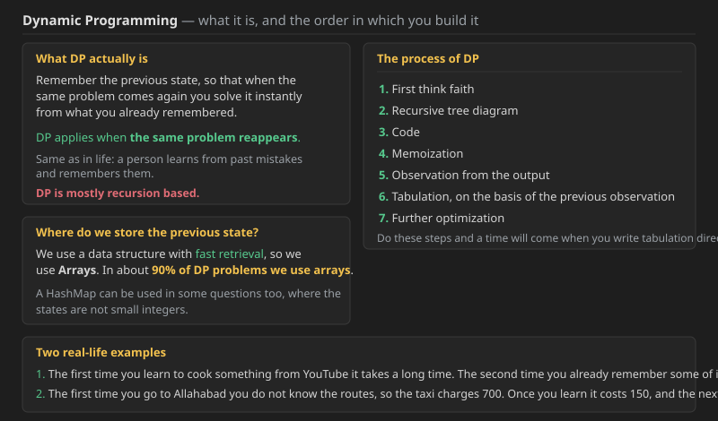
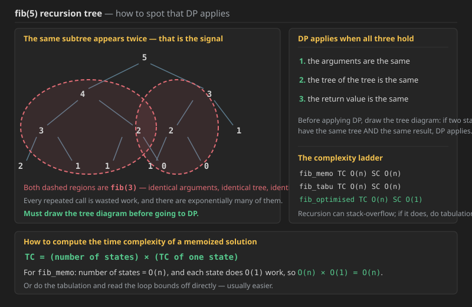
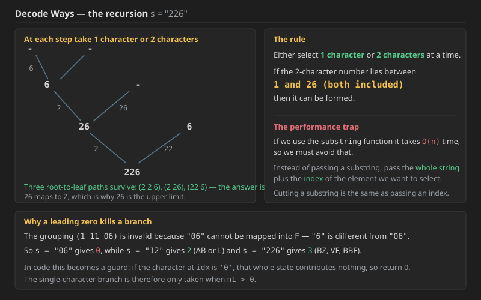
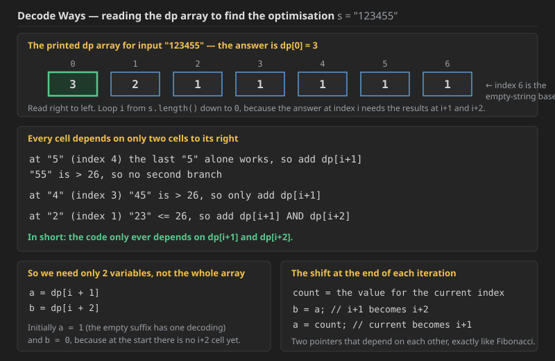
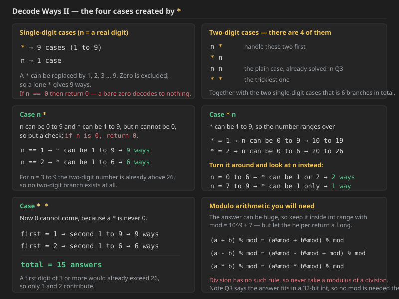
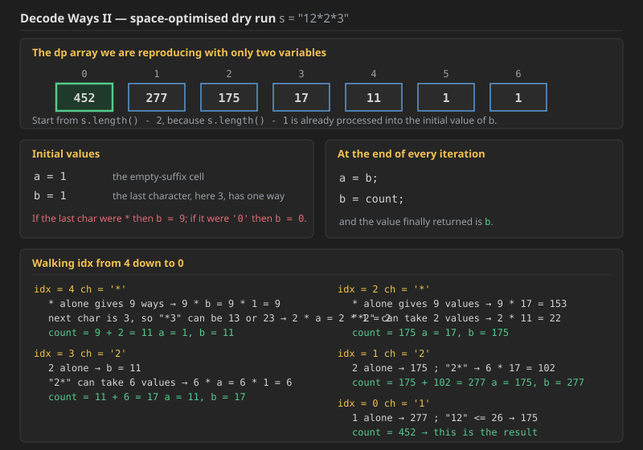
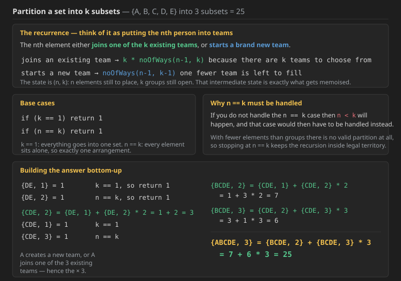

## Dynamic Programming — the idea

**DP (Dynamic Programming)** means: **remember the previous state**, so that when the same problem comes again you use the state you remembered and solve that problem fast.



**DP applies when the same problem comes again.** Same as in life: a person learns from past mistakes and remembers those mistakes.

### Two real-life examples

1. The **first time** you learn to make something from YouTube it takes a lot of time, and **the second time** you make it you already remember some of it, so it gets made quickly.
2. The **first time** you went to Allahabad you did not know the routes, so the taxi driver charged 700. Now that you know it costs 150, the **second time** you go you remember it is 150.

**You can relate this to any situation.**

### Where do we store the previous state?

In DP we just remember the previous state. Now, **where do we store the previous state? Which data structure do we use?**

We use a data structure whose **retrieval is fast**, so we use **Arrays**. In about **90% of DP problems we use Arrays**. We can also use a **HashMap** in some questions.

### DP is mostly recursion based

The process of DP:

```text
1.  First think faith
2.  Recursive tree diagram
3.  Code
4.  Memoization
5.  Observation from the output
6.  Tabulation, on the basis of the previous observation
7.  Further optimization
```

Do these steps and **a time will come when you write tabulation directly**.

Faith and recursion are the first 2 steps, and from the first step itself the problem will get solved.


## Q1. Fibonacci — the full DP ladder

**First do the Fibonacci question.**

Before applying DP, first draw the tree diagram. If you see two states whose **tree is the same** and whose **result is also the same**, DP applies.



### DP will apply (draw the tree diagram first) if

```text
1.  the arguments are the same
2.  the tree of the tree is the same
3.  the return value is the same
```

Take `fib(5)`. Look at the tree: **both red-marked nodes are 3**, so

1. the arguments are the same,
2. the tree of both 3s is the same,
3. and the return value of both 3s is the same.

**That is why DP applies here in Fibonacci. You must draw the tree diagram before going to DP.**

### Print helpers

```cpp
void print1D(vector<int> &arr)
{
    for (int ele : arr)
    {
        cout << (ele + " ");
    }
    cout << endl;
}

void print2D(vector<vector<int>> &arr)
{
    for (vector<int> &ar : arr)
    {
        print1D(ar);
    }
}
```

### Memoization

```cpp
int fib_memo(int n, vector<int> &dp)
{
    if (n <= 1)
    {
        return dp[n] = n;
    }

    if (dp[n] != -1)
        return dp[n];

    int ans = fib_memo(n - 1, dp) + fib_memo(n - 2, dp);
    return dp[n] = ans;
}
```

The base case `if (n <= 1)` is written that way so that **a negative value never reaches the array index**.

**Java** (was missing; same logic as the C++ above)

```java
public static int fib_memo(int n, int[] dp) {
    if (n <= 1) {
        return dp[n] = n;
    }

    if (dp[n] != -1)
        return dp[n];

    int ans = fib_memo(n - 1, dp) + fib_memo(n - 2, dp);
    return dp[n] = ans;
}
```

### Tabulation

```cpp
int fib_DP(int N, vector<int> &dp)
{
    for (int n = 0; n <= N; n++)
    {
        if (n <= 1)
        {
            dp[n] = n;
            continue;
        }

        int ans = dp[n - 1] + dp[n - 2]; // fib_01(n - 1, dp) + fib_01(n - 2, dp);

        dp[n] = ans;
    }

    return dp[N];
}
```

The intermediate variable `ans` is kept purely for the sake of learning; in a real submission it can be inlined. It is written this way so that the mapping from the recursive call to the array lookup stays visible: **`fib_01(n-1, dp)` simply becomes `dp[n-1]`**.

**Java** (was missing; same logic as the C++ above)

```java
public static int fib_DP(int N, int[] dp) {
    for (int n = 0; n <= N; n++) {
        if (n <= 1) {
            dp[n] = n;
            continue;
        }

        int ans = dp[n - 1] + dp[n - 2]; // fib_01(n - 1, dp) + fib_01(n - 2, dp);

        dp[n] = ans;
    }

    return dp[N];
}
```

### Two-pointer (space optimised)

```cpp
int fib_twoPointer(int N)
{
    int a = 0, b = 1;
    for (int n = 0; n < N; n++)
    {
        // System.out.print(a + " ");

        int sum = a + b;
        a = b;
        b = sum;
    }

    return a;
}
```

**Java** (was missing; same logic as the C++ above)

```java
public static int fib_twoPointer(int N) {
    int a = 0, b = 1;
    for (int n = 0; n < N; n++) {
        // System.out.print(a + " ");

        int sum = a + b;
        a = b;
        b = sum;
    }

    return a;
}
```

### The driver

```cpp
void fibo()
{
    int n = 8;
    vector<int> dp(n + 1, -1);

    cout << (fib_memo(n, dp)) << endl;
    cout << (fib_DP(n, dp)) << endl;
    cout << (fib_twoPointer(n)) << endl;

    print1D(dp);
}
```

The `-1` is the **default value**, chosen so that it can never be a real answer. This is a function where **everything is int-related**.

**Java** (was missing; same logic as the C++ above)

```java
public static void fibo() {
    int n = 8;
    int[] dp = new int[n + 1];
    Arrays.fill(dp, -1);

    System.out.println(fib_memo(n, dp));
    System.out.println(fib_DP(n, dp));
    System.out.println(fib_twoPointer(n));

    print1D(dp);
}
```

### Complexity of the three versions

```text
fib_memo       TC -> O(n)      SC -> O(n)
fib_tabulation TC -> O(n)      SC -> O(n)
fib_optimised  TC -> O(n)      SC -> O(1)
```

**How to read the time complexity of a memoized solution:**

```text
TC of memoization = (number of states) x (TC of one state)

in fib_memo  ->  number of states = O(n),  each state does O(1) work
             =>  O(n) x O(1)  =  O(n)
```

**Or do the tabulation and read the TC off the loop bounds** — usually easier.

**Complexity — Q1 (Fibonacci):**

* **Memoization — Time `O(n)`, Space `O(n)`.** Without the `dp` array the plain recursion is `O(2^n)`, because each call spawns two more. Memoization collapses that to one evaluation per distinct value of `n`, and there are exactly `n+1` of them. The `O(n)` space is the `dp` array plus an `O(n)` recursion stack.
* **Tabulation — Time `O(n)`, Space `O(n)`.** Same number of states, but filled by a loop rather than recursion, so **there is no call stack at all**. That matters: it is very possible for recursion in DP to cause a **stack overflow**, and if that happens the fix is to do tabulation.
* **Two-pointer — Time `O(n)`, Space `O(1)`.** Each cell of the table only ever reads the two cells before it, so the whole array collapses into two variables. This is the standard third step for any 1-D DP whose recurrence has a fixed, small look-back.

**Also worth revising alongside this:** *Maze Path*, *Unique Paths* (DP on a grid — while filling the cells, be careful never to go out of bounds), *LeetCode 746 Min Cost Climbing Stairs*, and *Friends Pairing*.


## Q2. Frog Jump with K Distances

### Problem Description
There are `n` stones and an array `height` where `height[i]` is the height of the $i^{th}$ stone. A frog is initially at the $1^{st}$ stone ($0^{th}$ index) and wants to reach the $n^{th}$ stone ($(n-1)^{th}$ index).

From the $i^{th}$ stone, the frog can jump to any stone $j$ such that $i + 1 \le j \le i + k$. The cost of a jump from the $i^{th}$ stone to the $j^{th}$ stone is $|height[i] - height[j]|$.

Your task is to find the minimum total cost required for the frog to reach the $n^{th}$ stone.

---

### Input Format
* An integer `n` representing the number of stones.
* An array `height` of size `n`.
* An integer `k` representing the maximum jump distance.

### Output Format
* Return the minimum total cost.

---

### Examples

**Example 1**
**Input:** `n = 4`, `height = [10, 30, 40, 50]`, `k = 2`  
**Output:** `40`  
**Explanation:** 1. Stone 0 to 1: $|10 - 30| = 20$
2. Stone 1 to 3: $|30 - 50| = 20$  
Total cost: $20 + 20 = 40$.

**Example 2**
**Input:** `n = 5`, `height = [10, 40, 50, 20, 60]`, `k = 3`  
**Output:** `50`  
**Explanation:**
1. Stone 0 to 1: $|10 - 40| = 30$
2. Stone 1 to 4: $|40 - 60| = 20$  
Total cost: $30 + 20 = 50$.

---

### Constraints
* $1 \le n \le 10^5$
* $1 \le k \le 100$
* $1 \le height[i] \le 10^4$


```cpp
class Solution {
    int helper(vector<int>& heights, int k,vector<int> &dp,int idx){
        if(idx==0){
            return dp[idx]= 0;
        }
        if(dp[idx]!=-1) return dp[idx];
        int val=1e9;;
        for(int i=1;i<=k && idx-i>=0;i++){
            int sum=abs(heights[idx]-heights[idx-i]);
            sum+=helper(heights,k,dp,idx-i);
            val=min(sum,val);
        }
        return dp[idx]=val;

    }
public:
    int frogJump(vector<int>& heights, int k) {
        int n=heights.size();
        vector<int> dp(n,-1);
        return helper(heights,k,dp,n-1);
    }
};


```

There is similar problem where frog takes 2 jumps only so just put k=2;

```cpp
class Solution {
public:
     int helper(vector<int>& heights, int k,vector<int> &dp,int idx){
        if(idx==0){
            return dp[idx]= 0;
        }
        if(dp[idx]!=-1) return dp[idx];
        int val=1e9;;
        for(int i=1;i<=k && idx-i>=0;i++){
            int sum=abs(heights[idx]-heights[idx-i]);
            sum+=helper(heights,k,dp,idx-i);
            val=min(sum,val);
        }
        return dp[idx]=val;

    }
    int frogJump(vector<int>& heights) {
        int n=heights.size();
        vector<int> dp(n,-1);
        return helper(heights,2,dp,n-1);
    }
};
```


 ### Java code for Q2 (was missing; same logic as the C++ above)

```java
class Solution {
    private int helper(int[] heights, int k, int[] dp, int idx) {
        if (idx == 0) {
            return dp[idx] = 0;
        }
        if (dp[idx] != -1) return dp[idx];
        int val = (int) 1e9;
        for (int i = 1; i <= k && idx - i >= 0; i++) {
            int sum = Math.abs(heights[idx] - heights[idx - i]);
            sum += helper(heights, k, dp, idx - i);
            val = Math.min(sum, val);
        }
        return dp[idx] = val;
    }

    public int frogJump(int[] heights, int k) {
        int n = heights.length;
        int[] dp = new int[n];
        Arrays.fill(dp, -1);
        return helper(heights, k, dp, n - 1);
    }
}
```

And the 2-jump variant, which is just the same function called with `k = 2`:

```java
class Solution {
    public int helper(int[] heights, int k, int[] dp, int idx) {
        if (idx == 0) {
            return dp[idx] = 0;
        }
        if (dp[idx] != -1) return dp[idx];
        int val = (int) 1e9;
        for (int i = 1; i <= k && idx - i >= 0; i++) {
            int sum = Math.abs(heights[idx] - heights[idx - i]);
            sum += helper(heights, k, dp, idx - i);
            val = Math.min(sum, val);
        }
        return dp[idx] = val;
    }

    public int frogJump(int[] heights) {
        int n = heights.length;
        int[] dp = new int[n];
        Arrays.fill(dp, -1);
        return helper(heights, 2, dp, n - 1);
    }
}
```

**Complexity — Q2 (Frog Jump with K Distances):**

* **Time — `O(N x K)`.** Using the memoization formula, `TC = (number of states) x (work per state)`. There are `N` states (one per stone index) and each state runs a loop of at most `K` iterations to try every landing distance, so `N x K`. With `N <= 10^5` and `K <= 100` that is at most `10^7` operations, which passes comfortably. Without the `dp` array the same recursion would be `O(K^N)`.
* **Space — `O(N)`** for the `dp` array, plus **`O(N)` for the recursion stack**, since the chain `n-1 -> n-2 -> ... -> 0` can be `N` deep. With `N = 10^5` that recursion depth is genuinely risky in Java, so this is a case where converting to tabulation is worth doing.
* **Why the `k = 2` variant needs no new code:** the recurrence is identical, only the loop bound changes. That is the general shape of this family — the `k = 1` case is trivial, `k = 2` is the classic Frog Jump, and general `k` just widens the inner loop.

---

## Q3. Decode Ways (LeetCode 91)


A message containing letters from `A-Z` can be **encoded** into numbers using the following mapping:

```text
'A' -> "1"
'B' -> "2"
...
'Z' -> "26"
```

To **decode** an encoded message, all the digits must be grouped then mapped back into letters using the reverse of the mapping above (there may be multiple ways). For example, `"11106"` can be mapped into:

* `"AAJF"` with the grouping `(1 1 10 6)`
* `"KJF"` with the grouping `(11 10 6)`

Note that the grouping `(1 11 06)` is invalid because `"06"` cannot be mapped into `F` since `"6"` is different from `"06"`.

Given a string `s` containing only digits, return *the **number** of ways to **decode** it*.

The test cases are generated so that the answer fits in a **32-bit** integer.

### Examples

```text
Input:  s = "12"
Output: 2
Explanation: "12" could be decoded as "AB" (1 2) or "L" (12).

Input:  s = "226"
Output: 3
Explanation: "226" could be decoded as "BZ" (2 26), "VF" (22 6), or "BBF" (2 2 6).

Input:  s = "06"
Output: 0
Explanation: "06" cannot be mapped to "F" because of the leading zero
             ("6" is different from "06").
```

### Constraints

* `1 <= s.length <= 100`
* `s` contains only digits and may contain leading zero(s).

### The idea



**Either select 1 character or 2 characters at a time.** If the 2-character number lies between **1 and 26 (both included)** then it can be formed. `26` is `Z`, which is where the upper limit comes from.

**A performance warning up front:** if we use the `substring` function it takes `O(n)` time, so we must avoid it. First look at the easy substring approach, and then work out how to do the same thing without it.

### Attempt 1 — with substring

```java
class Solution {
    public int solveDecoding(String s){
        if(s.length()<=1) return 1;
        char c=s.charAt(0);
        int n1=c-'0';
        int a1=0,a2=0;
        if(n1>0){
            a1=solveDecoding(s.substring(1));
        }
        if(s.length()>=2){
            char c1=s.charAt(1);
            int n2=c1-'0';

            int newno=n1*10+n2;
            if(newno>=10&&newno<=26){
                a2=solveDecoding(s.substring(2));
            }
        }

        return a1+a2;
    }
    public int numDecodings(String s) {
        if(s.length()==1) return 1;
        return solveDecoding(s);
    }
}
```

This is a bad idea: its **TC is about `4^n`** at a rough estimate, but the real problem is that for an input like `"06"` the output should be `0` while this returns `1`.

### Attempt 2 — pass the index instead of cutting a substring

Instead of passing a substring, **pass the whole string and pass the index of the element which we want to select**. Passing the index is exactly the same thing as cutting a substring.

```java
class Solution {
    public int solveDecoding(String s,int idx){
        if(idx==s.length()) return 1;
        char c=s.charAt(idx);
        int n1=c-'0';
        int a1=0,a2=0;
        if(n1>0){
            a1=solveDecoding(s,idx+1);
        }
        if(idx+1<s.length()){
            char c1=s.charAt(idx+1);
            int n2=c1-'0';

            int newno=n1*10+n2;
            if(newno>=10&&newno<=26){
                a2=solveDecoding(s,idx+2);
            }
        }

        return a1+a2;
    }
    public int numDecodings(String s) {
        //if(s.length()==1) return 1;
        return solveDecoding(s,0);
    }
}
```

Result: **Time Limit Exceeded**, on the input `"111111111111111111111111111111111111111111111"`.

**So now we must use DP.**

### Attempt 3 — memoization

Now we must apply memoization. Take a `dp[]` of size `s.length() - 1`, and put the result into `dp[]`.

```java
class Solution {
    public int solveDecoding(String s,int idx,int[] dp){
        if(idx==s.length()) return dp[idx]=1;
        if(dp[idx]!=-1) return dp[idx];
        char c=s.charAt(idx);
        int n1=c-'0';
        int a1=0,a2=0;
        if(n1>0){
            a1=solveDecoding(s,idx+1,dp);
        }
        if(idx+1<s.length()){
            char c1=s.charAt(idx+1);
            int n2=c1-'0';

            int newno=n1*10+n2;
            if(newno>=10&&newno<=26){
                a2=solveDecoding(s,idx+2,dp);
            }
        }

        return dp[idx]=a1+a2;
    }
    public int numDecodings(String s) {
        int[] dp=new int[s.length()+1];
        Arrays.fill(dp,-1);
        return solveDecoding(s,0,dp);
    }
}
```

```text
Success   Runtime: 1 ms, faster than 98.74%
          Memory Usage: 42.2 MB, less than 68.98%
```

### Now do tabulation and optimise the space



Print the `dp` array for the input `"123455"` and look at it:

```text
index :  0   1   2   3   4   5   6
dp    :  3   2   1   1   1   1   1
```

**The result is `dp[0]`**, and the problem has to be solved from **right to left**. So run the for loop with `i` from `s.length()` down to `0`, and the rest of it stays the same.

**Note about that trailing 1.** People get confused by it, thinking it represents one answer for the character below it — but there is no character at index `s.length()`. It is the **empty-string base case**, and it is 1 because an empty suffix has exactly one decoding, the empty one.

### Attempt 4 — tabulation

```java
class Solution {
    public int solveDecoding(String s,int[] dp){
        for(int idx=s.length();idx>=0;idx--){
            if(idx==s.length())
                { dp[idx]=1;
                    continue;
                }
            char c=s.charAt(idx);
            int n1=c-'0';
            int a1=0,a2=0;
            if(n1>0){
                a1=dp[idx+1];
            }
            if(idx+1<s.length()){
                char c1=s.charAt(idx+1);
                int n2=c1-'0';

                int newno=n1*10+n2;
                if(newno>=10&&newno<=26){
                    a2=dp[idx+2];
                }
            }

            dp[idx]=a1+a2;
        }

        return dp[0];
    }

    public int numDecodings(String s) {
        int[] dp=new int[s.length()+1];
        return solveDecoding(s,dp);
    }
}
```

The `idx` parameter is no longer needed in the helper, since the loop supplies it.

**When converting memoization to tabulation, always look at the base case of the memoization.** The base case stays as it is, and the tabulation moves **from the base case of the memoization toward the result**.

### Attempt 5 — space optimisation

Look at the dp array again:

```text
3, 2, 1, 1, 1, 1, 1     for "123455"
0  1  2  3  4  5  6
```

* at the last `5` — that `5` alone works, so add the `(i+1)` value
* at `4` — `"45"` is bigger than 26, so we add only the `(i+1)` value
* at `2` — `"23"` is at most 26, so `(i+1)` **and** `(i+2)` are both added

**So we need only 2 variables, not the whole array.**

```text
idxp1 = 1        it is the cell for idx + 1
idxp2 = 0        initially, because at the start there is no idx+2 yet
res   = idxp1 + idxp2

then for the next iteration:  idxp2 = idxp1;   idxp1 = res;
```

```java
class Solution {
    public int solveDecoding(String s){
        int idxp1=1;
        int idxp2=0;
        int res=0;
        for(int idx=s.length()-1;idx>=0;idx--){
            char c=s.charAt(idx);
            int n1=c-'0';
            if(n1>0){
                res+=idxp1;
            }
            if(idx+1<s.length()){
                char c1=s.charAt(idx+1);
                int n2=c1-'0';

                int newno=n1*10+n2;
                if(newno>=10&&newno<=26){
                    res+=idxp2;
                }
            }

            idxp2=idxp1;
            idxp1=res;
            res=0;
        }

        return idxp1;
    }
    public int numDecodings(String s) {
        return solveDecoding(s);
    }
}
```

### A refreshed version of the same three steps

**Memoization — Java**

```java
// 91
int numDecodings(String s, int idx, int[] dp) {
    if (idx == s.length()) {
        return dp[idx] = 1;
    }

    if (dp[idx] != -1)
        return dp[idx];

    char ch1 = s.charAt(idx);
    if (ch1 == '0')
        return 0;

    int count = 0;
    count += numDecodings(s, idx + 1, dp);

    if (idx < s.length() - 1) {
        char ch2 = s.charAt(idx + 1);
        int num = (ch1 - '0') * 10 + (ch2 - '0');
        if (num <= 26)
            count += numDecodings(s, idx + 2, dp);
    }
    return dp[idx] = count;
}
```

**Memoization — C++** (was missing; same logic as the Java above)

```cpp
// 91
int numDecodings(string s, int idx, vector<int>& dp) {
    if (idx == (int) s.length()) {
        return dp[idx] = 1;
    }

    if (dp[idx] != -1)
        return dp[idx];

    char ch1 = s[idx];
    if (ch1 == '0')
        return 0;

    int count = 0;
    count += numDecodings(s, idx + 1, dp);

    if (idx < (int) s.length() - 1) {
        char ch2 = s[idx + 1];
        int num = (ch1 - '0') * 10 + (ch2 - '0');
        if (num <= 26)
            count += numDecodings(s, idx + 2, dp);
    }
    return dp[idx] = count;
}
```

**Tabulation — Java**

```java
int numDecodings_DP(String s, int IDX, int[] dp) {
    for (int idx = s.length(); idx >= 0; idx--) {
        if (idx == s.length()) {
            dp[idx] = 1;
            continue;
        }

        char ch1 = s.charAt(idx);
        if (ch1 == '0') {
            dp[idx] = 0;
            continue;
        }

        int count = 0;
        count += dp[idx + 1];// numDecodings(s, idx + 1, dp);

        if (idx < s.length() - 1) {
            char ch2 = s.charAt(idx + 1);
            int num = (ch1 - '0') * 10 + (ch2 - '0');
            if (num <= 26)
                count += dp[idx + 2];// numDecodings(s, idx + 2, dp);
        }
        dp[idx] = count;
    }

    return dp[IDX];
}
```

**Tabulation — C++** (was missing; same logic as the Java above)

```cpp
int numDecodings_DP(string s, int IDX, vector<int>& dp) {
    for (int idx = (int) s.length(); idx >= 0; idx--) {
        if (idx == (int) s.length()) {
            dp[idx] = 1;
            continue;
        }

        char ch1 = s[idx];
        if (ch1 == '0') {
            dp[idx] = 0;
            continue;
        }

        int count = 0;
        count += dp[idx + 1];

        if (idx < (int) s.length() - 1) {
            char ch2 = s[idx + 1];
            int num = (ch1 - '0') * 10 + (ch2 - '0');
            if (num <= 26)
                count += dp[idx + 2];
        }
        dp[idx] = count;
    }

    return dp[IDX];
}
```

**Optimised — Java**

```java
int numDecodings_Opti(String s) {
    int a = 1, b = 0;
    for (int idx = s.length() - 1; idx >= 0; idx--) {

        int count = 0;
        char ch1 = s.charAt(idx);
        if (ch1 != '0') {

            count += a;

            if (idx < s.length() - 1) {
                char ch2 = s.charAt(idx + 1);
                int num = (ch1 - '0') * 10 + (ch2 - '0');
                if (num <= 26)
                    count += b;
            }
        }
        b = a;
        a = count;
    }

    return a;
}
```

**Optimised — C++** (was missing; same logic as the Java above)

```cpp
int numDecodings_Opti(string s) {
    int a = 1, b = 0;
    for (int idx = (int) s.length() - 1; idx >= 0; idx--) {

        int count = 0;
        char ch1 = s[idx];
        if (ch1 != '0') {

            count += a;

            if (idx < (int) s.length() - 1) {
                char ch2 = s[idx + 1];
                int num = (ch1 - '0') * 10 + (ch2 - '0');
                if (num <= 26)
                    count += b;
            }
        }
        b = a;
        a = count;
    }

    return a;
}
```

**Two pointers that depend on each other, exactly like Fibonacci.**

**Complexity — Q3 (Decode Ways):**

* **Plain recursion — `O(2^n)` time.** Each index branches into at most two calls, take 1 char or take 2 chars, which is exactly the Fibonacci shape. The substring version is worse still, roughly `O(4^n)` as noted above, because every call also **copies** an `O(n)` substring. That copy is the reason to switch to an index.
* **Memoization — Time `O(n)`, Space `O(n)`.** Using `TC = states x work-per-state`: there are `n+1` states, one per index, and each does `O(1)` work, so `O(n)`. Space is the `dp` array plus an `O(n)` recursion stack.
* **Tabulation — Time `O(n)`, Space `O(n)`,** and no recursion stack at all.
* **Optimised — Time `O(n)`, Space `O(1)`.** Every cell reads only `dp[idx+1]` and `dp[idx+2]`, so two scalars replace the whole array.
* **Why no modulo is needed here.** The problem guarantees the answer fits in a 32-bit integer, so plain `int` arithmetic is safe. Q4 below removes that guarantee, which is where `10^9 + 7` appears.

---

## Q4. Decode Ways II (LeetCode 639)


A message containing letters from `A-Z` can be **encoded** into numbers using the same mapping as Q3 (`A` to `1` ... `Z` to `26`), and decoding groups digits back into letters in the same way.

**In addition** to the mapping above, an encoded message may contain the `*` character, which can represent any digit from `1` to `9` (`0` is excluded). For example, the encoded message `"1*"` may represent any of the encoded messages `"11"`, `"12"`, `"13"`, `"14"`, `"15"`, `"16"`, `"17"`, `"18"`, or `"19"`. Decoding `"1*"` is equivalent to decoding **any** of the encoded messages it can represent.

Given a string `s` consisting of digits and `*` characters, return *the **number** of ways to **decode** it*.

Since the answer may be very large, return it **modulo** `10^9 + 7`.

### Examples

```text
Input:  s = "*"
Output: 9
Explanation: The encoded message can represent any of the encoded messages
             "1", "2", "3", "4", "5", "6", "7", "8", or "9".
             Each of these can be decoded to the strings "A", "B", "C", "D",
             "E", "F", "G", "H", and "I" respectively.
             Hence, there are a total of 9 ways to decode "*".

Input:  s = "1*"
Output: 18
Explanation: The encoded message can represent any of the encoded messages
             "11", "12", "13", "14", "15", "16", "17", "18", or "19".
             Each of these encoded messages have 2 ways to be decoded
             (e.g. "11" can be decoded to "AA" or "K").
             Hence, there are a total of 9 * 2 = 18 ways to decode "1*".

Input:  s = "2*"
Output: 15
Explanation: The encoded message can represent any of the encoded messages
             "21", "22", "23", "24", "25", "26", "27", "28", or "29".
             "21", "22", "23", "24", "25", and "26" have 2 ways of being decoded,
             but "27", "28", and "29" only have 1 way.
             Hence, there are a total of (6 * 2) + (3 * 1) = 12 + 3 = 15 ways
             to decode "2*".
```

### Constraints

* `1 <= s.length <= 10^5`
* `s[i]` is a digit or `*`.

### The cases created by the star



.jpg>) .jpg>) .jpg>) .jpg>) .jpg>) .jpg>) .jpg>) .jpg>) .jpg>)

A `*` can be replaced by `1, 2, 3, ... 9`, and we must tell how many ways we can decode. So as soon as we see a `*` we have to replace it with 1 to 9 and go ahead, which is much bigger work compared with the previous question.

Splitting by how many characters we consume:

```text
Single digit    *     ->  9 cases
                n     ->  1 case

Two digits      n *      handle these
                * n      two first
                n n      the plain case, already solved in Q3
                * *      the trickiest one
```

**Case `n *`.** Here `n` can be 0 to 9 and `*` can be 1 to 9, but `n` cannot be 0, so put a check: **if `n` is 0, return 0**.

```text
n == 1   ->  * can be 1 to 9   ->  9 ways
n == 2   ->  * can be 1 to 6   ->  6 ways
```

**Case `* n`.** `*` can be 1 to 9:

```text
* = 1   ->  n can be 0 to 9   ->  10 to 19
* = 2   ->  n can be 0 to 6   ->  20 to 26
```

Turning it around and looking at `n` instead is what the code actually checks:

```text
n = 0 to 6   ->  * can be 1 or 2   ->  2 ways
n = 7 to 9   ->  * can be 1 only   ->  1 way
```

We also need to check whether `idx + 1` exists at all before doing any of this.

**Case `* *`.** Now `0` cannot come at all:

```text
first = 1   ->  second 1 to 9   ->  9 ways
first = 2   ->  second 1 to 6   ->  6 ways
                                    ----
                            total   15 answers
```

### Keeping the number inside int range

The function we write returns an `int` and the answer can be huge, so we take a modulus by `10^9 + 7`. But **let the helper function return a `long`**, so that the value we compute can be returned safely, and take the modulus of whatever the helper gives back.

*(In Q3 the statement said the answer is guaranteed to fit in a 32-bit integer, so no modulus was needed there. Here that guarantee is gone.)*

The rules that hold:

```text
(a + b) % mod  =  (a%mod + b%mod) % mod
(a - b) % mod  =  (a%mod - b%mod + mod) % mod
(a * b) % mod  =  (a%mod * b%mod) % mod
```

**Division has no such rule**, so never try to take a modulus through a division.

### Memoization — Java

```java
class Solution {
    int mod=(int)1e9+7;
    public long solveDecoding(String s,int idx,long[] dp){
        if(idx==s.length()){
            return dp[idx]=1;
        }
        if(dp[idx]!=-1) return dp[idx];
        long count=0;
        char ch1=s.charAt(idx);
        if(ch1=='0') return 0;
        if(ch1=='*'){
            count=(count%mod+9*solveDecoding(s,idx+1,dp)%mod)%mod;
            if(idx<s.length()-1){
                char ch2=s.charAt(idx+1);
                if(ch2=='*'){
                    count=(count%mod+15*solveDecoding(s,idx+2,dp)%mod)%mod;
                }
                else if(ch2>='0'&&ch2<='6'){
                    count=(count%mod+2*solveDecoding(s,idx+2,dp)%mod)%mod;
                }
                else if(ch2>'6'&&ch2<='9'){
                    count=(count%mod+solveDecoding(s,idx+2,dp)%mod)%mod;
                }
            }

        }
        else{
            count=(count%mod+solveDecoding(s,idx+1,dp)%mod)%mod;
            if(idx<s.length()-1){
                if(s.charAt(idx+1)!='*'){
                    char ch2=s.charAt(idx+1);
                    int num=(ch1-'0')*10+(ch2-'0');
                    if(num<=26){
                        count=(count%mod+solveDecoding(s,idx+2,dp)%mod)%mod;
                    }
                }
                else{
                    if(s.charAt(idx)=='1'){
                        count=(count%mod+9*solveDecoding(s,idx+2,dp)%mod)%mod;
                    }
                    else if(s.charAt(idx)=='2'){
                        count=(count%mod+6*solveDecoding(s,idx+2,dp)%mod)%mod;
                    }
                }
            }
        }
        return dp[idx]=count;
    }
    public int numDecodings(String s) {
        long[] dp=new long[s.length()+1];
        Arrays.fill(dp,-1);
        return (int)solveDecoding(s,0,dp);
    }
}
```

```text
Success   Runtime: 70 ms, faster than 38.27%
          Memory Usage: 89.4 MB, less than 24.38%
```

**This question is a very good example of long-to-int and int-to-long conversion. Must do.**

### Memoization — C++ (was missing; same logic as the Java above)

```cpp
class Solution {
    int mod = (int) 1e9 + 7;

public:
    long long solveDecoding(string s, int idx, vector<long long>& dp) {
        if (idx == (int) s.length()) {
            return dp[idx] = 1;
        }
        if (dp[idx] != -1) return dp[idx];
        long long count = 0;
        char ch1 = s[idx];
        if (ch1 == '0') return 0;
        if (ch1 == '*') {
            count = (count % mod + 9 * solveDecoding(s, idx + 1, dp) % mod) % mod;
            if (idx < (int) s.length() - 1) {
                char ch2 = s[idx + 1];
                if (ch2 == '*') {
                    count = (count % mod + 15 * solveDecoding(s, idx + 2, dp) % mod) % mod;
                }
                else if (ch2 >= '0' && ch2 <= '6') {
                    count = (count % mod + 2 * solveDecoding(s, idx + 2, dp) % mod) % mod;
                }
                else if (ch2 > '6' && ch2 <= '9') {
                    count = (count % mod + solveDecoding(s, idx + 2, dp) % mod) % mod;
                }
            }
        }
        else {
            count = (count % mod + solveDecoding(s, idx + 1, dp) % mod) % mod;
            if (idx < (int) s.length() - 1) {
                if (s[idx + 1] != '*') {
                    char ch2 = s[idx + 1];
                    int num = (ch1 - '0') * 10 + (ch2 - '0');
                    if (num <= 26) {
                        count = (count % mod + solveDecoding(s, idx + 2, dp) % mod) % mod;
                    }
                }
                else {
                    if (s[idx] == '1') {
                        count = (count % mod + 9 * solveDecoding(s, idx + 2, dp) % mod) % mod;
                    }
                    else if (s[idx] == '2') {
                        count = (count % mod + 6 * solveDecoding(s, idx + 2, dp) % mod) % mod;
                    }
                }
            }
        }
        return dp[idx] = count;
    }

    int numDecodings(string s) {
        vector<long long> dp(s.length() + 1, -1);
        return (int) solveDecoding(s, 0, dp);
    }
};
```

### Tabulation — Java

**Tabulation here means: from the previous question, go right to left.**

```java
class Solution {
    int mod=(int)1e9+7;
    public long solveDecoding(String s,int IDX,long[] dp){
        for(int idx=s.length();idx>=0;idx--){
        if(idx==s.length()){
            dp[idx]=1;
            continue;
        }
        if(s.charAt(idx)=='0') {
            dp[idx]=0;
            continue;
        }
        long count=0;
        char ch1=s.charAt(idx);

        if(ch1=='*'){
            count=(count%mod+9*dp[idx+1]%mod)%mod;
            if(idx<s.length()-1){
                char ch2=s.charAt(idx+1);
                if(ch2=='*'){
                    count=(count%mod+15*dp[idx+2]%mod)%mod;
                }
                else if(ch2>='0'&&ch2<='6'){
                    count=(count%mod+2*dp[idx+2]%mod)%mod;
                }
                else if(ch2>'6'&&ch2<='9'){
                    count=(count%mod+dp[idx+2]%mod)%mod;
                }

            }

        }
        else{
            count=(count%mod+dp[idx+1]%mod)%mod;
            if(idx<s.length()-1){
                if(s.charAt(idx+1)!='*'){
                    char ch2=s.charAt(idx+1);
                    int num=(ch1-'0')*10+(ch2-'0');
                    if(num<=26){
                        count=(count%mod+dp[idx+2]%mod)%mod;
                    }
                }
                else{
                    if(s.charAt(idx)=='1'){
                        count=(count%mod+9*dp[idx+2]%mod)%mod;
                    }
                    else if(s.charAt(idx)=='2'){
                        count=(count%mod+6*dp[idx+2]%mod)%mod;
                    }
                }
            }
        }
        dp[idx]=count;
    }
    return dp[IDX];

    }
    public int numDecodings(String s) {
        long[] dp=new long[s.length()+1];
        Arrays.fill(dp,-1);
        return (int)solveDecoding(s,0,dp);
    }
}
```

```text
Success   Runtime: 113 ms, faster than 16.67%
          Memory Usage: 60.3 MB, less than 59.57%
```

### Tabulation — C++ (was missing; same logic as the Java above)

```cpp
class Solution {
    int mod = (int) 1e9 + 7;

public:
    long long solveDecoding(string s, int IDX, vector<long long>& dp) {
        for (int idx = (int) s.length(); idx >= 0; idx--) {
            if (idx == (int) s.length()) {
                dp[idx] = 1;
                continue;
            }
            if (s[idx] == '0') {
                dp[idx] = 0;
                continue;
            }
            long long count = 0;
            char ch1 = s[idx];

            if (ch1 == '*') {
                count = (count % mod + 9 * dp[idx + 1] % mod) % mod;
                if (idx < (int) s.length() - 1) {
                    char ch2 = s[idx + 1];
                    if (ch2 == '*') {
                        count = (count % mod + 15 * dp[idx + 2] % mod) % mod;
                    }
                    else if (ch2 >= '0' && ch2 <= '6') {
                        count = (count % mod + 2 * dp[idx + 2] % mod) % mod;
                    }
                    else if (ch2 > '6' && ch2 <= '9') {
                        count = (count % mod + dp[idx + 2] % mod) % mod;
                    }
                }
            }
            else {
                count = (count % mod + dp[idx + 1] % mod) % mod;
                if (idx < (int) s.length() - 1) {
                    if (s[idx + 1] != '*') {
                        char ch2 = s[idx + 1];
                        int num = (ch1 - '0') * 10 + (ch2 - '0');
                        if (num <= 26) {
                            count = (count % mod + dp[idx + 2] % mod) % mod;
                        }
                    }
                    else {
                        if (s[idx] == '1') {
                            count = (count % mod + 9 * dp[idx + 2] % mod) % mod;
                        }
                        else if (s[idx] == '2') {
                            count = (count % mod + 6 * dp[idx + 2] % mod) % mod;
                        }
                    }
                }
            }
            dp[idx] = count;
        }
        return dp[IDX];
    }

    int numDecodings(string s) {
        vector<long long> dp(s.length() + 1, -1);
        return (int) solveDecoding(s, 0, dp);
    }
};
```

### Space optimisation — reading the dp array

Take `s = "512*22315**1"`, whose length is 12. The printed dp array is:

```text
index :    0      1      2      3     4    5    6    7    8    9   10  11  12
dp    : 18240  18240  11172  7068   684  456  228  228  114  114  11   1   1
```

Walk it from the right and see which cells each one needs:

* at index 11 the character is `1`, and there is one way, so the value is 1.
* at index 10 the character is `*`, which can be 1 to 9, so **9 ways alone**, giving `9 * dp[11] = 9`. The pair `"*1"` can be `11` or `21`, which is 2 more ways with `dp[12] = 1`, so `9 + 2 = 11`.
* at index 9 the character is `*` and the next is also `*`, so `15 * dp[11] = 15`, plus `9 * dp[10] = 9 * 11 = 99`, giving `114`.
* at index 8 the `5` alone works so `dp[i+1]` is used, but `"5*"` is not possible, so only `dp[i+1]` counts here.

**In short, in our whole code we are dependent only on `dp[i+1]` and `dp[i+2]`.**

So take two variables:

```text
initially   a = 1,  b = 0
```

`count` stores the result. Calculate `b` first for the last value of the character, then at the end of each step replace `i+1` with `b` and `i+2` with `a`:

```text
a = b;
b = res;        and return b at the end
```

### The dry run of the optimisation



Take `s = "12*2*3"`, whose dp array is:

```text
index :   0     1     2    3   4  5  6
dp    :  452   277   175  17  11  1  1
```

Start at `s.length() - 2`, because `s.length() - 1` has already been processed into the initial `b`.

As `3` has only one way, `b = 1`. **If a star were there instead, we would put `b = 9` initially.**

```text
at idx 4    *  alone, so 9 ways                     ->  9 * b = 9
            "*3" can be 13 or 23, so 2 values       ->  2 * a = 2
            total = 11             now a = 1,  b = 11

at idx 3    2  alone, so add b                      ->  11
            "2*" with * can take 6 values           ->  6 * a = 6
            total = 11 + 6 = 17    now a = 11, b = 17

at idx 2    *  alone, 9 values                      ->  9 * 17 = 153
            "*2" can take 2 values                  ->  2 * 11 = 22
            total = 175            now a = 17, b = 175

at idx 1    2  alone, so add b                      ->  175
            "2*" so 6 * a                           ->  6 * 17 = 102
            total = 175 + 102 = 277

at idx 0    1  alone, so add b                      ->  277
            "12" is at most 26, so add a            ->  175
            total = 452            this is the result
```

### Optimised — Java

```java
class Solution {
    int mod=(int)1e9+7;
    public long solveDecoding(String s){
        long a=1;
        long b=1;
        if(s.charAt(s.length()-1)=='0') b=0;
        else if(s.charAt(s.length()-1)=='*') b=9;
        for(int idx=s.length()-2;idx>=0;idx--){
        long count=0;
        if(s.charAt(idx)=='0') {
            count=0;
            a=b;
            b=count;
            continue;
        }

        char ch1=s.charAt(idx);

        if(ch1=='*'){
            count=(count%mod+9*b%mod)%mod;
            if(idx<s.length()-1){
                char ch2=s.charAt(idx+1);
                if(ch2=='*'){
                    count=(count%mod+15*a%mod)%mod;
                }
                else if(ch2>='0'&&ch2<='6'){
                    count=(count%mod+2*a%mod)%mod;
                }
                else if(ch2>'6'&&ch2<='9'){
                    count=(count%mod+a%mod)%mod;
                }

            }

        }
        else{
            count=(count%mod+b%mod)%mod;
            if(idx<s.length()-1){
                if(s.charAt(idx+1)!='*'){
                    char ch2=s.charAt(idx+1);
                    int num=(ch1-'0')*10+(ch2-'0');
                    if(num<=26){
                        count=(count%mod+a%mod)%mod;
                    }
                }
                else{
                    if(s.charAt(idx)=='1'){
                        count=(count%mod+9*a%mod)%mod;
                    }
                    else if(s.charAt(idx)=='2'){
                        count=(count%mod+6*a%mod)%mod;
                    }
                }
            }
        }
        a=b;
        b=count;

    }
    return b;

    }
    public int numDecodings(String s) {
        return (int)solveDecoding(s);
    }
}
```

Note the extra condition needed to set the initial value of `b`: it depends on whether the last character is a zero, a star, or a plain digit.

```text
Success   Runtime: 99 ms, faster than 20.37%
          Memory Usage: 51.6 MB, less than 83.33%
```

### Optimised — C++ (was missing; same logic as the Java above)

```cpp
class Solution {
    int mod = (int) 1e9 + 7;

public:
    long long solveDecoding(string s) {
        long long a = 1;
        long long b = 1;
        if (s[s.length() - 1] == '0') b = 0;
        else if (s[s.length() - 1] == '*') b = 9;

        for (int idx = (int) s.length() - 2; idx >= 0; idx--) {
            long long count = 0;
            if (s[idx] == '0') {
                count = 0;
                a = b;
                b = count;
                continue;
            }

            char ch1 = s[idx];

            if (ch1 == '*') {
                count = (count % mod + 9 * b % mod) % mod;
                if (idx < (int) s.length() - 1) {
                    char ch2 = s[idx + 1];
                    if (ch2 == '*') {
                        count = (count % mod + 15 * a % mod) % mod;
                    }
                    else if (ch2 >= '0' && ch2 <= '6') {
                        count = (count % mod + 2 * a % mod) % mod;
                    }
                    else if (ch2 > '6' && ch2 <= '9') {
                        count = (count % mod + a % mod) % mod;
                    }
                }
            }
            else {
                count = (count % mod + b % mod) % mod;
                if (idx < (int) s.length() - 1) {
                    if (s[idx + 1] != '*') {
                        char ch2 = s[idx + 1];
                        int num = (ch1 - '0') * 10 + (ch2 - '0');
                        if (num <= 26) {
                            count = (count % mod + a % mod) % mod;
                        }
                    }
                    else {
                        if (s[idx] == '1') {
                            count = (count % mod + 9 * a % mod) % mod;
                        }
                        else if (s[idx] == '2') {
                            count = (count % mod + 6 * a % mod) % mod;
                        }
                    }
                }
            }
            a = b;
            b = count;
        }
        return b;
    }

    int numDecodings(string s) {
        return (int) solveDecoding(s);
    }
};
```

**Complexity — Q4 (Decode Ways II):**

* **Memoization — Time `O(n)`, Space `O(n)`.** Still `states x work-per-state`: there are `n+1` states, and although the body now has six branches, each one is `O(1)`, so the per-state cost is still constant. The star does **not** multiply the state count; it only multiplies the *count* inside a state, which is why the complexity is unchanged from Q3.
* **Tabulation — Time `O(n)`, Space `O(n)`,** with no recursion stack.
* **Optimised — Time `O(n)`, Space `O(1)`.** With `n <= 10^5` this is the version that matters.
* **Why long is unavoidable here.** Intermediate values such as `15 * dp[idx+2]` can exceed `2^31 - 1` before the modulus is applied, so the accumulator and the dp array are `long` in Java and `long long` in C++, and the result is cast back to `int` only at the very end.
* **A note on the runtime numbers.** The memoized version happens to run faster than the tabulated one here, 70 ms against 113 ms, even though both are `O(n)`. That is because memoization only visits the states it actually needs, whereas tabulation always fills every cell, and the `long[]` array of size `n+1` costs more to allocate and touch.

---
---

## Q5. Count number of ways to partition a set into k subsets

Given two numbers `n` and `k`, where `n` represents the number of elements in a set, find the number of ways to partition the set into `k` subsets.

### Examples

```text
Input:  n = 3, k = 2
Output: 3
Explanation: Let the set be {1, 2, 3}, we can partition
             it into 2 subsets in following ways
             {{1,2}, {3}},  {{1}, {2,3}},  {{1,3}, {2}}

Input:  n = 3, k = 1
Output: 1
Explanation: There is only one way {{1, 2, 3}}
```



### Base cases

```text
if (k == 1)   ->  only 1 way
if (n == k)   ->  only 1 way
```

If `k == 1` then everything goes into one set. If `n == k` then every element sits alone, so again there is exactly one arrangement.

**If you do not handle the `n == k` case, then `n < k` will happen, and that case would have to be handled instead.**

### The recurrence

The state is `(n, k)` — an intermediate state where `n` elements are still to be placed and `k` groups are still open.

Think of it as **teams**. The nth person either:

* **goes into one of the k existing teams**, and since there are `k` teams to choose from, that is `k * noOfWays(n-1, k)`;
* or **starts a brand new team**, which is `noOfWays(n-1, k+1)` counted from the other direction, i.e. `noOfWays(n-1, k-1)` when you count downward from `k`.


 .jpg>) .jpg>) .jpg>)
### The dry run for {A, B, C, D, E} into 3 subsets

```text
{DE, 1}  = 1                                   k == 1, so return 1
{DE, 2}  = 1                                   n == k, so return 1

{CDE, 2} = {DE, 1} + {DE, 2} * 2  = 1 + 2 = 3
{CDE, 1} = 1                                   k == 1
{CDE, 3} = 1                                   n == k

{BCDE, 2} = {CDE, 1} + {CDE, 2} * 2  = 1 + 3 * 2 = 7
{BCDE, 3} = {CDE, 2} + {CDE, 3} * 3  = 3 + 1 * 3 = 6

{ABCDE, 3} = {BCDE, 2} + {BCDE, 3} * 3  = 7 + 6 * 3 = 25
```

At the last step, **A either creates a new team, or A says it will join an existing team** — and since there are 3 teams it can join, that branch is multiplied by 3.

### Java

```java
// https://www.geeksforgeeks.org/count-number-of-ways-to-partition-a-set-into-k-subsets/
public static int noOfWays(int n, int k, int[][] dp) {
    if (k == 1) {
        return dp[n][k] = 1;
    }
    if (n == k) {
        return dp[n][k] = 1;
    }

    if (dp[n][k] != 0)
        return dp[n][k];

    int uniqueGroup = noOfWays(n - 1, k - 1, dp);
    int partOfExisGroup = noOfWays(n - 1, k, dp) * k;

    return dp[n][k] = uniqueGroup + partOfExisGroup;
}
```

### C++ (was missing; same logic as the Java above)

```cpp
// https://www.geeksforgeeks.org/count-number-of-ways-to-partition-a-set-into-k-subsets/
int noOfWays(int n, int k, vector<vector<int>>& dp) {
    if (k == 1) {
        return dp[n][k] = 1;
    }
    if (n == k) {
        return dp[n][k] = 1;
    }

    if (dp[n][k] != 0)
        return dp[n][k];

    int uniqueGroup = noOfWays(n - 1, k - 1, dp);
    int partOfExisGroup = noOfWays(n - 1, k, dp) * k;

    return dp[n][k] = uniqueGroup + partOfExisGroup;
}
```

### A second way to think about it, using combinations

Instead of giving the choice to the person, **give the choice to the group**. For `n = 4` split into 2 sets you can count directly with binomial coefficients:

```text
4C1 x S2 + 4C2 x S3 + 4C3 x S4  =  2^4 - 4C0 - 4C4
                                =  16 - 1 - 1
                                =  14 ways

3C1 + 3C2  =  2^3 - 3C0 - 3C1  =  6
```

One element must always stay above, so from `(4,1)` what remains in the last `S1` is `4C3` ways, and one goes above.

**Comparing the two methods:** the recurrence method has **more height**, while the combination method has **more width**, so **the TC is the same for both**. The recurrence version is the one worth writing.

**Complexity — Q5 (Partition a set into k subsets):**

* **Time — `O(n x k)`.** Using `TC = states x work-per-state`: the state is the pair `(n, k)`, so there are `n x k` distinct states, and each one does `O(1)` work (two lookups, one multiply, one add). Without the `dp` table the same recursion is exponential, since each call spawns two more.
* **Space — `O(n x k)`** for the 2-D table, plus **`O(n)` for the recursion stack**, because the depth shrinks `n` by one at every level.
* **A caution about the sentinel.** This memo uses `0` as the empty marker (`if (dp[n][k] != 0)`), which is safe **only because a valid answer is never 0** for the states this function reaches. If a variant of the problem could legitimately return 0, the table would have to be filled with `-1` instead — exactly as it was in Q1 to Q4.
* **What the numbers actually are.** These values are the **Stirling numbers of the second kind**, `S(n, k)`. For `n = 5, k = 3` the answer 25 above is `S(5,3)`, which matches the tree.
