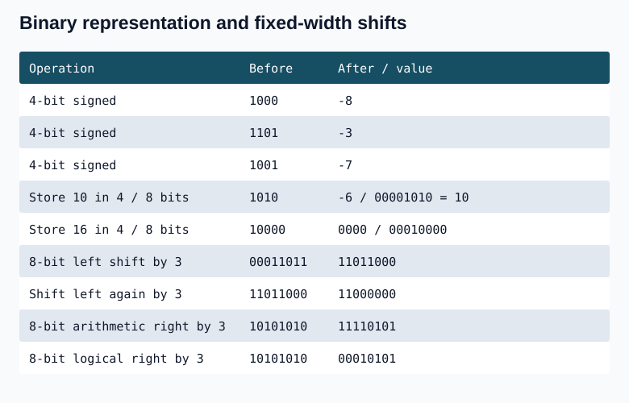
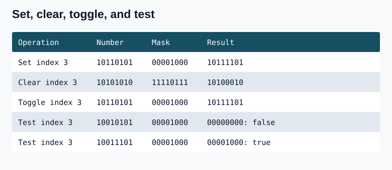
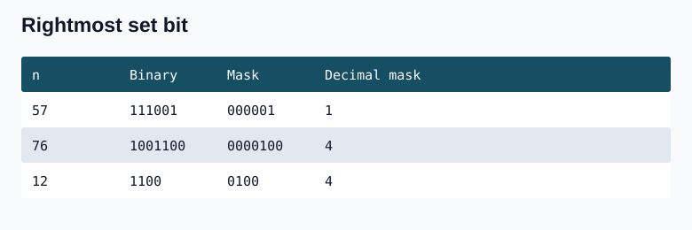
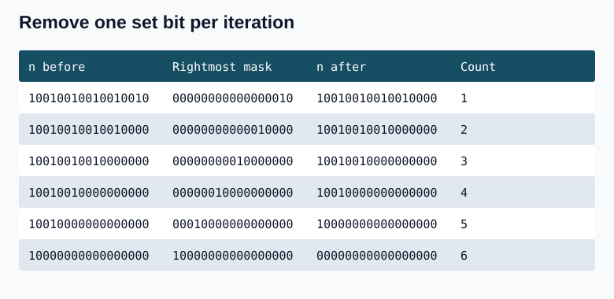
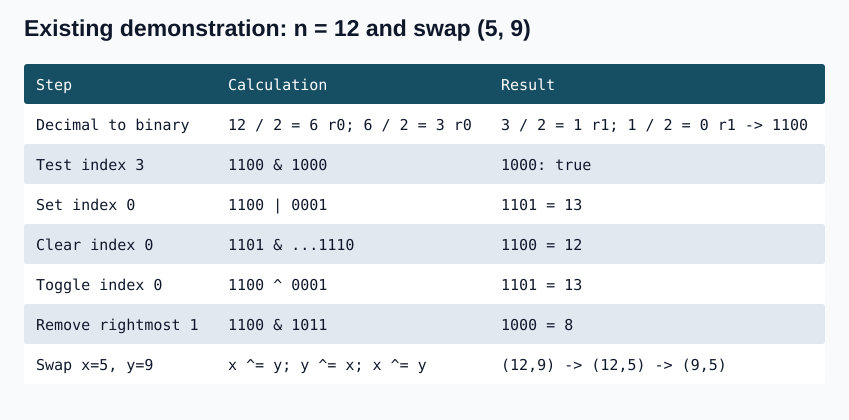

## Binary representation and integer storage

An integer such as `int x = 57` is stored in binary (`111001`), although ordinary decimal printing displays `57`. A bit has two possible values, 0 and 1. Four bits form a nibble.

| Java type | Bits | Distinct bit patterns | Signed range |
|---|---:|---:|---|
| byte | 8 | 2^8 | -2^7 through 2^7 - 1 |
| short | 16 | 2^16 | -2^15 through 2^15 - 1 |
| int | 32 | 2^32 | -2^31 through 2^31 - 1 |
| long | 64 | 2^64 | -2^63 through 2^63 - 1 |

C++ integer widths depend on the implementation; use fixed-width integer types when the width matters. The examples below use fixed-width bit patterns, including a hypothetical signed four-bit value.

For w-bit two's-complement representation the range is -2^(w-1) to 2^(w-1)-1. Four bits have 16 distinct patterns: eight represent -8 through -1 and eight represent 0 through 7. The most significant bit has weight -2^(w-1); the other bits have positive powers-of-two weights.

To negate a bit pattern, invert every bit and add 1, retaining the same width. If the sign bit is 0, read the ordinary binary value. If it is 1, find the unsigned magnitude by two's complement and attach a minus sign. For the minimum pattern, such as 1000, the magnitude 8 is not itself representable as a positive signed four-bit number.

| Pattern (four bits) | Signed value | Calculation |
|---|---:|---|
| 1000 | -8 | -8 |
| 1101 | -3 | -8 + 4 + 1; invert to 0010, add 1 to get 0011 |
| 1001 | -7 | -8 + 1; invert to 0110, add 1 to get 0111 |

Four-bit counting is 0000=0, 0001=1, 0010=2, 0011=3, 0100=4, 0101=5, 0110=6, 0111=7, 1000=-8, 1001=-7, 1010=-6, 1011=-5, 1100=-4, 1101=-3, 1110=-2, 1111=-1. Crossing 0111 to 1000 crosses the signed range boundary.

When fitting a positive binary value into fewer bits, only the low bits fit. Thus 10 is 1010, interpreted as -6 in signed four-bit storage but as +10 in eight-bit storage (00001010). Similarly 16=10000 becomes 0000 if only four low bits are kept, whereas an eight-bit representation is 00010000. To encode -7 in four bits, start with 0111, invert to 1000, and add 1 to get 1001. When widening a signed negative value, extend its sign bit with ones; padding with zeros would change its value. These are bit-pattern illustrations, not a claim that signed C++ overflow is defined.

## Operators and masks

| a | b | a & b | a \| b | a ^ b |
|:---:|:---:|:---:|:---:|:---:|
| 0 | 0 | 0 | 0 | 0 |
| 0 | 1 | 0 | 1 | 1 |
| 1 | 0 | 0 | 1 | 1 |
| 1 | 1 | 1 | 1 | 0 |

OR sets a position when either input bit is 1: a OR 1 = 1, a OR 0 = a. AND clears a position when either input bit is 0: a AND 0 = 0, a AND 1 = a. XOR toggles a position when the mask bit is 1: a XOR 1 is the opposite bit, a XOR 0 = a. Here a is one bit; XOR with the integer 1 toggles only the least significant bit of a multi-bit integer. The operator `~` complements every bit.

Left shift discards high bits outside the chosen width and fills low positions with zero. The eight-bit illustration is 00011011 << 3 = 11011000, then 11011000 << 3 = 11000000. Arithmetic right shift repeats the sign bit: the signed eight-bit illustration 10101010 >> 3 = 11110101. Logical right shift fills zeros: 10101010 shifted logically by 3 becomes 00010101. Java uses `>>>` for logical shift; C++ uses right shift on an unsigned value. A positive number shifted right k positions is divided by 2^k with the fractional part discarded.

Bit indices start at 0 on the right. A bit at index k uses `1 << k`; a question using one-based position k instead uses `1 << (k-1)`. Do not mix the two conventions. To clear a bit, shift 1 first and then complement the mask: `~(1 << k)`. Shifting `~1` instead clears additional low positions.



## Question 1. Set, clear, toggle, and test a bit

Given an integer n and zero-based indices i, j, k, m, print n with bit i set, n with bit j cleared, n with bit k toggled, and whether bit m is set. Each operation starts from the original n. For 32-bit values the indices must be in [0,31].

The set example is 10110101 OR 00001000 = 10111101. The clear example is 10101010 AND 11110111 = 10100010. Testing index 3 gives 10010101 AND 00001000 = 0 (false), while 10011101 AND 00001000 = 00001000 (true). Test for nonzero, not for equality to 1: a set bit at index 3 produces 8.



### C++

```cpp
#include <cstdint>
#include <iostream>
void bitOperations(std::uint32_t n, int i, int j, int k, int m) {
    std::cout << (n | (std::uint32_t(1) << i)) << '\n';
    std::cout << (n & ~(std::uint32_t(1) << j)) << '\n';
    std::cout << (n ^ (std::uint32_t(1) << k)) << '\n';
    std::cout << std::boolalpha << ((n & (std::uint32_t(1) << m)) != 0) << '\n';
}
```

### Java

```java
static void bitOperations(int n, int i, int j, int k, int m) {
    System.out.println(n | (1 << i));
    System.out.println(n & ~(1 << j));
    System.out.println(n ^ (1 << k));
    System.out.println((n & (1 << m)) != 0);
}
```

**Complexity:** O(1) time and O(1) auxiliary space: each operation uses a fixed number of machine-word operations.

## Question 2. Print the rightmost set-bit mask

Given n, isolate its lowest set bit and print the mask in binary. For n=57 (111001), the mask is 1. For n=76 (1001100), it is 100 (4). For zero, the mask is zero.

Write n as a higher prefix, then its rightmost 1, then trailing zeros. Complementing changes that 1 to 0 and the trailing zeros to ones. Adding 1 restores the trailing zeros and the rightmost 1; all bits to its left are complemented. AND with n therefore preserves only that rightmost 1. The formula is n & -n (equivalently n & (~n + 1)).



### C++

```cpp
#include <cstdint>
#include <string>
#include <algorithm>
std::string rightmostMaskBinary(std::uint32_t n) {
    n &= (0u - n);
    if (n == 0) return "0";
    std::string out;
    while (n != 0) { out += char('0' + (n & 1u)); n >>= 1; }
    std::reverse(out.begin(), out.end());
    return out;
}
```

### Java

```java
static String rightmostMaskBinary(int n) {
    return Integer.toBinaryString(n & -n);
}
```

**Complexity:** The mask calculation is O(1) time and space. Formatting its binary string takes O(w) time and O(w) output space for a w-bit word.

## Question 3. Count set bits using Kernighan's algorithm

A basic scan tests every bit and takes O(w). Kernighan's method visits only set bits. Subtract the rightmost set-bit mask from n and increment the count until n becomes zero. This is equivalent to n &= n-1. In 10010010010010010, the first mask is 10; after removing it, the next mask is 10000.



### C++

```cpp
#include <cstdint>
int countByMask(std::uint32_t n) {
    int count = 0;
    while (n != 0) { n -= n & (0u - n); ++count; }
    return count;
}
```

### Java

```java
static int countByMask(int n) {
    int count = 0;
    while (n != 0) { n -= n & -n; ++count; }
    return count;
}
```

**Complexity:** O(s) time for s set bits, because each iteration removes exactly one; O(1) auxiliary space. With a fixed 32-bit word, s is at most 32.

## Complexity and usage of the implementations below

The decimal-to-binary routines repeatedly divide by 2, giving O(log n) time and O(log n) output space for n>0. They return an empty string for zero as currently written; use an explicit zero case when a `"0"` representation is required. Bit tests, set/clear/toggle operations, removal of one set bit, power-of-two checks, and XOR swap use O(1) time and space on a fixed-width word. The basic bit counter scans O(log n) positions for positive n; the fast counter uses O(s) iterations for s set bits. Both need O(1) auxiliary space.

The two C++ `countSetBits(int)` definitions below are alternative implementations and cannot both be compiled with the same signature in one translation unit. Select one when running the sample. XOR swap requires two distinct storage locations. Its states for (5,9) are (12,9), (12,5), (9,5).



## Question 4. Deriving sum and XOR from AND and OR

Given A AND B and A OR B, find A+B and A XOR B. Considering the four possibilities for each pair of bits gives:

- A+B = (A OR B) + (A AND B).
- A XOR B = (A OR B) - (A AND B).

The AND bits are always a subset of the OR bits, so subtracting them leaves the positions where exactly one input bit is set. Addition of two one-bits contributes a carry, which is accounted for by adding both AND and OR. Use a wider type if the sum may exceed the input type's range.

### C++

```cpp
#include <cstdint>
std::uint64_t sumFromMasks(std::uint32_t both, std::uint32_t either) {
    return std::uint64_t(both) + either;
}
std::uint32_t xorFromMasks(std::uint32_t both, std::uint32_t either) {
    return either - both;
}
```

### Java

```java
static long sumFromMasks(int both, int either) {
    return Integer.toUnsignedLong(both) + Integer.toUnsignedLong(either);
}
static int xorFromMasks(int both, int either) { return either - both; }
```

**Complexity:** O(1) time and auxiliary space, using a constant number of arithmetic operations.

    


                      

### cpp

```cpp
#include<bits/stdc++.h>
using namespace std;
//tc->O(n) n is no of bits in number
string decimalToBinary(int n) {
    string result = "";
    
    while(n >0) {
        if(n % 2 == 1) result += '1';
        else result += '0';
        
        n = n / 2;
    }
    
    reverse(result.begin(),result.end());
    cout<<result<<endl;
    return result;
}

// Function to determine if the ith bit is set in N
//tc-->O(1) sc-->O(1)
bool isBitSet(int n, int i) {
    return (n & (1 << i)) != 0;
}

// Function to set the ith bit in N
//tc-->O(1) sc-->O(1)
int setBit(int n, int i) {
    return n | (1 << i);
}

// Function to clear the ith bit in N
//tc-->O(1) sc-->O(1)
int clearBit(int n, int i) {
    return n & ~(1 << i);
}

// Function to toggle the ith bit in N
//tc-->O(1) sc-->O(1)
int toggleBit(int n, int i) {
    return n ^ (1 << i);
}
// Function to remove the last set bit
//tc-->O(1) sc-->O(1)
//n-1 does not have last set bit as of n it sets that to 0 and after set bit all 
//bits are same
//n=12 (1100) n-1=1011=11
//in n-1 ----same as of n---| 0 in place of set bit| -----1's complememt of n-----------
int removeLastSetBit(int n) {
    return n & (n - 1);
}
// Function to determine if the number is a power of 2
//tc-->O(1) sc-->O(1)
bool isPowerOfTwo(int n) {
    return (n > 0) && ((n & (n - 1)) == 0);
}
// Function to determine the number of set bits 
//tc-->O(logN) or can say O(No of bits) Each bit is checked once. sc-->O(1)
int countSetBits(int n) {
    int count = 0;
    while (n > 0) {
        count += (n & 1);
        n >>= 1;
    }
    return count;
}

// Function to determine the number of set bits 
////tc-->O(No of set bits) Each bit is checked once. sc-->O(1)
    int countSetBits(int n) {
        int count = 0;
        while (n) {
            n &= (n - 1);
            count++;
        }
        return count;
    }
//Function to swap without temp variable
    void swap(int &x,int &y){
        x=x^y;
        y=x^y; //as x has x^y so y=x^y statement becomes y=(x^y)^y ,both y cancels out and y=x;
        x=x^y;//now x=x^y and y=x so x^y this statment becomes (x^y)^x ,both x cancels out and x=y so swapped
    }
int main (){
    decimalToBinary(12);//1100
    cout<<isBitSet(12,3)<<"\n";//1
    cout<<setBit(12,0)<<"\n";//output 13 means RightmostBIt is 0 position
    cout<<clearBit(13,0)<<"\n";//12
    cout<<toggleBit(12,0)<<"\n";//13
    cout<<removeLastSetBit(12)<<"\n";//8
    return 0;
}
```

### Java
```java

public class Bits {

    // Convert decimal to binary string
    public static String decimalToBinary(int n) {
        StringBuilder result = new StringBuilder();
        while (n > 0) {
            result.append(n % 2 == 1 ? '1' : '0');
            n = n / 2;
        }
        result.reverse();
        System.out.println(result.toString());
        return result.toString();
    }

    // Check if ith bit is set
    public static boolean isBitSet(int n, int i) {
        return (n & (1 << i)) != 0;
    }

    // Set the ith bit
    public static int setBit(int n, int i) {
        return n | (1 << i);
    }

    // Clear the ith bit
    public static int clearBit(int n, int i) {
        return n & ~(1 << i);
    }

    // Toggle the ith bit
    public static int toggleBit(int n, int i) {
        return n ^ (1 << i);
    }

    // Remove the last set bit
    public static int removeLastSetBit(int n) {
        return n & (n - 1);
    }

    // Check if number is a power of 2
    public static boolean isPowerOfTwo(int n) {
        return (n > 0) && ((n & (n - 1)) == 0);
    }

    // Count set bits using basic approach (O(no. of bits))
    public static int countSetBitsBasic(int n) {
        int count = 0;
        while (n > 0) {
            count += (n & 1);
            n >>= 1;
        }
        return count;
    }

    // Count set bits using Brian Kernighan's algorithm (O(no. of set bits))
    public static int countSetBitsFast(int n) {
        int count = 0;
        while (n != 0) {
            n &= (n - 1);
            count++;
        }
        return count;
    }

    // Swap two integers without a temp variable
    public static void swap(int[] pair) {
        // assuming pair has exactly two elements: [x, y]
        pair[0] = pair[0] ^ pair[1];
        pair[1] = pair[0] ^ pair[1];
        pair[0] = pair[0] ^ pair[1];
    }

    public static void main(String[] args) {
        decimalToBinary(12);                    // 1100
        System.out.println(isBitSet(12, 3));    // true
        System.out.println(setBit(12, 0));      // 13
        System.out.println(clearBit(13, 0));    // 12
        System.out.println(toggleBit(12, 0));   // 13
        System.out.println(removeLastSetBit(12)); // 8

        // Demonstrating swap
        int[] pair = {5, 9};
        System.out.println("Before swap: " + pair[0] + ", " + pair[1]);
        swap(pair);
        System.out.println("After swap: " + pair[0] + ", " + pair[1]);
    }
}
```


