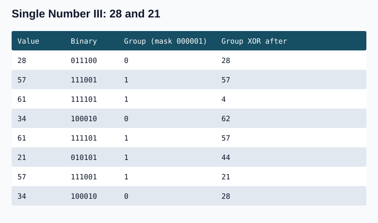
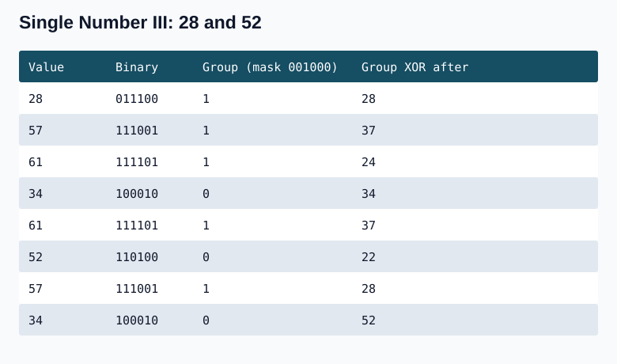

## Question 1. Single Number I

Given an array of nums of n integers. Every integer in the array appears twice except one integer. Find the number that appeared once in the array.


Examples:
Input : nums = [1, 2, 2, 4, 3, 1, 4]

Output : 3

Explanation : The integer 3 has appeared only once.

Input : nums = [5]

Output : 5

Explanation : The integer 5 has appeared only once.

Input : nums = [1, 3, 10, 3, 5, 1, 5]

Output:
10


XOR all values: equal pairs cancel because x ^ x = 0 and x ^ 0 = x. XOR is associative and commutative, so input order does not matter. Sorting followed by checking adjacent pairs is an O(n log n) baseline; XOR needs no sorting. The handwritten example is [1,5,6,4,5,8,1,4]. This particular list has two single values, 6 and 8, so its XOR is 14 rather than the stated 6. A valid one-single-value example is already given below: [1,2,2,4,3,1,4] returns 3. The example is retained in the dry run with its actual result.


### C++

```cpp
#include <vector>
int singleNumber1(const std::vector<int>& nums) {
    int ans = 0;
    for (int v : nums) ans ^= v;
    return ans;
}
```

### Java

```java
static int singleNumber1(int[] nums) {
    int ans = 0;
    for (int v : nums) ans ^= v;
    return ans;
}
```

**Complexity:** O(n) time for one pass and O(1) auxiliary space for one accumulator. On a sorted valid input, a separate binary-search approach can achieve O(log n) time; the XOR implementation does not use that additional assumption.

### C++

```cpp
#include <vector>
int singleNumber1(const std::vector<int>& nums) {
    int ans = 0;
    for (int v : nums) ans ^= v;
    return ans;
}
```

### Java

```java
public class Solution {
    public int singleNumber1(int[] nums) {
        int ans=0;
        for(int i=0;i<nums.length;i++){
            ans^=nums[i];
        }
        return ans;
    }
    public static void main(String[] args) {
        int[] nums = {1, 2, 2, 4, 3, 1, 4};

       Solution sol = new Solution(); 
        int ans = sol.singleNumber1(nums);
        
        System.out.println("The single number in given array is: " + ans);
        //The single number in given array is: 3
    }
}

```

If array was sorted then we could have used binary seearch!!!

## Question 2. Single Number II

### Problem Statement
Given an integer array `nums` where every element appears **three times** except for one, which appears **exactly once**. Find the single element and return it.

You must implement a solution with a **linear runtime complexity** $O(n)$ and use only **constant extra space** $O(1)$.

---

### Example 1
**Input:** `nums = [2, 2, 3, 2]`  
**Output:** `3`

### Example 2
**Input:** `nums = [0, 1, 0, 1, 0, 1, 99]`  
**Output:** `99`

---

### Constraints
* $1 \le \text{nums.length} \le 3 \times 10^4$
* $-2^{31} \le \text{nums}[i] \le 2^{31} - 1$
* Each element in `nums` appears exactly three times except for one element which appears once.


### Frequency-map approach

Store the frequency of every integer in a map and return the key whose count is 1. This is a useful baseline, but needs O(n) extra space and therefore does not meet the constant-space requirement.

### C++

```cpp
#include <vector>
#include <unordered_map>
int singleByFrequency(const std::vector<int>& arr) {
    std::unordered_map<int,int> count;
    for (int v : arr) ++count[v];
    for (const auto& e : count) if (e.second == 1) return e.first;
    return 0; // Valid input always has an answer.
}
```

### Java

```java
static int singleByFrequency(int[] arr) {
    java.util.Map<Integer,Integer> count = new java.util.HashMap<>();
    for (int v : arr) count.put(v, count.getOrDefault(v, 0) + 1);
    for (java.util.Map.Entry<Integer,Integer> e : count.entrySet())
        if (e.getValue() == 1) return e.getKey();
    return 0;
}
```

**Complexity:** Expected O(n) time for map insertion and lookup, and O(n) auxiliary space for distinct keys. Hash-table collisions can worsen the time bound.


### Count each bit modulo three

At each of 32 positions, count all the set bits. Repeated values contribute a multiple of three. A remainder of 1 means that bit belongs to the single value. Rebuild the answer with OR. In the illustrated list 110101, 010101, 010101, 110101, 110101, 011010, 010101, the column counts from high to low are 3,7,1,6,1,6; modulo 3 they become 0,1,1,0,1,0. The answer is 011010 (26). The mask check must use != 0: testing bit 1 of 0010 gives 2, not 1.


### C++

```cpp
#include <vector>
#include <cstdint>
#include <cstring>
int singleByBitCount(const std::vector<int>& arr) {
    std::uint32_t res = 0;
    for (int i = 0; i < 32; ++i) {
        int count = 0;
        for (int v : arr)
            if ((std::uint32_t(v) & (std::uint32_t(1) << i)) != 0) ++count;
        if (count % 3 == 1) res |= std::uint32_t(1) << i;
    }
    std::int32_t answer;
    std::memcpy(&answer, &res, sizeof answer);
    return answer;
}
```

### Java

```java
static int singleByBitCount(int[] arr) {
    int res = 0;
    for (int i = 0; i < 32; ++i) {
        int count = 0;
        for (int v : arr) if ((v & (1 << i)) != 0) ++count;
        if (count % 3 == 1) res |= 1 << i;
    }
    return res;
}
```

**Complexity:** O(32n) time, which is O(n) for 32-bit integers, because all n values are checked at each bit. O(1) auxiliary space; only counters and the result are stored.

.jpg>) .jpg>) .jpg>) .jpg>) .jpg>) .jpg>) .jpg>) .jpg>) .jpg>) .jpg>) .jpg>) .jpg>) .jpg>) .jpg>) .jpg>) .jpg>) .jpg>) .jpg>)

### Track counts in three states

For pairs, XOR retains odd bit counts and cancels even bit counts. For triples, track the remainder modulo 3 for all bits simultaneously:

- tn: positions seen 0 modulo 3 times; initially all ones (-1).
- tnp1: positions seen 1 modulo 3 times; initially zero.
- tnp2: positions seen 2 modulo 3 times; initially zero.

Each incoming set bit moves from tn to tnp1, from tnp1 to tnp2, or from tnp2 back to tn. An incoming zero leaves its state unchanged. Compute all three intersections with the old states before updating any state. Clear an intersection from its current state using AND with its complement; insert it into its destination using OR. The intersections are disjoint, which is why clearing one set of positions does not erase unrelated positions just inserted from another state.

For the example [51,37,37,51,57,43,51,57,37,57], only 43 appears once. After the first 51 (110011), tn=001100, tnp1=110011, tnp2=000000 in the six displayed positions. On the next 37 (100101), the old-state intersections are 000100, 100001, and 000000. Move 000100 into tnp1 and 100001 into tnp2. Near the end, before the final 37, the states are 001000, 000010, 110101. That 37 intersects only tnp2 (100101), so those bits return to tn. The final 57 leaves tnp1=101011=43 and tnp2=0.

Triples contribute no final remainder. The single value contributes exactly its set bits to tnp1. If the exceptional value appeared twice instead, it would remain in tnp2. All-ones two's-complement storage is -1, which explains the initialization of tn. The full step-by-step states are:


**Complexity:** O(n) time because each element performs a fixed number of bit operations; O(1) auxiliary space because three state masks and three intersections suffice.


                      

 So approach was to get all (3n+1) bits count


```cpp
class Solution {
public:
    int singleNumber(vector<int>& arr) {        
        int tn=-1;
        int tnp1=0;
        int tnp2=0;
        for(int val:arr){
            int cbtn = val & tn;
            int cbtnp1 = val & tnp1;
            int cbtnp2 = val & tnp2;
            
            tn=tn & ~cbtn;
            tnp1=tnp1 & ~cbtnp1;
            tnp2=tnp2 & ~cbtnp2;
            
            tn=tn | cbtnp2;
            tnp1=tnp1 | cbtn;
            tnp2=tnp2 | cbtnp1;
        }
        return tnp1;
    }
};
```

### Java

```java
class Solution {
    public int singleNumber(int[] arr) {
        int tn = -1, tnp1 = 0, tnp2 = 0;
        for (int val : arr) {
            int cbtn = val & tn;
            int cbtnp1 = val & tnp1;
            int cbtnp2 = val & tnp2;
            tn = tn & ~cbtn;
            tnp1 = tnp1 & ~cbtnp1;
            tnp2 = tnp2 & ~cbtnp2;
            tn = tn | cbtnp2;
            tnp1 = tnp1 | cbtn;
            tnp2 = tnp2 | cbtnp1;
        }
        return tnp1;
    }
}
```

## Question 3. Single Number III


### Problem Statement
Given an integer array `nums` of length `n`, every integer in the array appears **twice** except for **two integers** which appear only once. Identify and return the two integers that appear only once in the array.

You can return the two numbers in **any order**.

---

### Example 1
**Input:** `nums = [1, 2, 1, 3, 5, 2]`  
**Output:** `[3, 5]`  
**Explanation:** The integers 3 and 5 have appeared only once.

### Example 2
**Input:** `nums = [-1, 0]`  
**Output:** `[-1, 0]`  
**Explanation:** Both -1 and 0 appear only once.

### Example 3
**Input:** `nums = [0, 1]`  
**Output:** `[0, 1]`

---

### Constraints
* $2 \le \text{nums.length} \le 10^5$
* $-2^{31} \le \text{nums}[i] \le 2^{31} - 1$
* Every integer in the array appears twice except for two integers that appear only once.

.jpg>) .jpg>) .jpg>) .jpg>)

### XOR partition and complete question details

Find two distinct values that occur once while all other values occur exactly twice. Return them in any order, using O(n) time and O(1) extra space. The displayed question uses 2 <= nums.length <= 3 * 10^4 and -2^31 <= nums[i] <= 2^31 - 1; the broader length bound already written above is preserved. Its first example is [1,2,1,3,2,5] -> [3,5]; [5,3] is equally valid. The other examples are [-1,0] -> [-1,0] and [0,1] -> [1,0].

XOR all elements to get a ^ b. It is nonzero because a and b differ. Any set bit separates them; use its rightmost set bit as the mask. Put values with this bit set in one group and the others in a second group. Equal values always enter the same group, so pairs cancel. No group arrays are needed: keep only two XOR accumulators. The existing code returns the pair in ascending order, although the problem permits either order.

One example is [28,57,61,34,61,21,57,34], with singles 28 and 21. Their XOR is 001001 (9), giving mask 000001. A later example replaces 21 with 52: the XOR is 101000 (40), giving mask 001000. Both examples are shown below. C++ uses unsigned mask arithmetic to avoid signed negation overflow; Java's int negation preserves the needed two's-complement bit pattern.





**Complexity:** O(n) time for the full XOR and partition passes; O(1) auxiliary space for the mask and two accumulators.

```cpp
class Solution{	
	public:		
		vector<int> singleNumber(vector<int>& nums){
			        vector<int>res(2);
        unsigned int xor_val=0;
        for(int i=0;i<nums.size();i++){
            xor_val=xor_val^nums[i];
        }
        int rightMostSetMask=xor_val&-xor_val;
        int set1=0;
        int set0=0;
        for(int i=0;i<nums.size();i++){
            int dec_res=rightMostSetMask&nums[i];
            if(dec_res==0) set0=set0^nums[i];
            else set1=set1^nums[i];
        }
        res[0]=set0<set1?set0:set1;
        res[1]=set0<set1?set1:set0;
        return res;
		}
};
```

### Java

```java
class Solution {
    public int[] singleNumber(int[] nums) {
        int xorValue = 0;
        for (int v : nums) xorValue ^= v;
        int mask = xorValue & -xorValue;
        int set0 = 0, set1 = 0;
        for (int v : nums) {
            if ((v & mask) == 0) set0 ^= v;
            else set1 ^= v;
        }
        return new int[]{Math.min(set0, set1), Math.max(set0, set1)};
    }
}
```

Here only difference is we put sorted way in resultant array