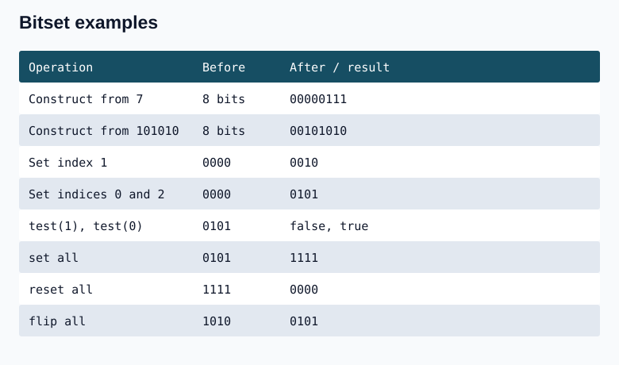

## Question 1. Bitwise AND of Numbers Range (201)


.jpg>)

.jpg>)

.jpg>) 


### C++

```cpp
int rangeBitwiseAnd(int left, int right) {
    int steps = 0;
    while (left != right) { left >>= 1; right >>= 1; ++steps; }
    return right << steps;
}
```

### Java

```java
static int rangeBitwiseAnd(int left, int right) {
    int steps = 0;
    while (left != right) { left >>= 1; right >>= 1; ++steps; }
    return right << steps;
}
```
**Complexity:** O(w) time for at most w shifts, O(1) auxiliary space. With 32-bit integers the time is bounded by a constant.


---
## Question 2


.jpg>) 


### C++

```cpp
#include <cstdint>
int hammingWeight(std::uint32_t n) {
    int count = 0;
    while (n != 0) { n -= n & (0u - n); ++count; }
    return count;
}
```

### Java

```java
static int hammingWeight(int n) {
    int count = 0;
    while (n != 0) { n -= n & -n; ++count; }
    return count;
}
```

**Complexity:** O(s) time for s set bits (at most 32) and O(1) auxiliary space. Each subtraction removes one set bit.

## Question 3

.jpg>) 

.jpg>) 
---


## Bit manipulation reference

Bitwise operators work independently at each bit and produce an integer. Logical operators such as && and || test truth values. Parenthesize bitwise expressions inside comparisons: `(n & (1 << k)) != 0`.

| Operation | Expression / explanation |
|---|---|
| Only one bit set at one-based position k | 1 shifted left by k-1 |
| Check zero-based bit i | (n & (1 << i)) != 0 |
| Set bit i | n OR (1 << i) |
| Clear bit i | n AND ~(1 << i) |
| Toggle bit i | n XOR (1 << i) |
| Check a power of two | n > 0 and (n & (n-1)) == 0 |
| Multiply a nonnegative value by 2^k | Left shift k, provided the result fits |
| Divide a nonnegative value by 2^k | Right shift k, discarding the remainder |
| Integer average | (x+y) >> 1 for nonnegative x,y when the sum fits |
| Swap two distinct locations | x ^= y; y ^= x; x ^= y |
| Odd/even | (n & 1) != 0 means odd; otherwise even |
| Sum relation | a+b = (a XOR b) + 2*(a AND b) |
| OR relation | a OR b = (a+b) - (a AND b) |

These identities concern integer bit patterns; use wide enough arithmetic for additions. A fixed number of operations on a machine word uses O(1) time and space. This does not guarantee that hand-written shifts beat a compiler's optimized multiplication or division.

For 32-bit storage, a signed integer ranges from -2^31 to 2^31-1; an unsigned integer ranges from 0 to 2^32-1. The maximum values shown are 2147483647 and 4294967295. Java has no unsigned int type, but a long can hold every unsigned 32-bit numeric value. In C++, unsigned long long provides at least 64 bits; use fixed-width types when exact width is required.

### C++

```cpp
#include <cstdint>
#include <iostream>
void printLimits() {
    std::cout << ((1LL << 31) - 1) << '\n';
    std::cout << ((1ULL << 32) - 1) << '\n';
}
void printBinary(std::uint32_t n) {
    for (int i = 31; i >= 0; --i) std::cout << ((n >> i) & 1u);
    std::cout << '\n';
}
```

### Java

```java
static void printLimits() {
    System.out.println(Integer.MAX_VALUE);
    System.out.println((1L << 32) - 1);
}
static void printBinary(int n) {
    for (int i = 31; i >= 0; --i) System.out.print((n >>> i) & 1);
    System.out.println();
}
```

The shorter display loop from bit 10 down to 0 prints 11 low bits. For a full 32-bit display start at 31, not 32. GCC provides `__builtin_popcount` for unsigned int and `__builtin_popcountll` for unsigned long long; Java provides `Integer.bitCount` and `Long.bitCount`. For example, the count for `1LL << 35` is 1 and requires the 64-bit version. Binary printing is O(w) time for w printed bits and O(1) working space when streamed.

## Question 4. Represent and manipulate a bitset

A C++ bitset stores a fixed number of bits, each 0 or 1. The size is fixed at compile time. It can be constructed from an integer or a binary string. Positions start at the least significant bit (the rightmost printed bit), index 0. Java's BitSet grows dynamically, so keep a separate logical width when reproducing fixed-width operations.

Construction examples with width 8: default -> 00000000; integer 7 -> 00000111; string "101010" -> 00101010. With width 4, setting index 1 in 0000 gives 0010, one set bit and three zero bits. Setting indices 0 and 2 gives 0101: test(1) is false and test(0) is true.

| C++ member | Meaning | Java counterpart |
|---|---|---|
| operator[] / test(i) | Access a bit | get(i) |
| count() | Number of 1 bits | cardinality() |
| size() | Fixed width | Keep an explicit width |
| any() | At least one 1 | !isEmpty() |
| none() | All zero | isEmpty() |
| all() | Every position is 1 | nextClearBit(0) >= width |
| set() | Set all positions | set(0,width) |
| reset() | Clear all positions | clear() |
| flip() | Toggle all positions | flip(0,width) |

For 0000, any() is false and none() true. For 0111, any() is true. For 1111, all() is true; for 0000 it is false. Flipping 1010 gives 0101.



### C++

```cpp
#include <bitset>
#include <iostream>
void bitsetDemo() {
    std::bitset<8> a, b(7), c(std::string("101010"));
    std::cout << a << ' ' << b << ' ' << c << '\n';
    std::bitset<4> bits;
    bits[1] = 1;
    std::cout << bits << ' ' << bits.count() << ' ' << bits.size()-bits.count() << '\n';
    bits.reset(); bits[0]=1; bits[2]=1;
    std::cout << bits << ' ' << bits.test(1) << ' ' << bits.test(0) << '\n';
    std::cout << bits.any() << ' ' << bits.none() << ' ' << bits.all() << '\n';
    std::cout << bits.set() << ' ' << bits.reset() << '\n';
    std::bitset<4> alternating(10);
    std::cout << alternating.flip() << '\n';
}
```

### Java

```java
static String binary(java.util.BitSet bits, int width) {
    StringBuilder s = new StringBuilder();
    for (int i=width-1; i>=0; --i) s.append(bits.get(i) ? '1' : '0');
    return s.toString();
}
static void bitsetDemo() {
    java.util.BitSet bits = new java.util.BitSet(4);
    bits.set(1);
    System.out.println(binary(bits,4)+" "+bits.cardinality()+" "+(4-bits.cardinality()));
    bits.clear(); bits.set(0); bits.set(2);
    System.out.println(binary(bits,4)+" "+bits.get(1)+" "+bits.get(0));
    System.out.println(!bits.isEmpty()+" "+bits.isEmpty()+" "+(bits.nextClearBit(0)>=4));
    bits.set(0,4); System.out.println(binary(bits,4));
    bits.clear(); System.out.println(binary(bits,4));
    bits.set(1); bits.set(3); bits.flip(0,4);
    System.out.println(binary(bits,4));
}
```

**Complexity:** A single indexed operation is O(1). For a variable width B stored in w-bit words, whole-bitset operations/counting can require O(ceil(B/w)) time and storage. Formatting requires O(B) time and output space. The shown widths 4 and 8 are constant.

## Question 5. Hamming Distance (461)
 .jpg>) 
 
 
### C++

```cpp
int hammingDistance(int x, int y) {
    int count=0;
    while (x != y) {
        if ((x & 1) != (y & 1)) ++count;
        x >>= 1; y >>= 1;
    }
    return count;
}
```

### Java

```java
static int hammingDistance(int x, int y) {
    int count=0;
    while (x != y) {
        if ((x & 1) != (y & 1)) ++count;
        x >>>= 1; y >>>= 1;
    }
    return count;
}
```

**Complexity:** O(w) time for at most w bit positions and O(1) auxiliary space.

---


## Question 6. Number of Steps to Reduce a Number to Zero (1342)

Given an integer num, return the number of steps to reduce it to zero. If the current number is even, divide it by 2; otherwise subtract 1.

Example 1: 14 -> 7 -> 6 -> 3 -> 2 -> 1 -> 0, giving 6 steps. The operations are divide, subtract, divide, subtract, divide, subtract.

Example 2: 8 -> 4 -> 2 -> 1 -> 0, giving 4 steps.

Constraint: 0 <= num <= 10^6.

Each zero bit below the leading 1 needs one division. Each 1 bit normally needs a subtraction and a division, except the leading 1, which only needs subtraction. Thus for num>0, steps = zeroBits + 2*oneBits - 1 = bitLength + oneBits - 1. Return 0 separately for num=0. Count ones using rightmost-bit removal and find bitLength using floor(log2(num))+1. Integer shifts can determine bitLength without floating-point rounding.

.jpg>) 

.jpg>)

### C++

```cpp
int numberOfSteps(int num) {
    if (num == 0) return 0;
    int ones=0, bits=0;
    for (int n=num; n!=0; n &= n-1) ++ones;
    for (int n=num; n!=0; n >>= 1) ++bits;
    int zeros=bits-ones;
    return zeros + (ones << 1) - 1;
}
```

### Java

```java
static int numberOfSteps(int num) {
    if (num == 0) return 0;
    int ones=0, bits=0;
    for (int n=num; n!=0; n &= n-1) ++ones;
    for (int n=num; n!=0; n >>>= 1) ++bits;
    int zeros=bits-ones;
    return zeros + (ones << 1) - 1;
}
```

**Complexity:** O(log num) time for bit-length and set-bit counting, O(1) auxiliary space. For num=0 both are O(1).

For completeness, the logarithm-based form uses `log2(num)` in C++ and `Math.log(num)/Math.log(2)` in Java. The zero guard must come first. The original counting formula remains the same:

### C++

```cpp
#include <cmath>
int numberOfStepsLog(int num) {
    if (num==0) return 0;
    int ones=0;
    for(int n=num;n!=0;n-=n&-n) ++ones;
    int totalBits=(int)std::log2(num)+1;
    return totalBits-ones+(ones<<1)-1;
}
```

### Java

```java
static int numberOfStepsLog(int num) {
    if(num==0) return 0;
    int ones=0;
    for(int n=num;n!=0;n-=n&-n) ++ones;
    int totalBits=(int)(Math.log(num)/Math.log(2))+1;
    return totalBits-ones+(ones<<1)-1;
}
```

**Complexity:** O(s) time for counting s set bits plus a logarithm operation under the usual library-call model, and O(1) auxiliary space. For an exact integer bit length, prefer the shift-based version above. The identity n+1=(n OR 1)+(n AND 1) follows from the sum identity, but offers no advantage over incrementing n directly.


