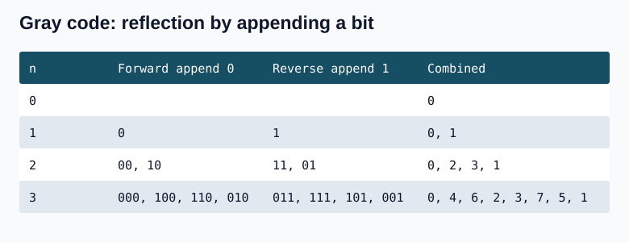
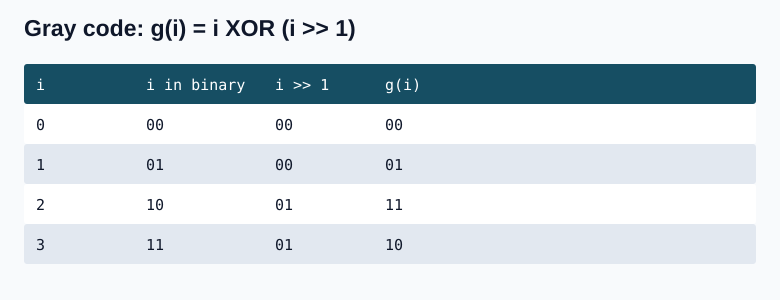
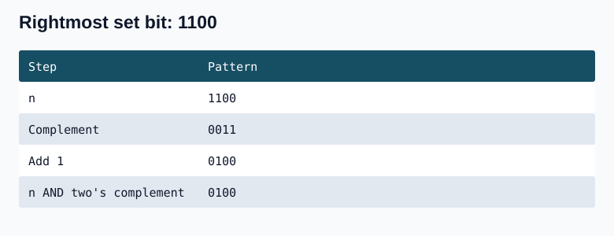
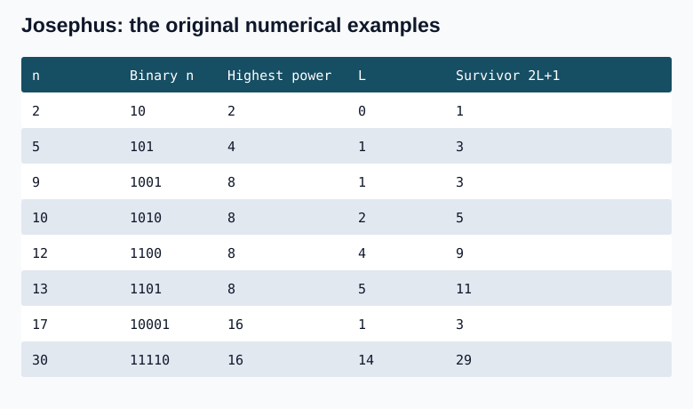
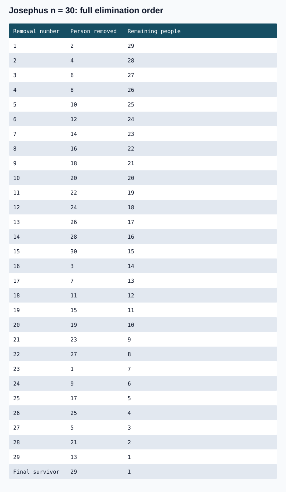

## Question 1. Counting Bits (338)

Given an integer n, return an array ans of length n+1 such that ans[i] is the number of 1 bits in the binary representation of i, for every 0 <= i <= n.

Example: n=2 -> [0,1,1], because 0=0, 1=1, and 2=10.

Constraint: 0 <= n <= 10^5. Follow-up: compute the answer in O(n) time in one pass without a built-in population-count function.

The initial method counts each number separately by repeatedly subtracting its rightmost set-bit mask. ans[0] stays zero.

### C++

```cpp
#include <vector>
int countSetBitsForValue(int n) {
    int count=0;
    while(n>0) { n -= n & -n; ++count; }
    return count;
}
std::vector<int> countBits(int n) {
    std::vector<int> ans(n+1);
    for(int i=1;i<=n;++i) ans[i]=countSetBitsForValue(i);
    return ans;
}
```

### Java

```java
static int countSetBitsForValue(int n) {
    int count=0;
    while(n>0) { n -= n & -n; ++count; }
    return count;
}
static int[] countBits(int n) {
    int[] ans=new int[n+1];
    for(int i=1;i<=n;++i) ans[i]=countSetBitsForValue(i);
    return ans;
}
```

**Complexity:** O(n log(n+1)) time in the variable-bit-length model, because each of n numbers may have O(log n) set bits; O(n) output space and O(1) auxiliary space beyond the output.

### Linear-time follow-up

Removing one set bit produces a smaller integer whose answer is already known. Therefore ans[i]=ans[i & (i-1)]+1. This uses the same bit-removal logic while reusing the earlier counts.

### C++

```cpp
#include <vector>
std::vector<int> countBitsLinear(int n) {
    std::vector<int> ans(n+1);
    for(int i=1;i<=n;++i) ans[i]=ans[i&(i-1)]+1;
    return ans;
}
```

### Java

```java
static int[] countBitsLinear(int n) {
    int[] ans=new int[n+1];
    for(int i=1;i<=n;++i) ans[i]=ans[i&(i-1)]+1;
    return ans;
}
```

**Complexity:** O(n) time for one constant-time update per value; O(n) output space and O(1) extra working space.

## Question 2. Gray Code (89)

An n-bit Gray code is a sequence of 2^n integers satisfying all of the following:

- Every value is in [0,2^n-1].
- The first value is 0.
- No value appears more than once.
- Adjacent values differ in exactly one bit.
- The first and last values also differ in exactly one bit.

Given n, return any valid n-bit Gray code sequence. 

Example: n=2 -> [0,1,3,2], whose binary values are [00,01,11,10]. Transitions 00->01, 01->11, 11->10, and 10->00 each change one bit. [0,2,3,1] with [00,10,11,01] is also valid.

Reflection method: start from the one-bit list [0,1]. To add a bit on the right, traverse the previous list forwards and append 0 (multiply by 2), then backwards and append 1 (multiply by 2 and add 1). Mirroring is essential: adding both outputs for each element in one forward loop can change multiple bits at the boundary. For n=0, use [0]. A proposed shifting mask that simply moves left and back is only a partial idea; reflection gives a complete construction.

For previous list [0,1,3,2], the even outputs are [0,2,6,4]. The reverse-order odd outputs are [5,7,3,1]. The combined three-bit sequence is [0,2,6,4,5,7,3,1]. The forward odd list would be [1,3,7,5], not [1,3,7,8].



### C++

```cpp
#include <vector>
std::vector<int> grayCode(int n) {
    if(n==0) return {0};
    std::vector<int> previous=grayCode(n-1), result;
    for(int v:previous) result.push_back(v*2);
    for(int i=(int)previous.size()-1;i>=0;--i) result.push_back(previous[i]*2+1);
    return result;
}
```

### Java

```java
static java.util.List<Integer> grayCode(int n) {
    if(n==0) {
        java.util.List<Integer> base=new java.util.ArrayList<>();
        base.add(0); return base;
    }
    java.util.List<Integer> previous=grayCode(n-1);
    java.util.List<Integer> result=new java.util.ArrayList<>();
    for(int v:previous) result.add(v*2);
    for(int i=previous.size()-1;i>=0;--i) result.add(previous.get(i)*2+1);
    return result;
}
```

**Complexity:** O(2^n) time: list sizes across recursion sum to a geometric series. O(2^n) output and temporary-list space, plus O(n) recursion depth.

### Direct Gray-code formula

For every integer i from 0 through 2^n-1, emit g(i)=i XOR (i >> 1). For i=0,1,2,3 this gives 0,1,3,2.

Why adjacent values differ in one bit: let t=i XOR (i+1). Incrementing flips a trailing run, so t consists of some low ones with zeros above. Then g(i) XOR g(i+1)=t XOR (t >> 1), which contains exactly one 1. Also g(0)=0. The mapping is one-to-one because the original binary bits can be reconstructed from high to low: the top bit is unchanged, and each lower input bit is the XOR of its Gray bit with the previous input bit. Finally g(2^n-1)=2^(n-1), which differs from zero in one bit, proving the wraparound condition.

### C++

```cpp
#include <vector>
std::vector<int> grayCodeDirect(int n) {
    std::vector<int> ans(1<<n);
    for(int i=0;i<(1<<n);++i) ans[i]=i^(i>>1);
    return ans;
}
```

### Java

```java
static java.util.List<Integer> grayCodeDirect(int n) {
    java.util.List<Integer> ans=new java.util.ArrayList<>();
    for(int i=0;i<(1<<n);++i) ans.add(i^(i>>1));
    return ans;
}
```



**Complexity:** O(2^n) time for one operation per output, O(2^n) output space and O(1) auxiliary space.

## Question 3. Isolate the rightmost set bit

For a fixed-width pattern, two's complement keeps all trailing zeros and the first 1 from the right unchanged, and complements everything to its left. For example 1100 -> 0011 after complement -> 0100 after adding 1. Thus n AND (-n) isolates the rightmost set bit. Both -n and ~n+1 express two's complement in the intended fixed-width arithmetic. Kernighan's algorithm uses this mask.



### C++

```cpp
#include <cstdint>
std::uint32_t rightmostSetBit(std::uint32_t n) { return n & (0u-n); }
```

### Java

```java
static int rightmostSetBit(int n) { return n & -n; }
```

**Complexity:** O(1) time and space: a negation and an AND operation.

## Question 4. Josephus problem: eliminate every second person

Number n people from 1 through n in a circle. Start counting at person 1 and remove every second person (person 2 is first). Continue around the circle until one person survives. Find that person's original label. This is the step-size-two version; the general Josephus problem may use another step size. The notes give no separate numeric upper bound; n must be positive.

Write n=2^k+L, where 2^k is the largest power of two not exceeding n. The answer is 2L+1. For n=30, 30=16+14 and the survivor is 29. For n=10, 10=8+2 and the survivor is 5. Other examples: n=2 -> 1, n=5 -> 3, n=9 -> 3, n=12 -> 9, n=13 -> 11, n=17 -> 3.

Find the largest power of two by starting at 1 and doubling while the next value is at most n. For n=2, the sequence is 1->2 and stops. For n=5 it is 1->2->4 and stops; L=1, so the answer is 3. The loop must not continue until the power exceeds n.

Binary interpretation: remove the leading 1, shift the remaining bits left once, and append 1. Thus 1010 -> 010 -> 101 (5), 11110 -> 1110 -> 11101 (29), 10001 -> 0001 -> 00011 (3), and 1001 -> 001 -> 0011 (3).

The first elimination round removes all even labels, so a survivor's low bit is 1. Subsequent rounds continue from the current circular position rather than restarting at label 1. For n=30 the survivor lists after successive sweeps are [1,3,5,7,9,11,13,15,17,19,21,23,25,27,29], then [1,5,9,13,17,21,25,29], then [5,13,21,29], then [13,29], then [29]. The formula follows the recurrences J(2m)=2J(m)-1 and J(2m+1)=2J(m)+1, with J(1)=1. For a power of two, J(n)=1; for n=2^k+L these recurrences give 2L+1.



### C++

```cpp
long long highestPowerOfTwo(long long n) {
    long long p=1;
    while(p<=n/2) p*=2;
    return p;
}
long long josephusEverySecond(long long n) {
    long long p=highestPowerOfTwo(n);
    return 2*(n-p)+1;
}
```

### Java

```java
static long highestPowerOfTwo(long n) {
    long p=1;
    while(p<=n/2) p*=2;
    return p;
}
static long josephusEverySecond(long n) {
    long p=highestPowerOfTwo(n);
    return 2*(n-p)+1;
}
```

**Complexity:** O(log n) time to locate the highest power of two; O(1) auxiliary space. Using p <= n/2 avoids overflow in the loop condition.



## Question 5. Two non-repeating values among pairs

(Seen is single numbers but required for next question)

The existing singleNumber implementation below solves the two-single-value variant: all other values occur twice. XOR all values, isolate the rightmost set bit of that XOR, and accumulate one XOR for each side of the mask. Equal pairs stay together and cancel. The two remaining values are returned without sorting.

**Complexity:** O(n) time for two passes and O(1) auxiliary space.


       


      


          
 
 
  
```cpp

class Solution {
public:
    vector<int> singleNumber(vector<int>& nums) {
        vector<int>res(2);
        unsigned int xor_val=0;
        for(int i=0;i<nums.size();i++){
            xor_val=xor_val^nums[i];
        }
        int rightMostSetMask=xor_val&-xor_val;
        int set1=0;
        int set0=0;
        for(int i=0;i<nums.size();i++){
            int dec_res=rightMostSetMask&nums[i];
            if(dec_res==0) set0=set0^nums[i];
            else set1=set1^nums[i];
        }
        res[0]=set0;
        res[1]=set1;
        return res;
    }
};
```

### Java

```java
class Solution {
    public int[] singleNumber(int[] nums) {
        int xorValue=0;
        for(int v:nums) xorValue^=v;
        int mask=xorValue & -xorValue;
        int set0=0,set1=0;
        for(int v:nums) {
            if((v&mask)==0) set0^=v; else set1^=v;
        }
        return new int[]{set0,set1};
    }
}
```

## Question 6. One repeating number and one missing number
(same logic as above)
Given an array of length n containing values from 1 through n, one number appears twice and one number is missing. Find both.

The displayed bounds are 1 <= n <= 10^9 and 1 <= a[i] <= 10^9; the problem statement additionally restricts values to [1,n]. A valid instance with one duplicate and one missing value needs n>=2.

Sample input: n=7, array=[1,3,4,5,1,6,2]. Sample output: Missing Number -> 7; Repeating Number -> 1.

XOR the array with all expected values 1..n. Normal values occur twice and cancel. The duplicate appears three times across the combined sequences, and the missing value appears once, leaving duplicate XOR missing. For the sample this is 1 XOR 7 = 110 (6), whose rightmost set-bit mask is 010 (2), not 110.

Partition both the array values and the expected values using that single-bit mask. XOR each group. For the sample, the bit-0 group (with bit 1 unset) contains array values [1,4,5,1] and expected values [1,4,5], reducing to 1. The bit-1 group contains [3,6,2] and [2,3,6,7], reducing to 7. Search the original array for a candidate: the one present is the repeating value, and the absent one is the missing value. Sorting the candidates cannot identify their roles.

Use names such as xorValue rather than xor in C++, where xor is an alternative operator token. Write ((value & mask) == 0), not (value & mask == 0): equality has higher precedence than bitwise AND, so parentheses are necessary.

![Missing and repeating: [1, 3, 4, 5, 1, 6, 2]](svgs/missing-repeating.svg)

### C++

```cpp
#include <vector>
#include <utility>
#include <cstdint>
std::pair<int,int> missingAndRepeating(const std::vector<int>& arr) {
    std::uint32_t xorValue=0;
    for(int i=0;i<(int)arr.size();++i) xorValue ^= std::uint32_t(arr[i]) ^ std::uint32_t(i+1);
    std::uint32_t mask=xorValue & (0u-xorValue);
    int s0=0,s1=0;
    for(int i=0;i<(int)arr.size();++i) {
        if((std::uint32_t(arr[i])&mask)==0) s0^=arr[i]; else s1^=arr[i];
        if((std::uint32_t(i+1)&mask)==0) s0^=i+1; else s1^=i+1;
    }
    for(int v:arr) {
        if(v==s0) return {s1,s0};
        if(v==s1) return {s0,s1};
    }
    return {-1,-1}; // Valid input always returns above.
}
```

### Java

```java
static int[] missingAndRepeating(int[] arr) {
    int xorValue=0;
    for(int i=0;i<arr.length;++i) xorValue ^= arr[i] ^ (i+1);
    int mask=xorValue & -xorValue;
    int s0=0,s1=0;
    for(int i=0;i<arr.length;++i) {
        if((arr[i]&mask)==0) s0^=arr[i]; else s1^=arr[i];
        if(((i+1)&mask)==0) s0^=i+1; else s1^=i+1;
    }
    for(int v:arr) {
        if(v==s0) return new int[]{s1,s0};
        if(v==s1) return new int[]{s0,s1};
    }
    return new int[]{-1,-1};
}
```

**Complexity:** O(n) time for XOR, partitioning, and candidate verification; O(1) auxiliary space. The return order is [missing,repeating].


       


