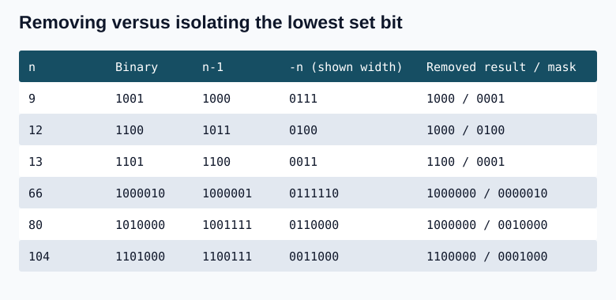
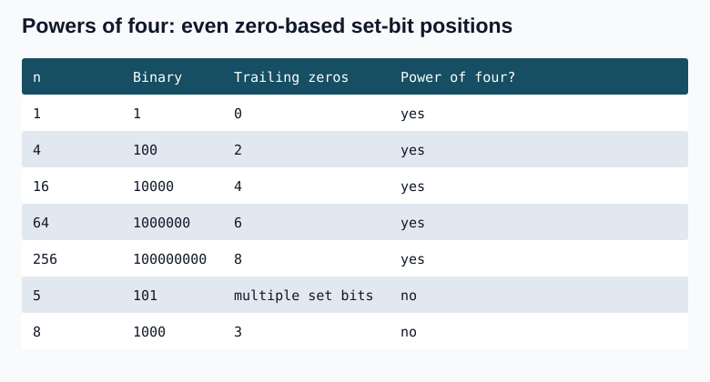
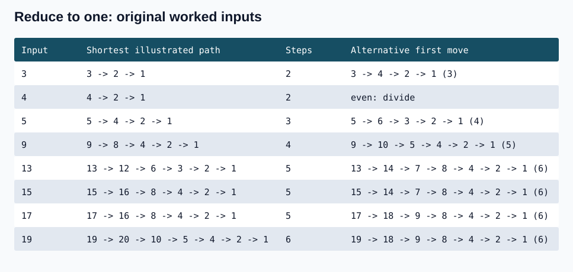

## Question 1. Power of Two (231)

Given an integer n, return true if n is a power of two, otherwise false. A power of two has the form 2^x for a nonnegative integer x.

Examples: n=1 -> true (2^0=1); n=16 -> true (2^4=16); n=3 -> false.

Constraint: -2^31 <= n <= 2^31-1. Follow-up: solve without loops or recursion. The notes also ask to avoid division and remainder operators.

First approach: count the set bits of a positive value. A power of two has exactly one set bit. Reject nonpositive inputs.


### C++

```cpp
bool isPowerOfTwoByCount(int n) {
    if(n<=0) return false;
    int count=0;
    while(n>0) { n-=n&-n; ++count; }
    return count==1;
}
```

### Java

```java
static boolean isPowerOfTwoByCount(int n) {
    if(n<=0) return false;
    int count=0;
    while(n>0) { n-=n&-n; ++count; }
    return count==1;
}
```

**Complexity:** O(s) time for s set bits, O(1) auxiliary space. At most 31 set bits are visited for positive signed 32-bit inputs.

### Constant-time test

2^k is a 1 followed by k zeros. Subtracting 1 gives k low ones instead. Their AND is zero. For a general positive n, n & (n-1) clears exactly the lowest set bit, leaving every higher bit unchanged. Therefore this expression is zero exactly when n has one set bit. The n>0 guard rejects zero and negative values. Powers of positive 2 cannot be negative.

### C++

```cpp
bool isPowerOfTwo(int n) { return n>0 && (n&(n-1))==0; }
```

### Java

```java
static boolean isPowerOfTwo(int n) { return n>0 && (n&(n-1))==0; }
```

**Complexity:** O(1) time and space: one subtraction, one AND, and two comparisons, with no loop.

### Relationship between n-1 and -n

If n has s set bits, n & (n-1) has s-1 set bits and is smaller for positive n. In n-1, the rightmost set bit becomes 0, the lower zeros become ones, and the higher prefix stays unchanged. For example, 104=1101000 and 103=1100111; their AND is 1100000 (96). Similarly 80=1010000 and 79=1001111 have AND 1000000 (64).

The two's-complement pattern -n instead preserves the lowest set bit and its trailing zeros while complementing the prefix to its left. For 66=1000010, its seven-bit negative pattern is 0111110, and their AND is 0000010 (2). Thus n & -n isolates the bit that n & (n-1) removes. For a positive n, (n & -n)==n is another power-of-two test. Use unsigned negation in C++ for arbitrary unsigned bit patterns.

Let x=n & (n-1), y=n & -n. Their set bits are disjoint and n=x OR y. For n=104, x=1100000 and y=0001000, whose OR is 1101000.

### C++

```cpp
#include <cstdint>
bool isPowerOfTwoByMask(std::uint32_t n) { return n!=0 && (n&(0u-n))==n; }
```

### Java

```java
static boolean isPowerOfTwoByMask(int n) { return n>0 && (n & -n)==n; }
```



**Complexity:** O(1) time and space for each fixed-width formula.

## ASCII reference table

The decimal, binary, octal, hexadecimal, and ASCII representations are listed below. Bit positions count from the right. In ordinary binary counting, bit 0 alternates every value, bit 1 every two values, bit 2 every four values, and bit 3 every eight values.

| Decimal | Binary | Octal | Hex | ASCII |
|---:|---|---|---|---|
| 0 | 00000000 | 000 | 00 | NUL |
| 1 | 00000001 | 001 | 01 | SOH |
| 2 | 00000010 | 002 | 02 | STX |
| 3 | 00000011 | 003 | 03 | ETX |
| 4 | 00000100 | 004 | 04 | EOT |
| 5 | 00000101 | 005 | 05 | ENQ |
| 6 | 00000110 | 006 | 06 | ACK |
| 7 | 00000111 | 007 | 07 | BEL |
| 8 | 00001000 | 010 | 08 | BS |
| 9 | 00001001 | 011 | 09 | HT |
| 10 | 00001010 | 012 | 0A | LF |
| 11 | 00001011 | 013 | 0B | VT |
| 12 | 00001100 | 014 | 0C | FF |
| 13 | 00001101 | 015 | 0D | CR |
| 14 | 00001110 | 016 | 0E | SO |
| 15 | 00001111 | 017 | 0F | SI |
| 16 | 00010000 | 020 | 10 | DLE |
| 17 | 00010001 | 021 | 11 | DC1 |
| 18 | 00010010 | 022 | 12 | DC2 |
| 19 | 00010011 | 023 | 13 | DC3 |
| 20 | 00010100 | 024 | 14 | DC4 |
| 21 | 00010101 | 025 | 15 | NAK |
| 22 | 00010110 | 026 | 16 | SYN |
| 23 | 00010111 | 027 | 17 | ETB |
| 24 | 00011000 | 030 | 18 | CAN |
| 25 | 00011001 | 031 | 19 | EM |
| 26 | 00011010 | 032 | 1A | SUB |
| 27 | 00011011 | 033 | 1B | ESC |
| 28 | 00011100 | 034 | 1C | FS |
| 29 | 00011101 | 035 | 1D | GS |
| 30 | 00011110 | 036 | 1E | RS |
| 31 | 00011111 | 037 | 1F | US |
| 32 | 00100000 | 040 | 20 | SPACE |
| 33 | 00100001 | 041 | 21 | &#33; |
| 34 | 00100010 | 042 | 22 | &#34; |
| 35 | 00100011 | 043 | 23 | &#35; |
| 36 | 00100100 | 044 | 24 | &#36; |
| 37 | 00100101 | 045 | 25 | &#37; |
| 38 | 00100110 | 046 | 26 | &#38; |
| 39 | 00100111 | 047 | 27 | &#39; |
| 40 | 00101000 | 050 | 28 | &#40; |
| 41 | 00101001 | 051 | 29 | &#41; |
| 42 | 00101010 | 052 | 2A | &#42; |
| 43 | 00101011 | 053 | 2B | &#43; |
| 44 | 00101100 | 054 | 2C | &#44; |
| 45 | 00101101 | 055 | 2D | &#45; |
| 46 | 00101110 | 056 | 2E | &#46; |
| 47 | 00101111 | 057 | 2F | &#47; |
| 48 | 00110000 | 060 | 30 | &#48; |
| 49 | 00110001 | 061 | 31 | &#49; |
| 50 | 00110010 | 062 | 32 | &#50; |
| 51 | 00110011 | 063 | 33 | &#51; |
| 52 | 00110100 | 064 | 34 | &#52; |
| 53 | 00110101 | 065 | 35 | &#53; |
| 54 | 00110110 | 066 | 36 | &#54; |
| 55 | 00110111 | 067 | 37 | &#55; |
| 56 | 00111000 | 070 | 38 | &#56; |
| 57 | 00111001 | 071 | 39 | &#57; |
| 58 | 00111010 | 072 | 3A | &#58; |
| 59 | 00111011 | 073 | 3B | &#59; |
| 60 | 00111100 | 074 | 3C | &#60; |
| 61 | 00111101 | 075 | 3D | &#61; |
| 62 | 00111110 | 076 | 3E | &#62; |
| 63 | 00111111 | 077 | 3F | &#63; |
| 64 | 01000000 | 100 | 40 | &#64; |
| 65 | 01000001 | 101 | 41 | &#65; |
| 66 | 01000010 | 102 | 42 | &#66; |
| 67 | 01000011 | 103 | 43 | &#67; |
| 68 | 01000100 | 104 | 44 | &#68; |
| 69 | 01000101 | 105 | 45 | &#69; |
| 70 | 01000110 | 106 | 46 | &#70; |
| 71 | 01000111 | 107 | 47 | &#71; |
| 72 | 01001000 | 110 | 48 | &#72; |
| 73 | 01001001 | 111 | 49 | &#73; |
| 74 | 01001010 | 112 | 4A | &#74; |
| 75 | 01001011 | 113 | 4B | &#75; |
| 76 | 01001100 | 114 | 4C | &#76; |
| 77 | 01001101 | 115 | 4D | &#77; |
| 78 | 01001110 | 116 | 4E | &#78; |
| 79 | 01001111 | 117 | 4F | &#79; |
| 80 | 01010000 | 120 | 50 | &#80; |
| 81 | 01010001 | 121 | 51 | &#81; |
| 82 | 01010010 | 122 | 52 | &#82; |
| 83 | 01010011 | 123 | 53 | &#83; |
| 84 | 01010100 | 124 | 54 | &#84; |
| 85 | 01010101 | 125 | 55 | &#85; |
| 86 | 01010110 | 126 | 56 | &#86; |
| 87 | 01010111 | 127 | 57 | &#87; |
| 88 | 01011000 | 130 | 58 | &#88; |
| 89 | 01011001 | 131 | 59 | &#89; |
| 90 | 01011010 | 132 | 5A | &#90; |
| 91 | 01011011 | 133 | 5B | &#91; |
| 92 | 01011100 | 134 | 5C | &#92; |
| 93 | 01011101 | 135 | 5D | &#93; |
| 94 | 01011110 | 136 | 5E | &#94; |
| 95 | 01011111 | 137 | 5F | &#95; |
| 96 | 01100000 | 140 | 60 | &#96; |
| 97 | 01100001 | 141 | 61 | &#97; |
| 98 | 01100010 | 142 | 62 | &#98; |
| 99 | 01100011 | 143 | 63 | &#99; |
| 100 | 01100100 | 144 | 64 | &#100; |
| 101 | 01100101 | 145 | 65 | &#101; |
| 102 | 01100110 | 146 | 66 | &#102; |
| 103 | 01100111 | 147 | 67 | &#103; |
| 104 | 01101000 | 150 | 68 | &#104; |
| 105 | 01101001 | 151 | 69 | &#105; |
| 106 | 01101010 | 152 | 6A | &#106; |
| 107 | 01101011 | 153 | 6B | &#107; |
| 108 | 01101100 | 154 | 6C | &#108; |
| 109 | 01101101 | 155 | 6D | &#109; |
| 110 | 01101110 | 156 | 6E | &#110; |
| 111 | 01101111 | 157 | 6F | &#111; |
| 112 | 01110000 | 160 | 70 | &#112; |
| 113 | 01110001 | 161 | 71 | &#113; |
| 114 | 01110010 | 162 | 72 | &#114; |
| 115 | 01110011 | 163 | 73 | &#115; |
| 116 | 01110100 | 164 | 74 | &#116; |
| 117 | 01110101 | 165 | 75 | &#117; |
| 118 | 01110110 | 166 | 76 | &#118; |
| 119 | 01110111 | 167 | 77 | &#119; |
| 120 | 01111000 | 170 | 78 | &#120; |
| 121 | 01111001 | 171 | 79 | &#121; |
| 122 | 01111010 | 172 | 7A | &#122; |
| 123 | 01111011 | 173 | 7B | &#123; |
| 124 | 01111100 | 174 | 7C | &#124; |
| 125 | 01111101 | 175 | 7D | &#125; |
| 126 | 01111110 | 176 | 7E | &#126; |
| 127 | 01111111 | 177 | 7F | DEL |

## Question 2. Power of Four (342)

Given an integer n, return true if it is a power of four, otherwise false. A power of four is 4^x for a nonnegative integer x.

Examples: n=16 -> true; n=5 -> false; n=1 -> true.

Constraint: -2^31 <= n <= 2^31-1. Follow-up: solve without loops or recursion. The notes additionally avoid division and remainder in the final implementation.

4^0=1 (1), 4^1=4 (100), 4^2=16 (10000), 4^3=64 (1000000), 4^4=256 (100000000). Two conditions are necessary: n must be a positive power of two, and the number of trailing zeros must be even. Equivalently, its lone set bit is at zero-based position 0,2,4,..., which is one-based position 1,3,5,... .



### C++

```cpp
bool isPowerOfFourByDivision(int n) {
    if(n<=0 || (n&(n-1))!=0) return false;
    int count=0;
    while(n>0) {
        if(n%2==0) { ++count; n/=2; }
        else break;
    }
    return count%2==0;
}
```

### Java

```java
static boolean isPowerOfFourByDivision(int n) {
    if(n<=0 || (n&(n-1))!=0) return false;
    int count=0;
    while(n>0) {
        if(n%2==0) { ++count; n/=2; }
        else break;
    }
    return count%2==0;
}
```

**Complexity:** O(log n) time to count trailing zeros of a positive power of two, O(1) space.

### Replace division and remainder with bit operations

After the power-of-two test, shift until n becomes 1 and count the shifts. Check evenness using (count & 1)==0. Java's logical shift >>> ensures zero-fill when working with arbitrary bit patterns, although the positive-value guard already makes >> safe here. A loop that repeatedly uses >> on a negative number can become stuck at -1 because the sign bit is repeatedly copied; >>> eventually reaches zero.

In a fixed four-bit illustration, 1101 shifted arithmetically right by one becomes 1110, while 0010 shifted right becomes 0001. Logical shift of 1101 yields 0110. These illustrations use four-bit signed patterns; a Java int actually has 32 bits.

### C++

```cpp
bool isPowerOfFourByShift(int n) {
    if(n<=0 || (n&(n-1))!=0) return false;
    int count=0;
    while(n!=1) { ++count; n >>= 1; }
    return (count&1)==0;
}
```

### Java

```java
static boolean isPowerOfFourByShift(int n) {
    if(n<=0 || (n&(n-1))!=0) return false;
    int count=0;
    while(n!=1) { ++count; n >>>= 1; }
    return (count&1)==0;
}
```

**Complexity:** O(log n) time and O(1) space; each shift removes one trailing zero.

### Constant-time alternating-bit mask

0x55555555 is 01010101 repeated across 32 bits. It selects even zero-based positions, exactly the positions allowed for powers of four. Return true when n>0, n has only one set bit, and that bit intersects the mask. Each hexadecimal digit encodes four binary bits; eight hexadecimal digits encode 32 bits.

### C++

```cpp
bool isPowerOfFour(int n) {
    return n>0 && (n&(n-1))==0 && (n&0x55555555)!=0;
}
```

### Java

```java
static boolean isPowerOfFour(int n) {
    return n>0 && (n&(n-1))==0 && (n&0x55555555)!=0;
}
```

**Complexity:** O(1) time and O(1) space: a fixed number of bit tests.

## Question 3. XOR of the sums of all ordered pairs

Given an array a, form the sum a[i]+a[j] for every ordered pair (i,j), including i=j, and XOR all those sums. The displayed bounds are 1 <= N <= 10^9 and 1 <= a[i] <= 10^9.

For [a,b,c,d], there are 16 sums. Every off-diagonal pair occurs twice: (a+b) and (b+a), (a+c) and (c+a), and so on. Equal values XOR to zero. Only a+a, b+b, c+c, d+d remain. Thus the result is (2a) XOR (2b) XOR (2c) XOR (2d), which equals (a XOR b XOR c XOR d) shifted left once. This relies on ordered pairs including the diagonal; changing the definition changes the answer.

![All ordered pair sums for [a, b, c, d]](svgs/pair-sums.svg)

xorSum=2a^2b^2c^2d

### C++

```cpp
#include <vector>
long long xorPairSums(const std::vector<int>& a) {
    long long ans=0;
    for(int v:a) ans ^= (static_cast<long long>(v)<<1);
    return ans;
}
```

### Java

```java
static long xorPairSums(int[] a) {
    long ans=0;
    for(int v:a) ans ^= ((long)v<<1);
    return ans;
}
```

**Complexity:** O(n) time for one pass, O(1) auxiliary space. The brute-force enumeration costs O(n^2) time; neither approach needs to store the sums.

## Question 4. Count triplets with equal XOR in adjacent ranges

Choose three boundaries i<j<k so that XOR of a[i..j-1] equals XOR of a[j..k-1]. Count all such triplets. Both ranges are nonempty, and k is an exclusive boundary that may equal the array length. No numeric constraints are shown for this handwritten question.

If the two XORs are equal, their combined XOR is zero. Conversely, if XOR of a[i..k-1] is zero, every split boundary j in i+1 through k-1 gives equal XORs. There are k-i-1 such boundaries. The implementation below instead names the last included array index k; for that convention the contribution is k-i. This explains the count += k-i line without an off-by-one error.

With the symbolic array a,b,c,d,e,f,g,h,i,j,k,l,m,..., choose boundaries before d, before h, and after m. If d XOR e XOR f XOR g equals h XOR i XOR j XOR k XOR l XOR m, then d through m XOR to zero. Every split inside that combined segment is valid, so the split position need not be tested separately. For integer ranges, [i,k] contains k-i+1 indices, [i,k) or (i,k] contains k-i, and (i,k) contains k-i-1.

Use nested loops to scan all possible combined subarrays. Carry forward the running XOR while extending the right endpoint; when it becomes zero, add the number of possible split positions.

.jpg>) .jpg>) .jpg>) .jpg>) .jpg>) .jpg>)

### C++

```cpp
#include <vector>
long long countTriplets(const std::vector<int>& arr) {
    long long count=0;
    for(int i=0;i<(int)arr.size();++i) {
        int xorValue=arr[i];
        for(int k=i+1;k<(int)arr.size();++k) {
            xorValue ^= arr[k];
            if(xorValue==0) count += k-i;
        }
    }
    return count;
}
```

### Java

```java
static long countTriplets(int[] arr) {
    long count=0;
    for(int i=0;i<arr.length;++i) {
        int xorValue=arr[i];
        for(int k=i+1;k<arr.length;++k) {
            xorValue ^= arr[k];
            if(xorValue==0) count += k-i;
        }
    }
    return count;
}
```

**Complexity:** O(n^2) time for all endpoint pairs with an O(1) XOR update each; O(1) auxiliary space. A wide count avoids overflow when many triplets exist.

## Question 5 Reduce a positive integer to one

Given a positive integer N, find the minimum number of operations required to convert it to 1. If N is even, replace it by N/2. If N is odd, replace it by either N-1 or N+1.

Displayed constraint: 1 < N < 2147483647. The base case N=1 is also useful and requires zero operations. Use a 64-bit temporary value so an increment near the signed 32-bit limit is safe.

The worked inputs include 3,4,5,9,13,15,17,19. Examples: 8 -> 4 -> 2 -> 1 requires 3 operations; 3 -> 2 -> 1 requires 2, whereas 3 -> 4 -> 2 -> 1 requires 3; 5 -> 4 -> 2 -> 1 requires 3; 9 -> 8 -> 4 -> 2 -> 1 requires 4; 15 -> 16 -> 8 -> 4 -> 2 -> 1 requires 5.

Recursive method: return 0 at 1. For an even value recurse on n/2 and add 1. For an odd value recurse on both n-1 and n+1, take the minimum, and add 1. Repeated states can be cached with memoization. Always subtracting for odd numbers is not optimal, as 15 shows; choosing the numerically nearest power of two is not the full rule either.

 .jpg>) .jpg>) .jpg>) .jpg>) .jpg>) .jpg>) .jpg>) .jpg>) .jpg>) .jpg>) .jpg>) .jpg>)




### C++

```cpp
#include <algorithm>
int reduceToOneRecursive(long long n) {
    if(n==1) return 0;
    if((n&1)==0) return 1+reduceToOneRecursive(n/2);
    return 1+std::min(reduceToOneRecursive(n-1),reduceToOneRecursive(n+1));
}
```

### Java

```java
static int reduceToOneRecursive(long n) {
    if(n==1) return 0;
    if((n&1)==0) return 1+reduceToOneRecursive(n/2);
    return 1+Math.min(reduceToOneRecursive(n-1),reduceToOneRecursive(n+1));
}
```

**Complexity:** Without memoization, O(n) is a conservative time upper bound from branching into at most two roughly half-size subproblems after at most two levels. The recursion stack is O(log n), since an odd step is followed by halving. The greedy implementation below avoids repeated work.

### Greedy rule based on the last two bits

Even values (4x and 4x+2) must be divided by two. For odd values:

- 4x+1 ends in 01. Prefer subtracting 1, yielding 4x, then 2x, then x in three operations. Adding 1 yields 4x+2, then 2x+1, requiring another odd choice. Going toward x costs an extra step on that branch; if x+1 is preferable, the subtract branch can also reach x+1 competitively. Examples 5,9,13,17 follow the subtract branch.
- 4x+3 ends in 11. Prefer adding 1, yielding 4x+4, then 2x+2, then x+1. Subtraction yields 4x+2, then 2x+1, then an extra choice toward x or x+1. Clearing the run of trailing ones creates more immediately removable zeros. The branches can tie, as for 19.
- The exception is n=3: subtract to 2, then 1. Adding to 4 takes an extra operation.

Test the two low bits with n & 3: result 1 means 4x+1, result 3 means 4x+3. The complete table of small worked values is 1:0, 2:1, 3:2, 4:2, 5:3, 6:3, 7:4, 8:3, 9:4, 12:4, 13:5, 14:5, 15:5, 16:4, 17:5, 19:6 (value:minimum steps).

### C++

```cpp
int reduceToOne(long long n) {
    int steps=0;
    while(n>1) {
        if((n&1)==0) n/=2;
        else if(n==3 || (n&3)==1) --n;
        else ++n;
        ++steps;
    }
    return steps;
}
```

### Java

```java
static int reduceToOne(long n) {
    int steps=0;
    while(n>1) {
        if((n&1)==0) n/=2;
        else if(n==3 || (n&3)==1) --n;
        else ++n;
        ++steps;
    }
    return steps;
}
```

**Complexity:** O(log n) time because at most a constant number of steps is needed before the value is halved; O(1) auxiliary space for the current value and count.


               


                         


