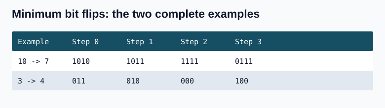
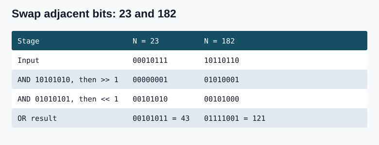
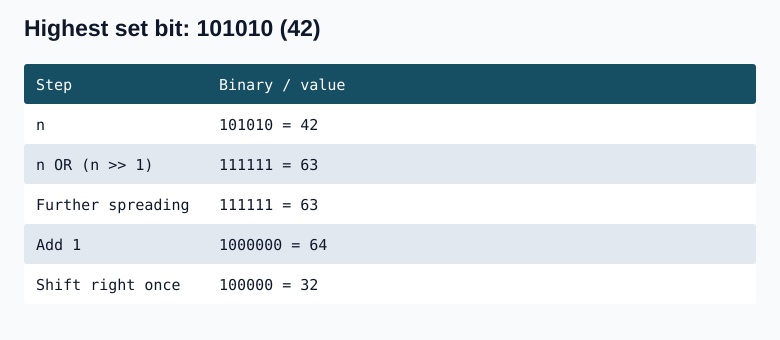

## Question 1. Copy set bits in an inclusive range

Given 32-bit integers A and B and an inclusive range of bit positions, copy the set bits of A in that range into B. If a source bit is 1, set that bit in B; if it is 0, preserve the existing bit in B. Bits outside the range are unchanged.

The question description uses zero-based bounds 0 <= left <= right <= 31.

.jpg>) .jpg>) .jpg>) .jpg>) .jpg>)

The worked diagram labels positions 1 through 14, and the mask code shifts by left-1, so that particular example is one-based. The implementations below explicitly accept one-based positions 1 <= left <= right <= 32. Convert zero-based input by adding 1 to both bounds before calling them.

The worked range is left=4, right=10 (one-based), containing 10-4+1=7 bits. A=10111011101011 and B=11010100101001. Extract A's seven positions with 00001111111000, then OR them into B. The result is 11011111101001. Existing set bits in B stay set. This is copying only set bits, not replacing the whole range.

Brute force checks each position in the range and ORs that position into B when it is set in A. A reconstruction that repeatedly shifts the result the wrong way can reverse or displace the extracted bits; setting the original position directly keeps the alignment.


### C++

```cpp
#include <cstdint>
std::uint32_t copySetBitsBrute(std::uint32_t a,std::uint32_t b,int left,int right) {
    for(int i=left-1;i<right;++i) {
        std::uint32_t bit=std::uint32_t(1)<<i;
        if((a&bit)!=0) b |= bit;
    }
    return b;
}
```

### Java

```java
static int copySetBitsBrute(int a,int b,int left,int right) {
    for(int i=left-1;i<right;++i) {
        int bit=1<<i;
        if((a&bit)!=0) b |= bit;
    }
    return b;
}
```

**Complexity:** O(right-left+1) time because each copied position is tested, O(1) auxiliary space.

### Constant-time mask

Let width=right-left+1. Start with 1, shift by width, subtract 1 to obtain width low ones, then shift that block by left-1. Compute B OR (A AND mask). The width is right-left+1, not left-right+1. A 64-bit intermediate safely handles the full 32-bit range.

For integer positions, [a,b] has b-a+1 positions, [a,b) or (a,b] has b-a, and (a,b) has b-a-1.

### C++

```cpp
#include <cstdint>
std::uint32_t copySetBits(std::uint32_t a,std::uint32_t b,int left,int right) {
    int width=right-left+1;
    std::uint64_t mask=((std::uint64_t(1)<<width)-1)<<(left-1);
    return b | (a & static_cast<std::uint32_t>(mask));
}
```

### Java

```java
static int copySetBits(int a,int b,int left,int right) {
    int width=right-left+1;
    long mask=((1L<<width)-1)<<(left-1);
    return b | (a & (int)mask);
}
```

**Complexity:** O(1) time and O(1) auxiliary space, using a constant number of shifts and masks.

## Question 2. Minimum Bit Flips to Convert Number (2220)

A bit flip chooses any position in a number's binary representation and changes 0 to 1 or 1 to 0. Leading zero positions may also be chosen. For example, starting with 7=111, flipping the first bit from the right gives 110, flipping the second gives 101, and flipping the fifth position gives 10111.

Given start and goal, return the minimum number of bit flips needed to convert start into goal.

Example 1: start=10, goal=7 -> 3. The sequence 1010 -> 1011 -> 1111 -> 0111 flips positions 1,3,4 from the right. Fewer than three flips cannot change all three differing positions.

Example 2: start=3, goal=4 -> 3. The sequence 011 -> 010 -> 000 -> 100 flips positions 1,2,3 from the right.

Constraints: 0 <= start,goal <= 10^9.

XOR marks exactly the positions that differ. Every such position must change once, and matching positions need no change. Therefore the answer is the number of set bits in start XOR goal. The brute-force implementation below checks positions individually; the next implementation counts the low bit in a fixed 32-iteration loop.



        

## code solution

### Brute

```cpp
#include <bits/stdc++.h>
using namespace std;
/*
Given two integers start and goal. Flip the minimum number of bits of start integer to convert it into goal integer.


A bits flip in the number val is to choose any bit in binary representation of val and flipping it from either 0 to 1 or 1 to 0.

*/
class Solution{  
    int countBits(int n){
        int res=0;
        while(n!=0){
            res++;
            n=n>>1;
        }
        return res;
    } 
public:    
    int minBitsFlip(int start, int goal) { 
        if(start==goal) return 0;
        int n=countBits(max(start,goal));
        int bitCount=0;
        for(int i=0;i<n;i++){
            int stbit=(start &(1<<i));
            int gbit=(goal &(1<<i));
            if(stbit!=gbit) bitCount++;
        }
        return bitCount;
    }
};

```

### Java

```java
class Solution {
    private int countBits(int n) {
        int res=0;
        while(n!=0) { ++res; n >>= 1; }
        return res;
    }
    public int minBitsFlip(int start,int goal) {
        if(start==goal) return 0;
        int n=countBits(Math.max(start,goal)),bitCount=0;
        for(int i=0;i<n;++i) {
            int stbit=start&(1<<i),gbit=goal&(1<<i);
            if(stbit!=gbit) ++bitCount;
        }
        return bitCount;
    }
}
```

### Better
```cpp
#include <bits/stdc++.h>
using namespace std;

class Solution {
public:
    int minBitsFlip(int start, int goal) {
        

        int num = start ^ goal;

        int count = 0;

        for(int i = 0; i < 32; i++) {
            count += (num & 1); 
            num = num >> 1;
        }
        return count;
    }
};

int main() {
    int start = 10, goal = 7;
    
    /* Creating an instance of 
    Solution class */
    Solution sol; 
    
    /* Function call to get the minimum
     bit flips to convert number */
    int ans = sol.minBitsFlip(start, goal);
    
    cout << "The minimum bit flips to convert number is: " << ans;
    
    return 0;
}


```

### Java

```java
class Solution {
    public int minBitsFlip(int start,int goal) {
        int num=start^goal,count=0;
        for(int i=0;i<32;++i) { count += num&1; num >>= 1; }
        return count;
    }
}
```
### Remove only the differing set bits

Instead of scanning all 32 positions, repeatedly subtract the rightmost set-bit mask of start XOR goal. For 10 and 7, the XOR is 1101: 1101 -> 1100 -> 1000 -> 0000, three removals. For 3 and 4 it is 111: 111 -> 110 -> 100 -> 000, also three removals.

### C++

```cpp
#include <cstdint>
int minBitFlipsFast(int start,int goal) {
    std::uint32_t value=std::uint32_t(start)^std::uint32_t(goal);
    int count=0;
    while(value!=0) { value-=value&(0u-value); ++count; }
    return count;
}
```

### Java

```java
static int minBitFlipsFast(int start,int goal) {
    int value=start^goal,count=0;
    while(value!=0) { value-=value&-value; ++count; }
    return count;
}
```

**Complexity:** The brute version takes O(log(max(start,goal)+1)) time and O(1) space; it counts the significant positions and visits each. The fixed loop takes O(32)=O(1) time and O(1) space. The set-bit-removal version takes O(d) time for d differing bits and O(1) space; d<=32 for a machine word.


    


## Question 3. Swap all odd and even bits

Given an unsigned integer N, swap each adjacent pair of bits: every even one-based position swaps with the adjacent position on its right, and every odd one-based position swaps with the adjacent position on its left.

Example: N=23 -> 43. Its binary representation 00010111 becomes 00101011 after swapping pairs. Another diagram shows 10110110 -> 01111001. No numeric bound is visible in the displayed question; the implementation treats the input as a 32-bit unsigned pattern.

Use 0xAAAAAAAA (1010 repeated) to select zero-based positions 1,3,5,... and shift those right by one. Use 0x55555555 (0101 repeated) to select positions 0,2,4,... and shift those left by one. OR the two results. Position names may be called odd/even differently depending on zero-based or one-based numbering, so follow the actual mask and shift directions.

Hexadecimal digits A,B,C,D,E,F mean 10,11,12,13,14,15. A leading 0x denotes hexadecimal. Each hex digit represents four bits, so eight digits represent a 32-bit mask. For example 0xAB is 00000000000000000000000010101011 in 32 bits. Leading unspecified high bits are zero.



### C++

```cpp
#include <cstdint>
std::uint32_t swapBits(std::uint32_t n) {
    std::uint32_t even=n&0xAAAAAAAAu;
    std::uint32_t odd=n&0x55555555u;
    odd <<= 1; even >>= 1;
    return odd|even;
}
```

### Java

```java
static int swapBits(int n) {
    int even=n&0xAAAAAAAA;
    int odd=n&0x55555555;
    odd <<= 1; even >>>= 1;
    return odd|even;
}
```

**Complexity:** O(1) time and O(1) space: two masks, two shifts, and an OR. Java returns the 32-bit pattern as int; Integer.toUnsignedLong(result) gives its nonnegative numeric interpretation.

## Question 4. Extract the highest set bit

Given a nonnegative integer n, return the value represented by its most significant set bit (the greatest power of two not exceeding n). Return zero for zero.

## Some extra 

```cpp
int getMSB(int n) {
    if (n == 0) return 0;

    n |= n >> 1;
    n |= n >> 2;
    n |= n >> 4;
    n |= n >> 8;
    n |= n >> 16; 
    // Now n is of the form 00011111...
    
    // To get just the MSB:
    return (n + 1) >> 1;
}
```

### Java

```java
static int getMSB(int n) {
    if(n==0) return 0;
    n |= n>>1; n |= n>>2; n |= n>>4; n |= n>>8; n |= n>>16;
    return (n+1)>>1;
}
```
we have number like `1...`

`n|=n>>1` it copies MSB to 2nd MSB now number is `11...`

`n|=n>>2` it copies MSB to 2nd MSB now number is `1111...`

`n|=n>>4` it copies MSB to 2nd MSB now number is `11111111...`

`n|=n>>8` it copies MSB to 2nd MSB now number is `1111111111111111...`

if we do not have that much bits it will not do anything like number is `101010`

`n|=n>>1` makes n=111111


after all operations we get all 1's from MSB of number to LSB ,we know all 1's is $2^n$-1


Now if we do `(n+1)` we get next power of 2 that is $2^n$

now we do `(n+1)>>1` we get 2^(n-1)


after bits operation n is one less than next power of 2

so we add that one!!

To get current power just shift by 1 bits to right!


### Boundary and complexity notes

The spreading operations below the most significant 1 make every lower bit 1. Adding 1 reaches the next power of two, and shifting right once returns the original highest power. For 101010 (42), n OR (n >> 1) is 111111 (63), and (63+1)>>1 is 32. More generally, each spreading step doubles the span already filled: 1, then 11, then 1111, then eight ones, then sixteen, then 32.

The original signed implementations above need n+1 to remain representable and positive. For example, spreading 2^30 makes 2^31-1; the next addition exceeds the signed 32-bit range. Java wraps and arithmetic right shift then produces a negative result; signed overflow is invalid in C++. Keep the same spreading logic but use an unsigned/wider intermediate for the full nonnegative 32-bit input domain:

### C++

```cpp
#include <cstdint>
std::uint32_t getMSBSafe(std::uint32_t n) {
    if(n==0) return 0;
    n |= n>>1; n |= n>>2; n |= n>>4; n |= n>>8; n |= n>>16;
    return static_cast<std::uint32_t>((std::uint64_t(n)+1)>>1);
}
```

### Java

```java
static int getMSBSafe(int n) {
    if(n==0) return 0;
    long x=Integer.toUnsignedLong(n);
    x |= x>>1; x |= x>>2; x |= x>>4; x |= x>>8; x |= x>>16;
    return (int)((x+1)>>1);
}
```



**Complexity:** O(1) time and O(1) auxiliary space for fixed 32-bit values because there are exactly five spreading shifts and a constant number of final operations.
