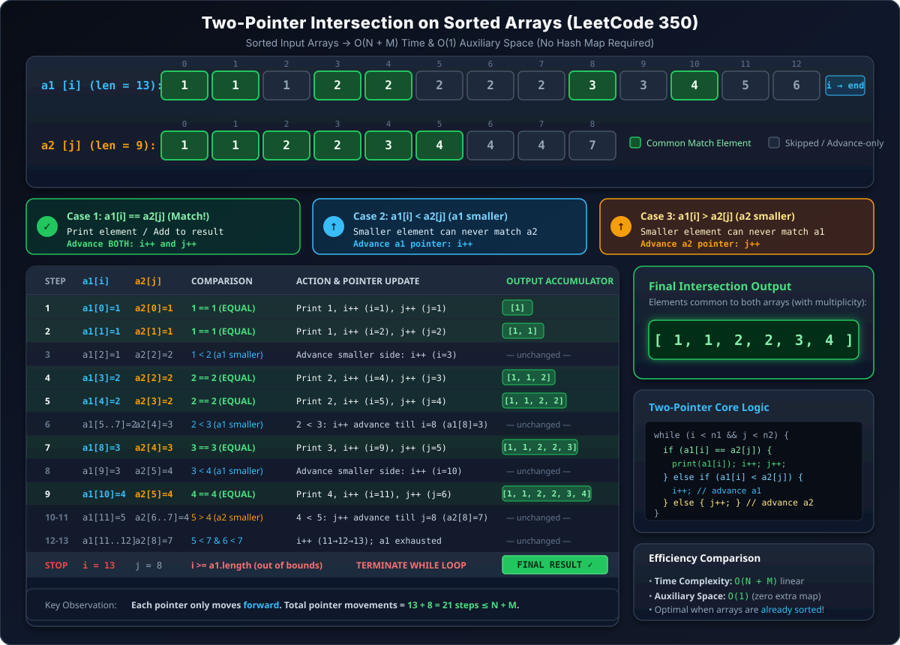

## HashMap Basics

HashMap is a table-like Data Structure.

```
RollNo -> Name
1      -> Abhishek
2      -> Aman
3      -> Anushka
4      -> Anushka
5      -> Mohit
```

**Key is unique** — see, `RollNo` is unique — but **value is not** — here two `Anushka` values repeat. If there are 2 values one is `key` & the other is called `value`.

`put()` is the function we use to put values in a HashMap.

```java
import java.util.*;
import java.io.*;

public class Main {
    public static void main(String[] args) throws Exception {
        HashMap<String, Integer> pmap = new HashMap<>();
        pmap.put("India", 130);
        pmap.put("China", 200);
        pmap.put("Aus", 50);
        pmap.put("Utopia", 0);
    }
}
```

`HashMap` of `<String, Integer>` here.

### Updating a value

```java
System.out.println(pmap);
// Output: {China=200, Utopia=0, Aus=50, India=130}
```

To update a value we again use `put()` only — if we do again `pmap.put("India", 140);` it will update India from `130` to `140`.

**`put(key, value)` is only used to update as well as add:**
- if no key already, then it adds
- if already there is a key, then it updates

```java
int iPop = pmap.get("India");
System.out.println(iPop);   // -> to get value use get() fn
```


All functionn of HashMap are of `O(1)`.

If we do `get()` on some key which is not present in table, then it gives `NullPointerException` — so before `get()` some value we must ensure that the key is present inside table.

Also we can use `containsKey()` fn before `get()` — if `containsKey()` returns `true` then only do `get()`, else **not**.

```java
System.out.println(pmap.containsKey("US"));
```

### Getting All Keys — `keySet()`

To get all keys we use `keySet()` fn. To store all keys we use a Datastructure called as **Set**. **Set is an ArrayList but it uses unique values only.**

You can't do `get(i)` on a Set, but you can do loop on it (a `for-each` loop).

```java
Set<String> keys = pmap.keySet();
for (String key : keys) {
    System.out.println(key);
}
```

You can't control the order in which we get keys — jo pehle hi transverse (traverse) kar liya usko baad mein aaye & jo baad mein daali (added later), voh pehle aa jaaye — i.e. the iteration order of a HashMap/Set is **not guaranteed** to match insertion order.

`pmap.containsKey("India")` → `true` as it has India as Key. `pmap.containsKey("China")` → `false` as not has China as Key.

All of these fn are of `O(1)` except `keySet()` — that is `O(n)`, `n` is no. of characters of string, hone ke liye loop lagana padta hai (a loop is needed to fetch all keys).

### Removing an entry — `remove()`

```java
pmap.remove("China");
System.out.println(pmap);
```

It will remove whole Key-Value pair of `"China"` from the Map.

**All the function of HashMap are of `O(1)`. HashMap & Dictionary of Python are same. Both have all operation of `O(1)` — insert, get & remove.**

---

## Q1. Highest Frequency Character

**Practice Question:** Given a string, find the character that occurred the highest number of times in the string.

**Sol:** Use HashMap — Key is character name & Value of HashMap is frequency of that character.

**TC Expected:** `O(n)`
**SC:** `O(n)` — `n` is no. of characters (distinct characters) of string.

Question ensures that all characters have different frequency. This question is just to get familiar with HashMap.

### My Code

```java
import java.io.*;
import java.util.*;

public class Main {
    public static void main(String[] args) throws Exception {
        Scanner scn = new Scanner(System.in);
        String s = scn.nextLine();
        HashMap<Character, Integer> freq = new HashMap<>();
        for (int i = 0; i < s.length(); i++) {
            char ch = s.charAt(i);
            if (freq.containsKey(ch) == false) {
                freq.put(ch, 1);
            } else {
                int frequency = freq.get(ch);
                frequency++;
                freq.put(ch, frequency);
            }
        }
        // TC -> O(n)
        Set<Character> keys = freq.keySet();
        char mxch = '\0';
        int mxfreq = 0;
        for (var key : keys) {
            if (freq.get(key) > mxfreq) {
                mxfreq = freq.get(key);
                mxch = key;
            }
        }
        System.out.println(mxch);
    }
}
```

### Another Code

```java
import java.io.*;
import java.util.*;

public class Main {
    public static void main(String[] args) throws Exception {
        Scanner scn = new Scanner(System.in);
        String str = scn.nextLine();

        HashMap<Character, Integer> fmap = new HashMap<>();
        for (int i = 0; i < str.length(); i++) {
            char ch = str.charAt(i);
            if (fmap.containsKey(ch) == false) {
                fmap.put(ch, 1);
            } else {
                int of = fmap.get(ch);
                int nf = of + 1;
                fmap.put(ch, nf);
            }
        }

        char mfch = str.charAt(0);
        for (int i = 1; i < str.length(); i++) {
            char ch = str.charAt(i);
            if (fmap.get(ch) > fmap.get(mfch)) {
                mfch = ch;
            }
        }

        System.out.println(mfch);
    }
}
```

**That loop in Sir's code is not optimal**, as string ke har character ke liye chalta hai (it runs for every character of the string), but we need to go do only unique character of string.

**More optimal:**

```java
char mfch = str.charAt(0);
Set<Character> uChars = fmap.keySet();
for (char ch : uChars) {
    if (fmap.get(ch) > fmap.get(mfch)) {
        mfch = ch;
    }
}
```

Some people use an array of 26 elements that also works as HashMap & is faster than HashMap, but that approach is less readable & used in Competitive Programming.

**HashMap is key-indexed [index of HashMap is key].**

**Complexity:**
- **Time:** `O(n)` — a single pass over the string to build the frequency map (`O(1)` per character, amortized), then a single pass over the *unique* characters (bounded by the string length, but in practice much smaller) to find the max.
- **Space:** `O(n)`, more precisely `O(k)` where `k` is the number of distinct characters in the string (bounded by the alphabet size, e.g. 26 for lowercase letters).

---

## Q2. Get Common Elements (GCE)

**Practice Question:** LeetCode 349 — Intersection of Two Arrays / LeetCode 350 — Intersection of Two Arrays II

Reading input recap:

```java
String s1 = scn.next();       // "abc"      (stops at whitespace)
String s2 = scn.nextLine();   // "abc def"  (reads the full line)
```

Get Common Elements (GCE). Given 2 arrays:

```
one = 1, 1, 1, 2, 2, 3, 5
two = 1, 1, 2, 2, 2, 4, 5
```

i) **Output 1** → `1, 2, 5` (common elements, just print them — each **once**)

ii) **Output 2** → `1, 1, 2, 2, 5` (intersection of the elements — with multiplicity, i.e. as many times as it shows in **both** arrays)

### Approach for Output 1 (distinct common elements)

Make a Map using array `one`:

```
1 -> 3
2 -> 2
3 -> 1
5 -> 1
```

Now on array `two`, iterate as follows: at `1`, see map, found `1` — print & **delete `1` entirely from map**.

```
1 -> ✗ (deleted)
2 -> 2
3 -> 1
5 -> 1
```

Again `1` — see map, it has `1`? — no (already deleted) — skip (rest of the `1`s will not find in map).

At `2` — decrease... wait, for output 1 we don't decrease frequency, we just check presence & delete entirely & print once. `4` — not in map, skip. At `5` — `5` is in map, print & delete `(5, 0)` from the table.

At last the element remains to check: found → print key, delete it from map (`if (freq == 0) delete from map` — for output 1, since frequency doesn't matter, presence-check + full delete is enough).

So `(1, 2, 5)` printed.

### Full Code — Output 1 variant

```java
import java.io.*;
import java.util.*;

public class Main {
    public static void gce(int[] a1, int[] a2) {
        HashMap<Integer, Integer> freqmap = new HashMap<>();
        for (int i = 0; i < a1.length; i++) {
            if (freqmap.containsKey(a1[i]) == false)
                freqmap.put(a1[i], 1);
        }
        for (int i = 0; i < a2.length; i++) {
            if (freqmap.containsKey(a2[i]) == true) {
                System.out.println(a2[i]);
                freqmap.remove(a2[i]);
            }
        }
    }

    public static void main(String[] args) throws Exception {
        Scanner scn = new Scanner(System.in);
        int n1 = scn.nextInt();

        int[] a1 = new int[n1];
        for (int i = 0; i < n1; i++) {
            a1[i] = scn.nextInt();
        }
        int n2 = scn.nextInt();
        int[] a2 = new int[n2];
        for (int i = 0; i < n2; i++) {
            a2[i] = scn.nextInt();
        }
        gce(a1, a2);
    }
}
```

For `o/p1`: here we are not incrementing freq for all elements of `a1[i]`, we just make sure it is in map with freq of `1` — as there is no role of frequency, we need not to increase the freq or decrease it in this question (for the "distinct common elements" variant).

**LeetCode 349 — Intersection of Two Arrays:** we want intersection of two arrays — this output 2 is called as **intersection of two arrays**. This is a good question.

```java
class Solution {
    public int[] intersection(int[] a1, int[] a2) {
        ArrayList<Integer> res = new ArrayList<>();
        HashMap<Integer, Integer> freqmap = new HashMap<>();
        for (int i = 0; i < a1.length; i++) {
            if (freqmap.containsKey(a1[i]) == false)
                freqmap.put(a1[i], 1);
        }
        for (int i = 0; i < a2.length; i++) {
            if (freqmap.containsKey(a2[i]) == true) {
                res.add(a2[i]);
                freqmap.remove(a2[i]);
            }
        }
        int[] arr = new int[res.size()];
        for (int i = 0; i < arr.length; i++) {
            arr[i] = res.get(i);
        }
        return arr;
    }
}
```

*(Accepted — Runtime: 4 ms, faster than 53.92%; Memory: 44 MB.)*

### Approach for Output 2 (intersection with multiplicity)

Now let's do decreasing order — bade se chote (build the map from `one` counting frequency properly this time), and for each element of `two` found in map: decrease frequency & print it, then delete only if frequency hits `0`, else put back the decremented value.

**LeetCode 350 — Intersection of Two Arrays II:**

```java
class Solution {
    public int[] intersect(int[] a1, int[] a2) {
        HashMap<Integer, Integer> freqmap = new HashMap<>();
        ArrayList<Integer> al = new ArrayList<>();
        for (int i = 0; i < a1.length; i++) {
            if (freqmap.containsKey(a1[i]) == false)
                freqmap.put(a1[i], 1);
            else {
                int val = freqmap.get(a1[i]);
                val++;
                freqmap.put(a1[i], val);
            }
        }
        for (int i = 0; i < a2.length; i++) {
            if (freqmap.containsKey(a2[i]) == true) {
                al.add(a2[i]);
                int val = freqmap.get(a2[i]);
                val--;
                if (val == 0)
                    freqmap.remove(a2[i]);
                else
                    freqmap.put(a2[i], val);
            }
        }
        int[] res = new int[al.size()];
        for (int i = 0; i < res.length; i++) {
            res[i] = al.get(i);
        }
        return res;
    }
}
```

*(Accepted — Runtime: 8 ms, faster than 15.12%; Memory: 43.7 MB.)*

These two LC submissions are not good enough but yet submitted.

### A Better Approach — Two Pointers (when arrays are sorted)

Traverse array by `for (int val : arr) { }` — this is easy. **If arrays are sorted, no need of other DS** (no HashMap needed) — see:

```
a1 = 1, 1, 1, 2, 2, 2, 2, 2, 3, 3, 4, 5, 6
a2 = 1, 1, 2, 2, 3, 4, 4, 4, 7
```

Walk two pointers `i` (on `a1`) and `j` (on `a2`) simultaneously:




```java
// Two-pointer approach (when a1 and a2 are already sorted)
public static List<Integer> intersectSorted(int[] a1, int[] a2) {
    List<Integer> res = new ArrayList<>();
    int i = 0, j = 0;
    while (i < a1.length && j < a2.length) {
        if (a1[i] == a2[j]) {
            res.add(a1[i]);
            i++;
            j++;
        } else if (a1[i] < a2[j]) {
            i++; // advance smaller side
        } else {
            j++; // advance smaller side
        }
    }
    return res;
}
```

**Complexity:**
- **Time (HashMap approach):** `O(n + m)` — one pass to build the frequency map from `a1` (`O(n)`), one pass over `a2` doing `O(1)` map lookups/updates (`O(m)`).
- **Space (HashMap approach):** `O(n)` for the frequency map.
- **Time (two-pointer approach, sorted arrays):** `O(n + m)` — each pointer only ever moves forward, so together they take at most `n + m` steps total.
- **Space (two-pointer approach):** `O(1)` extra — no auxiliary HashMap needed at all, since sorted order lets us compare directly.
