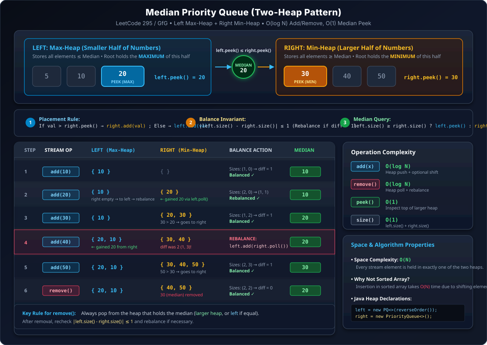

## Q1. Merge K Sorted Lists

Here we have list of list Unlike leetcode question discused in Linked List

**Input:**

```
0 -> 10  20  30  40  50
1 -> 15  19  24
2 -> 5   12  18  77
3 -> 2   92
```

**Output:** `2, 5, 10, 12, 15, 18, 19, 20, 24, 30, 40, 50, 77, 92` — merge all of them.

We make a priority queue of **Pair** class. **Comparable** interface will help us set the comparison to compare pairs.

```java
static class Pair {
    int data;
    int li;   // list index
    int di;   // data index
}
```

```
list ->  0 -> 10, 20, 30, 40, 50
         1 -> 15, 19, 24
         2 -> 5, 12, 18, 77
         3 -> 2, 92
```

We take out the max priority element, i.e. `2`, & put next element of that list.

in pq we store 3 values i.e. data ,then list number and then index of that element in that list

```
pq: (10,0,0)  (15,1,0)  (5,2,0)  (2,3,0)
res = [2]
```

2 is taken out as min element and next element from list 3 is pushed to pq

```
pq: (10,0,0)  (15,1,0)  (5,2,0)  (92,3,1)
res = [2]
```

now 5 is taken out and next element is pushed to pq of list 2

```
pq: (10,0,0)  (15,1,0)  (12,2,1)  (92,3,1)
res = [2,5]
```
Now 10 is taken out and next element is pushed to pq of list 0

```
pq: (20,0,1)  (15,1,0)  (12,2,1)  (92,3,1)
res = [2,5,10]
```

Now 12 is taken out and next element is pushed to pq of list 2

```
pq: (20,0,1)  (15,1,0)  (18,2,2)  (92,3,1)
res = [2,5,10,12]
```

and so on


Now `pq` wants to compare pairs on base of `data`, so let's see how `pq` will compare pairs. We use **Comparable** interface.

```java
static class Pair implements Comparable<Pair> {
    int data;
    int li;
    int di;

    public int compareTo(Pair p) {
        return this.data - p.data;
    }
}
```

It has two Pair objects — ek hai `this` & 2nd is `p` (passed as parameter).

```java
if (return value > 0)  this.data is bigger
if (return value < 0)  this.data is smaller
if (return value == 0) both are equal
```

### Use case

```java
Pair p1 = new Pair(20, 0, 0);
Pair p2 = new Pair(25, 0, 0);
if (p1.compareTo(p2) == 0) {
    // ...
}
```

**Comparable** is an interface. Priority Queue mein hume priority decide karni hoti hai, aur hume jiske liye Priority Queue bnani hai use **Comparable** banane padega.


`compareTo()` is an abstract method in Comparable interface — every class present it to any other fn of any of your choice.

Write Comparable as follows:

```java
static class Pair implements Comparable<Pair> {
    int data;
    int li;
    int di;

    public int compareTo(Pair o) {
        Pair other = (Pair) o;
        return this.data - other.data;
    }
}
```

In compareTo we pass Object `o` & then typecast it to Pair type — else it will give Error.

Priority Queue except Integer ke liye bnao toh Comparable banana yeh usko!! Remember Comparable is an Interface & interface is a Contract of function.


```java
public static class Pair implements Comparable<Pair> {
    int data;
    int li;
    int di;
    public int compareTo(Pair o) {
        return this.data - o.data;
    }
}

public static ArrayList<Integer> mergeKSortedList(ArrayList<ArrayList<Integer>> lists) {
    ArrayList<Integer> rv = new ArrayList<>();
    PriorityQueue<Pair> pq = new PriorityQueue<>();
    for (int li = 0; li < lists.size(); li++) {
        Pair p = new Pair();
        p.data = lists.get(li).get(0);
        p.li = li;
        p.di = 0;
        pq.add(p);
    }

    while (pq.size() > 0) {
        Pair res = pq.poll();
        rv.add(res.data);
        res.di++;
        if (res.di < lists.get(res.li).size()) {
            res.data = lists.get(res.li).get(res.di);
            pq.add(res);
        }
    }
    return rv;
}
```

`poll() = peek() + remove()`.

**Complexity:**
- **Time:** `O((n+k) log k)` — where `n` is the total number of elements across all lists and `k` is the number of lists. Seeding `pq` with the first element of each of the `k` lists is `k log k`. Then, since every one of the remaining `n-k` elements gets pushed and popped exactly once (each `poll()` + `add()` costs `log k` since the PQ never holds more than `k` elements at once), that phase is `(n-k) log k`. Combined: `(n+k) log k`.
- **Space:** `O(k)` — the priority queue never holds more than one pair per list at a time.

---

## Q2. Sort a Nearly-Sorted (K-Sorted) Array

**Practice Question:** GeeksforGeeks — Sort a Nearly Sorted (or K-Sorted) Array / LeetCode

---

### 1. Problem Statement & What "K-Sorted" Means

> An array is called **k-sorted** (or nearly sorted) if every element is at most **$k$ positions away** from its correct position in the final sorted array.

Formally, if an element is at index `i` in the unsorted input array, its target index in the fully sorted array is guaranteed to lie in the range:
$$[\max(0, i - k), \; \min(n - 1, i + k)]$$

```
Target Index in Sorted Array:
   ind - k  <------- -k -------  ind  ------- +k ------->  ind + k
  (left bound)                                           (right bound)
```

**Goal:** Sort this array in the most optimal time possible (better than standard $O(N \log N)$ sorting).

---

### 2. The Core Insight & Why Heap Size is $(K + 1)$, NOT $2K$

#### The Common Confusion:
> *"Since an element can be shifted up to $k$ positions left OR $k$ positions right, its total range of movement is $2k$. So shouldn't the Priority Queue hold $2k$ elements?"*

#### The Aha! Moment:
Think about how we construct the sorted array: **we fill it strictly from left to right (index 0, then index 1, index 2, ...)**.

1. **Who can possibly go to sorted index 0?**
   * The minimum element of the entire array must end up at index `0`.
   * Can the element at index `k + 1` ever belong to index `0`? **No!** Because its distance would be $(k + 1) - 0 = k + 1 > k$, which violates the $k$-sorted property!
   * Therefore, the only candidates that can possibly be the smallest element are in the range:
     $$\text{Indices } [0, 1, 2, \dots, k] \implies \mathbf{k + 1 \text{ elements}}$$
   * Put these first $k + 1$ elements into a **Min-Heap**. The top of the heap is **guaranteed** to be the global minimum!

2. **Who can go to sorted index 1?**
   * We already placed the minimum at index `0`.
   * Now, who are the candidates for index `1`?
   * Any element from index `0` to `k + 1` (at most distance $k$ from 1).
   * All elements up to index `k` are already accounted for (one placed at index 0, the rest still in our Min-Heap).
   * So we only need to bring in **one new candidate: `arr[k + 1]`**!
   * The Min-Heap again holds exactly $k + 1$ elements. The root of this heap is **guaranteed** to be the element for index `1`!

3. **General Rule:**
   * At every step, the heap acts as a **sliding window of size $k + 1$**.
   * We extract the minimum element and place it at the next available index `ind`.
   * We insert the next element from the array into the heap.
   * **Heap size never exceeds $k + 1$!**

```
Array:   [ a,   b,   c,   d,   e,   f,   g,   h ]   with k = 2
Window:  [ a,   b,   c ]                 --> Min goes to arr[0], now slide in 'd'
         [ b',  c',  d ]                 --> Min goes to arr[1], now slide in 'e'
         [ c'', d',  e ]                 --> Min goes to arr[2], now slide in 'f'
         ...
```

---

### 3. Step-by-Step Worked Example (Dry Run)

Let input array be:
$$\text{arr} = [6, 5, 3, 2, 8, 10, 9], \quad k = 3, \quad n = 7$$
*(Desired sorted output: `[2, 3, 5, 6, 8, 9, 10]`)*

Since $k = 3$, our Min-Heap window size is $k + 1 = 4$.

#### Phase 1: Initialize Min-Heap with first $k + 1$ elements (indices 0 to 3)
* Push `arr[0]=6, arr[1]=5, arr[2]=3, arr[3]=2` into `pq`.
* `pq` = `{2, 3, 5, 6}`

#### Phase 2: Slide through remaining elements (i = 4 to 6)

| Step | Current `pq` (Min-Heap) | Action (`poll()` min element) | Placed at | Next Element Added | Updated `pq` |
| :---: | :--- | :--- | :---: | :---: | :--- |
| **1** | `{2, 3, 5, 6}` | `poll() -> 2` | `arr[0] = 2` | `arr[4] = 8` | `{3, 5, 6, 8}` |
| **2** | `{3, 5, 6, 8}` | `poll() -> 3` | `arr[1] = 3` | `arr[5] = 10` | `{5, 6, 8, 10}` |
| **3** | `{5, 6, 8, 10}` | `poll() -> 5` | `arr[2] = 5` | `arr[6] = 9` | `{6, 8, 9, 10}` |

#### Phase 3: Drain remaining elements from heap
The array is exhausted (`i == n`). Now simply poll the remaining $k + 1$ elements one by one:
* `poll() -> 6` $\implies$ placed at `arr[3] = 6`
* `poll() -> 8` $\implies$ placed at `arr[4] = 8`
* `poll() -> 9` $\implies$ placed at `arr[5] = 9`
* `poll() -> 10` $\implies$ placed at `arr[6] = 10`

**Final Array:** `[2, 3, 5, 6, 8, 9, 10]` ✅ (Fully Sorted in-place!)

---

### 4. Implementation

#### Clean Java Code (In-Place Sorting)

```java
import java.util.*;

public class Main {
    public static void sortKSorted(int[] arr, int k) {
        if (arr == null || arr.length == 0 || k <= 0) return;

        // Min-heap to maintain window of size (k + 1)
        PriorityQueue<Integer> pq = new PriorityQueue<>();

        // Step 1: Add first (k + 1) elements to the priority queue
        int initialWindow = Math.min(arr.length, k + 1);
        for (int i = 0; i < initialWindow; i++) {
            pq.add(arr[i]);
        }

        // Step 2: Slide the window over the rest of the array
        int ind = 0;
        for (int i = k + 1; i < arr.length; i++) {
            arr[ind++] = pq.poll(); // Place smallest element in sorted position
            pq.add(arr[i]);         // Add next candidate into the window
        }

        // Step 3: Empty the remaining elements from heap
        while (!pq.isEmpty()) {
            arr[ind++] = pq.poll();
        }
    }

    public static void main(String[] args) {
        int[] arr = {6, 5, 3, 2, 8, 10, 9};
        int k = 3;

        sortKSorted(arr, k);

        System.out.println(Arrays.toString(arr));
        // Output: [2, 3, 5, 6, 8, 9, 10]
    }
}
```

#### C++ Code

```cpp
#include <iostream>
#include <vector>
#include <queue>
#include <algorithm>

using namespace std;

void sortKSorted(vector<int>& arr, int k) {
    int n = arr.size();
    if (n == 0 || k <= 0) return;

    // Min-heap using std::greater
    priority_queue<int, vector<int>, greater<int>> pq;

    int initialWindow = min(n, k + 1);
    for (int i = 0; i < initialWindow; i++) {
        pq.push(arr[i]);
    }

    int ind = 0;
    for (int i = k + 1; i < n; i++) {
        arr[ind++] = pq.top();
        pq.pop();
        pq.push(arr[i]);
    }

    while (!pq.empty()) {
        arr[ind++] = pq.top();
        pq.pop();
    }
}
```

---

### 5. Complexity Analysis

| Metric | Complexity | Why? |
| :--- | :---: | :--- |
| **Time Complexity** | $\mathbf{O(N \log K)}$ | 1. Seeding first $k+1$ elements: $O(K \log K)$<br>2. Processing remaining $N - (K + 1)$ elements with 1 poll + 1 push: $O((N - K) \log K)$<br>3. Draining remaining $K + 1$ elements: $O(K \log K)$<br>**Total:** $O(N \log K)$ |
| **Auxiliary Space** | $\mathbf{O(K)}$ | The priority queue stores at most $\mathbf{K + 1}$ elements at any moment. |

#### Why this is a massive optimization:
* Standard Sorting (QuickSort / MergeSort) takes $O(N \log N)$.
* Here, since the array is $k$-sorted, we achieve **$O(N \log K)$**.
* When $k \ll N$ (for example, $N = 10^6$ and $k = 5$):
  * $N \log_2 N \approx 10^6 \times 20 = 20,000,000$ operations.
  * $N \log_2 K \approx 10^6 \times 3 = 3,000,000$ operations (**~7x faster!**).

---

## Q3. Median Priority Queue

**Practice Question:** GeeksforGeeks — Median Priority Queue / LeetCode 295 — Find Median from Data Stream

---

### 1. Problem Statement

Implement a **Median Priority Queue** data structure that supports the following operations efficiently:
* `add(val)`: Adds an integer `val` to the data structure in $O(\log N)$ time.
* `remove()`: Removes and returns the current median in $O(\log N)$ time.
* `peek()`: Returns the current median in $O(1)$ time without removing it.
* `size()`: Returns the total number of elements in $O(1)$ time.

```
Median Definition:
- If total elements is ODD (2n + 1): Exactly the middle element.
- If total elements is EVEN (2n): By convention, the middle-left element (or average of two middle elements in LeetCode).
```

---

### 2. Architecture: The Two-Heap Pattern



#### Why Naive Approaches Fail:
* **Unsorted Array / ArrayList:** `add()` is $O(1)$, but finding the median requires sorting or QuickSelect ($O(N)$).
* **Sorted Array:** Finding median is $O(1)$, but `add()` takes $O(N)$ due to shifting elements.
* **Single Heap:** Can find Min OR Max in $O(1)$, but cannot access the median efficiently ($O(N)$).

#### The Solution: Two Heaps
We divide the incoming stream of numbers into **two halves**:

```
                  STREAM DIVIDED INTO TWO HALVES
     [ Smaller Half of Numbers ]       [ Larger Half of Numbers ]
      =========================         =========================
             LEFT HEAP                         RIGHT HEAP
             (Max-Heap)                        (Min-Heap)
                 ▲                                 ▲
                 │                                 │
           left.peek()                       right.peek()
       (Largest of Smalls)               (Smallest of Larges)
                 │                                 │
                 └──────────────┬──────────────────┘
                                ▼
                       MEDIAN LIVES HERE!
```

1. **`left` (Max-Heap):** Holds the **smaller half** of elements. Its root (`left.peek()`) is the **maximum** of the smaller half.
2. **`right` (Min-Heap):** Holds the **larger half** of elements. Its root (`right.peek()`) is the **minimum** of the larger half.

---

### 3. The Two Invariants

To guarantee that the median is always accessible in $O(1)$ time, our two heaps must strictly maintain two invariants:

#### Invariant 1: Order Invariant
Every element in `left` must be $\le$ every element in `right`:
$$\mathbf{\text{left.peek}() \le \text{right.peek}()}$$

#### Invariant 2: Size / Balance Invariant
The sizes of the two heaps must never differ by more than 1:
$$\mathbf{|\text{left.size}() - \text{right.size}()| \le 1}$$

---

### 4. Operations Logic

#### A. `add(int val)` Logic:
1. **Placement:**
   * If `right` is non-empty and `val > right.peek()` $\implies$ `right.add(val)`
   * Otherwise $\implies$ `left.add(val)`
2. **Rebalancing:**
   * If `left.size() - right.size() > 1` $\implies$ `right.add(left.poll())`
   * Else if `right.size() - left.size() > 1` $\implies$ `left.add(right.poll())`

#### B. `peek()` Logic:
* If total `size() == 0` $\implies$ Underflow (return `-1`).
* If sizes differ (odd total) $\implies$ return root of the **larger** heap.
* If sizes are equal (even total) $\implies$ return `left.peek()`.
* **Clean unified expression:**
  ```java
  return (left.size() >= right.size()) ? left.peek() : right.peek();
  ```

#### C. `remove()` Logic:
* If total `size() == 0` $\implies$ Underflow (return `-1`).
* The median lives at the top of the larger heap (or `left` if equal sizes):
  ```java
  int median = (left.size() >= right.size()) ? left.poll() : right.poll();
  ```
* *Note:* Since the sizes differed by at most 1, removing an element from the larger heap automatically makes the sizes equal or leaves diff $\le 1$. No rebalancing is needed!

---

### 5. Step-by-Step Worked Dry Run

Let's trace the stream sequence:
`add(10) -> add(20) -> add(30) -> add(40) -> peek() -> add(50) -> peek() -> remove() -> peek()`

| Step | Operation | Placement Rule | `left` (Max-Heap) | `right` (Min-Heap) | Balance Status & Action | Median (`peek()`) |
| :---: | :---: | :--- | :--- | :--- | :--- | :---: |
| **1** | `add(10)` | `right` is empty $\to$ goes to `left` | `{ 10 }` | `{ }` | Sizes: (1, 0), diff = 1 (Balanced ✓) | **10** |
| **2** | `add(20)` | `right` is empty $\to$ lands in `left` first<br>Sizes: (2, 0) $\to$ `diff = 2 > 1` | `{ 20, 10 }` | `{ }` | ⚠️ **REBALANCE:** `right.add(left.poll() -> 20)`<br>`left = { 10 }`, `right = { 20 }` | **10** |
| **3** | `add(30)` | `30 > right.peek(20)` $\to$ goes to `right` | `{ 10 }` | `{ 20, 30 }` | Sizes: (1, 2), diff = 1 (Balanced ✓) | **20** |
| **4** | `add(40)` | `40 > right.peek(20)` $\to$ goes to `right` | `{ 10 }` | `{ 20, 30, 40 }` | Sizes: (1, 3), diff = 2 ⚠️ **REBALANCE!**<br>`left.add(right.poll() -> 20)`<br>`left = { 20, 10 }`, `right = { 30, 40 }` | **20** |
| **5** | `peek()` | Inspect larger heap (equal $\to$ `left`) | `{ 20, 10 }` | `{ 30, 40 }` | Sizes: (2, 2) $\to$ `left.peek()` | **20** |
| **6** | `add(50)` | `50 > right.peek(30)` $\to$ goes to `right` | `{ 20, 10 }` | `{ 30, 40, 50 }` | Sizes: (2, 3), diff = 1 (Balanced ✓) | **30** |
| **7** | `peek()` | Inspect larger heap (`right` has 3 items) | `{ 20, 10 }` | `{ 30, 40, 50 }` | Sizes: (2, 3) $\to$ `right.peek()` | **30** |
| **8** | `remove()`| Pop from larger heap (`right.poll() -> 30`) | `{ 20, 10 }` | `{ 40, 50 }` | Sizes: (2, 2), diff = 0 (Balanced ✓) | Returns **30** |
| **9** | `peek()` | Inspect larger heap (equal $\to$ `left`) | `{ 20, 10 }` | `{ 40, 50 }` | Sizes: (2, 2) $\to$ `left.peek()` | **20** |

---

### 6. Full Clean Implementation

#### Java Code

```java
import java.io.*;
import java.util.*;

public class MedianPriorityQueue {
    PriorityQueue<Integer> left;  // Max-heap for smaller half
    PriorityQueue<Integer> right; // Min-heap for larger half

    public MedianPriorityQueue() {
        left = new PriorityQueue<>(Collections.reverseOrder());
        right = new PriorityQueue<>();
    }

    // O(log N)
    public void add(int val) {
        // Step 1: Decision where to place
        if (right.size() > 0 && val > right.peek()) {
            right.add(val);
        } else {
            left.add(val);
        }

        // Step 2: Maintain balance (|left - right| <= 1)
        if (left.size() - right.size() > 1) {
            right.add(left.poll());
        } else if (right.size() - left.size() > 1) {
            left.add(right.poll());
        }
    }

    // O(log N)
    public int remove() {
        if (this.size() == 0) {
            System.out.println("Underflow");
            return -1;
        }

        // Remove from the larger heap
        if (left.size() >= right.size()) {
            return left.poll();
        } else {
            return right.poll();
        }
    }

    // O(1)
    public int peek() {
        if (this.size() == 0) {
            System.out.println("Underflow");
            return -1;
        }

        // Median is top of the larger heap (or left if equal)
        if (left.size() >= right.size()) {
            return left.peek();
        } else {
            return right.peek();
        }
    }

    // O(1)
    public int size() {
        return left.size() + right.size();
    }

    // Driver code
    public static void main(String[] args) {
        MedianPriorityQueue mpq = new MedianPriorityQueue();
        mpq.add(10);
        mpq.add(20);
        mpq.add(30);
        mpq.add(40);
        System.out.println("Median: " + mpq.peek()); // 20

        mpq.add(50);
        System.out.println("Median: " + mpq.peek()); // 30

        System.out.println("Removed: " + mpq.remove()); // 30
        System.out.println("Median: " + mpq.peek()); // 20
    }
}
```


---

### 7. Complexity Analysis

| Operation | Time Complexity | Space Complexity | Explanation |
| :--- | :---: | :---: | :--- |
| **`add(val)`** | $\mathbf{O(\log N)}$ | $O(1)$ aux | One push ($O(\log N)$) + at most one rebalance shift ($O(\log N)$). |
| **`remove()`** | $\mathbf{O(\log N)}$ | $O(1)$ aux | One poll from the larger heap ($O(\log N)$). |
| **`peek()`** | $\mathbf{O(1)}$ | $O(1)$ aux | Simply queries `left.peek()` or `right.peek()`. No structural change. |
| **`size()`** | $\mathbf{O(1)}$ | $O(1)$ aux | Arithmetic sum of two heap sizes: `left.size() + right.size()`. |
| **Total Space** | — | $\mathbf{O(N)}$ | Every incoming element is stored in exactly one of the two heaps. |


#### Note on LeetCode 295 Variant (Floating-Point Median):
In LeetCode 295, when total elements is even, the median is defined as the mathematical average of the two middle elements:
```java
public double findMedian() {
    if (left.size() == right.size()) {
        return (left.peek() + right.peek()) / 2.0;
    } else {
        return left.peek(); // assuming left is kept as larger
    }
}
```


This is leetcode hard,here we were having negative numbers too ,also a testcase where only 1 element is there and need to find median

```java
class MedianFinder {
    PriorityQueue<Integer> left; // Max-heap for smaller half
    PriorityQueue<Integer> right; // Min-heap for larger half

    public MedianFinder() {
        left = new PriorityQueue<>(Collections.reverseOrder());
        right = new PriorityQueue<>();
    }

    // O(log N)
    public void add(int val) {
        // Step 1: Decision where to place
        if (right.size() > 0 && val > right.peek()) {
            right.add(val);
        } else {
            left.add(val);
        }

        // Step 2: Maintain balance (|left - right| <= 1)
        if (left.size() - right.size() > 1) {
            right.add(left.poll());
        } else if (right.size() - left.size() > 1) {
            left.add(right.poll());
        }
    }

    public void addNum(int num) {
        add(num);
    }

    public double findMedian() {
        if (left.size() == right.size()) {
            // Even number of elements: average of both roots
            return (left.peek() + right.peek()) / 2.0;
        } else if (left.size() > right.size()) {
            return (double) left.peek();
        } else {
            return (double) right.peek();
        }
    }
}

/**
 * Your MedianFinder object will be instantiated and called as such:
 * MedianFinder obj = new MedianFinder();
 * obj.addNum(num);
 * double param_2 = obj.findMedian();
 */
```