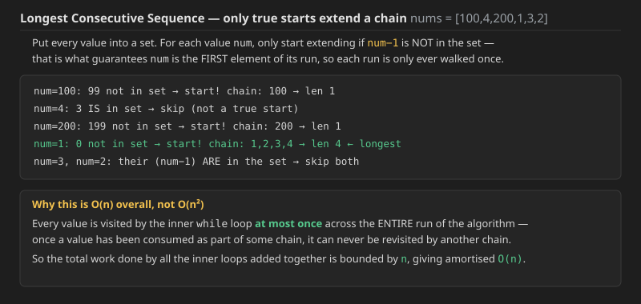
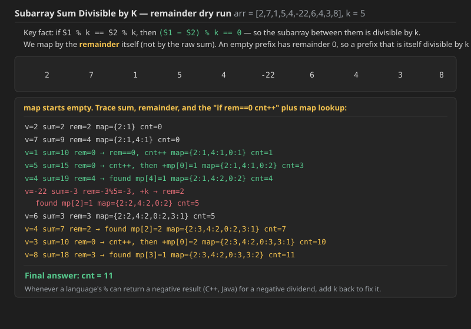
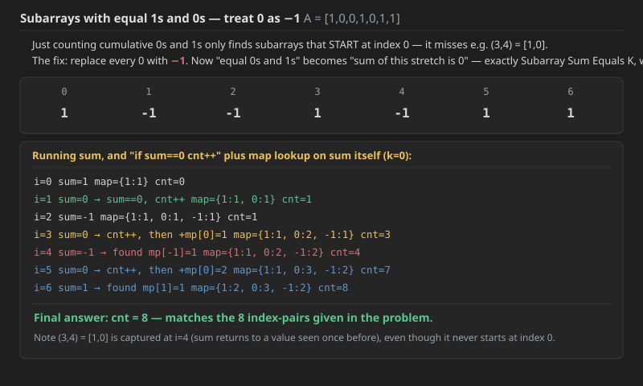
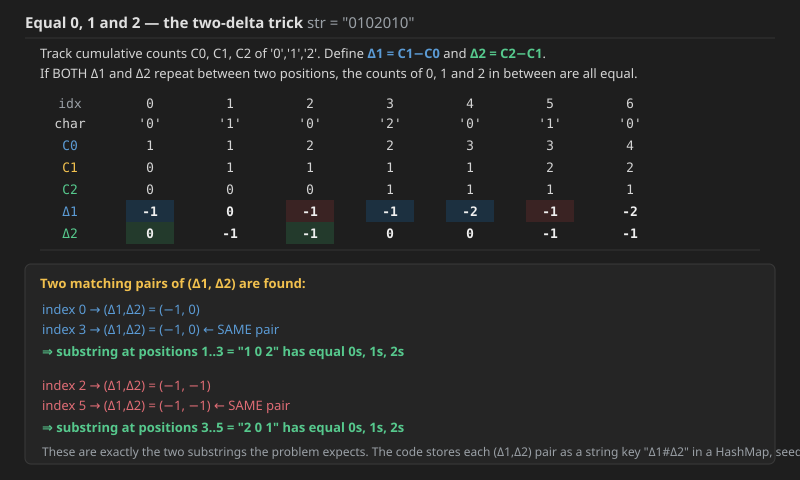
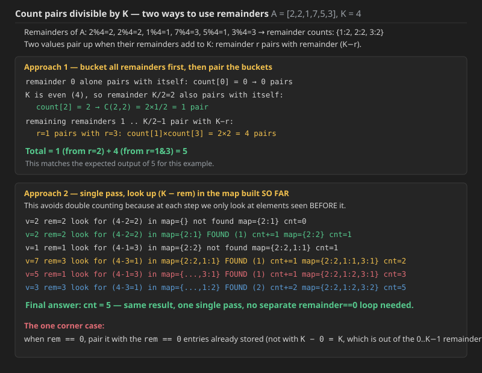

## Q1. Longest Consecutive Sequence (LeetCode 128)


Given an unsorted array of integers `nums`, return *the length of the longest consecutive elements sequence*.

You must write an algorithm that runs in `O(n)` time.

### Examples

```text
Input:  nums = [100,4,200,1,3,2]
Output: 4
Explanation: The longest consecutive elements sequence is [1, 2, 3, 4]. Therefore its length is 4.

Input:  nums = [0,3,7,2,5,8,4,6,0,1]
Output: 9
```

### Constraints

* `0 <= nums.length <= 10^5`
* `-10^9 <= nums[i] <= 10^9`

### Approach — HashMap first, then simplify to a Set

A first correct `O(n)` attempt uses a **HashMap**, but the values stored in it are never actually read — only the keys matter:

```cpp
class Solution {
public:
    int longestConsecutive(vector<int>& nums) {
        unordered_map<int,int> mp;
        for (auto num : nums) {
            mp[num] = 0;
        }
        int res = 0;
        for (auto num : nums) {
            int len = 0;
            if (mp.find(num - 1) == mp.end()) {   // if (num-1) is not in the map, this cannot
                                                    // be a continuation of an earlier sequence,
                                                    // so num is a genuine START
                while (mp.find(num) != mp.end()) { // walk forward, extending the sequence
                    len++;
                    num = num + 1;
                }
            }
            res = max(res, len);
        }
        return res;
    }
};
```

Since the map's values are unused, this is more naturally written with a **Set** instead — dropping the wasted value storage entirely. `unordered_set`'s `find` and `unordered_map`'s `find` behave identically in C++; the only difference in Java is that `Set` uses `.contains()` while `Map` uses `.containsKey()`.

**Java** (was missing; same logic as the C++ above)

```java
class Solution {
    public int longestConsecutive(int[] nums) {
        Set<Integer> set = new HashSet<>();
        for (var num : nums) {
            set.add(num);
        }
        int res = 0;
        for (var num : nums) {
            int len = 0;
            if (set.contains(num - 1) == false) {
                while (set.contains(num) == true) {
                    len++;
                    num++;
                }
            }
            res = Math.max(res, len);
        }
        return res;
    }
}
```

**C++** (was missing; same logic as the Java above)

```cpp
class Solution {
public:
    int longestConsecutive(vector<int>& nums) {
        unordered_set<int> set;
        for (auto num : nums) {
            set.insert(num);
        }
        int res = 0;
        for (auto num : nums) {
            int len = 0;
            if (set.find(num - 1) == set.end()) {
                while (set.find(num) != set.end()) {
                    len++;
                    num++;
                }
            }
            res = max(res, len);
        }
        return res;
    }
};
```

This Set-based version is exactly the same algorithm the "Better" section below implements — the dry run and complexity discussion applies to both.

### Dry run



For `nums = [100, 4, 200, 1, 3, 2]`, only `100`, `200` and `1` pass the "is this a true start?" check (`num - 1` not present). Starting the inner walk from `1` produces the chain `1, 2, 3, 4`, giving the answer `4`.

**Complexity (Q1 — Longest Consecutive Sequence):**

* **Brute force (the `linearSearch` version further below in this file) — Time `O(n^3)`, Space `O(1)`.** For every element the code repeatedly asks "is `x+1` present?" via a full linear scan (`O(n)` per check). On an input that is already one long ascending run (e.g. `1,2,...,n`), *every* starting point triggers a chain of length close to `n`, and each step of that chain costs another `O(n)` scan — that is `O(n)` chain-steps × `O(n)` per step = `O(n^2)` for a single starting index, repeated for up to `n` starting indices, giving `O(n^3)` overall.
* **HashMap / Set version — Time `O(n)`, Space `O(n)`.** Building the set is `O(n)`. The key insight is the `if (set.contains(num-1) == false)` guard: it fires the inner `while` **only when `num` is the first element of its run**. Every value in the array can be the *first* element of at most one run, and once a value has been consumed by some run's inner `while`, it is never revisited by any other run's `while` — so, summed across the entire outer loop, the total number of inner-loop steps is bounded by `n`. That is what makes the whole thing amortised `O(n)`, even though there are two nested loops in the code. Space is `O(n)` for the set holding every distinct value.
* **Why a `set` beats a `map` here in practice.** Both give the same asymptotic complexity, but the map wastes `O(n)` extra memory storing values that are never read — the set is the same algorithm with the unnecessary bookkeeping removed.


We do not need any *value* in the map at all — only whether a key exists. So the map above simplifies to a plain `Set` (`unordered_set` in C++, `HashSet` in Java), which is exactly the "Better" C++/Java code already given below.


## Q2. Subarray Sum Equals K (LeetCode 560)

**Difficulty:** Medium

Given an array of integers `nums` and an integer `k`, return *the total number of subarrays whose sum equals to* `k`.

A subarray is a contiguous **non-empty** sequence of elements within an array.

### Examples

```text
Input:  nums = [1,1,1], k = 2
Output: 2

Input:  nums = [1,2,3], k = 3
Output: 2
```

### Constraints

* `1 <= nums.length <= 2 * 10^4`
* `-1000 <= nums[i] <= 1000`
* `-10^7 <= k <= 10^7`

### Why a HashMap, and not a two-pointer window, and not a Priority Queue

A **subarray must be contiguous**, and finding "does an earlier prefix sum equal a target value" has nothing to do with keeping values in sorted order — so there is no reason to reach for a data structure like a Priority Queue that maintains an order. A plain HashMap (or unordered_map) is enough, because all we ever ask it is "have I seen this exact value before, and how many times?" — a `O(1)` average lookup, regardless of insertion order.

### The idea

Keep a running prefix `sum`. For the current `sum`, a subarray ending here has sum `k` exactly when some **earlier** prefix sum equals `sum − k` — because subtracting that earlier prefix from the current one leaves precisely the elements in between, whose total is `k`.

```text
prefix up to some earlier index:  x
prefix up to current index:       Sum
the piece in between:             Sum − x

we want that piece to equal k, i.e.  Sum − x = k   →   x = Sum − k
```

So at every index we check the map for the key `sum − k`.


### Why we add `mp[sum − k]` — a count — rather than just checking presence

If an earlier prefix value `x` occurs **more than once**, each occurrence produces a **different** subarray of sum `k` ending at the current index — because the earlier prefix piece being subtracted off is different each time, even though its value is the same. A plain "does this key exist?" check can only ever add `1`, silently under-counting whenever a prefix value repeats. That is exactly why the code does `cnt += mp[sum-k]` — the map's stored value is a **frequency**, not a yes/no flag. This same idea — count the frequency of "running value − target", not merely check for it — reappears in nearly every question further below in this file, so it is worth internalising once here.


```cpp

#include <bits/stdc++.h>
using namespace std;

class Solution{
public:
    int subarraySum(vector<int> &nums, int k){
        unordered_map<int,int> mp;
        int sum=0;
        int cnt=0;
        for(int n:nums){
            sum+=n;
            if(sum==k) cnt++;
            if(mp.find(sum-k)!=mp.end()) cnt+=mp[sum-k];
            mp[sum]++;
        }
        return cnt;
    }
};
```


**Java** (was missing; same logic as the C++ above)

```java
import java.util.*;

class Solution {
    public int subarraySum(int[] nums, int k) {
        Map<Integer, Integer> mp = new HashMap<>();
        int sum = 0;
        int cnt = 0;
        for (int n : nums) {
            sum += n;
            if (sum == k) cnt++;
            if (mp.containsKey(sum - k) == true) cnt += mp.get(sum - k);
            mp.put(sum, mp.getOrDefault(sum, 0) + 1);
        }
        return cnt;
    }
}
```

**Complexity (Q2 — Subarray Sum Equals K):**

* **Time — `O(n)`.** A single pass over the array. At every index we do one map lookup and one map insert, both `O(1)` on average for a hash map.
* **Space — `O(n)`.** The map can hold up to `n` distinct prefix-sum values, one per index in the worst case (e.g. a strictly increasing array).
* **Why a HashMap works here even though it does not preserve order.** The condition we actually need — "does some earlier prefix sum equal `sum − k`?" — never depends on *where* that earlier prefix occurred or in what order the map was built, only on *whether it occurred at all, and how many times*. A subarray is still, by definition, contiguous; the map is simply a fast lookup table over positions already walked in order, not a substitute for that order.

## Q3. Sub-Array Sum Divisible by K


You are given an array A of N positive and/or negative integers and a value K. The task is to find the count of all sub-arrays whose sum is divisible by K.

### Examples

```text
Input:  N = 6, K = 5, arr[] = {4, 5, 0, -2, -3, 1}
Output: 7
Explanation: There are 7 sub-arrays whose sum is divisible by K:
{4, 5, 0, -2, -3, 1}, {5}, {5, 0}, {5, 0, -2, -3}, {0}, {0, -2, -3} and {-2, -3}

Input:  N = 6, K = 2, arr[] = {2, 2, 2, 2, 2, 2}
Output: 21
Explanation: All subarray sums are divisible by 2.
```

### Constraints

- 2 <= N <= 10^5

Expected Time Complexity: O(N+K)
Expected Auxiliary Space: O(K)

### The key identity

If Sum % K == x, then any earlier prefix that also has remainder x marks the start of a subarray whose sum is divisible by K:

```text
S1 % K = k
(S1 - S2) % K = 0     (always true whenever S1 and S2 leave the same remainder)
S2 % K = k
```

So this time we map by remainder, not by the raw prefix sum.

### First attempt - buggy: mapping by the raw sum

A first attempt tries to reuse the Subarray-Sum-Equals-K trick directly, storing the actual prefix sum as the key and looking up sum minus rem:

```java
class Solution
{
    long subCount(long arr[] ,int n,long k)
    {
     long sum=0;
     long cnt=0;
     Map<Long,Integer>mp=new HashMap<>();
     for(var v:arr){
         sum+=v;
         long rem=sum%k;
         if(rem==0) cnt++;
         if(mp.containsKey(sum-rem)==true){
             cnt+=mp.get(sum-rem);
         }
         mp.put(sum,mp.getOrDefault(sum,0)+1);
     }
     return cnt;
    }
}
```

This is wrong. mp.put(sum, ...) stores the map keyed by the actual prefix sum, but sum-rem is just "sum rounded down to the nearest multiple of K" - it happens to be a specific value, not "any prefix that shares this remainder". Checking for that one exact value only works by coincidence; it is not the same thing as asking "has any earlier prefix left the same remainder as this one?" The fix is to key the map by the remainder itself, not by sum or sum-rem.

### The correct approach - map by remainder

```text
arr = 2  7  1  5  4  -22  6  4  3  8      k = 5

at 2:   2%5=2                             map: {2:1}
at 7:   sum=9,  9%5=4                     map: {2:1, 4:1}
at 1:   sum=10, 10%5=0  -> this itself is divisible by 5, cnt++ ho jaega
at 5:   sum=15, 15%5=0  -> we already have a 0 in the map, so cnt += mp[0]
```

Also note: whenever a prior remainder of 0 exists in the map, that also represents the empty prefix - before any element is chosen, the running sum is 0, which is trivially divisible by K. So the map needs a 0 seeded in it before the loop starts (or, equivalently, an explicit "if (rem == 0) cnt++" check inside the loop for the current prefix itself - both approaches give the same answer; the final code below uses the explicit check).

### Handling negative sums

The percent operator in Java and C++ can return a negative remainder when the dividend is negative (e.g. -22 % 5 gives -2 in both languages, not the mathematically expected 3). Whenever rem < 0, add k back to bring it into the range [0, k-1].

### Dry run



Walking arr = [2, 7, 1, 5, 4, -22, 6, 4, 3, 8] with k = 5 all the way through gives a final count of 11.

### The final, correct Java code

```java
class Solution
{
    long subCount(long arr[] ,int n,long k)
    {
     long sum=0;
     long cnt=0;
     Map<Long,Integer>mp=new HashMap<>();
     for(var v:arr){
         sum+=v;
         long rem=sum%k;
         if(rem<0) rem+=k;
         if(rem==0) cnt++;
         if(mp.containsKey(rem)==true){
             cnt+=mp.get(rem);
         }
         mp.put(rem,mp.getOrDefault(rem,0)+1);
     }
     return cnt;
    }
}
```

(In Java, a Long literal can be written directly as 0L, 1L, 2L, 3L and so on, if you ever need to construct one explicitly.)

Note this code does not pre-seed the map with {0: 1} - instead it separately checks "if (rem == 0) cnt++" for the current prefix. Both are equivalent ways of accounting for the empty-prefix case.

The actual GFG submission (with the driver signature, using long long throughout since sums here can be large):

```cpp
class Solution{
    public:
    long long subCount(long long arr[], int N, long long k)
    {
     long long sum=0;
     long long cnt=0;
     unordered_map<long long,int>mp;
     for(int i=0;i<N;i++){
         long long v=arr[i];
         sum+=v;
         long long rem=sum%k;
         if(rem<0) rem+=k;
         if(rem==0) cnt++;
         if(mp.find(rem)!=mp.end()){
             cnt+=mp[rem];
         }
         mp[rem]++;
     }
     return cnt;
    }
};
```

**Complexity (Q3 - Sub-Array Sum Divisible by K):**

- **Time - O(N).** One pass, O(1) average map operations per element.
- **Space - O(K).** There are only K possible remainders (0 through K-1), so the map never holds more than K distinct keys - this is exactly the O(K) auxiliary space the problem statement expects.
- **Why the buggy first attempt was O(N) time too, yet still wrong.** Complexity and correctness are separate questions - the buggy version does the same amount of work per element, it just asks the map the wrong question (an exact-sum match) instead of the right one (a shared-remainder match).

---

### The same problem, restated: Subarray Sums Divisible by K (LeetCode 974)


Given an integer array nums and an integer k, return the number of non-empty subarrays that have a sum divisible by k.

A subarray is a contiguous part of an array.

This is the same question as above, restated on LeetCode with int sums instead of long long (LeetCode's constraints keep the sums small enough that int is safe).

```cpp
class Solution {
public:
    int subarraysDivByK(vector<int>& nums, int k) {
        int sum=0;
        int cnt=0;
        unordered_map<int,int>mp;
        for(auto v:nums){
            sum+=v;
            int rem=sum%k;
            if(rem<0) rem+=k;
            if(rem==0) cnt++;
            if(mp.find(rem)!=mp.end()){
                cnt+=mp[rem];
            }
            mp[rem]++;
        }
        return cnt;
    }
};
```

Java (was missing; same logic as the C++ above)

```java
class Solution {
    public int subarraysDivByK(int[] nums, int k) {
        int sum = 0;
        int cnt = 0;
        Map<Integer, Integer> mp = new HashMap<>();
        for (int v : nums) {
            sum += v;
            int rem = sum % k;
            if (rem < 0) rem += k;
            if (rem == 0) cnt++;
            if (mp.containsKey(rem)) {
                cnt += mp.get(rem);
            }
            mp.put(rem, mp.getOrDefault(rem, 0) + 1);
        }
        return cnt;
    }
}
```

Complexity: identical to Q3 above - Time O(N), Space O(K) - for exactly the same reasons.

### An equivalent style - seed the map with {0 : 1} instead of a separate check

This is functionally identical to the version above; it pre-loads the empty-prefix case into the map rather than special-casing it:

```java
class Solution {
    public int subarraysDivByK(int[] nums, int k) {
        int res = 0;

        HashMap<Integer, Integer> map = new HashMap<>();
        int sum = 0;
        map.put(sum, 1);

        for(int val: nums){
            sum += val;
            int rem = sum % k;
            if(rem < 0){
                rem += k;
            }

            res += map.getOrDefault(rem, 0);
            map.put(rem, map.getOrDefault(rem, 0) + 1);
        }

        return res;
    }
}
```

C++ (was missing; same logic as the Java above)

```cpp
class Solution {
public:
    int subarraysDivByK(vector<int>& nums, int k) {
        int res = 0;

        unordered_map<int, int> mp;
        int sum = 0;
        mp[sum] = 1;

        for (int val : nums) {
            sum += val;
            int rem = sum % k;
            if (rem < 0) {
                rem += k;
            }

            res += mp.count(rem) ? mp[rem] : 0;
            mp[rem]++;
        }

        return res;
    }
};
```

---

## Q4. Subarrays with Equal 1s and 0s


Given an array containing 0s and 1s. Find the number of subarrays having equal number of 0s and 1s.

### Examples

```text
Input:  n = 7, A[] = {1,0,0,1,0,1,1}
Output: 8
Explanation: The index range for the 8 sub-arrays are:
(0, 1), (2, 3), (0, 3), (3, 4), (4, 5), (2, 5), (0, 5), (1, 6)

Input:  n = 5, A[] = {1,1,1,1,0}
Output: 1
Explanation: The index range for the subarray is (3,4).
```

### Constraints

- 1 <= n <= 10^6
- 0 <= A[i] <= 1

Expected Time Complexity: O(n)
Expected Auxiliary Space: O(n)

 .jpg>) 
.jpg>) .jpg>)

### Why simple cumulative counting is not enough

Tracking just the running count of 0s and 1s from the start only ever tells you about subarrays that begin at index 0. Take A[] = {1,0,0,1,0,1,1}: the cumulative counts after each index do correctly flag (0,1), (0,3) and (0,5) as balanced - but a subarray like (3,4) = [1,0], which does NOT start at index 0, is invisible to that method. There is no direct way to "detect" it from cumulative counts alone.

### The fix - treat every 0 as -1



Replace every 0 with -1. Now "equal number of 0s and 1s in a subarray" becomes exactly "the sum of that subarray is 0" - which is Subarray Sum Equals K, with k = 0. The very same prefix-sum-plus-HashMap trick from Q2 applies unchanged: whenever the running sum repeats a value seen before (including the very first time it returns to 0, which also needs an explicit check since the map itself starts empty), a balanced subarray has been found.

For A[] = {1,0,0,1,0,1,1}, walking prefix sums of the transformed array [1,-1,-1,1,-1,1,1] gives a final count of 8 - matching all eight index ranges listed above.

### Java code

```java
class Solution
{
    //Function to count subarrays with 1s and 0s.
    static int countSubarrWithEqualZeroAndOne(int arr[], int n)
    {
        int sum=0;
        int cnt=0;
        Map<Integer,Integer>mp=new HashMap<>();
        for(int i=0;i<n;i++){
            int num=arr[i];
            sum+=(num==0)?-1:1;
            if(sum==0) cnt++;
            if(mp.containsKey(sum)==true){
                cnt+=mp.get(sum);
            }
            mp.put(sum,mp.getOrDefault(sum,0)+1);
        }
        return cnt;
    }
}
```

### C++ code

```cpp
class Solution{
  public:
    //Function to count subarrays with 1s and 0s.
    long long int countSubarrWithEqualZeroAndOne(int arr[], int n)
    {
        long long sum=0;
        long long int cnt=0;
        unordered_map<long long,int>mp;
        for(int i=0;i<n;i++){
            int num=arr[i];
            sum+=(num==0)?-1:1;
            if(sum==0) cnt++;
            if(mp.find(sum)!=mp.end()){
                cnt+=mp[sum];
            }
            mp[sum]++;
        }
        return cnt;
    }
};
```

**Complexity (Q4 - Subarrays with Equal 1s and 0s):**

- **Time - O(n).** One pass; the 0-to-(-1) transform is a constant-time decision made inline, and the map lookup/insert stays O(1) average.
- **Space - O(n).** The running sum after transforming can range from -n to +n, so the map can hold up to O(n) distinct sum values.
- **Why the transform is valid.** "Equal count of 0s and 1s" is exactly "sum of +1s and -1s cancels to zero" once every 0 contributes -1 instead of 0. This turns an equal-counting problem into the already-solved Subarray-Sum-Equals-K problem with k=0, so no new algorithmic idea is needed - only the input transform.

---

## Q5. Equal 0, 1 and 2


Given a string str of length N which consists of only 0, 1 or 2s, count the number of substring which have equal number of 0s, 1s and 2s.

### Examples

```text
Input:  str = "0102010"
Output: 2
Explanation: Substring str[2, 4] = "102" and substring str[4, 6] = "201" has equal number of 0, 1 and 2

Input:  str = "11100022"
Output: 0
Explanation: There is no substring with equal number of 0, 1 and 2.
```

### Constraints

- 1 <= N <= 10^5

Expected Time Complexity: O(N)
Expected Auxiliary Space: O(N)

This is the same underlying idea as Q3, extended to three symbols instead of two.

### The two-delta trick



Track the cumulative counts C0, C1, C2 of the characters '0', '1', '2' seen so far, and define two derived quantities:

```text
delta1 = C1 - C0
delta2 = C2 - C1
```

If delta1 repeats between two positions, the count of 0s equals the count of 1s in the substring between them. If delta2 repeats, the count of 1s equals the count of 2s in between. When BOTH deltas repeat together at two positions, all three characters are equal in count in the substring between those positions.

For str = "0102010" the table of C0, C1, C2, delta1, delta2 across indices 0-6 shows two repeated (delta1, delta2) pairs:

- (delta1, delta2) = (-1, 0) at index 0 and again at index 3, giving substring positions 1..3 = "102"
- (delta1, delta2) = (-1, -1) at index 2 and again at index 5, giving substring positions 3..5 = "201"

Exactly the two substrings the problem expects.

 .jpg>) .jpg>) .jpg>)
### C++ code

```cpp
class Solution{
    public:
    long long getSubstringWithEqual012(string str) {

        int c0=0,c1=0,c2=0;
        long long ans=0;
        unordered_map<string,int>mp;
        string key=to_string(c1-c0)+"#"+to_string(c2-c1);
        mp[key]=1;
        for(int i=0;i<str.length();i++){
            if(str[i]=='0'){
                c0++;
            }
            else if(str[i]=='1'){
                c1++;
            }
            else {
                c2++;
            }
            string newKey=to_string(c1-c0)+"#"+to_string(c2-c1);
            if(mp.find(newKey)!=mp.end())
            {
                //cout<<ans<<" key "<<newKey<<" mp "<<mp[newKey]<<endl;
                ans+=mp[newKey];
            }
            mp[newKey]++;
        }
        return ans;
    }
};
```

### Java code

```java
class Solution
{
    long getSubstringWithEqual012(String str)
    {
        int c0=0,c1=0,c2=0;
        long ans=0;
        Map<String,Integer>mp=new HashMap<>();
        String key=(c1-c0)+"#"+(c2-c1);
        mp.put(key,1);
        for(int i=0;i<str.length();i++){
            char ch=str.charAt(i);
            if(ch=='0'){
                c0++;
            }
            else if(ch=='1'){
                c1++;
            }
            else {
                c2++;
            }
            String newKey=(c1-c0)+"#"+(c2-c1);
            if(mp.containsKey(newKey)==true)
                ans+=mp.get(newKey);
            mp.put(newKey,mp.getOrDefault(newKey,0)+1);
        }
        return ans;
    }
}
```

The key is built as the pair (delta1, delta2) glued together with a "#" separator so it can be used as a single HashMap key. In C++, `to_string()` must be used to convert each integer delta before concatenating it into the key string; in Java, a `String + int` expression converts the number automatically, so no explicit conversion call is needed - that is the one real difference between the two languages here.

**Complexity (Q5 - Equal 0, 1 and 2):**

- **Time - O(N).** One pass building a fresh key string at each index. Building the key itself costs O(log(N)) per character (proportional to the number of digits in the two deltas), which is usually treated as O(1) in practice for this constraint size, giving an overall O(N) solution as expected.
- **Space - O(N).** Up to N distinct (delta1, delta2) key strings can appear in the map.
- **Why a string key instead of two integer maps, or a map-of-maps.** Encoding the pair as a single string is the simplest way to use a plain HashMap for a 2-dimensional key in both languages without introducing a nested data structure or a custom hash function for a pair type.

---

## Q6. Count Pairs in Array Divisible by K

**Difficulty:** Medium - Accuracy: 40.47% - Submissions: 20K+ - Points: 4

Given an array A[] and positive integer K, the task is to count total number of pairs in the array whose sum is divisible by K.

### Examples

```text
Input:  A[] = {2, 2, 1, 7, 5, 3}, K = 4
Output: 5
Explanation: There are five pairs possible whose sum is divisible by '4' i.e., (2, 2), (1, 7), (7, 5), (1, 3) and (5, 3)

Input:  A[] = {5, 9, 36, 74, 52, 31, 42}, K = 3
Output: 7
Explanation: There are seven pairs whose sum is divisible by 3, i.e, (9, 36), (9,42), (74, 52), (36, 42), (74, 31), (31, 5) and (5, 52).
```

### Constraints

- 1 <= N <= 10^6
- 1 <= A[i] <= 10^6
- 1 <= K <= 100

Expected Time Complexity: O(n)
Expected Auxiliary Space: O(k)

### Brute force

Checking every pair directly costs O(n^2) time and O(1) space.

### The remainder-pairing idea

Two values sum to a multiple of K exactly when their remainders (mod K) add up to K (or to 0). So first store the frequency of every remainder in a map, then pair up the remainder buckets:

```text
if remainder r pairs with remainder (K - r), then k % k = 0

remainder 0 can only pair with ANOTHER remainder-0 element -> choose 2 from count[0]
if K is even, remainder K/2 can only pair with ANOTHER remainder-(K/2) element -> choose 2 from count[K/2]
every other remainder r (1 <= r < K/2) pairs with remainder (K - r): count[r] * count[K-r]
```

### Dry run



For A[] = {2, 2, 1, 7, 5, 3}, K = 4: remainders are {2, 2, 1, 3, 1, 3}, so count[1]=2, count[2]=2, count[3]=2.

- remainder 0: count[0] = 0 -> 0 pairs
- K is even, remainder K/2 = 2: count[2] = 2 -> C(2,2) = 1 pair
- remainder 1 pairs with remainder 3: count[1] * count[3] = 2 * 2 = 4 pairs

Total = 1 + 4 = 5, matching the expected output.

 .jpg>) .jpg>) .jpg>) .jpg>)
 
### Approach 1 - bucket every remainder first, then pair the buckets

Java code

```java
class Solution
{
    public static long countKdivPairs(int arr[], int n, int k)
    {
        Map<Integer,Integer>mp=new HashMap<>();
        for(int val:arr){
            int rem=val%k;
            if(rem<0) rem+=k;
            mp.put(rem,mp.getOrDefault(rem,0)+1);
        }
        long res=0;
        int v0=(mp.getOrDefault(0,0));
        res+=(v0*(v0-1)/2);
        if(k%2==0){
            v0=(mp.getOrDefault(k/2,0));
            res+=(v0*(v0-1)/2);
        }
        int left=1;
        int right=k-1;
        while(left<right){
            res+=(mp.getOrDefault(left,0)*mp.getOrDefault(right,0));
            left++;
            right--;
        }
        return res;
    }
}
```

`v0*(v0-1)/2` is simply nC2 - the number of ways to choose 2 elements out of v0 elements that all share the same remainder, to form a pair.

C++ code

```cpp
class Solution
{
    public:
    long long countKdivPairs(int arr[], int n, int k)
    {
        unordered_map<int,int>mp;
        for(int i=0;i<n;i++){
            int val=arr[i];
            int rem=val%k;
            if(rem<0) rem+=k;
            mp[rem]++;
        }
        long res=0;
        int v0=mp[0];
        res+=(v0*(v0-1)/2);
        if(k%2==0){
            v0=mp[k/2];
            res+=(v0*(v0-1)/2);
        }
        int left=1;
        int right=k-1;
        while(left<right){
            res+=(mp[left]*mp[right]);
            left++;
            right--;
        }
        return res;
    }
};
```

**Complexity (Q6, Approach 1):**

- **Time - O(n + k).** One O(n) pass to build the remainder frequency map, then an O(k) sweep pairing up the buckets from both ends toward the middle.
- **Space - O(k).** The map holds at most k distinct remainder keys (0 through k-1) - exactly the O(k) auxiliary space the problem expects.

### Approach 2 - a single pass, looking up (K - remainder) in the map built so far

Another similar approach that works for pair-type questions in general: instead of bucketing everything first and then pairing buckets, process one element at a time and only look at elements seen BEFORE the current one. This naturally avoids double-counting and needs only one pass, with a single corner case to handle.

Dry run for A[] = {2, 2, 1, 7, 5, 3}, K = 4 (same array as above):

```text
v=2  rem=2  look for (4-2=2) in map={}          not found          map={2:1}         cnt=0
v=2  rem=2  look for (4-2=2) in map={2:1}       FOUND (1)  cnt+=1  map={2:2}         cnt=1
v=1  rem=1  look for (4-1=3) in map={2:2}       not found          map={2:2,1:1}     cnt=1
v=7  rem=3  look for (4-3=1) in map={2:2,1:1}   FOUND (1)  cnt+=1  map={2:2,1:1,3:1} cnt=2
v=5  rem=1  look for (4-1=3) in map={...,3:1}   FOUND (1)  cnt+=1  map={2:2,1:2,3:1} cnt=3
v=3  rem=3  look for (4-3=1) in map={...,1:2}   FOUND (2)  cnt+=2  map={2:2,1:2,3:2} cnt=5
```

Final answer: cnt = 5, matching approach 1 exactly.

**The one corner case:** when rem == 0, pairing it with (K - 0) = K would look outside the valid remainder range (0..K-1) - there is no bucket "K". So when rem == 0, pair it with the rem == 0 entries already stored instead:

```cpp
class Solution
{
    public:
    long long countKdivPairs(int A[], int n, int K)
    {
        long long cnt=0;
        //code here
        unordered_map<int,int>mp;
        for(int i=0;i<n;i++){
            int rem=A[i]%K;
            if(rem<0) rem+=K;
            if(rem==0){
             cnt+=mp[0];
            }
            else if(mp.find(K-rem)!=mp.end()) cnt+=mp[K-rem];
            mp[rem]++;
        }
        return cnt;
    }
};
```

Java (was missing; same logic as the C++ above)

```java
class Solution
{
    public static long countKdivPairs(int A[], int n, int K)
    {
        long cnt=0;
        Map<Integer,Integer>mp=new HashMap<>();
        for(int i=0;i<n;i++){
            int rem=A[i]%K;
            if(rem<0) rem+=K;
            if(rem==0){
                cnt+=mp.getOrDefault(0,0);
            }
            else if(mp.containsKey(K-rem)) cnt+=mp.get(K-rem);
            mp.put(rem,mp.getOrDefault(rem,0)+1);
        }
        return cnt;
    }
}
```

**Complexity (Q6, Approach 2):**

- **Time - O(n).** A single pass, O(1) average map lookup and insert per element - even tighter than Approach 1's O(n+k), since there is no separate O(k) bucket-pairing sweep at the end.
- **Space - O(k).** Same bound as Approach 1: at most k distinct remainders can ever be keys in the map.
- **Approach 1 vs Approach 2.** Both are correct and both run in essentially the same asymptotic time; Approach 2 is the more general pattern to reach for first when a problem is phrased as "count pairs matching some condition", since it generalises immediately to a single forward pass without needing to reason separately about edge buckets like remainder 0 or remainder K/2 - the rem==0 check here plays exactly the role that the special-cased C(count[0],2) and C(count[K/2],2) terms played in Approach 1.


## Q7. Subarray sum xor K

```cpp

#include <bits/stdc++.h>
using namespace std;

class Solution{
public:
    int subarraysWithXorK(vector<int> &nums, int k) {
        int xorK=0;
        int cnt=0;
        unordered_map<int,int>mp;
        for(int n:nums){
            xorK=xorK^n;
            if(xorK==k) cnt++;
            if(mp.find(xorK^k)!=mp.end()) cnt+=mp[xorK^k];
            mp[xorK]++;
        }
        return cnt;
    }
};

/* 
 we know if a^b=c then can write a^c=b or b^c=a
 
 we have calculated xorK and suppose some value prev be a 

 so after a till xorK value be b

 so a^b=xorK

 Now b is our subarray's xor value let it be k so b we want to find 

 so a^k= xorK

 or can say xorK^k =a 

 so if we find out a then there be subarray that has value k from a to xorK

*/
```

**Java** (was missing; same logic as the C++ above)

```java
import java.util.*;

class Solution {
    public int subarraysWithXorK(int[] nums, int k) {
        int xorK = 0;
        int cnt = 0;
        Map<Integer, Integer> mp = new HashMap<>();
        for (int n : nums) {
            xorK = xorK ^ n;
            if (xorK == k) cnt++;
            if (mp.containsKey(xorK ^ k)) cnt += mp.get(xorK ^ k);
            mp.put(xorK, mp.getOrDefault(xorK, 0) + 1);
        }
        return cnt;
    }
}
```

**Complexity (Subarray Sum XOR K):**

- **Time — `O(n)`.** One pass; XOR and map lookups/inserts are all `O(1)`.
- **Space — `O(n)`.** Up to `n` distinct running-XOR values can appear as keys.
- **Why this is exactly the same shape as Subarray Sum Equals K.** XOR is its own inverse (`a ^ a = 0`), which plays the same role addition's inverse (subtraction) plays for prefix sums: if `xorK ^ k = a` was seen before, then the elements strictly after that point up to the current index XOR together to exactly `k` — the comment already in this file above works through this identity in full.


## Q8. **Longest Subarray with Sum K**


**Problem Statement:**
Given an array `arr[]` containing integers and an integer `k`, your task is to find the length of the longest subarray where the sum of its elements is equal to the given value `k`. If there is no subarray with a sum equal to `k`, return `0`.

**Examples:**

* **Input:** `arr[] = [10, 5, 2, 7, 1, -10]`, `k = 15`
**Output:** `6`
**Explanation:** Subarrays with sum = 15 are `[5, 2, 7, 1]`, `[10, 5]`, and `[10, 5, 2, 7, 1, -10]`. The length of the longest subarray with a sum of 15 is 6.
* **Input:** `arr[] = [-5, 8, -14, 2, 4, 12]`, `k = -5`
**Output:** `5`
**Explanation:** Subarrays with sum = -5 are `[-5]` and `[-5, 8, -14, 2, 4]`. The length of the longest subarray with a sum of -5 is 5.
* **Input:** `arr[] = [10, -10, 20, 30]`, `k = 5`
**Output:** `0`
**Explanation:** No subarray with sum = 5 is present in `arr[]`.

**Constraints:**

* 1 ≤ `arr.size()` ≤ 10⁵
* -10⁴ ≤ `arr[i]` ≤ 10⁴
* -10⁹ ≤ `k` ≤ 10⁹

**Expected Complexities:**

* **Time Complexity:** O(n)
* **Auxiliary Space:** O(n)


```cpp

#include <bits/stdc++.h>
using namespace std;

class Solution{
public:
    int longestSubarray(vector<int> &nums, int k){
        unordered_map<int,int> mp;
        int sum=0;
        int res=0;
        for(int i=0;i<nums.size();i++){
            int n=nums[i];
            sum+=n;
            if(sum==k) res=max(res,i+1);
            if(mp.find(sum-k)!=mp.end()) res=max(i-mp[sum-k],res);
            if(mp.find(sum)==mp.end()) mp[sum]=i;
        }
        return res;
    }
};

```

```java

import java.util.*;

class Solution {
    public int longestSubarray(int[] nums, int k) {
        int n = nums.length;

        Map<Integer, Integer> preSumMap = new HashMap<>();
        int sum = 0;
        int maxLen = 0;
        for (int i = 0; i < n; i++) {
            sum += nums[i];
            if (sum == k) {
                maxLen = Math.max(maxLen, i + 1);
            }
            int rem = sum - k;
            if (preSumMap.containsKey(rem)) {
                int len = i - preSumMap.get(rem);
                maxLen = Math.max(maxLen, len);
            }
            if (!preSumMap.containsKey(sum)) {
                preSumMap.put(sum, i);
            }
        }

        return maxLen;
    }

    public static void main(String[] args) {
        int[] nums = { -1, 1, 1 };
        int k = 1;

        // Create an instance of the Solution class
        Solution solution = new Solution();
        // Function call to get the result
        int len = solution.longestSubarray(nums, k);
        
        System.out.println("The length of the longest subarray is: " + len);
    }
}

```

If only positives then no need of map!!

```cpp
import java.util.*;

class Solution {
    public int longestSubarray(int[] nums, int k) {
        int n = nums.length;

        int maxLen = 0;
        int left = 0, right = 0;
        int sum = nums[0];
        while (right < n) {
            while (left <= right && sum > k) {
                sum -= nums[left];
                left++;
            }
            if (sum == k) {
                maxLen = Math.max(maxLen, right - left + 1);
            }

            right++;
            if (right < n) sum += nums[right];
        }

        return maxLen;
    }
}

class Main {
    public static void main(String[] args) {
        int[] nums = {10, 5, 2, 7, 1, 9};
        int k = 15;

        // Creating an object of Solution class
        Solution sol = new Solution();

        /* Function call to find the length
        of longest subarray having sum k */
        int ans = sol.longestSubarray(nums, k);

        System.out.println("The length of longest subarray having sum k is: " + ans);
    }
}


/*
Time Complexity: O(N), where N is the size of the array.
There are two pointers left and right which traverse the array at once taking linear time.

Space Complexity: O(1), as only a couple of variables are used.
*/

/*
This logic assumes that if the sum > k, shrinking the window from the left will eventually reduce the sum to k or less.

This is only guaranteed when all elements are positive or zero.

So the algorithm behaves predictably in such cases.

int[] nums = {5, -2, 3, 1}; 
int k = 7;
Correct subarray: {5, -2, 3, 1} → sum = 7

But your code will shrink when sum > 7 without waiting for future negative values.

Try running it — you'll see it won’t find this subarray.
 */
```

**C++** (was missing; same logic as the Java two-pointer version above — note the fenced block above this one is labelled "cpp" but is actually Java, kept exactly as originally written)

```cpp
class Solution {
public:
    int longestSubarray(vector<int>& nums, int k) {
        int n = nums.size();

        int maxLen = 0;
        int left = 0, right = 0;
        int sum = nums[0];
        while (right < n) {
            while (left <= right && sum > k) {
                sum -= nums[left];
                left++;
            }
            if (sum == k) {
                maxLen = max(maxLen, right - left + 1);
            }

            right++;
            if (right < n) sum += nums[right];
        }

        return maxLen;
    }
};

int main() {
    vector<int> nums = {10, 5, 2, 7, 1, 9};
    int k = 15;

    Solution sol;

    /* Function call to find the length
    of longest subarray having sum k */
    int ans = sol.longestSubarray(nums, k);

    cout << "The length of longest subarray having sum k is: " << ans;

    return 0;
}
```

**Complexity (Longest Subarray with Sum K — positives-only two-pointer):**

- **Time — `O(n)`.** Both `left` and `right` only ever move forward across the whole run, never backward, so the total number of pointer moves is bounded by `2n`.
- **Space — `O(1)`.** Only a handful of scalar variables — no map is needed at all.
- **Why this only works for non-negative elements.** The `while (sum > k) shrink` step assumes shrinking the window from the left can only ever *decrease* the sum — true only when every element removed is `>= 0`. With a negative element present, shrinking could increase the sum instead, and the window could shrink right past the actual answer without ever seeing it. This is exactly the failure case already noted above with `nums = {5, -2, 3, 1}`, `k = 7`, and is why the HashMap version (which makes no assumption about sign) is the one to use whenever negative numbers are allowed.


## Why No HashMap Needed for All-Positive Arrays

The key insight is about **monotonicity** of the sliding window.

### With All Positives: Window Sum is Predictable

When all elements are positive:

- **Adding** an element (expand right) → sum **always increases**
- **Removing** an element (shrink left) → sum **always decreases**

This means the sum behaves **monotonically** with window size, so two pointers can navigate it deterministically:

```
sum > k  →  shrink from left  (guaranteed to bring sum down)
sum < k  →  expand from right (guaranteed to bring sum up)
sum == k →  found it!
```

You never need to "remember" where a prefix sum occurred, because there's only **one possible window** for each sum value.

---

### With Negatives: Window Sum is Unpredictable

Consider `[5, -2, 3, 1]`, k = 7:

```
Window [5]        → sum = 5  (too small, expand)
Window [5,-2]     → sum = 3  (got smaller! negatives break monotonicity)
Window [5,-2,3]   → sum = 6  (still < 7, expand)
Window [5,-2,3,1] → sum = 7  ✓
```

If at `[5,-2]` the sum drops to 3, the two-pointer approach is **lost** — it can't know whether to expand or wait. Shrinking makes no sense here.

---

### Why HashMap Works for Both Cases

The prefix sum trick sidesteps this entirely:

```
prefixSum[i] - prefixSum[j] = k
→ prefixSum[j] = prefixSum[i] - k
```

At every index `i`, you just ask: *"Has this prefix sum value appeared before?"* The map stores the **earliest index** of each prefix sum, giving the longest subarray — no assumptions about element signs needed.

---

### Summary Table

| Situation | Two Pointers | HashMap |
|---|---|---|
| All positives | ✅ O(n) time, O(1) space | ✅ Works but overkill |
| Has negatives | ❌ Breaks | ✅ Required |

The two-pointer window works because positive numbers give you **control** — you can reliably steer the sum. Negative numbers take that steering away.


