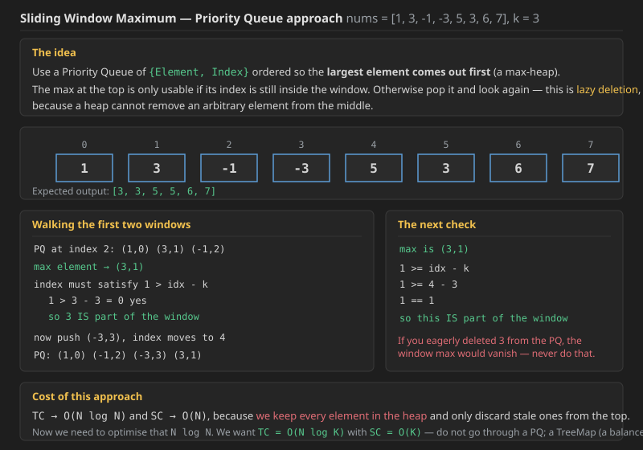
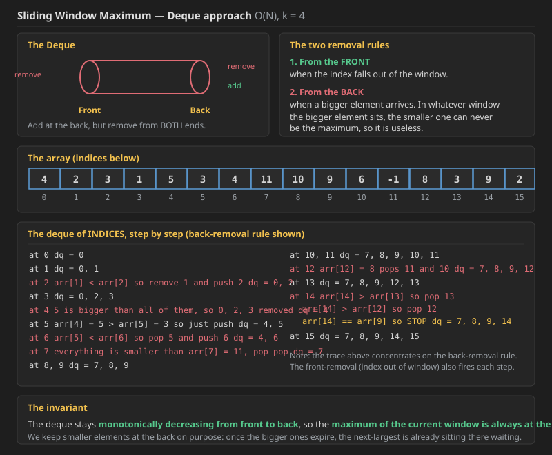
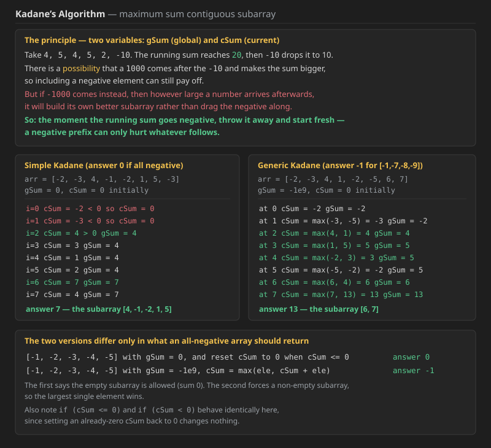
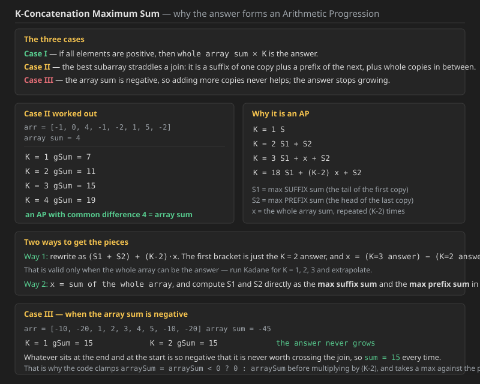

## Q1. Sliding Window Maximum (LeetCode 239)

other question is min window  substring ,this is solved vy deque and sliding window minimum is a variant can be solved by deque too same way.

You are given an array of integers `nums`, there is a sliding window of size `k` which is moving from the very left of the array to the very right. You can only see the `k` numbers in the window. Each time the sliding window moves right by one position.

Return *the max sliding window*.

### Example 1

```text
Input:  nums = [1,3,-1,-3,5,3,6,7], k = 3
Output: [3,3,5,5,6,7]
Explanation:
Window position                 Max
---------------                 -----
[1  3  -1] -3  5  3  6  7        3
 1 [3  -1  -3] 5  3  6  7        3
 1  3 [-1  -3  5] 3  6  7        5
 1  3  -1 [-3  5  3] 6  7        5
 1  3  -1  -3 [5  3  6] 7        6
 1  3  -1  -3  5 [3  6  7]       7
```

### Example 2

```text
Input:  nums = [1], k = 1
Output: [1]
```

### Constraints

* `1 <= nums.length <= 10^5`
* `-10^4 <= nums[i] <= 10^4`
* `1 <= k <= nums.length`

### An already-submitted solution using Next Greater Element

This one reuses the next-greater-element-to-the-right array: from the start of each window, keep jumping to the next greater element as long as that greater element is still inside the window.

**Java**

```java
public int[] maxSlidingWindow(int[] nums, int k) {
    int[] res = new int[nums.length - k + 1];
    int[] nge = ngetr(nums);
    int j = 0;
    for (int i = 0; i <= nums.length - k; i++) {
        if (j < i) j = i;
        while (i + k - 1 >= nge[j] && nge[j] != -1) {
            j = nge[j];
        }
        res[i] = nums[j];
    }
    return res;
}

public int[] ngetr(int[] arr) {
    int[] res = new int[arr.length];
    Stack<Integer> stk = new Stack<>();
    stk.push(0);
    // to right, so go from left to right
    for (int i = 1; i < arr.length; i++) {
        while (stk.size() > 0 && arr[stk.peek()] < arr[i]) {
            res[stk.peek()] = i;
            stk.pop();
        }
        stk.push(i);
    }
    while (stk.size() > 0) {
        res[stk.peek()] = -1;
        stk.pop();
    }
    return res;
}
```

**C++** (was missing; same logic as the Java above)

```cpp
vector<int> ngetr(vector<int>& arr) {
    int n = arr.size();
    vector<int> res(n, 0);
    stack<int> stk;
    stk.push(0);
    // to right, so go from left to right
    for (int i = 1; i < n; i++) {
        while (stk.size() > 0 && arr[stk.top()] < arr[i]) {
            res[stk.top()] = i;
            stk.pop();
        }
        stk.push(i);
    }
    while (stk.size() > 0) {
        res[stk.top()] = -1;
        stk.pop();
    }
    return res;
}

vector<int> maxSlidingWindow(vector<int>& nums, int k) {
    int n = nums.size();
    vector<int> res(n - k + 1, 0);
    vector<int> nge = ngetr(nums);
    int j = 0;
    for (int i = 0; i <= n - k; i++) {
        if (j < i) j = i;
        while (i + k - 1 >= nge[j] && nge[j] != -1) {
            j = nge[j];
        }
        res[i] = nums[j];
    }
    return res;
}
```

### Approach 1 &#8212; brute force

Just take the max of each window.

```text
TC -> O(N x K)          SC -> O(1)
```

**Complexity &#8212; brute force:**

* **Time `O(N x K)`.** There are `N - K + 1` window positions, and each one rescans all `K` elements. With `N = 10^5` and `K` around `N/2` that is roughly `2.5 x 10^9` operations, which will time out.
* **Space `O(1)`** auxiliary, plus `O(N - K + 1)` for the output.
* **What is wasted:** consecutive windows share `K - 1` elements, so the maximum is recomputed from scratch almost every time. Every approach below removes exactly that redundancy.


 ### Approach 2 &#8212; Priority Queue of {Element, Index}



Use a Priority Queue of `{Element, Index}` ordered so that the **largest element comes out first**. The maximum at the top is only usable if its index is still inside the window, so the check is:

```text
index  >  idx - k
```

**Dry run on `{1, 3, -1, -3, 5, 3, 6, 7}` with `k = 3`:**

At index 2 the PQ holds `(1,0) (3,1) (-1,2)`, so the max element is `(3,1)`:

```text
1 > 3 - 3
1 > 0        yes,  so 3 IS part of the window
```

After putting index 2 in, the index moves to 3. Now push `(-3,3)` and the index moves to 4. The PQ now holds `(1,0) (-1,2) (-3,3) (3,1)` and the max is still `(3,1)`:

```text
1 >= idx - k
1 >= 4 - 3
1 == 1       so this IS part of the window
```

**A warning about eager deletion.** Look at `{1, 3, -1, -3, 5, 3, 6, 7}` &#8212; the window max is `3`, and if that `3` were not in the PQ at all the answer would be wrong. A heap cannot delete an arbitrary element from the middle, so **never try to remove it early**; only discard from the top when the top itself has expired. That is what lazy deletion means.

And so it keeps going on the same way.

```text
TC -> O(N log N)          SC -> O(N)
```

`SC` is `O(N)` because **we store every element**.

Now we need to optimise that `N log N`. We want `TC -> O(N log K)` and `SC -> O(K)` &#8212; do not go through a PQ. We can use a **TreeMap**, or build a balanced BST ourselves. Better to use a TreeMap.

### The PQ code

**Java**

```java
// 239
public int[] maxSlidingWindow(int[] nums, int k) {
    PriorityQueue<Integer> pq = new PriorityQueue<>((a, b) -> {
        return nums[b] - nums[a]; // other - this, reverse of default behaviour.
    });

    int n = nums.length, idx = 0;
    int[] ans = new int[n - k + 1];
    for (int i = 0; i < nums.length; i++) {
        while (pq.size() != 0 && pq.peek() <= i - k)
            pq.remove();

        pq.add(i);

        if (i >= k - 1)
            ans[idx++] = nums[pq.peek()];
    }
    return ans;
}
```

The comparator is the thing to remember:

```text
this - other   ->  Min PQ   (the default in Java)
other - this   ->  Max PQ
```

Here we remove first and then add, because the top element may already be out of the window.

**C++**

```cpp
vector<int> maxSlidingWindow(vector<int> &nums, int k)
{
    // {val, index}
    priority_queue<vector<int>> pq;

    int n = nums.size(), idx = 0;
    vector<int> ans;
    for (int i = 0; i < nums.size(); i++)
    {
        while (pq.size() != 0 && pq.top()[1] <= i - k)
            pq.pop();

        pq.push({nums[i], i});

        if (i >= k - 1)
            ans.push_back(pq.top()[0]);
    }
    return ans;
}
```

In C++ a `vector` of size 2 is pushed, since `priority_queue<vector<int>>` compares element-wise and is a max-heap by default.

**Complexity &#8212; PQ approach:**

* **Time `O(N log N)` worst case.** Every index is pushed exactly once, costing `log` of the heap size, and popped at most once. The heap can grow to `N` entries because stale indices are only discarded when they reach the top &#8212; on a strictly increasing input such as `{1,2,3,4,5,6,7,8}` nothing ever expires early, so the heap really does hold everything.
* **Space `O(N)`**, for the same reason.
* This is already far better than `O(N x K)`, but the `log N` and the `O(N)` memory are both avoidable.

### Approach 3 &#8212; the Deque, in O(N)

Now we need a solution in `O(N)` time. We use a **Deque** here.



In a Deque we can **add at the back but remove from both sides, Front and Back**.

```text
        front  ---->  ______________________  <----  back
                              dq

  push_front()  ------>  ______________________  <------  push_back()
       front()  <-----                            ------>  back()
   pop_front()  <-----                            ------>  pop_back()
```

* **Removal from the front** happens **when the index gets out of the window**.
* **Removal from the back** happens when a bigger element arrives.

**Why the back-removal is correct.** Take `[2, 3, 1, 5, 2]`:

```text
at 0    dq = 2
at 1    dq = 3          3 will remove 2, because in whatever window 3 is
                        a part of, 2 can never be the maximum
at 2    dq = 3, 1
at 3    dq = 5          5 removes 1 and 3 too, for the same reason:
                        in whatever window 5 sits, the answer is 5
```

We keep the smaller elements at the back on purpose: **once the bigger ones expire, the next-largest is already sitting there waiting**. That is why the deque stays **monotonically decreasing from front to back**, and the **maximum is always at the front**.

**Before adding an element, check the front element** &#8212; is it still inside the window or not?

### Dry run of the deque approach

For `arr = [4, 2, 3, 1, 5, 3, 4, 11, 10, 9, 6, -1, 8, 3, 9, 2]` with `k = 4`, the deque of indices evolves like this:

```text
at 0        dq = 0
at 1        dq = 0, 1
at 2        arr[1] < arr[2], so remove 1 and push 2          dq = 0, 2
at 3        dq = 0, 2, 3
at 4        arr[4] = 5 is bigger than all, so 0, 2, 3 removed    dq = 4
at 5        arr[4] > arr[5], so just push                    dq = 4, 5
at 6        arr[5] < arr[6], so pop 5 and push 6             dq = 4, 6
at 7        everything is smaller than arr[7], pop pop       dq = 7
at 8, 9     dq = 7, 8, 9
at 10, 11   dq = 7, 8, 9, 10, 11
at 12       arr[12] = 8 pops 11 and 10                       dq = 7, 8, 9, 12
at 13       dq = 7, 8, 9, 12, 13
at 14       arr[14] > arr[13]  so pop 13
            arr[14] > arr[12]  so pop 12
            arr[14] == arr[9]  so STOP                       dq = 7, 8, 9, 14
at 15       dq = 7, 8, 9, 14, 15
```

*(That trace concentrates on the back-removal rule so the monotonic shape is visible; the front-removal check runs on every step as well, and is what the code does first.)*

### The deque code

**Java**

```java
public int[] maxSlidingWindow(int[] nums, int k) {
    LinkedList<Integer> deque = new LinkedList<>();
    int n = nums.length, idx = 0;
    int[] ans = new int[n - k + 1];
    for (int i = 0; i < nums.length; i++) {
        while (deque.size() != 0 && deque.getFirst() <= i - k)
            deque.removeFirst();

        while (deque.size() != 0 && nums[deque.getLast()] <= nums[i])
            deque.removeLast();

        deque.addLast(i);

        if (i >= k - 1)
            ans[idx++] = nums[deque.getFirst()];
    }
    return ans;
}
```

**C++** (was missing; same logic as the Java above)

```cpp
vector<int> maxSlidingWindow(vector<int>& nums, int k) {
    deque<int> dq;
    int n = nums.size();
    vector<int> ans;
    for (int i = 0; i < n; i++) {
        while (dq.size() != 0 && dq.front() <= i - k)
            dq.pop_front();

        while (dq.size() != 0 && nums[dq.back()] <= nums[i])
            dq.pop_back();

        dq.push_back(i);

        if (i >= k - 1)
            ans.push_back(nums[dq.front()]);
    }
    return ans;
}
```

### Dry run of the code itself

For `arr = [4, 2, 3, 1, 5, 3, 4, 11, 6]` with `k = 4`:

```text
i = 0    dq = 0
i = 1    dq = 0, 1
i = 2    dq = 0, 2          the back-removal line ran here
i = 3    dq = 0, 2, 3       and now i == k - 1 == 3, so
                            ans[0] = arr[dq.getFirst()] = arr[0] = 4
i = 4    front check:  0 <= 4 - 4  so removeFirst()      dq = 2, 3
         arr[4] > arr[3]  so pop back
         arr[4] > arr[2]  so pop back, then push 4        dq = 4
         i >= k - 1, so ans[1] = arr[4]
```

The answer index `idx` moves separately from `i`, so it is just incremented as we go.

.jpg>) .jpg>) .jpg>) .jpg>) .jpg>) .jpg>) .jpg>) .jpg>) .jpg>) .jpg>) .jpg>) .jpg>) .jpg>) .jpg>) .jpg>) 


**Complexity &#8212; deque approach:**

* **Time `O(N)`.** The `for` runs `N` times and both `while` loops look nested, but the analysis is **amortised**: every index is pushed to the back **exactly once** and removed **at most once**, either from the front when it expires or from the back when a bigger element arrives. Total deque operations are therefore bounded by `2N`, which averages to `O(1)` per iteration.
* **Space `O(K)`.** The front-removal line guarantees no index older than the current window survives, so the deque never holds more than `K` entries. The worst case is a strictly decreasing array such as `5, 4, 3, 2, 1`, where nothing is ever popped from the back and all `K` window indices sit in the deque.
* **Why a single front check suffices.** Only **one** index can fall out of the window per step, since `i` advances by one, so an `if` would be enough there; a `while` is simply the safer habit and costs nothing.
* **Compared with the alternatives:** brute force `O(N x K)`, PQ `O(N log N)` with `O(N)` space, deque `O(N)` with `O(K)` space. The deque wins on both axes.

---

## Q2. Kadanes Algorithm

**Kadanes algorithm gives the maximum sum contiguous subarray.**

```text
-2, -3, [4, -1, -2, 1, 5], 3      <- the boxed part is the max sum subarray
```

Two variables are used: `gSum` (global sum) and `cSum` (current sum), starting at `gSum = -1e9` and `cSum = 0`.



### The principle

```text
4, 5, 4, 5, 2, -10
|__________|          sum = 20
|_______________|     sum = 10
```

There **is a possibility** that after the `-10` a `1000` shows up and makes the sum the maximum, so including a negative element can still pay off.

But suppose that after `-10` comes `-1000` instead. Now however large the number that arrives after it, that number would rather start a fresh subarray than drag a `-1000` along, so **it will not go with the negative sum**.

```text
4, 5, 4, 5, 2                    sum = 20     gSum = 20
4, 5, 4, 5, 2, -10               sum = 10     gSum = 20
4, 5, 4, 5, 2, -10, -9           sum = 1      gSum = 20
4, 5, 4, 5, 2, -10, -9, 19, 1    sum = 21     gSum = 21
```

Even after the negative elements, something bigger can still be found later, and here going forward did give a bigger global sum.

Now look at:

```text
4, 5, 4, 5, 2, -10, -9, -1       sum = 0
```

**Here it is now better to start a NEW subarray** compared with continuing this one.

### The dry run

```text
arr = {-2, -3, 4, -1, -2, 1, 5, -3}
gSum = -1e9,  cSum = 0  initially

i = 0   cSum = -2   < 0, so there is no benefit in keeping it  ->  cSum = 0
i = 1   cSum = -3   again < 0  ->  cSum = 0
i = 2   cSum = 4    > 0, so gSum = max(cSum, gSum) = 4
i = 3   cSum = 3                gSum = 4
i = 4   cSum = 1                gSum = 4
i = 5   cSum = 2                gSum = 4
i = 6   cSum = 7                gSum = max(gSum, cSum) = 7
i = 7   cSum = 4                gSum = 7
```

The maximum sum subarray is `[4, -1, -2, 1, 5]`, whose sum is `7`.

### There are two Kadane variants

* **In one**, when `cSum < 0` we set `cSum = 0`. In this one **negative elements are not counted at all**.
* **In the other**, when `cSum < 0` we still consider it.

```text
[-1, -2, -3, -4, -5]   with the first variant   ->  result 0
[-1, -2, -3, -4, -5]   with the second variant  ->  result -1, which is the maximum
```

### Simple Kadane

**Java**

```java
// KadanesAlgo
// [-1,-7,-8,-9] -> max sum Subarray if 0 (no subarray exist);
public static int kadanesAlgo(int[] arr) {
    int gSum = 0, cSum = 0;
    for (int ele : arr) {
        cSum += ele;
        if (cSum > gSum)
            gSum = cSum;
        if (cSum <= 0)
            cSum = 0;
    }

    return gSum;
}
```

**C++** (was missing; same logic as the Java above)

```cpp
// KadanesAlgo
// [-1,-7,-8,-9] -> max sum Subarray if 0 (no subarray exist);
int kadanesAlgo(vector<int>& arr) {
    int gSum = 0, cSum = 0;
    for (int ele : arr) {
        cSum += ele;
        if (cSum > gSum)
            gSum = cSum;
        if (cSum <= 0)
            cSum = 0;
    }

    return gSum;
}
```

Here `gSum = 0` is kept because we are **ignoring negative elements for now**. If negative elements should also count, use `gSum = -1e9` instead.

Also, writing `if (cSum <= 0)` rather than `if (cSum < 0)` makes no difference: if `cSum == 0`, setting it back to `0` changes nothing.

### Generic Kadane

**Java**

```java
// [-1,-7,-8,-9] -> max sum Subarray if -1 (0,0);
public static int kadanesAlgoGeneric(int[] arr) {
    int gSum = -(int) 1e9, cSum = 0;
    for (int ele : arr) {
        cSum = Math.max(ele, cSum + ele);
        gSum = Math.max(gSum, cSum);
    }

    return gSum;
}
```

**C++** (was missing; same logic as the Java above)

```cpp
// [-1,-7,-8,-9] -> max sum Subarray if -1 (0,0);
int kadanesAlgoGeneric(vector<int>& arr) {
    int gSum = -(int) 1e9, cSum = 0;
    for (int ele : arr) {
        cSum = max(ele, cSum + ele);
        gSum = max(gSum, cSum);
    }

    return gSum;
}
```

In this one, **if there are negative elements then the maximum negative value is the output.**

`cSum` decides whether the current element should start fresh or continue the previous array.

### Dry run of the generic version

```text
arr = {-2, -3, 4, 1, -2, -5, 6, 7}

at 0   cSum = -2                        gSum = -2
at 1   cSum = max(-3, -3 + -2) = -3     gSum = max(-3, -2) = -2
at 2   cSum = max(4, -3 + 4)   = 4      gSum = max(4, -2)  = 4
at 3   cSum = max(1, 4 + 1)    = 5      gSum = max(5, 4)   = 5
at 4   cSum = max(-2, 5 - 2)   = 3      gSum = max(5, 3)   = 5
at 5   cSum = max(-5, 3 - 5)   = -2     gSum = max(5, -2)  = 5
at 6   cSum = max(6, -2 + 6)   = 6      gSum = max(5, 6)   = 6
at 7   cSum = max(7, 6 + 7)    = 13     gSum = max(6, 13)  = 13
```

The maximum sum subarray here is `[6, 7]` with sum `13`.

Another way to write the same loop is to seed it and start from index 1:

```text
cSum = arr[0]  and  gSum = arr[0]
for (int i = 1; i < n; i++) {
    cSum = max(arr[i], cSum + arr[i]);
    gSum = max(gSum, cSum);
}
```

`gSum = arr[0]` because `arr[0]` can itself be the answer.

**Complexity &#8212; Kadane:**

* **Time `O(N)`.** A single pass with `O(1)` work per element. There is no nesting and no restart: the algorithm never re-examines an element it has already passed, which is exactly what separates it from the `O(N^2)` try-every-subarray approach.
* **Space `O(1)`.** Only `gSum` and `cSum`.
* **Why the greedy reset is valid.** If the running sum is negative, any subarray that carries that prefix forward is strictly worse than the same subarray starting fresh after it. So a negative prefix can be dropped without ever losing the optimum, and that is the whole proof.

### Kadane while also tracking the subarray

**Java**

```java
public static int kadanesAlgo_SubArray(int[] arr) {
    int gSum = 0, cSum = 0, gsi = 0, gei = 0, csi = 0;
    for (int i = 0; i < arr.length; i++) {
        int ele = arr[i];
        cSum += ele;
        if (cSum > gSum) {
            gSum = cSum;

            gsi = csi;
            gei = i;
        }
        if (cSum <= 0) {
            cSum = 0;
            csi = i + 1;
        }
    }

    return gSum;
}
```

**C++** (was missing; same logic as the Java above)

```cpp
int kadanesAlgo_SubArray(vector<int>& arr) {
    int gSum = 0, cSum = 0, gsi = 0, gei = 0, csi = 0;
    for (int i = 0; i < (int) arr.size(); i++) {
        int ele = arr[i];
        cSum += ele;
        if (cSum > gSum) {
            gSum = cSum;

            gsi = csi;
            gei = i;
        }
        if (cSum <= 0) {
            cSum = 0;
            csi = i + 1;
        }
    }

    return gSum;
}
```

```text
gsi  ->  global starting index
gei  ->  global ending index
csi  ->  current starting index
```

We print from `gsi` to `gei`. Whenever `cSum <= 0` the `csi` moves, because a **new subarray is starting** from there.

**Complexity:** still `O(N)` time and `O(1)` space; the three extra index variables are constant work per element. The one subtlety is that `csi` is set to `i + 1`, not `i`, because the element that pushed the sum to zero or below is itself excluded from the new subarray.

---

## Q3. K-Concatenation Maximum Sum (LeetCode 1191)

**Difficulty:** Medium

Given an integer array `arr` and an integer `k`, modify the array by repeating it `k` times.

For example, if `arr = [1, 2]` and `k = 3` then the modified array will be `[1, 2, 1, 2, 1, 2]`.

Return the maximum sub-array sum in the modified array. Note that the length of the sub-array can be `0` and its sum in that case is `0`.

As the answer can be very large, return the answer **modulo** `10^9 + 7`.

### Examples

```text
Input:  arr = [1,2], k = 3
Output: 9

Input:  arr = [1,-2,1], k = 5
Output: 2

Input:  arr = [-1,-2], k = 7
Output: 0        <- all negative, so return 0
```

### Constraints

* `1 <= arr.length <= 10^5`
* `1 <= k <= 10^5`
* `-10^4 <= arr[i] <= 10^4`



### Why the brute force fails

Concatenating the array `k` times and running Kadane over it is an `O(K x N)` solution, which will not work:

```text
10^5 x 10^5 = 10^10 > 10^5     so TLE
```

### Case I

**If all elements are positive**, then `whole array sum x K` is the answer.

### Case II

Run Kadane for growing `k` on `arr = [-1, 0, 4, -1, -2, 1, 5, -2]`, whose array sum is `4`:

```text
K = 1    gSum = 7
K = 2    gSum = 11
K = 3    gSum = 15
K = 4    gSum = 19
```

This is an **AP (Arithmetic Progression)** with common difference `4`, which is exactly the array sum.

The reason is that the winning subarray decomposes as a **suffix of the first copy**, plus **whole copies in the middle**, plus a **prefix of the last copy**:

```text
K = 1     S
K = 2     S1 + S2
K = 3     S1 + x + S2
K = 18    S1 + (K-2) x + S2  =  S1 + 16x + S2
```

Since `S1` and `S2` contribute the same amount every time, we can pull them out:

```text
(S1 + S2) + (K-2) x
 \_______/
  this is just the K = 2 answer

x = (the K = 3 sum) - (the K = 2 sum)
```

This is valid in the case when the whole array can be part of the output.

The AP sum formulas are worth having handy:

```text
Sn = n/2 { 2a + (n-1) d }        or        Sn = n/2 { a + l }
                                                        ^ last term
```

### Case III

**When the array sum is negative**, the answer stops growing. Take `arr = [-10, -20, 1, 2, 3, 4, 5, -10, -20]`, whose array sum is `-45`:

```text
K = 1    gSum = 15
K = 2    gSum = 15
```

Whatever sits at the end and at the start is so negative that it is never worth crossing the join. Since the concatenation only ever adds those big negatives in the middle, `sum = 15` comes out every time.

Put another way: when the whole array is itself the answer, `S = S1 = S2 = x = sum of array = y`, so for 18 copies `S1 + S2 + (K-2)x = y + y + 16y = 18y`. But when `x = 0` (or `x < 0`, clamped to 0), the formula collapses back to `S1 + S2`, which is the `K = 2` answer.


----

.jpg>) .jpg>) .jpg>) .jpg>) .jpg>) .jpg>) .jpg>)


### Solution 1 &#8212; run Kadane for k = 1, 2, 3 and extrapolate

From `K = 2` and `K = 3` we can recover `x`, and then jump straight to any `K`.

**Java**

```java
class Solution {
    int mod = (int) 1e9 + 7;

    public int kadanesAlgo(int[] arr, int k) {
        int n = arr.length;
        long gsum = 0, csum = 0;

        for (int i = 0; i < k * n; i++) {
            int ele = arr[i % n];
            csum += ele;

            if (csum > gsum)
                gsum = csum;
            if (csum <= 0)
                csum = 0;
        }

        return (int) (gsum % mod);
    }

    public int kConcatenationMaxSum(int[] arr, int k) {
        long prevSum = 0, sum = 0;
        for (int i = 1; i <= 3; i++) {
            prevSum = sum;
            sum = kadanesAlgo(arr, i);
            if (i == k)
                return (int) sum;
        }

        return (int) ((prevSum + (k - 2) * (sum - prevSum)) % mod);
    }
}
```

Reading the last line: `prevSum` is `(S1 + S2)`, `sum` is `(S1 + S2 + x)`, so `sum - prevSum` **gives us `x`**.

The `i % n` trick walks the concatenated array without ever building it.

A `Math.max` variant of the same Kadane also works, and handles negative elements more directly:

```java
public int kadanesAlgo(int[] arr, int k) {
    int n = arr.length;
    long gsum = 0, csum = 0;

    for (int i = 0; i < k * n; i++) {
        int ele = arr[i % n];
        csum = Math.max(ele, ele + csum);
        gsum = Math.max(csum, gsum);
    }

    return (int) (gsum % mod);
}
```

**C++** (was missing; same logic as the Java above)

```cpp
class Solution {
    int mod = (int) 1e9 + 7;

public:
    int kadanesAlgo(vector<int>& arr, int k) {
        int n = arr.size();
        long long gsum = 0, csum = 0;

        for (int i = 0; i < k * n; i++) {
            int ele = arr[i % n];
            csum += ele;

            if (csum > gsum)
                gsum = csum;
            if (csum <= 0)
                csum = 0;
        }

        return (int) (gsum % mod);
    }

    int kConcatenationMaxSum(vector<int>& arr, int k) {
        long long prevSum = 0, sum = 0;
        for (int i = 1; i <= 3; i++) {
            prevSum = sum;
            sum = kadanesAlgo(arr, i);
            if (i == k)
                return (int) sum;
        }

        return (int) ((prevSum + (long long)(k - 2) * (sum - prevSum)) % mod);
    }
};
```

**Complexity &#8212; Solution 1:**

* **Time `O(N)`.** Kadane is run only three times, over `1n`, `2n` and `3n` elements, so the total is `6N` element visits. Everything after that is arithmetic. The `k` itself never enters the loop bound, which is exactly what dodges the `O(K x N)` TLE.
* **Space `O(1)`.** No concatenated array is ever materialised; `i % n` indexes the original.
* **Why only three runs are needed.** The answers form an AP, and an AP is fully determined by two consecutive terms plus the common difference. `K = 2` gives `S1 + S2`, `K = 3` gives `S1 + x + S2`, so their difference is `x`. `K = 1` is handled separately because a single copy has no join to cross.

### Solution 2 &#8212; max prefix sum and max suffix sum directly

**Another way:** `x` is just the sum of the whole array, so we only need `S1` and `S2`.

We need three things now: the **max prefix sum**, the **max suffix sum**, and the array sum.

Take `arr = [-1, 0, 4, -1, -2, 1, 5, -2]`:

```text
Max prefix sum                        Max suffix sum
i = 0   sum = -1   maxSum = -1        i = 7   sum = -2   max = -2
i = 1   sum = -1   maxSum = -1        i = 6   sum =  3   max =  3
i = 2   sum =  3   maxSum =  3        i = 5   sum =  4   max =  4
i = 3   sum =  2   maxSum =  3        i = 4   sum =  2   max =  4
i = 4   sum =  0   maxSum =  3        i = 3   sum =  1   max =  4
i = 5   sum =  1   maxSum =  3        i = 2   sum =  5   max =  5
i = 6   sum =  6   maxSum =  6        i = 1   sum =  5   max =  5
i = 7   sum =  4   maxSum =  6        i = 0   sum =  4   max =  5

           this is S2                            this is S1
```

The **max suffix sum is `S1`**, because that is the tail we carry out of the first copy, and the **max prefix sum is `S2`**, because that is the head we take from the last copy.

**Java**

```java
public int kConcatenationMaxSum(int[] arr, int k) {
    int kadansSum = kadanesAlgo(arr, 1);

    if (k == 1)
        return kadansSum;

    long prefixSum = 0, suffixSum = 0, maxPrefixSum = 0, maxSuffixSum = 0, arraySum = 0;
    int n = arr.length;
    for (int i = 0, j = n - 1; i < n; i++, j--) {
        prefixSum += arr[i];
        suffixSum += arr[j];
        arraySum += arr[i];

        maxPrefixSum = Math.max(maxPrefixSum, prefixSum);
        maxSuffixSum = Math.max(maxSuffixSum, suffixSum);
    }

    // if (arraySum > 0)
    // return (int) ((maxPrefixSum + maxSuffixSum + (k - 2) * arraySum) % mod);
    // else
    // return (int) (Math.max(maxPrefixSum + maxSuffixSum, kadansSum) % mod);

    arraySum = arraySum < 0 ? 0 : arraySum % mod;
    return (int) Math.max(kadansSum, maxPrefixSum + maxSuffixSum + ((k - 2) * arraySum) % mod) % mod;
}
```

**C++** (was missing; same logic as the Java above)

```cpp
int kConcatenationMaxSum(vector<int>& arr, int k) {
    int kadansSum = kadanesAlgo(arr, 1);

    if (k == 1)
        return kadansSum;

    long long prefixSum = 0, suffixSum = 0, maxPrefixSum = 0, maxSuffixSum = 0, arraySum = 0;
    int n = arr.size();
    for (int i = 0, j = n - 1; i < n; i++, j--) {
        prefixSum += arr[i];
        suffixSum += arr[j];
        arraySum += arr[i];

        maxPrefixSum = max(maxPrefixSum, prefixSum);
        maxSuffixSum = max(maxSuffixSum, suffixSum);
    }

    arraySum = arraySum < 0 ? 0 : arraySum % mod;
    return (int) (max((long long) kadansSum,
                      maxPrefixSum + maxSuffixSum + ((k - 2) * arraySum) % mod) % mod);
}
```

`k == 1` is handled separately at the top, because with a single copy there is no join to straddle and the plain Kadane answer is already correct.

### Why the final line takes a max against the plain Kadane sum

Suppose the array is `[-100, -20, 10, 20, 10, 20]`, so the array sum is negative.

```text
for K = 1     -100, -20, [10, 20, 10, 20]                    output 60
for K = 2     -100, -20, [10, 20, 10, 20], -100, -20, 10, 20, 10, 20
```

Every single time the **same** answer comes out. The sum only grows when `x > 0`; when `x = 0` or `x < 0` there is nothing to gain by crossing the join.

```text
if x < 0, then the Kadane sum is the output every time
if the array sum < 0, then x should not be added at all
   -> that is why the code sets it to 0
```

Look at the shape of it:

```text
[ -ve | +ve | -ve ]                          the Kadane sum is returned for any K

[ +ve | -ve | +ve ][ +ve | -ve | +ve ]       here S1 + S2 is returned
```

**So that is why it is `max(Kadane sum, S1 + S2 + x(k-2))`.**

**Complexity &#8212; Solution 2:**

* **Time `O(N)`.** One Kadane pass plus one combined prefix/suffix pass, both linear and both independent of `k`. This is a constant-factor improvement over Solution 1 (two passes rather than six).
* **Space `O(1)`.** Five running scalars; no prefix or suffix arrays are ever allocated, because both are computed on the fly with `i` moving forward and `j` moving backward in the same loop.
* **Why `maxPrefixSum` and `maxSuffixSum` start at `0`.** An empty prefix or suffix is allowed, since the problem says the subarray may have length 0, so 0 is the correct floor. That is also what makes the answer come out as `0` for an all-negative array.
* **The overflow trap.** `(k - 2) * arraySum` can reach roughly `10^5 x 10^9`, which overflows a 32-bit `int`, so the accumulators are `long` in Java and `long long` in C++, and the modulo is applied before the value is cast back down.

.jpg>) .jpg>) .jpg>) .jpg>) .jpg>)


