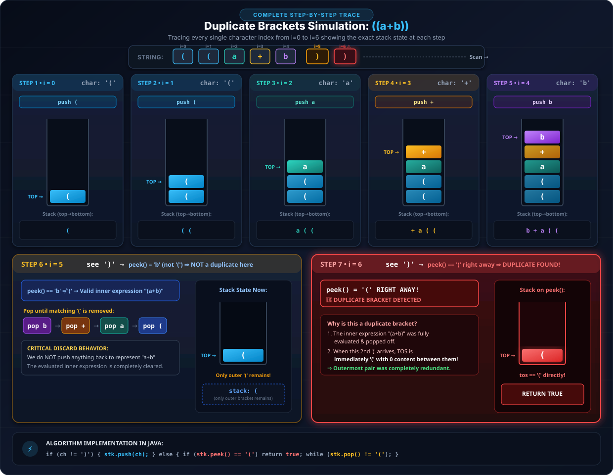

```java
import java.util.*;

public class Main {
    public static void main(String[] args) {
        // Write your code here
        Stack<Integer> st = new Stack<>();
        st.push(10); // 10
        System.out.println(st.peek()); // 10

        st.push(20); // 10, 20
        System.out.println(st.peek()); // 20

        st.push(30); // 10, 20, 30
        System.out.println(st.peek()); // 30

        while (st.size() > 0) {
            System.out.println(st.peek());
            st.pop();
        }
    }
}
```

All `push()`, `pop()` & `peek()` are `O(1)`.

We use Linked List for both Stack & Queue.

```
addFirst()      ]
removeFirst()   ]  for Stack

addLast()       ]
removeFirst()   ]  for Queue
```

All 3 fn — `addFirst()`, `removeFirst()` & `addLast()` — are `O(1)`.

Rest we know of Stack & Queue difference, or see in basics if you want to know more. Stack & Queue are basically **disciplines** (rules about the order elements come out in, not a special data structure by themselves).

---

## Q1. Duplicate Brackets

**Practice Question:** GfG / Pepcoding — Duplicate Brackets (also appears as an interview question, not to be confused with "Valid Parentheses" below)

**Problem:** given a balanced mathematical expression, tell whether it contains a duplicate (wasteful/redundant) bracket.


**Is there any waste bracket?**

```
(a+b)               -> no duplicate bracket
((a+b))             -> Yes, outermost bracket is a duplicate bracket
                        (as of no use — are duplicate brackets)

((a+b) + (c+d))     -> no duplicate brackets
(((a+b) + (c+d)))   -> Yes, duplicate brackets
```

Another example: `((a+b)+c) + ((d+e))` — the `(d+e)` wrapped in an extra pair of parenthesis is the duplicate bracket (the outer bracket around `(d+e)` serves no purpose).

> In the question we need to tell only whether you have duplicate brackets or not.

**I/P:** all brackets will be balanced given.
**TC needed:** `O(n)`

### My Logic

Let's see `((a+b))`:

Push characters onto a stack as we scan left to right. When we hit a `)`:
- If the character on **top of the stack right now is `(`** (i.e. nothing was pushed between this `(` and this `)`), that pair is a **duplicate bracket** — report it.
- Otherwise, pop characters off the stack until you pop the matching `(`, and discard all of it (don't push anything back to represent the evaluated sub-expression).

Tracing `((a+b))`:




###  Code (Way-1)

```java
public static void main(String[] args) throws Exception {
    Scanner scn = new Scanner(System.in);
    String str = scn.nextLine();
    boolean dup = false;
    LinkedList<Character> stk = new LinkedList<>();
    for (int i = 0; i < str.length(); i++) {
        char ch = str.charAt(i);
        if (ch == ')') {
            char tos = stk.removeFirst();
            if (tos == '(') {
                System.out.println("true");
                dup = true;
                break;
            }
            while (stk.removeFirst() != '(') {
                // can leave like this
            }
        } else {
            stk.addFirst(ch);
        }
    }
    if (dup == false) System.out.println("false");
}
```

###  way-2

Another way: instead of `break`, put `return`; using `return` from `main` means nothing further executes (no need for the `dup` flag at all):

```java
public class Main {
    public static void main(String[] args) throws Exception {
        Scanner scn = new Scanner(System.in);
        String str = scn.nextLine();
        boolean dup = false;
        LinkedList<Character> stk = new LinkedList<>();
        for (int i = 0; i < str.length(); i++) {
            char ch = str.charAt(i);
            if (ch == ')') {
                char tos = stk.removeFirst();
                if (tos == '(') {
                    System.out.println("true");
                    dup = true;
                    return;
                }
                while (stk.removeFirst() != '(') {
                }
            } else {
                stk.addFirst(ch);
            }
        }
        System.out.println("false");
    }
}
```

### Summet Sir's Code

Yehi basic style hai code ka (this is the basic style of writing this code), using `java.util.Stack` directly:

```java
public static void main(String[] args) throws Exception {
    Scanner scn = new Scanner(System.in);
    String str = scn.nextLine();

    Stack<Character> st = new Stack<>();
    for (int i = 0; i < str.length(); i++) {
        char ch = str.charAt(i);

        if (ch == ')') {
            if (st.peek() == '(') {
                System.out.println(true);
                return;
            } else {
                while (st.size() > 0 && st.peek() != '(') {
                    st.pop();
                }
                st.pop();
            }
        } else {
            st.push(ch); // opening bracket or some char
        }
    }
}
```

**Why TC is `O(n)`?**

Har character ek baar visit hua hai na (every character gets visited exactly once) — har character ek baar push hua & ek baar pop hua so `O(2n)` = `O(n)` (every character is pushed once and popped once). Code se toh `O(n²)` lagti hai (looking at the nested loops it might look like `O(n²)`) — ek complexity under loop se define nahi hoti, define hoti hai ki push kitni baar hua & pop kitni baar hua (complexity isn't decided by "loop nested inside loop," it's decided by how many times push and pop actually happen in total). So here TC → `O(n)` as for every character we have one push & one pop.

**Complexity:**
- **Time:** `O(n)` — even though the `while` loop is nested inside the `for` loop (which superficially looks like `O(n²)`), each character is pushed onto the stack **at most once** and popped off **at most once** across the *entire* run of the algorithm — not once per outer-loop iteration. Summing all pushes and pops over the whole string gives `2n` operations total, i.e. `O(n)`, not `O(n²)`.
- **Space:** `O(n)` for the stack in the worst case (e.g. a string of all opening brackets/characters before any closing bracket appears, such as `((((((a`).

---

## Q2. Balanced Parenthesis (Valid Parentheses)

**Practice Question:** LeetCode 20 — Valid Parentheses

**3 types of bracket:** `[ ]`, `( )`, `{ }`

### Imbalance cases

**① More opening brackets** — closing never happens for one of them:

```
[((a+b) + (c+d)]
  ^-- this 1st one '(' never gets closed
```

**② More closing brackets** — ambiguous which one to close:

```
[(a+b) + (c+d))]
              ^-- which one does this extra ')' close?
```

**③ Mismatch of opening/closing bracket types:**

```
[((a+b) + (c+d)}]
 ^             ^-- these two don't match each other
```


### Buggy first attempt

This code — 1 test case always failing:

```java
for (int i = 0; i < s.length(); i++) {
    char ch = s.charAt(i);
    if (ch == '(' || ch == '[' || ch == '{')
        stk.push(ch);
    else if (ch == ')' && stk.size() > 0) {
        char tos = stk.peek();
        if (tos != '(') {
            System.out.println("false");
            return;
        }
        else stk.pop();
    }
    else if (ch == '}' && stk.size() > 0) {
        char tos = stk.peek();
        if (tos != '{') {
            System.out.println("false");
            return;
        }
        else stk.pop();
    }
    else if (ch == ']' && stk.size() > 0) {
        char tos = stk.peek();
        if (tos != '[') {
            System.out.println("false");
            return;
        }
        else stk.pop();
    }
    else if (stk.size() == 0) {
        System.out.println("false");
        return;
    }
}
if (stk.size() == 0) System.out.println("true");
else System.out.println("false");
```

**Why it fails — traced through concrete test cases**

The bug: the final `else if (stk.size() == 0)` branch is a catch-all that fires for **any** character — bracket or not — whenever the stack happens to be empty at that moment. But a stack becoming empty mid-string is completely normal (it just means a bracket pair was fully matched and closed) — it should only be treated as an error when the *current character is a closing bracket* with nothing left to match. This code can't tell those two situations apart.

**Test case 1: `(a+b)+c+d`** (should be `true` — every bracket matches)

```
i=0 '('  -> push          stack: (
i=1 'a'  -> no branch matches, stk.size()!=0 -> skipped (fine)
i=2 '+'  -> skipped (fine, stack still has '(')
i=3 'b'  -> skipped (fine)
i=4 ')'  -> ch==')' && size()>0 -> peek()=='(' matches -> pop
             stack is now EMPTY
i=5 '+'  -> not an opening bracket, not ')'/'}'/']'
             falls to: else if (stk.size() == 0)  -> TRUE
             -> prints "false", returns immediately
```

The expression is perfectly balanced, but the code bails out the instant it sees a harmless `+` while the stack happens to be empty (right after `(a+b)` closed).

**Test case 2: `()abc`** (should be `true` — brackets close cleanly, rest is plain text)

```
i=0 '('  -> push           stack: (
i=1 ')'  -> matches, pop   stack: empty
i=2 'a'  -> stk.size()==0 -> TRUE -> prints "false", returns
```

Same bug — even the trivial `()` followed by ordinary letters fails.

**Test case 3: `"a"`** (a single letter, no brackets at all — arguably should be `true`, nothing to mismatch)

```
i=0 'a'  -> stack is empty from the start (size 0)
         -> falls straight to else if (stk.size() == 0) -> TRUE
         -> prints "false"
```

Any string that doesn't open with a bracket, or that has *any* non-bracket character while the stack is momentarily empty, is wrongly rejected.

**Why some similar-looking inputs "accidentally" pass:** e.g. `(a)(b)` works fine, purely by luck of ordering — the `(` right after the first `)` closes immediately refills the stack before any plain character gets a chance to see it empty:

```
'(' push -> 'a' skipped (stack non-empty) -> ')' pop (now empty)
'(' push immediately (now non-empty again) -> 'b' skipped -> ')' pop
end: stack empty -> "true"
```

So the bug only surfaces when a **non-bracket character (or the string's end) directly follows a completed bracket match** — which is an extremely common pattern, not an edge case.

The fix moves the `stk.size() == 0` check to be a **guard specifically inside each closing-bracket branch**, checked right before `peek()`, instead of a generic fallback that treats "stack is empty" itself as an error — see below.

### Fixed code

```java
for (int i = 0; i < s.length(); i++) {
    char ch = s.charAt(i);
    if (ch == '(' || ch == '[' || ch == '{')
        stk.push(ch);
    else if (ch == ')') {
        if (stk.size() == 0) {
            System.out.println("false");
            return;
        }
        char tos = stk.peek();
        if (tos != '(') {
            System.out.println("false");
            return;
        }
        else stk.pop();
    }
    else if (ch == '}') {
        if (stk.size() == 0) {
            System.out.println("false");
            return;
        }
        char tos = stk.peek();
        if (tos != '{') {
            System.out.println("false");
            return;
        }
        else stk.pop();
    }
    else if (ch == ']') {
        if (stk.size() == 0) {
            System.out.println("false");
            return;
        }
        char tos = stk.peek();
        if (tos != '[') {
            System.out.println("false");
            return;
        }
        else stk.pop();
    }
}
if (stk.size() == 0) System.out.println("true");
else System.out.println("false");
```

**How the fix handles the same test cases**

The key change: `stk.size() == 0` is now checked **only inside a closing-bracket branch, right before `peek()`** — never as a generic fallback for plain characters. So an empty stack is no longer treated as an error by itself; it only matters at the exact moment a closing bracket needs something to match.

**Test case 1: `(a+b)+c+d`** (should be `true`)

```
i=0 '('  -> push          stack: (
i=1 'a'  -> not an opening bracket, not ')'/'}'/']' -> no branch matches -> skipped
i=2 '+'  -> skipped
i=3 'b'  -> skipped
i=4 ')'  -> ch == ')' branch: stk.size() != 0, so no early return
             peek() == '(' matches -> pop        stack: empty
i=5 '+'  -> not an opening bracket, not ')'/'}'/']' -> no branch matches -> skipped
             (there is no generic "else if (stk.size() == 0)" anymore, so an
              empty stack alone does NOT trigger anything here)
i=6 'c'  -> skipped
i=7 '+'  -> skipped
i=8 'd'  -> skipped
end of string: stk.size() == 0 -> prints "true"   ✓ correct
```

**Test case 2: `()abc`** (should be `true`)

```
i=0 '('  -> push           stack: (
i=1 ')'  -> stk.size() != 0, peek() == '(' matches -> pop     stack: empty
i=2 'a'  -> no branch matches (not a bracket at all) -> skipped
i=3 'b'  -> skipped
i=4 'c'  -> skipped
end of string: stk.size() == 0 -> prints "true"   ✓ correct
```

**Test case 3: `"a"`** (should be `true` — no brackets, nothing to mismatch)

```
i=0 'a'  -> not an opening bracket, not ')'/'}'/']' -> no branch matches -> skipped
end of string: stk.size() == 0 -> prints "true"   ✓ correct
```

**A genuine mismatch is still caught correctly**, e.g. `")"` alone:

```
i=0 ')'  -> ch == ')' branch: stk.size() == 0 right now
             -> prints "false", returns immediately   ✓ correct
```

The difference is precise: the `stk.size() == 0` check only ever runs at the moment a closing bracket is being processed and needs to `peek()` — so it correctly distinguishes "stack is empty because everything matched so far" (fine, keep going) from "stack is empty and I just found a closing bracket with nothing to match" (genuinely invalid).

**Complexity:**
- **Time:** `O(n)` — a single pass over the string; each character triggers either one `push`, one `peek` + `pop`, or is otherwise skipped, all `O(1)` operations, and the total number of pushes/pops across the whole run is bounded by `n`.
- **Space:** `O(n)` in the worst case — e.g. a string that is entirely opening brackets (`((((((`), where every character gets pushed and the stack never shrinks until the very end (if at all).
