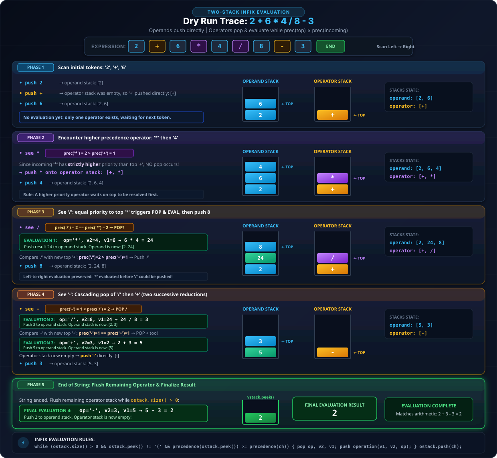
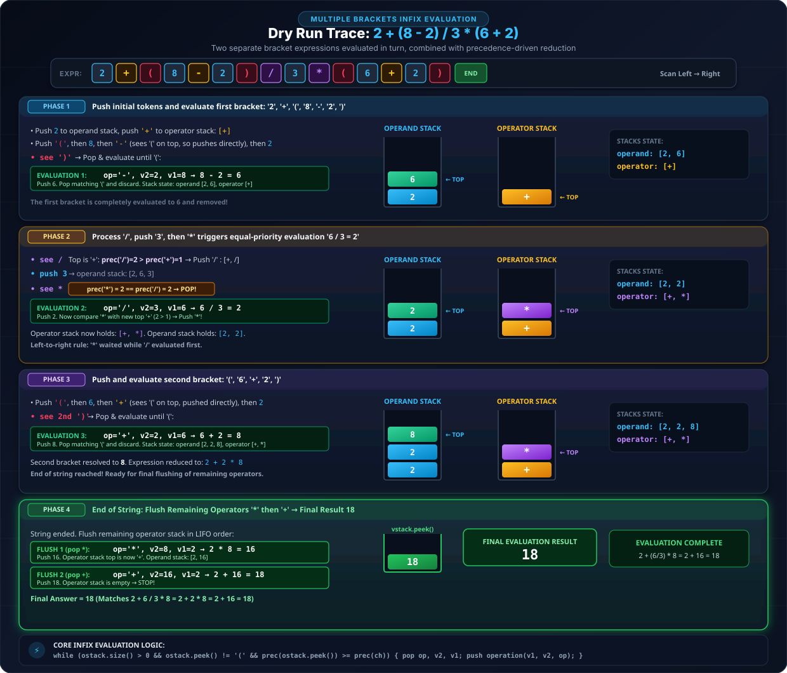
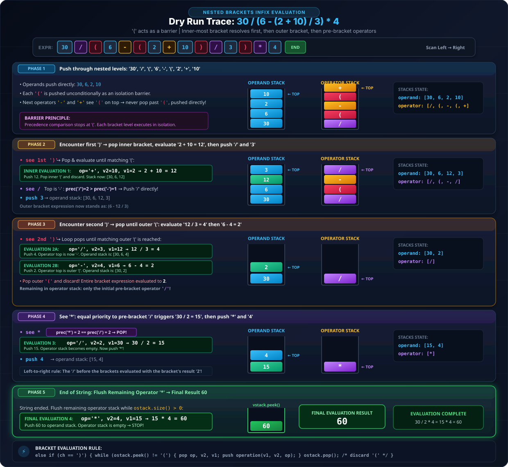
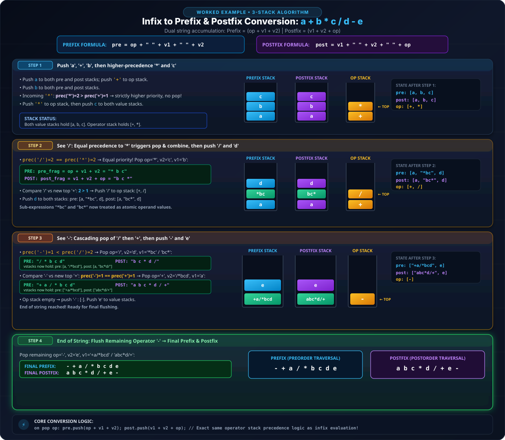
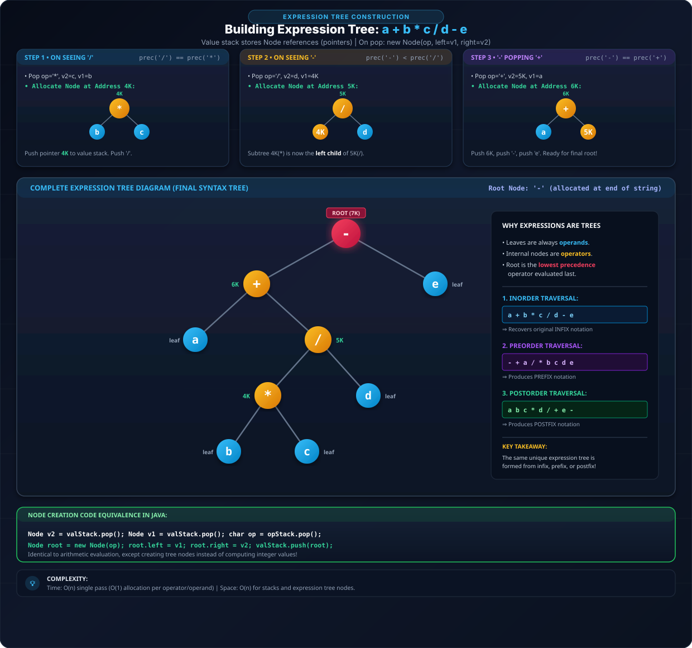

## Q1. Infix Evaluation

**Practice Question:** GfG — Expression Evaluation / LeetCode 227 — Basic Calculator II

### Precedence

```
1st priority (highest):  *  /
2nd priority:            +  -
```

If `a + b - c` → go Left to Right, as `+`, `-` are equal priority.
Or `a * b / c` → go Left to Right, as `*`, `/` are equal priority.

**Eg:** `a+ b-c * d/e`  reads as  `a+ b-(c*d/e)` — the `*`,`/` group binds tighter, evaluated Left to Right.

**No BODMAS here in computers** — operators of equal priority are always evaluated strictly Left to Right (not "multiplication before division" or any other convention beyond precedence + left-to-right associativity).

**Eg:** `2 +6 *4 /8 -3`

`6 *4 /8` — `*` and `/` are equal priority → Left to Right: `24/8 = 3`.

So `2 + 3 - 3` — Assoc 2 to R (again left to right for `+`,`-`): `5 - 3 = 2`.

### Two-Stack Approach

As soon as we see `*`, `/`, divide, evaluate. Push both operands and operators onto stacks.

**Rule:**
- Push operands directly onto an **operand stack**.
- For an operator: as long as the operator currently on **top of the operator stack has greater-or-equal priority**, pop it and evaluate (using the top two operands), pushing the result back onto the operand stack. Once the top of the operator stack has **lower** priority than the incoming operator (or the operator stack is empty), push the incoming operator.
- At the end of the expression, keep popping & evaluating until the operator stack is empty.

> New operand (`2`) button of stack — we don't push a placeholder for the very first operand's operator (nothing to compare against yet), so the very first operator always just gets pushed.

### Dry Run 1 — `2 + 6 * 4 / 8 - 3`



**Final result: `2`**

### Handling Brackets — Priority Table

Closing bracket process karte hai, & operator sirf tabhi process karta hai jab tak uske bade priority wale bracket pe hi stack aaye (a closing bracket always triggers processing; an operator only pops things of equal-or-greater priority, never past an open bracket).

**Priority Order:**

```
1) ( )
2) *, /
3) +, -
```

Rule → higher priority wale stack mein phle hi hai toh operate kar do; else if closing bracket hai current element toh do operation till you get opening bracket, closing bracket push bhi nahi hota (the rule: if something higher-priority is already on the operator stack, operate first; if the current character is a closing bracket, keep operating until you find the matching opening bracket — the closing bracket itself is never pushed).

An opening bracket `(` never gets popped by an ordinary operator comparison — it always just sits on the stack until a matching `)` explicitly pops it (and discards it, without pushing it anywhere).

### Dry Run 2 — `2 + (8 - 2) / 3 * (6 + 2)`



**Final result: `18`**

### Dry Run 3 (Eg 3) — `30 / (6 - (2 + 10) / 3) * 4`



**Final result: `60`**

### Code

```java
static int precedence(char op) {
    if (op == '+') {
        return 1;
    } else if (op == '-') {
        return 1;
    } else if (op == '*') {
        return 2;
    } else {
        // divide
        return 2;
    }
}

static int operation(int v1, int v2, char op) {
    if (op == '+') {
        return v1 + v2;
    } else if (op == '-') {
        return v1 - v2;
    } else if (op == '*') {
        return v1 * v2;
    } else {
        return v1 / v2;
    }
}

public static void main(String[] args) throws Exception {
    BufferedReader br = new BufferedReader(new InputStreamReader(System.in));
    String exp = br.readLine();

    // code
    Stack<Integer> vstack = new Stack<>();     // v = value stack
    Stack<Character> ostack = new Stack<>();   // operator stack

    for (int i = 0; i < exp.length(); i++) {
        char ch = exp.charAt(i);

        if (ch == '(') {
            ostack.push(ch);
        } else if (ch >= '0' && ch <= '9') {
            vstack.push(ch - '0');   // 2 condition needed: ch - '0' pushed
        } else if (ch == '+' || ch == '-' || ch == '*' || ch == '/') {
            while (ostack.size() > 0 && ostack.peek() != '(' && precedence(ostack.peek()) >= precedence(ch)) {
                char op = ostack.pop();
                int v2 = vstack.pop();
                int v1 = vstack.pop();

                int res = operation(v1, v2, op);
                vstac.push(res);
            }
            ostack.push(ch);
        } else if (ch == ')') {
            while (ostack.size() > 0 && ostack.peek() != '(') {
                // pops
                char op = ostack.pop();
                int v2 = vstack.pop();
                int v1 = vstack.pop();

                int res = operation(v1, v2, op);
                vstack.push(res);
            }
            ostack.pop(); // removing the opening bracket
        }
    }

    while (ostack.size() > 0) {
        // pops
        char op = ostack.pop();
        int v2 = vstack.pop();
        int v1 = vstack.pop();
        int res = operation(v1, v2, op);
        vstack.push(res);
    }
    System.out.println(vstack.peek());
}
```

`'9' - '0' -> 9` (subtracting the char `'0'` from any digit char converts it to its integer value).

**Multi-digit numbers:** the digit-handling branch above only pushes a single digit. Basic code jahaan can be 2 conditions which can arise so here it is — to correctly handle a multi-digit number like `"24"`, you need an inner `while` loop that keeps consuming consecutive digit characters and builds up the full number (`value = value*10 + (ch1-'0')`), advancing `i` each time, then decrementing `i` by one at the end since the outer `for` loop's `i++` will advance past the last digit already consumed:

```java
else if (ch >= '0' && ch <= '9') {
    int value = 0;
    while (i < exp.length() && exp.charAt(i) >= '0' && exp.charAt(i) <= '9') {
        char ch1 = exp.charAt(i);
        value = value * 10 + (ch1 - '0');
        i++;
    }
    if (i < exp.length()) i--;
    val.push(value);
}
```

**Complexity:**
- **Time:** `O(n)` — a single pass over the expression string. Every operand is pushed once, and every operator/value gets popped and evaluated at most once overall across the whole run (each `operation()` call permanently reduces the operand count by one) — so total push/pop work across both stacks is bounded by `O(n)`, not `O(n²)`, for the same reason as the bracket-matching problems earlier in this series.
- **Space:** `O(n)` for the two stacks in the worst case (e.g. an expression that is entirely operators of increasing precedence, or entirely nested opening brackets, before any evaluation can happen).

---

## Q2. LeetCode 224 — Basic Calculator

**Practice Question:** LeetCode 224 — Basic Calculator (Hard)

> Given a string `s` representing a valid expression, implement a basic calculator to evaluate it, and return the result of the evaluation. You are **not** allowed to use any built-in function which evaluates strings as mathematical expressions, such as `eval()`.

**Example 1:** `s = "1 + 1"` → Output: `2`
**Example 2:** `s = " 2-1 + 2 "` → Output: `3`

I tried this question using my previous approach (the infix evaluator above), but I have an error — **failing TC** → `"-2+3"` (leading unary minus is not handled by this general infix evaluator, since a `-` appearing before any operand at all isn't a binary operator with two operands to pop).

```java
class Main {
    static int precedence(char ch) {
        if (ch == '/' || ch == '*') return 2;
        if (ch == '+' || ch == '-') return 1;
        return 0;
    }

    static int evaluate(int v1, int v2, char operator) {
        if (operator == '+') return v1 + v2;
        if (operator == '-') return v1 - v2;
        if (operator == '*') return v1 * v2;
        if (operator == '/') return v1 / v2;
        return 0;
    }

    static void operation(Stack<Integer> val, Stack<Character> op) {
        int v2 = val.pop();
        int v1 = val.pop();
        char operator = op.pop();
        int res = evaluate(v1, v2, operator);
        val.push(res);
    }

    public int calculate(String exp) {
        Stack<Integer> val = new Stack<>();
        Stack<Character> op = new Stack<>();

        for (int i = 0; i < exp.length(); i++) {
            char ch = exp.charAt(i);
            if (ch == '(') {
                op.push(ch);
            } else if (ch >= '0' && ch <= '9') {
                int value = 0;
                while (i < exp.length() && exp.charAt(i) >= '0' && exp.charAt(i) <= '9') {
                    char ch1 = exp.charAt(i);
                    value = value * 10 + (ch1 - '0');
                    i++;
                }
                if (i < exp.length()) i--;
                val.push(value);
            } else if (ch == ')') {
                while (op.size() > 0 && op.peek() != '(') {
                    operation(val, op);
                }
                op.pop();
            } else if (ch == '+' || ch == '-' || ch == '/' || ch == '*') {
                while (op.size() > 0 && precedence(op.peek()) >= precedence(ch)) {
                    operation(val, op);
                }
                op.push(ch);
            }
        }
        while (op.size() > 0) {
            operation(val, op);
        }
        return val.peek();
    }
}
```

**Complexity:**
- **Time:** `O(n)` — same reasoning as Q1: one pass over the string, and each `push`/`pop`/`operation()` call happens a bounded number of times overall.
- **Space:** `O(n)` for the two stacks in the worst case.

---

## Why Use a Stack? (Expressions Are Trees)

Example tree for `a + b - c`:

```
        -
       / \
      +   c
     / \
    a   b
```

- **Infix** → **inorder** traversal of this tree
- **Prefix** → **preorder** traversal of this tree
- **Postfix** → **postorder** traversal of this tree

Tree ko traverse karne ka iterative kaam karne ke liye **stack chahiye hota hai!!** (doing tree traversal iteratively is exactly why a stack is needed).

---

## Q3. Infix to Prefix & Postfix Conversion

**Practice Question:** GfG — Infix to Postfix / Infix to Prefix Conversion (this specific "build a tree" question rarely gets asked directly — what's actually asked in interviews is Infix-to-Postfix or Infix-to-Prefix conversion)

**Key idea:** Postfix & Prefix conversion are easy once you understand infix evaluation, since it's the *exact same* two-stack algorithm — instead of an operand stack holding numeric values, you keep **two** value-fragment stacks (one accumulating the prefix form, one accumulating the postfix form) alongside the same operator stack, and instead of numerically evaluating, you **string-concatenate**.

Expression tree is the tree form of an expression. `a+b`:

```
a+b (infix)  ->  prefix: + a b     postfix: a b +
```

Building this with two value stacks (`val` for prefix, `op` for postfix... — here both stacks track fragments, one per representation) plus the shared operator stack:

```
push 'a'  ->  pre-stack: [a]     post-stack: [a]
push '+'  ->  operator stack: [+]
push 'b'  ->  pre-stack: [a,b]   post-stack: [a,b]
```

**Formula, when combining on a pop** (`v2` = the value popped *first*, i.e. from the top; `v1` = popped *second*):

```
pre  = op + " " + v1 + " " + v2
post = v1 + " " + v2 + " " + op
```

So for `a+b`: `v2 = b`, `v1 = a`, `op = +` → `pre = "+ a b"`, `post = "a b +"`.

### Worked example — `a + b * c / d - e`

Tracing both the prefix-stack and postfix-stack together, driven by the same precedence/bracket rules as Q1's evaluator:



**Final results:**

```
Prefix:  - + a / * b c d e
Postfix: a b c * d / + e -
```

### C++ Code

```cpp
#include <bits/stdc++.h>
using namespace std;

int precedence(char op) {
    if (op == '+' || op == '-') return 1;
    if (op == '*' || op == '/') return 2;
    return 0;
}

// pops one operator + two fragments off each stack, combines, pushes result back
void combine(stack<string>& preStack, stack<string>& postStack, stack<char>& opStack) {
    char op = opStack.top(); opStack.pop();

    string v2Pre = preStack.top(); preStack.pop();
    string v1Pre = preStack.top(); preStack.pop();
    preStack.push(string(1, op) + " " + v1Pre + " " + v2Pre);

    string v2Post = postStack.top(); postStack.pop();
    string v1Post = postStack.top(); postStack.pop();
    postStack.push(v1Post + " " + v2Post + " " + string(1, op));
}

void infixToPrefixPostfix(string exp) {
    stack<string> preStack, postStack;
    stack<char> opStack;

    for (int i = 0; i < (int)exp.length(); i++) {
        char ch = exp[i];
        if (ch == ' ') continue;

        if (ch == '(') {
            opStack.push(ch);
        } else if (isalnum(ch)) {
            preStack.push(string(1, ch));
            postStack.push(string(1, ch));
        } else if (ch == ')') {
            while (!opStack.empty() && opStack.top() != '(') {
                combine(preStack, postStack, opStack);
            }
            opStack.pop(); // discard '('
        } else { // +, -, *, /
            while (!opStack.empty() && opStack.top() != '(' &&
                   precedence(opStack.top()) >= precedence(ch)) {
                combine(preStack, postStack, opStack);
            }
            opStack.push(ch);
        }
    }

    while (!opStack.empty()) {
        combine(preStack, postStack, opStack);
    }

    cout << "Prefix: "  << preStack.top()  << "\n";
    cout << "Postfix: " << postStack.top() << "\n";
}

int main() {
    infixToPrefixPostfix("a+b*c/d-e");
    return 0;
}
```

### Java Code

```java
import java.util.Stack;

class InfixToPrefixPostfix {
    static int precedence(char op) {
        if (op == '+' || op == '-') return 1;
        if (op == '*' || op == '/') return 2;
        return 0;
    }

    // pops one operator + two fragments off each stack, combines, pushes result back
    static void combine(Stack<String> preStack, Stack<String> postStack, Stack<Character> opStack) {
        char op = opStack.pop();

        String v2Pre = preStack.pop();
        String v1Pre = preStack.pop();
        preStack.push(op + " " + v1Pre + " " + v2Pre);

        String v2Post = postStack.pop();
        String v1Post = postStack.pop();
        postStack.push(v1Post + " " + v2Post + " " + op);
    }

    static void infixToPrefixPostfix(String exp) {
        Stack<String> preStack = new Stack<>();
        Stack<String> postStack = new Stack<>();
        Stack<Character> opStack = new Stack<>();

        for (int i = 0; i < exp.length(); i++) {
            char ch = exp.charAt(i);
            if (ch == ' ') continue;

            if (ch == '(') {
                opStack.push(ch);
            } else if (Character.isLetterOrDigit(ch)) {
                preStack.push(String.valueOf(ch));
                postStack.push(String.valueOf(ch));
            } else if (ch == ')') {
                while (opStack.size() > 0 && opStack.peek() != '(') {
                    combine(preStack, postStack, opStack);
                }
                opStack.pop(); // discard '('
            } else { // +, -, *, /
                while (opStack.size() > 0 && opStack.peek() != '(' &&
                       precedence(opStack.peek()) >= precedence(ch)) {
                    combine(preStack, postStack, opStack);
                }
                opStack.push(ch);
            }
        }

        while (opStack.size() > 0) {
            combine(preStack, postStack, opStack);
        }

        System.out.println("Prefix: " + preStack.peek());
        System.out.println("Postfix: " + postStack.peek());
    }

    public static void main(String[] args) {
        infixToPrefixPostfix("a+b*c/d-e");
    }
}
```

Running either version on `"a+b*c/d-e"` reproduces exactly the worked example above: `Prefix: - + a / * b c d e`, `Postfix: a b c * d / + e -`.

**Complexity:**
- **Time:** `O(n)` — same as Q1's evaluation algorithm; only difference is `O(k)` string concatenation instead of `O(1)` arithmetic at each combine step, where `k` is the length of the fragment being built. In the worst case (building one fragment that grows to include the whole expression) this makes the *combine* work itself up to `O(n)` per step in the worst case, giving `O(n²)` for naive string concatenation — using a `StringBuilder`/list-based join instead of repeated `String` concatenation keeps it at `O(n)` overall.
- **Space:** `O(n)` for the stacks, plus `O(n)` for the final prefix/postfix output strings.

---

## Q4. Building an Expression Tree from Infix

**Practice Question:** GfG — Expression Tree (construction)

More than infix → Exp tree bhi bana sakte hai (we can also build an expression tree directly from infix, not just prefix/postfix strings).

**Key idea:** Identical algorithm to Q1/Q3 again — but now the "value stack" holds **node addresses** (references to tree nodes) instead of numeric values or strings. For each operator combine step, instead of arithmetic or string concatenation, we **create a new tree node**: `node.data = op`, `node.left = v1`'s node, `node.right = v2`'s node, and push the new node's address onto the value stack.

For Exp Tree we have a Node whose `data` field is usually an `int` — for a character operator/operand, you'd store its ASCII value.

### Worked example — continuing `a + b * c / d - e`

```
push a, push +, push b
see * (higher than +) -> push *
push c
see /  (equal to * on top) -> pop & combine:
     v2 = c, v1 = b, op = *
     create new node at address 4K: data='*', left=b, right=c
                4K(*)
               /    \
              b      c
     push 4K
     now / vs + -> higher, push /
push d
see -  (lower than / on top) -> pop & combine:
     v2 = d, v1 = 4K, op = /
     create new node at address 5K: data='/', left=4K, right=d
                 5K(/)
                /     \
             4K(*)     d
             /   \
            b     c
     push 5K
     now - vs + (equal) -> pop & combine:
        v2 = 5K, v1 = a, op = +
        create new node at address 6K: data='+', left=a, right=5K
                  6K(+)
                 /     \
                a      5K(/)
                      /     \
                   4K(*)     d
                   /   \
                  b     c
        push 6K
     operator stack now empty -> push -
push e
end of string -> pop & combine:
     v2 = e, v1 = 6K, op = -
     create the ROOT node: data='-', left=6K, right=e
```

**Final expression tree:**

```
                    -
                 /     \
                +       e
              /   \
             a     /
                 /   \
                *     d
               / \
              b   c
```



Aisi hi Infix se Tree jo banega, voh Prefix ya Postfix se bhi banoge toh bhi wahi **unique tree** banega — whichever of infix, prefix, or postfix you build the tree from, you always get back the same underlying expression tree.

### C++ Code

```cpp
#include <bits/stdc++.h>
using namespace std;

struct Node {
    char data;
    Node* left;
    Node* right;
    Node(char data) : data(data), left(nullptr), right(nullptr) {}
};

int precedence(char op) {
    if (op == '+' || op == '-') return 1;
    if (op == '*' || op == '/') return 2;
    return 0;
}

// pops one operator + two node-addresses, creates the combining node, pushes it back
void combine(stack<Node*>& valStack, stack<char>& opStack) {
    char op = opStack.top(); opStack.pop();
    Node* v2 = valStack.top(); valStack.pop();
    Node* v1 = valStack.top(); valStack.pop();

    Node* newNode = new Node(op);
    newNode->left = v1;
    newNode->right = v2;
    valStack.push(newNode);
}

Node* buildExpressionTree(string exp) {
    stack<Node*> valStack;   // holds node "addresses" (pointers)
    stack<char> opStack;

    for (int i = 0; i < (int)exp.length(); i++) {
        char ch = exp[i];
        if (ch == ' ') continue;

        if (ch == '(') {
            opStack.push(ch);
        } else if (isalnum(ch)) {
            valStack.push(new Node(ch));   // leaf node for the operand
        } else if (ch == ')') {
            while (!opStack.empty() && opStack.top() != '(') {
                combine(valStack, opStack);
            }
            opStack.pop(); // discard '('
        } else { // +, -, *, /
            while (!opStack.empty() && opStack.top() != '(' &&
                   precedence(opStack.top()) >= precedence(ch)) {
                combine(valStack, opStack);
            }
            opStack.push(ch);
        }
    }

    while (!opStack.empty()) {
        combine(valStack, opStack);
    }

    return valStack.top(); // root of the expression tree
}

// inorder traversal with parens, to verify the tree reproduces the infix expression
void printInorder(Node* root) {
    if (root == nullptr) return;
    if (root->left || root->right) cout << "(";
    printInorder(root->left);
    cout << root->data;
    printInorder(root->right);
    if (root->left || root->right) cout << ")";
}

int main() {
    Node* root = buildExpressionTree("a+b*c/d-e");
    printInorder(root);   // ((a+((b*c)/d))-e)   <- same tree, fully parenthesized
    cout << endl;
    return 0;
}
```

### Java Code

```java
import java.util.Stack;

class ExpressionTree {
    static class Node {
        char data;
        Node left, right;
        Node(char data) { this.data = data; }
    }

    static int precedence(char op) {
        if (op == '+' || op == '-') return 1;
        if (op == '*' || op == '/') return 2;
        return 0;
    }

    // pops one operator + two node-addresses, creates the combining node, pushes it back
    static void combine(Stack<Node> valStack, Stack<Character> opStack) {
        char op = opStack.pop();
        Node v2 = valStack.pop();
        Node v1 = valStack.pop();

        Node newNode = new Node(op);
        newNode.left = v1;
        newNode.right = v2;
        valStack.push(newNode);
    }

    static Node buildExpressionTree(String exp) {
        Stack<Node> valStack = new Stack<>();     // holds node "addresses" (references)
        Stack<Character> opStack = new Stack<>();

        for (int i = 0; i < exp.length(); i++) {
            char ch = exp.charAt(i);
            if (ch == ' ') continue;

            if (ch == '(') {
                opStack.push(ch);
            } else if (Character.isLetterOrDigit(ch)) {
                valStack.push(new Node(ch));   // leaf node for the operand
            } else if (ch == ')') {
                while (opStack.size() > 0 && opStack.peek() != '(') {
                    combine(valStack, opStack);
                }
                opStack.pop(); // discard '('
            } else { // +, -, *, /
                while (opStack.size() > 0 && opStack.peek() != '(' &&
                       precedence(opStack.peek()) >= precedence(ch)) {
                    combine(valStack, opStack);
                }
                opStack.push(ch);
            }
        }

        while (opStack.size() > 0) {
            combine(valStack, opStack);
        }

        return valStack.peek(); // root of the expression tree
    }

    // inorder traversal with parens, to verify the tree reproduces the infix expression
    static void printInorder(Node root) {
        if (root == null) return;
        boolean isOperator = root.left != null || root.right != null;
        if (isOperator) System.out.print("(");
        printInorder(root.left);
        System.out.print(root.data);
        printInorder(root.right);
        if (isOperator) System.out.print(")");
    }

    public static void main(String[] args) {
        Node root = buildExpressionTree("a+b*c/d-e");
        printInorder(root);   // ((a+((b*c)/d))-e)   <- same tree, fully parenthesized
        System.out.println();
    }
}
```

Running either version on `"a+b*c/d-e"` builds exactly the tree traced in the worked example above, with `-` as the root — the `printInorder` sanity check reproduces the original expression (fully parenthesized).

**Complexity:**
- **Time:** `O(n)` — one pass over the expression, `O(1)` work to create each new node and push its address, same push/pop accounting as Q1.
- **Space:** `O(n)` — for the stacks plus the `n` tree nodes created (one node per operator, one leaf per operand).
