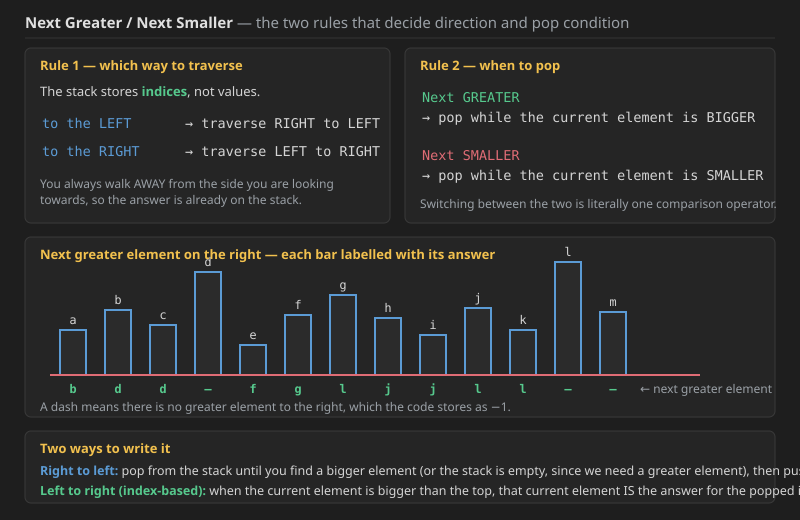
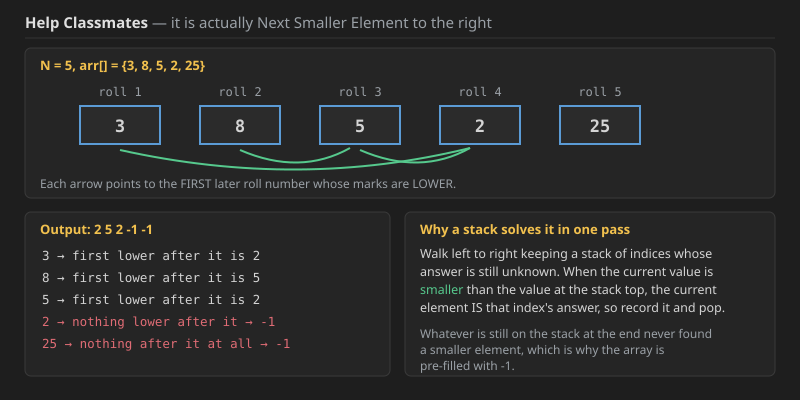
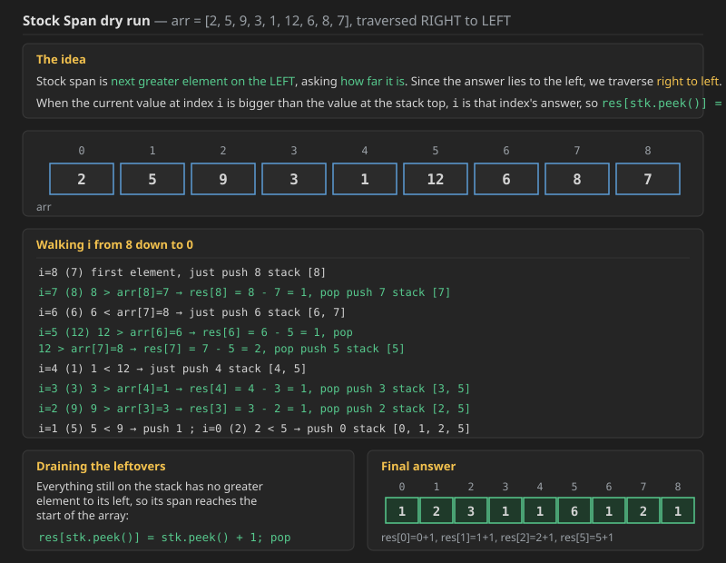
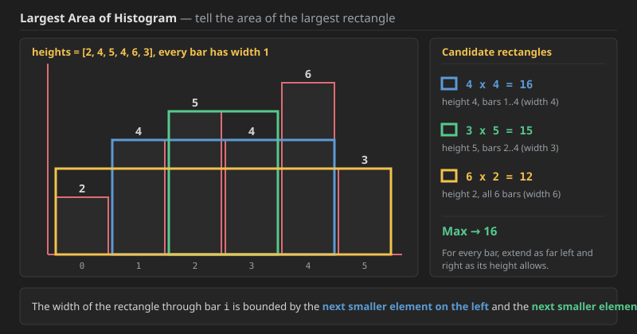
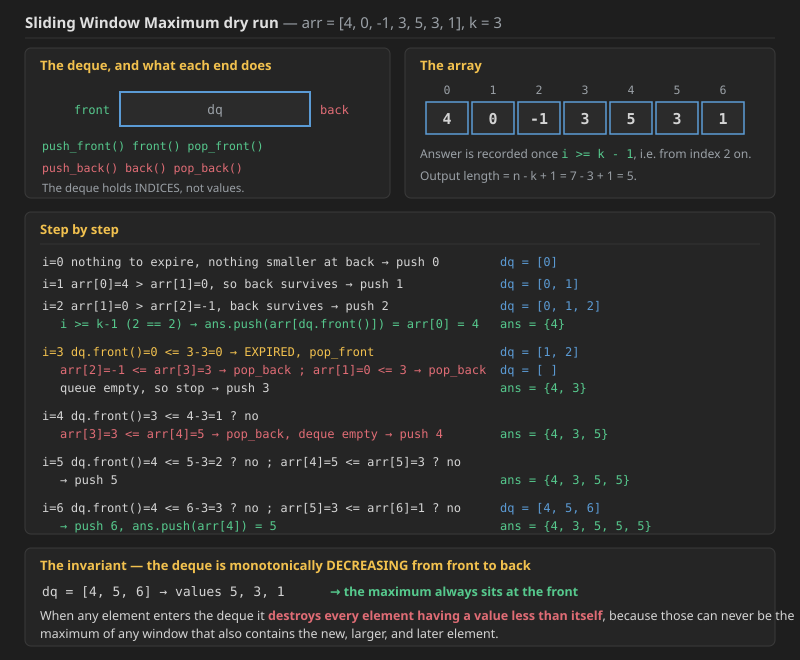

## Next Greater Element on the right

We have already done **next greater to the LEFT** in the previous lecture (in 001). In that approach you pop from the stack until you get a bigger element **or** you get an empty stack (a bigger element is what we need), and at the end you push the current element.



**A different approach** is to store the **index** rather than the value, walking **from left to right**. Whenever the current element is bigger than the element sitting at the top of the stack, that current element **is** the answer for the popped index, so record it and pop.

### The two rules worth memorising

**Remember: always store the INDEX, not the value.**

```text
answer lies to the LEFT   ->  traverse from RIGHT to LEFT
answer lies to the RIGHT  ->  traverse from LEFT to RIGHT

Next GREATER  ->  pop while the current element is BIGGER
Next SMALLER  ->  pop while the current element is SMALLER
```

That is the whole difference between the four variants: one direction flip and one comparison flip.

---

## Q1. Help Classmates


Professor X wants his students to help each other in the chemistry lab. He suggests that every student should help out a classmate who scored **less marks** than him in chemistry and whose **roll number appears after him**. But the students are lazy and they do not want to search too far. They each pick the **first** roll number after them that fits the criteria. Find the marks of the classmate that each student picks.

**Note:** one student may be selected by multiple classmates.

**This is actually the Next Smaller Element to the right.**



### Example 1

```text
Input:  N = 5, arr[] = {3, 8, 5, 2, 25}
Output: 2 5 2 -1 -1
Explanation:
1. Roll number 1 has 3 marks. The first person who has less marks than
   him is roll number 4, who has 2 marks.
2. Roll number 2 has 8 marks, he helps student with 5 marks.
3. Roll number 3 has 5 marks, he helps student with 2 marks.
4. Roll number 4 and 5 can not pick anyone as no student with higher
   roll number has lesser marks than them. This is denoted by -1.
Output shows the marks of the weaker student that each roll number
helps in order. ie- 2,5,2,-1,-1
```

### Your Task

You do not need to read input or print anything. Complete the function **help_classmate()** which takes the array `arr[]` and size of array `N` as input parameters and returns a list of numbers. If a student is unable to find anyone then output is `-1`.

* **Expected Time Complexity:** `O(N)`
* **Expected Auxiliary Space:** `O(N)`

### Constraints

* `1 <= N <= 5 * 10^5`


### Q1 solution — Java

```java
//User function Template for Java

class Solution {
    public static int[] help_classmate(int arr[], int n)
    {
        int[] res = new int[n];
        //next smaller to right so loop 0 to n
        for (int i = 0; i < n; i++) {
            res[i] = -1;
        }
        Stack<Integer> stk = new Stack<>();
        stk.push(0);
        for (int i = 1; i < n; i++) {
            if (stk.size() > 0 && arr[i] < arr[stk.peek()]) {
                while (stk.size() > 0 && arr[i] < arr[stk.peek()])
                {
                    res[stk.peek()] = arr[i];
                    stk.pop();
                }
            }
            stk.push(i);
        }

        return res;
    }
}
```

### Q1 solution

```cpp
class Solution {
public:
    vector<int> help_classmate(vector<int> arr, int n) {
        vector<int> res(n, -1);
        // next smaller to right so loop 0 to n

        stack<int> stk;
        stk.push(0);
        for (int i = 1; i < n; i++) {
            if (stk.size() > 0 && arr[i] < arr[stk.top()]) {
                while (stk.size() > 0 && arr[i] < arr[stk.top()]) {
                    res[stk.top()] = arr[i];
                    stk.pop();
                }
            }
            stk.push(i);
        }

        return res;
    }
};
```

**Complexity — Q1 (Help Classmates):**

* **Time — `O(N)`.** The outer `for` runs `N` times and the inner `while` looks nested, but it is **amortised**: every index is pushed onto the stack **exactly once** and popped **at most once**, so the total number of stack operations across the whole run is bounded by `2N`. That averages to `O(1)` per iteration.
* **Space — `O(N)`.** The stack holds at most `N` indices, which happens on a strictly increasing array where nothing is ever popped early. The result array is the required output, so it is not counted as auxiliary space.
* **Why the `if` before the `while` is redundant.** The `while` already tests the same condition, so the guard adds nothing except a wasted comparison. It is harmless, and the version further below drops it.
* **Why the array is pre-filled with `-1`.** Whatever is still on the stack when the loop ends never found a smaller element to its right, so `-1` is already the correct value for those indices and no draining loop is needed.

---

## Next Greater Element to the right — a simpler write-up

The simple next-greater-to-right code below is much shorter, and for the other three variations you only need to **change the loop direction** and, for "smaller", swap `>` for `<`.

**Java**

```java
public static int[] solve(int[] arr) {
    int[] res = new int[arr.length];
    for (int i = 0; i < res.length; i++) {
        res[i] = -1;
    }
    Stack<Integer> stk = new Stack<>();
    stk.push(0);
    for (int i = 1; i < arr.length; i++) {
        if (stk.size() > 0 && arr[i] > arr[stk.peek()]) {
            while (stk.size() > 0 && arr[i] > arr[stk.peek()]) {
                res[stk.peek()] = arr[i];
                stk.pop();
            }
        }
        stk.push(i);
    }
    return res;
}
```

**C++** (was missing; same logic as the Java above)

```cpp
vector<int> solve(vector<int>& arr) {
    int n = arr.size();
    vector<int> res(n, -1);

    stack<int> stk;
    stk.push(0);
    for (int i = 1; i < n; i++) {
        if (stk.size() > 0 && arr[i] > arr[stk.top()]) {
            while (stk.size() > 0 && arr[i] > arr[stk.top()]) {
                res[stk.top()] = arr[i];
                stk.pop();
            }
        }
        stk.push(i);
    }
    return res;
}
```

### Approach 2 — the same thing without the extra `if`

**Java**

```java
// solve
int[] ans = new int[arr.length];
Stack<Integer> st = new Stack<>();

st.push(0);
for (int i = 1; i < arr.length; i++) {
    while (st.size() > 0 && arr[i] >= arr[st.peek()]) {
        int pidx = st.pop();
        ans[pidx] = arr[i];
    }

    st.push(i);
}

while (st.size() > 0) {
    int pidx = st.pop();
    ans[pidx] = -1;
}

return ans;
```

**C++** (was missing; same logic as the Java above)

```cpp
// solve
vector<int> ans(arr.size());
stack<int> st;

st.push(0);
for (int i = 1; i < (int) arr.size(); i++) {
    while (st.size() > 0 && arr[i] >= arr[st.top()]) {
        int pidx = st.top();
        st.pop();
        ans[pidx] = arr[i];
    }

    st.push(i);
}

while (st.size() > 0) {
    int pidx = st.top();
    st.pop();
    ans[pidx] = -1;
}

return ans;
```

**It is also simple. You can use any one of them, but know both of the approaches.**

**Complexity — both approaches:** `O(N)` time and `O(N)` space, for exactly the reason given above: each index enters and leaves the stack at most once. Approach 2 pays an extra draining `while` at the end, but that loop also runs at most `N` times in total, so the bound is unchanged.

### Questions based on this pattern

```text
-> Stock Span
-> Sliding Window Maximum
-> Largest Area of Histogram
```

These are all based on the discussion done so far.

---

## Q2. Stock Span

**Stock span is the next greater element on the LEFT, asking how far it is.** Since the answer lies to the left, we traverse **right to left**.



### Dry run

```text
arr =  2   5   9   3   1   12   6   8   7
idx =  0   1   2   3   4    5   6   7   8
```

Walking `i` from `8` down to `0`:

```text
at index 8 (value 7)   push 8, as it is the first element index    stack [8]

at index 7 (value 8)   8 > 7  so  res[stk.peek()] = 8 - 7 = 1  and pop
                       then push(7)                                stack [7]

at index 6 (value 6)   6 < 8  so just push the index of 6, i.e. 6  stack [6, 7]

at index 5 (value 12)  12 > arr[6]  so  res[6] = 6 - 5 = 1  and pop()
                       12 > arr[7] = 8  so  res[7] = 7 - 5 = 2  and pop()
                       then push(5)                                stack [5]
                                                    ^ 5 is the index of 12

at index 4 (value 1)   1 < 12  so just push(4)                     stack [4, 5]

at index 3 (value 3)   3 > 1  so  res[4] = 4 - 3 = 1
                       and pop() and push(3)                       stack [3, 5]

at index 2 (value 9)   9 > 3  so pop 3 and res[3] = 3 - 2 = 1
                       and push(2)                                 stack [2, 5]

at index 1 (value 5)   5 < 9  so just push(1) on the stack         stack [1, 2, 5]

at index 0 (value 2)   2 < 5  so push(0)                           stack [0, 1, 2, 5]
```

The result array at this point:

```text
idx :  0    1    2    3    4    5    6    7    8
res : -1   -1   -1    1    1   -1    1    2    1
```

**Now all the elements that are still `-1` are on the stack**, so pop them from the stack and do `res[stk.peek()] = stk.peek() + 1;` and then `stk.pop()`, **till the stack gets empty**.

```text
res[0] = 0 + 1 = 1
res[1] = 1 + 1 = 2
res[2] = 2 + 1 = 3
res[5] = 5 + 1 = 6
```

**Final answer:**

```text
idx :  0    1    2    3    4    5    6    7    8
res :  1    2    3    1    1    6    1    2    1
```

### Q2 solution — Java

```java
public static int[] solve(int[] arr) {
    int[] res = new int[arr.length];
    Stack<Integer> stk = new Stack<>();
    stk.push(arr.length - 1);
    for (int i = arr.length - 2; i >= 0; i--) {
        if (stk.size() > 0 && arr[i] > arr[stk.peek()]) {
            while (stk.size() > 0 && arr[i] > arr[stk.peek()]) {
                res[stk.peek()] = stk.peek() - i;
                stk.pop();
            }
        }
        stk.push(i);
    }
    while (stk.size() > 0) {
        res[stk.peek()] = stk.peek() + 1;
        stk.pop();
    }
    return res;
}
```

### Q2 solution

```cpp
vector<int> solve(vector<int>& arr) {
    int n = arr.size();
    vector<int> res(n, 0);

    stack<int> stk;
    stk.push(n - 1);
    for (int i = n - 2; i >= 0; i--) {
        if (stk.size() > 0 && arr[i] > arr[stk.top()]) {
            while (stk.size() > 0 && arr[i] > arr[stk.top()]) {
                res[stk.top()] = stk.top() - i;
                stk.pop();
            }
        }
        stk.push(i);
    }
    while (stk.size() > 0) {
        res[stk.top()] = stk.top() + 1;
        stk.pop();
    }
    return res;
}
```

### The same thing written without the extra `if`

**Java**

```java
public static int[] solve(int[] arr) {
    int[] ans = new int[arr.length];
    Stack<Integer> st = new Stack<>();

    st.push(arr.length - 1);
    for (int i = arr.length - 2; i >= 0; i--) {
        while (st.size() > 0 && arr[i] >= arr[st.peek()]) {
            int pidx = st.pop();
            ans[pidx] = pidx - i;
        }

        st.push(i);
    }

    while (st.size() > 0) {
        int pidx = st.pop();
        ans[pidx] = pidx + 1;
    }

    return ans;
}
```

**C++** (was missing; same logic as the Java above)

```cpp
vector<int> solve(vector<int>& arr) {
    int n = arr.size();
    vector<int> ans(n, 0);
    stack<int> st;

    st.push(n - 1);
    for (int i = n - 2; i >= 0; i--) {
        while (st.size() > 0 && arr[i] >= arr[st.top()]) {
            int pidx = st.top();
            st.pop();
            ans[pidx] = pidx - i;
        }

        st.push(i);
    }

    while (st.size() > 0) {
        int pidx = st.top();
        st.pop();
        ans[pidx] = pidx + 1;
    }

    return ans;
}
```

**There is no need for the `if` before the `while`** in this version.

**Complexity — Q2 (Stock Span):**

* **Time — `O(N)`.** Same amortised argument: every index is pushed once and popped once across the entire run, so the inner `while` plus the final draining `while` together do at most `N` pops. Total work is `O(2N)`.
* **Space — `O(N)`.** The stack holds at most `N` indices, worst case a strictly decreasing array where nothing is popped until the drain at the end.
* **Why storing the index is what makes this work.** The question asks for a **distance**, not a value, and a distance can only be computed from positions. If the stack held values you would have to search for where that value lives, which would destroy the linear bound. This is the general lesson: **index-based is the better approach**, because from an index you can always reach the value, but not the other way round.

---

## The next question — Largest Area of Histogram

**Tell the area of the largest rectangle** that fits inside the histogram.



For `heights = [2, 4, 5, 4, 6, 3]` the candidate rectangles include:

```text
4 x 4 = 16
3 x 5 = 15
6 x 2 = 12
```

so the answer is **Max -> 16**.

The width of the rectangle through bar `i` is bounded by the **next smaller element on its left** and the **next smaller element on its right**, which is exactly why this reduces to the same monotonic-stack pattern.

 

## Q3. Sliding Window Maximum (LeetCode 239)


Explained in 013 Sliding window -04 window max and kadanes

You are given an array of integers `nums`, there is a sliding window of size `k` which is moving from the very left of the array to the very right. You can only see the `k` numbers in the window. Each time the sliding window moves right by one position.

Return *the max sliding window*.

### Example 1

```text
Input:  nums = [1,3,-1,-3,5,3,6,7], k = 3
Output: [3,3,5,5,6,7]
Explanation:
Window position                 Max
---------------                 -----
[1  3  -1] -3  5  3  6  7        3
 1 [3  -1  -3] 5  3  6  7        3
 1  3 [-1  -3  5] 3  6  7        5
 1  3  -1 [-3  5  3] 6  7        5
 1  3  -1  -3 [5  3  6] 7        6
 1  3  -1  -3  5 [3  6  7]       7
```

### Example 2

```text
Input:  nums = [1], k = 1
Output: [1]
```

### Constraints

* `1 <= nums.length <= 10^5`
* `-10^4 <= nums[i] <= 10^4`
* `1 <= k <= nums.length`

**Complexity — the brute force below:**

* **Time — `O(N x K)`.** The outer loop runs `N - K + 1` times, and for each window position the inner loop rescans all `K` elements to find the maximum. With `N = 10^5` and `K = N/2` that is about `2.5 x 10^9` operations, which will time out.
* **Space — `O(1)` auxiliary** (only `maxi`), plus `O(N - K + 1)` for the output.
* **What is wasted:** consecutive windows overlap in `K - 1` elements, so the brute force recomputes almost the same maximum every single time. The deque approach below removes exactly that redundancy.


## Brute 

```cpp
#include <bits/stdc++.h>
using namespace std;

class Solution {
public:
    // Function to get the maximum sliding window
    vector<int> maxSlidingWindow(vector<int> &arr, int k) {
        
        int n = arr.size(); // Size of array
        
        // To store the answer
        vector<int> ans;
        
        /* Traverse on the arrary 
        for valid window */
        for(int i=0; i <= n-k; i++) {
            
            // To store the maximum of the window
            int maxi = arr[i];
            
            // Traverse the window
            for(int j=i; j < i+k; j++) {
                // Update the maximum
                maxi = max(maxi, arr[j]);
            }
            
            // Add the maximum to the result
            ans.push_back(maxi);
        }
        
        // Return the stored result
        return ans;
    }
};

int main() {
    vector<int> arr = {4, 0, -1, 3, 5, 3, 6, 8};
    int k = 3;
    
    /* Creating an instance of 
    Solution class */
    Solution sol; 
    
    /* Function call to get the
    maximum sliding window */
    vector<int> ans = sol.maxSlidingWindow(arr, k);
    
    cout << "The maximum elements in the sliding window are: ";
    for(int i=0; i < ans.size(); i++) {
        cout << ans[i] << " ";
    }
    
    return 0;
}
```


## Optimal 
### The deque and what each end does



```text
        front  ---->  ______________________  <----  back
                              dq

  push_front()  ------>  ______________________  <------  push_back()
       front()  <-----   ______________________  ------>  back()
   pop_front()  <-----                            ------>  pop_back()
```

The deque holds **indices**, not values.

### Dry run

```text
k = 3

arr =  4   0   -1   3   5   3   1
idx =  0   1    2   3   4   5   6
```

**at index 0** — nothing to expire, nothing smaller at the back, so push:

```text
dq = 0
```

**at index 1** — `arr[0] = 4` is greater than `arr[1] = 0`, so the back survives, push:

```text
dq = 0, 1
```

**at index 2** — `arr[1] = 0` is greater than `arr[2] = -1`, so the back survives, push:

```text
dq = 0, 1, 2
```

Now `i >= k - 1`, and `2 == 2`, so:

```text
ans.push_back(arr[dq.front()])
ans = {4}
```

**at index 3**

```text
dq.front() <= 3 - 3        ->  0 == 0  yes
        ^i        ^k
dq.pop_front()                 dq = 1, 2
```

Now the while loop, `arr[dq.back()] <= arr[i]`:

```text
arr[2] <= arr[3]   yes  so  pop_back()
arr[1] <= arr[3]   yes  so  pop_back()
Now the queue is empty, so stop.

dq.push_back(i)                dq = 3
```

`i >= (k - 1)` so `ans.push_back(arr[dq.front()])`, giving:

```text
ans = {4, 3}
```

**at index 4**

```text
dq.front() <= i - k
3          <= 4 - 3
3          <= 1        no

arr[dq.back()] <= arr[i]  so pop_back, which empties the deque
dq.push_back(i)                dq = 4

i >= k - 1  so  ans.push_back(arr[dq.front()])
ans = {4, 3, 5}
```

**at index 5**

```text
dq.front() <= i - k
4          <= 5 - 3 = 2      no

arr[dq.back()] <= arr[i]  ->  arr[4] <= arr[5]   no

dq.push_back(i)                dq = 4, 5

i >= (k - 1)  yes  so  ans.push_back(arr[dq.front()])
ans = {4, 3, 5, 5}
```

**at index 6**

```text
dq.front() <= i - k
4          <= 6 - 3          no

arr[dq.back()] <= arr[i]     no

dq.push_back(i)                dq = 4, 5, 6

i >= k - 1
ans.push_back(arr[dq.front()])
ans = {4, 3, 5, 5, 5}
```

### The invariant

See, the queue is like:

```text
dq =  4,  5,  6
      -------------->
      monotonically decreasing from front to back
```

**Maximum element at the front.** When any element comes into the deque, **it destroys all elements having values less than itself**, because those can never be the maximum of any window that also contains this new and later element.

**Two things to note about the code below:**

* The window-expiry check uses `if` rather than `while`, and that is enough: exactly **one** index can fall out of the window per step, since `i` advances by one each iteration.
* The answer is recorded only from `i >= k - 1` onwards, because before that there is no complete window yet. The output therefore has `n - k + 1` entries.

### Java 

```java

import java.util.*;

class Solution {
    // Function to get the maximum sliding window
    public int[] maxSlidingWindow(int[] arr, int k) {
        
        int n = arr.length; // Size of array
        
        // To store the answer
        int[] ans = new int[n - k + 1];
        int ansIndex = 0;
        
        // Deque data structure
        Deque<Integer> dq = new LinkedList<>();
        
        // Traverse the array
        for (int i = 0; i < n; i++) {
            
            // Update deque to maintain current window
            if (!dq.isEmpty() && dq.peekFirst() <= (i - k)) {
                dq.pollFirst();
            }
            
            /* Maintain the monotonic (decreasing) 
            order of elements in deque */
            while (!dq.isEmpty() && arr[dq.peekLast()] <= arr[i]) {
                dq.pollLast();
            }
            
            // Add current element's index to the deque
            dq.offerLast(i);
            
            /* Store the maximum element from 
            the first window possible */
            if (i >= (k - 1)) {
                ans[ansIndex++] = arr[dq.peekFirst()];
            }
        }
        
        // Return the stored result
        return ans;
    }

    public static void main(String[] args) {
        int[] arr = {4, 0, -1, 3, 5, 3, 6, 8};
        int k = 3;
        
        /* Creating an instance of 
        Solution class */
        Solution sol = new Solution(); 
        
        /* Function call to get the
        maximum sliding window */
        int[] ans = sol.maxSlidingWindow(arr, k);
        
        System.out.print("The maximum elements in the sliding window are: ");
        for (int i = 0; i < ans.length; i++) {
            System.out.print(ans[i] + " ");
        }
    }
}

```

here even `LinkedList<Integer> dq = new LinkedList<>();` will work!!

###  cpp code

```cpp
#include <bits/stdc++.h>
using namespace std;

class Solution {
public:
    // Function to get the maximum sliding window
    vector<int> maxSlidingWindow(vector<int> &arr, int k) {
        
        int n = arr.size(); // Size of array
        
        // To store the answer
        vector<int> ans;
        
        // Deque data structure
        deque <int> dq;
        
        // Traverse the 
        for(int i=0; i < n; i++) {
            
            // Update deque to maintain current window
            if (!dq.empty() && dq.front() <= (i-k)) {
                dq.pop_front();
            }
            
            /* Maintain the monotonic (decreasing) 
            order of elements in deque */
            while (!dq.empty() && arr[dq.back()] <= arr[i]) {
                dq.pop_back();
            }
            
            // Add current elements index to the deque
            dq.push_back(i);
            
            /* Store the maximum element from 
            the first window possible */
            if (i >= (k-1)) {
                ans.push_back(arr[dq.front()]);
            }
        }
        
        // Return the stored result
        return ans;
    }
};

int main() {
    vector<int> arr = {4, 0, -1, 3, 5, 3, 6, 8};
    int k = 3;
    
    /* Creating an instance of 
    Solution class */
    Solution sol; 
    
    /* Function call to get the
    maximum sliding window */
    vector<int> ans = sol.maxSlidingWindow(arr, k);
    
    cout << "The maximum elements in the sliding window are: ";
    for(int i=0; i < ans.size(); i++) {
        cout << ans[i] << " ";
    }
    
    return 0;
}
```

### Here is the breakdown of the Time (TC) and Space (SC) complexity for this Monotonic Deque solution.

The short answer is **$O(N)$ Time** and **$O(K)$ Space**. Here is the "Senior Engineer" explanation of why (especially proving the time is not $N^2$).

### 1. Time Complexity: $O(N)$
At first glance, you see a `for` loop (runs $N$ times) and a `while` loop inside it. A Junior engineer might mistakenly call this $O(N^2)$.

**Why it is Linear ($O(N)$):**
* **The Amortized Analysis:** Look at the lifecycle of a single element (index `i`).
    * It enters the Deque **exactly once** (`dq.push_back(i)`).
    * It leaves the Deque **at most once** (either via `pop_back` when a larger neighbor comes, or `pop_front` when it expires).
* **Total Operations:** Since every element is pushed once and popped once, the total number of operations across the entire run is $2N$.
* **Average:** $2N / N = O(1)$ per iteration.

**Verdict:** The algorithm runs in **$O(N)$ linear time**.

### 2. Space Complexity: $O(K)$
The space is determined by how many elements we store in the deque at any given moment.

* **The Constraint:** The line `if (!dq.empty() && dq.front() <= (i-k))` guarantees that we remove any index that falls out of the current window of size $K$.
* **Worst Case:** In a strictly decreasing array (e.g., `5, 4, 3, 2, 1`), no element is ever popped from the back (because `arr[i]` is always smaller than `dq.back()`). In this specific case, the deque will store all $K$ elements of the current window.
* **Auxiliary Space:** The deque takes **$O(K)$** space.
    * *(Note: The output vector `ans` takes $O(N - K + 1)$ space, but we typically do not count the space required for the output in the complexity analysis unless asked.)*

### Summary Table

| Complexity | Value | Reason |
| :--- | :--- | :--- |
| **Time** | $O(N)$ | Each element is added and removed at most once. |
| **Space** | $O(K)$ | The Deque stores at most $K$ indices (the active window). |


# std::deque<int> Cheat Sheet

Here is the complete "Cheat Sheet" for the `std::deque<int>` container in C++.
Since you are using deque for the Sliding Window Maximum problem, the most important functions for you are in the **Element Access** and **Modifiers** sections.

### 1. Most Important (Sliding Window Essentials)
These are the only 4 functions you need for 90% of Deque problems.

| Function | Description | Time Complexity |
| :--- | :--- | :--- |
| `dq.push_back(x)` | Adds `x` to the end. | $O(1)$ |
| `dq.push_front(x)` | Adds `x` to the beginning. | $O(1)$ |
| `dq.pop_back()` | Removes the last element. | $O(1)$ |
| `dq.pop_front()` | Removes the first element. | $O(1)$ |
| `dq.front()` | Returns the first element (without removing). | $O(1)$ |
| `dq.back()` | Returns the last element (without removing). | $O(1)$ |

### 2. Element Access (Looking inside)

| Function | Description |
| :--- | :--- |
| `dq.at(i)` | Returns element at index `i` (with bounds checking). |
| `dq[i]` | Returns element at index `i` (faster, no checking). |
| `dq.front()` | Reference to the first element. |
| `dq.back()` | Reference to the last element. |

### 3. Capacity (Size and Empty check)

| Function | Description |
| :--- | :--- |
| `dq.empty()` | Returns `true` if deque is empty. |
| `dq.size()` | Returns the number of elements. |
| `dq.max_size()` | Returns max possible elements system can hold. |
| `dq.resize(n)` | Resizes the deque to contain `n` elements. |
| `dq.shrink_to_fit()` | Reduces memory usage to fit current size. |

### 4. Modifiers (Changing content)

| Function | Description |
| :--- | :--- |
| `dq.clear()` | Removes all elements. |
| `dq.insert(pos, x)` | Inserts `x` at iterator position `pos`. |
| `dq.erase(pos)` | Removes element at iterator position `pos`. |
| `dq.erase(start, end)` | Removes elements in range `[start, end)`. |
| `dq.emplace_back(args)` | Constructs element in-place at the end (Faster than push). |
| `dq.emplace_front(args)` | Constructs element in-place at the front. |
| `dq.swap(dq2)` | Swaps contents with another deque `dq2`. |

### 5. Iterators (Traversing)

| Function | Description |
| :--- | :--- |
| `dq.begin()` | Iterator to the first element. |
| `dq.end()` | Iterator to the element after the last. |
| `dq.rbegin()` | Reverse iterator to the last element. |
| `dq.rend()` | Reverse iterator to before the first. |

---

### Interview Tip: std::deque vs std::vector
* **Vector:** Elements are contiguous (next to each other). Adding to the front is slow ($O(N)$) because everything shifts.
* **Deque:** Elements are chunked. Adding to the front is fast ($O(1)$) because it just allocates a new chunk.

> **Rule of Thumb:** Use **Deque** when you need `push_front` / `pop_front`. Use **Vector** for everything else.


##   LinkedList<Integer> dq = new LinkedList<>() vs Deque<Integer> dq = new LinkedList<>()

This is a classic "Software Engineering" interview question: **"Programming to an Interface vs. Programming to an Implementation."**

In short: **Always use the second one** (`Deque<Integer> dq = ...`).

Here is the breakdown of why using the interface is the "Senior" choice.

### 1. The Comparison

| Feature | `LinkedList<Integer> dq` | `Deque<Integer> dq` |
| :--- | :--- | :--- |
| **Type** | Concrete Class (`LinkedList`) | Interface (`Deque`) |
| **Methods Available** | Everything. You can use `dq.get(5)`, `dq.set(2, 9)`, `dq.indexOf(3)`. | Restricted. You can **ONLY** use Deque methods (`addFirst`, `pollLast`, `peek`). |
| **Intent** | Unclear. *"Is this a list? A queue? A stack?"* | Crystal Clear. *"This is a Double-Ended Queue."* |
| **Flexibility** | Low. You are stuck with `LinkedList`. | High. You can swap the implementation later. |

### 2. Why Deque (The Interface) is Better
When you write `Deque<Integer> dq`, you are applying a constraint to yourself.

* **Safety:** You cannot accidentally call `dq.get(i)` (which is $O(N)$ in a Linked List and would ruin your time complexity). The compiler will stop you.
* **Portability:** If you later decide that `LinkedList` is too slow (because of memory overhead), you can change one line of code.


### 3. The "Senior" Optimization: Don't use LinkedList
For competitive programming and algorithm interviews, `LinkedList` is almost always the wrong choice for a Deque.

**Why?**
* **LinkedList:** Every element is a separate Object (Node) with `next` and `prev` pointers. This causes **Cache Misses** (CPU has to jump around memory) and extra Garbage Collection.
* **ArrayDeque:** Uses a resizable array (circular buffer). Elements are next to each other in memory. This is significantly faster due to **CPU Caching**.

### The Best Line of Code to Write:
```java
Deque<Integer> dq = new ArrayDeque<>();
```


