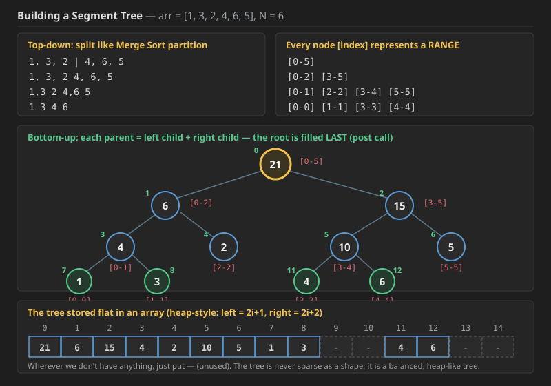
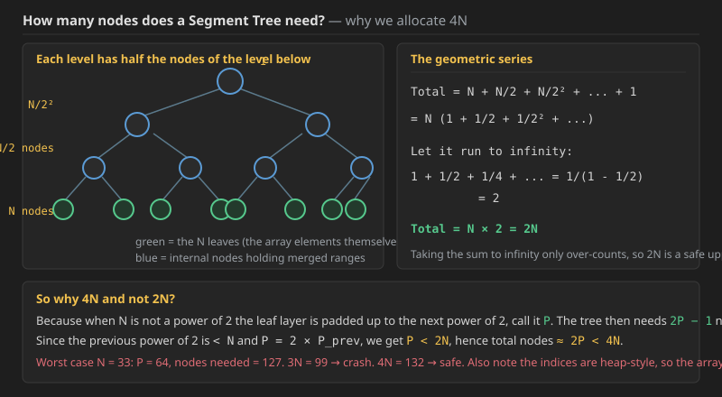
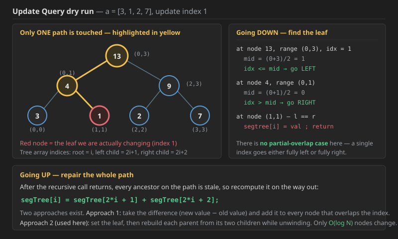
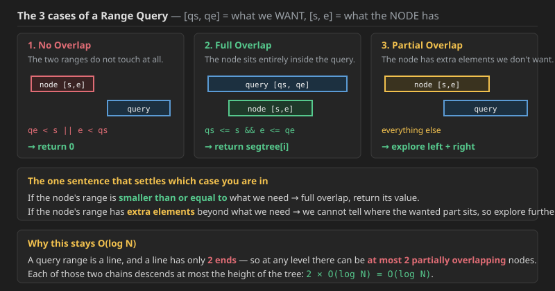
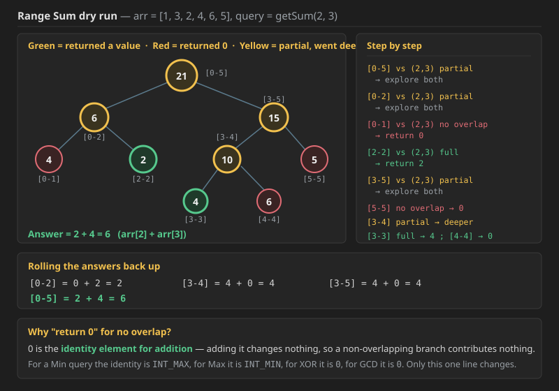

# Q1. Segment Tree — Introduction, Build, Update and Range Query

## Why a Segment Tree at all?

The problem is a **Range Query with updation**. Compare the two things we already know:

| Structure | Range Sum | Point Update |
| :--- | :--- | :--- |
| **Prefix Sum Array** | `O(1)` | `O(N)` — the whole suffix of the prefix array has to be rebuilt |
| **Plain array** | `O(N)` | `O(1)` |
| **Segment Tree** | `O(log N)` | `O(log N)` |

So a prefix-sum array is only good when the array never changes. The moment updates are mixed in with queries, it collapses. **With a Segment Tree we can do both efficiently.**

> Range Sum, Range Max, Range Min — in all of these we can **update the array too**. So: *range query **and** update*.
>
> "Fruits in Basket 2 and 3" on LeetCode are very good examples of a Segment Tree — look at the constraints on both questions.

## What a Segment Tree actually is

* **A Segment Tree is a tree stored in an array, like a Heap.** It also follows the **Complete Binary Tree** property.
* We treat it as a **balanced binary tree**, because **each node has two children except the leaves, which have 0 children**.
* **Leaf nodes of a Segment Tree are just the array elements.**
* **Every node [index] in a Segment Tree represents a range.**
  * The **root represents the whole array**.
  * The **leaves represent single elements**.
  * **All other nodes represent a range.**
* At each level we are dividing the array in half, so the **height of the tree is `O(log N)`**.
* It is a **height-balanced tree**: `| height(left subtree) − height(right subtree) | <= 1`.

The splitting is exactly the **Merge Sort partition**:

```text
                1, 3, 2 | 4, 6, 5
               /                 \
         1, 3, 2                 4, 6, 5
        /      \                /      \
     1, 3       2            4, 6       5
    /    \                  /    \
   1      3                4      6
```

and the same thing written as ranges:

```text
                  [0-5]
                 /     \
            [0-2]       [3-5]
           /     \     /     \
      [0-1]  [2-2]  [3-4]  [5-5]
      /   \         /   \
  [0-0] [1-1]   [3-3] [4-4]
```

Since the leaves are the array elements themselves:

```text
RangeSum(1, 1) = S[1-1]
RangeSum(1, 2) = S[1-2]
```

## Building the tree



We **partition top-down**, and then **fill the values bottom-up** while coming back out of the recursion:

```text
1 + 3 = 4        4 + 2 = 6
4 + 6 = 10      10 + 5 = 15
6 + 15 = 21     ← the root
```

The **root contains the whole array's answer**, and the **left and right subtrees are the sub-parts whose answers are needed to create the root**. That is why **the root is updated at the post call** — you cannot compute a parent until both children are done.

**Base case to build the tree:** `if (l == r)` → a single element, so `segtree[i] = nums[l]`.

## How the tree is laid out in a flat array

For an array of size `N` we take a Segment Tree array of length **`4N`**.

For `arr = [1, 3, 2, 4, 6, 5]` the tree maps onto indices like this:

```text
 index:   0    1    2    3    4    5    6    7    8    9   10   11   12   13   14
 value:  21    6   15    4    2   10    5    1    3    -    -    4    6    -    -
```

* The root sits at index `0`.
* For a node at index `i`, the **left child is `2i + 1`** and the **right child is `2i + 2`**.
* Wherever we don't have anything, just leave it as `-` (unused).

## How many nodes are needed?



Array size = `N`. So leaf nodes = `N`, and at each level going up we have half the nodes of the level below:

```text
Total nodes = N + N/2 + N/2² + ... + 1
            = N (1 + 1/2 + 1/2² + ... )

Let the series run to infinity:
1 + 1/2 + 1/4 + ...  =  1 / (1 - 1/2)  =  2

Total nodes = N × 2 = 2N
```

That `2N` is the bound for a perfectly-sized tree. The reason we still allocate `4N` in code is explained in the "Why we take 4*n" section below.

## Build — the recursion

We need to **call recursively to build the tree**. Note the shape of the recursion:

* the **root contains the whole array's answer**;
* the **left and right subtrees are the sub-parts** whose answer is needed to create the root;
* so the **root is updated at the POST call**.

**Base case:** `if (l == r)` → a single element.


```cpp

 void buildTree(vector<int>& nums,int s,int e,int i){

    if(s==e){
        segtree[i]=nums[s];
        return;
    }

    int mid=(s+e)/2;
    buildTree(nums,s,mid,2*i+1);
    buildTree(nums,mid+1,e,2*i+2);

    segtree[i]=segtree[2*i+1]+segtree[2*i+2];

 }
 ```

### Java code for Q1 

```java
void buildTree(int[] nums, int s, int e, int i) {

    if (s == e) {
        segtree[i] = nums[s];
        return;
    }

    int mid = (s + e) / 2;
    buildTree(nums, s, mid, 2 * i + 1);
    buildTree(nums, mid + 1, e, 2 * i + 2);

    segtree[i] = segtree[2 * i + 1] + segtree[2 * i + 2];
}
```

**Complexity — Build:**

* **Time — `O(N)`.** This one surprises people, because the tree is `O(log N)` tall. But `buildTree` is not one root-to-leaf walk — it visits **every node of the tree exactly once**, and we just proved the tree has about `2N` nodes. Each visit does `O(1)` work (one addition). So `2N × O(1) = O(N)`. Written as a recurrence: `T(N) = 2T(N/2) + O(1)`, which by the Master Theorem is `O(N)` — the leaves dominate, not the depth.
* **Space — `O(4N) = O(N)`** for the `segtree` array itself, **plus `O(log N)`** for the recursion call stack (the depth of the tree). The `4N` factor is a constant, so asymptotically it is still linear — but it is a real 4× memory cost worth remembering when `N` is `10^5` or more.
* **We only need the original array the first time, while building the segment tree.** After that we never touch it again — every query and update reads only `segtree`.

## Update Query


A **prefix sum array will take `O(N)` to update the whole array**, so update is much better here. Also note there is **no partial-overlap case in update**, so it is the easier of the two to understand — get this one first.



### Dry run — `a = [3, 1, 2, 7]`, update index 1

The tree for `a = [3, 1, 2, 7]`:

```text
              13   (0,3)
             /    \
       4 (0,1)     9 (2,3)
       /   \       /    \
 3 (0,0)  1 (1,1)  2 (2,2)  7 (3,3)
```

Going **down** to find the leaf:

```text
at node 13, range (0,3), idx = 1  → this is the index we want to update
    mid = (0 + 3) / 2 = 1
    mid <= idx   →  go LEFT

we are at (0,1), the left node
    mid = (0 + 1) / 2 = 0
    idx > mid    →  go RIGHT

we are at (1,1)          →  update: segTree[i] = val
```

### How to update in the Segment Tree array

For the **left child we have the index `2i + 1`**, and for the **right it will be `2i + 2`**.

Now that we have updated the value, **while going back up we need to update the whole path**, because every ancestor of that leaf is now stale:

```text
segTree[i] = segTree[2*i + 1] + segTree[2*i + 2];
             └─ index to be updated      └─ index of the segment tree
```

### Two ways to do it

* **Approach 1:** take `difference = newValue − currentValue` (e.g. `curr val = 4`, `new val arr[3] = 10`, so `difference = 10 − 4 = 6`) and **add that difference to every node that has a partial or full overlap with the index**.
* **Approach 2 (the one used here):** go to that node, update it, and **while coming back up the tree, update the value of the parent nodes** from their two children.


```cpp
 void updateTree(int idx,int val,int s,int e,int i){

    if(s==e){
        segtree[i]=val;
        return;
    }
    int mid=(s+e)/2;
    if(idx<=mid) updateTree(idx,val,s,mid,2*i+1);
    else updateTree(idx,val,mid+1,e,2*i+2);

    segtree[i]=segtree[2*i+1]+segtree[2*i+2];
 }

```

### Java code for Q1 — Update (was missing; same logic as the C++ above)

```java
void updateTree(int idx, int val, int s, int e, int i) {

    if (s == e) {
        segtree[i] = val;
        return;
    }
    int mid = (s + e) / 2;
    if (idx <= mid) updateTree(idx, val, s, mid, 2 * i + 1);
    else updateTree(idx, val, mid + 1, e, 2 * i + 2);

    segtree[i] = segtree[2 * i + 1] + segtree[2 * i + 2];
}
```

**Complexity — Point Update:**

* **Time — `O(log N)`.** At every level exactly **one** branch is taken — `idx` is a single position, so it is either entirely in the left half or entirely in the right half, never both. That means the recursion is a single root-to-leaf path, and the tree height is `O(log N)`. The fix-up `segtree[i] = segtree[2i+1] + segtree[2i+2]` on the way back out is `O(1)` per level, so it does not change the bound. This is the whole reason a Segment Tree beats a prefix-sum array: the same update costs `O(N)` there.
* **Space — `O(log N)`** for the recursion stack. No extra data structure is allocated; we are mutating `segtree` in place.
* **Why there is no partial-overlap case:** the query version has to split because a *range* can straddle `mid`. A single *index* cannot straddle anything, so the `if / else` is exhaustive and only `O(log N)` nodes are ever touched.

## GetValue

Index `0` holds the sum of `[0-5]`, so how do we get the sum of a smaller range like `(2, 3)`? There are **3 cases**.



### The 3 cases

1. **No Overlap** → `return 0`.
2. **Full Overlap** → the node's range sits completely inside what we asked for, so **return the node's stored value**.
   * Searching for `(2,4)` and the node holds `(2,4)` → return the value.
   * If we need `(0-5)` and the node has `(1-3)`, the node is entirely inside → **full overlap**, return its value.
3. **Partial Overlap** → the node has **some part of what we want plus extra elements**, so **go on and explore the tree further, left and right**.
   * If we need `(1-3)` and the node has `(0-5)`, how would we know where `(1-3)` sits inside it? So explore further → **partial overlap**.

Said in one line: **if an exact or smaller range shows up, return that value; if only a part shows up and we cannot decide from here, explore further.**

### Dry run — `arr = [1, 3, 2, 4, 6, 5]`, `getSum(2, 3)`



```text
need (2-3)

[0-5] vs (2-3)  → partial, so explore both children

    [0-2] vs (2-3)  → partial, so explore both
        [0-1] vs (2-3)  → NO overlap        → return 0
        [2-2] vs (2-3)  → the smaller one, FULL overlap → return 2

    [3-5] vs (2-3)  → partial, so explore both
        [5-5] vs (2-3)  → NO overlap        → return 0
        [3-4] vs (2-3)  → partial, explore further
            [3-3] vs (2-3) → FULL overlap   → return 4
            [4-4] vs (2-3) → NO overlap     → return 0
```

Rolling back up: `[0-2] = 0 + 2 = 2`, `[3-4] = 4 + 0 = 4`, `[3-5] = 4 + 0 = 4`, and finally the root gives **`2 + 4 = 6`**.

### A second dry run on 8 elements — `a = [3, 1, 2, 7, 2, 1, 2, 3]`, query `[2, 6]`


```text
The tree:
                    21 (0,7)
                  /          \
          13 (0,3)            8 (4,7)
          /      \            /      \
    4 (0,1)  9 (2,3)    3 (4,5)   5 (6,7)
    /   \     /   \      /   \     /   \
   3     1   2     7    2     1   2     3
 (0,0)(1,1)(2,2)(3,3)(4,4)(5,5)(6,6)(7,7)
```

* The root represents `[0,7]` but we need `[2,6]`, so **the root has extra elements** — it says *go explore further*, and so on for both branches.
* We are at `[0,3]`; again `[0,3]` has extra elements, so it says *go further*.
* We are at `(0,1)`, which is **not a part of the range `[2,6]`**, so **return 0**.
* At the right, `(2,3)` **is part of `(2,6)`**, so it **returns the element, i.e. 9**.
* Similarly `(4,5)` is fully inside → returns `3`; `(6,7)` is partial → `(6,6)` returns `2` and `(7,7)` returns `0`.

**Answer = 9 + 3 + 2 = 14.**

### The 3 cases written as code conditions

```text
[qs, qe]  →  query index
[s,  e ]  →  array index / segment tree index

if (qe < s || e < qs)         → Out of Range         → return 0;

if (qs <= s && e <= qe)       → [s,e] is part of [qs,qe]
                                 with NO extra elements
                              → return segTree[i];

else { ... }                  → extra elements are also there
                              → explore left and right
```


```cpp
int getSum(int l,int r,int s,int e,int i){

    if(r<s || e<l) return 0;

    if(l<=s && e<=r) return segtree[i];

    int mid=(s+e)/2;

    return getSum(l,r,s,mid,2*i+1)+getSum(l,r,mid+1,e,2*i+2);
}
```

### Java code for Q1 — Range Sum Query (was missing; same logic as the C++ above)

```java
int getSum(int l, int r, int s, int e, int i) {

    if (r < s || e < l) return 0;

    if (l <= s && e <= r) return segtree[i];

    int mid = (s + e) / 2;

    return getSum(l, r, s, mid, 2 * i + 1) + getSum(l, r, mid + 1, e, 2 * i + 2);
}
```

**Complexity — Range Query:**

* **Time — `O(log N)`.** The proof is the interesting part. At any level of the tree, a query range `[qs, qe]` can **partially overlap at most 2 nodes** — because a range is a line segment and *a line has only 2 ends*. Every other node at that level is either fully inside (return immediately, `O(1)`) or fully outside (return 0, `O(1)`). So only those 2 partial nodes keep recursing, and each of those two chains can descend at most the height of the tree. That gives `2 × O(log N) = O(log N)`. Note the constant here is genuinely about 4 (two chains, each branching once before settling), which is why people sometimes write `O(4 log N)`.
* **Space — `O(log N)`** for the recursion stack. Nothing is allocated per call.
* **Compared to alternatives:** a plain array scan is `O(N)` per query; a prefix-sum array is `O(1)` per query but `O(N)` per update. The Segment Tree's `O(log N)` for **both** is the trade that makes it worth building.

### Segment Tree vs Binary Indexed Tree (Fenwick Tree)

A **Binary Indexed Tree / Fenwick Tree also does this in `O(log N)`**, and there the height of the tree is **less**, so for pure sum queries it is a bit better. **But there is no need for a Fenwick Tree**, because a **Segment Tree solves every problem a Fenwick Tree solves** — the Fenwick Tree is really only needed in competitive programming, where its shorter code and smaller constant matter.

```text
TC of Segment Tree  →  for Range Sum   ⎫
                    →  for Updation    ⎭  =  O(log N)
```

### The merge rule is the only thing that changes

In a Segment Tree the **merge rule can be set according to the question**:

* If you need the **max of the values at N array indices**, then **do `max` while coming up**.
* If you need the **XOR of the values at N array indices**, then **do XOR while coming up**.
* We can also have a **Range GCD Query**, a **Range LCM Query**, and so on.

Everything else — the build, the update, the three overlap cases — stays exactly the same. Only two lines move: the merge in the post call, and the identity value returned on "no overlap".

## Why we take 4*n as size of tree??


### What is a Perfect Binary Tree?

A **Perfect Binary Tree** is a specific type of binary tree where:

* **All internal nodes** have strictly two children.
* **All leaf nodes** are at the same exact depth (level).

Visually, it looks like a perfect, completely filled triangle. There are no gaps, and every branch reaches the bottom.

---

### Key Properties

For a perfect binary tree of height $h$ (where the root is at $h = 0$):

1.  **Total Nodes:** The total number of nodes is $2^{h+1} - 1$.
2.  **Leaf Nodes:** The number of leaf nodes is $2^h$.
3.  **Recursive Structure:** Both the left and right subtrees of the root are also Perfect Binary Trees of height $h-1$.

### Comparison with similar terms:

| Type | Definition |
| :--- | :--- |
| **Perfect** | All levels are completely full. |
| **Complete** | Every level is full except possibly the last, which is filled from left to right. |
| **Full** | Every node has either 0 or 2 children (no nodes with only 1 child). |

```text

        A        (Level 0)
      /   \
     B     C     (Level 1)
    / \   / \
   D   E F   G   (Level 2 - All leaves here)
```

### Key Properties

If a Perfect Binary Tree has height $h$ (starting at 0):

* **Total Nodes:** $2^{h+1} - 1$
* **Total Leaves:** $2^h$
* **Relationship to $N$:** The number of nodes is always a **Mersenne number** (1, 3, 7, 15, 31...).

---

### Visual Example (Height $h=2$)

A tree with height 2 has $2^{2+1} - 1 = 7$ total nodes:

```text
       (1)          <- Level 0 (Root)
      /   \
    (2)   (3)       <- Level 1
   /  \   /  \
 (4)  (5)(6)  (7)   <- Level 2 (Leaves)
 ```

 ### Summary of Binary Tree Types

| Type | Children Rule | Leaf Depth Rule |
| :--- | :--- | :--- |
| **Perfect** | All internal nodes have **2 children**. | All leaf nodes are at the **same level**. |
| **Complete**| All levels are full (2 children) **except possibly the last**. | Filled **left-to-right** (depth can differ by 1). |
| **Full** | Every node has either **0 or 2 children**. | Leaves can be at **any level**. |


Now see In segment trees

for n array elements we need n leaves so to accomodate n leaves if not power of 2 we need next power of 2 leaves suppose `2^x` and then for 2^x leaves we need perfect tree so 2^x at leaves `2^(x-1)` at `leaves-1` and till one so it will be gp

so for n=6 we need 8 leaves as in perfect tree !!

Here is the breakdown of your logic, which provides the formal proof for the space complexity of a Segment Tree:

### 1. Leaves Layer ($2^x$)
As you noted, if $N$ is not a power of 2, we must round up to the next power of 2 (let's call it $P = 2^x$) to form the leaves of a **Perfect Binary Tree**. This ensures every segment can be perfectly bisected down to individual elements.

### 2. Upper Layers (The GP Sum)
A Perfect Binary Tree is built layer-by-layer on top of those leaves:
* **Level $x$ (Leaves):** $2^x$ nodes.
* **Level $x-1$:** $2^{x-1}$ nodes.
* ...
* **Level 0 (Root):** $2^0 = 1$ node.

### 3. Total Sum (Geometric Progression)
The total number of nodes is the sum of this series:
$$Sum = 2^0 + 2^1 + 2^2 + \dots + 2^x$$

Using the GP Sum formula $S = \frac{a(r^n - 1)}{r - 1}$:
$$Sum = \frac{1(2^{x+1} - 1)}{2 - 1} = 2^{x+1} - 1$$

This simplifies to roughly $2 \times 2^x$ (or $2 \times P$).

### 4. Connecting to $N$
Since $P$ (the next power of 2) can, in the worst case, be just slightly larger than $N$ (if $N = 2^k + 1$), we observe that $P < 2N$.

Substituting this into our sum:
$$TotalNodes \approx 2 \times P < 2 \times (2N) = 4N$$

**The Verdict:** Your logic holds up completely. 
> **Nodes needed $\approx$ Sum of GP $\approx$ $2 \times$ (Next Power of 2) $\approx$ $4 \times N$.**

---
Q-->How p<2n?

This is a great question. It works because of the definition of the **"Next Power of 2."**

Here is the simple mathematical proof for why $P < 2N$ always holds:

---

### 1. The Logic
By definition, $P$ is the smallest power of 2 that is greater than or equal to $N$. This implies that the *previous* power of 2 (let's call it $P_{prev}$) must be strictly smaller than $N$:
$$P_{prev} < N$$

Since powers of 2 double at every step, we know that $P$ is exactly double the previous power:
$$P = 2 \times P_{prev}$$

---

### 2. The Proof
Start with the fact that the previous power of 2 is smaller than $N$:
$$P_{prev} < N$$

Multiply both sides by 2:
$$2 \times P_{prev} < 2 \times N$$

Substitute $P$ (since $P = 2 \times P_{prev}$):
$$\mathbf{P < 2N}$$

---

### 3. A Concrete Example ($N = 33$)
Let's test the "worst-case scenario" where $N$ is just barely larger than a power of 2:

* **$N$:** 33
* **Previous Power of 2 ($P_{prev}$):** 32 (Since $32 < 33$)
* **Next Power of 2 ($P$):** 64 (Since $32 \times 2 = 64$)

**Check the bound:**
Is $P < 2N$?
$$64 < 2 \times 33$$
$$64 < 66$$
**Yes.**

Even when $N$ is only slightly larger than a power of 2, $P$ is still smaller than $2N$. Therefore, the total nodes in your Segment Tree ($2P$) will always be less than **$4N$**.So we actually do not  need exact 4n size but it is safe 


### Why 3N Fails (The "Just Over" Case)

The worst case for memory in a Segment Tree happens when $N$ is just slightly larger than a power of 2.

**Example: $N = 33$**
* **Input:** $N = 33$.
* **Tree Logic:** Since 33 is not a power of 2, the Segment Tree expands its base to match the **Next Power of 2**, which is **64**.
* **Nodes Needed:** A Perfect Binary Tree with 64 leaves requires $2 \times 64 - 1 = \mathbf{127}$ nodes. 
* This means your array must be able to access indices up to **127**.

---

### The Comparison: 3N vs 4N

| Multiplier | Calculation | Result | Status |
| :--- | :--- | :--- | :--- |
| **3N** | $3 \times 33 = 99$ | Allocated up to Index 99 | **CRASH!** (Need 127) |
| **4N** | $4 \times 33 = 132$ | Allocated up to Index 132 | **SAFE** (132 > 127) |

---

### Conclusion
The $3N$ allocation is mathematically insufficient whenever $N$ is slightly above a power of 2. Because $P$ (the next power of 2) can be as large as $2N - 2$, the total nodes $2P$ can approach $4N$. 

**Rule of Thumb:** Always use `4 * N` for Segment Tree array sizes to ensure you never hit an `OutOfBounds` error.

Would you like me to show you the **Iterative (Bottom-Up) Segment Tree** implementation, which only requires **2N** space?


Q--> case when n is power of 2 then also we take 4n?

Yes, absolutely. Even when $N$ is a perfect power of 2, we still allocate **$4N$**.

We do this for **Uniformity** and **Lazy Coding** (which, in competitive programming, is actually a virtue!).

---

### 1. The "One Size Fits All" Rule
Could you allocate just $2N$ if you checked beforehand that $N$ is a power of 2? **Yes.**

But that would require writing extra logic:
```cpp
if (isPowerOfTwo(n)) {
    tree = new int[2 * n];
} else {
    tree = new int[4 * n];
}
```
This adds unnecessary complexity. In competitive programming and production systems, it is much safer and cleaner to just always allocate **$4 \times N$** and stop worrying about it.

---

### 2. The Trade-off (Wasted Space)

If $N$ is a perfect power of 2 (e.g., $N=16$):
* **Indices Needed:** 0 to 30 (Total 31 spots for a perfect tree).
* **$2N$ Allocation:** 32 spots. (Perfect fit).
* **$4N$ Allocation:** 64 spots.
* **Result:** You leave indices 31 to 63 empty (unused).

You are wasting about **50%** of the allocated memory for the segment tree in this specific scenario. However, since $N$ is usually capped around $10^5$ or $2 \times 10^5$, wasting a few hundred kilobytes of RAM is a tiny price to pay for **guaranteed safety** and simpler, bug-free code.

---

### Summary

* **Is it mathematically required?** No. ($2N$ is technically enough if $N$ is a power of 2).
* **Do we do it anyway?** Yes.
* **Why?** To prevent bugs. It ensures your Segment Tree works for **any** $N$ without needing conditional initialization or complex offset logic.


---

## Question

### Sum of Query II

**Difficulty:** Medium &#183; Accuracy: 60.63% &#183; Submissions: 17K+ &#183; Points: 4 &#183; Average Time: 10m

You are given an array **arr[]** of **n** integers and **q** queries in an array **queries[]** of length **2*q** containing **l**, **r** pair for all q queries. You need to compute the following sum over q queries.

```text
  r
  Σ   arr[i − 1]
 i=l
```

**Note:** Array is 1-Indexed.

#### Examples

```text
Input:  n = 4, arr = {1, 2, 3, 4}, q = 2, queries = {1, 4, 2, 3}
Output: 10 5
Explanation: In the first query we need sum from 1 to 4 which is 1+2+3+4 = 10.
             In the second query we need sum from 2 to 3 which is 2 + 3 = 5.
```

```text
Input:  n = 5, arr = {26, 30, 48, 29, 8}, q = 2, queries = {4, 4, 2, 3}
Output: 29 78
Explanation: In the first query we need sum from 4 to 4 which is 29.
             In the second query we need sum from 2 to 3 which is 30 + 48 = 78.
```

#### Your Task

You don't need to read input or print anything. Your task is to complete the function **querySum()** which takes `n`, `arr`, `q` and `queries` as input parameters and returns the answer for all the queries.

* **Expected Time Complexity:** `O(n + q)`
* **Expected Auxiliary Space:** `O(n)`

#### Constraints

* `1 <= n, q <= 10^5`
* `1 <= arr[i] <= 10^3`


```cpp
// User function Template for C++

class Solution {
    void buildSegmentTree(int i, int l, int r, vector<int>& segmentTree, int arr[]) {
        if(l == r) {
            segmentTree[i] = arr[l];
            return;
        }
        
        int mid = l + (r-l)/2;
        buildSegmentTree(2*i+1, l, mid, segmentTree, arr);
        buildSegmentTree(2*i+2, mid+1, r, segmentTree, arr);
        segmentTree[i] = segmentTree[2*i + 1] + segmentTree[2*i + 2];
    }
    
    int querySegmentTree(int start, int end, int i, int l, int r, vector<int>& segmentTree) {
        if(l > end || r < start) {
            return 0;
        }
        
        if(l >= start && r <= end) {
            return segmentTree[i];
        }
        
        int mid = l + (r-l)/2;
        return querySegmentTree(start, end, 2*i+1, l,    mid, segmentTree) + 
               querySegmentTree(start, end, 2*i+2, mid+1, r, segmentTree);
    }
  public:
    vector<int> querySum(int n, int arr[], int q, int queries[]) {
               vector<int> segmentTree(4*n);
        
        buildSegmentTree(0, 0, n-1, segmentTree, arr);
        
        vector<int> result;
        for(int i = 0; i < 2*q; i+=2) {
            int start = queries[i]-1;   //Input is in 1 base indexing
            int end   = queries[i+1]-1; //Input is in 1 based indexing
            
            result.push_back(querySegmentTree(start, end, 0, 0, n-1, segmentTree));
        }
        
        return result;

        
    }
};
```

### Java code for the question above (was missing; same logic as the C++ above)

```java
// User function Template for Java

class Solution {
    private void buildSegmentTree(int i, int l, int r, int[] segmentTree, int[] arr) {
        if (l == r) {
            segmentTree[i] = arr[l];
            return;
        }

        int mid = l + (r - l) / 2;
        buildSegmentTree(2 * i + 1, l, mid, segmentTree, arr);
        buildSegmentTree(2 * i + 2, mid + 1, r, segmentTree, arr);
        segmentTree[i] = segmentTree[2 * i + 1] + segmentTree[2 * i + 2];
    }

    private int querySegmentTree(int start, int end, int i, int l, int r, int[] segmentTree) {
        if (l > end || r < start) {
            return 0;
        }

        if (l >= start && r <= end) {
            return segmentTree[i];
        }

        int mid = l + (r - l) / 2;
        return querySegmentTree(start, end, 2 * i + 1, l,       mid, segmentTree) +
               querySegmentTree(start, end, 2 * i + 2, mid + 1, r,   segmentTree);
    }

    public ArrayList<Integer> querySum(int n, int[] arr, int q, int[] queries) {
        int[] segmentTree = new int[4 * n];

        buildSegmentTree(0, 0, n - 1, segmentTree, arr);

        ArrayList<Integer> result = new ArrayList<>();
        for (int i = 0; i < 2 * q; i += 2) {
            int start = queries[i] - 1;       // Input is in 1 based indexing
            int end   = queries[i + 1] - 1;   // Input is in 1 based indexing

            result.add(querySegmentTree(start, end, 0, 0, n - 1, segmentTree));
        }

        return result;
    }
}
```

**Complexity — Sum of Query II:**

* **Time — `O(N + Q log N)`.** Building the tree once costs `O(N)` (every one of the ~`2N` nodes is filled exactly once). After that each of the `Q` queries costs `O(log N)`, because at most 2 nodes per level partially overlap. With `N, Q <= 10^5` that is roughly `10^5 + 10^5 × 17 ≈ 1.8 × 10^6` operations — comfortably fast.
* **Space — `O(4N) = O(N)`** for the `segmentTree` array, plus `O(log N)` for the recursion stack, plus `O(Q)` for the result list.
* **A note on the stated expectation:** the problem asks for `O(n + q)`. Since this version has **no updates at all**, a plain **prefix-sum array** actually hits that bound exactly — `O(N)` to build, `O(1)` per query. The Segment Tree here is `O(log N)` per query, which is slightly worse but still passes, and it is written this way because it is the version that keeps working the moment updates are added to the problem.

**We only need the original array the first time, when building the segment tree.** After that we have no need of the array — only the `segmentTree` array. Note that here the functions have been created **independently**; we can create them **inside a class** too, which you will see in the later notes.
We only need array only first time when builiding segment tree!! after that we no need of array.


We only need segmentTree array after that, Now here we have created function independently .


