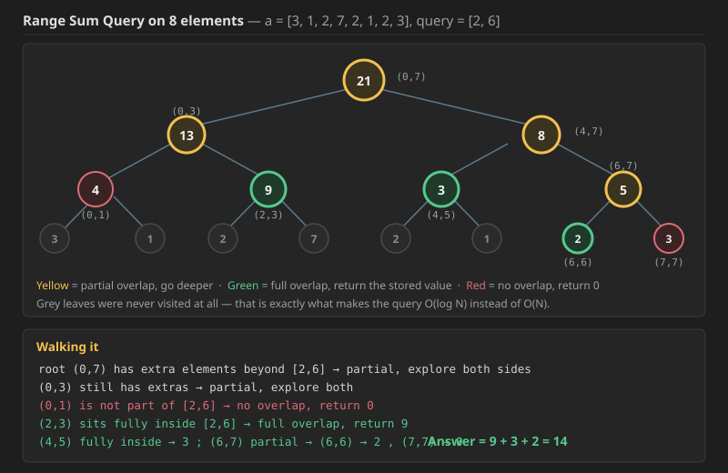

# Q1. Range Sum Query - Mutable

Link--> https://leetcode.com/problems/range-sum-query-mutable/


Given an integer array `nums`, handle multiple queries of the following types:

1.  **Update** the value of an element in `nums`.
2.  Calculate the **sum** of the elements of `nums` between indices `left` and `right` **inclusive** where `left <= right`.

Implement the `NumArray` class:

* `NumArray(int[] nums)` Initializes the object with the integer array `nums`.
* `void update(int index, int val)` Updates the value of `nums[index]` to be `val`.
* `int sumRange(int left, int right)` Returns the sum of the elements of `nums` between indices `left` and `right` inclusive (i.e., `nums[left] + nums[left + 1] + ... + nums[right]`).

---

### Example 1:

**Input:**
`["NumArray", "sumRange", "update", "sumRange"]`
`[[[1, 3, 5]], [0, 2], [1, 2], [0, 2]]`

**Output:**
`[null, 9, null, 8]`

**Explanation:**
```cpp
NumArray numArray = new NumArray([1, 3, 5]);
numArray.sumRange(0, 2); // return 1 + 3 + 5 = 9
numArray.update(1, 2);   // nums = [1, 2, 5]
numArray.sumRange(0, 2); // return 1 + 2 + 5 = 8
```
### Constraints Summary

| Parameter | Constraint |
| :--- | :--- |
| **Array Length (`nums.length`)** | $1 \le n \le 3 \times 10^4$ |
| **Element Value (`nums[i]`)** | $-100 \le \text{val} \le 100$ |
| **Update Index** | $0 \le \text{index} < n$ |
| **Range Indices** | $0 \le \text{left} \le \text{right} < n$ |
| **Total API Calls** | Up to $3 \times 10^4$ calls |

---

### Complexity Requirements

Given that both $N$ and the number of queries $Q$ are up to $3 \times 10^4$, a naive $O(N)$ approach for `sumRange` would result in $O(N \times Q) \approx 9 \times 10^8$ operations, which will likely **TLE** (Time Limit Exceeded).

To pass within the time limits, you need an approach where both **Update** and **Query** are efficient:

| Data Structure | Query Time | Update Time | Space Complexity |
| :--- | :--- | :--- | :--- |
| **Prefix Sum** | $O(1)$ | $O(N)$ | $O(N)$ |
| **Segment Tree** | $O(\log N)$ | $O(\log N)$ | $O(4N)$ |
| **Fenwick Tree (BIT)**| $O(\log N)$ | $O(\log N)$ | $O(N)$ |

**Recommendation:** Since we need point updates and range sums, a **Fenwick Tree** is the most code-efficient solution, while a **Segment Tree** is more versatile for other types of range queries (like range max/min).

```cpp
class NumArray {
    vector<int> segtree;
    int n;

    void buildTree(vector<int>& nums, int s, int e, int i) {
        if (s == e) {
            segtree[i] = nums[s];
            return;
        }
        int mid = s + (e - s) / 2;
        buildTree(nums, s, mid, 2 * i + 1);
        buildTree(nums, mid + 1, e, 2 * i + 2);
        segtree[i] = segtree[2 * i + 1] + segtree[2 * i + 2];
    }

    void updateTree(int idx, int val, int s, int e, int i) {
        if (s == e) {
            segtree[i] = val;
            return;
        }
        int mid = s + (e - s) / 2;
        if (idx <= mid) updateTree(idx, val, s, mid, 2 * i + 1);
        else updateTree(idx, val, mid + 1, e, 2 * i + 2);
        segtree[i] = segtree[2 * i + 1] + segtree[2 * i + 2];
    }

    int getSum(int qs, int qe, int s, int e, int i) {
        if (qe < s || e < qs) return 0; // No overlap
        if (qs <= s && e <= qe) return segtree[i]; // Total overlap

        int mid = s + (e - s) / 2;
        return getSum(qs, qe, s, mid, 2 * i + 1) + getSum(qs, qe, mid + 1, e, 2 * i + 2);
    }

public:
    NumArray(vector<int>& nums) {
        n = nums.size();
        if (n > 0) {
            segtree.assign(4 * n, 0);
            buildTree(nums, 0, n - 1, 0);
        }
    }

    void update(int index, int val) {
        if (n > 0) updateTree(index, val, 0, n - 1, 0);
    }

    int sumRange(int left, int right) {
        if (n == 0) return 0;
        return getSum(left, right, 0, n - 1, 0);
    }
};

/**
 * Your NumArray object will be instantiated and called as such:
 * NumArray* obj = new NumArray(nums);
 * obj->update(index,val);
 * int param_2 = obj->sumRange(left,right);
 */
 ```

### Java code for Q1 (was missing; same logic as the C++ above)

```java
class NumArray {
    private int[] segtree;
    private int n;

    private void buildTree(int[] nums, int s, int e, int i) {
        if (s == e) {
            segtree[i] = nums[s];
            return;
        }
        int mid = s + (e - s) / 2;
        buildTree(nums, s, mid, 2 * i + 1);
        buildTree(nums, mid + 1, e, 2 * i + 2);
        segtree[i] = segtree[2 * i + 1] + segtree[2 * i + 2];
    }

    private void updateTree(int idx, int val, int s, int e, int i) {
        if (s == e) {
            segtree[i] = val;
            return;
        }
        int mid = s + (e - s) / 2;
        if (idx <= mid) updateTree(idx, val, s, mid, 2 * i + 1);
        else updateTree(idx, val, mid + 1, e, 2 * i + 2);
        segtree[i] = segtree[2 * i + 1] + segtree[2 * i + 2];
    }

    private int getSum(int qs, int qe, int s, int e, int i) {
        if (qe < s || e < qs) return 0;              // No overlap
        if (qs <= s && e <= qe) return segtree[i];   // Total overlap

        int mid = s + (e - s) / 2;
        return getSum(qs, qe, s, mid, 2 * i + 1) + getSum(qs, qe, mid + 1, e, 2 * i + 2);
    }

    public NumArray(int[] nums) {
        n = nums.length;
        if (n > 0) {
            segtree = new int[4 * n];
            buildTree(nums, 0, n - 1, 0);
        }
    }

    public void update(int index, int val) {
        if (n > 0) updateTree(index, val, 0, n - 1, 0);
    }

    public int sumRange(int left, int right) {
        if (n == 0) return 0;
        return getSum(left, right, 0, n - 1, 0);
    }
}

/**
 * Your NumArray object will be instantiated and called as such:
 * NumArray obj = new NumArray(nums);
 * obj.update(index, val);
 * int param_2 = obj.sumRange(left, right);
 */
```

**Complexity — Q1 (Range Sum Query - Mutable):**

* **Constructor — Time `O(N)`, Space `O(4N) = O(N)`.** `buildTree` touches every one of the roughly `2N` tree nodes exactly once, doing `O(1)` work each. It is *not* `O(N log N)` — the recurrence is `T(N) = 2T(N/2) + O(1)`, whose leaves dominate. The `4N` allocation is the safe upper bound for heap-style indexing (see the derivation in the intro notes).
* **`update` — Time `O(log N)`, Space `O(log N)` stack.** A single index goes entirely left or entirely right at every node, so exactly one root-to-leaf path is walked. On the way back out each ancestor is recomputed in `O(1)`. This is precisely where a prefix-sum array loses: the same update costs it `O(N)`.
* **`sumRange` — Time `O(log N)`, Space `O(log N)` stack.** At each level at most **2 nodes** can partially overlap the query, because a range is a line and a line has only 2 ends. Everything else terminates immediately (full overlap → return stored value, no overlap → return 0). Two chains of depth `log N` gives `O(log N)`.
* **Why this passes the constraints:** with `N` and the call count both up to `3 × 10^4`, a naive `O(N)` `sumRange` would be about `9 × 10^8` operations and TLE. At `O(log N) ≈ 15` per call, the total is around `4.5 × 10^5` — trivially fast.
### The three conditions, written out

```text
[qs, qe]  →  query index
[s,  e ]  →  array index / segment tree index

if (qe < s || e < qs)          →  Out of Range
                                  return 0;

if (qs <= s && e <= qe)        →  [s, e] is part of [qs, qe]
                                  with NO extra elements
                                  return segTree[i];

else { ... }                   →  extra elements are also there
                                  so explore left and right
```

**Time Complexity.** In the worst case there can be **at most 2 partial overlaps**, so only 2 times do we need to divide, and in such a case we need to go down to the leaf — giving **`O(log N)`**.

 ## Segment Tree Query: The "Search and Combine" Mission

The `sumRange` query works by decomposing your target range $[L, R]$ into a few precomputed "blocks" (nodes) that already exist in the tree. Instead of summing every single index, you are just summing the values of a few strategic nodes.

---

### 1. The Three Scenarios (Node vs. Target)
When the algorithm visits a node covering range $[S, E]$, it makes a decision based on how it overlaps with your target $[L, R]$:

* **No Overlap (The "Dead End"):** * *Condition:* $E < L$ or $S > R$.
    * *Action:* Return **0**. This branch of the tree contains nothing useful for your sum.
* **Total Overlap (The "Shortcut"):** * *Condition:* $L \le S$ and $E \le R$.
    * *Action:* Return **the value stored in the node**. You’ve found a perfect "block" that fits entirely inside your target.
* **Partial Overlap (The "Split"):** * *Condition:* Neither of the above.
    * *Action:* **Split the search.** Query the left child and the right child, then return their sum.

Here are the visual diagrams for the three cases (qs, qe vs s, e) in a Segment Tree query.

1. Total Overlap
Condition: qs <= s && e <= qe The node's range (s to e) is completely inside the query range (qs to qe). Action: Return the node's value immediately. We take the whole "puzzle piece."

[qs,qe] chahie uska ek chota part mil gya [s,e] se so voh return kr dia!!!

```text

Query Range [qs, qe]:      qs |-----------------------------------| qe
                              (I need the sum of all this)

Node Range [s, e]:                   s |----------| e
                              (I fit completely inside! Take me.)
```
2. No Overlap
Condition: qe < s || e < qs The node's range is completely outside the query range. They do not touch. Action: Return 0. This node contributes nothing.

Case A: Node is too far right

```text
Query Range [qs, qe]:    qs |-------| qe

Node Range [s, e]:                          s |-------| e
                                       (Way out here, useless)

```
Case B: Node is too far left
```text
Query Range [qs, qe]:                          qs |-------| qe

Node Range [s, e]:       s |-------| e
                      (Way out here, useless)
```
3. Partial Overlap
Condition: Everything else (Recursive Step) The node's range partially overlaps with the query range. Action: We cannot simply take the whole node. We must split (mid) and ask the children to check which specific parts are valid.

Case A: Overlap on the right side
```text
Query Range [qs, qe]:             qs |----------------------| qe

Node Range [s, e]:       s |----------------| e
                           (Only this part overlaps)


```
Case B: Overlap on the left side
```text
Query Range [qs, qe]:    qs |-----------------------| qe

Node Range [s, e]:                      s |-----------------| e
                                          (Only this part overlaps)


```
Case C: Query is inside the Node
```text

Query Range [qs, qe]:             qs |-----| qe

Node Range [s, e]:       s |--------------------------| e
                           (The query is smaller than me. I must look deeper.)

```
---

### 2. Walkthrough: Querying Range [2, 6]
Imagine an array of size 8 (indices 0–7). You want the sum from **2 to 6**.

1.  **Root (0–7):** Overlaps partially. **Split.**
2.  **Left Child (0–3):** Overlaps partially. **Split.**
    * **Node (0–1):** No overlap. Returns **0**.
    * **Node (2–3):** **Total overlap!** Returns precomputed sum of index 2 and 3.
3.  **Right Child (4–7):** Overlaps partially. **Split.**
    * **Node (4–5):** **Total overlap!** Returns precomputed sum of index 4 and 5.
    * **Node (6–7):** Overlaps partially. **Split.**
        * **Node (6):** **Total overlap!** Returns value at index 6.
        * **Node (7):** No overlap. Returns **0**.

**Final Result:** `Sum(2-3) + Sum(4-5) + Val(6)`. You only had to touch 3 "summary" nodes instead of 5 individual elements.



With `a = [3, 1, 2, 7, 2, 1, 2, 3]` the three surviving nodes are `Sum(2-3) = 9`, `Sum(4-5) = 3` and `Val(6) = 2`, so the answer is **14**.


---

### 3. Efficiency: Why $O(\log N)$?
In a standard array, a range sum could take $O(N)$ time if you have to visit every element. In a Segment Tree:
* The tree height is $\log N$.
* At each level, you visit at most **4 nodes**.
* This ensures that even for an array of 1,000,000 elements, you only need to look at about 60–80 nodes to find any range sum.
Sometimes no need of update so can use this way 


## How to Remember Segment Tree Query Conditions

The easiest way to remember these is to think of it as a **"Security Checkpoint"** where the node has to prove its relationship to your target range $[L, R]$.

---

### 1. The "Out of Bounds" Check (No Overlap)
**Logic:** If the node's territory is entirely to the left of your target, or entirely to the right, it’s useless.
* **Mnemonic:** *"If my End is before your Start, or my Start is after your End, I'm out."*
* **Code:** `if (e < l || s > r) return 0;`


---

### 2. The "Perfect Fit" Check (Total Overlap)
**Logic:** If the node's territory is **inside** your target, the node's stored sum is exactly what you need.
* **Mnemonic:** *"If my territory is wrapped inside yours, I'll just give you my sum."*
* **The Trap:** People often flip this and check if the target is inside the node. **Don't do that.** You want to know if the *Node* $[S, E]$ is small enough to fit inside the *Target* $[L, R]$.
* **Code:** `if (s >= l && e <= r) return segtree[i];`


---

### 3. The "Split" (Partial Overlap)
**Logic:** If you didn't pass the first two checks, you are partially in and partially out. You can't give a final answer yet.
* **Mnemonic:** *"I’m only halfway there; let me ask my kids."*
* **Code:** Recursive calls to left and right children.


---

### Summary Cheat Sheet Table

| Scenario | Relation ($S, E$ vs $L, R$) | Mnemonic | Return Value |
| :--- | :--- | :--- | :--- |
| **No Overlap** | $E < L$ OR $S > R$ | "I'm outside." | `0` |
| **Total Overlap** | $S \ge L$ AND $E \le R$ | "I'm inside." | `segtree[i]` |
| **Partial Overlap**| Anything else | "Split me." | `Query(Left) + Query(Right)` |

```cpp

class Solution {
    void buildSegmentTree(int i, int l, int r, vector<int>& segmentTree, int arr[]) {
        if(l == r) {
            segmentTree[i] = arr[l];
            return;
        }
        
        int mid = l + (r-l)/2;
        buildSegmentTree(2*i+1, l, mid, segmentTree, arr);
        buildSegmentTree(2*i+2, mid+1, r, segmentTree, arr);
        segmentTree[i] = segmentTree[2*i + 1] + segmentTree[2*i + 2];
    }
    
    int querySegmentTree(int start, int end, int i, int l, int r, vector<int>& segmentTree) {
        if(l > end || r < start) {
            return 0;
        }
        
        if(l >= start && r <= end) {
            return segmentTree[i];
        }
        
        int mid = l + (r-l)/2;
        return querySegmentTree(start, end, 2*i+1, l,    mid, segmentTree) + 
               querySegmentTree(start, end, 2*i+2, mid+1, r, segmentTree);
    }
  public:
    vector<int> querySum(int n, int arr[], int q, int queries[]) {
               vector<int> segmentTree(4*n);
        
        buildSegmentTree(0, 0, n-1, segmentTree, arr);
        
        vector<int> result;
        for(int i = 0; i < 2*q; i+=2) {
            int start = queries[i]-1;   //Input is in 1 base indexing
            int end   = queries[i+1]-1; //Input is in 1 based indexing
            
            result.push_back(querySegmentTree(start, end, 0, 0, n-1, segmentTree));
        }
        
        return result;

        
    }
```

### Java code for the "Sum of Query II" variant above (was missing; same logic as the C++)

```java
class Solution {
    private void buildSegmentTree(int i, int l, int r, int[] segmentTree, int[] arr) {
        if (l == r) {
            segmentTree[i] = arr[l];
            return;
        }

        int mid = l + (r - l) / 2;
        buildSegmentTree(2 * i + 1, l, mid, segmentTree, arr);
        buildSegmentTree(2 * i + 2, mid + 1, r, segmentTree, arr);
        segmentTree[i] = segmentTree[2 * i + 1] + segmentTree[2 * i + 2];
    }

    private int querySegmentTree(int start, int end, int i, int l, int r, int[] segmentTree) {
        if (l > end || r < start) {
            return 0;
        }

        if (l >= start && r <= end) {
            return segmentTree[i];
        }

        int mid = l + (r - l) / 2;
        return querySegmentTree(start, end, 2 * i + 1, l,       mid, segmentTree) +
               querySegmentTree(start, end, 2 * i + 2, mid + 1, r,   segmentTree);
    }

    public ArrayList<Integer> querySum(int n, int[] arr, int q, int[] queries) {
        int[] segmentTree = new int[4 * n];

        buildSegmentTree(0, 0, n - 1, segmentTree, arr);

        ArrayList<Integer> result = new ArrayList<>();
        for (int i = 0; i < 2 * q; i += 2) {
            int start = queries[i] - 1;       // Input is in 1 based indexing
            int end   = queries[i + 1] - 1;   // Input is in 1 based indexing

            result.add(querySegmentTree(start, end, 0, 0, n - 1, segmentTree));
        }

        return result;
    }
}
```

**Complexity — the query-only variant:**

* **Time — `O(N + Q log N)`.** One `O(N)` build, then `O(log N)` per query. Since this version never updates, a prefix-sum array would give `O(N + Q)` and beat it — the Segment Tree is written here only because it survives the moment updates enter the problem.
* **Space — `O(4N) = O(N)`** for the tree, `O(log N)` recursion stack, `O(Q)` for the results.


