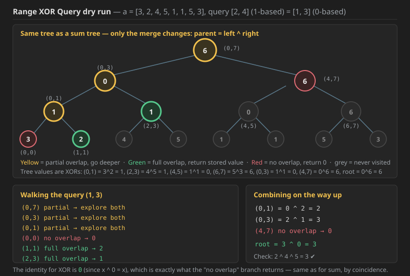

# Notes

## Q1. Range Xor Queries

You are given an array `a` of `n` integers, and an array `queries` where `queries[i] = [ a, b ]` — for each query, you have to find the **xor sum of the values in the range `[ a, b ]`**.

Return an array containing the answer for each query respectively.

### Constraints

* `1 <= n, queries.length <= 10^5`
* `1 <= xi <= 10^9`
* `1 <= a , b <= n`

### Example

**Input**

```text
n = 5 , a = [3, 2, 4, 5, 1, 1, 5, 3]
queries = [
    [2, 4],
    [5, 6],
    [1, 8],
    [3, 3]
]
```

**Output**

```text
[3, 0, 6, 4]
```

*(The queries are **1-based**, which is why the code subtracts 1 from each endpoint. Note the sample array actually holds 8 elements even though `n` is printed as 5 — the queries go up to index 8, so treat the array length as the real `n`.)*

Verifying the expected output by hand:

```text
[2, 4]  →  2 ^ 4 ^ 5                     = 3
[5, 6]  →  1 ^ 1                         = 0
[1, 8]  →  3 ^ 2 ^ 4 ^ 5 ^ 1 ^ 1 ^ 5 ^ 3 = 6
[3, 3]  →  4                             = 4
```

### Dry run



Building the tree for `a = [3, 2, 4, 5, 1, 1, 5, 3]` — the structure is identical to a sum tree, **only the merge changes from `+` to `^`**:

```text
                        6  (0,7)
                     /         \
             0 (0,3)             6 (4,7)
             /     \             /     \
      1 (0,1)   1 (2,3)   0 (4,5)   6 (6,7)
      /   \      /   \     /   \     /   \
     3     2    4     5   1     1   5     3
   (0,0)(1,1)(2,2)(3,3)(4,4)(5,5)(6,6)(7,7)
```

Query `[2, 4]` in 1-based becomes `(1, 3)` in 0-based:

```text
(0,7) vs (1,3)  → partial, explore both
    (0,3) vs (1,3)  → partial, explore both
        (0,1) vs (1,3)  → partial, explore both
            (0,0) vs (1,3)  → NO overlap   → return 0
            (1,1) vs (1,3)  → FULL overlap → return 2
        (2,3) vs (1,3)  → FULL overlap → return 1
    (4,7) vs (1,3)  → NO overlap → return 0
```

Combining on the way up: `(0,1) = 0 ^ 2 = 2`, then `(0,3) = 2 ^ 1 = 3`, then the root gives `3 ^ 0 = 3`. **Answer = 3.**

### What changed from the Range Sum version

Only **two lines**:

* the merge in the build and update: `segtree[i] = segtree[2i+1] ^ segtree[2i+2]` instead of `+`;
* the combine in the query: `getXor(left) ^ getXor(right)` instead of `+`.

The "no overlap" return value stays `0`, because **0 is the identity for XOR too** (`x ^ 0 = x`), exactly as it is the identity for addition. That coincidence is why this problem looks like a one-character change — for a Min query you would have to return `INT_MAX` instead.


### Code

```cpp

#include<bits/stdc++.h>
using namespace std;

class STree {
    vector<int>segtree;
    int n=0;
    int sz=0;

 void buildTree(vector<int>& nums,int s,int e,int i){

    if(s==e){
        segtree[i]=nums[s];
        return;
    }

    int mid=(s+e)/2;
    buildTree(nums,s,mid,2*i+1);
    buildTree(nums,mid+1,e,2*i+2);

    segtree[i]=segtree[2*i+1]^segtree[2*i+2];

 }


int getXor(int l,int r,int s,int e,int i){

    if(r<s || e<l) return 0;

    if(l<=s && e<=r) return segtree[i];

    int mid=(s+e)/2;

    return getXor(l,r,s,mid,2*i+1)^getXor(l,r,mid+1,e,2*i+2);
}

public:
    STree(vector<int>& nums) {
        n=nums.size();
        sz=4*n;
        segtree.resize(sz);
        buildTree(nums,0,n-1,0);
    }
    
    
    int xorRange(int left, int right) {
        return getXor(left,right,0,n-1,0);
    }
};

vector<int>solve(int n, vector<int>a, vector<vector<int>> queries){
    int size=a.size();
    STree st (a);
    vector<int> res;
    for(int i=0;i<queries.size();i++){
        int l=queries[i][0]-1; //as in queries 1-based indexing used
        int r=queries[i][1]-1;
        res.push_back(st.xorRange(l,r));
    }
    return res;
    
    
}
```

### Java code for Q1 (was missing; same logic as the C++ above)

```java
import java.util.*;

class STree {
    private int[] segtree;
    private int n = 0;
    private int sz = 0;

    private void buildTree(int[] nums, int s, int e, int i) {

        if (s == e) {
            segtree[i] = nums[s];
            return;
        }

        int mid = (s + e) / 2;
        buildTree(nums, s, mid, 2 * i + 1);
        buildTree(nums, mid + 1, e, 2 * i + 2);

        segtree[i] = segtree[2 * i + 1] ^ segtree[2 * i + 2];
    }

    private int getXor(int l, int r, int s, int e, int i) {

        if (r < s || e < l) return 0;

        if (l <= s && e <= r) return segtree[i];

        int mid = (s + e) / 2;

        return getXor(l, r, s, mid, 2 * i + 1) ^ getXor(l, r, mid + 1, e, 2 * i + 2);
    }

    public STree(int[] nums) {
        n = nums.length;
        sz = 4 * n;
        segtree = new int[sz];
        buildTree(nums, 0, n - 1, 0);
    }

    public int xorRange(int left, int right) {
        return getXor(left, right, 0, n - 1, 0);
    }
}

class Solution {
    public static List<Integer> solve(int n, int[] a, int[][] queries) {
        STree st = new STree(a);
        List<Integer> res = new ArrayList<>();
        for (int i = 0; i < queries.length; i++) {
            int l = queries[i][0] - 1;   // as in queries 1-based indexing used
            int r = queries[i][1] - 1;
            res.add(st.xorRange(l, r));
        }
        return res;
    }
}
```

**Complexity — Q1 (Range Xor Queries):**

* **Time — `O(N + Q log N)`.** The constructor's `buildTree` fills every one of the roughly `2N` tree nodes exactly once with `O(1)` work each, so building is `O(N)` — not `O(N log N)`, because the recurrence `T(N) = 2T(N/2) + O(1)` is dominated by its leaves. Each of the `Q` queries then costs `O(log N)`: at any level of the tree at most **2 nodes** can partially overlap the query range (a range is a line, and a line has only 2 ends), and every other node terminates in `O(1)` via full-overlap or no-overlap. With `N, Q <= 10^5` that is roughly `10^5 + 10^5 × 17 ≈ 1.8 × 10^6` operations.
* **Space — `O(4N) = O(N)`** for the `segtree` array, plus **`O(log N)`** for the recursion stack, plus `O(Q)` for the result list. The `4N` is the safe heap-indexing bound, not a tight one.
* **Could a prefix XOR array beat this?** Yes — since **there are no updates here**, a prefix-XOR array gives `O(N)` build and `O(1)` per query, using the fact that `xor(l, r) = pre[r] ^ pre[l-1]` (XOR is its own inverse). The Segment Tree is used because it generalises: add a point update to the problem and the prefix array becomes `O(N)` per update while the tree stays `O(log N)`.

**Simple, as no updates are here — so no update function is written.**


