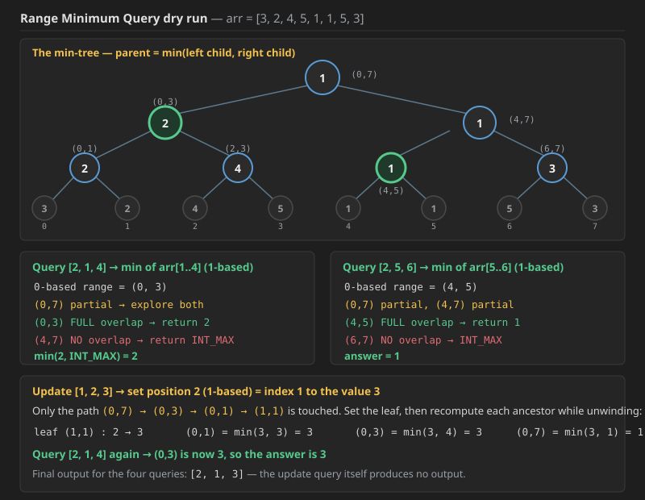

## Q1. Range Minimum Queries

Given an array `arr` of `n` integers, your task is to process queries of the following types:

1. **update** the value at position `k` to `u`
2. what is the **minimum value in range `[a, b]`**?

Return an array containing answers for **type 2 queries** respectively.

### Constraints

* `1 <= n, queries.length <= 10^5`
* `1 <= a <= b <= n`
* `1 <= u <= n`
* `1 <= arri , u <= 10^9`

### Example

**Input**

```text
n = 8 , arr = [3, 2, 4, 5, 1, 1, 5, 3]
queries = [
    [2, 1, 4],
    [2, 5, 6],
    [1, 2, 3],
    [2, 1, 4]
]
```

**Output**

```text
[2, 1, 3]
```

Reading the queries (they are **1-based**, which is why the code subtracts 1):

```text
[2, 1, 4]  →  type 2: min of arr[1..4] = min(3, 2, 4, 5) = 2
[2, 5, 6]  →  type 2: min of arr[5..6] = min(1, 1)       = 1
[1, 2, 3]  →  type 1: set position 2 to 3, so arr becomes
                      [3, 3, 4, 5, 1, 1, 5, 3]
[2, 1, 4]  →  type 2: min of arr[1..4] = min(3, 3, 4, 5) = 3
```

### Dry run



The min-tree for `arr = [3, 2, 4, 5, 1, 1, 5, 3]` — same shape as the sum tree, **parent = min(left, right)**:

```text
                        1  (0,7)
                     /         \
             2 (0,3)             1 (4,7)
             /     \             /     \
      2 (0,1)   4 (2,3)   1 (4,5)   3 (6,7)
      /   \      /   \     /   \     /   \
     3     2    4     5   1     1   5     3
   (0,0)(1,1)(2,2)(3,3)(4,4)(5,5)(6,6)(7,7)
```

**Query `[2, 1, 4]`** — 1-based `[1,4]` becomes 0-based `(0,3)`:

```text
(0,7) vs (0,3)  → partial, explore both
    (0,3) vs (0,3)  → FULL overlap → return 2
    (4,7) vs (0,3)  → NO overlap   → return INT_MAX
min(2, INT_MAX) = 2
```

**Query `[2, 5, 6]`** — 0-based `(4,5)`:

```text
(0,7) partial → (0,3) NO overlap → INT_MAX
              → (4,7) partial
                    (4,5) FULL overlap → return 1
                    (6,7) NO overlap   → INT_MAX
answer = 1
```

**Update `[1, 2, 3]`** — set position 2 (1-based) = index 1 to the value 3. Only the path `(0,7) → (0,3) → (0,1) → (1,1)` is touched:

```text
leaf (1,1):  2 → 3
(0,1) = min(3, 3) = 3
(0,3) = min(3, 4) = 3
(0,7) = min(3, 1) = 1
```

**Query `[2, 1, 4]` again** — `(0,3)` now holds 3, so the answer is **3**.

Final output: **`[2, 1, 3]`** — the update query itself produces no output.

### The only two changes from a Range Sum tree

* the merge becomes `segtree[i] = min(segtree[2i+1], segtree[2i+2])`;
* the "no overlap" branch returns **`INT_MAX`** instead of `0`, because **`INT_MAX` is the identity for `min`** (`min(x, INT_MAX) = x`), exactly as `0` is the identity for `+`. Returning `0` here would be a silent bug — every query would come back as 0.


cannot use fenwick tree here 

# Why Fenwick Trees Fail at Range Minimum Query (RMQ)

This is the "Million Dollar Question" that separates those who memorize code from those who understand **Internal Physics**. The short answer: **Fenwick Trees require the operation to be "Invertible."**

* **Addition** has an inverse (Subtraction).
* **Multiplication** has an inverse (Division).
* **Minimum (Min)** does **not** have an inverse.

---

### 1. The Physics of "Peeling the Onion"
Think about how we calculate a range sum $[L, R]$ with a Fenwick Tree:
$$\text{Sum}(L, R) = \text{Query}(R) - \text{Query}(L-1)$$

To get the middle part, we take the "Whole" and **subtract** the "Prefix." We can only do this because we can "undo" addition. 

**Now, try that with Minimum:**
Imagine you know:
- The Minimum of elements $[1 \dots 10]$ is **2**.
- The Minimum of elements $[1 \dots 5]$ is **5**.

**What is the minimum of $[6 \dots 10]$?** You have no way of knowing! The "2" could have been at index 3 (the prefix), or it could have been at index 8 (the target range). Once you "combine" values into a Minimum, you lose the information about where that value came from. You cannot "subtract" a minimum to see what’s left behind.

---

### 2. The "Overlapping Bag" Problem
Remember our **Manager Analogy**:
* **Index 8** is the "CEO" who knows the sum of `[1...8]`.
* If you update **Index 2**, the CEO just adds the difference to their total.

**But with Minimum:**
* Suppose the CEO (Index 8) knows the Min of `[1...8]` is **10**.
* You update **Index 2** from **10** to **50**.
* **The CEO's Problem:** "My previous minimum was 10, but that was at Index 2. Now Index 2 is 50. I have no idea what the new minimum is without re-checking every single employee!"

---

### 3. Summary: One-Way Accumulators
The Physics of the Fenwick Tree makes it a **One-Way Accumulator**. 
* **The Strength:** They are great at adding new info (Prefixes).
* **The Weakness:** They are terrible at "re-evaluating" when a value that was previously the "winner" (the Min) disappears or increases.

### 4. The "Invertibility" Rule

| Operation | Invertible? | Fenwick Compatible? |
| :--- | :--- | :--- |
| **Sum (+)** | Yes (Subtraction) | ✅ Yes |
| **XOR (^)** | Yes (XOR itself) | ✅ Yes |
| **Product (*)** | Yes (Division) | ✅ Yes (if no zeros) |
| **Min / Max** | **No** | ❌ No* |

*\*Note: You CAN use it if values only ever decrease (for Min) or increase (for Max), but you can never "undo" or update a value in the opposite direction.*

# Why Fenwick Fails at Range Minimum Query (RMQ)

### 1. Lack of Inverse
- **Sum:** You can "remove" a prefix via subtraction: `Total - Prefix`.
- **Min:** You cannot "remove" a prefix. If the Min of the whole range was in the prefix you just removed, you are left with no information.

### 2. The Update Limitation
- Fenwick Trees are optimized for **cumulative** operations.
- When a value changes in a Sum BIT, you just add the `delta`.
- When a value changes in a Min BIT, if that value was the current minimum, you have to "re-scan" to find the next smallest value, which breaks the $O(\log N)$ speed.

### 3. The Exception (The "Only-Decreasing" Rule)
- You *can* use a Fenwick Tree for Min if the values **only ever decrease**. 
- If you only make numbers smaller, the "Manager" just checks: `new_min = min(old_manager_min, new_value)`. 
- But as soon as you try to make a number **larger**, the physics breaks.


# Opposite vs. Inverse: Why Max Cannot "Undo" Min

In the world of **Abstract Algebra** and **Data Physics**, it feels like Minimum and Maximum should be inverses because they are opposites. However, they don't work that way. To be an **Inverse**, an operation must be able to "undo" the original action to return you to exactly where you started.

---

### 1. The "Information Loss" Physics
Think of it like this:

* **Addition:** $10 + 5 = 15$. If I give you $15$ and the number $5$, you can get back to $10$ perfectly ($15 - 5$). **Information is preserved.**
* **Minimum:** $\min(10, 5) = 5$. If I give you the result $5$ and the number $5$, can you tell me what the other number was? **No.** It could have been $10, 100, 1000$, or even another $5$.

**The Physics:** The `min()` function **destroys information**. It only keeps the "winner" and throws the "loser" away. Once the loser is gone, no operation (not even Maximum) can bring it back.

---

### 2. Why "Maximum" isn't the Inverse of "Minimum"
An inverse operation $f^{-1}$ must satisfy: $f^{-1}(f(a, b), b) = a$.

Let's test this with Min and Max:
1.  **Original numbers:** $10, 5$.
2.  **Apply Min:** $\min(10, 5) = 5$.
3.  **Apply Max with the "undo" number:** $\max(5, 5) = 5$.

**Did we get $10$ back? No.** We got $5$. 
Maximum is an **opposite** operation, but it isn't an **inverse**. It can't recover the "loser" that was discarded by the Minimum function.

---

### 3. Impact on Fenwick Trees
Because a Fenwick Tree relies on the logic of `Query(R) - Query(L-1)`, it fundamentally requires a mathematical **Inverse** (like subtraction) to "remove" the prefix and isolate the range. 

| Feature | Addition/XOR | Minimum/Maximum |
| :--- | :--- | :--- |
| **Algebraic Group** | Group (has Inverse) | Semilattice (No Inverse) |
| **Data Integrity** | Reversible | Destructive |
| **Fenwick Use** | ✅ Supported | ❌ Not Supported |

# Opposite vs. Inverse: The RMQ Mistake

### 1. The Definition
- **Opposite:** Performs the reverse direction (e.g., Min vs. Max, Up vs. Down).
- **Inverse:** Mathematically "undoes" an operation to recover hidden data.

### 2. Why Max cannot "undo" Min
- **Min(10, 2) = 2.** The "10" is now deleted from the result.
- **Max(2, something)** can never recreate the "10" unless the "10" is already stored somewhere else.
- Because Fenwick Trees rely on `Query(R) - Query(L-1)`, they require a mathematical **Inverse** to "subtract" the prefix.

### 3. The Functional Requirement
For a Fenwick Tree to work on a range $[L, R]$, the operation $\oplus$ must have an inverse $\ominus$ such that:
`(A ⊕ B) ⊖ A = B`
- This works for `+` and `-`.
- This works for `XOR` and `XOR`.
- This **fails** for `Min` and `Max`.
```cpp
#include<bits/stdc++.h>
using namespace std;


class STree {
    vector<int>segtree;
    int n=0;
    int sz=0;

 void buildTree(vector<int>& nums,int s,int e,int i){

    if(s==e){
        segtree[i]=nums[s];
        return;
    }

    int mid=(s+e)/2;
    buildTree(nums,s,mid,2*i+1);
    buildTree(nums,mid+1,e,2*i+2);

    segtree[i]=min(segtree[2*i+1],segtree[2*i+2]);

 }

 void updateTree(int idx,int val,int s,int e,int i){

    if(s==e){
        segtree[i]=val;
        return;
    }
    int mid=(s+e)/2;
    if(idx<=mid) updateTree(idx,val,s,mid,2*i+1);
    else updateTree(idx,val,mid+1,e,2*i+2);

    segtree[i]=min(segtree[2*i+1],segtree[2*i+2]);
 }

int getMin(int l,int r,int s,int e,int i){

    if(r<s || e<l) return INT_MAX; //see here returning INT_MAX

    if(l<=s && e<=r) return segtree[i];

    int mid=(s+e)/2;

    return min(getMin(l,r,s,mid,2*i+1),getMin(l,r,mid+1,e,2*i+2));
}

public:
    STree(vector<int>& nums) {
        n=nums.size();
        sz=4*n;
        segtree.resize(sz);
        buildTree(nums,0,n-1,0);
    }
    
    void update(int index, int val) {

        updateTree( index, val,0,n-1,0);
        
    }
    
    
    int minRange(int left, int right) {
        return getMin(left,right,0,n-1,0);
    }
};

vector<int> solve(int n, vector<int>a, vector<vector<int>> queries){
  
    STree st (a);
    vector<int> res;
    for(int i=0;i<queries.size();i++){
        if(queries[i][0]==1){
            int idx=queries[i][1]-1;
            int val=queries[i][2];
            st.update(idx,val);
        }else{
            int l=queries[i][1]-1; //as in queries 1-based indexing used
            int r=queries[i][2]-1;
            res.push_back(st.minRange(l,r));
        }
    }
    return res;
}
```

### Java code for Q1 (was missing; same logic as the C++ above)

```java
import java.util.*;

class STree {
    private int[] segtree;
    private int n = 0;
    private int sz = 0;

    private void buildTree(int[] nums, int s, int e, int i) {

        if (s == e) {
            segtree[i] = nums[s];
            return;
        }

        int mid = (s + e) / 2;
        buildTree(nums, s, mid, 2 * i + 1);
        buildTree(nums, mid + 1, e, 2 * i + 2);

        segtree[i] = Math.min(segtree[2 * i + 1], segtree[2 * i + 2]);
    }

    private void updateTree(int idx, int val, int s, int e, int i) {

        if (s == e) {
            segtree[i] = val;
            return;
        }
        int mid = (s + e) / 2;
        if (idx <= mid) updateTree(idx, val, s, mid, 2 * i + 1);
        else updateTree(idx, val, mid + 1, e, 2 * i + 2);

        segtree[i] = Math.min(segtree[2 * i + 1], segtree[2 * i + 2]);
    }

    private int getMin(int l, int r, int s, int e, int i) {

        if (r < s || e < l) return Integer.MAX_VALUE;  // see here returning INT_MAX

        if (l <= s && e <= r) return segtree[i];

        int mid = (s + e) / 2;

        return Math.min(getMin(l, r, s, mid, 2 * i + 1),
                        getMin(l, r, mid + 1, e, 2 * i + 2));
    }

    public STree(int[] nums) {
        n = nums.length;
        sz = 4 * n;
        segtree = new int[sz];
        buildTree(nums, 0, n - 1, 0);
    }

    public void update(int index, int val) {
        updateTree(index, val, 0, n - 1, 0);
    }

    public int minRange(int left, int right) {
        return getMin(left, right, 0, n - 1, 0);
    }
}

class Solution {
    public static List<Integer> solve(int n, int[] a, int[][] queries) {

        STree st = new STree(a);
        List<Integer> res = new ArrayList<>();
        for (int i = 0; i < queries.length; i++) {
            if (queries[i][0] == 1) {
                int idx = queries[i][1] - 1;
                int val = queries[i][2];
                st.update(idx, val);
            } else {
                int l = queries[i][1] - 1;   // as in queries 1-based indexing used
                int r = queries[i][2] - 1;
                res.add(st.minRange(l, r));
            }
        }
        return res;
    }
}
```

**Complexity — Q1 (Range Minimum Queries):**

* **Build — Time `O(N)`, Space `O(4N) = O(N)`.** Every one of the roughly `2N` nodes is filled exactly once with a single `min` comparison. The recurrence `T(N) = 2T(N/2) + O(1)` resolves to `O(N)`; the leaves dominate, not the `log N` depth.
* **Type 1 (update) — `O(log N)` time, `O(log N)` stack.** A single index is either entirely left or entirely right of `mid`, so exactly one root-to-leaf path is walked; each ancestor is then re-mined in `O(1)` while unwinding.
* **Type 2 (min query) — `O(log N)` time, `O(log N)` stack.** At any level at most **2 nodes** partially overlap the query — a range is a line and a line has 2 ends — and every other node answers in `O(1)`. Two chains of depth `log N` gives `O(log N)`.
* **Overall — `O(N + Q log N)` time, `O(N)` space.** With `N` and `Q` both up to `10^5` that is about `1.8 × 10^6` operations.
* **Why the update is what forces a Segment Tree here.** A **Sparse Table** answers static RMQ in `O(1)` per query after `O(N log N)` preprocessing — strictly better than this — but it cannot handle updates at all, since a changed value invalidates every overlapping block. A **Fenwick Tree** is also out (see the reasoning below): `min` has no inverse, so the `Query(R) − Query(L−1)` trick it depends on simply does not exist. The Segment Tree is the only one of the three that gives `O(log N)` for **both** operations.


