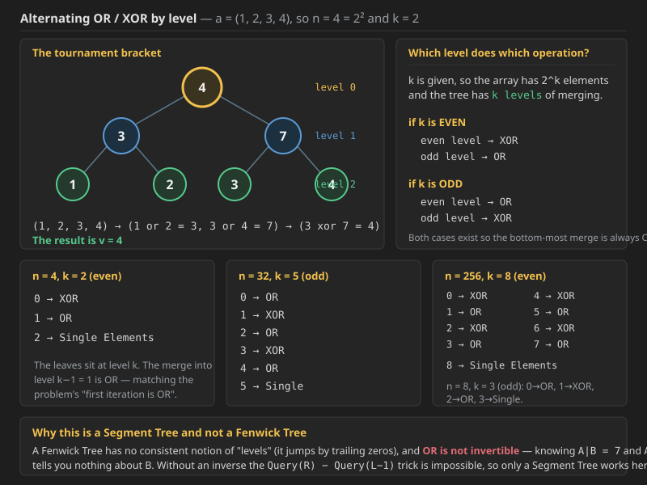

## Q1. Ashish and Bit Operations

Ashish the beginner programmer has a sequence `a`, consisting of `2^n` non-negative integers: `a1, a2, ..., a2^n`. Ashish is currently studying bit operations. To better understand how they work, Ashish decided to calculate some value `v` for `a`.

Namely, it takes several iterations to calculate value `v`. At the first iteration, Ashish writes a new sequence `a1 or a2, a3 or a4, ..., a2^n - 1 or a2^n`, consisting of `2^(n - 1)` elements. In other words, he writes down the bit-wise OR of adjacent elements of sequence `a`. At the second iteration, Ashish writes the bitwise **exclusive** OR of adjacent elements of the sequence obtained after the first iteration. At the third iteration Ashish writes the bitwise OR of the adjacent elements of the sequence obtained after the second iteration. And so on; the operations of bitwise exclusive OR and bitwise OR alternate. In the end, he obtains a sequence consisting of one element, and that element is `v`.

Let us consider an example. Suppose that sequence `a = (1, 2, 3, 4)`. Then let us write down all the transformations:

```text
(1, 2, 3, 4)  ->  (1 or 2 = 3, 3 or 4 = 7)  ->  (3 xor 7 = 4)
```

The result is `v = 4`.

You are given the initial sequence. But to calculate value `v` for a given sequence would be too easy, so you are given additional queries. Each query is a pair of integers `p, b`. Query `p, b` means that you need to perform the assignment `ap = b` and calculate the new value `v` for the new sequence `a`.

Return an array containing the answer for each query respectively.

### Constraints

* `1 <= n <= 17`
* `1 <= queries.length <= 10^5`
* `1 <= ai , b <= 2^30`
* `1 <= p <= 2^n`

*(Here `n` is the exponent - the array itself holds `2^n` elements, which is why the code passes `n` in as `treeLevels`.)*


Here it is given size is n=2^k so we know we will have 2*n nodes

so we can take segment tree size as 2*n or to be on safer side use 4*n.

### Working out which level does which operation



`n = 2^k` here, so the **tree will have `k` levels**, and **at each level we need a different operation**.

**Example: `n = 4`, so `k = 2`.**

```text
                     o         level 0   ->  XOR
                   /   \
                 o       o     level 1   ->  OR
                / \     / \
               o   o   o   o   level 2   ->  the single elements
```

Walking the sample `a = (1, 2, 3, 4)` through that tree:

```text
leaves         :  1     2     3     4
level 1 (OR)   :   1|2 = 3      3|4 = 7
level 0 (XOR)  :        3 ^ 7 = 4        <-  v = 4
```

**Example: `n = 256`, so `k = 8`.**

```text
0  ->  XOR
1  ->  OR
2  ->  XOR
3  ->  OR
4  ->  XOR
5  ->  OR
6  ->  XOR
7  ->  OR
8  ->  Single Elements
```

**Example: `n = 32`, so `k = 5`.**

```text
0  ->  OR
1  ->  XOR
2  ->  OR
3  ->  XOR
4  ->  OR
5  ->  Single
```

**Example: `n = 8`, so `k = 3`.**

```text
0  ->  OR
1  ->  XOR
2  ->  OR
3  ->  Single
```

### The rule

`k` is given to us, so there are `2^k` elements in the array.

```text
if k is EVEN:
    even level  ->  XOR
    odd  level  ->  OR

if k is ODD:
    even level  ->  OR
    odd  level  ->  XOR
```

Both cases exist so that the **bottom-most merge (level `k - 1`) is always OR**, which is what the problem demands, since the very first iteration is an OR. That is exactly what the `if (lvls % 2 == 0)` branch in the code below is doing.


```cpp

#include<bits/stdc++.h>
using namespace std;


class STree {
    vector<int>segtree;
    int n=0;
    int sz=0;
    int lvls=0;

 void buildTree(vector<int>& nums,int s,int e,int i,int level){

    if(s==e){
        segtree[i]=nums[s];
        return;
    }

    int mid=(s+e)/2;
    buildTree(nums,s,mid,2*i+1,level+1);
    buildTree(nums,mid+1,e,2*i+2,level+1);
    
    if(lvls%2==0){
        if(level%2!=0) segtree[i]=segtree[2*i+1]|segtree[2*i+2];
        else segtree[i]=segtree[2*i+1]^segtree[2*i+2];
        
    }else {
         if(level%2!=0) segtree[i]=segtree[2*i+1]^segtree[2*i+2];
        else segtree[i]=segtree[2*i+1]|segtree[2*i+2];
    }

 }


int getBitOp(int l,int r,int s,int e,int i,int levels){

    if(r<s || e<l) return 0;

    if(l<=s && e<=r) return segtree[i];

    int mid=(s+e)/2;

     if(lvls%2==0){
        if(levels%2!=0) return getBitOp(l,r,s,mid,2*i+1,levels+1)| getBitOp(l,r,mid+1,e,2*i+2,levels+1);
        else return getBitOp(l,r,s,mid,2*i+1,levels+1)^ getBitOp(l,r,mid+1,e,2*i+2,levels+1);
        
    }else {
         if(levels%2!=0) return getBitOp(l,r,s,mid,2*i+1,levels+1)^ getBitOp(l,r,mid+1,e,2*i+2,levels+1);
        else return getBitOp(l,r,s,mid,2*i+1,levels+1)| getBitOp(l,r,mid+1,e,2*i+2,levels+1);
    }
}
 void updateTree(int idx,int val,int s,int e,int i,int level){

    if(s==e){
        segtree[i]=val;
        return;
    }
    int mid=(s+e)/2;
    if(idx<=mid) updateTree(idx,val,s,mid,2*i+1,level+1);
    else updateTree(idx,val,mid+1,e,2*i+2,level+1);

     if(lvls%2==0){
        if(level%2!=0) segtree[i]=segtree[2*i+1]|segtree[2*i+2];
        else segtree[i]=segtree[2*i+1]^segtree[2*i+2];
        
    }else {
         if(level%2!=0) segtree[i]=segtree[2*i+1]^segtree[2*i+2];
        else segtree[i]=segtree[2*i+1]|segtree[2*i+2];
    }
 }

public:
    STree(vector<int>& nums,int treeLevels) {
        n=nums.size();
        sz=2*n;
        lvls=treeLevels;
        segtree.resize(sz);
        buildTree(nums,0,n-1,0,0);
    }
    void update(int index, int val) {

        updateTree( index, val,0,n-1,0,0);
        
    }
    
    int bitRange(int left, int right) {
        return getBitOp(left,right,0,n-1,0,0);
    }
};

vector<int> solve(int n, vector<int>a, vector<vector<int>> queries){
    STree st(a,n);
    
    vector<int> res;
    for(vector<int>q:queries){
        int idx=q[0]-1;
        int val=q[1];
        st.update(idx,val);
        res.push_back(st.bitRange(0,a.size()-1));
    }
    return res;
    

}
```

### Java code for Q1 (was missing; same logic as the C++ above)

```java
import java.util.*;

class STree {
    private int[] segtree;
    private int n = 0;
    private int sz = 0;
    private int lvls = 0;

    private void buildTree(int[] nums, int s, int e, int i, int level) {

        if (s == e) {
            segtree[i] = nums[s];
            return;
        }

        int mid = (s + e) / 2;
        buildTree(nums, s, mid, 2 * i + 1, level + 1);
        buildTree(nums, mid + 1, e, 2 * i + 2, level + 1);

        if (lvls % 2 == 0) {
            if (level % 2 != 0) segtree[i] = segtree[2 * i + 1] | segtree[2 * i + 2];
            else                segtree[i] = segtree[2 * i + 1] ^ segtree[2 * i + 2];

        } else {
            if (level % 2 != 0) segtree[i] = segtree[2 * i + 1] ^ segtree[2 * i + 2];
            else                segtree[i] = segtree[2 * i + 1] | segtree[2 * i + 2];
        }
    }

    private int getBitOp(int l, int r, int s, int e, int i, int levels) {

        if (r < s || e < l) return 0;

        if (l <= s && e <= r) return segtree[i];

        int mid = (s + e) / 2;

        if (lvls % 2 == 0) {
            if (levels % 2 != 0)
                return getBitOp(l, r, s, mid, 2 * i + 1, levels + 1) | getBitOp(l, r, mid + 1, e, 2 * i + 2, levels + 1);
            else
                return getBitOp(l, r, s, mid, 2 * i + 1, levels + 1) ^ getBitOp(l, r, mid + 1, e, 2 * i + 2, levels + 1);

        } else {
            if (levels % 2 != 0)
                return getBitOp(l, r, s, mid, 2 * i + 1, levels + 1) ^ getBitOp(l, r, mid + 1, e, 2 * i + 2, levels + 1);
            else
                return getBitOp(l, r, s, mid, 2 * i + 1, levels + 1) | getBitOp(l, r, mid + 1, e, 2 * i + 2, levels + 1);
        }
    }

    private void updateTree(int idx, int val, int s, int e, int i, int level) {

        if (s == e) {
            segtree[i] = val;
            return;
        }
        int mid = (s + e) / 2;
        if (idx <= mid) updateTree(idx, val, s, mid, 2 * i + 1, level + 1);
        else            updateTree(idx, val, mid + 1, e, 2 * i + 2, level + 1);

        if (lvls % 2 == 0) {
            if (level % 2 != 0) segtree[i] = segtree[2 * i + 1] | segtree[2 * i + 2];
            else                segtree[i] = segtree[2 * i + 1] ^ segtree[2 * i + 2];

        } else {
            if (level % 2 != 0) segtree[i] = segtree[2 * i + 1] ^ segtree[2 * i + 2];
            else                segtree[i] = segtree[2 * i + 1] | segtree[2 * i + 2];
        }
    }

    public STree(int[] nums, int treeLevels) {
        n = nums.length;
        sz = 2 * n;
        lvls = treeLevels;
        segtree = new int[sz];
        buildTree(nums, 0, n - 1, 0, 0);
    }

    public void update(int index, int val) {
        updateTree(index, val, 0, n - 1, 0, 0);
    }

    public int bitRange(int left, int right) {
        return getBitOp(left, right, 0, n - 1, 0, 0);
    }
}

class Solution {
    public static List<Integer> solve(int n, int[] a, int[][] queries) {
        STree st = new STree(a, n);

        List<Integer> res = new ArrayList<>();
        for (int[] q : queries) {
            int idx = q[0] - 1;
            int val = q[1];
            st.update(idx, val);
            res.add(st.bitRange(0, a.length - 1));
        }
        return res;
    }
}
```

**Complexity - Q1 (Ashish and Bit Operations):**

* **Build - Time `O(N)` where `N = 2^k`, Space `O(2N)`.** Every node of the tree is filled exactly once with a single OR or XOR. Since `N` here is guaranteed to be an exact power of 2, the tree is a **perfect** binary tree with exactly `2N - 1` nodes, which is why `sz = 2 * n` is enough here - the usual `4N` safety margin only exists to cover the case where `N` is *not* a power of 2. With `n <= 17`, `N <= 131072`.
* **Per query - `O(log N) = O(k)`.** Each query does one `update` (a single root-to-leaf path, `O(log N)`) followed by `bitRange(0, N-1)`. That second call is a **full-range query, so it hits the full-overlap case at the root immediately and returns in `O(1)`** - it is really just reading `segtree[0]`. So the real cost per query is the update alone. With `k <= 17` and up to `10^5` queries that is under `2 x 10^6` operations.
* **Overall - `O(N + Q log N)` time, `O(N)` space** (plus `O(log N)` recursion stack and `O(Q)` for the answers).
* **Why the `level` parameter has to be threaded through.** In every other segment tree the merge is one fixed operation, so the recursion needs no notion of depth. Here the operation depends on **where in the tree you are**, so `level` is passed down and incremented on each descent. Crucially, the **same** level test must appear in `buildTree`, `updateTree` and `getBitOp`, otherwise the tree would be built with one rule and read with another.
* **A note on the `return 0` for no overlap.** It is the correct identity for both OR and XOR (`x | 0 = x` and `x ^ 0 = x`), so the single line works for both alternating operations. This is only safe because the problem never uses AND, whose identity would be all-ones.
# Why this problem Strictly Require a Segment Tree

This problem is a perfect example of why the **Segment Tree** is a more powerful (though more complex) tool than the **Fenwick Tree**. To answer the question directly: **No, you cannot use a Fenwick Tree here.**

Here is the "Physics" breakdown of why this problem requires a Segment Tree.

---

### 1. The "Alternating Levels" Rule
In this problem, the operation depends entirely on the **height (level)** of the node:
* **Bottom level:** `OR`
* **Level above:** `XOR`
* **Level above that:** `OR`
* ...and so on.

**The Fenwick Problem:** A Fenwick Tree doesn't have "levels" in a consistent hierarchy. It is a flat array where nodes are combined based on their **Binary Trailing Zeros**. There is no concept of "this level does XOR and the next does OR." A Fenwick Tree assumes a **single, consistent operation** (like addition) across the entire structure.

---

### 2. The Non-Invertible Operation (`OR`)
As we discussed, Fenwick Trees rely on **Prefixes** and **Inverses**.

* While `XOR` has an inverse (itself), **`OR` is destructive (information-losing).**
* If you know `(A OR B) = 7` and `A = 4`, you have no way of knowing if `B` was `3`, `7`, or `2`.
* Because you can't "undo" an `OR` operation, you cannot use the `Query(R) - Query(L-1)` logic that makes Fenwick Trees work. You can't "subtract" a prefix to find a range result.

---

### 3. The Tournament Bracket Physics
The Segment Tree works here because it functions like a **Tournament Bracket**:

1.  **The Players (Leaves):** They compete in the first round using the `OR` rule.
2.  **The Winners:** They move to the second round and compete using the `XOR` rule.
3.  **The Champion (Root):** The final result is the outcome of all these alternating rounds.

When you update a value at the bottom, you only need to "re-play" the matches for that **one specific path** up to the root. Segment Trees excel at this because they store the result of every intermediate "match" in a dedicated node.

---

### 4. Summary Table

| Feature | Fenwick Tree | Segment Tree |
| :--- | :--- | :--- |
| **Logic** | Prefix-based ($0 \to i$) | Range-based ($L \to R$) |
| **Operations** | Must be Invertible (Sum, XOR) | Can be anything (Min, Max, OR, Alternating) |
| **Structure** | Flat/Binary Jumps | Hierarchical/Tournament Bracket |
| **Xenia's Problem** | ❌ Impossible | ✅ Perfect Match |

---

### 💡 Engineering Tip for your Code
In your constructor, you used `sz = 2 * n`. In a recursive Segment Tree like yours, it is safer to use **`4 * n`**. 
- **The Physics:** If $N$ is not a perfect power of 2, the recursive tree can branch deeper than $2N$ indices, leading to an **Array Out of Bounds** error. Using $4N$ is the standard "safety factor" for Segment Trees.

# Why  Problem Fails on Fenwick

### 1. Structural Mismatch
- **Segment Tree:** Maintains a perfect power-of-2 hierarchy where each level can have a custom rule (Alternating `OR` / `XOR`).
- **Fenwick Tree:** Uses a binary-indexed jump system that cannot distinguish between "even" and "odd" levels of a tree.

### 2. The "OR" Information Loss
- `OR` and `XOR` are combined in this problem.
- Since `OR` is not invertible (you cannot "subtract" an `OR` result), the prefix-sum logic of Fenwick Trees is physically impossible to apply.

### 3. The Rule of Thumb
- Use **Fenwick** for: Single, invertible operations (Sum, XOR, Product).
- Use **Segment Tree** for: Complex, alternating, or non-invertible operations (Min, Max, OR, Alternating Logic).


