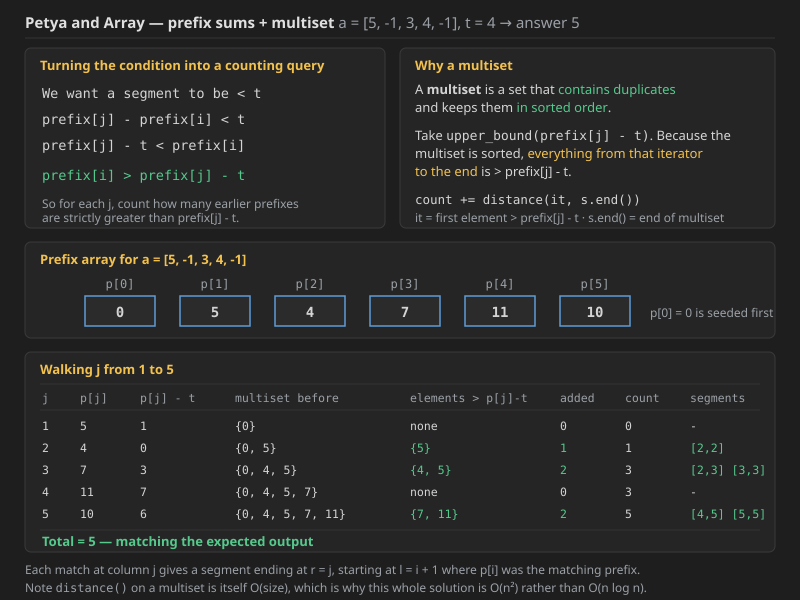

## Q1. Petya and Array

Petya has an array `a` consisting of `n` integers. He has learned partial sums recently, and now he can calculate the sum of elements on any segment of the array really fast. The segment is a non-empty sequence of elements standing one next to another in the array.

Now he wonders what is the number of segments in his array with the sum less than `t`. Help Petya to calculate this number.

More formally, you are required to calculate the number of pairs `l, r` (`l <= r`) such that `al + al+1 + ... + ar-1 + ar < t`.

Return the number of segments in the Petya array with sum of elements less than `t`.

### Constraints

* `1 <= n <= 10^5`
* `1 <= |ai| <= 10^9`
* `1 <= |t| <= 10^14`

### Example

**Input**

```text
n = 5 , a = [5, -1, 3, 4, -1]
```

**Output**

```text
5
```

**Explanation:** in the example, the following segments have sum less than `4`:

* `[2,2]`, sum of elements is `-1`
* `[2,3]`, sum of elements is `2`
* `[3,3]`, sum of elements is `3`
* `[4,5]`, sum of elements is `3`
* `[5,5]`, sum of elements is `-1`

*(So `t = 4` in this example, and the segment indices are 1-based.)*

**Note the array can contain negative numbers** (`|ai|` is bounded, not `ai`), which is exactly what rules out the sliding-window approach and forces the prefix-sum + ordered-container idea below.


```cpp

#include<bits/stdc++.h>
using namespace std;

class NumArray {
    vector<long long>segtree;
    int n=0;
    int sz=0;
    long long cnt=0;

 void buildTree(vector<int>& nums,int s,int e,int i){

    if(s==e){
        segtree[i]=nums[s];
        return;
    }

    int mid=(s+e)/2;
    buildTree(nums,s,mid,2*i+1);
    buildTree(nums,mid+1,e,2*i+2);

    segtree[i]=segtree[2*i+1]+segtree[2*i+2];

 }

 void traverse(int s,int e,int i,int val){
     if(segtree[i]<val) cnt++;
    if(s==e ){
        return;
    }
    int mid=(s+e)/2;
    traverse(s,mid,2*i+1,val);
    traverse(mid+1,e,2*i+2,val);

 }
 ```

### Java code for the wrong approach (was missing; same logic as the C++ above)

```java
import java.util.*;

class NumArray {
    private long[] segtree;
    private int n = 0;
    private int sz = 0;
    private long cnt = 0;

    private void buildTree(int[] nums, int s, int e, int i) {

        if (s == e) {
            segtree[i] = nums[s];
            return;
        }

        int mid = (s + e) / 2;
        buildTree(nums, s, mid, 2 * i + 1);
        buildTree(nums, mid + 1, e, 2 * i + 2);

        segtree[i] = segtree[2 * i + 1] + segtree[2 * i + 2];
    }

    private void traverse(int s, int e, int i, int val) {
        if (segtree[i] < val) cnt++;
        if (s == e) {
            return;
        }
        int mid = (s + e) / 2;
        traverse(s, mid, 2 * i + 1, val);
        traverse(mid + 1, e, 2 * i + 2, val);
    }
}
```

**Why this is wrong.** The nodes of a segment tree only hold **`O(n)` specific ranges** (the ones produced by repeatedly halving `[0, n-1]`). But the question asks about **all `n(n+1)/2` subarrays**, and most of them, such as `[1, 4]` in an 8-element array, are **never a single node** of the tree. Counting nodes whose stored sum is `< t` therefore counts the wrong set entirely, and it also cannot count a subarray twice even when it should appear from different starting points. The tree can only ever be used to *evaluate* a range we name, not to *enumerate* every range.


 Wrong approach as each subarray is not covered by segments, we need to check for each subarray!!


 sp for each subarray we getting sum so O(n^2.log(n))

 ```cpp
 #include<bits/stdc++.h>
using namespace std;

class NumArray {
    vector<int>segtree;
    int n=0;
    int sz=0;

 void buildTree(vector<int>& nums,int s,int e,int i){

    if(s==e){
        segtree[i]=nums[s];
        return;
    }

    int mid=(s+e)/2;
    buildTree(nums,s,mid,2*i+1);
    buildTree(nums,mid+1,e,2*i+2);

    segtree[i]=segtree[2*i+1]+segtree[2*i+2];


 }

int getSum(int l,int r,int s,int e,int i){

    if(r<s || e<l) return 0;

    if(l<=s && e<=r) return segtree[i];

    int mid=(s+e)/2;

    return getSum(l,r,s,mid,2*i+1)+getSum(l,r,mid+1,e,2*i+2);
}

public:
    NumArray(vector<int>& nums) {
        n=nums.size();
        sz=4*n;
        segtree.resize(sz);
        buildTree(nums,0,n-1,0);
    }
    
    
    int sumRange(int left, int right) {
        return getSum(left,right,0,n-1,0);
    }
};


long long solve(int n,long long t, vector<int>a){
     NumArray  stree(a);
     long long cnt=0;
     for(int i=0;i<n;i++){
         for(int j=i;j<n;j++){
             if(stree.sumRange(i,j)<t) cnt++;
         }
     }
     return cnt;
}
```

### Java code for the brute force with a segment tree (was missing; same logic as the C++ above)

```java
import java.util.*;

class NumArray {
    private int[] segtree;
    private int n = 0;
    private int sz = 0;

    private void buildTree(int[] nums, int s, int e, int i) {

        if (s == e) {
            segtree[i] = nums[s];
            return;
        }

        int mid = (s + e) / 2;
        buildTree(nums, s, mid, 2 * i + 1);
        buildTree(nums, mid + 1, e, 2 * i + 2);

        segtree[i] = segtree[2 * i + 1] + segtree[2 * i + 2];
    }

    private int getSum(int l, int r, int s, int e, int i) {

        if (r < s || e < l) return 0;

        if (l <= s && e <= r) return segtree[i];

        int mid = (s + e) / 2;

        return getSum(l, r, s, mid, 2 * i + 1) + getSum(l, r, mid + 1, e, 2 * i + 2);
    }

    public NumArray(int[] nums) {
        n = nums.length;
        sz = 4 * n;
        segtree = new int[sz];
        buildTree(nums, 0, n - 1, 0);
    }

    public int sumRange(int left, int right) {
        return getSum(left, right, 0, n - 1, 0);
    }
}

class Solution {
    public static long solve(int n, long t, int[] a) {
        NumArray stree = new NumArray(a);
        long cnt = 0;
        for (int i = 0; i < n; i++) {
            for (int j = i; j < n; j++) {
                if (stree.sumRange(i, j) < t) cnt++;
            }
        }
        return cnt;
    }
}
```

**Complexity - the segment tree brute force:**

* **Time - `O(n^2 log n)`.** There are `n(n+1)/2 = O(n^2)` subarrays, and each one costs an `O(log n)` range query. Building the tree first is only `O(n)`, so it vanishes next to the double loop. With `n = 10^5` that is about `10^10 x 17` operations - astronomically too slow. This approach is written down only to show that **the segment tree is not the bottleneck; enumerating every subarray is**.
* **Space - `O(4n) = O(n)`** for the tree plus `O(log n)` recursion stack.
* **The lesson:** speeding up each individual query from `O(n)` to `O(log n)` does nothing when there are `O(n^2)` queries. The fix has to remove the `O(n^2)` enumeration itself, which is what the prefix-sum reformulation below does.

we can do O(n^2) solution by mutiset and prefix sum array

```cpp

#include<bits/stdc++.h>
using namespace std;


long long solve(int n,long long t, vector<int>a){
    vector<long long> prefix(n + 1, 0);
    for (int i = 0; i < n; ++i)
        prefix[i + 1] = prefix[i] + a[i];

    multiset<long long> s;
    s.insert(0);  // prefix[0]

    long long count = 0;

    for (int j = 1; j <= n; ++j) {
        // Find number of prefix[i-1] > prefix[j] - t
        auto it = s.upper_bound(prefix[j] - t);
        count += distance(it, s.end());

        // Insert current prefix for future queries
        s.insert(prefix[j]);
    }

    return count;
}
```

### Java code for the multiset + prefix sum approach (was missing; same logic as the C++ above)

Java has no `multiset`, so a `TreeMap<Long, Integer>` is used as a counted ordered set. `tailMap(x, false)` is the equivalent of `upper_bound(x)`.

```java
import java.util.*;

class Solution {
    public static long solve(int n, long t, int[] a) {
        long[] prefix = new long[n + 1];
        for (int i = 0; i < n; ++i)
            prefix[i + 1] = prefix[i] + a[i];

        // TreeMap used as a multiset: value = how many times the key occurs
        TreeMap<Long, Integer> s = new TreeMap<>();
        s.merge(0L, 1, Integer::sum);   // prefix[0]

        long count = 0;

        for (int j = 1; j <= n; ++j) {
            // Find number of prefix[i] > prefix[j] - t
            for (int c : s.tailMap(prefix[j] - t, false).values())
                count += c;

            // Insert current prefix for future queries
            s.merge(prefix[j], 1, Integer::sum);
        }

        return count;
    }
}
```

**Dry run on the sample**



For `a = [5, -1, 3, 4, -1]` and `t = 4`, the prefix array is:

```text
 p[0]   p[1]   p[2]   p[3]   p[4]   p[5]
   0      5      4      7     11     10
```

Now walk `j` from 1 to 5, each time counting how many earlier prefixes are `> p[j] - t`:

```text
 j  p[j]  p[j]-t   multiset before      elements > p[j]-t   count  segments found
 1    5      1     {0}                  none                  0    -
 2    4      0     {0, 5}               {5}                   1    [2,2]
 3    7      3     {0, 4, 5}            {4, 5}                3    [2,3] [3,3]
 4   11      7     {0, 4, 5, 7}         none                  3    -
 5   10      6     {0, 4, 5, 7, 11}     {7, 11}               5    [4,5] [5,5]
```

**Total = 5**, exactly the expected answer, and the five segments match the ones listed in the problem.

Each match at column `j` produces a segment ending at `r = j` and starting at `l = i + 1`, where `p[i]` is the matching earlier prefix.

**Complexity - multiset + prefix sum:**

* **Time - `O(n^2)`.** Building the prefix array is `O(n)`. The loop runs `n` times, and each iteration does an `O(log n)` `upper_bound` - but then **`distance(it, s.end())` walks the iterator one step at a time**, because a `std::multiset` has bidirectional (not random-access) iterators. That walk is `O(size)`, so in the worst case each of the `n` iterations costs `O(n)`, giving `O(n^2)` overall. This matches the note that this is an `O(n^2)` solution.
* **Space - `O(n)`** for the prefix array and `O(n)` for the multiset.
* **How to make it truly `O(n log n)`:** replace the "count how many are greater" step with a structure that answers **order statistics** in `O(log n)` - a Fenwick Tree or Segment Tree over the *coordinate-compressed* prefix values, or a policy-based order-statistic tree. Then each `j` costs `O(log n)` and the whole thing is `O(n log n)`, which is what the `n <= 10^5` constraint actually wants. Note that a Fenwick Tree **is** legal here, because the operation being accumulated is a plain **count (addition)**, which is invertible - unlike the `min`/`OR` cases in the earlier folders.


when the array contains only positive numbers, the two pointers / sliding window technique becomes perfectly suitable and efficient.

```cpp

#include <bits/stdc++.h>
using namespace std;

long long countSegmentsLessThanT(int n, vector<int>& a, long long t) {
    long long count = 0;
    long long sum = 0;
    int l = 0;

    for (int r = 0; r < n; ++r) {
        sum += a[r];
        while (sum >= t && l <= r) {
            sum -= a[l++];
        }
        count += (r - l + 1); // all subarrays [l..r], [l+1..r], ..., [r..r]
    }

    return count;
}

int main() {
    int n = 5;
    vector<int> a = {1, 2, 1, 2, 1};
    long long t = 4;
    cout << countSegmentsLessThanT(n, a, t) << endl;  // Output: 10
    return 0;
}

```

### Java code for the sliding window (was missing; same logic as the C++ above)

```java
import java.util.*;

class Main {
    static long countSegmentsLessThanT(int n, int[] a, long t) {
        long count = 0;
        long sum = 0;
        int l = 0;

        for (int r = 0; r < n; ++r) {
            sum += a[r];
            while (sum >= t && l <= r) {
                sum -= a[l++];
            }
            count += (r - l + 1); // all subarrays [l..r], [l+1..r], ..., [r..r]
        }

        return count;
    }

    public static void main(String[] args) {
        int n = 5;
        int[] a = {1, 2, 1, 2, 1};
        long t = 4;
        System.out.println(countSegmentsLessThanT(n, a, t));  // Output: 10
    }
}
```

**Complexity - sliding window:**

* **Time - `O(n)`.** Each of `r` and `l` only ever moves forward, and each moves at most `n` times in total across the whole run. The inner `while` looks like a nested loop but it is amortised: `l` can never go backwards, so the total work of all `while` iterations combined is `O(n)`, not `O(n)` per step.
* **Space - `O(1)`.** Only three scalars are kept; no prefix array, no tree, no set.
* **The catch - this only works for non-negative numbers.** The window logic relies on the invariant that *shrinking the window from the left can only decrease the sum*. With a negative element present, removing it would **increase** the sum, so the `while` loop could stop too early or too late, and `count += (r - l + 1)` would no longer be valid for every start in `[l, r]`. Since Petya and Array explicitly allows negatives, this `O(n)` method does **not** solve that problem - it solves the easier variant where all `ai >= 0`.


### ✅ What r - l + 1 Means
This counts how many subarrays ending at index r and starting at any index between l and r.

In our case:

Start at l = 1 → [2, 3, 4]

Start at 2 → [3, 4]

Start at 3 → [4]

So:


Subarrays ending at r=3:

[2, 3, 4]

[3, 4]

[4]
→ Total = 3 = r - l + 1


### 🔢 What n(n+1)/2 Means
Here, n = r - l + 1 = 3

This counts all subarrays (any start and end) inside the segment [l..r], regardless of whether they end at r.

From the subarray [2, 3, 4]:

All possible subarrays:

[2]

[2, 3]

[2, 3, 4]

[3]

[3, 4]

[4]

→ Total = 3*(3+1)/2 = 6


