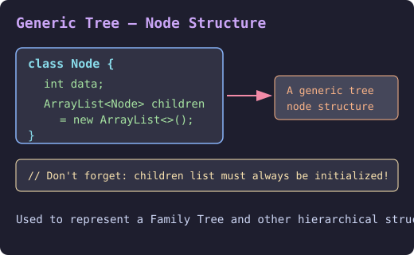
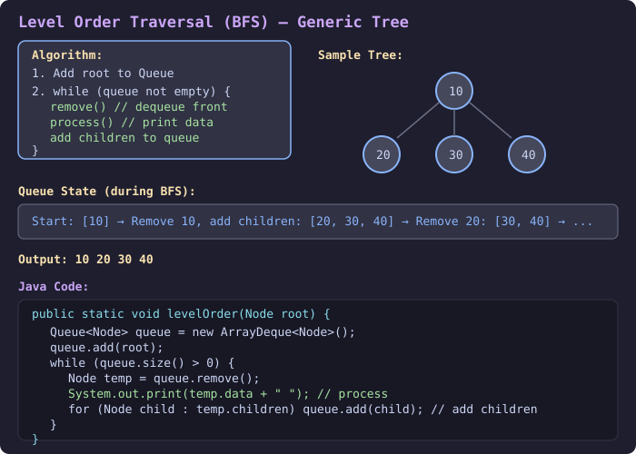
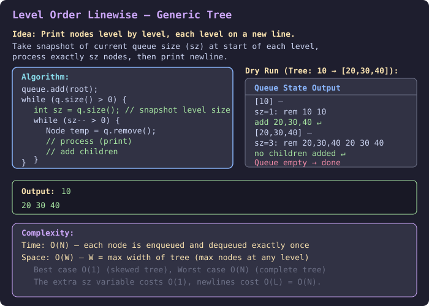
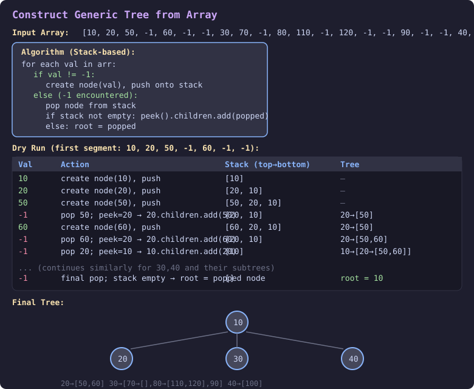
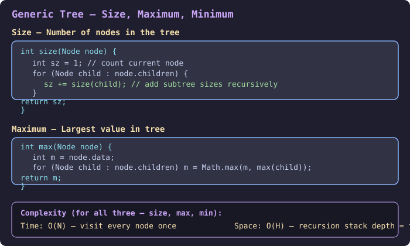
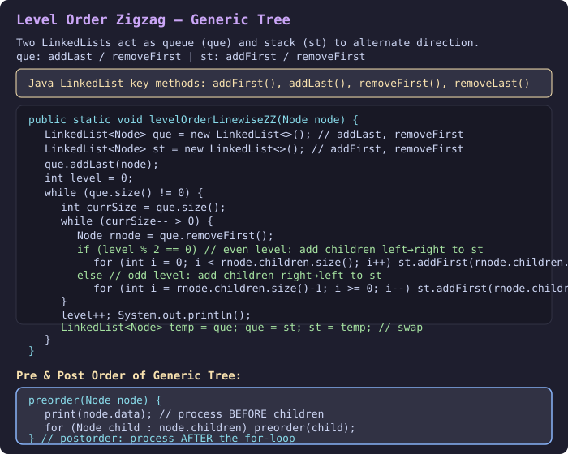
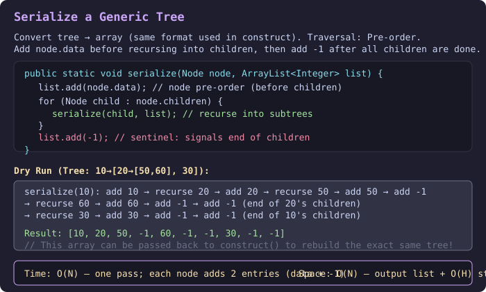

## Q1. What is a Generic Tree? (Node Structure)

A **Generic Tree** is a tree where each node can have **any number of children**. Children of a node are stored using a `List<Node>`.

> **One node & many children — so children are represented by `List<Node> children`**

```
class Node {
    int data;
    ArrayList<Node> children;   // Don't forget to initialize this list!

    Node(int data) {
        this.data = data;
    }
}
```

Used to represent a **Family Tree** and other hierarchical structures (N-ary trees).

```java
// Example: manually building a small tree
public static void main(String[] args) {
    Node root  = new Node(10);
    Node twenty = new Node(20);
    Node one   = new Node(1);
    Node two   = new Node(2);

    root.children.add(twenty);
    root.children.add(two);
    root.children.add(one);
    // Provide a constructor yourself (see Q3)
}
```

**SVG Reference:** 

---

## Q2. Level Order Traversal (BFS) of a Generic Tree

### Concept
- Add root to **Queue** first
- **while** (queue not empty):
  1. `remove()` — dequeue the front node
  2. `process` — print / use the node's data
  3. `add children` of removed node to the queue

### Java Code

```java
public static void levelOrder(Node root) {
    Queue<Node> queue = new ArrayDeque<Node>();
    queue.add(root);

    while (queue.size() > 0) {
        Node temp = queue.remove();
        System.out.print(temp.data + " "); // process

        for (Node child : temp.children) {
            queue.add(child); // add children
        }
    }
    System.out.println(".");
}
```

### C++ Code

```cpp
#include <bits/stdc++.h>
using namespace std;

struct Node {
    int data;
    vector<Node*> children;
    Node(int d) : data(d) {}
};

void levelOrder(Node* root) {
    if (!root) return;
    queue<Node*> q;
    q.push(root);

    while (!q.empty()) {
        Node* temp = q.front(); q.pop();
        cout << temp->data << " "; // process

        for (Node* child : temp->children) {
            q.push(child); // add children
        }
    }
    cout << "." << endl;
}
```

### Complexity
| | |
|---|---|
| **Time** | O(N) — every node is enqueued and dequeued exactly once |
| **Space** | O(W) — W is the max width of the tree (max nodes at any single level). Best: O(1) for a skewed tree; Worst: O(N) for a complete tree |

**SVG Reference:** 

---

## Q3. Level Order Linewise (Print Each Level on a New Line)

### Concept
- Same BFS, but before each level take a **snapshot of the current queue size (`sz`)**.
- Process exactly `sz` nodes (one full level), then print a newline.
- This ensures each level is printed on a separate line.

### Dry Run

Tree: `10 → [20, 30, 40]`

| Queue State | sz | Action | Output |
|---|---|---|---|
| `[10]` | 1 | remove 10, add 20,30,40 | `10` + newline |
| `[20, 30, 40]` | 3 | remove 20,30,40 (no children) | `20 30 40` + newline |
| `[]` | 0 | done | — |

**Output:**
```
10
20 30 40
```

### Java Code

```java
public static void levelOrderLinewise(Node root) {
    Queue<Node> q = new ArrayDeque<>();
    q.add(root);

    while (q.size() > 0) {
        int sz = q.size(); // snapshot of current level size
        while (sz-- > 0) {
            Node temp = q.remove();
            System.out.print(temp.data + " "); // process
            for (Node child : temp.children) q.add(child); // add children
        }
        System.out.println(); // newline after each level
    }
}
```

### C++ Code

```cpp
void levelOrderLinewise(Node* root) {
    if (!root) return;
    queue<Node*> q;
    q.push(root);

    while (!q.empty()) {
        int sz = q.size(); // snapshot
        while (sz-- > 0) {
            Node* temp = q.front(); q.pop();
            cout << temp->data << " "; // process
            for (Node* child : temp->children) q.push(child);
        }
        cout << "\n"; // newline after each level
    }
}
```

### Complexity
| | |
|---|---|
| **Time** | O(N) — each node processed once; the `sz` snapshot is O(1) per level |
| **Space** | O(W) — queue holds at most the widest level at any time |

**SVG Reference:** 

---

## Q4. Construct Generic Tree from Array

### Concept
Given an integer array where each group of values represents a node and its children, terminated by `-1`, reconstruct the generic tree.

**Input Array:**
```
[10, 20, 50, -1, 60, -1, -1, 30, 70, -1, 80, 110, -1, 120, -1, -1, 90, -1, -1, 40, 100, -1, -1, -1]
```

**Algorithm (Stack-based):**
- At values `10, 20, 50` — create a node and **push onto stack**.
- At `-1` — **pop** the top node.
  - If stack is not empty: connect popped node as a child of the new top (peek).
  - If stack is empty: popped node is the **root**.

**Dry Run (first segment: `10, 20, 50, -1, 60, -1, -1`):**

| Val | Stack (top → bottom) | Action |
|---|---|---|
| 10 | [10] | push node(10) |
| 20 | [20, 10] | push node(20) |
| 50 | [50, 20, 10] | push node(50) |
| -1 | [20, 10] | pop 50; peek=20 → `20.children.add(50)` |
| 60 | [60, 20, 10] | push node(60) |
| -1 | [20, 10] | pop 60; peek=20 → `20.children.add(60)` |
| -1 | [10] | pop 20; peek=10 → `10.children.add(20)` |

*...continues similarly for 30 and 40 subtrees...*

Final tree:
```
10
├── 20
│   ├── 50
│   └── 60
├── 30
│   ├── 70
│   ├── 80
│   │   ├── 110
│   │   └── 120
│   └── 90
└── 40
    └── 100
```

### Java Code

```java
public static Node construct(int[] arr) {
    Node root = null;
    Stack<Node> stack = new Stack<>();

    for (int val : arr) {
        if (val != -1) {
            Node node = new Node(val);
            stack.push(node);
        } else {
            Node node = stack.pop();

            if (stack.size() > 0) {
                Node parent = stack.peek();
                parent.children.add(node);
            } else {
                root = node;
            }
        }
    }
    return root;
}
```

### C++ Code

```cpp
Node* construct(vector<int>& arr) {
    Node* root = nullptr;
    stack<Node*> st;

    for (int val : arr) {
        if (val != -1) {
            st.push(new Node(val));
        } else {
            Node* node = st.top(); st.pop();

            if (!st.empty()) {
                st.top()->children.push_back(node); // connect to parent
            } else {
                root = node; // last popped = root
            }
        }
    }
    return root;
}
```

### Complexity
| | |
|---|---|
| **Time** | O(N) — single pass through the array; each element processed once |
| **Space** | O(N) — stack can hold up to N nodes in the worst case (fully nested input), plus O(N) for the tree itself |

**SVG Reference:** 

---

## Q5. Size, Maximum, and Minimum of a Generic Tree

### Concept
- **Size** = total number of nodes in the tree.
- **Maximum / Minimum** = largest/smallest value node.
- All three follow the same recursive pattern: solve for current node + recurse on all children.

### Java Code

```java
// Size: number of nodes
int size(Node node) {
    int sz = 1; // count this node
    for (Node child : node.children) {
        sz += size(child); // add subtree sizes
    }
    return sz;
}

// Maximum value in tree
int max(Node node) {
    int m = node.data;
    for (Node child : node.children) {
        m = Math.max(m, max(child));
    }
    return m;
}

// Minimum value in tree
int min(Node node) {
    int m = node.data;
    for (Node child : node.children) {
        m = Math.min(m, min(child));
    }
    return m;
}
```

### C++ Code

```cpp
int size(Node* node) {
    int sz = 1;
    for (Node* child : node->children) sz += size(child);
    return sz;
}

int maxVal(Node* node) {
    int m = node->data;
    for (Node* child : node->children) m = max(m, maxVal(child));
    return m;
}

int minVal(Node* node) {
    int m = node->data;
    for (Node* child : node->children) m = min(m, minVal(child));
    return m;
}
```

### Complexity
| | |
|---|---|
| **Time** | O(N) — visit every node exactly once |
| **Space** | O(H) — recursion call stack depth equals the height H of the tree. Worst case O(N) for a fully skewed tree, O(log N) for a balanced tree |

**SVG Reference:** 

---

## Q6. Level Order Zigzag of a Generic Tree

### Concept
Print levels alternating direction: left→right for even levels, right→left for odd levels.

**Key Insight:** Use **two LinkedLists** — `que` (acts as queue) and `st` (acts as stack). After each level, swap them.

- `que`: `addLast` / `removeFirst` — standard queue behavior
- `st`: `addFirst` / `removeFirst` — stack behavior (reverses order)

**Java LinkedList reminder:** `addFirst()`, `addLast()`, `removeFirst()`, `removeLast()`

### Java Code

```java
public static void levelOrderLinewiseZZ(Node node) {
    LinkedList<Node> que = new LinkedList<>(); // addLast, removeFirst
    LinkedList<Node> st  = new LinkedList<>(); // addFirst, removeFirst

    que.addLast(node);
    int level = 0;

    while (que.size() != 0) {
        int currSize = que.size();
        while (currSize-- > 0) {
            Node rnode = que.removeFirst();
            System.out.print(rnode.data + " "); // process

            if (level % 2 == 0) {
                // even level: add children left→right (st reverses to right→left output next)
                for (int i = 0; i < rnode.children.size(); i++)
                    st.addFirst(rnode.children.get(i));
            } else {
                // odd level: add children right→left
                for (int i = rnode.children.size() - 1; i >= 0; i--)
                    st.addFirst(rnode.children.get(i));
            }
        }
        level++;
        System.out.println();
        LinkedList<Node> temp = que; que = st; st = temp; // swap
    }
}
```

### C++ Code

```cpp
void levelOrderZigzag(Node* root) {
    if (!root) return;
    deque<Node*> que, st;
    que.push_back(root);
    int level = 0;

    while (!que.empty()) {
        int currSize = que.size();
        while (currSize-- > 0) {
            Node* rnode = que.front(); que.pop_front();
            cout << rnode->data << " ";

            if (level % 2 == 0) {
                for (int i = 0; i < (int)rnode->children.size(); i++)
                    st.push_front(rnode->children[i]);
            } else {
                for (int i = (int)rnode->children.size() - 1; i >= 0; i--)
                    st.push_front(rnode->children[i]);
            }
        }
        level++;
        cout << "\n";
        swap(que, st);
    }
}
```

### Complexity
| | |
|---|---|
| **Time** | O(N) — each node processed exactly once |
| **Space** | O(W) — both lists together hold at most O(W) nodes where W is max level width |

**SVG Reference:** 

---

## Q7. Pre-order and Post-order of a Generic Tree

### Concept
- **Pre-order**: Process current node **before** recursing into children.
- **Post-order**: Process current node **after** recursing into all children.

### Java Code

```java
// Pre-order
void preorder(Node node) {
    System.out.print(node.data + " "); // process BEFORE children
    for (Node child : node.children) {
        preorder(child);
    }
}

// Post-order
void postorder(Node node) {
    for (Node child : node.children) {
        postorder(child);
    }
    System.out.print(node.data + " "); // process AFTER children
}
```

### C++ Code

```cpp
void preorder(Node* node) {
    cout << node->data << " "; // process BEFORE children
    for (Node* child : node->children) preorder(child);
}

void postorder(Node* node) {
    for (Node* child : node->children) postorder(child);
    cout << node->data << " "; // process AFTER children
}
```

### Complexity
| | |
|---|---|
| **Time** | O(N) — visit each node exactly once |
| **Space** | O(H) — recursion depth = height of tree |

---

## Q8. Serialize a Generic Tree

### Concept
Convert the tree into an array (same format accepted by `construct()`).

**Strategy:** Use pre-order traversal:
1. Add `node.data` to list **before** recursing into children.
2. After processing all children, add `-1` as a **sentinel** (marks end of this node's children).

### Java Code

```java
public static void serialize(Node node, ArrayList<Integer> list) {
    list.add(node.data); // node pre-order (before children)

    for (Node child : node.children) {
        serialize(child, list); // recurse into subtrees
    }

    list.add(-1); // sentinel: signals end of this node's children
}
```

### C++ Code

```cpp
void serialize(Node* node, vector<int>& list) {
    list.push_back(node->data); // pre-order

    for (Node* child : node->children) {
        serialize(child, list);
    }

    list.push_back(-1); // sentinel
}
```

### Dry Run

Tree: `10 → [20 → [50, 60], 30]`

| Step | Action | List so far |
|---|---|---|
| visit 10 | add 10 | `[10]` |
| visit 20 | add 20 | `[10, 20]` |
| visit 50 | add 50 | `[10, 20, 50]` |
| end of 50's children | add -1 | `[10, 20, 50, -1]` |
| visit 60 | add 60 | `[10, 20, 50, -1, 60]` |
| end of 60's children | add -1 | `[10, 20, 50, -1, 60, -1]` |
| end of 20's children | add -1 | `[10, 20, 50, -1, 60, -1, -1]` |
| visit 30 | add 30 | `[10, 20, 50, -1, 60, -1, -1, 30]` |
| end of 30's children | add -1 | `[10, 20, 50, -1, 60, -1, -1, 30, -1]` |
| end of 10's children | add -1 | `[10, 20, 50, -1, 60, -1, -1, 30, -1, -1]` |

**Result:** `[10, 20, 50, -1, 60, -1, -1, 30, -1, -1]`

> This array can be passed back to `construct()` to rebuild the exact same tree!

### Complexity
| | |
|---|---|
| **Time** | O(N) — each node adds exactly 2 entries (its data + its trailing -1); single pass |
| **Space** | O(N) — output list has 2N entries + O(H) recursion stack |

**SVG Reference:** 
