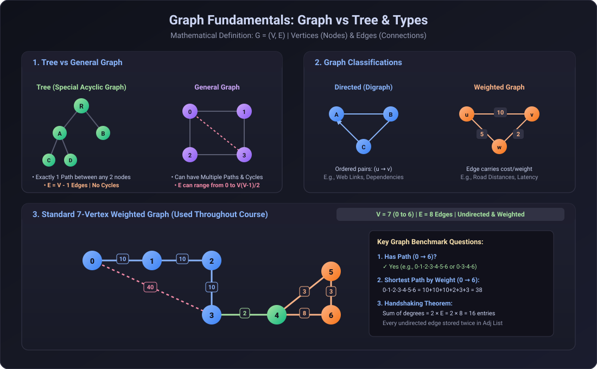
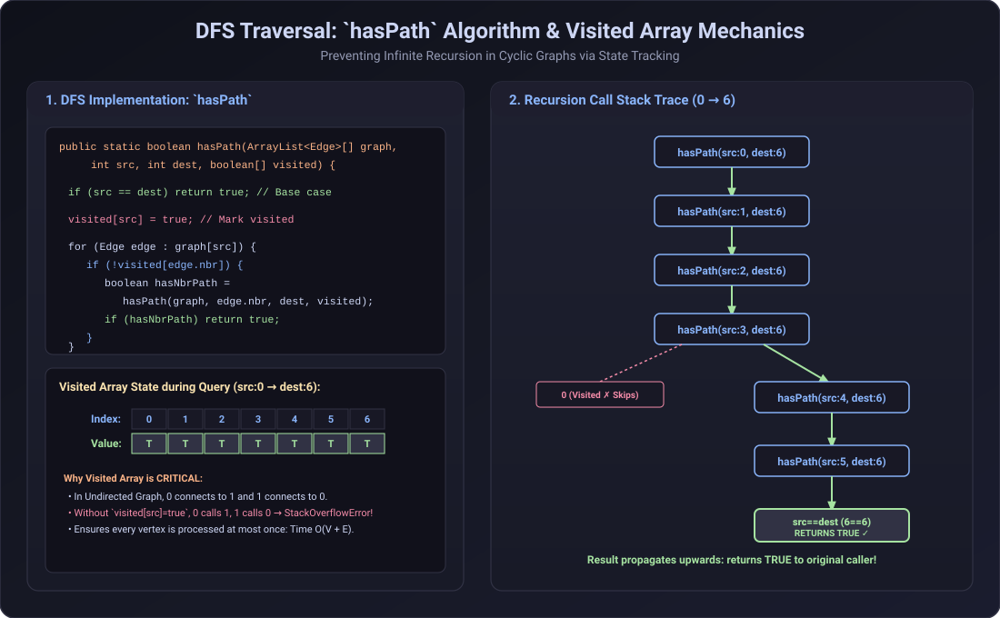
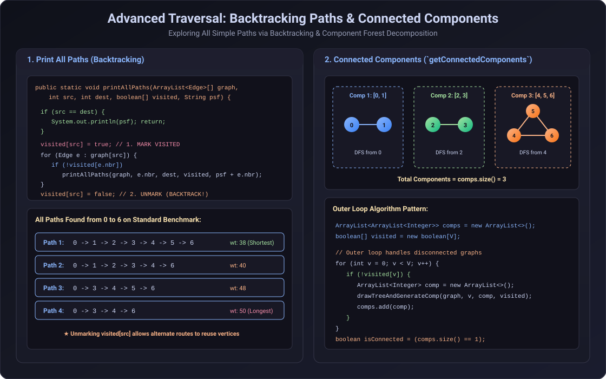

# Graph Representation & Traversal Notes



## 1. Graph Fundamentals & Classification

A **Graph** $G = (V, E)$ is a non-linear data structure consisting of a set of **Vertices** (Nodes) $V$ and a set of **Edges** (Connections) $E$.

### Tree vs General Graph
- **Tree**: A connected acyclic undirected graph.
  - Exactly **$V - 1$ edges** for $V$ vertices.
  - Exactly **one simple path** between any two nodes.
  - Hierarchical structure with a designated root node.
- **Graph**: Can contain multiple paths between vertices, cycles, or disconnected components.
  - Number of edges $E$ can range from $0$ (isolated vertices) up to $\frac{V(V-1)}{2}$ (complete undirected graph).

### Types of Graphs
1. **Undirected Graph**: Edges are bidirectional pairs $\{u, v\}$. If $u$ connects to $v$, then $v$ automatically connects to $u$.
2. **Directed Graph (Digraph)**: Edges are ordered pairs $(u \to v)$ with direction.
3. **Unweighted Graph**: Every edge has equal unit cost ($1$).
4. **Weighted Graph**: Every edge $(u, v)$ carries an associated weight/cost $w$ (e.g., road distance, latency, network cost).

---


## 2. Graph Representations & Memory Layout

### Standard 7-Vertex Benchmark Graph (Used Across the Course)
- **Vertices**: $0, 1, 2, 3, 4, 5, 6$ ($V = 7$)
- **Edges**: $8$ undirected weighted edges:
  - $(0, 1, 10)$, $(1, 2, 10)$, $(2, 3, 10)$, $(0, 3, 40)$
  - $(3, 4, 2)$
  - $(4, 5, 3)$, $(5, 6, 3)$, $(4, 6, 8)$

### The Handshaking Theorem
In any undirected graph, each edge is incident to two vertices. Thus:
$$\sum_{v \in V} \text{deg}(v) = 2E$$
For our 7-vertex graph with 8 undirected edges, the adjacency list stores $2 \times 8 = 16$ directed `Edge` object references across all array buckets.

### Java Memory Architecture for `ArrayList<Edge>[] graph`
1. **Stack Frame**: Contains the local variable `graph` (reference to the array on the Heap).
2. **Heap (Array of References)**: An array `new ArrayList[V]` of size $V=7$. Each cell initially holds `null`.
3. **Heap (ArrayList Instances)**: We must initialize each `graph[i] = new ArrayList<>()` to prevent `NullPointerException`.
4. **Heap (Edge Objects)**: Each `Edge(src, nbr, wt)` is instantiated and stored in the respective `ArrayList`.

---


### Representations
#### Java

```java

import java.util.ArrayList;


public class adj_list_01{

    static class Graph{
        int V;

        // used this widely
        ArrayList<Integer>[] list;

        public Graph(int v){
            V = v;
            list = new ArrayList[v];
            for(int i = 0; i < v; i++){
                list[i] = new ArrayList<>();
            }
        }
        //no default parameter in java like cpp
        void addEdge(int i, int j, boolean unDirected){
            list[i].add(j);
            if(unDirected)
                list[j].add(i);
        }

        void printAdjList(){
            // Iterate over all the rows!!
            for(int i = 0; i < V; i++){
                System.out.print(i + " --> ");
                // Iterating over one row!
                for(int node: list[i]){
                    System.out.print(node + ", ");
                }

                System.out.println();
            }
        }
    }

    public static void main(String[] args){
        Graph g = new Graph(6);

        g.addEdge(0, 1, true);
        g.addEdge(0, 4, true);
        g.addEdge(2, 1, true);
        g.addEdge(3, 4, true);
        g.addEdge(4, 5, true);
        g.addEdge(2, 3, true);
        g.addEdge(3, 5, true);
        g.printAdjList();
    }
}
/* Output:
0 --> 1, 4, 
1 --> 0, 2, 
2 --> 1, 3, 
3 --> 4, 2, 5, 
4 --> 0, 3, 5, 
5 --> 4, 3, 
*/
```
---


```java

import java.util.ArrayList;
import java.util.HashMap;
import java.util.Map;

public class adj_list_02_node {

    static class Node{
        String name;
        ArrayList<String> nbrs;

        Node(String name){
            this.name = name;
            nbrs = new ArrayList<>();
        }
    }

    static class Graph{

        HashMap<String, Node> mp;

        public Graph(ArrayList<String> cities){
            mp = new HashMap<>();
            for(String city: cities){
                mp.put(city, new Node(city));
            }
        }

        public void addEdge(String x, String y, boolean unDirected){
            mp.get(x).nbrs.add(y);
            if(unDirected){
                mp.get(y).nbrs.add(x);
            }
        }

        public void printAdjList(){
            for(Map.Entry<String, Node> cityPair: mp.entrySet()){
                System.out.print(cityPair.getKey() + " --> ");
                for(String nbrs: cityPair.getValue().nbrs){
                    System.out.print(nbrs + ", ");
                }
                System.out.println();
            }
        }


    }

    public static void main(String[] args){

        ArrayList<String> cities = new ArrayList<>();
        cities.add("Delhi");
        cities.add("London");
        cities.add("Paris");
        cities.add( "New York");

        Graph g = new Graph(cities);
        g.addEdge("Delhi", "London" , true);
        g.addEdge("New York","London", true);
        g.addEdge("Delhi","Paris" , true);
        g.addEdge("Paris","New York" , true);

        g.printAdjList();

    }
}

/*
Output:
Delhi --> London, Paris, 
New York --> London, Paris, 
London --> Delhi, New York, 
Paris --> Delhi, New York, 
*/


```

## Time Complexity: Why $O(V + E)$ and NOT $O(V \cdot E)$?

In an **Adjacency List**:
- We visit each vertex at most once $\to O(V)$.
- For each vertex $u$, we iterate through only its incident edges $(\text{deg}(u))$.
- Total edge iterations across the entire traversal:
  $$\sum_{u \in V} \text{deg}(u) = 2E \implies O(E)$$
- Hence, the total time complexity is **$O(V + E)$**.

> **Note:** $O(V \cdot E)$ would only happen if for *every* single vertex, we scanned all $E$ edges in the entire graph (which is what happens in an unindexed Edge List, not an Adjacency List).


#### Cpp

```cpp

#include <bits/stdc++.h>
using namespace std;

int main() {
    
    // Taking the input
    int n, m;
    cin >> n >> m;
    
    // adjacency list for undirected graph
    vector<int> adj[n+1];
    // vector<pair<int,int>> adj[n+1]; for weighted

    // Add the edges to the list
    for(int i = 0; i < m; i++) {
        
        // Taking the input
        int u, v;
        cin >> u >> v;
        
        // Adding the edges
        adj[u].push_back(v);
        adj[v].push_back(u);
    }
    return 0;
}
```

---

```cpp
#include <iostream>
#include <vector>

using namespace std;

class Graph {
    int V;
    vector<int>* l;

public:
    Graph(int v) {
        V = v;
        l = new vector<int>[V];
    }

    void addEdge(int i, int j, bool undir = true) {
        l[i].push_back(j);
        if (undir) {
            l[j].push_back(i);
        }
    }

    void printAdjList() {
        for (int i = 0; i < V; i++) {
            cout << i << " --> ";
            for (auto node : l[i]) {
                cout << node << ", ";
            }
            cout << endl;
        }
    }

    ~Graph() {
        delete[] l;
    }
};

int main() {
    Graph g(6);
    g.addEdge(0, 1, true);
    g.addEdge(0, 4, true);
    g.addEdge(2, 1, true);
    g.addEdge(3, 4, true);
    g.addEdge(4, 5, true);
    g.addEdge(2, 3, true);
    g.addEdge(3, 5, true);
    g.printAdjList();
    return 0;
}
/* Output:
0 --> 1, 4, 
1 --> 0, 2, 
2 --> 1, 3, 
3 --> 4, 2, 5, 
4 --> 0, 3, 5, 
5 --> 4, 3, 
*/
```


```cpp
#include<bits/stdc++.h>
using namespace std;


class Node{
public:
	string name;
	vector<string> nbrs;

	Node(string name){
		this->name = name;
	}
};

class Graph{
	//Node Name -- Pointer to Node Object
	//m is map having string key and Node pointer to node it is directed to
	
	unordered_map<string,Node*> m;
public:
	Graph(vector<string> cities){
		for(auto city : cities){
			m[city] = new Node(city);
		}
	}

	void addEdge(string x,string y,bool undir=false){
		m[x]->nbrs.push_back(y);
		if(undir){
			m[y]->nbrs.push_back(x);
		}
	}

	void printAdjList(){
		for(auto cityPair : m){
			auto city = cityPair.first;
			cout<<city<<"-->";
			Node *node = cityPair.second;
			for(auto nbr : node->nbrs){
				cout<<nbr<<",";
			}
			cout<<endl;
		}
	}
};


int main(){
	vector<string> cities = {"Delhi","London","Paris","New York"};
	Graph g(cities);
	g.addEdge("Delhi","London",true);
	g.addEdge("New York","London",true);
	g.addEdge("Delhi","Paris",true);
	g.addEdge("Paris","New York",true);

	g.printAdjList();
	

	return 0;
}

/*if undirected=false
Output:
New York-->London,
Paris-->New York,
Delhi-->London,Paris,
London-->
*/

/*
If undirected=true
Output:
New York-->London,Paris,
Paris-->Delhi,New York,
Delhi-->London,Paris,
London-->Delhi,New York,
*/
```


## Creating adjajency list from edge list

```cpp
#include <bits/stdc++.h>
using namespace std;

class Solution {
public:
    struct trip {
        int v, wt;
        trip(int v, int wt) : v(v), wt(wt) {}
    };

    vector<int> shortestPath(int n, int m, vector<vector<int>> &edges) {
        // Step 1: Create adjacency list
        vector<vector<trip>> graph(n + 1); // 1-based indexing

        // Step 2: Fill adjacency list from edge list
        for (int i = 0; i < m; i++) {
            int a = edges[i][0];
            int b = edges[i][1];
            int w = edges[i][2];

            // Undirected graph => add both directions
            graph[a].push_back(trip(b, w));
            graph[b].push_back(trip(a, w));
        }

        // Print adjacency list for testing
        for (int i = 1; i <= n; i++) {
            cout << i << " -> ";
            for (auto &t : graph[i]) {
                cout << "(" << t.v << "," << t.wt << ") ";
            }
            cout << "\n";
        }

        return {}; // empty list for now
    }
};

int main() {
    Solution sol;
    int n = 5, m = 6;
    vector<vector<int>> edges = {
        {1, 2, 2},
        {1, 4, 1},
        {2, 3, 4},
        {2, 5, 5},
        {3, 5, 1},
        {4, 3, 3}
    };

    sol.shortestPath(n, m, edges);
}

```

```java
class Solution {

    static class trip {
        int v, wt;
        trip(int v, int wt) {
            this.v = v;
            this.wt = wt;
        }
    }

    public List<Integer> shortestPath(int n, int m, int[][] edges) {
        // Step 1: Create adjacency list
        List<trip>[] graph = new ArrayList[n + 1]; // 1-based indexing
        for (int i = 1; i <= n; i++) {
            graph[i] = new ArrayList<>();
        }

        // Step 2: Fill adjacency list from edge list
        for (int i = 0; i < m; i++) {
            int a = edges[i][0];
            int b = edges[i][1];
            int w = edges[i][2];

            // Undirected graph => add both directions
            graph[a].add(new trip(b, w));
            graph[b].add(new trip(a, w));
        }

        // ✅ Now `graph` is ready to be used with Dijkstra or any graph algorithm
        // You can test it by printing:
        for (int i = 1; i <= n; i++) {
            System.out.print(i + " -> ");
            for (trip t : graph[i]) {
                System.out.print("(" + t.v + "," + t.wt + ") ");
            }
            System.out.println();
        }

        // Just returning an empty list for now, as shortestPath logic is not implemented here
        return new ArrayList<>();
    }

    public static void main(String[] args) {
        Solution sol = new Solution();
        int n = 5, m = 6;
        int[][] edges = {
            {1, 2, 2},
            {1, 4, 1},
            {2, 3, 4},
            {2, 5, 5},
            {3, 5, 1},
            {4, 3, 3}
        };

        sol.shortestPath(n, m, edges);
    }
}


```


---



## 3. Graph Traversal: `hasPath` (DFS)

### Problem Statement
Given a graph, a source vertex `src`, and a destination vertex `dest`, determine if there exists at least one valid path from `src` to `dest`.

### Algorithm & Mechanism
1. **Base Case**: If `src == dest`, a path is found; return `true`.
2. **Mark Visited**: Set `visited[src] = true` before exploring neighbors.
   - **Why `visited[]` is mandatory**: In an undirected or cyclic graph, neighbor $u$ points back to $v$. Without marking $src$ visited, recursion ping-pongs infinitely ($0 \to 1 \to 0 \to 1 \dots$), resulting in a `StackOverflowError`.
3. **Recursive Step**: For every unvisited neighbor `edge.nbr`, make a recursive call `hasPath(graph, edge.nbr, dest, visited)`. If any call returns `true`, immediately return `true`.
4. If all incident edges are explored and no path reaches `dest`, return `false`.

#### Java Implementation
```java
import java.util.ArrayList;

public class HasPath {
    static class Edge {
        int src, nbr, wt;
        Edge(int src, int nbr, int wt) {
            this.src = src;
            this.nbr = nbr;
            this.wt = wt;
        }
    }

    public static boolean hasPath(ArrayList<Edge>[] graph, int src, int dest, boolean[] visited) {
        if (src == dest) {
            return true;
        }

        visited[src] = true;
        for (Edge edge : graph[src]) {
            if (!visited[edge.nbr]) {
                boolean hasNbrPath = hasPath(graph, edge.nbr, dest, visited);
                if (hasNbrPath) {
                    return true;
                }
            }
        }
        return false;
    }

    public static void main(String[] args) {
        int vtces = 7;
        ArrayList<Edge>[] graph = new ArrayList[vtces];
        for (int i = 0; i < vtces; i++) {
            graph[i] = new ArrayList<>();
        }

        // Standard 7-vertex benchmark graph
        int[][] edges = {
            {0, 1, 10}, {1, 2, 10}, {2, 3, 10}, {0, 3, 40},
            {3, 4, 2}, {4, 5, 3}, {5, 6, 3}, {4, 6, 8}
        };
        for (int[] e : edges) {
            graph[e[0]].add(new Edge(e[0], e[1], e[2]));
            graph[e[1]].add(new Edge(e[1], e[0], e[2]));
        }

        boolean[] visited = new boolean[vtces];
        System.out.println("Has path 0 -> 6: " + hasPath(graph, 0, 6, visited)); // true
    }
}
```

#### C++ Implementation
```cpp
#include <iostream>
#include <vector>

using namespace std;

struct Edge {
    int src, nbr, wt;
    Edge(int src, int nbr, int wt) : src(src), nbr(nbr), wt(wt) {}
};

bool hasPath(const vector<vector<Edge>>& graph, int src, int dest, vector<bool>& visited) {
    if (src == dest) return true;

    visited[src] = true;
    for (const auto& edge : graph[src]) {
        if (!visited[edge.nbr]) {
            if (hasPath(graph, edge.nbr, dest, visited)) {
                return true;
            }
        }
    }
    return false;
}

int main() {
    int vtces = 7;
    vector<vector<Edge>> graph(vtces);

    vector<vector<int>> edges = {
        {0, 1, 10}, {1, 2, 10}, {2, 3, 10}, {0, 3, 40},
        {3, 4, 2}, {4, 5, 3}, {5, 6, 3}, {4, 6, 8}
    };

    for (const auto& e : edges) {
        graph[e[0]].emplace_back(e[0], e[1], e[2]);
        graph[e[1]].emplace_back(e[1], e[0], e[2]);
    }

    vector<bool> visited(vtces, false);
    cout << boolalpha << "Has path 0 -> 6: " << hasPath(graph, 0, 6, visited) << endl; // true
    return 0;
}
```

---



## 4. Advanced Traversals: All Paths (Backtracking) & Connected Components

### Print All Paths (Backtracking)
Unlike `hasPath` (which stops at the first path found), **Print All Paths** must find *every* simple path from `src` to `dest`.
- **The Backtracking Technique**:
  1. `visited[src] = true;` (mark current node visited for this branch).
  2. Recursively visit all unvisited neighbors, passing path-so-far `psf + edge.nbr`.
  3. `visited[src] = false;` (**unmark / backtrack** so subsequent alternate paths can reuse this vertex).

#### Java Implementation
```java
import java.util.ArrayList;

public class PrintAllPaths {
    static class Edge {
        int src, nbr, wt;
        Edge(int src, int nbr, int wt) {
            this.src = src;
            this.nbr = nbr;
            this.wt = wt;
        }
    }

    public static void printAllPaths(ArrayList<Edge>[] graph, int src, int dest, boolean[] visited, String psf) {
        if (src == dest) {
            System.out.println(psf);
            return;
        }

        visited[src] = true;
        for (Edge edge : graph[src]) {
            if (!visited[edge.nbr]) {
                printAllPaths(graph, edge.nbr, dest, visited, psf + edge.nbr);
            }
        }
        visited[src] = false; // Backtrack!
    }

    public static void main(String[] args) {
        int vtces = 7;
        ArrayList<Edge>[] graph = new ArrayList[vtces];
        for (int i = 0; i < vtces; i++) graph[i] = new ArrayList<>();

        int[][] edges = {
            {0, 1, 10}, {1, 2, 10}, {2, 3, 10}, {0, 3, 40},
            {3, 4, 2}, {4, 5, 3}, {5, 6, 3}, {4, 6, 8}
        };
        for (int[] e : edges) {
            graph[e[0]].add(new Edge(e[0], e[1], e[2]));
            graph[e[1]].add(new Edge(e[1], e[0], e[2]));
        }

        boolean[] visited = new boolean[vtces];
        System.out.println("All Paths from 0 to 6:");
        printAllPaths(graph, 0, 6, visited, "0");
    }
}
```

#### C++ Implementation
```cpp
#include <iostream>
#include <vector>
#include <string>

using namespace std;

struct Edge {
    int src, nbr, wt;
    Edge(int src, int nbr, int wt) : src(src), nbr(nbr), wt(wt) {}
};

void printAllPaths(const vector<vector<Edge>>& graph, int src, int dest, vector<bool>& visited, string psf) {
    if (src == dest) {
        cout << psf << "\n";
        return;
    }

    visited[src] = true;
    for (const auto& edge : graph[src]) {
        if (!visited[edge.nbr]) {
            printAllPaths(graph, edge.nbr, dest, visited, psf + to_string(edge.nbr));
        }
    }
    visited[src] = false; // Backtrack!
}

int main() {
    int vtces = 7;
    vector<vector<Edge>> graph(vtces);
    vector<vector<int>> edges = {
        {0, 1, 10}, {1, 2, 10}, {2, 3, 10}, {0, 3, 40},
        {3, 4, 2}, {4, 5, 3}, {5, 6, 3}, {4, 6, 8}
    };
    for (const auto& e : edges) {
        graph[e[0]].emplace_back(e[0], e[1], e[2]);
        graph[e[1]].emplace_back(e[1], e[0], e[2]);
    }

    vector<bool> visited(vtces, false);
    cout << "All Paths from 0 to 6:\n";
    printAllPaths(graph, 0, 6, visited, "0");
    return 0;
}
```

---

### Connected Components (`getConnectedComponents` & `isGraphConnected`)
A graph may not be fully connected; it can consist of multiple disjoint subgraphs (a forest of components).
- **Algorithm**:
  1. Maintain a global `boolean[] visited = new boolean[V]`.
  2. Outer loop from `v = 0` to `V - 1`:
     - If `!visited[v]`, launch a DFS/BFS starting at `v`.
     - Collect all vertices reachable in this DFS into a list `comp`.
     - Add `comp` to `comps`.
  3. **Graph Connectivity**: A graph is connected if and only if `comps.size() == 1`.

#### Java Implementation
```java
import java.util.ArrayList;

public class ConnectedComponents {
    static class Edge {
        int src, nbr;
        Edge(int src, int nbr) { this.src = src; this.nbr = nbr; }
    }

    public static void drawTreeAndGenerateComp(ArrayList<Edge>[] graph, int src, ArrayList<Integer> comp, boolean[] visited) {
        visited[src] = true;
        comp.add(src);
        for (Edge e : graph[src]) {
            if (!visited[e.nbr]) {
                drawTreeAndGenerateComp(graph, e.nbr, comp, visited);
            }
        }
    }

    public static ArrayList<ArrayList<Integer>> getConnectedComponents(ArrayList<Edge>[] graph, int vtces) {
        ArrayList<ArrayList<Integer>> comps = new ArrayList<>();
        boolean[] visited = new boolean[vtces];

        for (int v = 0; v < vtces; v++) {
            if (!visited[v]) {
                ArrayList<Integer> comp = new ArrayList<>();
                drawTreeAndGenerateComp(graph, v, comp, visited);
                comps.add(comp);
            }
        }
        return comps;
    }

    public static boolean isGraphConnected(ArrayList<Edge>[] graph, int vtces) {
        return getConnectedComponents(graph, vtces).size() == 1;
    }
}
```

#### C++ Implementation
```cpp
#include <iostream>
#include <vector>

using namespace std;

struct Edge {
    int src, nbr;
    Edge(int src, int nbr) : src(src), nbr(nbr) {}
};

void drawTreeAndGenerateComp(const vector<vector<Edge>>& graph, int src, vector<int>& comp, vector<bool>& visited) {
    visited[src] = true;
    comp.push_back(src);
    for (const auto& e : graph[src]) {
        if (!visited[e.nbr]) {
            drawTreeAndGenerateComp(graph, e.nbr, comp, visited);
        }
    }
}

vector<vector<int>> getConnectedComponents(const vector<vector<Edge>>& graph, int vtces) {
    vector<vector<int>> comps;
    vector<bool> visited(vtces, false);

    for (int v = 0; v < vtces; v++) {
        if (!visited[v]) {
            vector<int> comp;
            drawTreeAndGenerateComp(graph, v, comp, visited);
            comps.push_back(comp);
        }
    }
    return comps;
}

bool isGraphConnected(const vector<vector<Edge>>& graph, int vtces) {
    return getConnectedComponents(graph, vtces).size() == 1;
}
```

---

## 5. Multisolver: Smallest, Longest, Ceil, Floor, & K-th Largest Path

### Problem Statement
Given a weighted undirected/directed graph, a source `src`, a destination `dest`, a `criteria` weight, and an integer `k`, find:
1. **Smallest Path** (Minimum total weight path) and its weight.
2. **Longest Path** (Maximum total weight path) and its weight.
3. **Ceil Path** (Path with the minimum weight strictly greater than `criteria`).
4. **Floor Path** (Path with the maximum weight strictly smaller than `criteria`).
5. **K-th Largest Path** (Path with the $k$-th largest weight among all simple paths).

### Algorithm & Data Structures
- Perform a **Backtracking DFS** traversal to generate all simple paths from `src` to `dest`.
- Track path weight so far `wsf` and path so far `psf`.
- When reaching `dest` (`src == dest`):
  - **Smallest**: If `wsf < spathwt`, update `spathwt = wsf`, `spath = psf`.
  - **Longest**: If `wsf > lpathwt`, update `lpathwt = wsf`, `lpath = psf`.
  - **Ceil** ($> \text{criteria}$): If `wsf > criteria && wsf < cpathwt`, update `cpathwt = wsf`, `cpath = psf`.
  - **Floor** ($< \text{criteria}$): If `wsf < criteria && wsf > fpathwt`, update `fpathwt = wsf`, `fpath = psf`.
  - **K-th Largest Path** using a **Min-PriorityQueue (Min-Heap) of size $k$**:
    - If `pq.size() < k`: `pq.add(new Pair(wsf, psf))`.
    - Else if `wsf > pq.peek().wsf`: `pq.remove(); pq.add(new Pair(wsf, psf));`.
    - At the end of the entire search, the top of the Min-Heap is precisely the $k$-th largest path!

#### Java Implementation
```java
import java.util.ArrayList;
import java.util.PriorityQueue;

public class MultiSolver {
    static class Edge {
        int src, nbr, wt;
        Edge(int src, int nbr, int wt) {
            this.src = src;
            this.nbr = nbr;
            this.wt = wt;
        }
    }

    static class Pair implements Comparable<Pair> {
        int wsf;
        String psf;

        Pair(int wsf, String psf) {
            this.wsf = wsf;
            this.psf = psf;
        }

        public int compareTo(Pair o) {
            return this.wsf - o.wsf; // Min-Heap based on weight
        }
    }

    static String spath;
    static Integer spathwt = Integer.MAX_VALUE;
    static String lpath;
    static Integer lpathwt = Integer.MIN_VALUE;
    static String cpath;
    static Integer cpathwt = Integer.MAX_VALUE;
    static String fpath;
    static Integer fpathwt = Integer.MIN_VALUE;
    static PriorityQueue<Pair> pq = new PriorityQueue<>();

    public static void multisolver(ArrayList<Edge>[] graph, int src, int dest, boolean[] visited,
                                   int criteria, int k, String psf, int wsf) {
        if (src == dest) {
            // 1. Smallest path
            if (wsf < spathwt) {
                spathwt = wsf;
                spath = psf;
            }

            // 2. Longest path
            if (wsf > lpathwt) {
                lpathwt = wsf;
                lpath = psf;
            }

            // 3. Ceil path (> criteria and minimum among them)
            if (wsf > criteria && wsf < cpathwt) {
                cpathwt = wsf;
                cpath = psf;
            }

            // 4. Floor path (< criteria and maximum among them)
            if (wsf < criteria && wsf > fpathwt) {
                fpathwt = wsf;
                fpath = psf;
            }

            // 5. K-th Largest path (using Min-Heap of size k)
            if (pq.size() < k) {
                pq.add(new Pair(wsf, psf));
            } else if (wsf > pq.peek().wsf) {
                pq.remove();
                pq.add(new Pair(wsf, psf));
            }
            return;
        }

        visited[src] = true;
        for (Edge e : graph[src]) {
            if (!visited[e.nbr]) {
                multisolver(graph, e.nbr, dest, visited, criteria, k, psf + e.nbr, wsf + e.wt);
            }
        }
        visited[src] = false; // Backtrack
    }

    public static void main(String[] args) {
        int vtces = 7;
        ArrayList<Edge>[] graph = new ArrayList[vtces];
        for (int i = 0; i < vtces; i++) graph[i] = new ArrayList<>();

        int[][] edges = {
            {0, 1, 10}, {1, 2, 10}, {2, 3, 10}, {0, 3, 40},
            {3, 4, 2}, {4, 5, 3}, {5, 6, 3}, {4, 6, 8}
        };
        for (int[] e : edges) {
            graph[e[0]].add(new Edge(e[0], e[1], e[2]));
            graph[e[1]].add(new Edge(e[1], e[0], e[2]));
        }

        int src = 0, dest = 6, criteria = 40, k = 3;
        boolean[] visited = new boolean[vtces];

        multisolver(graph, src, dest, visited, criteria, k, "0", 0);

        System.out.println("Smallest Path = " + spath + "@" + spathwt);
        System.out.println("Largest Path = " + lpath + "@" + lpathwt);
        System.out.println("Just Larger Path than " + criteria + " = " + cpath + "@" + cpathwt);
        System.out.println("Just Smaller Path than " + criteria + " = " + fpath + "@" + fpathwt);
        System.out.println(k + "th largest path = " + pq.peek().psf + "@" + pq.peek().wsf);
    }
}
```

#### C++ Implementation
```cpp
#include <iostream>
#include <vector>
#include <string>
#include <queue>
#include <climits>

using namespace std;

struct Edge {
    int src, nbr, wt;
    Edge(int src, int nbr, int wt) : src(src), nbr(nbr), wt(wt) {}
};

struct Pair {
    int wsf;
    string psf;
    Pair(int wsf, string psf) : wsf(wsf), psf(psf) {}

    // Operator for Min-Heap
    bool operator>(const Pair& other) const {
        return this->wsf > other.wsf;
    }
};

string spath;
int spathwt = INT_MAX;
string lpath;
int lpathwt = INT_MIN;
string cpath;
int cpathwt = INT_MAX;
string fpath;
int fpathwt = INT_MIN;

// Min-Heap of Pairs
priority_queue<Pair, vector<Pair>, greater<Pair>> pq;

void multisolver(const vector<vector<Edge>>& graph, int src, int dest, vector<bool>& visited,
                 int criteria, int k, string psf, int wsf) {
    if (src == dest) {
        // 1. Smallest
        if (wsf < spathwt) {
            spathwt = wsf;
            spath = psf;
        }

        // 2. Largest
        if (wsf > lpathwt) {
            lpathwt = wsf;
            lpath = psf;
        }

        // 3. Ceil (> criteria)
        if (wsf > criteria && wsf < cpathwt) {
            cpathwt = wsf;
            cpath = psf;
        }

        // 4. Floor (< criteria)
        if (wsf < criteria && wsf > fpathwt) {
            fpathwt = wsf;
            fpath = psf;
        }

        // 5. K-th Largest (Min-Heap of size k)
        if ((int)pq.size() < k) {
            pq.push(Pair(wsf, psf));
        } else if (wsf > pq.top().wsf) {
            pq.pop();
            pq.push(Pair(wsf, psf));
        }
        return;
    }

    visited[src] = true;
    for (const auto& e : graph[src]) {
        if (!visited[e.nbr]) {
            multisolver(graph, e.nbr, dest, visited, criteria, k, psf + to_string(e.nbr), wsf + e.wt);
        }
    }
    visited[src] = false; // Backtrack
}

int main() {
    int vtces = 7;
    vector<vector<Edge>> graph(vtces);
    vector<vector<int>> edges = {
        {0, 1, 10}, {1, 2, 10}, {2, 3, 10}, {0, 3, 40},
        {3, 4, 2}, {4, 5, 3}, {5, 6, 3}, {4, 6, 8}
    };
    for (const auto& e : edges) {
        graph[e[0]].emplace_back(e[0], e[1], e[2]);
        graph[e[1]].emplace_back(e[1], e[0], e[2]);
    }

    int src = 0, dest = 6, criteria = 40, k = 3;
    vector<bool> visited(vtces, false);

    multisolver(graph, src, dest, visited, criteria, k, "0", 0);

    cout << "Smallest Path = " << spath << "@" << spathwt << "\n";
    cout << "Largest Path = " << lpath << "@" << lpathwt << "\n";
    cout << "Just Larger Path than " << criteria << " = " << cpath << "@" << cpathwt << "\n";
    cout << "Just Smaller Path than " << criteria << " = " << fpath << "@" << fpathwt << "\n";
    cout << k << "th largest path = " << pq.top().psf << "@" << pq.top().wsf << "\n";

    return 0;
}
```

---


# Question 1 — What Basic Graph and Tree Terminology Is Used?


A graph is a pair

$$
G=(V,E),
$$

where $V$ is the set of vertices and $E$ is the set of edges.

```text
Undirected edge:  A — B       Directed edge:  A → B

Self-loop:        A ↺         Parallel edges:  A ═ B
```

- A **simple graph** has neither self-loops nor multiple edges between the same pair.
- A **multigraph** may contain parallel edges.
- A **path** is a sequence of vertices in which consecutive vertices are joined by an edge.
- A **cycle** is a path that returns to its starting vertex.
- The **degree** of an undirected vertex is the number of incident edges. A self-loop contributes two.

For a rooted tree:

```text
             A                 level 0, depth 0
           /   \
          B     C              level 1
         / \     \
        D   E     F            level 2

parent of D = B
children of A = {B, C}
leaves = {D, E, F}
height of the tree = 2 edges
```

A tree with $N$ vertices has exactly

$$
N-1
$$

edges. It is connected and contains no cycle.

## Common mistakes

- A vertex's **depth** is measured from the root; its **height** is measured down to its deepest leaf.
- A path need not contain every vertex.
- The number of edges, not vertices, normally defines path length in an unweighted graph.

---

# Question 2 — How Can We Represent a Graph in Memory?


Assume $V$ vertices and $E$ edges.

## Approach 1 — Edge list

Store every edge as a pair, or as a triple when weights are present.

```text
Unweighted: (A,B), (A,C), (B,D)
Weighted:   (A,B,7), (A,C,2), (B,D,5)
```

This is compact and convenient when an algorithm processes all edges, but testing whether one particular edge exists takes $O(E)$.

- Space: $O(E)$
- Enumerate all edges: $O(E)$
- Test adjacency: $O(E)$

## Approach 2 — Adjacency matrix

Create a $V\times V$ matrix:

$$
M[u][v]=
\begin{cases}
1, & \text{if }(u,v)\in E,\\
0, & \text{otherwise.}
\end{cases}
$$

For a weighted graph, store the weight instead of `1`, with a separate sentinel for “no edge.”

```text
      A B C D
  A [ 0 1 1 0 ]
  B [ 1 0 0 1 ]
  C [ 1 0 0 0 ]
  D [ 0 1 0 0 ]
```

An undirected graph gives a symmetric matrix because $M[u][v]=M[v][u]$. A directed graph need not be symmetric.

- Space: $O(V^2)$
- Add, remove or test one edge: $O(1)$
- Enumerate neighbours of one vertex: $O(V)$

Use it when the graph is dense or constant-time edge lookup matters.

## Approach 3 — Adjacency list

Each vertex stores only its actual neighbours.

```text
A → B, C
B → A, D
C → A
D → B
```

For a weighted graph:

```text
A → (B,7), (C,2)
B → (A,7), (D,5)
```

- Space: $O(V+E)$
- Enumerate neighbours of $u$: $O(\deg(u))$
- Traverse the complete graph: $O(V+E)$
- Edge lookup: $O(\deg(u))$ with a list, expected $O(1)$ with a hash map

## Which representation should be chosen?

| Need | Best default |
|---|---|
| Iterate through all edges | Edge list |
| Dense graph or very fast edge lookup | Adjacency matrix |
| Sparse graph and graph traversal | Adjacency list |
| Weighted adjacency with updates | Map of neighbour → weight |

The central idea is that a representation is chosen by the operations an algorithm performs—not by memorising one “best” structure.

---

# Question 3 — How Do We Implement a Weighted Undirected Graph (Adjacency Map)?

The lecture represents every vertex by a name/key. Its neighbour map stores both adjacency and edge weight:

```text
vertices
  "A" → { "B": 7, "C": 2 }
  "B" → { "A": 7, "D": 5 }
```

An undirected edge must be written in **both** neighbour maps.

#### Java Implementation
```java
import java.util.*;

final class WeightedGraph {
    private final Map<String, Map<String, Integer>> graph = new HashMap<>();

    void addVertex(String name) {
        graph.putIfAbsent(name, new HashMap<>());
    }

    void addEdge(String u, String v, int weight) {
        addVertex(u);
        addVertex(v);
        graph.get(u).put(v, weight);
        graph.get(v).put(u, weight);       // omit for a directed graph
    }

    boolean containsEdge(String u, String v) {
        return graph.containsKey(u) && graph.get(u).containsKey(v);
    }

    void removeEdge(String u, String v) {
        if (graph.containsKey(u)) graph.get(u).remove(v);
        if (graph.containsKey(v)) graph.get(v).remove(u);
    }

    void removeVertex(String vertex) {
        if (!graph.containsKey(vertex)) return;
        for (String neighbour : new ArrayList<>(graph.get(vertex).keySet())) {
            graph.get(neighbour).remove(vertex);
        }
        graph.remove(vertex);
    }

    int numberOfEdges() {
        int degreeSum = 0;
        for (Map<String, Integer> neighbours : graph.values()) {
            degreeSum += neighbours.size();
        }
        return degreeSum / 2;
    }

    void display() {
        for (var entry : graph.entrySet()) {
            System.out.println(entry.getKey() + " -> " + entry.getValue());
        }
    }
}
```

#### C++ Implementation
```cpp
#include <iostream>
#include <unordered_map>
#include <string>
#include <vector>

using namespace std;

class WeightedGraph {
private:
    unordered_map<string, unordered_map<string, int>> graph;

public:
    void addVertex(const string& name) {
        if (graph.find(name) == graph.end()) {
            graph[name] = unordered_map<string, int>();
        }
    }

    void addEdge(const string& u, const string& v, int weight) {
        addVertex(u);
        addVertex(v);
        graph[u][v] = weight;
        graph[v][u] = weight; // omit for directed graph
    }

    bool containsEdge(const string& u, const string& v) {
        return graph.find(u) != graph.end() && graph[u].find(v) != graph[u].end();
    }

    void removeEdge(const string& u, const string& v) {
        if (graph.find(u) != graph.end()) graph[u].erase(v);
        if (graph.find(v) != graph.end()) graph[v].erase(u);
    }

    void removeVertex(const string& vertex) {
        if (graph.find(vertex) == graph.end()) return;
        for (auto& pair : graph[vertex]) {
            graph[pair.first].erase(vertex);
        }
        graph.erase(vertex);
    }

    int numberOfEdges() {
        int degreeSum = 0;
        for (const auto& pair : graph) {
            degreeSum += pair.second.size();
        }
        return degreeSum / 2;
    }

    void display() {
        for (const auto& entry : graph) {
            cout << entry.first << " -> { ";
            for (const auto& nbr : entry.second) {
                cout << nbr.first << ": " << nbr.second << " ";
            }
            cout << "}\n";
        }
    }
};
```

## Why divide the degree sum by two?

Every undirected edge $(u,v)$ appears once in $u$'s map and once in $v$'s map. Therefore:

$$
\sum_{v\in V}\deg(v)=2E
\quad\Longrightarrow\quad
E=\frac{1}{2}\sum_{v\in V}\deg(v).
$$

## Complexity

With hash maps, expected costs are:

- Add vertex: $O(1)$
- Add, remove or test an edge: $O(1)$
- Remove vertex $u$: $O(\deg(u))$
- Display the graph: $O(V+E)$
- Space: $O(V+E)$

## Implementation traps

- Update both directions for an undirected edge.
- When deleting a vertex, first delete its name from every neighbour.
- Do not use `0` as “no edge” if a valid edge may have weight zero.
- Parallel edges need a list of weights; a simple map keeps only one weight per neighbour.


