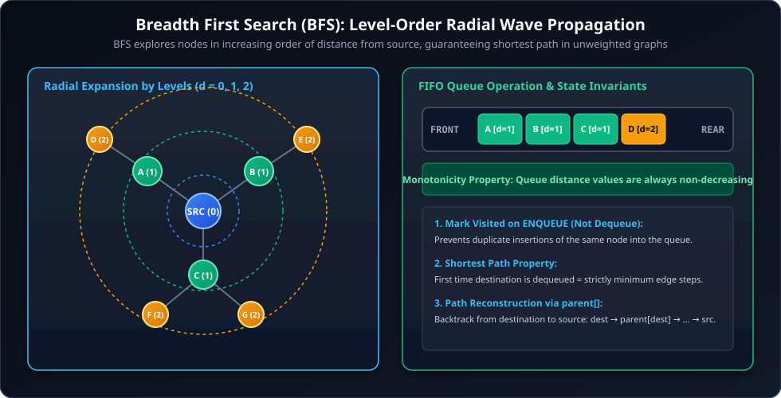
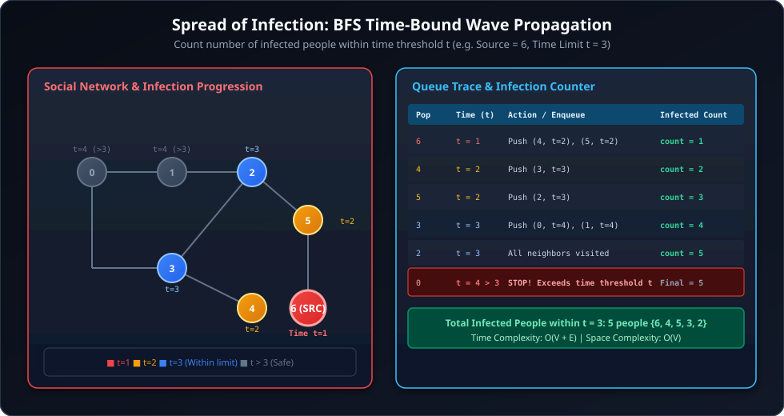
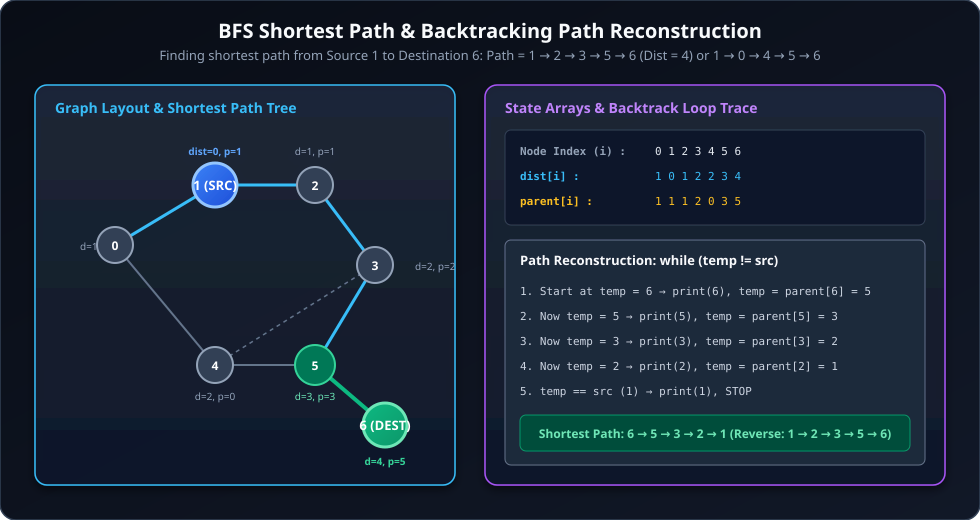
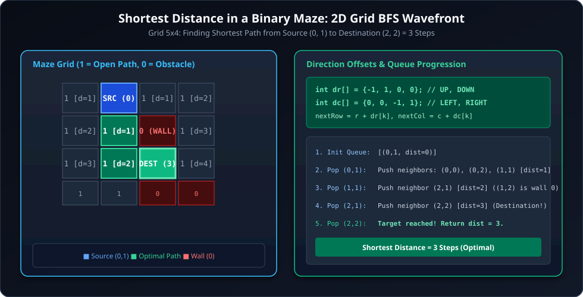
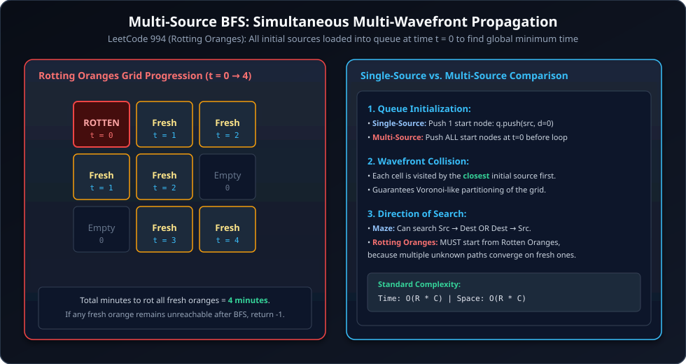
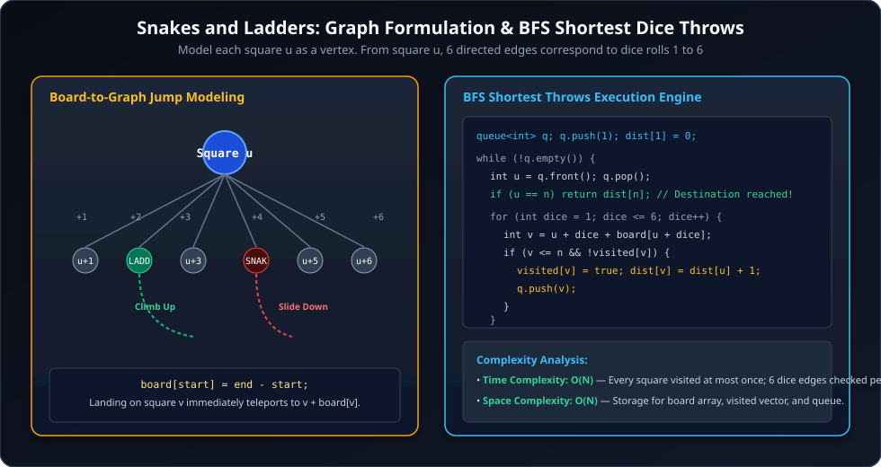
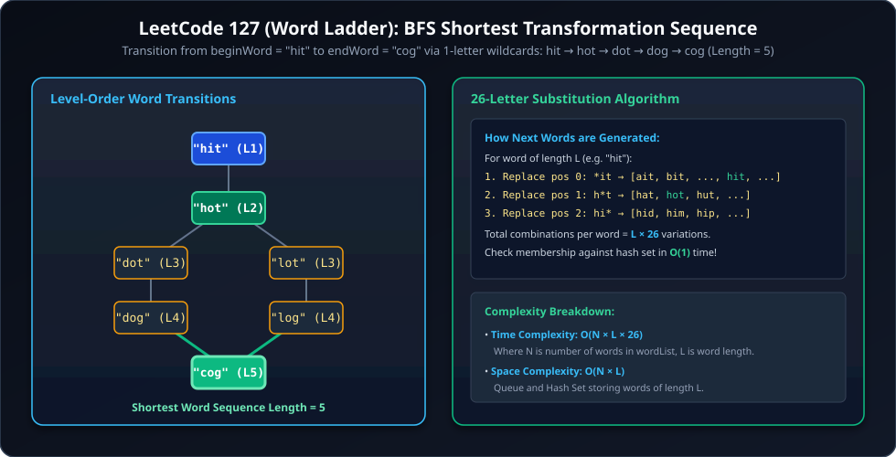

# Comprehensive Breadth First Search (BFS) Deep Dive

---

## 1. BFS Foundations & Traversal Mechanics



### 1.1 Core Principles
1. **FIFO Queue Order:** BFS explores vertices in increasing order of their distance from the source vertex.
2. **Shortest Path Property:** In unweighted graphs (where each edge has cost 1), the first time a node is reached and enqueued, the recorded distance is the **globally shortest distance**.
3. **Queue Monotonicity:** Distance labels of elements currently residing in the queue never decrease: if the queue contains distances $d$, new elements added will have distance $d$ or $d + 1$.
4. **Visited Marking Rule:** Always mark a vertex as `visited = true` **immediately upon ENQUEUEING** (not when dequeueing). Marking upon dequeueing permits duplicate insertions of the same node, leading to exponential queue blowup!

---

## 2. Q1 GFG: Spread of Infection (Time-Bounded BFS)

### 2.1 Problem Description
You are given a graph representing a network of $V$ people and their mutual contact connections (undirected graph). You are given a person `src` who is infected on day `t = 1`. Every day, an infected person spreads the infection to all of their direct, uninfected contacts.

You are also given a time threshold `t`.

Find the **total count of people who have been infected on or before time $t$**.



---

### 2.2 Examples & Constraints

#### Example 1
```text
Input: V = 7, E = 8, 
       edges = [[0, 1], [1, 2], [2, 3], [0, 3], [3, 4], [4, 5], [5, 6], [4, 6]], 
       src = 6, t = 3
Output: 5
Explanation:
- Day 1: Person 6 is infected (count = 1).
- Day 2: People 4 and 5 are infected (count = 3).
- Day 3: People 3 and 2 are infected (count = 5).
- Day 4: People 0 and 1 would be infected, but day 4 > time threshold t = 3.
Total infected people within t = 3 is 5.
```

#### Constraints
- $1 \le V \le 10^5$
- $0 \le E \le 10^5$
- $0 \le src < V$
- $1 \le t \le 10^5$

---

### 2.3 Complete C++ Implementation

```cpp
#include <iostream>
#include <vector>
#include <queue>

using namespace std;

struct Person {
    int id;
    int time;
};

class Solution {
public:
    int spreadOfInfection(int V, vector<vector<int>>& adj, int src, int t) {
        // visited array stores the time at which each person was infected (0 = uninfected)
        vector<int> visited(V, 0);
        queue<Person> q;

        // Initialize with patient zero (source) at time 1
        q.push({src, 1});
        visited[src] = 1;
        int infectedCount = 0;

        while (!q.empty()) {
            Person curr = q.front();
            q.pop();

            // If the infection time exceeds the threshold, stop counting
            if (curr.time > t) {
                break;
            }

            infectedCount++;

            // Spread infection to all uninfected direct neighbors
            for (int nbr : adj[curr.id]) {
                if (visited[nbr] == 0) {
                    visited[nbr] = curr.time + 1; // Mark visited with discovery time
                    q.push({nbr, curr.time + 1});
                }
            }
        }

        return infectedCount;
    }
};

int main() {
    int V = 7;
    vector<vector<int>> adj(V);
    auto addEdge = [&](int u, int v) {
        adj[u].push_back(v);
        adj[v].push_back(u);
    };

    addEdge(0, 1);
    addEdge(1, 2);
    addEdge(2, 3);
    addEdge(0, 3);
    addEdge(3, 4);
    addEdge(4, 5);
    addEdge(5, 6);
    addEdge(4, 6);

    Solution sol;
    int src = 6, t = 3;
    cout << "Total Infected People: " << sol.spreadOfInfection(V, adj, src, t) << endl;
    return 0;
}
```

---

### 2.4 Complete Java Implementation

```java
import java.util.*;

class Solution {
    static class Person {
        int id;
        int time;

        Person(int id, int time) {
            this.id = id;
            this.time = time;
        }
    }

    public static int spreadOfInfection(int V, ArrayList<ArrayList<Integer>> adj, int src, int t) {
        int[] visited = new int[V]; // 0 = uninfected
        Queue<Person> q = new ArrayDeque<>();

        // Enqueue patient zero at day 1
        q.offer(new Person(src, 1));
        visited[src] = 1;
        int infectedCount = 0;

        while (!q.isEmpty()) {
            Person curr = q.poll();

            // Stop counting when infection wave exceeds day threshold t
            if (curr.time > t) {
                break;
            }

            infectedCount++;

            for (int nbr : adj.get(curr.id)) {
                if (visited[nbr] == 0) {
                    visited[nbr] = curr.time + 1; // Mark on enqueue
                    q.offer(new Person(nbr, curr.time + 1));
                }
            }
        }

        return infectedCount;
    }
}
```

---

### 2.5 Complexity Analysis

- **Time Complexity:** $\mathcal{O}(V + E)$
  - In the worst case, BFS visits every vertex and explores each edge once until time $t$ is exceeded or the queue empties.
- **Space Complexity:** $\mathcal{O}(V)$
  - `visited[]` array of size $V$ and queue storing at most $\mathcal{O}(V)$ elements.

---

## 3. Q2: Breadth First Search & Shortest Path Reconstruction on Unweighted Graph

### 3.1 Problem Description
Given an undirected graph with $V$ vertices and an adjacency list, compute the shortest path distance from a given `source` vertex to all other vertices. Furthermore, reconstruct and print the exact shortest path from `source` to any target `destination`.



---

### 3.2 Complete C++ Implementation

```cpp
#include <iostream>
#include <vector>
#include <queue>
#include <algorithm>

using namespace std;

class Graph {
    int V;
    vector<vector<int>> adj;

public:
    Graph(int v) : V(v), adj(v) {}

    void addEdge(int u, int v, bool undirected = true) {
        adj[u].push_back(v);
        if (undirected) {
            adj[v].push_back(u);
        }
    }

    void bfsShortestPath(int source, int dest = -1) {
        queue<int> q;
        vector<bool> visited(V, false);
        vector<int> dist(V, -1);
        vector<int> parent(V, -1);

        // 1. Initialize Source
        q.push(source);
        visited[source] = true;
        dist[source] = 0;
        parent[source] = source;

        // 2. BFS Traversal
        while (!q.empty()) {
            int u = q.front();
            q.pop();

            for (int v : adj[u]) {
                if (!visited[v]) {
                    visited[v] = true;
                    dist[v] = dist[u] + 1;
                    parent[v] = u;
                    q.push(v);
                }
            }
        }

        // 3. Print All Shortest Distances
        cout << "Shortest distances from source " << source << ":\n";
        for (int i = 0; i < V; i++) {
            cout << "Node " << i << " -> Distance: " << dist[i] << "\n";
        }

        // 4. Reconstruct Path to Destination if requested
        if (dest != -1) {
            if (!visited[dest]) {
                cout << "Destination " << dest << " is unreachable from " << source << "\n";
                return;
            }

            vector<int> path;
            int curr = dest;
            while (curr != source) {
                path.push_back(curr);
                curr = parent[curr];
            }
            path.push_back(source);
            reverse(path.begin(), path.end());

            cout << "Shortest Path to " << dest << ": ";
            for (size_t i = 0; i < path.size(); i++) {
                cout << path[i] << (i + 1 < path.size() ? " -> " : "\n");
            }
        }
    }
};

int main() {
    Graph g(7);
    g.addEdge(0, 1);
    g.addEdge(1, 2);
    g.addEdge(2, 3);
    g.addEdge(3, 5);
    g.addEdge(5, 6);
    g.addEdge(4, 5);
    g.addEdge(0, 4);
    g.addEdge(3, 4);

    g.bfsShortestPath(1, 6);
    return 0;
}
```

---

### 2.3 Complete Java Implementation

```java
import java.util.*;

class GraphShortestPath {
    private int V;
    private List<List<Integer>> adj;

    public GraphShortestPath(int v) {
        this.V = v;
        adj = new ArrayList<>();
        for (int i = 0; i < v; i++) {
            adj.add(new ArrayList<>());
        }
    }

    public void addEdge(int u, int v, boolean undirected) {
        adj.get(u).add(v);
        if (undirected) {
            adj.get(v).add(u);
        }
    }

    public void bfsShortestPath(int source, int dest) {
        Queue<Integer> q = new ArrayDeque<>();
        boolean[] visited = new boolean[V];
        int[] dist = new int[V];
        int[] parent = new int[V];
        Arrays.fill(dist, -1);
        Arrays.fill(parent, -1);

        // 1. Initialize Source
        q.offer(source);
        visited[source] = true;
        dist[source] = 0;
        parent[source] = source;

        // 2. BFS Traversal
        while (!q.isEmpty()) {
            int u = q.poll();

            for (int v : adj.get(u)) {
                if (!visited[v]) {
                    visited[v] = true;
                    dist[v] = dist[u] + 1;
                    parent[v] = u;
                    q.offer(v);
                }
            }
        }

        // 3. Print Distances
        for (int i = 0; i < V; i++) {
            System.out.println("Node " + i + " -> Distance: " + dist[i]);
        }

        // 4. Reconstruct Path
        if (dest != -1) {
            if (!visited[dest]) {
                System.out.println("Destination " + dest + " is unreachable.");
                return;
            }

            List<Integer> path = new ArrayList<>();
            int curr = dest;
            while (curr != source) {
                path.add(curr);
                curr = parent[curr];
            }
            path.add(source);
            Collections.reverse(path);

            System.out.println("Shortest Path: " + path);
        }
    }
}
```

---

### 2.4 Complexity Analysis (Single-Source BFS)

- **Time Complexity:** $\mathcal{O}(V + E)$
  - *Vertices Processing:* Each node enters and leaves the queue exactly once $\implies \mathcal{O}(V)$.
  - *Edges Traversal:* Every edge is examined at most twice (once from each endpoint) $\implies \mathcal{O}(E)$.
  - *Path Reconstruction:* Backtracking along `parent[]` takes $\mathcal{O}(\text{path length}) \le \mathcal{O}(V)$.
  - *Total Time:* $\mathcal{O}(V + E)$.

- **Space Complexity:** $\mathcal{O}(V + E)$
  - *Adjacency List:* $\mathcal{O}(V + E)$ space.
  - *State Arrays:* `visited[]`, `dist[]`, and `parent[]` arrays each consume $\mathcal{O}(V)$ memory.
  - *Queue Storage:* At most $\mathcal{O}(V)$ elements in the FIFO queue at peak wavefront width.

---

## 4. Q3: Shortest Distance in a Binary Maze

### 4.1 Problem Description
Given an $n \times m$ binary matrix `grid` where `1` represents an open path and `0` represents a blocked cell / wall, determine the shortest distance between a `source` cell and a `destination` cell. You can move to an adjacent cell (up, down, left, right) if that adjacent cell has a value of `1`.

If the destination is unreachable, return `-1`.



---

### 4.2 Examples & Constraints

#### Example 1
```text
Input: grid = [[1, 1, 1, 1],
               [1, 1, 0, 1],
               [1, 1, 1, 1],
               [1, 1, 0, 0],
               [1, 0, 0, 1]], 
       source = [0, 1], destination = [2, 2]
Output: 3
Explanation: The shortest path from (0, 1) to (2, 2) is:
- Move down to (1, 1)
- Move down to (2, 1)
- Move right to (2, 2)
Thus, shortest distance is 3.
```

#### Example 2
```text
Input: grid = [[1, 1, 1, 1, 1],
               [1, 1, 1, 1, 1],
               [1, 1, 1, 1, 0],
               [1, 0, 1, 0, 1]], 
       source = [0, 0], destination = [3, 4]
Output: -1
Explanation: Destination (3, 4) is blocked by surrounding walls (0s).
```

#### Constraints
- $1 \le n, m \le 500$
- `grid[i][j]` is either `0` or `1`.
- $0 \le \text{source.row}, \text{destination.row} < n$
- $0 \le \text{source.col}, \text{destination.col} < m$

---

### 4.3 Approach 1 — 1D Flattened Matrix Indexing & Destination-to-Source BFS (User's Solution)

In this approach, each 2D cell $(r, c)$ in an $n \times m$ matrix is encoded as a single integer $matno = r \times m + c$. To decode, $r = matno / m$ and $c = matno \% m$.

Because the grid graph is **undirected and unweighted**, running BFS from `destination` to `source` yields the identical shortest path length as running from `source` to `destination`.

```cpp
#include <vector>
#include <queue>

using namespace std;

#define P pair<int,int>

class Solution {
public:
    int shortestPath(vector<vector<int>> &grid, pair<int, int> source,
                     pair<int, int> destination) {
       int n = grid.size();
       int m = grid[0].size();
       int dest = destination.first * m + destination.second;

       if (source.first == destination.first && source.second == destination.second) return 0;
       if (grid[destination.first][destination.second] == 0) return -1; 

       vector<vector<int>> dis = {{1,0}, {-1,0}, {0,1}, {0,-1}}; 
       queue<P> q;
       vector<vector<bool>> vis(n, vector<bool>(m, false));

       q.push({dest, 0});

       while (q.size() > 0) {
           auto rem = q.front();
           int matno = rem.first;
           int r = matno / m;
           int c = matno % m;
           int d = rem.second;
           q.pop();

           if (r == source.first && c == source.second) return d;
           if (vis[r][c] == true) continue;
           vis[r][c] = true;

           for (int i = 0; i < 4; i++) {
               int newr = r + dis[i][0];
               int newc = c + dis[i][1];
               if (newr >= 0 && newr < n && newc >= 0 && newc < m && grid[newr][newc] == 1 && vis[newr][newc] == false) {
                   q.push({newr * m + newc, d + 1});
               }
           }
       }
       return -1;
    }
};
```

#### Q: Why can we start from Destination/Source in Maze, but in Rotting Oranges we must start from all Rotten Oranges?

* **Maze Problem (Single-Source):** You are a single entity. You start at one specific point and want to reach one specific point. Because all edges are undirected, distance $A \to B \equiv B \to A$.
* **Rotting Oranges Problem (Multi-Source):** The infection starts at multiple locations simultaneously. Every rotten orange is a separate source spreading at rate 1 cell/min. You cannot start from a fresh orange because you cannot know in advance which rotten orange will reach it first. You must push all rotten oranges into the queue at $t=0$.

| Feature | Maze Shortest Path | Rotting Oranges |
| :--- | :--- | :--- |
| **Type** | Single-Source BFS | **Multi-Source BFS** |
| **Queue Init** | `q.push(Source)` | `q.push(All_Rotten_Oranges)` |
| **Goal** | Shortest path between two specific points | Time until the entire grid is covered |
| **Logic** | "How many steps from start to target?" | "When does the last reachable orange rot?" |

---

### 4.4 Approach 2 — Standard 2D BFS (Mark on Enqueue)

#### C++ Implementation
```cpp
#include <vector>
#include <queue>

using namespace std;

class Solution {
public:
    int shortestPath(vector<vector<int>>& grid, pair<int, int> source, pair<int, int> destination) {
        int n = grid.size();
        int m = grid[0].size();

        // Edge case: blocked endpoints
        if (grid[source.first][source.second] == 0 || grid[destination.first][destination.second] == 0) {
            return -1;
        }

        // Edge case: source is destination
        if (source.first == destination.first && source.second == destination.second) {
            return 0;
        }

        int dr[4] = {-1, 1, 0, 0};
        int dc[4] = {0, 0, -1, 1};

        queue<pair<pair<int, int>, int>> q;
        vector<vector<bool>> visited(n, vector<bool>(m, false));

        // Mark immediately on enqueue
        q.push({{source.first, source.second}, 0});
        visited[source.first][source.second] = true;

        while (!q.empty()) {
            auto curr = q.front();
            q.pop();

            int r = curr.first.first;
            int c = curr.first.second;
            int d = curr.second;

            if (r == destination.first && c == destination.second) {
                return d;
            }

            for (int k = 0; k < 4; k++) {
                int nr = r + dr[k];
                int nc = c + dc[k];

                if (nr >= 0 && nr < n && nc >= 0 && nc < m && grid[nr][nc] == 1 && !visited[nr][nc]) {
                    visited[nr][nc] = true; // Mark on enqueue
                    q.push({{nr, nc}, d + 1});
                }
            }
        }

        return -1;
    }
};
```

#### Java Implementation
```java
import java.util.*;

class Solution {
    record Cell(int row, int col, int dist) {}

    public int shortestPath(int[][] grid, int[] source, int[] destination) {
        int n = grid.length;
        int m = grid[0].length;

        if (grid[source[0]][source[1]] == 0 || grid[destination[0]][destination[1]] == 0) {
            return -1;
        }
        if (source[0] == destination[0] && source[1] == destination[1]) {
            return 0;
        }

        int[] dr = {-1, 1, 0, 0};
        int[] dc = {0, 0, -1, 1};

        boolean[][] visited = new boolean[n][m];
        Queue<Cell> queue = new ArrayDeque<>();

        visited[source[0]][source[1]] = true;
        queue.offer(new Cell(source[0], source[1], 0));

        while (!queue.isEmpty()) {
            Cell curr = queue.poll();

            if (curr.row() == destination[0] && curr.col() == destination[1]) {
                return curr.dist();
            }

            for (int k = 0; k < 4; k++) {
                int nr = curr.row() + dr[k];
                int nc = curr.col() + dc[k];

                if (nr >= 0 && nr < n && nc >= 0 && nc < m && grid[nr][nc] == 1 && !visited[nr][nc]) {
                    visited[nr][nc] = true;
                    queue.offer(new Cell(nr, nc, curr.dist() + 1));
                }
            }
        }

        return -1;
    }
}
```

---

### 4.5 Complexity Analysis & Edge Cases

- **Time Complexity:** $\mathcal{O}(N \times M)$
  - Each cell is visited and enqueued at most once. For each cell, we check 4 cardinal neighbors in $\mathcal{O}(1)$.
- **Space Complexity:** $\mathcal{O}(N \times M)$
  - For the 2D `visited` matrix and queue storing at most $\mathcal{O}(N \times M)$ cells.

---

## 5. Q4 LeetCode 994: Rotting Oranges (Multi-Source BFS)

### 5.1 Problem Description
You are given an $m \times n$ grid where each cell has one of three values:
- `0` representing an empty cell,
- `1` representing a fresh orange, or
- `2` representing a rotten orange.

Every minute, any fresh orange that is 4-directionally adjacent to a rotten orange becomes rotten.

Return the **minimum number of minutes that must elapse until no cell has a fresh orange**. If this is impossible, return `-1`.



---

### 5.2 Examples & Constraints

#### Example 1
```text
Input: grid = [[2,1,1],[1,1,0],[0,1,1]]
Output: 4
Explanation:
- Minute 0: Rotten at (0, 0), Fresh = 6
- Minute 1: Rotten spreads to (0, 1), (1, 0)
- Minute 2: Rotten spreads to (0, 2), (1, 1)
- Minute 3: Rotten spreads to (2, 1)
- Minute 4: Rotten spreads to (2, 2), Fresh = 0
Total time elapsed = 4 minutes.
```

#### Example 2
```text
Input: grid = [[2,1,1],[0,1,1],[1,0,1]]
Output: -1
Explanation: The orange in the bottom left corner (row 2, column 0) is never rotten, because rotting only happens 4-directionally.
```

#### Constraints
- $m == \text{grid.length}$
- $n == \text{grid}[i].\text{length}$
- $1 \le m, n \le 10$
- `grid[i][j]` is `0`, `1`, or `2`.

---

### 5.3 Complete C++ Implementation (LeetCode 994)

```cpp
#include <vector>
#include <queue>

using namespace std;

class Solution {
public:
    int orangesRotting(vector<vector<int>>& grid) {
        int m = grid.size();
        int n = grid[0].size();

        queue<pair<int, int>> q;
        int freshCount = 0;

        // 1. Multi-source initialization: Enqueue ALL rotten oranges at t = 0
        for (int i = 0; i < m; i++) {
            for (int j = 0; j < n; j++) {
                if (grid[i][j] == 2) {
                    q.push({i, j});
                } else if (grid[i][j] == 1) {
                    freshCount++;
                }
            }
        }

        // If there are no fresh oranges, 0 minutes needed
        if (freshCount == 0) return 0;

        int minutes = 0;
        int dr[4] = {-1, 1, 0, 0};
        int dc[4] = {0, 0, -1, 1};

        // 2. BFS Level-Order Wavefront Expansion
        while (!q.empty()) {
            int levelSize = q.size();
            bool rottedAnyThisMinute = false;

            for (int k = 0; k < levelSize; k++) {
                auto [r, c] = q.front();
                q.pop();

                for (int d = 0; d < 4; d++) {
                    int nr = r + dr[d];
                    int nc = c + dc[d];

                    if (nr >= 0 && nr < m && nc >= 0 && nc < n && grid[nr][nc] == 1) {
                        grid[nr][nc] = 2; // Rot the fresh orange (marks visited)
                        freshCount--;
                        rottedAnyThisMinute = true;
                        q.push({nr, nc});
                    }
                }
            }

            if (rottedAnyThisMinute) {
                minutes++;
            }
        }

        return freshCount == 0 ? minutes : -1;
    }
};
```

---

### 5.4 Complete Java Implementation (LeetCode 994)

```java
import java.util.*;

class Solution {
    public int orangesRotting(int[][] grid) {
        int m = grid.length;
        int n = grid[0].length;

        Queue<int[]> queue = new ArrayDeque<>();
        int freshCount = 0;

        // Multi-Source Init: Load all initial rotten oranges
        for (int i = 0; i < m; i++) {
            for (int j = 0; j < n; j++) {
                if (grid[i][j] == 2) {
                    queue.offer(new int[]{i, j});
                } else if (grid[i][j] == 1) {
                    freshCount++;
                }
            }
        }

        if (freshCount == 0) return 0;

        int minutes = 0;
        int[][] dirs = {{-1, 0}, {1, 0}, {0, -1}, {0, 1}};

        while (!queue.isEmpty()) {
            int size = queue.size();
            boolean rottedThisRound = false;

            for (int k = 0; k < size; k++) {
                int[] curr = queue.poll();
                int r = curr[0], c = curr[1];

                for (int[] d : dirs) {
                    int nr = r + d[0];
                    int nc = c + d[1];

                    if (nr >= 0 && nr < m && nc >= 0 && nc < n && grid[nr][nc] == 1) {
                        grid[nr][nc] = 2; // Mark rotten
                        freshCount--;
                        rottedThisRound = true;
                        queue.offer(new int[]{nr, nc});
                    }
                }
            }

            if (rottedThisRound) {
                minutes++;
            }
        }

        return freshCount == 0 ? minutes : -1;
    }
}
```

---

### 5.5 Complexity Analysis

- **Time Complexity:** $\mathcal{O}(M \times N)$
  - Each grid cell is inspected during the initial loop $\mathcal{O}(M \times N)$ and enqueued at most once during BFS $\mathcal{O}(M \times N)$.
- **Space Complexity:** $\mathcal{O}(M \times N)$
  - The queue holds at most $\mathcal{O}(M \times N)$ cells simultaneously. In-place modification of `grid` avoids extra visited matrix overhead.

---

## 6. Q5 LeetCode 909: Snakes and Ladders (Jump Graph Modeling)

### 6.1 Problem Description
You are given an $n \times n$ integer matrix `board` where the cells are labeled from $1$ to $n^2$ in a Boustrophedon style (alternating left-to-right and right-to-left starting from the bottom-left).

You start at square $1$. On each turn from square `curr`, you choose a destination `next` with label in the range $[\text{curr} + 1, \min(\text{curr} + 6, n^2)]$ (a 6-sided die roll).
- If `board[r][c] != -1`, you must jump to the destination indicated by `board[r][c]` (ladder or snake).
- You cannot take another ladder/snake immediately after taking one.

Return the **least number of moves** required to reach square $n^2$. If it is not possible, return `-1`.



---

### 6.2 Examples & Constraints

#### Example 1
```text
Input: board = [[-1,-1,-1,-1,-1,-1],
                [-1,-1,-1,-1,-1,-1],
                [-1,-1,-1,-1,-1,-1],
                [-1,35,-1,-1,13,-1],
                [-1,-1,-1,-1,-1,-1],
                [-1,15,-1,-1,-1,-1]]
Output: 4
Explanation:
- Move 1: Roll 2 to square 3, take ladder to square 15.
- Move 2: Roll 2 to square 17, take ladder to square 13. (or square 35)
- Move 3: Reach square 35.
- Move 4: Roll to square 36 (target).
```

#### Constraints
- $n == \text{board.length} == \text{board}[i].\text{length}$
- $2 \le n \le 20$
- `board[i][j]` is either `-1` or between $1$ and $n^2$.
- The squares labeled $1$ and $n^2$ do not have ladders or snakes.

---

### 6.3 Complete C++ Implementation (LeetCode 909)

```cpp
#include <vector>
#include <queue>

using namespace std;

class Solution {
public:
    pair<int, int> getCoordinates(int square, int n) {
        int r = (square - 1) / n;
        int c = (square - 1) % n;

        int row = (n - 1) - r;
        int col = (r % 2 == 0) ? c : (n - 1 - c); // Alternating Boustrophedon direction

        return {row, col};
    }

    int snakesAndLadders(vector<vector<int>>& board) {
        int n = board.size();
        int target = n * n;

        queue<pair<int, int>> q; // {square, moves}
        vector<bool> visited(target + 1, false);

        q.push({1, 0});
        visited[1] = true;

        while (!q.empty()) {
            auto [curr, moves] = q.front();
            q.pop();

            if (curr == target) {
                return moves;
            }

            // Simulate rolling 1 to 6 on die
            for (int dice = 1; dice <= 6 && curr + dice <= target; dice++) {
                int nextSquare = curr + dice;
                auto [r, c] = getCoordinates(nextSquare, n);

                int finalSquare = (board[r][c] != -1) ? board[r][c] : nextSquare;

                if (!visited[finalSquare]) {
                    visited[finalSquare] = true; // Mark visited on enqueue
                    q.push({finalSquare, moves + 1});
                }
            }
        }

        return -1;
    }
};
```

---

### 6.4 Complete Java Implementation (LeetCode 909)

```java
import java.util.*;

class Solution {
    private int[] getCoordinates(int square, int n) {
        int r = (square - 1) / n;
        int c = (square - 1) % n;

        int row = (n - 1) - r;
        int col = (r % 2 == 0) ? c : (n - 1 - c);

        return new int[]{row, col};
    }

    public int snakesAndLadders(int[][] board) {
        int n = board.length;
        int target = n * n;

        Queue<int[]> queue = new ArrayDeque<>(); // {square, moves}
        boolean[] visited = new boolean[target + 1];

        queue.offer(new int[]{1, 0});
        visited[1] = true;

        while (!queue.isEmpty()) {
            int[] curr = queue.poll();
            int square = curr[0];
            int moves = curr[1];

            if (square == target) {
                return moves;
            }

            for (int dice = 1; dice <= 6 && square + dice <= target; dice++) {
                int next = square + dice;
                int[] coords = getCoordinates(next, n);
                int r = coords[0], c = coords[1];

                int finalDest = (board[r][c] != -1) ? board[r][c] : next;

                if (!visited[finalDest]) {
                    visited[finalDest] = true;
                    queue.offer(new int[]{finalDest, moves + 1});
                }
            }
        }

        return -1;
    }
}
```

---

### 6.5 Complexity Analysis

- **Time Complexity:** $\mathcal{O}(N^2)$
  - There are $N^2$ squares. Each square is visited at most once, and from each square we explore at most 6 dice transitions $\implies \mathcal{O}(6 \times N^2) = \mathcal{O}(N^2)$.
- **Space Complexity:** $\mathcal{O}(N^2)$
  - The `visited` array and BFS queue each take $\mathcal{O}(N^2)$ memory.

---

## 7. Q6 LeetCode 127: Word Ladder (Shortest Transformation Sequence)

### 7.1 Problem Description
A **transformation sequence** from word `beginWord` to word `endWord` using a dictionary `wordList` is a sequence of words $beginWord \to s_1 \to s_2 \to \dots \to s_k$ such that:
1. Every adjacent pair of words differs by exactly one letter.
2. Every $s_i$ for $1 \le i \le k$ is in `wordList` (`beginWord` does not need to be in `wordList`).
3. $s_k == endWord$.

Return the **number of words** in the **shortest transformation sequence**, or `0` if no such sequence exists.



---

### 7.2 Examples & Constraints

#### Example 1
```text
Input: beginWord = "hit", endWord = "cog", wordList = ["hot","dot","dog","lot","log","cog"]
Output: 5
Explanation: One shortest transformation sequence is "hit" -> "hot" -> "dot" -> "dog" -> "cog", which is 5 words long.
```

#### Example 2
```text
Input: beginWord = "hit", endWord = "cog", wordList = ["hot","dot","dog","lot","log"]
Output: 0
Explanation: The endWord "cog" is not in wordList, therefore there is no valid transformation sequence.
```

#### Constraints
- $1 \le \text{beginWord.length} \le 10$
- `endWord.length == beginWord.length`
- $1 \le \text{wordList.length} \le 5000$
- `wordList[i].length == beginWord.length`
- `beginWord`, `endWord`, and `wordList[i]` consist of lowercase English letters.
- `beginWord != endWord`
- All strings in `wordList` are unique.

---

### 7.3 Complete C++ Implementation (LeetCode 127)

```cpp
#include <string>
#include <vector>
#include <queue>
#include <unordered_set>

using namespace std;

class Solution {
public:
    int ladderLength(string beginWord, string endWord, vector<string>& wordList) {
        unordered_set<string> wordSet(wordList.begin(), wordList.end());

        // If endWord is not in wordList, transformation is impossible
        if (wordSet.find(endWord) == wordSet.end()) {
            return 0;
        }

        queue<pair<string, int>> q; // {word, level}
        q.push({beginWord, 1});

        // Remove beginWord if present to avoid cycle
        wordSet.erase(beginWord);

        while (!q.empty()) {
            auto curr = q.front();
            q.pop();

            string word = curr.first;
            int level = curr.second;

            if (word == endWord) {
                return level;
            }

            // Try changing each character from 'a' to 'z'
            for (size_t i = 0; i < word.length(); i++) {
                char originalChar = word[i];

                for (char ch = 'a'; ch <= 'z'; ch++) {
                    word[i] = ch;

                    // If transformed word is in the dictionary
                    if (wordSet.find(word) != wordSet.end()) {
                        q.push({word, level + 1});
                        wordSet.erase(word); // Mark visited by removing from set
                    }
                }
                word[i] = originalChar; // Backtrack character
            }
        }

        return 0;
    }
};
```

---

### 7.4 Complete Java Implementation (LeetCode 127)

```java
import java.util.*;

class Solution {
    public int ladderLength(String beginWord, String endWord, List<String> wordList) {
        Set<String> wordSet = new HashSet<>(wordList);

        if (!wordSet.contains(endWord)) {
            return 0;
        }

        Queue<String> queue = new ArrayDeque<>();
        queue.offer(beginWord);
        wordSet.remove(beginWord);

        int level = 1;

        while (!queue.isEmpty()) {
            int levelSize = queue.size();

            for (int k = 0; k < levelSize; k++) {
                String word = queue.poll();

                if (word.equals(endWord)) {
                    return level;
                }

                char[] chars = word.toCharArray();
                for (int i = 0; i < chars.length; i++) {
                    char original = chars[i];

                    for (char ch = 'a'; ch <= 'z'; ch++) {
                        chars[i] = ch;
                        String nextWord = new String(chars);

                        if (wordSet.contains(nextWord)) {
                            queue.offer(nextWord);
                            wordSet.remove(nextWord); // Mark visited
                        }
                    }
                    chars[i] = original;
                }
            }
            level++;
        }

        return 0;
    }
}
```

---

### 7.5 Complexity Analysis

- **Time Complexity:** $\mathcal{O}(N \times L \times 26)$
  - Let $N$ be the number of words in `wordList` and $L$ be the length of each word.
  - For every word popped from the queue, we iterate through all $L$ character positions and try $26$ letters. String construction and set lookups take $\mathcal{O}(L)$ time.
  - Overall time: $\mathcal{O}(N \times L^2 \times 26) \approx \mathcal{O}(N \times L \times 26)$.

- **Space Complexity:** $\mathcal{O}(N \times L)$
  - The `HashSet` stores $N$ words of length $L$, and the BFS queue stores at most $N$ strings.

